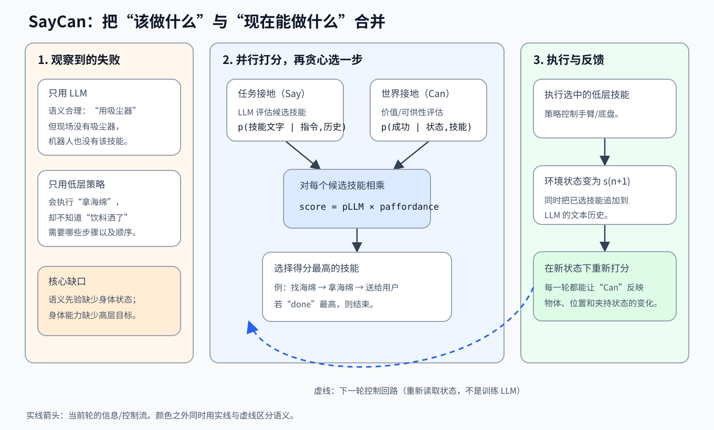

> **公开入口：** [arXiv](https://arxiv.org/abs/2204.01691) · [PDF](https://arxiv.org/pdf/2204.01691v2) · [TeX 源码包](https://export.arxiv.org/e-print/2204.01691) · [代码](https://github.com/google-research/google-research/tree/master/saycan) · [项目页](https://say-can.github.io/)
>
> 文中的 `source/...:Lx–Ly` 对应解压后的 arXiv TeX 源码坐标；博客不镜像原论文文件。

> 论文：*Do As I Can, Not As I Say: Grounding Language in Robotic Affordances* (CoRL 2022)
>
> 阅读标记：**论文事实**表示作者明确写出或测量的内容；**脉络解释**表示根据论文相关工作做的归纳；**我们的解释/判断**是为帮助理解而补写的机制、例子和评价，不代表论文已证明。

## 一句话结论

**SayCan 把语言模型对“下一步有没有用”的评分，与机器人对“当前状态下做不做得成”的评分相乘，每次只执行得分最高的技能，然后在新状态下重新规划。**（论文事实；PDF p.5；`source/main.tex:L274–290`）

## 先建立心智模型

把 LLM 想成一位看过很多生活攻略、却看不到现场的“远程指挥员”；把可供性函数想成一位只会报告现场条件的“执行员”。指挥员知道洒了饮料要找清洁工具，执行员知道眼前有没有海绵、能不能抓起来。SayCan 就是让两人对每个候选步骤各打一个分，再选兼顾目标与现实的那一个。

这个类比的边界是：两个“人”都是可出错的模型，而且乘积得分并不自动等于经过严格校准的真实成功率。

### 必要概念

- **技能（skill）与策略（policy）**：技能是“拿起苹果”这样的短任务；策略是把视觉观测转成手臂、夹爪和底盘动作的低层控制器。实现中动作可来自行为克隆（BC）或强化学习（RL）（论文事实；`source/main.tex:L306–315`）。
- **可供性（affordance）**：状态提供给一项动作的可能性。文中用技能的值函数估计“从状态 (s) 出发，执行技能 π 会成功吗”（论文事实；`source/main.tex:L198–208`）。
- **任务接地（task-grounding）**：LLM 给技能文字标签的下一步适切性。**世界接地（world-grounding）**：可供性给该技能的当前可执行性。两者分别回答“该不该”和“能不能”。
- **零样本高层组合**：测试指令不用再训练一个新策略；它仍依赖事先学好的低层技能和少量提示示例，所以“零样本”不等于机器人从未学过任何动作。

## 失败、机制与方案

### 观察到的失败

**论文事实。** 用户说“我把饮料洒了，能帮忙吗？”，纯 LLM 可能回答“用吸尘器”或“叫清洁工”。语句在文本世界合理，但机器人现场没有对应物体或技能。只用提示工程可以让 LLM 拆步，却不会自动知道机器人的能力和当前环境（PDF p.2；`source/main.tex:L150–154`）。

**我们的机制解释。** 失败点不在语言不流畅，而在决策分布缺了两个条件：当前状态 (s) 和具体机器人的技能集 Π。纯生成会在开放文本空间里找“像答案的话”，机器人需要在封闭候选技能里找“现在能完成目标的下一步”。

### 别人怎样处理这类问题

**脉络解释。** 论文将先前方法分成三条线：多模态模型把视觉/环境输入接入语言模型，或让模型直接输出动作；语言条件模仿学习与 RL 学低层行为；经典任务-运动规划用显式原语和约束保证可行性。同期的 LLM 规划工作可以从提示中生成长计划，但没有额外的物理接地机制（论文对相关工作的归纳；`source/related.tex:L1–21`）。SayCan 选择一个小介入：保留 LLM 的常识排序，用已学得值函数在选择时加上具身约束。

下图把问题、当前轮决策和反馈放在同一张图中。

**图 1｜SayCan 的问题—机制—反馈。** 左侧显示纯 LLM 缺少现场约束、纯低层策略缺少高层语义；中间对固定候选技能同时计算语言适切性和当前可执行性，并选取乘积最大者；右侧表示低层策略改变环境后，系统在新状态下重新决策。虚线是跨决策步的控制回路：本论文没有用机器人的结果在线更新 LLM 参数。图为我们根据算法重画，不是论文原图。

### 本文方案的数据流

1. 输入高层指令 (i)、当前状态 (s_n)、技能集 Π 及每个技能的文字标签 ℓπ。
2. 对每个候选技能，LLM 在指令和已选历史上评分；可供性函数在当前观测上评分。
3. 两分相乘，取 argmax，执行对应低层策略。
4. 把已选技能追加到文本历史，从新状态继续，直到“done”获选（论文事实；`source/main.tex:L274–290`）。

请用“饮料洒了”手推前三轮：第一轮“找海绵”同时具有语义适切性和导航可行性；到达后，物体进入视野，“拿海绵”的可供性上升；夹住后，“送给用户”变得可行。语义目标没变，下一步却因状态改变而改变。这正是逐步重评分的作用。如果删掉状态相关的可供性，三个步骤只能依赖文本顺序，无法判断海绵是否真的在场、是否已经被夹住。

## 关键公式：从概率直觉到可执行选择

### 0. LLM 怎样给一个固定候选项打分

语言模型把一段文本 (W=(w_0,\ldots,w_m)) 的概率按链式法则展开：

$$
p(W)=\prod_{j=0}^{m}p(w_j\mid w_0,\ldots,w_{j-1}).
$$

在常见聊天用法中，系统会从这个分布采样或选最可能的自由文本。SayCan 已经知道机器人只能执行哪些技能，因此不让 LLM 任意发明动作，而是把每个技能标签接到同一个提示后面，读出该固定补全的概率。这一操作把开放文本生成变成有限集排名（论文事实；`source/main.tex:L177–183, L223–228`）。

**边界。** 候选项是多 token 字符串，所以评分会受标签措辞、长度和提示格式影响。附录报告，步骤编号、分行、物体在示例中的出现频次，甚至冠词与拼写都会改变结果。50 条语言模拟指令上，不给示例且必须正确终止时规划率为 10%；使用论文的 17 个示例时为 88%（论文事实；`source/main.tex:L891–930`）。这项实验证明提示是系统组件，也提醒我们：方法并非对候选标签的任意表述都稳定。

### 1. 乘积评分

论文的核心选择是

$$
\pi_n=\arg\max_{\pi\in\Pi}
p(c_\pi=1\mid s_n,\ell_\pi)\;
p(\ell_\pi\mid i,\ell_{\pi_0},\ldots,\ell_{\pi_{n-1}}).
$$

**大白话目的。** 一个步骤要同时“对目标有用”和“现在做得到”；任何一边接近零，它就不应该获选（PDF pp.3–5；`source/main.tex:L207–244`）。

**符号账本。** Π 是有限技能集；π 是一个低层策略；ℓπ 是它的文字名；(s_n) 是第 (n) 轮状态；(c_π∈{0,1}) 表示技能是否成功；第一项是可供性，第二项是 LLM 对下一个文本步骤的条件概率。

**补写推导。** 我们想排序“技能对指令产生进展”的概率。对技能是否成功 (c_π) 分情况：

$$
P(\text{进展})=P(\text{进展}\mid c_\pi=1)P(c_\pi=1)+P(\text{进展}\mid c_\pi=0)P(c_\pi=0).
$$

论文假设技能失败时进展概率为 0，并用 LLM 的标签适切性近似成功后对目标有用的概率，因而留下两项乘积。这是带强假设的排序解释，不是对两个事件无条件独立的声称。

**玩具例子。** 任务是“把苹果放到桌上”。LLM 给“拿苹果” 0.60，但机器人还离苹果很远，可供性只有 0.20，乘积为 0.12；“找苹果”的两分是 0.40 和 0.90，乘积为 0.36，因此先导航。到达后重新计算，“拿苹果”的可供性可以升高。这些数是教学例子，不是论文实验数据。

**边界检查。** 某项为 0 就形成硬否决；两项都相同时退化为单独依赖另一项。评分若未校准，乘积的数值不能当作任务总成功率。附录明说值函数需经验校准，且实际系统混用学习值函数、距离和规则：放置的可供性固定为 1.0，终止固定为 0.1（论文事实；`source/main.tex:L847–885`）。

### 2. 为什么值函数能当可供性

论文先学 (Q^π(s,a))，再用 (v(s)=\max_a Q^π(s,a)) 表示当前状态下这项技能最好能做到什么（`source/main.tex:L866–872`）。当奖励只有终局成功 1、失败 0，且不折扣时，回报的期望就是成功的概率：

$$
V^\pi(s)=\mathbb E[R\mid s,\pi]=1\cdot P(\text{成功})+0\cdot P(\text{失败})=P(\text{成功}).
$$

这个等式在折扣因子小于 1、有中间奖励或值估计未校准时不再严格成立。主文列出 TD 残差，但没写常见的平方/绝对损失；附录另说实际 Q 更新因二元奖励使用 log loss。复现时应依实现说明，不应将主文的未平方式子自行当成完整训练目标（论文事实与我们的复现判断；`source/main.tex:L185–191, L786–799`）。

## 可证伪预测

1. **若失败确由缺少当前世界状态造成，**去掉值函数后，尤其在同一指令但起始状态不同的 embodiment 任务上，规划应明显下降。若不下降，则可供性可能没有提供额外信息。
2. **若 LLM 负责语义拆解，**在技能和可供性不变时，更强的 LLM 应提高规划，但不保证消除低层执行失败。
3. **若高层规划不能补救脆弱技能，**新技能的规划率可以很高，执行率仍会被操作策略卡住。

## 实验：每组数字究竟检验什么

**论文事实。** 主实验在一个训练技能用的模拟办公厨房和一个真实办公厨房中进行，涉及 15 个物体、5 个语义位置、7 类共 101 条指令，最长超过 10 个技能步。计划成功率由 3 位评估者判断技能序列是否可完成指令；执行成功率由 3 人看视频判断机器人是否完成任务，两项都以至少 2 人同意为成功（PDF pp.6–7；`source/main.tex:L367–431`）。

| 要检验的主张 | 受控比较与指标 | 精确结果 | 能说明什么，不能说明什么 |
|---|---|---|---|
| 整体系统能处理多类高层指令 | PaLM-SayCan；规划/执行成功率 | 模拟厨房 84%/74%；真实厨房 81%/60% | 支持在这 101 条指令和两个相似厨房中的可行性；真实厨房执行下降 14 个百分点，不能推出跨家庭泛化（PDF pp.7、9；`source/main.tex:L435–436, L542–547`） |
| 世界接地有用 | 完整方法 vs No VF；规划成功率 | 84% vs 67%；embodiment 子集 64% vs 18% | 符合“状态信息对起始情况变化最有用”的预测；但多个技能的可供性是规则/距离而非统一学得（PDF pp.8–9；`source/main.tex:L512–517, L538–547, L847–885`） |
| LLM 贡献了高层拆解 | 完整方法 vs 直接把整句指令给 BC，或用句向量投影；执行成功率 | 74% vs 0% vs 9%；后者只在单技能子集达到 60% | 说明组合任务不是近义句匹配可解决；两基线也没有与 SayCan 完全相同的规划界面（PDF pp.8–9；`source/main.tex:L505–509, L529–547`） |
| 更强 LLM 会改善机器人系统 | 同一 SayCan 中 PaLM 540B vs FLAN 137B；规划/执行 | 84%/74% vs 70%/61% | 支持底层模型变更可传导到系统；不能只归因于参数量，因为训练数据与微调也不同（`source/main.tex:L556–595`） |
| 新技能易于接入，但执行仍是瓶颈 | 加入抽屉技能后的 21 条查询；规划/执行 | 100%/33% | 高计划率与低执行率直接暴露低层操作失败；这不是完整方法的扩展性胜利（`source/main.tex:L608–611, L984–1005`） |

**误差结构。** 长时域子集的规划/执行是 73%/47%，常见问题是 LLM 过早选择终止；全部规划错误中，65% 被归为 LLM 失败，35% 被归为可供性失败（PDF p.8；`source/main.tex:L486–495, L540`）。论文没有报告置信区间、重复试验方差或评估者一致性，因此几个百分点的差异不应解读为已证实的统计优势（我们的实验审计）。

## 优点、缺点与适用边界

**思想优点。** 接口极小：每个技能只需文字名、策略和可供性。语义知识与控制能力可分开更换，技能序列也比端到端连续动作容易查看。

**实验优点。** 作者同时测了计划和执行，还分别去掉语言和可供性，使两类失败可区分。真实厨房结果让读者看到域偏移主要压低了执行。

**机制缺点。** 贪心乘积没有显式搜索未来，早期的小错会累积；LLM 历史只记录选了什么，不一定知道技能是否真的成功。论文本身也承认，当高值技能失败或环境改变而反馈未进入下一步时，系统不容易反应（`source/main.tex:L635`；`source/long_conclusion.tex:L14–20`）。

**工程缺点。** 可供性不是一个统一学习模型：抓取用校准值函数，导航用距离，放置固定为 1，还有“已完成就限制”的逻辑。这些选择实用，但使“价值函数接地”的纯粹性弱于概念图（论文事实与我们的判断；`source/main.tex:L847–885`）。

## 复现建议

1. 先在小环境定义可穷举的技能集、自然语言标签和明确的“done”，不要先追求大规模机器人数据。
2. 实现候选评分而非开放生成，记录每轮 LLM 分、可供性分、乘积和实际执行结果。
3. 用留出执行轨迹校准可供性；同时报告排序性能和概率校准，因为 argmax 正确不等于数值可解释。
4. 先复现三个受控比较：完整法、No VF、不用 LLM 的语义投影基线；按起始状态变化和计划长度分层报告。
5. 开源版使用 UR5、CLIPort 策略、ViLD 物体检测器代替值函数、GPT-3 作为 LLM，它能验证接口，不能等价复现 PaLM 移动操作机器人的主结果（论文事实；`source/main.tex:L637–644`）。

## 自解释与思考题

1. 在玩具例子中，若“拿苹果”的可供性被高估为 0.9，机器人会怎样失败？下一轮的输入能否告诉 LLM 刚才失败了？
2. 相乘暗含了什么校准和因果假设？改成对数加权和会使哪一类技能更容易获选？
3. 为什么 100% 的抽屉规划只带来 33% 执行？这个反例对“规划模型更强就能解决机器人任务”有什么限定？
4. 如果两个技能的当前乘积相同，一个是稳健的小进展，另一个是高风险的大进展，SayCan 的单步分数足以做选择吗？
5. 请设计一个只改变“物体是否可见/可抓”的对照实验，分别预测 SayCan 和 No VF 的技能序列。哪个结果会推翻“值函数提供了当前世界接地”这一解释？
