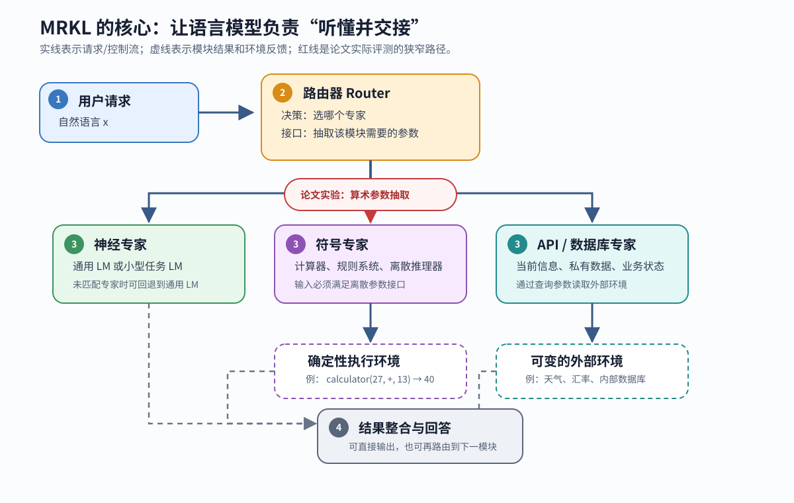

> **公开入口：** [arXiv](https://arxiv.org/abs/2205.00445) · [PDF](https://arxiv.org/pdf/2205.00445v1) · [TeX 源码包](https://export.arxiv.org/e-print/2205.00445)
>
> 文中的 `source/...:Lx–Ly` 对应解压后的 arXiv TeX 源码坐标；博客不镜像原论文文件。

> Karpas et al., *MRKL Systems: A modular, neuro-symbolic architecture that combines large language models, external knowledge sources and discrete reasoning*, arXiv:2205.00445v1, 2022。本文的论文事实均回查了 19 页 PDF 和 TeX 源码；定位使用 PDF 页码与 source/main.tex 行号。

## 一句话结论

MRKL 最值得记住的是一种系统分工：让语言模型理解请求、选择专家并翻译接口，把精确计算、实时信息和私有数据交给计算器、API 或数据库。这个概念贡献很强，但论文只对“已选中计算器后的参数抽取”做了合成算术实验，没有验证多模块端到端路由、动态知识或多步组合。（论文事实：PDF pp. 4–5, 8–14；TeX:121–175, 238–420）

## 1. 先认识四个基本概念

- **MRKL** 是 Modular Reasoning, Knowledge and Language 的缩写，指一套可扩展的神经—符号模块化架构。它包含路由器和一组专家模块。（PDF pp. 3–4；TeX:115–133）
- **路由器（router）** 读取自然语言输入，决定该交给哪个专家；模块输出可以直接成为系统输出，也可再路由给另一模块。（PDF p. 4；TeX:121）
- **专家（expert）** 既可以是通用或小型专用语言模型，也可以是计算器、货币转换器或数据库 API 这样的符号模块。（PDF p. 4；TeX:125–133）
- **神经—符号交接** 是把含糊、多样的语句变成模块所需的离散参数。例如“二十七加十三是多少”需转换成“计算器，加法，操作数 27 和 13”。论文将这种参数抽取视为主要工程代价。（PDF pp. 5–7；TeX:179–203）

一个有用的日常类比是医院分诊：总台听懂病人的叙述，把他送到合适科室，并填好该科室需要的信息。类比的边界在于：MRKL 路由器的错误不只是“去错科室”，还可能是科室正确但参数填错；多模块组合还会让错误逐步累积。

## 2. 论文观察到什么失败？

> **论文事实。** 作者归纳了四类问题：静态预训练模型缺少当前信息；无法访问企业私有信息；神经模型在算术等离散推理上不可靠；每个任务单独微调又导致模型数量和重训成本膨胀。作者用大整数加法的错答说明第三类问题，并举汇率、股价、天气和客户名单说明前两类信息差距。（PDF pp. 2–3；TeX:74–109）

> **我们的判断。** 这四类失败并不共享一个成因。前两类是数据可达性和时效性问题，算术是计算归纳偏置和精确性问题，模型膨胀是部署与持续扩展问题。MRKL 用同一个系统边界包住它们，是架构上的统一，不是证明这些问题已被同一实验解决。

## 3. 失败的机制解释

单个语言模型把三件性质不同的事混在参数里：理解句子、存储世界信息、执行确定计算。参数是训练时历史数据的压缩，因而不会自动知道今天的汇率；令牌预测是近似生成，因而不提供计算器式的精确规则保证。作者的机制性主张是：把语言理解留给神经模型，把动态状态留在外部环境，把确定计算留给符号模块，再用路由器完成交接。（PDF pp. 2–5；TeX:85–151, 179–203）

真正的瓶颈随之转移：计算器不会算错 `27+13`，但路由器可能把“二十七”读成 17，把“少了”读成加法，或忽略括号优先级。因此，专家执行的确定性不会自动变成整个系统的可靠性；接口抽取是新的失败点。论文也明确说，调用符号方法时应追求合理稳健性，但不应期待语言理解永不出错。（PDF pp. 5–7；TeX:181–203）

## 4. 以前的解法改变了哪一环？

1. **直接用大模型生成答案**：一套参数通过预训练承担语言、知识和计算。它的假设是扩大训练可以覆盖目标能力；作者认为这无法给动态数据和算术精确性提供合适的系统保证。（PDF pp. 2–3；TeX:85–109）
2. **每个任务微调一个模型**：改变模型参数来换取专业性，代价是服务多套大模型。（PDF p. 3；TeX:101–109）
3. **多任务/指令微调**：把许多任务合并训练到一个大模型。论文称当时的代表性工作已达 `100+` 个任务，但增加新任务可能需要为避免灾难性遗忘而重训整个任务集。（PDF p. 3；TeX:107–109）
4. **搜索或计算器的简单规则入口**：明确的 `3-1=?` 很容易触发计算，但同义表达、文字数字和常识隐含的运算使规则迅速变脆弱。论文用搜索引擎对明确算式与自然表达的对比作为定性例子，不是受控实验。（PDF pp. 5–7；TeX:184–201）

## 5. MRKL 怎样解决：输入、决策、动作、反馈

图 1 先把论文的架构主张与实际实验范围画在同一条数据流上。



**图 1｜MRKL 的系统数据流与证据边界。** 实线是请求与控制流，虚线是专家结果或外部环境反馈。路由器先选择专家，再把自然语言翻译为该专家的离散参数；结果可直接输出，也可继续路由。红色路径是本论文的实验范围：基本算术的参数抽取。其他路径来自作者的架构定义与主张，没有在本文提供相应的端到端数字。（PDF pp. 4–5, 8–14；TeX:121–175, 238–420）

按图 1 可将一轮执行重建为五步：

1. **输入**：用户给出自然语言请求。
2. **状态**：本文没有定义持久记忆；对 API/数据库而言，当前状态位于外部环境，而不是冻结在语言模型参数中。（PDF pp. 2, 4；TeX:89–95, 147–149）
3. **决策**：路由器选择通用 LM、专用 LM、计算器或 API；论文没有给出这个选择器的训练和评估方法，并明确将“如何智能路由”留待单独讨论。（PDF p. 5；TeX:171–175）
4. **动作**：路由器抽取操作和操作数，专家执行。算术实验中计算器负责实际计算，因而错误归因于传错操作或操作数。（PDF pp. 7–8；TeX:201–203, 248–250）
5. **反馈与输出**：模块返回结果，系统可以输出该结果或路由到另一模块。论文提出了组合性，但没有展开一个可复现的多步实例。（PDF p. 4；TeX:121, 151）

## 6. 一个最小例子：读者先猜一步

请求是：“我有二十七个球，又拿到 13 个，现在多少个？”先别往下看：路由器的下一步应是生成答案，还是生成工具调用？

正确的交接是：选择计算器，抽取 `operation=add, a=27, b=13`，计算器返回 `40`，再把结果表达为自然语言。大白话说，语言模型不必背出 27+13；它必须判断“又拿到”对应加法，且不能把中文数字解析错。若删掉符号模块，模型又要承担精确计算；若删掉神经路由器，一组手写规则又很难覆盖“又拿到”、“收到”、“多了”等表达变体。

这个例子也暴露一个未测边界：论文的数据由少量结构化模板生成，主要变化是位数、数字/单词表示、四则运算、操作数量和括号。开头举的常识型故事题并未出现在报告的定量实验中。（PDF pp. 6–8, 15–17；TeX:195–236, 484–572）

## 7. 可证伪预测

核心机制预测是：**若错误主要来自语言到精确操作的交接，那么保持同一语言模型和同一测试集，只把“直接生成数值”换成“抽取参数+确定性计算器”，长位数上的错误率应大幅下降；但同义改写和嵌套语法上的错误仍会留在参数抽取端。**

论文的位数实验与前半句一致：只见一位数训练的 MRKL 设置在 1–9 位加法上均为 1.0，乘法只在 6 位时为 0.98；论文引用的 GPT-3 直接答题结果在 2–5 位加法上从 1.0 降至 0.093。不过两者的提示条件和系统边界不同，因而它更像机制演示，不是公平的端到端基线对比。（PDF p. 9；TeX:252–273）

更严格的可证伪测试应将路由错误、参数抽取错误、工具执行错误和最终表达错误分开计数。若工具路径在接口完全正确时仍不优于直接生成，或增加专家后旧任务显著退化，那么“确定性模块带来稳健性”或“模块化可无害扩展”的强版主张就不成立。

## 8. 公式证据有限：这篇应读“接口”，不应硬推导

论文没有给出路由概率、目标函数、损失函数或多步组合的定量方程；TeX 中也没有可推导的公式环境。文中的 `A+B*C` 等式子只是合成算术任务的标签，不是 MRKL 的学习理论。（PDF pp. 12, 16–17；TeX:357–393, 513–572）

为了精确说清接口，可以用下面的**我们的伪代码形式化**，它不是论文公式：

```text
request x
  -> router selects module m
  -> router parses arguments a that satisfy m's schema
  -> result y = execute(m, a)
  -> return y, or route y to another module
```

关键约束是 `a` 必须满足模块 `m` 的参数类型、顺序和语义。对减法而言，`(27, 13)` 和 `(13, 27)` 会产生不同结果；对两步表达式而言，`(A+B)*C` 和 `A+B*C` 的括号就是接口语义的一部分。因而“选对计算器”只完成了一半，必须另外验证参数。

## 9. 实验在检验哪条主张？

| 实验 | 受控变化与指标 | 主要结果 | 能说明什么／不能说明什么 |
|---|---|---|---|
| 位数外推 | 只用一位数训练，测 1–9 位；指标为最终答案准确率 | 加法全为 1.0；乘法仅 6 位为 0.98 | 支持“把计算交给计算器后，长位数不再是主瓶颈”；不支持任意语言表达。（PDF pp. 8–9；TeX:252–273） |
| 数字与单词 | 训练/测试分别用数字或英文单词 | 数字→单词 0.156，单词→数字 0.987，单词→单词 0.988 | 揭示表示变换的强方向不对称；“近乎完美”不能无条件外推。（PDF pp. 9–10；TeX:278–300） |
| 问句格式 | 只用 format 0 训练，测其他 4 种模板；4 种运算 | 多数接近 1.0；非问句 format 4 的减法为 0.863±0.237，除法为 0.727±0.465 | 说明部分模板转移成功，同时暴露很大的运行间方差。（PDF p. 10；TeX:304–325） |
| 运算类型转移 | 只训一种运算，测加减乘除 | 对角线均 `>0.99`；其他组合从 0.183±0.196 到 0.987±0.023 | 证明并非所有操作都可零成本迁移，除法尤其难。（PDF pp. 10–11；TeX:327–349） |
| 29 种两操作式 | 14/15 种式随机分为训练/测试，重复 10 个随机划分 | 22/29 种准确率超过 90%；最低三项为 0.288、0.406、0.562 | 支持部分结构组合，也显示括号和嵌套语义会失败。（PDF pp. 11–12；TeX:351–393） |
| 一步到两步 | 用四种单操作训练，测 16 种无括号两操作组合 | 加—乘 0.01±0.017，减—乘 0.202±0.247，减—除 0.224±0.213；多个其他组合接近 1.0 | 强烈否定“见过所有原子操作就自然会组合”的强主张。（PDF pp. 11–13；TeX:397–420） |
| few-shot 对比 | 同测试集；10 个示例的 few-shot 对 prompt tuning | 9 位英文单词加法：0.0 对 0.98；format 4：0.22 对 0.993；数字加法两者均为 1.0 | 说明结构化训练在某些分布外表达上有用，不是所有算术条件都优于 few-shot。（PDF p. 14；TeX:434–479） |

实验使用 70 亿参数 J1-large，配 10 个 prompt token，学习率 0.3、batch size 32。实验 1–2 训练 3000 步；其他实验用 0.001 线性权重衰减，按验证集选 checkpoint，运行 3–5 次并报均值±标准差。作者声明训练和测试问题无重叠，包括排除同一底层算式的不同措辞。（PDF p. 8；TeX:238–246）数据量因实验而异：例如格式迁移实验用 400 个 format 0 训练样本，每种格式的 dev/test 各 200 个；单操作到两操作实验用 700 个单操作训练样本，每个两操作组合的 dev/test 各 210 个。（PDF pp. 15–16；TeX:575–597）

## 10. 结果支持到哪里？

> **论文事实。** 数据增强由一组模板的结构化空间生成，覆盖 1–9 位操作数、数字/英文单词、加减乘除、1–2 个操作以及括号位置。单操作有 5 类措辞，两操作选了 29 种自然语言式。（PDF pp. 7–8, 15–17；TeX:223–236, 484–572）

> **我们的判断。** 证据足以说明“语言模型可以通过针对模块接口的结构化训练，高准确率抽取某些基本算术参数”。证据不足以推出：路由器能在多个真实工具间稳定选择；系统能可靠访问动态/私有数据；多跳链路能正确组合；新增模块一定不伤害旧任务；模块调用本身构成完整的因果解释。论文称 Jurassic-X 已由少数合作伙伴试用，但没有给出试用任务、样本量或结果。（PDF pp. 4–5；TeX:137–168）

论文报告了部分实验的运行间标准差，但没有置信区间、显著性检验、随机种子或真实用户分布。“近乎完美”应限定在已测合成模板内，尤其不能略过 format 4 除法的 0.727±0.465 和一步到两步中的 0.01±0.017 这些反例。（PDF pp. 10, 13；TeX:304–325, 397–420）

## 11. 优点与缺点

### 思想与机制

**优点。** MRKL 把“模型什么都自己算”改成“模型负责选择和翻译，专家负责执行”，因而把不同能力的可测边界显式化。新工具可以有独立数据和接口测试，动态信息可留在环境中更新。这些是有清晰因果链的设计优势。

**缺点。** 可靠性从“模型算不准”转移为“选错工具或传错参数”。安全回退到通用 LM 可避免无回答，却不等于回答安全；模块调用记录可提供来源线索，却不必然证明路由决策正确。作者列出的回退、扩展性、可解释性、时效信息、私有知识和组合性是架构主张，本文没有分别建立实验。（PDF p. 4；TeX:137–153）

### 实验

**优点。** 实验没有只报同分布准确率，还主动改变位数、表示方式、问句模板、运算类型和操作数量，且报告了多个明显失败格子。这使我们能看到能力发生在哪个接口边界。

**缺点。** 模板生成数据的语义和句法多样性远低于真实请求；没有人类标注的自然改写、噪声、多意性、不可执行参数或工具失败。GPT-3 表格来自既有论文，与 MRKL 设置的提示和执行链不同；因而它不是等条件消融。最重要的缺口仍是没有比较“正确选工具+正确传参+正确返回”的端到端成功率。

### 工程实现

**优点。** 模块接口允许独立更新数据源、替换执行器和进行单元测试；确定性工具能把操作日志留下来。

**缺点。** 论文没有提供 Jurassic-X 的代码、路由器细节、接口 schema、延迟/成本、权限与隔离、API 超时、参数校验或多步错误恢复方案。开源链接指向合成数据，而不是完整系统。（PDF pp. 4, 8；TeX:159–168, 223–246）

## 12. 复现建议与思考题

最小忠实复现应先限定为算术参数抽取：根据附录的 5 种单操作模板和 29 种两操作表达生成数据，严格防止同一底层算式跨 train/test；固定 J1-large 类型的冻结语言模型，只学 10 个 prompt token；将专家选择设为“已知为计算器”；分别记录运算符、操作数、括号和最终答案的正确率。这样测的是论文真正实现的主张，不会悄悄加入新路由启发式。（参数与数据量：PDF pp. 8, 15–17；TeX:223–246, 484–597）

若要检验完整 MRKL 假设，那是新的实验阶段：至少应加入通用 LM、计算器和一个动态 API，对同一批混合请求分解工具选择、参数、执行和最终回答四类错误，并在新增专家前后重测旧任务。这一实验才能直接检验论文提出但未验证的路由和扩展性主张。

**思考题**

1. 当路由器不确定时，直接回退到通用 LM 和请求用户澄清，哪一个更“安全”？这取决于什么损失？
2. 若计算器返回正确数值，但系统在最终表达时改错了数字，应把错误归到哪个组件？
3. 表 6 中加—乘为 0.01±0.017，而乘—加为 0.996±0.005。这个顺序不对称更像是运算概念问题，还是句法模板问题？如何只改一个因素来区分？（PDF p. 13；TeX:397–420）
4. 模块调用日志证明了“系统怎样得到答案”，它能否证明“系统为什么应该这样做”？

---

### 证据定位索引

- 架构、专家类型与六项声称优势：PDF pp. 3–4；`source/main.tex:115–153`。
- 路由问题未展开，参数抽取被选为本文问题：PDF pp. 5–7；`source/main.tex:171–217`。
- 数据生成、训练设置与五组实验：PDF pp. 7–13；`source/main.tex:223–420`。
- few-shot 对比：PDF p. 14；`source/main.tex:434–479`。
- 模板、两操作式和各实验数据量：PDF pp. 15–17；`source/main.tex:484–597`。
