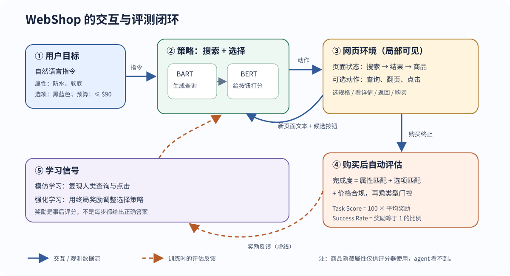

> **公开入口：** [arXiv](https://arxiv.org/abs/2207.01206) · [PDF](https://arxiv.org/pdf/2207.01206v4) · [TeX 源码包](https://export.arxiv.org/e-print/2207.01206) · [代码](https://github.com/princeton-nlp/WebShop) · [项目页](https://webshop-pnlp.github.io/)
>
> 文中的 `source/...:Lx–Ly` 对应解压后的 arXiv TeX 源码坐标；博客不镜像原论文文件。

> **一句话结论。** WebShop 最值得记住的是一套可扩展的科学装置：它把真实商品文本、自然语言需求、多页面操作和可自动计算的目标完成度接成闭环，因而能够研究“语言理解如何真正落到连续行动上”；论文中得分最高的模型仍与人类专家有很大差距（PDF p.8；`source/text/experiments.tex:18-19`）。

## 1. 先把基本概念说清楚

**语言落地（language grounding）**指语句不只被当作字符串，其含义还要约束 agent 对外部环境的行动。“黑蓝色、防水、软底、不超预算”必须分别影响搜索词、商品比较、颜色按钮和最终购买。

**部分可见马尔可夫决策过程（POMDP）**是本文的任务骨架。真实状态是当前网页，agent 只看到当前页面的简化文本与可点按钮，不直接看到评分用的隐藏属性。页面包括搜索、结果、商品和详情四类；动作包括输入查询以及点击翻页、商品、规格、详情、返回和购买等文本按钮（PDF p.4；`source/text/benchmark.tex:17-26`）。

**BM25、模仿学习（IL）与强化学习（RL）**分别承担检索、冷启动和奖励优化。BM25 根据词项匹配返回候选商品；IL 学人类曾经搜什么、点什么；RL 再用终局奖励调整决策。这三者不是同一件事：检索引擎决定“看得到哪些候选”，策略决定“看到后怎么走”。

## 2. 观察到的失败与机制解释

### 旧设定在哪里卡住

**论文事实。** 早期网页 benchmark 要么只做一次分类，要么每个 episode 只有少量页面，要么把动作限制为跟随链接；更长的开放网页任务又往往需要人类反馈。WebShop 针对的具体失败是：把一句用户需求原样丢给搜索引擎，然后买第一个结果，无法正确处理规格、同义表达和多商品比较（PDF pp.2-3, 6；`source/text/related_work.tex:5-17`；`source/text/method.tex:7-11`）。

**我们的机制解释。** 失败不只是编码器“不够大”，而是四个环节串联后的误差累积：查询未改写会让正确商品不在候选中；页面文本噪声会破坏属性和规格对齐；只贪心选当前最高分按钮容易在页面间循环；没有显式记忆时，看过多个商品也难以回头做比较。作者的轨迹分析同样指向查询重写、稳健语义匹配、探索和长期记忆（PDF pp.8-9；`source/text/experiments.tex:47-56`）。

### 别人怎样改这条链

**跨论文解释。** 相关方法改动的环节各不相同：查询重写改变“用什么词找”；工作流引导与探索奖励改变“哪里值得试”；DOM 或超文本表示改变“页面怎样编码”；外部记忆改变“看过的东西怎样留下”。它们都假设该环节才是当前瓶颈。WebShop 的价值是把这些瓶颈放进同一条长程轨迹中，使研究者可以做受控比较（PDF pp.3, 5；`source/text/related_work.tex:5-17`；`source/text/benchmark.tex:120-122`）。

## 3. WebShop 怎样把问题做成可训练环境

### 环境是怎样建出来的

**论文事实。** 作者抓取了 `amazon.com` 上 1,181,436 个商品，覆盖时尚、美妆、电子、家具和食品；主文说使用 113 个子类别查询，附录则写 313 个，这是原文内部不一致（PDF pp.5, 12；`source/text/benchmark.tex:81`；`source/appendixtext/env.tex:7`）。商品文本平均长度为 262.9，共有 842,849 个唯一选项（PDF p.5；`source/text/benchmark.tex:81`）。

检索引擎离线建立 BM25 索引，将标题、描述、概览和定制选项拼接成商品文本；每次搜索最多展示 50 个结果，分成每页 10 个的若干页面。直接搜索完整指令时，目标商品在首页的比例为 32.2%，排名超出可见结果的比例为 56.1%。这直接说明查询重写不是锦上添花（PDF p.4 图 2, p.16；`source/appendixtext/env.tex:30-33`）。

作者对商品标题与描述的二元词组计算 TF-IDF，每个大类人工检查排名靠前的 200 个词组，最终得到 670 个隐藏属性。众包工作者看到目标商品的标题、类别、属性和选项后写指令，共收集 12,087 条，平均 15.9 个词（PDF p.5；`source/text/benchmark.tex:89-96`）。这个生成过程使每条指令都有可机器核对的属性、规格和价格约束。

### 数据流、控制流与反馈

**图 1｜WebShop 交互与评测闭环（原创机制图）。** 蓝色实线是一次 episode 中的数据与动作流：用户指令进入策略，策略发出搜索或点击，环境返回新页面和可选按钮。购买后才计算终局奖励。橙色虚线是训练反馈，不代表测试时 agent 可查看隐藏属性。图中的指令示例、状态类型与指标定义来自 PDF pp.4-6 及 `source/text/benchmark.tex:17-63`、`source/text/method.tex:13-42`。

贯穿全文的最小任务是：用户要“黑蓝色、防水、软底、低于 90 美元的运动鞋”（PDF p.4；`source/text/benchmark.tex:47-52`）。agent 先要决定是否保留整句话，还是改写为更像商品标题的关键词；看到结果后，它要在“继续翻页”和“打开某商品”之间选择；进入商品页后还必须点对颜色规格才能购买。请在每一轮先预测 agent 会点什么，再问：“当前页面真的包含做决定所需的信息吗？”这个问题能帮你区分“理解错了”与“所需信息根本还没看到”。

**日常类比。** 这像让一位店员代购：他先把你的口语需求改成货架标签，再来回比较候选，最后核对尺寸、颜色和价格。类比的边界是：WebShop 中的转移和检索是确定的，动作是高层文本按钮，不需要处理广告弹窗、登录、库存变化或付款风险（PDF p.4；`source/text/benchmark.tex:23-45`）。

## 4. 关键公式：它们在系统里管什么

### 4.1 目标/属性匹配奖励

论文给出的终局奖励是（PDF p.5；`source/text/benchmark.tex:47-59`）：

$$
r=r_{\text{type}}\cdot
\frac{|U_{\text{att}}\cap Y_{\text{att}}|+|U_{\text{opt}}\cap Y_{\text{opt}}|+\mathbf{1}[y_{\text{price}}\le u_{\text{price}}]}
{|U_{\text{att}}|+|U_{\text{opt}}|+1}.
$$

**大白话目的。** 先计算用户提到的属性、规格和预算完成了几项，再用商品类型相似度做门控，避免“属性对了却买成另一类商品”。

**符号账本。** $U_{\text{att}}$ 和 $U_{\text{opt}}$ 是指令需要的属性集和选项集；$Y_{\text{att}}$ 和 $Y_{\text{opt}}$ 是已选商品拥有的集合；交集大小是匹配项数；指示函数在商品价格 $y_{\text{price}}$ 不超用户上限 $u_{\text{price}}$ 时为一，否则为零；$r_{\text{type}}\in[0,1]$ 用粗/细类别和标题字符串匹配估计商品类型（PDF p.18；`source/appendixtext/env.tex:45-58`）。分母是所有必需条件数，所以括号内是一个完成比例。

**逐步重建。** 令 $m_{\text{att}}=|U_{\text{att}}\cap Y_{\text{att}}|$、$m_{\text{opt}}=|U_{\text{opt}}\cap Y_{\text{opt}}|$，再令 $b$ 表示是否守住预算。指令一共提出 $|U_{\text{att}}|+|U_{\text{opt}}|+1$ 个可核对要求，已满足的是 $m_{\text{att}}+m_{\text{opt}}+b$个，两者相除就是要求完成率。最后乘 $r_{\text{type}}$ 相当于把“是不是这类东西”放在外层。这段是对论文公式的等价拆解，没有新增评分项。

**玩具手算（我们的示例）。** 假设需要两个属性和一个颜色选项，候选商品只匹配一个属性，颜色正确且不超预算，则完成比例为 $(1+1+1)/(2+1+1)=0.75$。类型正确时取 $r_{\text{type}}=1$，最终 $r=0.75$；若类型门控只给 $0.1$，奖励降为 $0.075$。

**边界检查。** 所有条件都满足且类型正确时 $r=1$；价格超标只会少一项，不会直接清零；类型门控为零时，其他条件再像也得零分。设计保证属性集非空，分母还固定加价格项，因此不会除零（PDF p.4；`source/text/benchmark.tex:47-51`）。

### 4.2 模仿选择与策略梯度

点击策略用人类动作的负对数似然训练：$\mathcal L_{\text{choose}}=-\mathbb E\log \pi_\theta(a^*\mid o,\mathcal A(o))$。$o$ 是当前观测，$\mathcal A(o)$ 是可点按钮集，$a^*$ 是人类点击。BERT 分别编码页面和候选动作，交叉注意力再给每个动作打分（PDF pp.6-7；`source/text/method.tex:22-30`）。若模型给人类动作的概率是 $0.7$，单样本损失约为 $-\ln 0.7=0.357$；概率趋近一时损失趋近零，趋近零时损失趋向无穷大。

RL 使用 $\mathcal L_{\text{PG}}=-\mathbb E[(R_t-V(o_t))\log\pi(a_t\mid o_t,\mathcal A(o_t))]$。$R_t$ 是从当前时刻往后的折扣回报，$V(o_t)$ 是价值基线，二者之差是“这步比预期好多少”。我们的玩具例子中，若 $R_t=0.75$、$V=0.45$、动作概率为 $0.2$，则损失项约为 $-0.3\ln0.2=0.483$，梯度会推高该动作概率；当 $R_t=V$ 时该项为零（PDF p.7；`source/text/method.tex:36-42`）。

## 5. 策略比较、可证伪预测与实验证据

### 比的是什么

数据被分为 10,587/1,000/500 条训练/开发/测试指令，所有人类与模型的主结果都在同一组 500 条测试指令上平均；IL 使用 1,012 条训练轨迹，另有 54 条开发集轨迹用于选超参与检查点（PDF p.7；`source/text/experiments.tex:3-6`）。对比包括原样搜指令并买首个结果的规则、IL、IL 后再 RL，以及去掉搜索预训练、选择预训练、图像或改成 RNN 的消融（PDF pp.7-8, 20；`source/text/experiments.tex:15-30`；`source/tabletext/image_ablation.tex:1-18`）。

**可证伪预测。** 如果主要瓶颈是“候选商品里选错按钮”，那么在查询不变时，用可访问隐藏奖励的选择 oracle 替代策略，成功率应大幅上升；若不上升，说明瓶颈更可能在搜索召回。实验中，使用原指令搜索时，oracle 将规则基线的成功率从 9.6% 提高到 85.4%；用人类最后一次查询时达到 87.8%。这支持“选择是主要瓶颈”，同时人类最后查询仍更好，说明搜索重写也没有被排除（PDF p.9；`source/text/experiments.tex:60-63`）。

### 主结果与人类差距

**论文事实。** 规则基线的 Task Score/SR 为 45.6/9.6%，IL 为 59.9/29.1%，IL+RL 为 62.4/28.7%。因此 RL 提高了平均完成度，却没有提高完全成功比例。人类专家为 82.1/59.6%，最高模型 SR 还不到专家的一半（PDF p.8 图 4；`source/text/experiments.tex:18-19`）。

分项结果解释了为什么：IL 的选项分为 45.2，IL+RL 降到 38.9；同时平均访问状态数从 9.4 降到表中的 4.5。正文另一处将后者写成 4.8，这是原文的小型数字不一致（PDF pp.8-9；`source/tabletext/breakdown.tex:7-20`；`source/text/experiments.tex:56`）。RL 把策略变得更贪心，早停带来更高属性、类型和价格分，但更少比较规格。人类专家平均查看 11.3 个状态、选项分为 73.9（PDF p.8；`source/tabletext/breakdown.tex:7-20`）。这些是轨迹相关证据，它不能单独证明“只要走得更长就会更好”。

模型在真实 Amazon 上的 IL+RL 得分/SR 为 65.9/25%，在 eBay 上为 62.3/21%；这项零样本迁移每个网站只用 100 条测试指令，且奖励由人工按原式评分（PDF p.10；`source/text/experiments.tex:89-121`）。它说明简化文本接口能迁移一些行为，不说明 agent 能安全完成真实付款：迁移界面只允许导航，提交表单与购买被拦住（PDF p.22；`source/appendixtext/limitation.tex:11`）。

### 实验审计：每组结果究竟检验什么

| 实验 | 受控变化 | 能够检验的主张 | 不能排除的因素 |
|---|---|---|---|
| 规则、IL 与 IL+RL 主比较 | 学习信号与预训练策略 | 人类示范显著改善任务，RL 优化总分与完全成功并不等价 | 架构、搜索和探索强度一起改变（PDF pp.7-8） |
| 去掉搜索或选择预训练 | 单个预训练部件 | 选择端的语言预训练更关键 | 从头训练也可能受样本量和优化难度限制（PDF p.8；`source/text/experiments.tex:21-25`） |
| 选择 oracle | 固定查询，穷举候选和规格 | 点击/选规格是可单独被识别的大瓶颈 | oracle 的巨大步数与隐藏信息不可实用（PDF p.9） |
| 真实网站迁移 | 替换商品数据和搜索引擎 | 简化文本接口下的策略有非零迁移能力 | 样本较小、人工评分，且实际购买被屏蔽（PDF p.10） |

## 6. 证据能支持到哪里

**思想上的优点。** 环境转移与任务指令/奖励分离，便于替换数据或任务；真实商品文本与高层语义动作让任务比像素点击更容易扩展；部分奖励使失败不只是一个零，可以分解为属性、选项、类型和价格问题。

**实验上的优点。** 论文同时比较规则、IL、RL、人类、模块消融、选择 oracle 和真实网站迁移，并把轨迹长度与奖励分项对起来。这比只报一个平均总分更容易定位瓶颈。

**工程上的优点。** 确定性检索引擎便于复现，OpenAI Gym 封装和 HTML/简化文本双视图降低了 agent 接入成本（PDF pp.4-5；`source/text/benchmark.tex:45,85`）。

**评测局限。** 奖励依赖从目标商品挖出的隐藏标签与精确字符串匹配，同义词会被低估，稀有选项又可能成为泄漏目标的捷径。作者对普通与专家轨迹各抽样 100 条人工复评：普通轨迹的自动/人工分为 74.9/76.3，Pearson 相关为 0.856；专家为 81.5/89.9，相关为 0.773。这表明自动分数近似可用且倾向低估，不等于它已完美代替人类判断（PDF p.18；`source/appendixtext/env.tex:67-90`）。

数据仅来自美国英文站点与若干商品大类，属性池包含人工筛选偏差；指令中的属性有时过于宽泛，选项有时又过于特殊。主切分是 i.i.d. 随机切分，没有测新品类、新语言或新站点样式下的系统性泛化（PDF pp.7, 22；`source/text/experiments.tex:5`；`source/appendixtext/limitation.tex:5-14`）。去掉图像后 IL 的平均得分仅从 60.6 变为 60.3，与当前指令和奖励主要依赖文本一致；因而该实验不能证明模型已具备强视觉理解（PDF p.20；`source/tabletext/image_ablation.tex:6-10`）。

## 7. 复现建议与思考题

**最小复现路径。** 先固定论文的数据切分和 BM25 索引，用规则基线核对 Task Score/SR；再只复现 BART 搜索与 BERT 选择的 IL，核对奖励分项和轨迹统计；最后才加 RL，专门检查平均得分上升时选项分与探索长度是否同步下降。IL 训练的论文配置是单卡约 2 小时，RL 的 Transformer 配置约 27 小时；这些是作者机器上的报告时间，不是现代硬件的保证（PDF pp.19-20；`source/appendixtext/exp.tex:7-13`）。

**自解释问题。**

1. 如果目标商品没有进入 BM25 的可见候选，更强的点击策略还能做什么？
2. 为什么 IL+RL 可以总分更高而完全成功率更低？请用奖励式和选项分回答。
3. 如果把精确属性匹配换成语义相似度，哪一类错误会减少，哪一类“看似相似但实际不合格”的错误可能增加？
4. 选择 oracle 的数百到数千步穷举不能作为实用 agent，但它为什么仍是有价值的科学对照（PDF p.9；`source/text/experiments.tex:60-63`）？

---

## 证据标记说明

文中“论文事实”来自上述 PDF 和 TeX 源码；“跨论文解释”是根据论文相关工作类别做的机制归纳；“我们的机制解释”与玩具计算是为帮助理解而补充，不是作者另外报告的实验结果。
