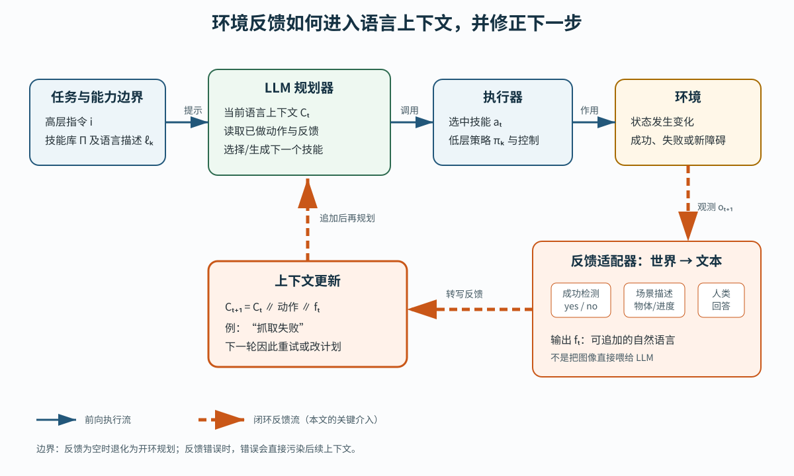

> **公开入口：** [arXiv](https://arxiv.org/abs/2207.05608) · [PDF](https://arxiv.org/pdf/2207.05608v1) · [TeX 源码包](https://export.arxiv.org/e-print/2207.05608) · [项目页](https://inner-monologue.github.io/)
>
> 文中的 `source/...:Lx–Ly` 对应解压后的 arXiv TeX 源码坐标；博客不镜像原论文文件。

> 论文信息：Wenlong Huang、Fei Xia、Ted Xiao 等；2022-07-12 首次公开；CoRL 2022；[arXiv:2207.05608](https://arxiv.org/abs/2207.05608)；[正式 proceedings](https://proceedings.mlr.press/v205/huang23c.html)；[项目页](https://inner-monologue.github.io/)。本地元数据未给出独立代码库地址。
>
> 证据版本：上述 PDF 共 25 页，SHA-256 `ecf30268add2af672291ad65b53c9fd87801f6490b0af195b12db1dedee0f2b9`；TeX 源码可读，公式自动抽取数为 0。
>
> 阅读提示：下文用 **[论文事实]**、**[跨论文背景]** 和 **[我们的判断]** 分开证据、研究脉络与解读。

## 一句话结论

**[论文事实]** Inner Monologue 没有训练一个新的端到端机器人模型，而是在每个技能执行后，把成功/失败、场景变化或人类回答写回冻结 LLM 的语言上下文，让下一步计划可以重试、改道或终止。三个异构环境中的成功率改善支持“反馈进入规划上下文有用”，但并不证明自然语言是最优状态表示，也不证明无人类/脚本神谕的全自动系统已经成立（PDF 第 1–9 页；`source/main.tex:177–195, 451–474`）。

## 1. 基本概念

**[论文事实]** 设高层语言指令为 $i$，机器人可用的短时技能策略库为 $Π$，第 $k$ 个策略是 $π_k$，对应的文字描述是 $ℓ_k$。LLM 不直接输出关节力矩，而是在这个有限技能库上组织高层步骤。环境观测 $o$ 被转成文本，可以是技能成功判断、物体列表、任务进度、视觉问答或人类反馈（PDF 第 3–4 页；`source/main.tex:177–219`）。

“闭环”指动作后的世界结果会影响后续决策；“开环”则是先生成一串计划，默认每步都成功。论文区分三类反馈：技能级二元 **Success**；每步自动提供、带结构的被动场景描述 **Object/Scene**；由 LLM 主动提问后才获得的开放回答 **Human**（PDF 第 4 页；`source/main.tex:199–219`）。

**[我们的判断]** 一个好用的日常类比是“做菜时每做一步都看锅，再决定下一步”。类比的失效处在于：人能连续观察温度、气味和质地，这里的 LLM 只能看到反馈模块选择性转写的文本；转写丢掉或说错信息时，规划器没有原始感官可以自行核对。

## 2. 问题：旧方法在哪里失败

### 2.1 观察到的失败

**[论文事实]** 作者针对的具体失败不是“LLM 不会分解任务”，而是“执行现实与计划假设不一致之后，计划不改”。例如，抓取失败后还继续导航送物；一个初始被遮挡的木块重新出现后，旧计划仍把任务当成已完成；或低层放置受扰动失败，高层却不重试（PDF 第 3、6–7 页；`source/related.tex:11–14`；`source/main.tex:318–320, 331–340`）。

### 2.2 机制解释

**[论文事实]** 作者的机制假设是：既有 LLM 规划在高层是单向的，执行结果没有返回 LLM，所以 LLM 缺少触发“重试、换技能、修改子目标、停止”的条件。干预的最小形式是把已落地的反馈文本注入同一提示，而不改变冻结 LLM 的参数（PDF 第 3 页；`source/main.tex:186–195`）。

**[我们的判断]** 这是“信息通路缺失”假设，不是“推理模型容量不足”假设。因此最有辨别力的比较应保持 LLM、技能和任务不变，只改变反馈是否在每步返回。论文的消融大体朝这个方向，但某些变体同时更换了反馈内容和思维链提示，不是完全单因素。

### 2.3 既有解法

**[跨论文背景]** 传统任务与运动规划（TAMP）联立离散任务序列与连续运动可行性；层级强化学习把长时程任务分解为高低层决策。它们依赖可用的状态、模型或训练信号（`source/related.tex:1–7`；`source/ref.bib:104–155`）。同期的 Language Models as Zero-Shot Planners 用 LLM 产生步骤，再把文本映射到合法动作；SayCan 把 LLM 的动作相容性与低层价值函数（affordance 代理）相乘；Socratic Models 把多个视觉、语言与控制模型通过语言接口组合。这些原理分别解决“如何分解”、“选中的技能是否可执行”和“异构模块如何通信”；Inner Monologue 专门补上“执行后的结果如何改变后续高层计划”（`source/related.tex:11–25`；`source/ref.bib:4–8, 57–63, 204–208`）。

## 3. 核心机制：反馈写回上下文

*图 1（原创机制图）。蓝色实线是指令→规划→技能→环境的执行流；橙色虚线是环境观测经成功检测、被动场景描述或主动人类问答转成文本，再追加到 LLM 上下文的关键闭环。图中“抓取失败”表明回路的因果作用：它使下一轮转向重试或改计划；图不声称文本反馈必然正确。*

**[论文事实]** 三个环境共享上述抽象，但实现不同：仿真桌面用 InstructGPT-1.3B、脚本/真值反馈与训练好的 pick-and-place；真实桌面用 InstructGPT-1.3B、MDETR 和启发式成功判断；真实厨房用 PaLM-540B、SayCan 价值函数、微调 CLIP 成功检测及人工物体列表（PDF 第 5、15 页；`source/appendix/appendix.tex:5–35`）。因此论文测的是一个跨系统设计原则，不是同一套参数从仿真直接迁移到真机。

### 3.1 最小贯穿例子

**[论文事实]** 仿真提示中，任务是把青、黄、棕三个木块移到左上角。LLM 先写出三个目标子条件，再移动青色木块；当黄色木块第一次移动后，Scene 仍只报告青色子目标完成，于是下一步再次移动黄色木块；后面青色子目标又被扰乱时，系统回头补做青色，直至三个子目标同时成立（`source/appendix/ravens_full_prompt.tex:3–25`）。

读者可在每轮先自问：如果只保留初始物体列表，删除“已完成子目标”，LLM 凭什么知道刚才的黄色移动失败？答案是：它不知道；只能沿原先古典计划继续。

### 3.2 可证伪预测

**[我们的判断]** 如果“关键问题是执行结果没有返回高层规划”这一机制解释正确，那么在固定 LLM、技能、提示示例数和扰动强度时，每步正确的 Success 反馈应主要降低“失败后未重试”，Scene 反馈应主要降低“错误终止/遗漏子目标”；两者组合应在遮挡或扰动多的长时程任务上改善最大。

若实现与论文提示格式、反馈时序一致，且单步检测精度足够，但上述错误类型不下降，则假设受到反证：可能 LLM 不能稳定地把文本反馈转成控制修正。若完全不改善且提示没有实际追加反馈，那是实现错误，不能判定科学假设。若只有神谕 Scene 有用、噪声感知文本无用，则证据支持的只是“正确文本状态有用”，而不是可部署的感知闭环。

## 4. 关键公式：论文没有新损失，可用递推重建控制流

**[论文事实]** 正文没有给 Inner Monologue 一个统一方程、目标函数或训练推导；它是通用提示回路。以下两式是 **[我们的判断]** 为便于重建而补写的最小形式化，不是原文公式：

$$
C_{t+1}=C_t\;\Vert\;\ell(a_t)\;\Vert\;f(o_{t+1},a_t),
\tag{1}
$$

$$
a_{t+1}=\arg\max_{a\in\mathcal A_t}
p_{\mathrm{LM}}\!\left(\ell(a)\mid i,C_{t+1}\right)\,q_t(a).
\tag{2}
$$

大白话：式（1）把刚做的动作和刚观测到的结果接到历史后面；式（2）在新历史下选下一个技能。符号账本：$t$ 是高层步数；$C_t$ 是截至第 $t$ 步的语言上下文；$\Vert$ 是字符串追加；$a_t ∈ \mathcal A_t$ 是合法技能；$ℓ(a_t)$ 是其文本名称；$o_{t+1}$ 是执行后观测；$f$ 是把观测和意图转成 Success/Object/Scene/Human 文本的适配器；$p_{LM}$ 是 LLM 对动作文本的条件分数；$q_t(a) ∈ [0,1]$ 是可选的可行性/价值因子，在 SayCan 厨房实现中使用，在仅做提示选择的简化情况可设为 1（SayCan 相乘原理见 `source/related.tex:11–14`；厨房实现见 `source/main.tex:331–335`）。

推导只需三步：先用 πₖ 作用于环境得到 $o_{t+1}$；再用 $f$ 压缩为可读文本并追加为 $C_{t+1}$；最后在新的条件分布上选动作。这不假设 $C_t$ 是完整马尔可夫状态，也不保证乘积是已归一化概率。

玩具计算：初始时“继续移动黄块”与“移动棕块”的 LLM 分数分别为 0.6 和 0.4，可行性分别为 0.8 和 0.9，乘积为 0.48 与 0.36，因此选黄块。执行后追加“黄色子目标未完成”，若新的 LLM 分数变为 0.9 与 0.1，则乘积变为 0.72 与 0.09，再次选黄块。这些数值仅是讲解用的假设，不是论文测量值。

边界检查：$f = \varnothing$ 时，式（1）只记动作而不记结果，基本退化为开环；$q_t(a)=0$ 时，再流畅的 LLM 建议也不应被执行；成功检测假阳性时，$C_{t+1}$ 会误写“已成功”并导致跳步；假阴性时则会无效重试。这正对应作者列出的两类失效后果（PDF 第 9 页；`source/main.tex:455–459`）。

## 5. 实验：每组证据回答什么

| 证据组 | 受控比较与环境 | 指标/样本 | 主要结果 | 定位 |
|---|---|---|---|---|
| 仿真桌面 | CLIPort、只有 Object、Object+Success、Object+Scene；含测试时扰动 | 8 个任务（4 见/4 未见），每法每任务 50 回合，完成率 | 匹配碗任务 56.0%→70.0%→82.0%；错配碗 62.0%→76.0%→86.0%；最难的“在角/边上堆叠全部木块”仅 0.0%→4.0%→6.0% | PDF 第 5–6 页；`source/main.tex:247–289` |
| 真实桌面 | 初始一次 Object 对每步 Object、Success 及两者组合 | 两任务，表 2 报告每项 10 次，任务成功率 | 堆叠 20%→40%/40%→100%；分拣 20%→50%/40%→80%；合计 20%→45%/40%→90% | PDF 第 6 页；`source/main.tex:292–320` |
| 真实厨房 | SayCan 对 +Success 和 +Object+Success；无/有人为扰动 | 3 任务族、共 120 次评估，任务成功率 | 总体 30.8%→48.7%→60.4%；有扰动的移动操作 0.0%→25.0%→75.0%；有扰动的抽屉 0.0%→44.4%→44.4% | PDF 第 7 页；`source/main.tex:324–372` |

**[我们的判断]** 逐组审计时，仿真组最直接检验“更完整的任务进度是否帮助恢复”，但 Object+Scene 还加了思维链总结，是一个混杂因素（`source/main.tex:251–254`）。真实桌面组检验 Object 与 Success 的互补性，但样本小且人为注入控制噪声。厨房组最直接检验“强制技能失败时是否会恢复”，但人工 Object 反馈使它同时检验了一个带高质量神谕的系统，不是纯自动感知系统（`source/main.tex:334–340`）。

**[论文事实]** 仿真表明改善不是逐项单调：已见的“移到指定角/边”上，Object 是 30.0%，Object+Success 反而是 28.0%，Object+Scene 回到 30.0%。“全部木块放入指定碗”也是 52.0%→46.0%→56.0%。所以可支持的是富反馈在多数长时程/扰动项上有帮助，不是“多一类反馈必定提升每个任务”（PDF 第 6 页；`source/main.tex:271–279`）。

**[我们的判断]** 真实桌面的两种反馈很有互补性：Object 解决遮挡后出现的物体，Success 解决噪声导致的动作失败。但每项 10 次较小，论文未给置信区间或显著性检验，因此“90% 对 20%”是强差异，而“45% 对 40%”不应解读为稳定排名。厨房表的 120 次评估支持系统级优势，但它同时使用 PaLM-540B、SayCan 价值函数、学到的成功检测和人工物体反馈，不能将改善归因于某一个感知模型。

论文还展示了中途改指令、不可行时自提替代目标、多语言交互和基于历史的场景问答，但作者明说这些未提示能力的一致性不一；它们是定性案例，不是带样本规模的成功率评估（PDF 第 8–9 页；`source/main.tex:390–445`）。

## 6. 优点

**[我们的判断]** 思想上，它找到了一个极小但清晰的干预点：不重训 LLM，只修复从环境回到规划器的信息边。这使成功检测、开词表物体识别和人类回答都能通过同一文本接口接入。实验上，仿真、真实桌面、真实移动操作三种差异很大的系统都出现了与预测同向的改善，而且扰动条件的厨房对照直接压测了恢复机制。工程上，模块化设计保留了现有低层技能和感知器，提示还在附录中公开（`source/appendix/appendix.tex:129–134`）。

## 7. 局限

**[论文事实]** 作者承认仿真桌面和真实厨房使用人类或脚本系统提供神谕式场景描述；错误来源包括成功检测、LLM 规划和低层控制。假阴性会导致多余重试，假阳性会制造部分可观测性；LLM 有时也会无视反馈，继续提议操作不存在的物体。低层技能边界则同时限制总成功率和 LLM 可以合理规划的任务空间（PDF 第 9 页；`source/main.tex:451–465`）。附录的 10 个厨房回合上，ViLD 的 precision/recall/accuracy 为 85.7%/72.0%/88.9%，MDETR 为 39.6%/87.5%/68.2%，说明用现成开词表检测替换人工物体列表仍有明显误差（`source/appendix/saycan.tex:15–47`）。

**[我们的判断]** 最大的科学边界是语言闭环与高质量状态神谕纠缠。论文展示“如果能得到足够好的文本反馈，LLM 能用它”，但对“在真实噪声、延迟和互相矛盾的多源感知下，语言是否仍是可靠状态”证据较弱。没有与结构化状态、经典重规划器或具有相同反馈带宽的非语言策略直接比较，因此不能把收益特有地归因于“内心独白”这一表示形式。

复现还有一个源码内部不一致：真实桌面正文写动作高斯噪声 σ=4 mm、在 2σ 截断（PDF 第 6 页；`source/main.tex:295`）；附录却写堆叠任务 σ=1.5 cm、分拣任务 σ=0.7 cm，在 1.5σ 截断（`source/appendix/tabletop_real.tex:23–24`）。这不应被静默“修正”；复现前需询问作者或两套都跑并报告敏感性。

## 8. 复现路线

**[我们的判断]** 最小可复现实验应选仿真桌面，不先复制完整厨房系统。

1. 实现一个有限物体的 Ravens 类 pick-and-place 环境，先只选“颜色匹配碗”和“移到指定角”两个任务。原实验最多 4 个木块、3 个碗，颜色从 10 种中选，初始物体间距至少 15 cm（`source/appendix/appendix.tex:46–49`）。
2. 固定同一 LLM、同一少样本提示和同一低层策略，只比较 Object、Object+Success、Object+Scene；不加额外损失、自适应模块或备用规划器。原仿真低层策略用 20,000 条演示训练（`source/appendix/tabletop_sim.tex:4–10`）。
3. 严格记录每轮原始状态、生成动作、执行结果、反馈文本和新提示；先核对反馈确实在下一轮进入上下文，再解读成功率。成功检测的仿真规则是被抓物与放置物的二维距离小于 4 cm，且其高度更高；目标是桌面位置时不检查高度（`source/appendix/tabletop_sim.tex:16–18`）。
4. 以失败类型而非只有总分做验收：失败后未重试、错误终止、重复子目标、LLM 无视反馈、低层控制失败分开计数。至少复制表 1 中的每条任务 50 回合，并补充随机种子和置信区间（PDF 第 6 页；`source/main.tex:259–284`）。

成本风险主要不在提示本身，而在低层数据和真机工程。完整厨房复制需要的原系统包含由 10 台机器人在 11 个月内收集的 68,000 条遥操演示与 12,000 次自主成功，显然不是最小验证所需（`source/appendix/saycan.tex:6–12`）。

## 9. 思考题

1. 若保留 Success 但删除 Scene，哪种失败会下降，哪种仍无法发现？请用“黄色木块移动失败”和“已完成的青色木块被撞离”分别回答。
2. 如何设计一个对照，区分“自然语言是特别有效的状态表示”与“任意正确的反馈通道都有效”？
3. 若 Success 检测器的假阳性率与假阴性率相同，两者对长时程成功率的破坏会同样大吗？用式（1）的历史污染分析。
4. 仿真的 Object+Scene 同时加入了思维链总结。什么额外消融能区分“Scene 反馈有用”与“思维链格式有用”？
5. 如果把每步反馈延迟两步才追加，哪些任务最先失效？这个实验检验的是 LLM 能力还是闭环时序？

## 10. 证据定位

- 问题、闭环机制与反馈类型：PDF 第 1–4 页；`source/introduction-arxiv.tex:2–27`；`source/main.tex:177–219`。
- 三环境实验与精确表格：PDF 第 5–7 页；`source/main.tex:247–387`。
- 定性涌现能力与不一致性声明：PDF 第 8–9 页；`source/main.tex:390–445`。
- 作者明示局限：PDF 第 9 页；`source/main.tex:451–465`。
- 系统差异、数据规模、检测器与完整提示：PDF 第 15–25 页；`source/appendix/appendix.tex:1–134`；`source/appendix/tabletop_sim.tex:1–21`；`source/appendix/tabletop_real.tex:1–52`；`source/appendix/saycan.tex:1–91`。
- 正式条目与项目页：[Proceedings of Machine Learning Research](https://proceedings.mlr.press/v205/huang23c.html)；[arXiv](https://arxiv.org/abs/2207.05608)；[project website](https://inner-monologue.github.io/)。
