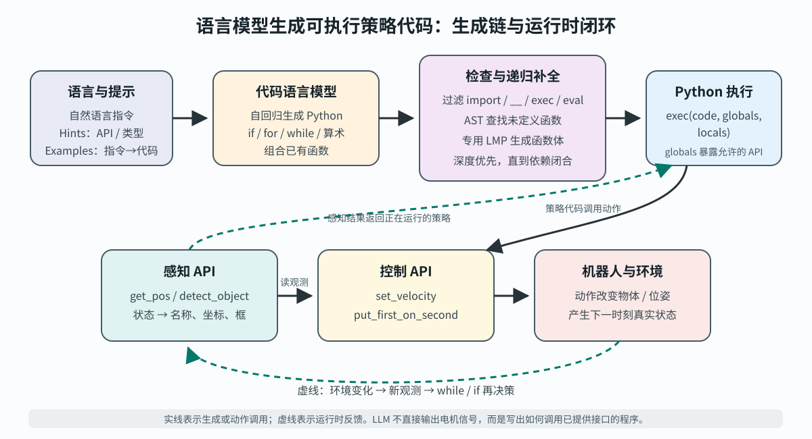

> **公开入口：** [arXiv](https://arxiv.org/abs/2209.07753) · [PDF](https://arxiv.org/pdf/2209.07753v4) · [TeX 源码包](https://export.arxiv.org/e-print/2209.07753) · [代码](https://github.com/google-research/google-research/tree/master/code_as_policies) · [项目页](https://code-as-policies.github.io/)
>
> 文中的 `source/...:Lx–Ly` 对应解压后的 arXiv TeX 源码坐标；博客不镜像原论文文件。

> 论文信息：Jacky Liang 等；首次公开于 2022-09-16；ICRA 2023；[arXiv:2209.07753](https://arxiv.org/abs/2209.07753)；[项目页](https://code-as-policies.github.io/)；[代码](https://github.com/google-research/google-research/tree/master/code_as_policies)。
>
> 证据版本：本地 16 页 PDF，SHA-256 `e36857fa13746da031444ec59549e61204ca92d599b1d048ac1c55aaf1f6d0a3`；arXiv TeX 源码可用。
>
> 阅读提示：下文用“**论文事实**”“**跨论文背景**”“**我们的判断**”区分原文、研究脉络与解释性推断。PDF 页码按文件页序。

## 一句话结论

**论文事实。** Code as Policies（CaP）把代码语言模型从“给机器人列步骤”推进到“给机器人写可执行策略”：模型生成 Python，程序读取感知 API、用算术和 `if/while` 组织反馈，再参数化控制 API；未定义函数还能由另一个语言模型程序递归补齐。定量证据支持“代码比自然语言更适合精确空间计算”和“分层生成提高代码题通过率”，真实机器人实验则主要证明可行性与跨平台展示，不能证明开放世界可靠或安全（PDF pp. 1, 3–6；`source/includes/3_method.tex:3-37,253-297`）。

## 1. 基本概念

- **语言 grounding（落地）**：把“左边”“那个碗”“快一点”连接到可观测量和可执行动作。这里不是让 LLM 直接看像素或发电机电流，而是让 `get_pos('red block')`、`detect_object('apple')` 等感知函数返回结构化结果，让 `set_velocity(...)`、`put_first_on_second(...)` 等控制函数接收参数（PDF pp. 1, 3–4；`3_method.tex:105-131,339-345`）。
- **语言模型程序（LMP）**：由语言模型生成、随后在系统上执行的程序。CaP 是其中面向机器人策略的一类：输入是语言指令，输出代码既可反应感知，又可调用控制原语（`3_method.tex:3-18`）。
- **策略**：从当前信息到动作的规则。动作序列只说“先抓再放”；策略代码还可以写“只要没看到苹果就继续走”，因此同一代码会随观测变化产生不同动作。
- **第一方与第三方 API**：第一方接口属于机器人栈，如检测、位姿和抓放；第三方库是 NumPy、Shapely 等通用计算工具，负责向量、插值和几何运算。语言含义最终受这些接口的名字、类型和能力边界约束（`3_method.tex:74-129`）。
- **少样本提示**：提示包含 Hints（可用 import/API、类型线索）和 Examples（自然语言注释—代码对）。论文除特别说明外使用 `code-davinci-002`、温度 0 的贪心解码（`3_method.tex:39-58`）。

日常类比是：LLM 像临时写“值班手册”的程序员，API 像仪表和按钮，Python 像把条件、循环和计算写清的规章。类比的失效处是，真实程序一旦执行就有物理后果；自然语言合理、代码能运行，都不等于感知正确、动作安全或任务可行。

## 2. 问题：旧方法在哪里失败

### 2.1 观察到的失败

**论文事实。** 经典语义解析难以覆盖未见指令；端到端语言到动作需要大量昂贵的真实机器人数据。同期 LLM 机器人系统通常只在固定技能集合上规划：它可以选择“抓取”“放置”，却难以把“看到橙子时再放”“往左一点”“更快”直接写进感知—动作反馈。每增加一种反馈模式或技能，数据采集和训练负担仍然存在（PDF pp. 1–2；`source/includes/1_intro.tex:6-15`）。

最小失败情境是“把可乐罐向右挪一点”。纯规划器可能给出“抓起—向右移动—放下”，但若技能库没有 `place_a_bit_right()`，第二步没有执行语义；“一点”也未变成坐标增量。CaP 则可读取当前位置、加上如 `[0, 0.1]` 的偏移，再调用已有移动/抓放接口（PDF p. 2）。

### 2.2 机制解释

**我们的判断。** 症结不是规划步数不够，而是**表示层断裂**：自然语言规划输出离散技能名，精确计算、参数选择和条件反馈仍封装在固定技能内部。于是未见任务只要重组了同一批感知与动作，却改变了控制流或数值关系，系统仍需要一个新技能。CaP 的科学干预是只替换这一层——让代码成为语言与既有 API 之间的可执行中间表示。

### 2.3 既有解法

**跨论文背景（按本文归纳）。** 语义解析把语言变成逻辑表示，依赖词典与任务语法；模仿学习或强化学习直接学语言条件策略，依赖训练分布和机器人数据；LLM 规划器重组预训练技能，依赖技能集合完备；Socratic Models、Inner Monologue 等把视觉或成功检测反馈写回文本，再规划下一步，但仍主要输出高层计划。它们改变的分别是解析、策略学习、技能选择或再规划环节。CaP 改的是中间表示，让循环、算术和 API 调用本身由模型生成（PDF p. 2）。

## 3. 核心机制：本文怎样解决



**图 1｜原创机制图。** 上排是一次性的生成链：指令、Hints 和 Examples 提示代码模型；输出经有限静态过滤，并在抽象语法树中查找未定义函数，递归补全后交给 Python。下排是运行时闭环：策略从感知 API 取名称、坐标或框，经条件与计算调用控制 API；环境改变后，新观测返回仍在运行的 `while/if`。实线表示生成/动作调用，虚线表示反馈。图中明确了结论边界：LLM 写的是接口编排代码，真实能力上限仍由感知和控制模块决定（依据 PDF pp. 3–4；`3_method.tex:35-37,273-297,339-345` 重画）。

### 3.1 从提示到执行

1. 提示先声明可用 API 和类型约定，再给少量“注释 → Python”例子。模型自回归地产生代码；会话可把过去的指令和输出追加进提示，使“撤销上一步”有文本上下文（`3_method.tex:17,39-53`）。
2. 生成代码可调用 NumPy 做坐标计算，也可调用项目 API。论文执行器拒绝 import、以 `__` 开头的特殊变量以及 `exec/eval`，然后运行 `exec(code, globals, locals)`；允许 API 只放在 `globals`，返回值从 `locals` 取（`3_method.tex:35-37`）。
3. 若 AST 中出现当前作用域没有的函数，专用函数生成 LMP 根据函数名/签名写定义；再扫描新函数体，深度优先重复，直到依赖闭合。比如先生成 `get_objs_bigger_than_area_th`，其中又调用未定义的 `get_obj_bbox_area`，后者最终用 `get_obj_bbox_xyxy` 算面积（`3_method.tex:253-297`）。这不是运行时递归调用，而是**生成过程递归展开依赖**。
4. 执行时，循环体每轮重新读取感知，而不是只在生成前看一次世界。因此同一段代码可以是闭环策略。论文甚至展示了提示中没有 `while` 示例时，模型生成“红块仍在蓝碗左边就每次右移 5 cm”的循环（`3_method.tex:186-207`）。

### 3.2 最小贯穿例子：三轮预测

设红块横坐标为 0.00 m，蓝碗为 0.12 m，控制原语能精确把红块移到目标点。生成策略的核心是：

```python
while get_pos("red block")[0] < get_pos("blue bowl")[0]:
    target = get_pos("red block") + [0.05, 0]
    put_first_on_second("red block", target)
```

第 1 轮观测 `0.00 < 0.12`，目标为 0.05；第 2 轮重新观测 0.05，目标为 0.10；第 3 轮观测 0.10，目标为 0.15；第 4 次判断为假并停止。请先预测再核对：删掉循环末端隐含的重新感知会怎样？程序可能永远依据旧位置行动。这个玩具执行也暴露边界：步长不能整除距离时会越过蓝碗；论文例子保证“移到右侧”而非“精确对齐”（原程序见 `3_method.tex:200-207`）。

### 3.3 可证伪预测

**机制假设。** 若提升来自“程序结构把复杂任务拆成可复用、可精确执行的计算”，则在**同一模型、同一题目、相近提示预算**下：（a）允许未定义函数并递归补全应尤其改善需要更长/更多逻辑层的 Productivity 题；（b）代码执行应在多步数值空间题上胜过直接自然语言和 CoT。论文结果方向与两项预测一致（PDF pp. 5, 10–11）。

反证条件也很清楚：若层次化只在换模型或增加示例时改善，不能归因于递归分解；若代码在不需数值计算的同难度题上同幅领先，优势可能来自提示格式而非执行语义；若感知噪声下闭环不优于一次性计划，则“反馈 grounding”机制未获支持。论文没有完成这些全部控制，因此现有证据是支持而非定论。

## 4. 关键公式与程序语义

论文没有训练目标或新控制方程；关键贡献是程序语义。下面是**我们的形式化重建，不是论文原公式**：

$$
c \leftarrow \operatorname{Decode}_{T=0}\!\left(p_\theta(c\mid H,E,u)\right),\qquad
(L',\tau)=\operatorname{Exec}(c;G,L),
$$

其中 $u$ 是新指令，$H$ 是 API/类型 hints，$E$ 是少样本例子，$c$ 是代码；$G$ 是只含允许 API 的全局作用域，$L$ 是局部变量表，$\tau$ 是动作调用轨迹。大白话说：模型只负责选代码字符串；Python 解释器和 API 决定它在世界中的含义。温度 0 让相同上下文通常走同一贪心输出，但不提供正确性保证（论文事实依据 `3_method.tex:35-37,41-58`）。

闭环可写成：

$$
o_t=P(s_t),\quad a_t=\pi_c(o_t),\quad s_{t+1}=F(s_t,a_t),
$$

其中 $s_t$ 是真实状态，$P$ 是感知 API，$o_t$ 是结构化观测，$\pi_c$ 是代码给出的条件/计算，$F$ 是机器人与环境动力学。逐步看，先观测，再由代码选动作，环境转移，循环回到新观测。玩具例中 $o_t=x_t$，$\pi_c$ 在 $x_t<0.12$ 时给 $x_t+0.05$，否则停止。边界检查：若 $P$ 漏检，正确代码也会错；若循环无终止条件，动作轨迹可无限；若 $G$ 不暴露控制 API，代码最多算数而不能具身执行。

层次补全可记作 $U_k=\text{Undefined}(\text{AST}(c_k),G)$：取 $U_k$ 中一个函数生成定义并并入 $c_{k+1}$，深度优先重复至 $U_k=\varnothing$。空集表示名称依赖闭合，不表示逻辑正确或物理安全（`3_method.tex:273-297`）。

## 5. 实验：每组证据回答什么

| 证据 | 受控比较与范围 | 关键结果 | 能支持什么 / 不能支持什么 |
|---|---|---|---|
| RoboCodeGen | 37 个机器人代码题；4 个 LLM；Flat vs Hierarchical；单元测试通过率 | GPT-3 6.7B：3→5；175B：68→84；Codex cushman：54→57；davinci：81→95（%） | 各模型均提高；但小模型增益小，分层不是无条件有效（PDF p. 5；`4_exps.tex:14-50`） |
| HumanEval | 同一 `code-davinci-002`；平铺 vs 分层；164 题 | Greedy 45.7→53.0，P@1 34.9→39.8，P@10 75.1→80.6，P@100 90.9→95.7（%） | 支持分层生成对通用代码也有用；模型版本和提示并非所有行完全等同，不能直接宣称普遍 SOTA（PDF pp. 5, 10；`4_exps.tex:53-78`） |
| 代码 vs 自然语言 | 28 道物体选择、23 道坐标选择；坐标容差 1 cm | 总体 Vanilla 35、CoT 58、LMP 98；坐标选择 30、48、100（%） | 支持可执行算术/库调用对精确几何有利；题量小且由作者新建（PDF p. 10；`exps_language_vs_code.tex:3-35`） |
| 模拟桌面操作 | 8 个长程任务 + 6 个空间几何任务；每任务 50 次；CLIPort 用 3 万示范，CaP 每任务一个提示样例 | 未见属性+未见指令：长程 0/64/80（CLIPort/NL/CaP）；几何 0.01/N/A/62（%） | 支持未见组合上的优势；训练资源和表示不同，不是纯粹同预算比较（PDF p. 6；`4_exps.tex:104-161`） |
| 真实机器人 | UR5e 绘图、UR5e 吸盘桌面操作、移动底盘+7DoF 手臂厨房任务 | 展示未见语言指令的成功案例，无系统成功率 | 支持跨 embodiment 可部署性，不支持可靠率或安全率（PDF pp. 5–6；`4_exps.tex:80-103,164-174`） |

RoboCodeGen 的机制定位尤其重要：论文按 Systematicity、Productivity、Substitutivity、Localism、Overgeneralization 分析；层次生成对 Productivity 帮助最大，但改善主要出现在两个 davinci 模型，cushman 某些类型反而下降。这符合“底层代码能力先过阈值，分解才有用”，也反对“递归一定更好”的强说法（PDF p. 11；`4_exps.tex:48-51`）。

模拟表中，已见属性/指令的空间几何任务上 CLIPort 为 97.33%，高于 CaP 的 89.30%；因此论文并非证明 CaP 全面替代监督策略。优势集中在未见属性或未见指令：例如长程任务从 CLIPort 的 36.80/0.00 提升到 CaP 的 97.60/80.00。自然语言规划器在几何任务标为 N/A，说明其动作表示本身不能给精确坐标，而非一次普通的准确率落败（PDF p. 6；`4_exps.tex:141-161`）。

## 6. 优点

**思想。** 干预很小而接口清楚：冻结 LLM，不重训机器人策略，只把代码置于语言与模块化机器人栈之间。代码同时承载离散逻辑、数值计算和反馈，比纯文本计划表达力更完整。

**实验。** 作者没有只展示机器人视频，还用代码单测、语言/代码对照和 seen/unseen 切分分别检查分层、数值推理和组合泛化；负面项也可见，如小模型层次化收益弱、已见几何任务不及 CLIPort。

**工程工件。** 生成代码可读、可改单元，API 作用域显式；AST 递归补全能把粗略草图转成多层函数，且提示、输出、Colab 和代码公开。模块化感知或控制升级可直接传递给上层策略（`3_method.tex:295-348`）。

## 7. 局限

**论文明确承认。** 泛化只发生在“解释指令—处理感知输出—参数化低维控制原语”这一层；能力受感知描述范围和控制原语限制。提示可容纳的命名参数有限；比示例长很多、复杂很多或抽象层不同的命令容易失败；系统假设指令可行，执行前不能判断回答正确（PDF p. 6；`source/includes/5_disc.tex:3-18`）。

**我们的判断。** 静态过滤仅禁 import、`__`、`exec/eval`，不是完整沙箱：死循环、超大计算、合法但危险的 API 参数和错误动作仍可能通过。函数名带来的类型推断既是优势也是隐式契约；`get_bbox_xyxy` 命名一变，递归生成可能静默误解。真实机器人部分缺少系统失败统计，且模拟比较中 CLIPort 的 3 万示范与 CaP 的预训练知识、提示样例不可按“数据更少”直接等价比较。最后，代码可读不等于可验证；运行前仍需类型、终止性、碰撞和权限检查。

## 8. 复现路线

最小复现不必先上真实机器人：

1. 先尝试固定论文的 `code-davinci-002`；若原接口不可用，必须记录替代模型、版本、温度 0 和完整提示，不要把模型迁移后的差异算作严格复现结果。
2. 实现两个无硬件 API：`get_pos(name)` 从二维字典读取，`put_first_on_second(name, target)` 更新字典。复刻上面的 5 cm 循环，核对动作轨迹 `[0.05, 0.10, 0.15]` 与终止条件。
3. 再实现 AST 未定义名称扫描和函数生成器；先用固定生成输出验证深度优先闭合，再接 LLM。核对“依赖闭合”和“单测通过”两个指标，不能只看代码能解析。
4. 从附录的 28+23 空间题做 Vanilla、CoT、Code 三条件对照；坐标题沿用 1 cm 容差。主要核对总体 35/58/98 与坐标 30/48/100 的方向，而不是期待替代模型逐点相同。
5. 上硬件前加入超时、速度/工作空间上限、只读感知权限、动作 dry-run 与人工急停。这些是安全复现条件，不应混入论文方法后声称提升了 CaP。

成本风险主要不是训练，而是模型 API 版本漂移、提示敏感性、开放词汇检测误差和机器人试错。论文也强调提示必须无 bug、变量/函数命名应保持类型一致，明确 import 与 `get_/set_` 约定会提高可靠性（PDF p. 9；`source/includes/apps/prompt_engineering.tex:3-28`）。

## 9. 思考题

1. 若把 `while` 改成生成前一次性检测再展开固定动作序列，什么扰动实验最能区分“反馈策略”与“更长计划”？
2. 层次化 HumanEval 的提升来自函数分解，还是额外提示？怎样设计等 token、等示例的四格消融？
3. 若感知 API 返回带置信度的分布而非单一坐标，现有 Python 策略会在哪一行失去语义？应修改 API 契约还是生成提示？
4. 为什么 AST 中未定义函数集合为空仍不能证明程序正确？至少写出一个终止性反例和一个物理安全反例。
5. CaP 在已见空间几何任务低于 CLIPort，却在未见任务领先。什么新切分能区分“组合泛化”与“LLM 预训练记忆/题型偏好”？

## 10. 证据定位

- 研究问题、固定技能规划的断层与主要贡献：PDF pp. 1–2；`source/includes/1_intro.tex:6-15,97-164`。
- LMP 定义、执行作用域与安全过滤：PDF p. 3；`source/includes/3_method.tex:3-37`。
- Hints、Examples、第三方/第一方 API：PDF pp. 3–4；`source/includes/3_method.tex:39-131`。
- 控制流、LMP 组合和递归函数生成：PDF pp. 4–5；`source/includes/3_method.tex:186-335`。
- RoboCodeGen、HumanEval 与模拟桌面结果：PDF pp. 5–6；`source/includes/4_exps.tex:11-78,104-161`。
- 代码对自然语言空间推理：PDF p. 10；`source/includes/apps/exps_language_vs_code.tex:1-35`。
- 泛化类型与层次生成边界：PDF p. 11；`source/includes/apps/exps_robo_code_gen.tex:13-43`。
- 局限：PDF p. 6；`source/includes/5_disc.tex:1-18`。正式版本：[IEEE ICRA 2023 DOI](https://doi.org/10.1109/ICRA48891.2023.10160591)。
