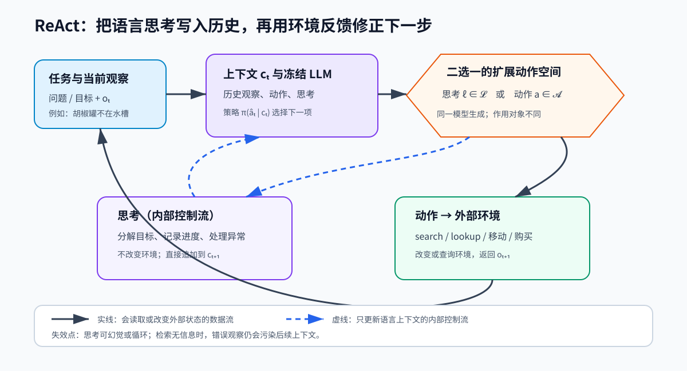

> **公开入口：** [arXiv](https://arxiv.org/abs/2210.03629) · [PDF](https://arxiv.org/pdf/2210.03629v3) · [TeX 源码包](https://export.arxiv.org/e-print/2210.03629) · [代码](https://github.com/ysymyth/ReAct) · [项目页](https://react-lm.github.io/)
>
> 文中的 `source/...:Lx–Ly` 对应解压后的 arXiv TeX 源码坐标；博客不镜像原论文文件。

> 论文信息：Shunyu Yao 等；首次公开于 2022-10-06；ICLR 2023；[arXiv:2210.03629](https://arxiv.org/abs/2210.03629)；[代码](https://github.com/ysymyth/ReAct)。
>
> 证据版本：上述 PDF 共 33 页，SHA-256 `f285b0971ae4a790e402fb93966bed3adde2cf0a04977d08b2b40d6ab0cace69`；TeX 源码可解析。
>
> 阅读提示：下文用“**论文事实**”“**跨论文解释**”“**我们的判断**”区分证据层级。PDF 页码指文件页码。

## 一句话结论

**论文事实。** ReAct 让同一个语言模型交替生成两类 token：一类是写给自己看的自然语言“思考”，另一类是交给环境执行的动作；环境返回的新观察又进入下一轮上下文。这个小改动使计划能被记录和修正，也让外部事实进入推理。在 PaLM-540B 少样本提示下，ReAct 单独使用在 FEVER 优于纯思维链，在 HotpotQA 略低于纯思维链；把两者按启发式组合才取得两项提示实验的最佳值。它在 ALFWorld 和 WebShop 上则明显优于只生成动作的受控基线（`source/iclr2023/text/intro.tex:20-25`；PDF pp.3, 5–8）。**显式语言状态与真实环境反馈形成闭环，分别缓解长程控制和事实落地问题；闭环自身仍会循环、检索失败或受提示限制。**

## 1. 基本概念

**任务、观察、动作。** agent 要完成一个目标。第 $t$ 步看到环境返回的观察 $o_t\in\mathcal O$，再从动作集合 $\mathcal A$ 选择 $a_t$。在问答中，动作可以是 `search[实体]`、`lookup[词]`、`finish[答案]`；在游戏中，动作是移动、拿取或使用物体（`source/iclr2023/text/experiments_language.tex:13-21`）。

**上下文与策略。** 上下文 $c_t=(o_1,a_1,\ldots,o_t)$ 是到当前为止可见的轨迹；策略 $\pi(a_t\mid c_t)$ 表示据此生成下一动作的分布。这里的“策略”由冻结的 PaLM-540B 加少量人工轨迹提示实现，没有强化学习更新（`source/iclr2023/text/method.tex:11-12,20-23`）。

**思考与观察不是一回事。** 思考（thought/reasoning trace）由模型生成，只写入文本历史，不触碰环境；观察由工具或环境返回，至少在接口意义上来自模型之外。前者可携带计划、工作记忆和常识，后者提供可核查的新状态。把二者混同，就看不出 ReAct 为什么可能同时获得控制力与事实性。

贯穿全文的最小任务是：**“在厨房找到胡椒罐并放到柜台。”** 初始观察显示水槽为空。只生成动作的模型可能重复 `take peppershaker from sink`；ReAct 可先写“水槽没有，下一步检查更可能存放调料的橱柜”，再执行 `go to cabinet 1`。类比是边走迷宫边念出路标和计划：自言自语帮助记路，真正碰到墙才更新地图。类比的边界在于，语言模型的“自言自语”可能凭空编造，且上下文长度远小于人的持续记忆。

## 2. 问题：旧方法在哪里失败

### 2.1 观察到的失败

**论文事实。** 纯思维链（CoT）在封闭文本里连续推演，无法主动核查外部事实，早期幻觉会沿后续步骤传播。纯动作模型则要把长历史直接映射成下一个动作：它可能忽略“水槽中没有胡椒罐”这类否定观察，继续生成不存在的动作；复杂问答中也可能检索到若干片段却无法综合最终答案（`source/iclr2023/text/intro.tex:11-16`；`source/iclr2023/text/method.tex:11-13`）。

### 2.2 机制解释

**论文事实。** 作者把失败归因于两个断点。推理没有外部接口，所以知识不能更新或落地；动作没有显式高层语言状态，所以难以分解目标、追踪子目标和处理例外。作者据此提出“reason to act”和“act to reason”的双向作用（`source/iclr2023/text/intro.tex:20-21`）。

**我们的判断。** 这是一种可操作但未被完全隔离验证的机制解释。思考 token 同时增加了测试时计算量、改变提示格式并暴露更多预训练语言先验；实验主要比较完整轨迹与删去思考后的轨迹，不能把增益唯一归因于“工作记忆”。

### 2.3 既有解法

**跨论文解释。** CoT 改变的是内部计算的可见形式，适合已有知识足够的多步推演；WebGPT 一类方法改变外部信息获取，但常需示范或训练；行动规划工作用语言先验提议动作，却未必保存抽象计划。ReAct 把二者放进同一自回归序列，让一个 token 接口同时承担控制与通信。论文自身将 CoT、Act-only 和 Inner Monologue 风格提示作为相邻比较（`source/iclr2023/text/experiments_language.tex:28-31`；`source/iclr2023/text/experiments_rl.tex:61-68`）。

## 3. 核心机制：本文怎样解决

*图 1（原创机制图）。冻结 LLM 读取任务与完整历史，在扩展动作空间中选择“思考”或“环境动作”。紫色虚线表示只追加到上下文的内部控制流；实线表示进入工具/环境并返回观察的数据流。图同时标出两个边界：内部思考会幻觉或循环，外部检索可能没有信息。图支持的结论是 ReAct 提供了反馈闭环，不保证每轮决策正确。*

**论文事实。** ReAct 把动作空间扩成 $\hat{\mathcal A}=\mathcal A\cup\mathcal L$。若 $\hat a_t\in\mathcal L$，它是思考，不产生环境观察，只把上下文更新为 $c_{t+1}=(c_t,\hat a_t)$；若选择真实动作，则环境执行并返回下一观察。问答任务严格交替“Thought–Action–Observation”；长程决策任务让模型在少数关键位置自行决定何时插入思考（`source/iclr2023/text/method.tex:16-23`）。

两种调度对应不同的时间尺度。知识问答通常每次检索后都要抽取新实体，再决定下一次检索，因此作者强制每个观察前后都有思考。ALFWorld 的一次子目标可能包含连续移动、拿取和放置；每个动作都写长思考会挤占上下文，所以作者只在分解目标、子目标完成或异常出现时插入思考。**我们的判断。** “稀疏”不是由独立门控器算出的概率，而是少样本轨迹示范出的生成模式；换一组示范就可能改变思考频率。它体现了 ReAct 的简洁，也把稳定性压力留给了提示设计。

### 3.1 最小贯穿例子

1. 观察：`sinkbasin 1 is empty`。读者先预测下一项。合理的思考是“原假设被否定，改查橱柜”，而不是再次拿取。
2. 思考：`Need search likely storage: cabinet.` 它不改变厨房，只改变下一步可见历史。
3. 动作：`go to cabinet 1`。环境返回 `peppershaker 1 is here`。
4. 思考：`Target found; take it, then go to countertop.` 随后的动作可由子目标顺序约束。

自解释问题：若删掉第 2 步，模型还看得到空水槽，但必须在一次隐式计算中同时恢复失败、生成替代位置并输出合法动作；若删掉第 3 步的真实观察，后续“已找到”只是模型猜测。

### 3.2 可证伪预测

**我们的判断。** 若“语言状态改善长程控制”成立，在相同模型、相同示例、相同动作预算下，只删除思考应主要增加漏掉子目标和重复动作，而非随机地改善所有错误。论文在六组 ALFWorld 提示中观察到 ReAct 持续优于 Act-only，并定性报告 Act-only 难以分解目标、追踪状态，方向符合预测（`source/iclr2023/text/experiments_rl.tex:51-55`）。更严格的检验应固定生成 token 总量，并用盲标注统计循环、遗漏和非法动作；若差异消失，增益可能来自额外计算或提示长度。

若“环境反馈降低事实幻觉”成立，给 CoT 与 ReAct 同一组可检索问题并操控检索正确率时，准确检索应降低 ReAct 幻觉，而注入错误检索应系统性损害它。若正确检索仍不改善事实错误，应先查接口、解析和上下文拼接；实现无误后，机制假设才受挑战。

## 4. 关键公式

论文没有训练目标或参数更新公式，关键数学对象是控制过程。

### 4.1 从历史到动作

**大白话目的。** $\pi(a_t\mid c_t)$ 把迄今经历压成下一动作分布。**符号账本：** $o_t$ 是观察，$a_t$ 是环境动作，$c_t$ 是有序历史，$\pi$ 是 LLM 条件分布（`source/iclr2023/text/method.tex:11`）。**逐步展开：** 第一步 $c_1=(o_1)$；执行 $a_1$ 得到 $o_2$；于是 $c_2=(o_1,a_1,o_2)$。该式是定义，不是假设各步独立。

**玩具计算。** 假设在空水槽后，纯动作分布为：重复拿取 0.45、去橱柜 0.35、去冰箱 0.20，贪心会重复。加入思考“水槽为空，查橱柜”后，下一轮分布可变为 0.05、0.80、0.15。数字仅为理解例子，不是论文结果。**边界检查：** 若上下文窗口截掉空水槽观察，显式思考也可能建立在错误历史上；若策略本已确定正确动作，插入思考只增加成本。

### 4.2 扩展动作空间与上下文递推

**大白话目的。** $\hat{\mathcal A}=\mathcal A\cup\mathcal L$ 允许模型先写中间状态再行动。思考分支满足 $c_{t+1}=(c_t,\hat a_t)$（`source/iclr2023/text/method.tex:16`）。**逐步推导：** 原策略只能从 $\mathcal A$ 选项；并入语言集合 $\mathcal L$ 后，生成一次思考相当于对状态追加可读摘要，再重新条件生成。这里没有证明它提升最优策略，只改变可表示的轨迹。

**玩具计算。** 设 $\mathcal A=\{\text{去水槽},\text{去橱柜}\}$，只取两个思考模板 $\mathcal L'=\{\text{继续原计划},\text{改查橱柜}\}$，则演示用有限空间有四项。选择“改查橱柜”后环境不变，但历史变长；下一次才选“去橱柜”。**边界检查：** $\mathcal L$ 实际近乎无限，少样本提示必须提供强语言先验；作者明确承认大动作空间所需示例可能超过上下文长度（`source/iclr2023/text/discussion.tex:1-2`）。

## 5. 实验：每组证据回答什么

| 实验 | 受控问题 | 数据与指标 | 关键结果 | 证据边界 |
|---|---|---|---|---|
| HotpotQA / FEVER | 思考、动作及二者组合怎样影响知识推理？ | question-only；HotpotQA EM、FEVER accuracy | ReAct 27.4/60.9；CoT 29.4/56.3；最佳组合 35.1/64.6 | 组合含人工启发式；远低于监督 SoTA 67.5/89.5 |
| HotpotQA 人工审计 | 幻觉与失败模式是否改变？ | 四组各随机 50 条，共 200 条 | 正确答案中的假事实 ReAct 6%、CoT 14%；失败中 CoT 幻觉 56%，ReAct 检索无信息 23% | 小样本人工分类，无不确定度 |
| ALFWorld | 稀疏思考是否改善长程控制？ | 134 个未见游戏，成功率 | ReAct 最佳 71%，Act-only 最佳 45%，BUTLER 最佳 37%；IM-style 53% | 报告 best-of-many，提示轨迹人工写 |
| WebShop | 推理是否改善噪声网页行动？ | 500 条测试指令；属性分数/SR | ReAct 66.6/40.0，Act-only 62.3/30.1，IL+RL 62.4/28.7，人类 82.1/59.6 | 与训练式基线计算预算不等 |

表中精确数值来自 `source/iclr2023/table/reasoning.tex:9-20`、`source/iclr2023/table/human_study.tex:7-16`、`source/iclr2023/table/rl.tex:14-30,42-54`，对应 PDF pp.5–8。

**论文事实。** 知识任务揭示互补性：ReAct 比 Act-only 好，但并未在 HotpotQA 单独胜过 CoT；作者用失败超步数或自一致性票数不足作为切换条件，组合才最佳（`source/iclr2023/text/experiments_language.tex:33-40,57-78`）。这说明论文证据支持“内部知识与外部信息互补”，不支持“ReAct 全面替代 CoT”。

**我们的判断。** ALFWorld 是更直接的机制试验，因为 Act-only 从同一轨迹删去思考，六个提示排列也测试了提示敏感性。不过“最佳 ReAct 71%”与“最佳 Act 45%”都经过多次选择，不能当成单次运行期望。WebShop 的 10 个百分点成功率增益有实际含义，但人类仍高 19.6 点，搜索改写和更广探索仍是明显缺口。

从错误类型看，干预没有消灭错误，而是改变错误来源。CoT 的主要危险是用内部知识补出不存在的事实；ReAct 把一部分风险移到接口：搜索词不佳、页面无关、结果截断后，后续推理会围绕错误或缺失观察继续展开。HotpotQA 人工审计中，ReAct 失败的 47% 被标为推理错误、23% 为搜索结果错误，CoT 失败的 56% 则是幻觉（`source/iclr2023/table/human_study.tex:9-15`）。这组数字更适合说明“失败结构变化”，不能证明所有场景的总体可信度提升，因为抽样只覆盖各方法各 50 个正确和 50 个错误轨迹。

## 6. 优点

**思想。** 介入点很小：不增加专用规划器，只把可读内部状态与外部动作统一为序列生成。机制可跨问答、游戏和网页导航复用。

**实验。** 论文同时给出 reasoning-only、acting-only、组合、IM-style 与人工错误分析，能看到互补性和失败转移，而非只看平均分。

**工程工件。** 轨迹天然可检查、可编辑。作者展示人可以修改某一步思考纠正后续行为；这提供诊断接口，但“可读”不等于“忠实解释模型内部因果”。

另一个实用优点是动作协议可以按环境替换：Wikipedia 用三种文本命令，ALFWorld 与 WebShop 各用自身合法动作，核心循环不变。这种接口统一让研究者能把“规划错误”和“环境返回错误”分开记录。不过，合法动作语法、停止条件与最大步数仍需逐任务工程化，论文并未消除这些适配工作。

## 7. 局限

**论文明确承认。** 大动作空间需要更多示范，可能超过 in-context learning 的输入长度；提示式行为支持有限，作者只在 HotpotQA 做了初步微调（`source/iclr2023/text/intro.tex:29-34`；`source/iclr2023/text/discussion.tex:1-2`）。ReAct 会重复前一步形成循环；无信息检索占其抽样失败的 23%（`source/iclr2023/text/experiments_language.tex:66-69`）。

**我们的判断。** 第一，思考 token 的事实性没有保证，轨迹只能提高可诊断性。第二，论文依赖 PaLM-540B 和人工高质量示范，未证明小模型或自动示范同样稳定。第三，环境动作的权限、安全与成本不在实验范围内。第四，任务指标只测完成度，不能推出部署中的校准、鲁棒性或忠实解释。

## 8. 复现路线

最小复现应选 ALFWorld 的一个任务类型：固定基础模型、解码方式、两条示范与动作上限，构造完整 ReAct 提示及从同一轨迹删思考的 Act-only 提示；在未见任务上报告成功率、非法动作、重复环和子目标遗漏。至少轮换六种示范排列，分别报告均值和每次结果，不只报告最佳值。核对点是作者在 134 个评估游戏上使用六个提示排列（`source/iclr2023/text/experiments_rl.tex:13-16`）。成本主要来自长上下文推理；复现论文原数还需要不可公开复现的 PaLM-540B 行为，因此开放模型复现检验的是机制方向，不是绝对数值。

## 9. 思考题

1. 若保留思考但屏蔽环境观察，哪些错误会更像 CoT？
2. 若给 Act-only 同样的 token/调用预算，ReAct 优势还剩多少？
3. 哪个受控实验能区分“显式工作记忆”与“更多测试时计算”两种解释？
4. 错误检索比无检索更危险吗？应怎样操控检索质量验证？
5. 人能读懂一条思考轨迹，是否足以证明它忠实反映动作产生原因？

## 10. 证据定位

- 核心定义与两种调度：PDF p.4；`source/iclr2023/text/method.tex:11-29`。
- 知识任务设置、基线与结果：PDF pp.4–7；`source/iclr2023/text/experiments_language.tex:13-78`。
- ALFWorld/WebShop 设置与结果：PDF pp.7–9；`source/iclr2023/text/experiments_rl.tex:9-68`。
- 关键表：`source/iclr2023/table/reasoning.tex:9-27`、`source/iclr2023/table/human_study.tex:7-16`、`source/iclr2023/table/rl.tex:14-54`。
- 正式入口：[OpenReview](https://openreview.net/forum?id=WE_vluYUL-X)；代码：[GitHub](https://github.com/ysymyth/ReAct)。
