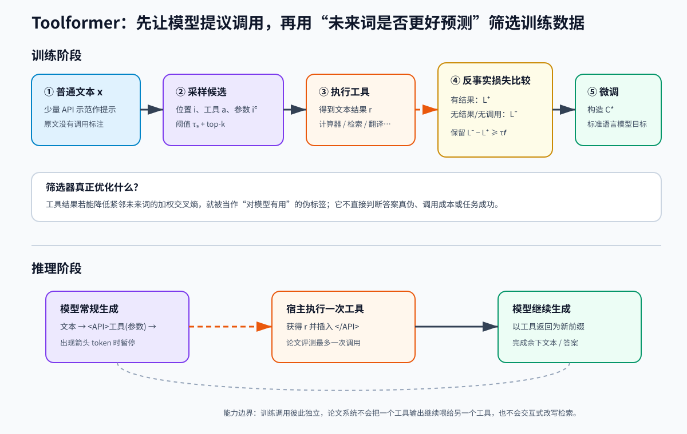

> **公开入口：** [arXiv](https://arxiv.org/abs/2302.04761) · [PDF](https://arxiv.org/pdf/2302.04761v1) · [TeX 源码包](https://export.arxiv.org/e-print/2302.04761)
>
> 文中的 `source/...:Lx–Ly` 对应解压后的 arXiv TeX 源码坐标；博客不镜像原论文文件。

> 论文信息：Timo Schick 等；首次公开于 2023-02-09；NeurIPS 2023；[arXiv:2302.04761](https://arxiv.org/abs/2302.04761)；论文未给出官方代码地址。
>
> 证据版本：上述 PDF 共 17 页，SHA-256 `6d7483d94653008e40c2058a1c22441c92e3713dae278b6361e8efc447c99522`；单文件 TeX 源码可解析。
>
> 阅读提示：下文明确标记“**论文事实**”“**跨论文解释**”“**我们的判断**”。PDF 页码指文件页码。

## 一句话结论

**论文事实。** Toolformer 用少量 API 用法示范，让一个语言模型先在普通语料里提议“何时调用、调用什么、参数是什么”，实际执行候选调用，再保留那些能显著降低后续 token 预测损失的调用，最后在这些自标注文本上微调同一个模型。推理时模型生成调用标记，宿主暂停解码、执行工具、插入返回值，再让模型续写（`source/main.tex:142-159,177-197`；PDF pp.2–4）。基于 6.7B GPT-J 的模型在 LAMA、数学和时间任务上获得大幅零样本提升，但在多语言问答上不稳定，在开放问答上仍落后 175B GPT-3；论文系统也不能链式或交互式调用工具。真正应记住的是：**Toolformer 把“工具返回是否有用”变成可自动计算的未来词损失差，从而制造工具使用训练数据；这是一种数据自举机制，不是完整的多步 agent 规划器。**

## 1. 基本概念

**API 调用。** 工具输入与输出都被线性化成文本。例如调用 $c=(a_c,i_c)$ 含 API 名 $a_c$ 与输入 $i_c$，可写成 `<API>Calculator(400/1400)</API>`；执行后再插入 `→0.29`。特殊 token 让工具交互能嵌在普通语言模型序列中（`source/main.tex:149-157`）。

**自监督与伪标签。** 人只为每种工具写少量示范，不逐条标注大语料。模型自己提出候选调用；“调用结果是否让原文后续更容易预测”充当筛选信号。保留下来的调用位置、工具名、参数和返回值成为伪标签。

**困惑度。** token 负对数似然越小，模型对原文越不意外；困惑度是其指数化汇总，越低越好。Toolformer 的筛选关注局部未来 token 的加权交叉熵，实验中的语言建模表报告整套数据上的困惑度。

贯穿例子是句子：“共有 1400 人，其中 400 人通过，即 ___%。”模型在百分比前提议 `Calculator(400/1400)`，工具返回 0.29。若带结果时更容易预测原文的“29%”，调用进入训练集。类比是学徒在草稿旁试贴便签：只有能让后文更容易续写的便签会被老师保留。类比的边界是，这位“老师”只看续写损失，不直接核验事实、任务奖励或工具费用。

## 2. 问题：旧方法在哪里失败

### 2.1 观察到的失败

**论文事实。** 扩大语言模型能改善许多任务，却不能可靠解决精确算术、近期事实、低资源语言理解与时间感知；简单计算器、检索器、翻译器和日历反而各有所长（`source/main.tex:110-118`）。当时的工具使用方案常依赖大量人工标注，或只在已知工具与任务的特定下游场景中训练/提示（`source/main.tex:134-140`）。

### 2.2 机制解释

**论文事实。** 作者的切入点是训练数据瓶颈：模型缺少通用序列中的“何时调用、传什么参数、怎样吸收返回值”示例。已有模型的 in-context learning 又足以生成候选标注，因此可先生成、再用自身损失筛选（`source/main.tex:142-144`）。

**我们的判断。** 该机制假设“有用工具结果会降低原文未来词损失”。它对算术等可在后文复现结果的场景很自然，对开放任务却只是代理目标：一个流畅但错误或偶然相关的返回也可能降低损失。论文的定性表确有“Fast train success”无关检索仍得 0.92 正分的例外（`source/main.tex:509-535`）。

### 2.3 既有解法

**跨论文解释。** 检索增强预训练通常在固定位置总是提供额外文本；人工监督工具学习直接给正确调用；任务专用提示预先告诉模型该用哪个工具。Toolformer 把选择权移到模型，通过通用语料中的自标注学习调用门控。与 ReAct 相比，Toolformer 的主要创新发生在**训练数据生成**，而 ReAct 主要在**推理时把思考和环境动作闭环交替**。Toolformer 论文把 TALM 视为最接近工作，但指出后者在下游微调场景研究计算器与搜索器（`source/main.tex:537-543`）。

## 3. 核心机制：本文怎样解决

*图 1（原创机制图）。上半部分是训练数据自举：普通文本经过候选采样、真实执行和反事实损失筛选，形成带 API 调用的 $\mathcal C^*$ 后微调。下半部分是推理：模型生成箭头标记时宿主暂停，插入工具返回，再继续生成。橙色虚线代表跨模型边界的工具执行。图支持的结论是模型学会了单次调用门控；它没有展示链式规划或交互式搜索能力。*

**论文事实。** 完整管线有五步：① 用每个 API 的少量示范提示，在文本各位置估计生成 `<API>` 的概率；② 保留超过 $\tau_s$ 的最多 $k$ 个位置，并为每处采样最多 $m$ 个调用；③ 执行调用得到文本返回；④ 比较有结果与无结果的未来词损失，只保留收益至少 $\tau_f$ 的候选；⑤ 将多工具调用合并进原文得到 $\mathcal C^*$，用标准语言模型目标微调（`source/main.tex:159-195`）。

筛选后的数据量高度依赖工具。默认阈值 $\tau_f=1.0$ 时，Wikipedia Search 有 60,974 条、QA 有 18,526 条、Calendar 有 20,587 条，而 Calculator 与 Machine Translation 只有 994 和 1,034 条（`source/main.tex:247-264`）。**我们的判断。** 这说明“同一算法接五种工具”不等于五种工具以同样的数据效率被学会；语料中答案是否紧邻调用位置、工具输出形式以及预筛启发式都会决定伪标签产量。

推理时，模型照常生成，直到输出 `→`；宿主执行相应 API，把返回与结束标记插入上下文，模型继续生成（`source/main.tex:197`）。论文评测为提高调用倾向，只要 `<API>` 进入 top-10 就强制选择，并限制每个输入最多调用一次（`source/main.tex:281-286`）。

### 3.1 最小贯穿例子

1. 原文在“即 29%”之前有候选位置。模型看到计算器示范后，为 `<API>` 分配较高概率。
2. 它采样 `Calculator(400/1400)`；参数若写成 `400/14` 也会被实际执行，但未必通过筛选。
3. 对正确调用，比较“带 `→0.29`”与“无调用/只有调用无返回”两种前缀预测后文 `29%` 的损失。
4. 若损失差过阈值，就把完整调用插回文本。微调后，模型在相似比例句中能自己生成调用。
5. 推理时宿主接管箭头之后的片段，避免模型凭记忆伪造计算器返回。

自解释问题：若省去“只有调用、没有返回”的对照，模型可能因为看到问题本身就更易预测后文，而把无价值工具结果误判为有效。

### 3.2 可证伪预测

**我们的判断。** 若未来词损失差确实选择了因果上有用的调用，在固定候选集合中，按 $L_i^- - L_i^+$ 排序应提高人工正确性和下游收益；随机打乱返回值应同时降低损失收益与任务表现。若损失仍下降但答案准确率不变，说明代理目标捕获的是表面可预测性。

若自举学到的是通用调用门控，而非记住工具示范措辞，那么改写零样本任务提示时，调用率与收益应稳定。论文反而承认调用决定对输入措辞敏感（`source/main.tex:545-547`）。后续复现应报告提示改写下的调用率—准确率曲线；若变化很大，机制有效范围应限定为与自举分布相近的语言形式。

## 4. 关键公式

### 4.1 调用的文本表示

论文定义

$$
e(c)=\texttt{<API>}a_c(i_c)\texttt{</API>},\qquad
e(c,r)=\texttt{<API>}a_c(i_c)\rightarrow r\texttt{</API>}.
$$

**大白话目的。** 把结构化调用和返回压成 LM 能读写的一段文本。**符号账本：** $c$ 是调用，$a_c$ 是工具名，$i_c$ 是文本参数，$r$ 是返回字符串，$e$ 是线性化函数（`source/main.tex:152-157`）。**逐步构造：** 选工具 `Calculator`，填参数 `400/1400`，执行得 `0.29`，加边界标记即 $e(c,r)$。**边界检查：** 输入/输出不能文本化就不满足论文接口；返回过长仍会占上下文；标记歧义会破坏解析。

### 4.2 候选位置概率

$$
p_i=p_M(\texttt{<API>}\mid P(\mathbf x),x_{1:i-1}),\quad
I=\{i:p_i>\tau_s\}.
$$

**大白话目的。** 先找“此处值得问工具吗”。$P(\mathbf x)$ 是带少量示范的提示，$x_{1:i-1}$ 是位置前缀，$p_M$ 是基础 LM 概率；超过阈值的位置若多于 $k$，只留 top-$k$（`source/main.tex:161-168`）。**玩具计算。** 三个位置概率为 0.02、0.11、0.07，$\tau_s=0.05,k=2$，则保留后两处。**边界检查。** $\tau_s=1$ 几乎无候选；$\tau_s=0$ 候选爆炸，仍受 $k$ 截断。默认 $\tau_s=0.05,k=5,m=5$，计算器和翻译采用更宽采样（`source/main.tex:559-562`）。

### 4.3 用未来词损失定义“有用”

$$
L_i(\mathbf z)=-\sum_{j=i}^n w_{j-i}\log p_M(x_j\mid \mathbf z,x_{1:j-1}),
$$
$$
L_i^+=L_i(e(c_i,r_i)),\qquad
L_i^-=\min\{L_i(\varepsilon),L_i(e(c_i,\varepsilon))\}.
$$

保留条件是 $L_i^- -L_i^+\ge\tau_f$（`source/main.tex:179-193`）。**大白话目的。** 返回值必须比“不调用”和“调用但没结果”中更有利的那个对照还好。取 `min` 提高了门槛，排除了仅由调用问题文本带来的收益。

**符号账本。** $\mathbf z$ 是额外前缀，$\varepsilon$ 是空串，$x_j$ 是原文 token，$w_t$ 是距离权重。论文用 $\tilde w_t=\max(0,1-0.2t)$ 后归一化，因此只给调用后五个相对位置非零权重，近处更重（`source/main.tex:238-244`）。

**玩具计算。** 假设无调用损失 2.0，只有调用问题为 1.8，含正确结果为 0.6，则 $L^-=1.8,L^+=0.6$，差 1.2；当 $\tau_f=1.0$ 时保留。若错误返回使损失 2.3，差为 -0.5，删除。**边界检查。** 当结果只对很远后文有用时，权重归零会漏掉；$\tau_f=0$ 会保留微弱或噪声调用；阈值过高则产生极少伪标签。论文数据印证这种敏感性：QA 调用样本从 $\tau_f=0.5$ 的 51,987 降到 2.0 的 5,135，计算器从 3,680 降到 138（`source/main.tex:247-264`）。

## 5. 实验：每组证据回答什么

| 实验 | 检验主张 | 指标/条件 | 关键数字 | 边界 |
|---|---|---|---|---|
| LAMA | QA 工具能补事实吗？ | 零样本；正确词在前 5 个生成词内 | Toolformer 33.8/11.5/53.5；disabled 22.1/6.3/34.9 | 禁用 Wiki 搜索；98.1% 几乎总调 QA |
| 三个数学集 | 计算器能补精确算术吗？ | 首个数字或等号后首数 | 40.4/29.4/44.0；disabled 14.8/6.3/15.0 | 97.9% 调计算器，主要测“会调用” |
| 开放问答 | 简单 Wiki 检索够不够？ | 前 20 个词含答案 | 26.3/17.7/48.8，高于同尺寸基线但低于 GPT-3 的 29.0/22.6/65.9 | QA 工具被禁，检索不能改写 |
| MLQA | 翻译是否跨语言稳定增益？ | 10 词内含答案 | Toolformer 仅西/印/越优于 GPT-J，德/中/阿更差 | CCNet 微调带分布漂移 |
| 时间任务 | 日历是否提供当前时间？ | LAMA 式指标 | TempLAMA 16.3，Dateset 27.3；disabled 12.7/5.9 | TempLAMA 日历仅调用 0.2%，增益不能归因于日历 |
| 语言建模 | 插入调用是否伤害基础 LM？ | WikiText/CCNet 困惑度 | Toolformer disabled 10.3/10.5，与 GPT-J+CC 相同 | 未计算启用 API 时的困惑度 |

精确数据见 `source/main.tex:288-314,316-340,343-367,370-405,408-455`，对应 PDF pp.6–9。

**论文事实。** 同尺寸的 disabled 基线把“微调内容变化”与“推理时真实调用”部分拆开。数学任务中，启用工具把 disabled 的 14.8/6.3/15.0 提到 40.4/29.4/44.0，真实返回贡献很大（`source/main.tex:316-340`）。语言建模表则显示 Toolformer disabled 与 GPT-J+CC 在两套数据上同为 10.3/10.5，支持“关闭调用时未额外损害困惑度”，不能推出所有通用能力都不受损（`source/main.tex:437-455`）。

**我们的判断。** 推理修改是重要混杂因素：top-$k=10$ 会在 `<API>` 并非最高概率时强制调用。T-REx 调用率从贪心的 40.3% 提到 98.1%，成绩从 47.8 到 53.5；WebQS 从 8.5%/19.3 提到 99.3%/26.3。高 $k$ 还丢失了“不调用时更准”的部分校准（`source/main.tex:476-498`）。因此“模型自主决定何时调用”在论文评测中包含外部阈值干预。

## 6. 优点

**思想。** 损失差提供廉价、可扩展的伪标签，不要求每条语料有人设计调用。加入“有调用无结果”对照是关键，它让筛选更接近返回值的边际贡献。

**实验。** 工具覆盖事实、算术、检索、翻译和时间；disabled 与 GPT-J+CC 基线能拆分真实工具执行和继续预训练的影响；论文也报告了失败任务、解码敏感性和模型规模门槛。工具收益约在 775M 参数附近才出现，说明工具接口本身也需要基础模型能力（`source/main.tex:458-471`）。

**工程工件。** 文本化协议可接不同实现，推理时的暂停—执行—续写边界清楚。训练最多每 API 25k 样本，序列长 1024、批量 128、8 张 A100 40GB、最多 2000 步，为规模估计提供了锚点（`source/main.tex:683-687`）。

## 7. 局限

**论文明确承认。** 各工具候选独立生成，训练集中没有链式调用；系统不能浏览多个搜索结果或改写查询；调用决定对措辞敏感；计算器处理百万文档后也只有几千个有用例子；门控不考虑工具的计算成本（`source/main.tex:545-547`）。

**我们的判断。** 第一，损失降低不等于事实正确或任务成功，筛选可能放大训练语料的表面相关性。第二，数据生成依赖针对工具的启发式预筛，如“至少三个数字”和语言检测，这削弱“只需少量示范”的字面理解（`source/main.tex:238-244,564-572`）。第三，QA 数据生成使用 Atlas-large、推理用更大的 Atlas-xxl，外部工具升级也贡献结果（`source/main.tex:564-566`）。第四，每输入最多一次调用直接排除了多跳问题；当前结果不能外推到自治、多工具编排或有副作用的 API。

## 8. 复现路线

最小复现只接计算器。准备带数字的普通文本；用 3–5 条调用示范采样候选；执行四则运算；按相同近邻权重计算三种损失并以 $\tau_f=0.5/1.0/2.0$ 各自产生数据；固定训练步数微调同一基础模型。评测至少包含：disabled、启用工具、随机返回、GPT-J+同量原文继续训练；同时报告候选数、保留率、调用率、答案准确率和困惑度。先验证“高损失差对应高正确率”，再看下游分数。复现论文绝对值需要 CCNet 子集、Atlas、NLLB 和多卡训练；官方没有代码链接，数据选择细节和完整执行实现仍有不确定性。

## 9. 思考题

1. 为什么 $L_i^-$ 要取两个无结果条件的最小值，而不是平均值？
2. 随机打乱正确工具返回后，损失差与下游准确率应怎样变化？
3. top-$k$ 强制调用提高分数时，能否仍称为模型自主门控？
4. 哪个实验能区分“学会算术”与“学会稳定调用计算器”？
5. 若把调用成本加入筛选式，应怎样改写保留条件，怎样测量收益—成本曲线？

## 10. 证据定位

- 核心管线与公式：PDF pp.2–4；`source/main.tex:146-197`。
- 工具定义与实现：PDF pp.4–5；`source/main.tex:199-229,559-572`。
- 数据规模、基线与零样本协议：PDF pp.5–6；`source/main.tex:235-286`。
- 下游结果与语言建模：PDF pp.6–9；`source/main.tex:288-455`。
- 解码分析、数据质量与限制：PDF pp.9–11；`source/main.tex:473-547`。
- 正式入口：[NeurIPS Proceedings](https://proceedings.neurips.cc/paper_files/paper/2023/hash/d842425e4bf79ba039352da0f658a906-Abstract-Conference.html)。
