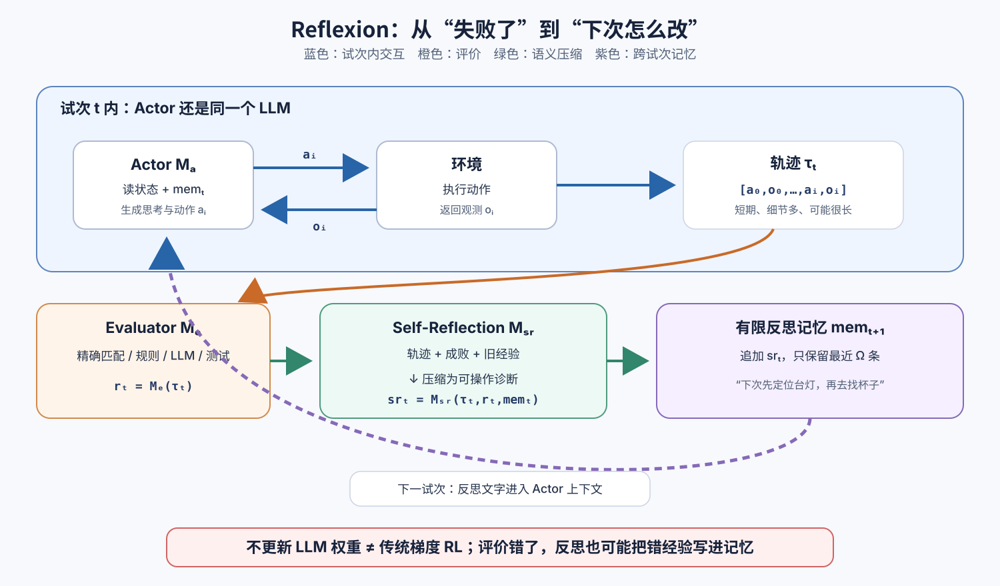

> **公开入口：** [arXiv](https://arxiv.org/abs/2303.11366) · [PDF](https://arxiv.org/pdf/2303.11366v4) · [TeX 源码包](https://export.arxiv.org/e-print/2303.11366) · [代码](https://github.com/noahshinn/reflexion)
>
> 文中的 `source/...:Lx–Ly` 对应解压后的 arXiv TeX 源码坐标；博客不镜像原论文文件。

> 论文：*Reflexion: Language Agents with Verbal Reinforcement Learning* (NeurIPS 2023)
>
> 阅读标记：**论文事实**是原文明示的机制或结果；**脉络解释**是对前人方法的归纳；**我们的解释/判断**用来建立直觉或审计证据，不等于论文已证明。

## 一句话结论

**Reflexion 把一轮任务的成败信号和轨迹交给 LLM，让它写成一条可操作的“下次别再这么做”，放进提示上下文后重试；因此改变的是记忆中的文字，不是 LLM 权重。**（论文事实；`source/main.tex:L154–164, L407–422`）

## 1. 先认识四个基本概念

- **轨迹（trajectory）** (\tau_t)：第 (t) 次尝试中交错出现的动作和环境观测，如“打开抽屉 (\rightarrow) 没找到杯子 (\rightarrow) 又打开同一抽屉”。
- **Actor** (M_a)：真正生成推理和动作的 LLM，可以是 CoT 或 ReAct。它的当前轨迹是短期记忆，过去的反思是长期记忆（论文事实；`source/main.tex:L347–359, L395–404`）。
- **Evaluator** (M_e)：判断这次是否成功。它可以是精确匹配、手写规则、LLM 分类器，或程序的自生成测试（`source/main.tex:L361–375`）。
- **Self-Reflection** (M_{sr})：不只重复轨迹，而是尝试做信用分配：指出哪一步导致后续错误，以及下次应换成什么策略（`source/main.tex:L377–393`）。

**大白话比喻。** 一个人做菜失败，“0 分”只告诉他没做成；“你在油没热时就下锅，下次先等油面起纹”才能直接改变下次行为。Reflexion 就是把稀疏分数放大成语义明确的经验。但比喻的边界是：反思者也是 LLM，它可能自信地诊断错了。

## 2. 问题、前人解法与失败机制

### 观察到的失败

**论文事实。** 基于巨大 LLM 的 agent 通常用上下文示例教行为；若像传统 RL 那样通过梯度反复更新数十亿参数，数据和计算成本很高（`source/main.tex:L141–152`）。更尖锐的问题是信用分配：一条几十步的轨迹最后只得到“失败”，分数没说错在哪一步（`source/main.tex:L158–162`）。

**我们的机制解释。** 这类 agent 常常不是“从未知道正确做法”，而是失败后的信息没有进入下一轮决策。若每次都用同一提示重新采样，就像把同一个人的失败记忆删除后要他“再试一遍”：温度带来的随机性不等于学习。

### 别人怎样解决

**脉络解释。** Self-Refine 一类方法对单次生成做评论再改写；搜索/束搜索保留多个候选轨迹；程序方面的 Self-Debugging、CodeRL 利用执行反馈修复代码。论文认为这些方法或主要面向单次生成，或没有将经验压缩成跨试次持续的反思记忆（论文的相关工作归纳；`source/main.tex:L198–296`）。Reflexion 的最小介入是：不动基座模型，只在“评价 (\rightarrow) 经验文字 (\rightarrow) 下次上下文”这条链上加一个回路。

**图 1｜Reflexion 真正更新的是什么。** 上半部是一次试次内的动作—观测环；下半部把整条轨迹评成分数，再压缩成可执行的反思，追加到有容量上限的记忆中。蓝色回路跨试次改变 Actor 的上下文；红色标注强调 LLM 权重不变。图为我们依据算法重画，不是论文原图。

## 3. 核心机制：一轮一轮怎样跑

1. Actor 按当前策略 (\pi_\theta) 与环境交互，产生轨迹 (\tau_t=[a_0,o_0,\ldots,a_i,o_i])。
2. Evaluator 将整条轨迹映射成任务分数 (r_t)。
3. Self-Reflection 同时看轨迹、分数和已有记忆，产生新经验 (sr_t)。
4. 把 (sr_t) 追加到 (mem)；若没通过且未超过重试上限，重置环境再试。实现中只保留最近 (\Omega=1\text{–}3) 条反思，避免超过上下文限制（论文事实；`source/main.tex:L309–333, L407–422`）。

**读者先猜一步。** 假设 ALFWorld 要求“找到杯子，放到台灯下”。第一轮先盲目搜杯子，导致后半程才发现不知道台灯位置。有用反思应是“先定位台灯，再搜杯子，可避免拿着物体往返”；“我失败了，下次要更谨慎”虽然通顺，却不会约束任何具体动作。这个区别正是该方法成败的核心。

## 4. 公式：“口语梯度”是比喻，不是反向传播

论文把 Actor 的策略写成

$$
a_i \sim \pi_\theta(a_i\mid s_i),\qquad \theta=\{M_a,mem\}.
$$

**符号账本。** (s_i) 是当前观测与上下文；(a_i) 是动作或生成；(M_a) 是固定的 Actor LLM；(mem) 是可更新的反思文本。所以这里 (\theta) 不只代表神经网络参数，而是“固定模型 + 当前记忆”的联合策略状态（`source/main.tex:L309–317, L347–359`）。

整个试次级更新可写成：

$$
\begin{aligned}
\tau_t &= \operatorname{Rollout}(\pi_{M_a,mem_t}),\\
r_t &= M_e(\tau_t),\\
sr_t &= M_{sr}(\tau_t,r_t,mem_t),\\
mem_{t+1} &= \operatorname{Tail}_{\Omega}(mem_t\mathbin{\|}sr_t).
\end{aligned}
$$

前三行对应“做—打分—写经验”；第四行把新经验接到记忆尾部，再只保留最近 (\Omega) 条。这是根据论文算法等价重写的数据流，不是论文另外推导的优化定理。

**玩具计算。** 第一轮轨迹被评为 (r_0=0)，反思提取出“不要连续重复打开同一柜子”。若 (\Omega=2)，第三轮后记忆只保留 (sr_1,sr_2)，(sr_0) 被丢弃。对应的改变是提示 token，不存在 (\nabla_\theta r)、学习率或权重更新。因此把 (sr_t) 叫“语义梯度”是功能类比：它指明了改进方向，却不具备数学梯度的方向导数保证。

**边界检查。** 若 Evaluator 把错误程序判为通过，循环会过早停止；若把正确程序判为失败，反思反而可能做有害修改。所以口语反思不会比它的评价信号更接近真相。

### 三个容易读错的点

**第一，“不更新权重”不等于“策略没变”。** 对一个自回归 LLM，上下文就是条件分布的一部分。同一个模型在提示中看到“上次重复搜索了同一个容器”后，下一动作的条件概率会变。因此 Reflexion 确实实现了试次间的行为适应；只是这个适应寄存在外部文本状态，不会在离开该记忆后保留。

**第二，反思不是将所有轨迹原样塞回去。** 原轨迹包含大量已正确的步骤和重复观测；语言反思的机制主张是对它做有损压缩：丢掉无关细节，保留“错误位置—原因—替代动作”。HotPotQA 中“只放最近轨迹”与“再做反思”的差距，正是对这条主张的相对直接检验（`source/main.tex:L571–584`）。

**第三，自评不一定是“模型自己凭感觉打分”。** 论文为不同任务使用了不同可验证信号：HotPotQA 用标准答案精确匹配，编程用测试执行，ALFWorld 用环境终态、规则或 LLM 分类。这种模块性是优点，也使“Reflexion”不是单一严格相同的算法配方：一项新任务能否成功，很大程度取决于研究者能否建造一个和真实目标对齐的 Evaluator。

## 5. 可证伪预测

1. **若改进来自“可操作的经验压缩”，**仅把上一条完整轨迹放进记忆，应不如反思摘要；若两者相当，则自反思本身未提供额外信息。
2. **若改进依赖可靠评价，**人为增加 Evaluator 假阳性时，性能应比同等比例的假阴性更快恶化，因为假通过会直接终止循环。
3. **若记忆只是试次级学习，**它应主要帮助同一任务的重试，而不会自动迁移为一个全局变强的模型。

## 6. 实验：每组数字究竟检验什么

| 任务与主张 | 设定/对照 | 关键结果 | 证据边界 |
|---|---|---|---|
| 长轨迹决策能否跨试次改进 | ALFWorld 134 个环境、6 类任务；ReAct 作 Actor；超过 30 步或同动作/观测重复 3 个循环触发反思 | Reflexion 完成 130/134；ReAct 的增长在第 6–7 试次停滞；论文汇总为绝对 +22% | 评价触发含手写启发式，效果不能全归于自主 LLM 诊断（`source/main.tex:L435–487`） |
| 反思是否比“看上次轨迹”多带来信息 | 100 道 HotPotQA；CoT/ReAct；精确匹配给二值成功信号；与只放最近轨迹的 episodic-memory 消融对照 | 给真实上下文的 CoT 首试仍错 39%；Reflexion 提升 14 个百分点，并比只记轨迹再高 8 个百分点 | 仅 100 题，还允许对失败题重试到连续 3 次失败，不是单次独立测试（`source/main.tex:L509–584`） |
| 自生成测试 + 反思能否改进代码 | HumanEval、MBPP、LeetcodeHardGym；最多 6 个内部测试；程序记忆上限为 1 | HumanEval Python 80.1% (GPT-4) (\rightarrow) 91.0%；Rust 60.0% (\rightarrow) 68.0%；但 MBPP Python 80.1% (\rightarrow) 77.1% | 自生成测试可以本身是错的；在 MBPP Python 中假通过率为 16.3%，HumanEval Python 仅 1.4%（`source/main.tex:L586–697`） |
| 测试和口语反思是否都需要 | 最难的 50 道 HumanEval Rust 消融 | 基线 60%；无测试但反思 52%；有测试无反思 60%；两者都有 68% | 支持“先可靠定位，再语言化修复”的联合机制；样本只是 50 题（`source/main.tex:L699–743`） |

**效果怎么读。** 跨三种任务类型的改进是强支持，而 HotPotQA 的轨迹记忆消融和 Rust 程序消融比只看最终准确率更接近核心因果主张。反例同样关键：附录在 100 条 WebShop 请求上报告 ReAct + Reflexion **没有显著超过** ReAct（`source/additional_information/decisionmaking.tex:L85–111`）。这说明重试回路并不保证在所有交互环境中有用。

### 实验证据的四层拆解

**第一层，结果证明了“能改进”，但没证明“每次都改进”。** ALFWorld 的累计成功曲线展示多轮后解决更多任务，WebShop 和 MBPP Python 却给出边界或退化。所以一个更忠实的结论是“当评价可靠且反思能找到可修正错误时，跨试次记忆可带来快速适应”。

**第二层，结果不能与传统 RL 做等成本对比。** 论文强调无需微调，这确实避免反向传播；但每轮额外的评价和反思依然消耗 LLM 调用、上下文 token 和环境重置。原文没有在统一计算或美元预算下与 RL 训练对照，所以“轻量”应理解为不修改权重，不是已证明总成本最低。

**第三层，pass@1 在这里需要说清计账方式。** 程序代理会在提交最终答案前自生成并运行内部测试，因为它不访问基准的隐藏测试，论文将最终一次提交计为 pass@1（`source/main.tex:L602–615`）。这与“只生成一次、不运行任何工具”的零成本直接生成不是同一计算预算，读者不应只把 91.0 与 80.1 当成纯模型能力差。

**第四层，当时的结果不自动外推到今天的模型。** 这组实验证明了一个机制在特定模型、提示、基准和重试规则下有效。更强 LLM 可能写出更准确的反思，也可能让无反思基线同时变强。因此复现时应比较同一当代基座模型下的成对消融，不应把历史绝对分数当成永久排行。

## 7. 优点、缺点与适用边界

**思想优点。** 它将“学习”的最小单元从权重更新换成可读的经验，不需微调基座模型，也容易查看 agent 为何改变行为。Actor、Evaluator、Reflection 的模块边界清楚，不同任务只需换评价器和提示。

还有一个容易被最高分数遮住的优点：反思文本是可审核的中间物。研究者可以区分“环境给错信号”、“反思错诊”和“Actor 看到正确建议却没执行”三个环节。这不保证语言是真实因果解释，却给了比单一标量回报更好的故障定位界面。

对科学实验而言，这意味着每一条经验都能被编码、归类和做消融：真正应该问的不是“模型有没有想”，而是建议是否包含可执行动作，以及该动作是否在下一轮真正被采用并产生预期后果。

**实验优点。** 决策、问答和编程三类任务的反馈形式不同；论文又用轨迹记忆、测试和反思消融尝试分离组件作用，而且公开报告了 MBPP 与 WebShop 的负面结果。

**核心缺点。** 系统的上限是 Evaluator 的可靠性和 LLM 自诊断能力；记忆会忘记超过 (\Omega) 的旧经验；语言修改没有单调改进或收敛保证，可能陷在局部最优（论文事实；`source/main.tex:L164, L745–758`）。

**安全/工程边界。** 程序 agent 会执行未验证代码，原文明确建议使用隔离环境（`source/main.tex:L790–793`）。非确定函数、外部 API、硬件相关或并发程序难以生成精确测试，因此不是这个实验设定已解决的范围（`source/main.tex:L747–758`）。

### 从闭环图反推三种失效边界

**不可识别的失败。** 若轨迹没有记下决定成败的环境信息，比如网页后台实际拒绝了请求，但界面观测只显示一个模糊错误页，Self-Reflection 无法从不存在的证据中还原真因。多试几次只会积累猜测。

**不可修正的失败。** 反思可能正确指出“需要访问受限数据”，但 Actor 没有对应工具或权限。这时诊断质量不是瓶颈，行动集才是瓶颈。口语反思只能在现有能力集内重新排序，不会凭空创造 API、知识或物理技能。

**不稳定的失败。** 当环境在每次重置后改变，上一轮的具体建议可能已过期。“第二个抽屉里有杯子”是场景记忆，“避免重复搜索已排除的容器”才是更可迁移的策略。这说明反思的抽象粒度是一个真实权衡：太具体会过期，太抽象又不能约束下一动作。原文的有限滑动窗口仅解决长度，并未解决这个选择问题。

## 8. 复现建议与自解释问题

1. 先用一个可确定验收、允许重置的小环境；固定 Actor 温度和提示，记录每轮轨迹、评价、反思和记忆。
2. 至少比较四组：单次基线、只重试、只放完整旧轨迹、压缩反思；给固定的总 token/重试预算。
3. 分别注入 Evaluator 假阳性与假阴性，测试“错误反馈怎样污染记忆”，而不只报最高成功率。
4. 请自答：若反思只写“下次认真点”，它比 (r=0) 多提供了哪个行动约束？
5. 请设计一个反例：Evaluator 误判成功，反思循环立即结束。这个例子如何限定“不更新权重也能学习”的主张？
