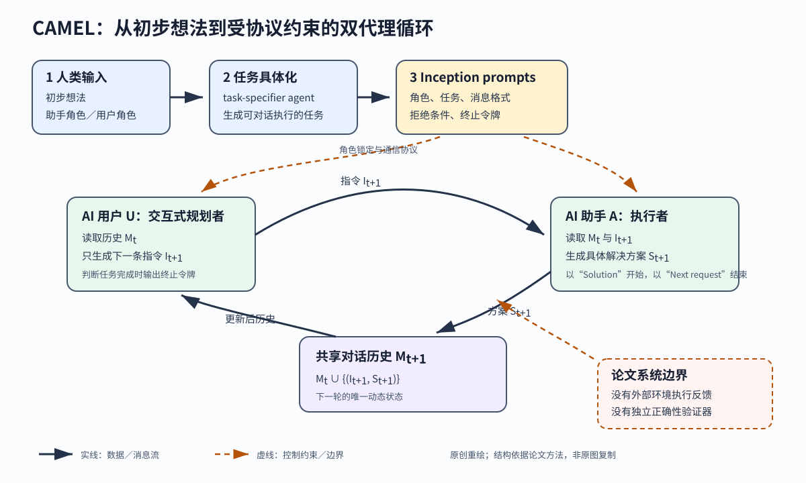

> **公开入口：** [arXiv](https://arxiv.org/abs/2303.17760) · [PDF](https://arxiv.org/pdf/2303.17760v2) · [TeX 源码包](https://export.arxiv.org/e-print/2303.17760) · [代码](https://github.com/camel-ai/camel) · [项目页](https://www.camel-ai.org/)
>
> 文中的 `source/...:Lx–Ly` 对应解压后的 arXiv TeX 源码坐标；博客不镜像原论文文件。

> 论文信息：Guohao Li, Hasan Abed Al Kader Hammoud, Hani Itani, Dmitrii Khizbullin, Bernard Ghanem；2023-03-31 首次公开；NeurIPS 2023；arXiv:2303.17760；[code](https://github.com/camel-ai/camel)。
>
> 证据版本：上述 PDF 共 77 页，SHA-256 `926c73c2ae9f9abc7612ab58373e428476f4de55db78646ed59de09810db7777`；TeX 源码可解析。
>
> 阅读提示：下文用“论文事实”“跨论文解释”“我们的判断”区分证据层级。PDF 页码指文件页，TeX 定位为相对本目录的文件与行号。

## 一句话结论

**论文事实。** CAMEL 把“请人类专家不断给单个聊天模型写下一条提示”改成两个被初始提示约束的语言模型代理自动对话：AI 用户拆任务并发指令，AI 助手给具体解法，直到用户代理发出终止令牌（PDF 第 3–5 页；`source/sections/methodology.tex:15-16,29-38,64-66`）。证据支持“这组提示协议能在所测的任务上产生更受偏好的文本方案”，不足以证明两个代理已真正理解彼此、验证了方案正确性，或可在现实环境中自主完成任务。

## 1. 基本概念

- **通信代理**：用自然语言消息影响另一个代理的下一步。CAMEL 的主实验是共同利益下的双代理合作，不是竞争。
- **角色扮演（role-playing）**：一个代理充当“AI 用户／规划者”，另一个充当“AI 助手／执行者”。“用户”在这里也是模型，不是人。
- **Inception prompting**：对话开始前一次性写入任务具体化提示、助手系统提示和用户系统提示。对话开始后，两个代理相互提示（`source/sections/methodology.tex:64-66`）。
- **状态、动作、反馈**：动态状态是历史消息集 (M_t)；AI 用户的动作是指令 (I_{t+1})，AI 助手的动作是方案 (S_{t+1})；“反馈”主要是对方的文本。论文主循环没有必然的外部执行结果或正确性验证器。
- **评价指标**：主比较让人或 GPT-4 在 CAMEL 对话的汇总解与 `gpt-3.5-turbo` 单轮解之间投票；编码微调实验另用 HumanEval/HumanEval+ pass@k。前者是偏好，不等于任务通过率。

**贯穿例子。** 人类只说“做股票交易机器人”，并指定股票交易员与 Python 程序员。任务具体化代理把它改成“监控社交媒体情绪并据此交易”。随后 AI 交易员依次要求选库、写情感分析、接行情与交易接口；AI 程序员逐轮回答。这是论文自己的示例路径（`source/sections/methodology.tex:26-30,59`）。

## 2. 问题：旧方法在哪里失败

### 2.1 观察到的失败

**论文事实。** 单个聊天模型解复杂任务时依赖人类持续写精确下一步，非专家很难知道如何引导。当作者改用两个模型自动聊时，又观察到四类具体故障：角色翻转，助手只复述指令，用“我将……”承诺却不交付的 flake reply，以及互谢或告别的无限循环（PDF 第 2、8 页；`source/sections/introduction.tex:6-16`，`source/sections/experiment.tex:41-55`）。

### 2.2 机制解释

**论文事实。** 作者把故障归因于对话中的角色、输出格式、轮次责任和终止条件缺少稳定约束。因此提示中反复锁定角色，规定用户每轮只发一条指令，要求助手提供具体解法，并用 `<CAMEL_TASK_DONE>` 结束（`source/sections/methodology.tex:80-124,132-150`）。

**我们的判断。** 这是一种“文本通信协议”假说：模型并未获得新工具，只是可选输出空间被系统提示压缩了。它应最直接改善“谁该说什么、何时停”，对事实正确性、代码可执行性和现实操作能力的改善只能间接发生。

这个机制还将“规划”实现成对历史的下一条文本反应，而不是显式的任务图或可检查计划。因此，研究者需要从对话中反推子目标是否一致；对话顺滑只能说协议被遵守，不能代替对计划完整性的审计。
这也是复现时必须保留每轮原始记录的原因。

### 2.3 别人怎样解决

**跨论文解释。** RLHF 与指令微调把人类意图编入模型参数；Chain-of-Thought、ReAct 等提示法改变单次推理轨迹；Self-Instruct 等工作自动生成指令数据；传统多代理研究则用通信协议、共享奖励或手工策略协调。CAMEL 改变的环节是推理时的“谁为谁写下一条指令”，同时将流式指令—解法对保存为训练数据（相关工作整理见 `source/sections/relatedwork.tex:7-18`）。

**比较轴。** 这些工作不应只按“单代理／多代理”排队。更有用的区分是干预发生在何处：RLHF 和指令微调改参数，CoT 与 ReAct 改一个模型的中间文本，Self-Instruct 改训练样本生成，CAMEL 在推理时增加一个产生后续指令的角色。它的假设是，规划职责可通过文本提示分配，并且模型能根据对方回答选下一步。如果任务需要隐式环境状态、实时感知或可执行验证，仅增加规划角色不会自动填补这些缺口。

## 3. 核心机制：本文怎样解决

*Figure 1（原创可编辑 SVG）。实线是任务与消息的数据流，虚线是系统提示施加的控制约束。共享历史是循环的动态状态；角色锁定、格式和终止令牌专门对应角色翻转、flake reply 和无限对话。右下角明示主系统没有外部执行反馈或独立验证器，因而图不把“文本解法”画成“任务已验证完成”。*

### 3.1 输入—决策—动作—反馈

1. **输入**：初步想法与两个角色。任务具体化代理先生成可操作的任务。大规模数据生成时，角色和想法也由 LLM 自动生成（`source/sections/methodology.tex:26-27`）。
2. **决策**：两组系统提示将同一具体任务、对方角色、通信格式和停止条件写入两个自回归模型。AI 用户根据全部历史选下一步，这是边对话边规划，不是先产生完整计划。
3. **动作**：AI 用户发一条 `Instruction` 和可选 `Input`；AI 助手发一条 `Solution`，再请求下一指令。
4. **反馈与终止**：方案写回历史，成为 AI 用户下轮的输入。用户代理判断任务已解时发终止令牌。工程上还会在用户 3 轮不发指令、助手反过来发指令、任一方达 token 限制或总消息达 40 条时停止（PDF 第 8 页；`source/sections/experiment.tex:59-68`）。

**协议与失败的对应。** “永远不要交换角色、助手不得反过来发指令”是角色翻转的定向约束；“解法必须具体且给实现或例子”针对空泛承诺；固定 `Instruction/Input` 与 `Solution` 格式一方面维持轮次责任，另一方面让产物能直接拆成指令微调样本；终止令牌与硬上限则分别处理“模型认为已完成”和“模型始终不会停”两种情形。这些约束都在文本层生效，因此检测时应先计数相应的通信故障，再看总体答案质量。

### 3.2 最小逐轮例子

设任务是“用三条模拟帖子的情绪生成交易信号”。(t=0) 时历史为空；AI 用户指令“先定义文本与标签”，助手返回三条数据。(t=1) 时用户看见上轮结果，再要求“用可复算规则算出情绪分数”；助手回答规则和三个分数。(t=2) 时用户要求将分数映射为买入／观望／卖出，然后自行判断已完成。若删掉历史，后续指令不知道三条数据；若删掉终止令牌，两方可继续互谢。但即使对话正常结束，交易规则仍未经历史数据回测，所以不能将“终止”当成“正确”。

### 3.3 可证伪预测

**我们的预测。** 在同一批任务、相同模型、解码参数、最大轮数和评价器下，只删掉“助手不得发指令”应主要提高角色翻转率；只删掉 `CAMEL_TASK_DONE` 应主要提高无效尾部轮数；只删掉具体解法格式应主要提高 flake reply 率。如果这些定向效应不出现，先核对提示是否真正被删除且检测器是否可靠；实现无误仍不出现时，“协议分项对应特定故障”的机制假说就不受支持。论文附录的消融一次删掉了多块通信与对齐提示，因此能检验“整套协议有用”，无法独立识别每一条的作用（`source/sections/supplement.tex:2120-2156`）。

## 4. 关键公式

### 4.1 对话状态与递推

**大白话目的。** 用一个最小状态记录所有已完成的“指令—解法”对，让下一轮可延续前文。论文给出（`source/sections/methodology.tex:33-57`）：

$$
M_t=\{(I_i,S_i)\}_{i=0}^{t},\qquad
I_{t+1}=U(M_t),\qquad
S_{t+1}=A(M_t,I_{t+1}),
$$
$$
M_{t+1}=M_t\cup\{(I_{t+1},S_{t+1})\}.
$$

**符号账本。** (t\in\{0,1,\ldots\}) 是轮次；(I_i) 是第 (i) 轮用户指令；(S_i) 是对应方案；(M_t) 是到 (t) 为止的有序对话记录。论文写成集合并集，但实现必须保留顺序；所以把 (M_t) 理解为序列更准确。(U) 与 (A) 分别是被各自系统提示 (P_U,P_A) 条件化的自回归模型（`source/sections/methodology.tex:29-30`）。

**等价拆解。** 一轮等价于四步：读历史 → 用户采样指令 → 助手在指令条件下采样解法 → 追加记录。系统提示影响两次采样的条件分布，公式本身没有目标函数、奖励或梯度更新。

**玩具计算。** (M_0=[(“给三条帖子”,“数据 D”)])。令 (U(M_0)=“给 D 打分”)，(A(M_0,I_1)=“分数[1,-1,0]”)，则 (M_1) 就是原有一对后追加这一对，长度从 1 变 2。

**边界检查。** 若 (M_t) 超过模型上下文，公式没规定如何压缩；若 (U) 误判已完成，系统会过早终止；若不设最大消息数，最坏情况会一直循环。作者说对话成本随长度二次增长，因为每轮都重复发送更长历史（PDF 第 8 页；`source/sections/experiment.tex:67`）。

## 5. 实验：每组证据回答什么

| 实验 | 想回答的问题 | 受控比较与数据 | 结果 | 能说明与边界 |
|---|---|---|---|---|
| AI Society 规模 | 方案能否批量生成对话 | 50 个助手角色 × 50 个用户角色 × 每组 10 任务 | 25,000 段对话（PDF 第 8 页；`source/sections/experiment.tex:34-37`） | 证明生成吞吐量；未证明 25,000 段都正确、独立或完成 |
| 多轮对单轮 | 多代理解是否更受偏好 | AI Society 与 Code 各随机 100 任务；CAMEL 对话先由 GPT-4 汇总，再与 `gpt-3.5-turbo` 单轮解盲比（`source/sections/evaluation.tex:7-12`） | AI Society 人评：CAMEL 76.3%，单轮 10.4%，平 13.3%，共 453 份回答；GPT-4 评：73/23/4%。Code 的 GPT-4 评：76/24/0%（PDF 第 9 页；`source/sections/evaluation.tex:10,17-31`） | 支持文本偏好；GPT-4 同时汇总和评判，且没有执行所有方案 |
| Inception 提示消融 | 完整协议是否有用 | 同一批任务，完整提示对一次删掉多个协议块的提示，GPT-4 评判 | 完整提示胜 75%，消融版胜 25%，平 0%（PDF 第 68 页；`source/sections/supplement.tex:2120-2156`） | 直接支持整套提示的作用；多处同时改动，不能归因到单一机制 |
| 微调后编码 | 生成数据是否能改善 7B 模型编码 | LLaMA-7B 在四类生成数据上微调，对比 LLaMA-7B 和 Vicuna-7B | CAMEL-7B 在 HumanEval pass@1/100 为 14.0/57.9%，HumanEval+ 为 12.2/50.0%；Vicuna-7B 分别为 11.0/42.9% 与 9.9/34.7%（PDF 第 10 页；`source/sections/evaluation.tex:75-92`） | 支持该训练组合下的性能差；四类数据一起加入，不能归因给角色扮演的某一部分 |

**实验审计。** 主评价比较了“多轮对话后再用更强的 GPT-4 汇总”和“`gpt-3.5-turbo` 直接一次回答”，因此同时改变了计算量、轮次、角色协议与汇总模型。这不是“多代理这一个因素”的纯消融。人评只做 AI Society，论文也承认领域专业性与对长答案的偏好可使人和 LLM 评价有偏（`source/sections/supplement.tex:1545-1551`）。

**与机制的对照。** 25,000 段对话回答“能否扩展生成”，人和 GPT-4 偏好回答“最终文本是否更受偏好”，提示消融才最接近“通信协议是否造成改善”。HumanEval 结果是生成数据的下游效用，中间又经过微调，不宜用来证明推理时的双代理协作本身有因果优势。

## 6. 优点

**思想。** 它把模糊的“多个 LLM 互相聊”缩成一个职责非对称的最小系统：一方决定下一子任务，一方回具体交付。这个干预直接对应观察到的通信故障。

**实验。** 论文不只展示成功对话，还保留角色翻转、无限循环等失败样例，并提供整体提示消融。

**工程工件。** 开源库、提示模板、数据生成管线和数据集让后续研究可以直接替换角色、模型与协议。

## 7. 局限与失效边界

**论文明确承认。** 大量异质任务需要众多领域专家才能判定是否完成；API 成本限制研究规模；主设置只测两个对话代理；模型可生成假信息和有害内容；人或 LLM 评价可偏置（`source/sections/supplement.tex:1545-1551`）。

**我们的判断。** 失效边界包括：需要真实工具权限或物理执行的任务；对错无法从文本表面判定的任务；对话超长导致历史截断；任务完成标准模糊；两个代理共享同一模型偏差而相互确认错误。可选 critic 能选方案或给反馈（`source/sections/methodology.tex:61`），但论文的核心结果不能被解读为已验证“critic 可消除这些风险”。

## 8. 复现路线

1. 先做 30–50 个可人工判定的小任务，固定模型版本、temperature、token 限制和随机种子，保存所有原始消息。
2. 复制完整角色协议后，每次只删一条，分别计算角色翻转率、flake reply 率、终止成功率、任务通过率、轮数与 token 成本。
3. 对可执行任务使用单元测试或沙盒执行，将“文本偏好”和“外部正确性”分开。评价者不应同时承担 CAMEL 长对话的摘要，以减少处理不对称。
4. 核对点：原始工作在 40 消息上限下运行，主比较各随机取 100 任务，AI Society 人评共 453 份回答。复现若改了这些条件，应单独报告。

## 9. 思考题

1. 只删掉“Never flip roles”后，哪一个指标应先变？为什么总任务分数可能不立即变？
2. 如果 AI 用户误以为任务完成，对话历史再完整能否修复？需要什么外部反馈？
3. 如何设计等计算量对照，区分“多轮多采样”与“角色分工”的效果？
4. 为什么“助手每轮都请求 Next request”既可减少 flake reply，又可能延长对话？

## 10. 证据定位

- 问题与四类失败：PDF 第 2、8 页；`source/sections/introduction.tex:6-16`；`source/sections/experiment.tex:41-55`。
- 角色扮演、对话递推与 Inception prompts：PDF 第 3–6 页；`source/sections/methodology.tex:15-66,80-150`。
- 主评价与 HumanEval(+)：PDF 第 8–10 页；`source/sections/evaluation.tex:4-92`。
- 失败样例、数据审计、限制与提示消融：PDF 第 28、38、68 页；`source/sections/supplement.tex:989-1072,1480-1551,2120-2159`。
- 正式版：[NeurIPS 2023 proceedings](https://proceedings.neurips.cc/paper_files/paper/2023/hash/a3621ee907def47c1b952ade25c67698-Abstract-Conference.html)；项目与代码：[CAMEL](https://github.com/camel-ai/camel)。
