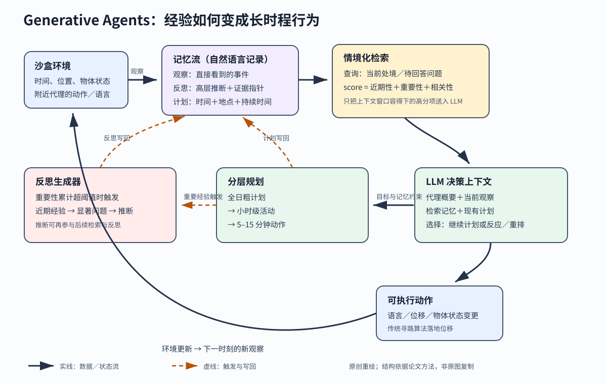

> **公开入口：** [arXiv](https://arxiv.org/abs/2304.03442) · [PDF](https://arxiv.org/pdf/2304.03442v2) · [TeX 源码包](https://export.arxiv.org/e-print/2304.03442) · [代码](https://github.com/joonspk-research/generative_agents) · [项目页](https://reverie.herokuapp.com/arXiv_Demo/)
>
> 文中的 `source/...:Lx–Ly` 对应解压后的 arXiv TeX 源码坐标；博客不镜像原论文文件。

> 论文信息：Joon Sung Park, Joseph C. O'Brien, Carrie J. Cai, Meredith Ringel Morris, Percy Liang, Michael S. Bernstein；2023-04-07 首次公开；UIST 2023；arXiv:2304.03442；[code](https://github.com/joonspk-research/generative_agents)。
>
> 证据版本：上述 PDF 共 22 页，SHA-256 `1b31e77fb24d25d7598f2c49e955d12a28b95a6dabad34acdac40f44bfb7a139`；TeX 源码可解析。
>
> 阅读提示：下文显式区分“论文事实”“跨论文解释”和“我们的判断”。PDF 页码指文件页，TeX 定位为相对本目录的文件与行号。

## 一句话结论

**论文事实。** Generative Agents 把大语言模型包在一个长时程闭环里：每次经历用自然语言进入记忆流，检索器按近期性、重要性与相关性选当下记忆，反思将多条经历合成高层推断，分层计划再将这些信息变成动作（PDF 第 2、8–12 页；`source/content/introduction.tex:4-12`，`source/content/architecture.tex:1-95`）。受控消融支持这些记忆组件对人评“可信性”有作用，25 个代理的两天沙盒运行展示了信息传播、关系形成与聚会协调；它们尚不是对现实人类行为的有效预测或心理机制验证。

## 1. 基本概念

- **可信行为（believable behavior）**：角色的回答与其设定、历史经验、当前环境和时间轨迹相容，让观察者产生“像在生活”的感觉。论文特别提醒，这种表现不意味着真实能动性（`source/content/introduction.tex:6`）。
- **记忆流**：一个持续增长的自然语言记录库。每条对象包含文本描述、创建时间和最近访问时间；观察、反思和计划都可写入。
- **检索**：根据当前查询给每条记忆打分，只将上下文窗口能容纳的高分记忆提供给 LLM。
- **反思**：由多条低层经历推出关于自己、他人或事件的高层命题，并保留所引记忆的指针。反思也能被再反思，因此会形成层级树。
- **计划与反应**：计划是含地点、开始时间和持续时间的未来动作序列；反应是当新观察值得打断计划时的重排。
- **环境反馈**：沙盒将自然语言动作落到地图移动或物体状态变化，再把代理视野内的人和物写回观察（`source/content/implementation.tex:1-12`）。

**贯穿例子。** Isabella 的初始记忆只设定她想办情人节聚会。她规划邀请人、准备装饰；邀请在对话中变成别人的观察记忆；那些代理检索邀请后，把到场写入计划；沙盒到点时执行移动。这条链上任一环丢失都会出现“知道聚会却没来”。

## 2. 问题：旧方法在哪里失败

### 2.1 观察到的失败

**论文事实。** 只用当下情境提示 LLM 可产生局部合理动作，却无法保持长时程一致。论文的玩具失败是 Klaus 在 12:00、12:30 和 13:00 连吃三次午饭：每个时点单看都像人，串起来却不可信（`source/content/architecture.tex:59-65`）。把全部经历都塞入提示不仅超过上下文窗口，也会用大量无关细节分散模型；只保留原始观察又难以得出“两人有共同研究兴趣”这类跨事件推断（`source/content/architecture.tex:10-17,36-44`）。

### 2.2 机制解释

**论文事实。** 作者将失败分成三个信息瓶颈：不能从持续增长的经历里取回当下有用的部分；不能将多个具体事件合成高层认识；没有跨时间计划来约束每一步局部选择。三者分别对应检索、反思和分层规划。

**我们的判断。** 这个架构的核心不是让 LLM “记住更多”，而是管理有限注意力：记忆流保留原料，检索决定当下看什么，反思改变可被看见的抽象层次，计划给局部生成施加时间约束。

### 2.3 别人怎样解决

**跨论文解释。** 规则系统如有限状态机和行为树依靠人工穷举动作，易控制但新行为超出脚本时失效；强化学习减少人工脚本，已在奖励明确的对抗游戏成功，开放世界的“像人”却难以写成标量奖励；SOAR 等认知架构有长短期记忆和感知—规划—动作循环，但程序性知识仍需手工编写；一阶 LLM 提示、静态知识库或简单摘要可处理局部场景，却不能同时管理动态经验、当前环境与可修订计划（`source/content/related_work.tex:11-25`）。

## 3. 核心机制：本文怎样解决

*Figure 1（原创可编辑 SVG）。实线是观察、检索上下文、动作与环境更新的数据流；虚线是反思触发和记忆写回的控制流。观察、反思和计划共存于记忆流，检索后与当前环境一起条件化 LLM。动作由沙盒落地后又变成新观察，所以这是有环境反馈的长时程回路。*

### 3.1 输入—状态—决策—动作—反馈

1. **输入与状态**：初始的一段角色设定被切成种子记忆；每个时刻，时间、附近代理、语言与物体状态形成新观察。Smallville 有 25 个角色，每人的起始身份是一段人工写的自然语言（PDF 第 5 页；`source/content/gameworld.tex:3-16`）。
2. **检索与反思**：当前情境成为查询，所有记忆被统一打分。当新记忆的重要性累计超过阈值，系统向 LLM 询问近期经验可回答的高层问题，再检索证据、生成带引用指针的推断。
3. **计划与决策**：先用角色概要和前一天经历生成全日计划，再递归拆到小时和 5–15 分钟动作（`source/content/architecture.tex:65-80`）。新观察来时，LLM 在“继续原计划”和“反应并重排”之间选择。
4. **动作与反馈**：语言动作可转成对话，空间动作通过传统寻路到达地点，物体动作更新烉灶或咖啡机等状态。更新后的环境在下一时刻被再观察（`source/content/implementation.tex:9-27`）。

**三种记忆的分工。** 观察回答“真正发生了什么”，反思回答“这些经历合起来意味着什么”，计划回答“未来哪个时间在哪里做什么”。三者都可被同一检索器取回，所以它们会在当下决策中相互约束；但也因为共用同一个文本通道，错误推断与真实观察可在下游一起影响决策。证据指针为反思提供了审计入口，却不会自动判定推断是否正确。

### 3.2 最小逐轮例子

设 Isabella 在 16:00 与 Maria 说“明天 17:00 在咖啡馆办聚会”。这句话进入 Maria 的记忆流，与聚会的语义相关性和重要性高。当 Maria 生成次日计划时，这条记忆应排入上下文，产生 17:00 到咖啡馆的计划；到时寻路器执行移动。若删掉检索，邀请可沉在大量无关经历里；若删掉计划，Maria 在接受访谈时可说知道聚会，却不一定到场；若环境的咖啡馆状态不准，正确计划也可执行到错地点。

### 3.3 可证伪预测

**我们的预测。** 若“反思主要帮助跨事件综合”这一机制成立，在固定原始观察、计划、检索条数和 LLM 采样的比较中，删掉反思应大幅伤害“根据多次交往选生日礼物”等综合问题，对“刚才谁说了什么”的直接回忆影响应更小。如果两类问题同幅下降，先检查消融是否连带改变了检索或计划上下文；实现无误仍如此，就不支持这一特异机制。原文质性案例中，无反思的 Maria 无法判断 Wolfgang 喜好，有反思时能据“数学音乐作曲”选礼物（`source/content/technical_eval.tex:55-56`），但还需按问题类型的定量交互效应来严格验证。

## 4. 关键公式

### 4.1 记忆检索分数

**大白话目的。** 在“刚发生”“对角色很重要”和“与当前问题有关”之间折中，避免只记得最新碎事或只记得人生大事。论文将三项 min–max 归一化到 ([0,1])，再计算（`source/content/architecture.tex:17-33`）：

$$
s(m\mid q)=\alpha_r R(m)+\alpha_i I(m)+\alpha_ρ\rho(m,q).
$$

**符号账本。** (m) 是候选记忆，(q) 是当前查询；(R) 是近期性，(I) 是重要性，ρ 是记忆与查询 embedding 的余弦相似度；三个 α 是权重，实现全取 1。重要性由 LLM 在 1–10 上评分；近期性是按“距上次读取后的游戏小时数”指数衰减，衰减因子为 0.995（PDF 第 9 页；`source/content/architecture.tex:19-31`）。

**等价拆解。** 对当次所有候选分别算原始三项 → 每项内做 min–max 归一化 → 加权求和 → 按分数排序 → 从高到低装入提示，直到上下文容量用完。

**玩具计算。** 设三条归一化记忆依次为“刚吃早饭” ((R,I,ρ)=(0.95,0.20,0.10))、“明天聚会的邀请” ((0.70,0.90,0.95))、“老朋友关系” ((0.20,0.70,0.80))。权重全为 1 时得分为 1.25、2.55、1.70，聚会邀请先进上下文。

**边界检查。** 论文没规定某一项所有候选值相同时 min–max 的零分母处理；余弦相似度可为负，归一化依赖当次候选集，所以同一记忆的归一化分数会随其他候选变化。所有α相等是工程选择，未经系统敏感性测试。

### 4.2 反思触发与关系密度

**论文事实。** 最近事件的重要性和超过 150 时触发反思，实际约每天 2–3 次；系统用最近 100 条记忆生成 3 个高层问题，对每个问题检索证据并要求 5 条带引用的洞见（PDF 第 10 页；`source/content/architecture.tex:42-55`）。这是阈值触发器，不是优化目标；当重要性评分偏高时，反思频率也会上升。

端到端实验的关系网络密度是

$$
η=\frac{2|E|}{|V|(|V|-1)},
$$

其中 (V) 是代理集，(E) 是“双方都表示认识对方”的无向边（`source/content/designer_eval.tex:14`）。玩具例中 4 人有 3 条关系，η=6/(4×3)=0.5；无边时为 0，完全图时为 1，但 η 不表示关系强度或真实亲密度。

## 5. 实验：每组证据回答什么

| 实验 | 主张与受控比较 | 环境／指标 | 精确结果 | 审计与边界 |
|---|---|---|---|---|
| 受控访谈消融 | 观察记忆、计划和反思是否逐项提高可信性；完整架构对三个累进消融和众包人类回答 | 100 名 Prolific 评估者，每人对 5 类问题各看 1 题，对 5 个条件排序；TrueSkill 转换为 μ/σ（`source/content/technical_eval.tex:6-34`） | 完整 29.89/0.72；无反思 26.88/0.69；无反思与计划 25.64/0.68；人类 22.95/0.69；无记忆、计划与反思 21.21/0.70。Kruskal–Wallis (H(4)=150.29,p<0.001)；除最后两组外的两两差异均 (p<0.001)（PDF 第 14 页；`source/content/technical_eval.tex:40-46`） | 累进下降支持组件作用。各消融共用完整架构运行产生的历史，是保守的离线回答比较，不是各自重跑两天（`source/content/technical_eval.tex:23-26`） |
| 两天端到端沙盒 | 多代理是否出现信息传播、新关系和协调 | 25 个代理连续运行两个游戏日；事后访谈、互相认识图的密度、实际到场数（`source/content/designer_eval.tex:3-16`） | 知道市长候选消息者由 1/25（4%）增至 8/25（32%）；聚会消息由 1/25 增至 13/25（52%）；密度 0.167→0.74；453 个“是否认识”回答中 6 个（1.3%）幻觉；12 名受邀者中 5 人到场（PDF 第 16 页；`source/content/designer_eval.tex:18-21`） | 这是一次无平行对照的展示性部署，能确认现象发生，不能单独归因每个组件；7 名未到场者中 4 人表示想来却未排入当日计划 |

**实验审计。** 受控实验的因果识别比端到端展示强，但“无反思”也没有因此在两天中走不同的路、遇不同的人，所以只测了对固定历史的访谈回答。众包人类条件也不是人类上限：每个工人看一个角色回放再代写，作者人工检查后还重做了 4 组不合格回答（`source/content/technical_eval.tex:26`）。TrueSkill 数值是排序模型分，不是绝对“像人百分比”。

## 6. 优点

**思想。** 架构把长期一致性拆成三个可单独消融的信息操作，并让反思和计划与原始观察共用同一记忆接口。这使“过去经验如何影响下一动作”可被追踪。

**实验。** 作者同时做组件消融与长时程部署，并报告错误：记忆取回失败、在真实记忆上添加虚构细节、位置常识错误和过度正式／合作的语气（`source/content/technical_eval.tex:48-56`，`source/content/designer_eval.tex:23-28`）。

**工程工件。** 沙盒、代理循环与完整提示开源，自然语言记忆又比隐状态更容易审计。

## 7. 局限与失效边界

**论文明确承认。** 25 个代理运行两天花费数千美元 token 且需多日（PDF 第 17 页；`source/content/discussion.tex:9-12`）；评价时间短，人类基线不是专家上限，鲁棒性尚不明，可受 prompt hacking、memory hacking 和幻觉影响。底层 LLM 的偏见、刻板印象和人群表征不足会被继承（`source/content/discussion.tex:10-14`）。

**我们的判断。** 系统尤其容易在五类边界失效：记忆数量增大后相关项排不进上下文；重要性打分偏置导致反思过多或过少；错误反思被当作新证据递归放大；自然语言难以表达浴室容量、营业时间等硬约束；对话模型的礼貌偏好使所有角色逐渐趋同。当系统被用来预测真实人时，“看起来可信”不能替代行为效度校准。

## 8. 复现路线

1. 先只复现一个角色的受控访谈：固定一份观察历史，检查无记忆、只观察、观察＋计划、完整架构的问题类型分数。
2. 记录每次检索的原始三项分数、归一化分数、入选项与 token 占用；为反思保存证据指针，才能区分“没取到”和“取到却推错”。
3. 再做 3–5 个代理的短沙盒，使用脚本化事件给出可核对的信息传播链。重复多个随机种子，报告传播、计划和到场的链式失败点，最后才扩到 25 个代理。
4. 核对点：近期性衰减因子 0.995，三项检索权重各 1，反思阈值 150，最近 100 条用于生成 3 个问题，每题生成 5 条洞见。这些都是实现选择，复现需显式固定。

## 9. 思考题

1. 删掉反思后，直接回忆题和跨事件综合题应出现什么不同变化？
2. 一条错误反思被下一轮反思引用时，证据指针能如何帮助检测错误放大？
3. 如果把三个检索权重都乘 10，排序会变吗？若只增大重要性权重，哪类记忆会挤掉什么？
4. 为什么“知道聚会”和“到场”应分开计分？哪个组件更直接影响后者？

## 10. 证据定位

- 研究问题、架构概览与贡献：PDF 第 2–3 页；`source/content/introduction.tex:2-19`。
- 沙盒角色、环境与行为：PDF 第 5–8 页；`source/content/gameworld.tex:3-102`；`source/content/implementation.tex:1-27`。
- 检索、反思、规划与对话：PDF 第 8–12 页；`source/content/architecture.tex:1-122`。
- 受控访谈与消融：PDF 第 13–15 页；`source/content/technical_eval.tex:1-56`。
- 端到端现象、错误与限制：PDF 第 15–17 页；`source/content/designer_eval.tex:3-28`；`source/content/discussion.tex:9-23`。
- 正式版：[UIST 2023 / DOI](https://doi.org/10.1145/3586183.3606763)；项目与代码：[Generative Agents](https://github.com/joonspk-research/generative_agents)。
