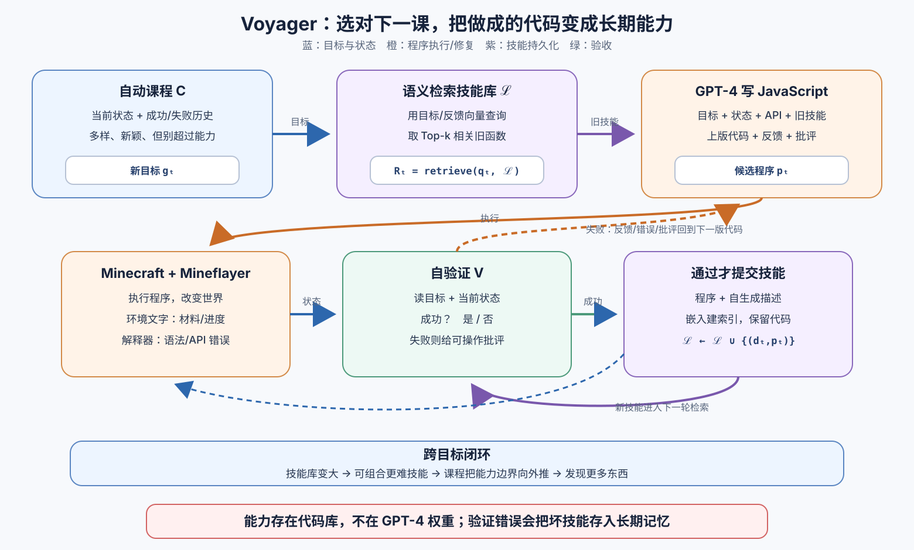

> **公开入口：** [arXiv](https://arxiv.org/abs/2305.16291) · [PDF](https://arxiv.org/pdf/2305.16291v2) · [TeX 源码包](https://export.arxiv.org/e-print/2305.16291) · [代码](https://github.com/MineDojo/Voyager) · [项目页](https://voyager.minedojo.org/)
>
> 文中的 `source/...:Lx–Ly` 对应解压后的 arXiv TeX 源码坐标；博客不镜像原论文文件。

> 论文：*Voyager: An Open-Ended Embodied Agent with Large Language Models* (首次公开 2023，TMLR 2024)
>
> 阅读标记：**论文事实**来自原文机制或数据；**脉络解释**是对前人工作的归纳；**我们的解释/判断**是为建立直觉和审计证据而补写，不代表论文已证明。

## 一句话结论

**Voyager 将开放世界的“下一步学什么”交给自动课程，把“怎么做”生成为可执行 JavaScript，用环境反馈和自验证反复修代码，成功后再将程序存入可检索技能库，从而让后来的技能复用前面的能力。**（论文事实；`source/1-intro.tex:L14–22`）

## 1. 基本概念：为什么这不只是“GPT-4 玩游戏”

- **开放式任务**：Minecraft 没有唯一结局和固定故事线。“探索尽可能多的东西”不能直接执行，agent 需要自己将它变成当前可完成的小目标。
- **自动课程（automatic curriculum）**：根据背包、附近物体、生物群系、时间、生命值，以及已成功/失败任务，提出一个不太容易也不至于做不到的新目标（论文事实；`source/2-method.tex:L5–18`）。
- **时间扩展技能**：不是一帧一帧按键，而是像 `craftStoneShovel()` 那样执行许多原子动作的代码。代码可读、可调用，还能组成更复杂函数（`source/1-intro.tex:L15–20`）。
- **终身/上下文学习**：基座 GPT-4 的权重不更新；新能力保存在外部代码库和历史状态中。因此“终身”是 agent 系统的持续积累，不是模型参数的持续学习（`source/1-intro.tex:L17–24`）。

**大白话心智模型。** 把 Voyager 想成一名自学木工：课程老师根据他现在的工具安排下一件习作；他先找出过去类似的操作卡，然后写新步骤；做错后看材料、工具报错和验收意见修改；做成才把操作卡收入工具箱。它的优势不在某一次灵感，而在“选课—练习—验收—存档”没有断开。

## 2. 观察到的失败、机制解释与前人方法

**论文事实。** 传统 RL/模仿学习常在原子动作上训练，长时间探索、可解释性和迁移都很难；早期 LLM agent 能生成计划或程序，却不会在超长时间中持续获得、累积和迁移技能（`source/1-intro.tex:L4–10`）。只给 ReAct/Reflexion “尽可能探索”这个抽象指令，它们在实验中也很难持续取得新进展（`source/3-experiment.tex:L27–32`）。

**我们的机制解释。** 开放式任务同时有三个瓶颈：目标空间太大，不知道当下该挑什么；一次生成的程序容易错；今天做成的行为如果没有持久化，明天又要从头生成。单独增加“思考更长”并不会消除这三个结构缺口。

**脉络解释。** ReAct 用思考—动作—观测循环接入环境；Reflexion 将失败压缩成下一试次的文字经验；AutoGPT 将高层目标分解为子目标。Voyager 在实验中为这些方法都提供了 MineDojo 状态或反馈，但只有自己同时拥有开放式课程、持久技能库和成功验收（论文的基线实现；`source/3-experiment.tex:L8–25`）。

**图 1｜Voyager 为何能把一次成功变成以后的能力。** 上方蓝色路径根据当前能力边界选下一目标；中间橙色回路反复生成、执行、读报错和验收；只有通过验收的程序才进入紫色技能库，后续通过语义检索被复用或组合。图为我们依据论文重画，不是原图。

## 3. 核心机制：输入、决策、动作、反馈

1. **选课。** GPT-4 读当前状态、已成功/失败目标和多样性指令，提出新目标。还用 GPT-3.5 对当前情境自问自答作为额外上下文（`source/2-method.tex:L12–18`）。
2. **找旧技能。** 将新计划和环境反馈的文本向量，与技能描述向量做近邻检索，取相关函数放进上下文（`source/2-method.tex:L20–35`）。
3. **写并执行程序。** GPT-4 看 Mineflayer 控制 API、检索到的旧函数、当前状态和上一版代码，生成新 JavaScript 并在游戏里运行（`source/2-method.tex:L24–33`）。
4. **三路反馈。** 环境文字说还差多少材料；解释器返回语法/非法调用；另一个 GPT-4 查当前状态是否已达标，失败时给批评（`source/2-method.tex:L37–45`）。
5. **停止或重试。** 通过自验证就存技能、继续选课；同一任务连续 4 轮仍卡住，就放弃当前目标请课程重选（`source/2-method.tex:L47`）。

### 三个模块为什么是乘法关系

**只有课程，没有技能库。** 目标顺序可以很合理，但每次都需要把过去已做成的操作重新写一遍。这会把“开始时会进步”变成“后来越来越难组合”。论文消融里无技能库版本在后期平台，正符合这个预测（`source/3-experiment.tex:L51–57`）。

**只有技能库，没有课程。** agent 可能拥有很多函数，却不知道哪个未见物品与当前资源之间只差一两步。随机目标会时而太简单、时而超出技术树，导致大量无法完成的四轮尝试。随机课程的 93% 下降因此不只是“GPT-4 更聪明”，而是目标建议是系统的探索策略。

**有课程和技能库，却没有验收。** 这是最危险的情况：新目标源源不断，代码也会不断入库，但库中的“技能”可能只是一段未报错的程序，而非完成了语义目标的程序。去掉自验证导致 73% 物品数下降，说明“代码能跑”和“任务已成”不能画等号。

因此三个模块不是可以各自加几分的独立插件：课程决定数据分布，迭代机制将失败转化为可通过的程序，技能库再改变以后的生成先验。任何一环失效，“终身学习”的飞轮就会断。

## 4. 公式：论文没有训练目标，关键是系统状态转移

这篇论文没有提出反向传播损失或新的 RL 目标。为了读清接口，可将原文算法**等价地**写成：

$$
\begin{aligned}
g_t &= C(s_t,H_t;\text{“多样且可达”}),\\
R_t &= \operatorname{TopK}_{k\in\mathcal L}
\cos\!\left(e(q_t),e(d_k)\right),\\
p_t &= G(g_t,s_t,R_t,p_{t-1},f_t,\epsilon_t,c_t),\\
(v_t,c_t) &= V(g_t,s_t),\\
\mathcal L_{t+1} &=
\begin{cases}
\mathcal L_t\cup\{(d_t,p_t)\}, & v_t=1,\\
\mathcal L_t, & v_t=0.
\end{cases}
\end{aligned}
$$

**逐符号读。** (s_t) 是游戏状态，(H_t) 是已成功/失败历史，(C) 是课程 LLM，(g_t) 是新目标；(\mathcal L) 是技能库，(e) 是文本嵌入，(q_t) 是当前计划/反馈查询，(d_k) 是第 (k) 个技能描述；(G) 生成程序 (p_t)，(f_t) 是环境反馈，(\epsilon_t) 是执行错误，(c_t) 是批评；(V) 返回成功标志 (v_t) 和批评。

**玩具例子。** 当前有木镐、没铁锭，课程提出“制作石镐”；语义检索找到 `mineCobblestone()` 和 `craftPlanks()`。第一版程序报“工作台不在附近”，第二版先放工作台再合成；验证者在背包里看到石镐，才将函数存库。若验证者错把“有圆石”当成“有石镐”，一个未完成函数就会污染技能库。

**边界检查。** 当 (\mathcal L=\varnothing) 时，系统仍可用原子 API 写技能，但没有复用优势；若检索向量把相反操作找回来，代码上下文会被错误示例干扰；若 (V) 永返回失败，技能库永不增长；若 (V) 永返成功，未经验证的程序会被累积。这说明自验证是技能库的质量门，不是可有可无的文字点评。

## 5. 可证伪预测

1. **若课程解决的是难度排序和新颖性，**用随机目标替换它后，独特物品数应大幅下降，而且更多时间浪费在当前资源不支持的目标上。
2. **若技能库提供组合性而不只是多几个 token，**去掉技能库的代理初期可能接近，后期应较早平台；把同一技能库插给另一 agent，也应提升其新世界任务。
3. **若自验证是质量门，**定量注入假阳性会导致无效技能比例增长，后续复用任务的错误应呈累积而不是独立分布。

## 6. 实验：做了什么、效果怎样

**实验设定。** 系统使用 `gpt-4-0314`、`gpt-3.5-turbo-0301`、`text-embedding-ada-002`，基于 MineDojo 与 Mineflayer 高层 JavaScript API。除课程温度 0.1 以外均为 0（`source/3-experiment.tex:L4–6`）。

| 要检验的主张 | 结果 | 能说明什么，不能说明什么 |
|---|---|---|
| 开放探索能否持续向外扩展 | 160 次 prompting 内发现 63 种独特物品，是基线的 3.3 倍；移动距离 2.3 倍（`source/3-experiment.tex:L27–39`） | 支持整体系统比适配后基线更会探索；没有隔离三个模块各自对 3.3 倍的贡献 |
| 是否建立递进技术树 | 木、石、铁级里程碑最快分别 15.3、8.5、6.4 倍；只有 Voyager 到达钻石级，但是 3 次中只成功 1 次，需 102 次 prompting（`source/3-experiment.tex:L33–37`；`source/tables/tech_tree_table.tex:L10–16`） | 表明可到达更深层级；钻石数据只有一次成功，不是稳定通关 |
| 学到的技能能否换世界复用 | 清空背包、换新世界；钻石镐、金剑、熔岩桶、指南针均 3/3 成功，平均 18–21 次 prompting；ReAct/Reflexion/AutoGPT 在 50 次上限内都为 0/3（`source/tables/downstream_table.tex:L10–17`） | 支持外部技能迁移；每任务仅 3 次，方差估计很弱，且 Voyager 仍用 GPT-4 分解新任务 |
| 三个核心环节是否真的必要 | 随机课程使物品数下降 93%；去掉自验证下降 73%；无技能库的后期探索较早平台（`source/3-experiment.tex:L51–58`） | 消融方向符合三个机制预测；没有报告这里每个差异的置信区间 |
| 语义检索是否可用 | Top-1 准确率 (80.2\pm3.0)%，Top-5 (96.5\pm0.3)%（`source/appendix/tables/retrieval_acc.tex:L4–9`） | 说明选取多个候选时经常能覆盖目标技能；不代表被检索代码执行必然成功 |

**强消融也暴露依赖。** 代码生成用 GPT-3.5 时，GPT-4 版发现的独特物品是其 5.7 倍（`source/3-experiment.tex:L57–58`）。这表明闭环不会自动弥补代码模型的根本能力差，也限制了“方法独立于基座模型”的解读。

### 实验审计：为什么不能只记 3.3 倍

**比较单位是 prompting iteration，不是游戏帧数。** 一次 prompting 可生成一段包含许多低层动作的程序，不同程序的执行时长和 token 数未必相同。所以“15.3 倍更快”是按 LLM 交互次数定义的效率，不是玩家时间、环境步数或美元成本上都快 15.3 倍。

**组件消融比总分更接近机制证据。** 63 种物品证明整体系统有效，随机课程和无自验证的性能塌缩才分别对准“任务难度排序”和“验收决定是否入库”。无技能库的后期平台也符合复杂技能需要组合旧程序的预测。但论文未对所有组件交互做全因子实验，所以不能从这些消融推出模块间没有耦合。

**多项关键结果只有三次试验。** 新世界四项任务的 3/3 看上去很整齐，但样本量太小，无法精确估计失败率；钻石技术树只有 1/3 更直接提醒我们，“唯一解锁”不等于“已稳定掌握”。一个完整复现应增加随机世界种子和重复数，并报告失败原因分布，不只是平均 prompting 次数。

## 7. 优点、缺点与失效边界

**优点。** 系统将目标发现、行为修复、成功验收和知识持久化连成一个完整闭环。代码技能是可读且可组合的中间表示，不会因为提示窗口移出就必然丢失。把技能库插给 AutoGPT 也有部分增益，说明它不完全只是 Voyager 内部的提示技巧（`source/3-experiment.tex:L44–47`）。

**评测缺点。** 基线原本为 NLP 设计，都由作者重新适配 Minecraft；与像素输入、低层键鼠动作的 agent 不直接对比。论文明确说它借助高层 Mineflayer API，目标不是解决三维感知和传感控制（`source/3-experiment.tex:L8–25`）。因此 3.3 倍是该高层代码接口下的系统对比，不是全 Minecraft agent 的通用排行。

**机制缺点。** 课程会幻觉根本不存在的铜剑/铜胸甲，代码会把圆石当燃料或调用不存在的 API，自验证也可能没认出蜘蛛线就是杀死蜘蛛的信号（论文事实；`source/4-discussion.tex:L4–10`）。技能库的“避免灾难性遗忘”也是通过不覆写旧程序实现；它没有解决 API 版本变化后旧技能失效、技能相互冲突或技能库无限增长的管理问题。

**“会检索”与“会组合”也需要区分。** 技能描述的 Top-1 准确率回答的是“相关函数有没有被找到”，却没回答 GPT-4 是否正确处理函数的前置条件、参数和失败返回。两个单独可执行的函数也可能因为都消耗同一资源而无法直接串联。因此复现时应保留具体调用图，区分“旧函数被放入提示”、“生成代码实际调用它”和“组合后任务成功”。只有最后一层才支持“能力复利”的强解读。

**成本和视觉边界。** 原文称 GPT-4 API 为 GPT-3.5 成本的 15 倍，而当时又依赖 GPT-4 代码质量（`source/4-discussion.tex:L4–5`）。系统本身不看像素，复杂三维建筑需要人类作视觉批评者或手工拆课程（`source/3-experiment.tex:L64–69`）。

这一点也限制了“具身”的含义：Voyager 确实通过动作改变环境并读取反馈，但它站在已结构化的状态和高层运动 API 上。结果支持长时程任务管理和程序技能积累，不支持它已学会从视觉原始输入获得三维世界模型或低层感知运动控制能力；这两类能力仍需要单独实验检验。

## 8. 复现建议与思考题

1. 先锁定游戏版本、Mineflayer API、模型版本和全部提示；按原文以 prompting 次数作为主计数，同时补充 token、调用费用和环境时间。
2. 最小复现应保留六个官方消融：课程、技能库、环境反馈、执行错误、自验证和代码 LLM；不要加额外启发式去“救”某个消融。
3. 把技能库的“检索准确”、“代码执行成功”、“复用后任务成功”分开报告，避免用 Top-k 检索覆盖真实工程失败。
4. 请自答：如果去掉自动课程而保留技能库，为什么 agent 可能“会做很多事”却还是发现不了新物品？
5. 请设计一个注入自验证假阳性的实验，预测失败技能如何沿着“技能库 (\rightarrow) 检索 (\rightarrow) 新程序”逐步放大。
