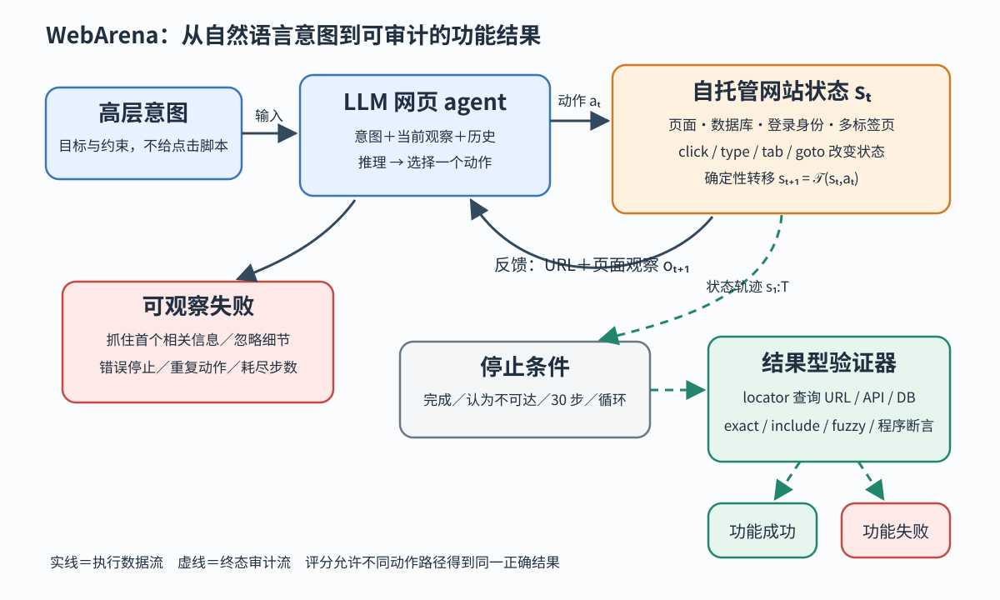

> **公开入口：** [arXiv](https://arxiv.org/abs/2307.13854) · [PDF](https://arxiv.org/pdf/2307.13854v4) · [TeX 源码包](https://export.arxiv.org/e-print/2307.13854) · [代码](https://github.com/web-arena-x/webarena) · [项目页](https://webarena.dev/)
>
> 文中的 `source/...:Lx–Ly` 对应解压后的 arXiv TeX 源码坐标；博客不镜像原论文文件。

> 论文信息：Shuyan Zhou 等；首次公开于 2023-07-25；ICLR 2024；[arXiv:2307.13854](https://arxiv.org/abs/2307.13854)；[代码](https://github.com/web-arena-x/webarena)。
>
> 证据版本：上述 PDF 共 22 页，SHA-256 `f9731b92bc3d29a2ea7b5f9cb46b48540c76bc3f84a57e0c48fc37ea73107f95`；TeX 源码完整，可做行级定位。
>
> 阅读提示：下文用“**论文事实**”“**跨论文解释**”“**我们的判断**”区分证据层次。这里的“成功”是任务结果正确，不等于动作轨迹与某条示范完全一致。

## 一句话结论

**论文事实。** WebArena 的核心贡献不是发明一种新 agent，而是把网页 agent 的问题改造成一个可重复运行、能真实修改网站状态、并按最终功能结果评分的实验对象：812 个任务运行在自托管的购物、论坛、协作开发和内容管理网站上。最好的 GPT-4 基线成功率只有 14.41%，而人类为 78.24%。这证明当时的语言模型即使能逐步“说出理由”，也远未可靠地完成长程网页事务；但这一数字只适用于论文的环境、提示和 30 步预算，不能外推为 GPT-4 的普遍能力（`source/main.tex:100-116,393-420`）。

## 1. 基本概念

网页 agent 接收一个高层意图，例如“查询最新订单何时到达”，而不是一串点击指令。**状态**是网站数据库、页面内容、登录身份和标签页等真实内部情况；**观察**是 agent 此刻可见的 URL、标签页和页面表示；**动作**是点击、输入、滚动、切换标签页或跳转 URL；**反馈**是动作后页面和状态的变化；**终态验证器**直接查询页面、API 或数据库，判断目标是否已经实现。

**论文事实。** 作者把环境记为 $\mathcal E=\langle\mathcal S,\mathcal A,\mathcal O,\mathcal T\rangle$。$\mathcal S$ 是状态空间，$\mathcal A$ 是动作空间，$\mathcal O$ 是观察空间，确定性转移 $\mathcal T:\mathcal S\times\mathcal A\to\mathcal S$ 由网站实现给出。agent 在第 $t$ 轮根据意图 $\mathbf i$、当前观察 $o_t$、过去动作与观察选择 $a_t$，网站进入 $s_{t+1}$ 并返回 $o_{t+1}$（`source/main.tex:123-129`；PDF 第 3 页）。这里“部分可见”虽未写入环境四元组，却由状态与观察分离体现：agent 看到页面，并不直接看到整个数据库。

贯穿全文的最小任务是：“在论坛的 `nyc` 版发帖询问是否需要汽车。”它至少涉及打开论坛、定位版面、创建帖子、输入内容、提交和确认。可能有多条正确路径，所以逐动作与单一参考轨迹比对会误杀正确解；真正关心的是最终帖子是否位于正确版面且含有要求文本。

一个有用类比是“考驾照看是否安全到达终点，而不是要求每次变道都与教练录像一致”。类比的边界也很重要：网页验证器只检查预先编码的属性，未必能发现越权副作用、意外删除或真实用户体验受损。

## 2. 问题：旧方法在哪里失败

### 2.1 观察到的失败

**论文事实。** 作者指出三类评测错位：旧环境常只有现实网站功能的缩减版，任务因而更短更单一；静态缓存环境只允许访问采集时见过的状态，不能让 agent 真正探索；以预测动作序列和参考序列的表面相似度评分，会忽略不同路径可能得到同一正确结果（`source/main.tex:82-88`）。在线真实网站又会出现验证码、内容漂移和配置变化，使不同时间的实验不可比；WebArena 因此采用自托管网站和可复位镜像（`source/main.tex:120-125`）。

基线也暴露了具体失败。GPT-4 会抓住首页第一个看似相关的信息，却不进入历史报表核验；已经输入“DMV area”后仍重复输入，直到耗尽步数；它还把 54.9% 的可完成任务错误判断为不可完成（`source/appendix.tex:396-410`；`source/main.tex:429-440`）。这些不是单轮问答中的“答案差一点”，而是错误观察、错误停止和循环动作共同造成的终态失败。

### 2.2 机制解释

**论文事实。** 作者假设 GPT 模型主要接受对话式预训练和监督微调，习惯依据紧邻观察执行指令，因此缺少主动探索，并容易忽略观察中的细微差异（`source/appendix.tex:404-410`）。论文还把复杂任务需要的能力概括为层次规划、状态跟踪和错误恢复（`source/main.tex:493-499`）。

**我们的判断。** 更可检验的因果链是：长页面把关键证据埋在大量相似节点中；agent 没有稳定的“已查地点—未查地点—目标约束”状态；一次错误动作后的页面变化又未被精确比较；于是它将局部相关性误当目标完成，或者在同一观察上重复动作。WebArena 的价值是让这一链条留下可审计轨迹和终态，而不是证明“对话训练”就是唯一原因。注意力负担、提示格式、上下文截断和动作 ID 变化也都是替代解释。

### 2.3 既有解法

**跨论文解释。** 论文把先前干预按环节归类：任务分解和程序化执行改善子任务管理；搜索与回溯允许重新考虑计划；Reflexion 类自纠错和失败恢复处理坏动作后的修正；观察摘要减少长页面负担；WebShop、Mind2Web 等先前网页基准则分别提供交互购物或离线网页轨迹。WebArena 没有把这些机制混成一个新系统，而是建立能分别测它们的环境（`source/main.tex:460-499`）。

**我们的判断。** 这一区分很关键：CoT 改的是“动作前显式推理”，环境复位改的是“实验可重复性”，终态验证改的是“测量对象”。若结果提升，不能只凭总成功率断言是哪一机制起作用，必须做受控消融。

## 3. 核心机制：网站状态—动作—反馈—终态验证

**图 1｜原创机制图。** 实线表示执行数据流：高层意图与当前观察进入 agent，动作改变自托管网站状态，网站再返回新观察；虚线表示控制与审计：轨迹到达停止条件后，结果型验证器查询最终或中间状态。蓝色框是 agent 可见信息，橙色框是实际环境，绿色框是评分，红色框标出可观察的失败。图的结论限于：WebArena 把“生成一个动作”扩展成“闭环执行并验证功能结果”，不表示验证器覆盖所有副作用。

**论文事实。** 观察可取原始 DOM、截图或可访问性树；基线采用带元素 ID 的可访问性树。动作分为元素操作、标签页操作和 URL 导航，元素既可用坐标也可用唯一 ID 指定（`source/main.tex:156-189`）。网站来自真实开源软件与现实数据，Docker 镜像包含代码、数据库和依赖，可从固定初始状态重启（`source/appendix.tex:3-34`）。

### 3.1 最小贯穿例子

第一轮，agent 看见意图和论坛首页，决定点击 `nyc` 版面；反馈是 URL 与帖子列表变化。第二轮，它点击“创建帖子”；反馈是编辑表单。第三轮，它填写标题和正文；第四轮提交。此时“我看见了帖子”仍不是评分本身。验证器先定位最新帖 URL，检查其中是否包含 `/f/nyc`，再读取正文并检查是否含“a car in NYC”。两项都满足才算成功；论文给出了相应 locator 与 `must_include` 实现示例（`source/main.tex:304-345`）。

自解释检查：若删除动作历史，agent 如何判断表单是否已经填过？若只检查当前页面 URL，错误版面中的同名帖子会不会被判成功？若只比较参考轨迹，先搜索版面再发帖的另一条正确路径会不会被判失败？

### 3.2 可证伪预测

**我们的判断。** 若“缺少显式状态跟踪导致重复和漏约束”的解释成立，在相同模型、相同观察、相同步数和解码设置下，只增加一个结构化状态表（目标约束、已完成子目标、上轮动作、页面变化），应显著减少“同一观察重复动作”和“不完整执行”，且改善幅度应在跨页、跨站模板上大于短任务。若重复率下降而终态成功率不升，说明状态跟踪不是主要瓶颈，可能是元素定位或知识不足；若连重复率也不降，应先审计状态表是否真的进入决策，而不是再叠加启发式。

另一个预测针对主动探索：隐藏目标信息在第二个相关页面，控制页面长度和动作预算。若作者机制成立，允许显式列举并核销候选信息源应提高正确报告率；若模型仍停在第一个相关页面，则需要推翻或细化“只是缺少探索提示”的解释。

## 4. 关键定义与玩具计算

### 4.1 闭环转移

大白话目的：把网页任务定义成反复“看—做—再看”，而非一次文本生成。论文给出

$$
s_{t+1}=\mathcal T(s_t,a_t),\qquad o_{t+1}=\mathrm{Obs}(s_{t+1}).
$$

第二个 `Obs` 是为理解补写的观察映射，论文原文只说明新状态及其对应观察。符号账本：$t$ 是轮次；$s_t\in\mathcal S$ 是完整网站状态；$a_t\in\mathcal A$ 是一次合法动作；$o_t\in\mathcal O$ 是对状态的可见投影；$\mathcal T$ 在固定初始镜像上是确定的。玩具例子：$s_0$ 中帖子数为 10，动作 $a_0$ 提交新帖，$\mathcal T$ 令帖子数变 11，$o_1$ 显示新帖页面。边界检查：无效点击可能使 $s_{t+1}=s_t$；确定性不等于 agent 能预测结果，也不保证外部 LLM 推理可复现。

### 4.2 结果型奖励

论文把总奖励写为 $r(\mathbf a_1^T,\mathbf s_1^T)$，信息任务用 $r_{\mathrm{info}}(\hat a,a^*)$，操作任务用 $r_{\mathrm{prog}}(\mathbf s)$（`source/main.tex:128-129,285-345`）。其中 $T$ 是终止轮次，$\mathbf a_1^T$ 是动作序列，$\mathbf s_1^T$ 是状态序列，$\hat a$ 是预测文本，$a^*$ 是参考答案。`exact_match` 要完全相同；`must_include` 要包含指定关键词；`fuzzy_match` 由 GPT-4 判断语义等价；程序验证器则用 locator 取数据库、API 或页面字段再断言。

玩具计算：目标是正文同时包含“car”和“NYC”，预测正文为“Do I need a car in NYC?”，两个 `must_include` 均为 1，因此该内容检查通过；若帖子发在 `boston` 版，URL 检查为 0，合取后任务仍失败。边界检查：`must_include` 可能被否定句骗过；模糊匹配引入模型裁判误差；只查终态会漏掉不可接受的中间副作用。论文手工核对 40 个模糊匹配样本，39 个与人类一致；其中多数日期/时长格式任务又以各 900 个样本测试两个 GPT-4 版本，均为 100%，但这不能证明开放语义判断也有 100% 可靠性（`source/appendix.tex:102-120`）。

## 5. 实验：每组证据回答什么

| 主张 | 受控比较与范围 | 指标与结果 | 审计结论 |
|---|---|---|---|
| 环境对当时模型很难 | GPT-4、GPT-3.5、text-bison，812 个任务，最多 30 次状态转移 | 最佳 GPT-4：14.41%；人类：78.24% | 支持“该设置下有大差距”，不证明失败只因长程规划 |
| CoT 是否有帮助 | GPT-3.5，均有 UA hint | 6.41% → 8.75%，增加 2.34 个百分点 | 有小幅相关改善，但无方差与显著性 |
| 不可完成提示是否有副作用 | GPT-4 CoT，有/无 UA hint | 总体 11.70% → 14.41%；不可完成任务 77.78% → 44.44% | 明确展示停止策略的权衡 |
| 模板内能否稳定泛化 | 无 UA hint、至少一次成功的 61 个模板 | GPT-4 仅 4 个模板全成功；GPT-3.5 为 0 | 支持同语义模板的实例仍不稳定 |
| 人类上限多高 | 每个 170 模板抽一题，5 名计算机研究生 | 平均 110 秒；信息任务 74.68%，其他 81.32%，总体 78.24% | 是特定熟练人群表现，不是完美上限 |

上述数字分别定位于 `source/main.tex:393-452` 和 `source/main.tex:362-378`。实验统一采用带元素 ID 的可访问性树；模型温度 1.0、top-p 0.9，最多 30 步，并对重复或连续无效动作提前终止（`source/main.tex:381-390`；`source/appendix.tex:62-68`）。因此模型差距与提示、采样、终止器共同绑定。尤其 14.41% 来自“CoT、无 UA hint”，而正文另有 11.70% 的“CoT、有 UA hint”；混写两者会掩盖消融条件。

## 6. 优点

**思想。** 把测量目标从参考动作相似度改成可执行环境中的功能正确性，允许多条有效路径。把真实性与可重复性同时当作设计约束，而非二选一。

**实验。** 有可完成与不可完成任务、跨站长程任务、终态程序验证和人类参照；UA hint 消融揭示提示会同时改善拒答又伤害可完成任务。

**工程工件。** 网站、数据、Docker 复位脚本、Gym API、轨迹和验证器形成可复现实验闭环。多标签页、权限与历史用户档案使状态更接近真实浏览。

## 7. 局限与失效边界

**论文事实。** 地图只覆盖美国东北部；Wikipedia 截止 2023 年 5 月；人类任务需要领域知识，参与者是计算机研究生；环境重置虽可行但有时间成本（`source/appendix.tex:15-34,59-60`）。网站是现实软件与采样数据的自托管副本，不等于开放互联网。

**我们的判断。** 第一，程序验证器的覆盖率决定“功能正确”的含义，漏写断言会产生假阳性。第二，模型裁判虽在格式等价样本上表现好，开放文本仍可能有偏差。第三，温度 1.0 却未报告多随机种子置信区间，2.34 个百分点的 CoT 差异不宜称为稳定因果效应。第四，元素 ID 降低视觉定位难度，因此结果不能代表纯像素网页操作。第五，数据和网站版本冻结提升可比性，却牺牲了对动态内容、验证码、网络延迟和安全策略的外部效度。

## 8. 复现路线

最小复现不必先跑全部 812 题。选一个信息查询、一个发帖操作、一个不可完成任务；固定 Docker 镜像、用户身份、模型版本、温度和 30 步预算；逐轮保存观察、动作、状态差异和停止原因；最后分别运行文本与程序验证器。核对点是：复位后初态哈希一致；同一动作在同一状态产生同一网站状态；验证器能拒绝“正确文字、错误位置”；失败被归到观察误读、错误停止、重复、无效动作或预算耗尽。成本风险主要是多网站镜像、旧依赖和闭源模型版本漂移。

## 9. 思考题

1. 若保留终态验证却删除中间状态，哪些“先删数据再恢复”的危险路径会被漏掉？
2. 为什么“无 UA hint 总成功率更高”不能推出系统永远不应提示不可完成？
3. 什么实验能区分“模型没看见关键节点”和“看见但没有更新内部状态”？
4. 若把元素 ID 换成截图坐标，成功率下降应归因于规划还是视觉定位？
5. 同模板只成功一个实例时，怎样控制页面长度、重复操作数和权限来定位原因？

## 10. 证据定位

- 环境定义、网站、观察与动作：PDF 第 3–4 页；`source/main.tex:120-189`。
- 任务与评价：PDF 第 5–6 页；`source/main.tex:197-378`。
- 基线、结果与 UA hint 消融：PDF 第 6–7 页；`source/main.tex:381-456`。
- 网站规模、复位、模型配置与验证器审计：`source/appendix.tex:3-120`。
- 追加失败案例与作者机制假设：`source/appendix.tex:396-410`。
- 正式入口：[ICLR OpenReview](https://openreview.net/forum?id=oKn9c6ytLx)；[项目主页](https://webarena.dev/)。
