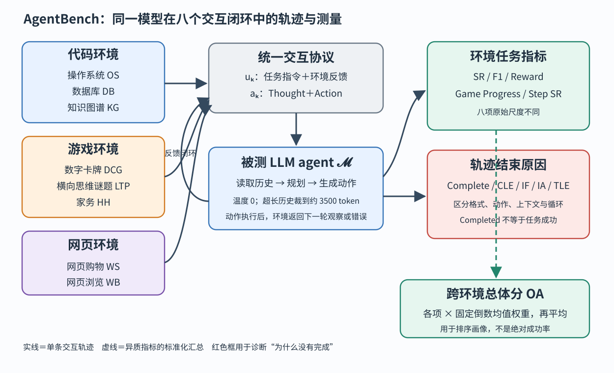

> **公开入口：** [arXiv](https://arxiv.org/abs/2308.03688) · [PDF](https://arxiv.org/pdf/2308.03688v3) · [TeX 源码包](https://export.arxiv.org/e-print/2308.03688) · [代码](https://github.com/THUDM/AgentBench) · [项目页](https://llmbench.ai/agentbench)
>
> 文中的 `source/...:Lx–Ly` 对应解压后的 arXiv TeX 源码坐标；博客不镜像原论文文件。

> 论文信息：Xiao Liu 等；首次公开于 2023-08-07；ICLR 2024；[arXiv:2308.03688](https://arxiv.org/abs/2308.03688)；[代码](https://github.com/THUDM/AgentBench)。
>
> 证据版本：上述 PDF 为 arXiv v3，共 58 页，SHA-256 `9c780e35fc0b2de6c2e21e0572f6aaaadcf7ecdd56d63cfaae2b415bc0dc83c3`；当前源码宏定义 29 个模型，包含首稿后新增模型，因此数字均按本地 v3 解读。
>
> 阅读提示：下文明确标记“**论文事实**”“**跨论文解释**”“**我们的判断**”。AgentBench 是评测集合与运行框架，不是一种提高 agent 能力的新算法。

## 一句话结论

**论文事实。** AgentBench 把“LLM 会不会做 agent”拆成八种交互环境：操作系统、数据库、知识图谱、数字卡牌、横向思维谜题、家务、网页购物和网页浏览，并用统一的多轮接口记录动作、反馈、终止原因和任务指标。在本地 v3 的 29 模型评测中，GPT-4 总分 4.01，八项中六项最佳；测试范围内开源模型平均总分 0.51，API 模型平均 2.32。更重要的是，失败不是一个单一“答错率”：无效格式、无效动作、上下文超限和任务轮数超限对应不同机制（`source/3_experiment.tex:59-85`；`source/tables/main_results.tex:17-54`）。

## 1. 基本概念

“LLM-as-Agent”指模型不只返回最终文本，而是在环境中反复接收反馈并选择动作。**论文事实。** 作者用部分可观测马尔可夫决策过程 $(\mathcal S,\mathcal A,\mathcal T,\mathcal R,\mathcal U,\mathcal O)$ 表示评测：状态、动作、转移、奖励、任务指令和观察共同决定闭环；被测模型记为 $\mathcal M$（`source/1.5_definition.tex:3-8`；PDF 第 3 页）。

八个环境分三组。代码落地包括 OS、数据库和知识图谱；游戏落地包括数字卡牌、横向思维谜题和 ALFWorld 家务；网页落地包括 WebShop 购物和由 Mind2Web 改造的网页浏览。它们分别使用成功率、答案 F1、奖励、游戏进度或步骤成功率，而非一个天然同质的指标（`source/2_method.tex:7-78`；`source/tables/stats.tex:14-23`）。

贯穿全文的最小例子是数据库任务：“把表中分数超过 60 的学生标成 PASS。”模型先看到任务和数据库接口，生成带 `Thought` 和 `Action` 的 SQL；环境执行后返回结果或错误；模型可以改写 SQL；结束时任务评分器检查结果。一次正确 SQL 是单步能力，看到“列名需反引号”的错误后修正才是交互能力。

可把 AgentBench 类比为“八项全能”：同一运动员在不同项目得分，再做标准化汇总。类比的边界是，各环境并非只测一种纯能力；数据库格式错误可能同时反映提示遵循、SQL 知识和解析器严格度，不能把某项分数直接命名为模型内部的某个心理能力。

## 2. 问题：旧评测在哪里失败

### 2.1 观察到的失败

**论文事实。** 作者认为旧文本游戏常有封闭离散动作和窄化的常识落地；复杂多模态模拟器又不适合紧急评估当时的纯文本 LLM；多数 agent 基准只含单一环境，无法给出跨场景能力画像（`source/1_intro.tex:30-35`）。传统单轮框架不适合多轮交互；既有 agent 框架往往与单一任务绑定、组件必须同机、一次只能测一个 agent—任务组合（`source/appendix/framework.tex:5-19`）。

实际轨迹显示更细的失败。作者定义五种结束类型：完成、上下文超限 CLE、格式无效 IF、动作无效 IA、任务轮数超限 TLE。IF 是输出不符合协议；IA 是格式对但动作或参数不合法；TLE 是到最大轮数仍未解出或持续重复（`source/1.5_definition.tex:15-25`）。跨模型平均时，知识图谱和横向思维谜题的 TLE 分别为 67.9% 和 82.5%；家务的 IA 为 64.1%；数据库 IF 为 53.3%（`source/tables/analysis.tex:9-22`）。这些数字表明“没有完成”在不同环境中由不同接口环节主导。

### 2.2 机制解释

**论文事实。** 作者把 IF、IA 主要联系到指令遵循，把 TLE 联系到多轮推理与决策薄弱；对 TLE 轨迹的进一步审计发现，其平均长度为 25.5 轮，并且超过 90% 的 TLE 轨迹在最后 10 轮中至少有两次回复 Rouge-L 不低于 0.8，说明循环重复是主要表象（`source/appendix/case_study.tex:419-456`）。数据库案例还显示，能否从执行错误中自纠 SQL 与得分相关（`source/appendix/case_study.tex:475-477`）。

**我们的判断。** 最简机制链是：环境只暴露局部观察；模型要把长期目标、已执行动作和新错误保持在有限上下文中；若没有稳定的计划状态，它可能偏离原计划；一旦动作无效或没有推进，近似相同的观察再次进入模型，贪心解码又生成相似动作，最终形成循环并触发 TLE。这个解释可覆盖“忘记—重复—超限”，但不能把 Rouge-L 重复当作因果证明：重复可能是环境死锁、候选动作缺失或历史裁剪的结果。

### 2.3 既有解法

**跨论文解释。** 论文选择最基础的 CoT/ReAct 风格 `Thought + Action`，不使用多次采样、集成、反思或搜索，理由是成本低且易部署；作者将 Self-Consistency、Reflexion 和 Tree-of-Thoughts 列为更复杂策略（`source/1.5_definition.tex:10-13`）。八项环境复用或改造 TextWorld/ALFWorld、WebShop、Mind2Web 等成熟任务，也新建 OS、数据库等环境。干预环节不同：CoT改变动作前的显式推理；反思改变错误后的更新；搜索改变候选计划选择；AgentBench 本身改变的是测量覆盖面与运行协议。

**我们的判断。** 因此不能从 AgentBench 分数推断“CoT 是最佳 agent 方法”。它刻意保持简单基线，目的是暴露模型差异。任何后续方法若同时改提示、记忆、搜索次数和模型调用预算，都需要单独消融，避免用更多计算掩盖机制。

## 3. 核心机制：多环境评测—交互轨迹—环境指标

**图 1｜原创机制图。** 左侧八个环境按代码、游戏、网页三类分组；中间统一协议把任务指令与环境反馈组成用户消息，模型输出 `Thought + Action`，再执行成下一轮；右侧同时记录任务分数和结束原因。实线是单条轨迹的数据流，虚线是跨环境汇总。图的结论是同一模型被放进多种闭环，并非八项分数天然可直接平均；总体分需按论文权重标准化。

**论文事实。** 对话轨迹写成 $(u_0,a_0,\ldots,u_k,a_k)$，推理输入止于最新用户消息 $(u_0,a_0,\ldots,u_k)$。若历史过长，框架保留初始指令和后缀，选择最小 $r$ 使估算 token 不超过 3500，并在首条消息中注明省略了 $2r$ 条消息。所有任务温度为 0；提示一轮内同时要求 Thought 和 Action（`source/3_experiment.tex:31-44`）。这使模型差异较少受采样噪声影响，但历史裁剪本身会改变长程任务。

### 3.1 最小贯穿例子

轮 0：$u_0$ 给出数据库任务、工具协议和输出格式。模型 $a_0$ 先查询表结构。环境返回列名含空格。轮 1：模型提交未加反引号的 SQL，数据库反馈语法错误。轮 2：模型若引用错误并加反引号，就是自纠；若原样重发，就是重复；若输出一段解释却没有 `Action:`，归为 IF；若调用不存在的操作，归为 IA；若不断循环，归为 TLE。任务最终是否正确与轨迹是否“合法完成”是两条信息：`Completed` 只表示正常结束，不保证答案正确（`source/appendix/validation.tex:10-24`）。

自解释检查：若只保留最终任务分数，我们能否区分 SQL 不会写与格式解析失败？若把错误反馈从历史中删掉，自纠率应怎样变化？若放宽解析器，IF 下降是否必然意味着任务能力提高？

### 3.2 可证伪预测

**我们的判断。** 若 TLE 的主要机制确实是“未跟踪进展导致循环”，在同一模型、温度 0、相同轮数预算下，加入只记录“上轮动作—状态是否变化—未完成子目标”的最小结构化记忆，应先降低 Rouge-L 重复比例，再降低 TLE，并提高成功率；效果应在知识图谱和横向思维谜题上大于数据库。若重复下降但成功率不升，说明循环只是症状，真正瓶颈可能是工具知识或探索策略；若成功率升而重复不降，则应检查指标或停止规则。

第二个预测针对格式错误：保持模型输出语义不变，只把严格文本协议换成约束解码或函数调用。如果 DB 的 IF 大降、任务成功率同步上升，可支持“接口遵循是独立瓶颈”；若 IF 大降而成功率不变，则原结论把表面协议错误说得过重。

## 4. 关键公式与评价定义

### 4.1 POMDP 账本

$$
(\mathcal S,\mathcal A,\mathcal T,\mathcal R,\mathcal U,\mathcal O)
$$

大白话目的：说明测试对象是“根据不完整反馈连续行动”，不是静态问答。$\mathcal S$ 为真实状态；$\mathcal A$ 为合法动作；$\mathcal T$ 根据状态和动作产生新状态；$\mathcal R$ 给轨迹或结果评分；$\mathcal U$ 是任务指令；$\mathcal O$ 是可见反馈；$\mathcal M$ 是被测 LLM agent。玩具例子中，数据库真实表是 $s_t$，查询结果是 $o_t$，SQL 是 $a_t$，执行器是 $\mathcal T$，更新是否正确由 $\mathcal R$ 判定。边界检查：如果 $\mathcal O=\mathcal S$，就退化为完全可观测；若动作空间不含正确操作，再强的推理也无法成功。

### 4.2 总分 OA 的重建

论文用文字定义加权总分。为便于计算，可重写为

$$
\mathrm{OA}_m=\frac1J\sum_{j=1}^{J} w_j x_{m,j},\qquad
w_j=\frac1{\bar x_j},\qquad
\bar x_j=\frac1M\sum_{m=1}^{M}x_{m,j}.
$$

这是对 `source/3_experiment.tex:46-54` 的忠实重建，不是论文排版出的公式。$J=8$ 是环境数；$M$ 是用于标定权重的模型数；$x_{m,j}$ 是模型 $m$ 在环境 $j$ 的原始分；$\bar x_j$ 是该环境跨标定模型均分；$w_j$ 是其倒数；$\mathrm{OA}_m$ 是标准化后八项平均。某环境普遍分高，权重便小，避免它淹没难环境。

玩具计算：只有两项，所有模型在 A、B 的均分分别为 20 和 5，则权重为 0.05 和 0.2。某模型得 40 和 5，标准化分分别为 2 和 1，总分 $(2+1)/2=1.5$。边界检查：若某项均分为 0，倒数无定义；权重依赖最初模型集合，新增模型会改变标尺，所以论文固定已有模型的倒数均分供未来比较。OA 不是百分比，4.01 不能读成“成功率 4.01%”。

### 4.3 重复率 $P(n,t)$

论文定义

$$
P(n,t)=\frac{\#\{(r_1,\ldots,r_m)\in T:\exists i,j,\ m-n<i<j\le m\land \mathrm{RougeL}(r_i,r_j)\ge t\}}{\#T}.
$$

$T$ 是所有 TLE 响应序列的集合；$r_i$ 是第 $i$ 轮 agent 回复；$m$ 是该轨迹长度；$n$ 是检查末尾多少轮；$t$ 是 Rouge-L 阈值；$\#$ 是集合大小。玩具例子：4 条 TLE 轨迹中，有 3 条在最后 10 轮出现一对相似度至少 0.8 的回复，则 $P(10,0.8)=3/4=75\%$。极端检查：$t$ 越低越容易计为重复；$n$ 越大越容易找到一对；该指标检测文本相似，不保证动作或环境状态相同（`source/appendix/case_study.tex:448-456`）。

## 5. 实验：每组证据回答什么

| 主张 | 范围与比较 | 指标与关键结果 | 审计 |
|---|---|---|---|
| 多环境能拉开模型差异 | 本地 v3 的 29 个 API/OSS 模型，八环境 | GPT-4 OA 4.01；GPT-3.5 2.32；CodeLlama-34B 0.96 | 支持该协议下差距，OA 不是绝对成功率 |
| GPT-4 并非处处相同 | 同一模型跨八环境 | OS 42.4、DB 32.0、KG 58.8、卡牌 74.5、谜题 16.6、家务 78.0、购物 61.1、浏览 29.0 | 展示异质画像，不可按单项命名内部能力 |
| API 与测试范围内 OSS 有差距 | 论文所选模型类别 | 平均 OA 2.32 对 0.51 | 模型选择、规模和训练数据混杂，非开闭源因果效应 |
| 失败类型依环境变化 | 所有模型的结束原因平均 | DB 的 IF 53.3%；家务 IA 64.1%；谜题 TLE 82.5% | 诊断价值高，但类别由执行器规则定义 |
| 代码训练影响不单调 | CodeLlama 与 Llama-2 系列 | WebShop 中 CodeLlama 较强，卡牌中较弱 | 观察性家族比较，不足以证明代码数据的因果作用 |

主结果定位于 `source/tables/main_results.tex:17-54`，失败比例见 `source/tables/analysis.tex:9-22`，作者解释见 `source/3_experiment.tex:59-105`。数据划分总计 Dev 269、Test 1,014，约需 3 千和 1.1 万次推理调用；各环境预估解题轮数 5–35，源码正文写“5 到 50”与统计表不完全一致，应以具体表格逐项复现（`source/3_experiment.tex:7-16`；`source/tables/stats.tex:19-23`）。网页浏览采用步骤成功率，因为当时整任务成功率仍为个位数；这意味着其 29.0 与家务 78.0 不具同一原始语义，只能经权重后汇总（`source/appendix/mind2web.tex:34-43`）。

## 6. 优点

**思想。** 不把 agent 能力压成单一环境分数，而是同时暴露跨场景表现与终止原因。把“能否执行合法动作”从“最终任务是否正确”中拆开，便于定位机制。

**实验。** 八环境覆盖代码、游戏和网页；统一温度与基础 CoT；报告每环境原始分、总体分及失败类型；轨迹案例展示计划一致性、自纠和重复，而不只给排行榜。

**工程工件。** Agent Server、Task Server 和 Evaluation Client 通过 HTTP 解耦；任务 Docker 隔离；最大流调度并行 agent—任务 worker；支持断点续评（`source/appendix/framework.tex:21-38,47-75`）。这直接降低多环境复现的部署冲突。

## 7. 局限与失效边界

**论文事实。** 历史被近似 token 计数截到 3500；网页浏览先用一个微调小模型筛 HTML 候选，再让 LLM 五选一；WebShop 也使用简化文本网页。因此“LLM 单独能力”混入了候选召回与历史裁剪（`source/3_experiment.tex:31-36`；`source/appendix/mind2web.tex:23-43`）。

**我们的判断。** 第一，OA 权重由参评模型均值定义，既依赖模型池又混合不同指标，适合排序，不宜当作可解释的绝对效用。第二，温度 0 提升重复性却未提供跨提示或模型服务版本的不确定度。第三，当前 v3 后加模型与 2023 首稿并非同一时间截面，历史比较必须注明版本。第四，作者关于代码训练、高质量对齐和 70B 预训练不足的解释来自非随机模型比较，训练数据、架构、对齐与推理模板均可能混杂。第五，严格格式解析会把接口适配能力计入智能体能力；这在真实工具使用中有意义，但需要与任务推理解耦报告。

## 8. 复现路线

先选 DB、家务和网页浏览各 10 个 Dev 样本，固定本地 v3 数据、Docker 镜像、提示、温度 0、最大轮数和 3500-token 裁剪规则。为每轮保存原始 $u_i$、模型 $a_i$、解析后的动作、环境状态摘要、奖励和结束原因。先复算原始环境指标，再用 `source/tables/stats.tex:23` 的固定权重复算 OA；同时人工抽查 IF/IA/TLE 分类。核对点包括：`Completed` 与“任务成功”分开；网页浏览候选召回是否含真元素；TLE 重复率先截去超过 3500 token 的后缀影响；模型 API 版本与源码表一致。主要成本是多环境依赖、闭源 API 漂移和约 11k 次完整测试调用。

## 9. 思考题

1. 把格式约束改成函数调用后，哪些分数变化才支持“指令遵循是瓶颈”？
2. `Completed` 很高而任务分低，与 TLE 很高分别指向什么机制？
3. OA 为什么不能直接比较跨版本模型池而不冻结权重？
4. 怎样设计消融区分“历史被截断”与“模型即使看见历史也不会利用”？
5. CodeLlama 在程序化任务更强、卡牌更弱，还有哪些训练差异可解释这一现象？

## 10. 证据定位

- 问题、八环境分类和贡献：PDF 第 1–3 页；`source/1_intro.tex:21-74`。
- POMDP 与结束原因：PDF 第 3–4 页；`source/1.5_definition.tex:3-25`。
- 各环境任务与原始指标：PDF 第 4–5 页；`source/2_method.tex:7-78`；`source/tables/stats.tex:14-23`。
- 提示、历史裁剪、OA 与主结果：PDF 第 6–8 页；`source/3_experiment.tex:7-105`；`source/tables/main_results.tex:17-54`。
- 重复率与 TLE：`source/appendix/case_study.tex:419-456`。
- 运行框架与最大流调度：`source/appendix/framework.tex:21-75`。
- 正式入口：[ICLR OpenReview](https://openreview.net/forum?id=zAdUB0aCTQ)。
