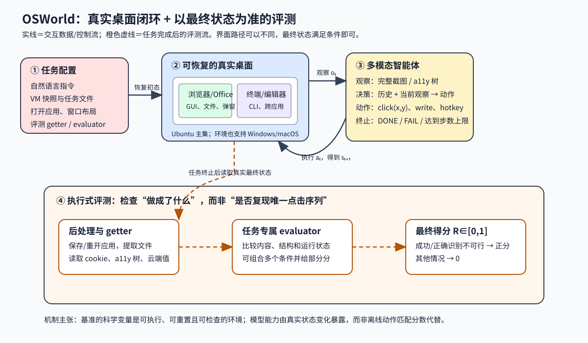

> **公开入口：** [arXiv](https://arxiv.org/abs/2404.07972) · [PDF](https://arxiv.org/pdf/2404.07972v2) · [TeX 源码包](https://export.arxiv.org/e-print/2404.07972) · [代码](https://github.com/xlang-ai/OSWorld) · [项目页](https://os-world.github.io/)
>
> 文中的 `source/...:Lx–Ly` 对应解压后的 arXiv TeX 源码坐标；博客不镜像原论文文件。

> 论文信息：Tianbao Xie 等；首次公开于 2024-04-11；NeurIPS 2024 Datasets and Benchmarks Track；[arXiv:2404.07972](https://arxiv.org/abs/2404.07972)；[代码](https://github.com/xlang-ai/OSWorld)。 
> 证据版本：上述 PDF 共 51 页，SHA-256 `d4c6e20dd59467f005561b1e97199f9842fd3b0e9fdd93e66e06ba0ec09edfdb`；TeX 源码可解析。 
> 阅读提示：下文用 **[论文事实]**、**[跨论文解释]**、**[我们的判断]** 分开证据与推断；PDF 页码按本地文件计数。

## 一句话结论

**[论文事实]** OSWorld 的主要贡献不是训练一个更强的桌面智能体，而是把真实桌面任务变成可重复实验：配置文件恢复精确初态，智能体在虚拟机里的真实应用上操作鼠标和键盘，任务结束后专用脚本读取文件、应用状态或云端数据并判断功能目标是否达成。它收录 369 个 Ubuntu 任务；当时人类成功率为 72.36%，最佳基线只有 12.24%（PDF pp.1, 10–11；`source/text/experiments.tex:7–57`）。因此，论文最有价值的结果是把“会说操作步骤”与“真的把电脑改到目标状态”之间的巨大差距量了出来。

三遍阅读可以得到同一条主线。第一遍看见的是一个环境与基准论文，贡献物是任务、虚拟机和评测器。第二遍看见主证据并非某种 agent 架构胜出，而是各种强模型在真实桌面上普遍低分。第三遍重建控制流后，关键隐藏条件变得清楚：初态必须可复位，动作必须真的执行，最终状态必须能被任务专属函数读取。缺少其中任一环，成功率就不再测量同一个科学问题。

阅读时应始终把“基准更接近真实”与“基准完全代表真实使用”分开：前者有环境与任务证据，后者没有用户频率和长期副作用数据支持。

## 1. 基本概念

**桌面智能体**接收自然语言任务，例如“删除 Amazon 留下的 cookie”，观察屏幕或界面结构，然后输出点击、输入、快捷键或终端命令。**环境状态** (s_t) 是时刻 (t) 的完整计算机状态，包括文件、应用内部数据、窗口和远端服务；智能体通常只能看到**观察** (o_t)，如完整截图、XML 无障碍树（accessibility tree，简称 a11y tree）或二者组合。**动作** (a_t) 是可执行的键鼠代码，如 `click(x,y)`、`write(text)` 和 `hotkey(...)`。环境执行动作后进入 (s_{t+1})，再返回新观察（PDF p.3；`source/text/environment.tex:7–14,126–151`）。

**执行式评测**检查最终结果，而不是把智能体的动作序列与一条参考轨迹逐步比对。比如删除 cookie 的评测器读取浏览器 cookie 数据；表格任务取回生成文件并比较工作表名称与内容；邮件任务读取最终 a11y 树中的收件人。三条操作路径即使点击顺序不同，只要留下同样的合格状态，都可以得分（PDF pp.4–5；`source/text/environment.tex:59–123`）。

**Set-of-Mark（SoM）**在截图中的候选界面元素上画编号框，让模型输出元素编号，再由后处理映射成坐标。它降低了直接预测像素的难度，但框太多会遮挡细节，框也无法表达单元格内部等精细坐标（PDF pp.9, 11；`source/text/experiments.tex:107–120,143–150`）。日常类比是驾驶考试：离线动作匹配像要求考生完全复现教练打方向盘的时刻；执行式评测像检查是否安全抵达指定车位。这个类比在安全性上会失效，因为 OSWorld 的主评分检查任务结果，尚不能系统发现多余或破坏性的中间动作（`source/text/conclusion.tex:21–28`）。

## 2. 问题：旧方法在哪里失败

### 2.1 观察到的失败

**[论文事实]** 一类旧基准只有演示数据，没有可执行环境。它们通常把下一步预测与唯一参考动作比较，会把另一条正确路径判错，也不能用于交互探索。另一类基准可以执行，但把环境限制在少数网站、移动应用或代码任务，因而没有覆盖真实操作系统中的跨应用工作流（PDF pp.1–2；`source/text/intro.tex:10–20`）。

具体失败可以用“修改表格，再把结果附到邮件”理解。离线数据只能问“下一步是否点击了参考按钮”，却无法确认最终附件内容；单网站沙箱又看不到表格程序、文件系统和邮件客户端之间的状态传递。评测对象与用户真正关心的结果错位了。

### 2.2 机制解释

**[论文事实]** 作者把缺口归因于环境不够真实和评测不可执行：缺少可控初态、自由键鼠动作、真实应用状态以及针对目标的检查函数（`source/text/intro.tex:8–27`）。**[我们的判断]** 这可以拆成两个误差源。第一是**覆盖偏差**：被测任务省略高分辨率定位、窗口噪声、文件 I/O 和跨应用依赖。第二是**测量偏差**：动作相似度把“走哪条路”误当成“是否完成”。OSWorld 的最小干预不是给 agent 加规划器，而是修正实验仪器，让失败在真实状态转移中出现。

### 2.3 既有解法

**[跨论文解释]** 编程环境、网页导航和移动端基准分别提供可执行交互；Mind2Web、Android 类数据和 OmniACT 等工作则提供静态示范或 GUI 定位样本。结构化 DOM/a11y 信息可以辅助定位，截图模型和提示方法补足视觉观察。这些路线分别改变任务域、观察或提示，但仍假设特定应用边界，或无法检查开放式最终状态（论文对相关工作的归纳见 `source/text/related.tex:4–20`）。OSWorld 改变的是环境与测量层，不能据此声称它本身解决了规划或视觉定位。

## 3. 核心机制：输入、决策、动作与反馈

**图 1｜原创机制图。** 红色配置块恢复任务专属初态；蓝色块是真实虚拟机桌面；黄色块表示智能体按“观察—决策—动作—新观察”循环；橙色虚线只在终止后启动，getter 读取最终状态，evaluator 检查功能条件并给出 (R\in[0,1])。实线表示交互流，虚线表示评测流。图的可验证结论是：多条动作路径可以共享同一个合格终态；图不表示现有模型已经具备可靠规划能力。依据 PDF pp.3–5 与 `source/text/environment.tex:19–70` 重画。

一项任务先选择 VM 快照，再下载文件、启动应用并调整窗口。智能体收到指令与截图/a11y 树，结合最近历史生成一个动作字符串；Simulator 在 VM 中执行它，再返回新观察。智能体输出 `DONE`、`FAIL` 或达到实验中的 15 步上限后，Task Manager 做保存或重开窗口等后处理，getter 把必要数据取回主机，evaluator 计算结果。虚拟机隔离宿主机，快照支持复位，多台 VM 可并行运行（PDF pp.3–4；`source/text/environment.tex:19–57`）。

### 3.1 最小贯穿例子

任务是“删除 Amazon cookie”。第 0 轮，配置恢复一个已经浏览过 Amazon 的浏览器。第 1 轮，agent 看到浏览器设置页并决定打开隐私设置；环境返回新截图。第 2 轮，它搜索 Amazon 并删除匹配条目。若弹窗遮挡按钮，正确策略应先关闭弹窗再继续；一次误点可能打开无关窗口，使后续观察偏离计划。终止后，评测器直接读取 cookie 数据，并用域名规则检查 `.amazon.com` 是否已删除（`source/text/environment.tex:73–90`）。

请自解释：如果 agent 用开发者工具或命令行删掉同一 cookie，是否应判成功？按结果语义应成功；若任务文字明确要求使用某应用或路径，评测脚本还必须检查该约束，否则会出现“结果对、过程违规”的假阳性。论文确实观察到 agent 被要求用 GIMP 剪视频却改用 `ffmpeg`（PDF p.15；`source/text/analysis.tex:365–368`）。

### 3.2 可证伪预测

**[我们的判断]** 若“精细 GUI grounding 是主瓶颈”成立，在固定模型、任务、历史和步数的受控比较中，只提高可见细节或提供准确元素定位，应主要改善 GUI 密集任务；纯 CLI 任务增益应更小。若点击准确率提高但端到端成功率不升，说明规划、应用知识或错误恢复才是更强瓶颈。若只在筛选出的易任务上提高，则不能外推到 369 个任务。

论文的局部证据与预测方向一致但并非充分因果证明：在 10% 子集上，纯截图从 0.2 分辨率比例的 2.56% 上升到原分辨率的 7.71%；SoM 在 0.4 比例反而达到 20.51%，高于原分辨率的 15.38%，说明分辨率与标记噪声存在交互（PDF p.13；`source/text/analysis.tex:96–134`）。

## 4. 关键公式与指标

### 4.1 POMDP：论文给出的系统骨架

论文把任务写为 ((\mathcal S,\mathcal O,\mathcal A,\mathcal T,\mathcal R))。大白话是：真实桌面不可完全看见，agent 依据有限观察行动，环境改变状态，最后按结果给分（PDF p.3；`source/text/environment.tex:7–14`）。符号账本如下：

- (\mathcal S)：所有可能完整状态；(s_t\in\mathcal S) 是第 (t) 步真实状态。
- (\mathcal O)：观察集合，包含指令 (\mathcal I)、截图与 a11y 树；(o_t\in\mathcal O) 只是状态的一部分。
- (\mathcal A)：可执行动作集合；(a_t\in\mathcal A) 是一次键鼠/代码动作。
- (\mathcal T:\mathcal S\times\mathcal A\to\mathcal S)：执行动作后的状态转移。
- (\mathcal R:\mathcal S\times\mathcal A\to[0,1])：终止时的执行式得分。

**等价拆解（我们的教学性补写）**：(s_{t+1}=\mathcal T(s_t,a_t))，(o_{t+1}=\mathrm{Observe}(s_{t+1}))，agent 再按 (a_{t+1}=\pi(o_{\le t+1},a_{\le t})) 决策。论文没有给出策略 (\pi) 的训练目标；这里仅把文字闭环写开。玩具计算：三项终态条件“cookie 清空、其他域 cookie 保留、设置页关闭”若等权满足两项，可由任务评测器给 (R=2/3)；实际每个任务如何组合由专用脚本决定，不能假设都等权。边界检查：若观察等于完整状态，问题退化为 MDP；若无限步数但没有恢复机制，误点仍可能把状态带入不可逆分支；若移除执行评测，(R) 只能靠轨迹代理，OSWorld 的核心测量优势消失。

### 4.2 成功率

**等价拆解**：对 (N) 个任务，成功率 (SR=100\%\times\frac{1}{N}\sum_{i=1}^{N}\mathbf 1[R_i=1])。(N) 是任务数，(R_i) 是第 (i) 个任务的最终得分，指示函数只数完全成功；部分分若如何汇总需以具体评测实现为准。玩具例子中 5 个任务有 2 个完全成功，(SR=40\%)。当 (N) 很小，单题会造成大幅波动；模型间小差值也不能自动解释为统计显著。

## 5. 实验：证据究竟回答什么

| 问题 | 受控比较与范围 | 指标与精确结果 | 审计结论 |
|---|---|---|---|
| 当时模型能否操作真实桌面？ | 369 个 Ubuntu 任务；多种 LLM/VLM 与四种观察设置 | 最佳 GPT-4+a11y 为 12.24%，人类为 72.36% | 差距明确；不同模型、提示和成本并非完全同质（PDF pp.10–11；`source/text/experiments.tex:21–57,123–130`） |
| 跨应用是否更难？ | 同一 GPT-4V+SoM 按任务类型分组 | 单应用平均 13.74%，跨应用工作流 6.57% | 支持组合工作流更难，但类别本身也有任务难度混杂（`source/text/analysis.tex:54–60`） |
| 历史是否有用？ | 10% 子集，历史 1/2/3/>3 轮 | SoM：7.69/12.82/15.38/15.40%；纯截图：7.69/5.13/7.71/2.58% | 文本化历史受益，图像历史未受益；小子集限制外推（PDF p.13；`source/text/analysis.tex:178–220`） |
| 对窗口扰动是否稳健？ | 从较易的 28 题开始，原始成功率 50.79% | 改位置 36.50%、缩到最小 15.04%、加入遮挡 25.39% | 暴露布局依赖；这是筛选子集，不是全榜稳健性（PDF p.14；`source/text/analysis.tex:255–273`） |

数据本身也要审计。369 题中 268 个单应用、101 个跨应用，30 个不可行任务，另有 43 个 Windows 分析题；9 名计算机背景作者用约 1800 人时构建并多轮检查，产生 134 个独特评测函数（PDF pp.2, 7–8；`source/text/benchmark_suite.tex:23–30,60–73,92–123`）。作者报告 550 个失败样本中超过 75% 含点击不准，但同一失败可连带重复点击和弹窗噪声，因此这不是互斥原因占比（PDF p.15；`source/text/analysis.tex:331–340`）。

## 6. 优点

**思想上**，它把“真实状态能否到达”设为研究对象，允许替代正确路径。**实验上**，任务横跨十类应用/工作流，并将截图、a11y、SoM、历史、分辨率和窗口扰动变成可比较因素。**工程上**，VM 快照、配置式初态、getter/evaluator 库和并行运行形成可扩展实验台。最重要的产出是可诊断失败：计划可能正确，执行仍会因坐标、弹窗或软件知识失败。

## 7. 局限与失效边界

**[论文明确承认]** a11y 质量依赖应用开发者；评测主要关心正确完成任务，尚无高效办法发现潜在副作用；真实环境还带来安全风险（`source/text/conclusion.tex:21–37`）。**[我们的判断]** 还有四个边界：任务由作者搜集和改写，不能代表真实用户频率；每题专用脚本昂贵且仍可能有假阳性/假阴性；15 步上限把模型能力与交互效率绑定；2024 年模型结果是历史快照，不能当作当前能力上限。Windows 的 43 题是迁移分析集，不能与 Ubuntu 369 题等量看待；Ubuntu 4.88%、Windows 2.55%、相关系数 0.7 也不足以证明跨系统可靠泛化（PDF p.14；`source/text/analysis.tex:275–300`）。

## 8. 复现路线

最小复现应先选 5–10 个可离线运行的单应用任务，固定 VM 镜像、模型版本、提示、分辨率、历史长度、15 步上限与随机参数；逐题保存初态哈希、动作轨迹、终态文件和 evaluator 输出。先让人类用两条不同路径完成同一任务，验证评测器接受等价结果，再运行 screenshot-only 与 screenshot+a11y 的配对比较。核对点是环境能复位、替代路径得分一致、失败可由终态重放。成本风险来自 VM 存储、闭源模型 API、外网实时数据和软件版本漂移；涉及实时网站的题目应记录抓取时刻或先剔除。

## 9. 思考题

1. 删除 a11y 树后，下降来自语义标签消失还是坐标信息消失？怎样设计两个受控版本区分它们？
2. 若把 15 步增至 30 步，重复误点会下降还是只会更晚失败？需要记录什么轨迹指标？
3. 如何增加“不得修改无关文件”的副作用检查，同时不惩罚合理替代路径？
4. SoM 在 0.4 分辨率优于原图，是视觉去噪、标记密度还是样本波动？哪个实验最能证伪？
5. 若精确坐标工具让点击错误消失而成功率仍低，论文的下一项机制假设应转向哪里？

## 10. 证据定位

- 任务定义、观察/动作和奖励：PDF pp.3–5；`source/text/environment.tex:7–14,37–70,126–151`。
- 数据组成与质量控制：PDF pp.7–9；`source/text/benchmark_suite.tex:23–73,75–125,178–197`。
- 主结果和观察设置：PDF pp.9–11；`source/text/experiments.tex:7–57,66–120,123–156`。
- 分辨率、历史、扰动与失败分析：PDF pp.12–15；`source/text/analysis.tex:64–220,224–340`。
- 正式页面：[NeurIPS 2024 Datasets and Benchmarks Track](https://proceedings.neurips.cc/paper_files/paper/2024/hash/5d413e48f84dc61244b6be550f1cd8f5-Abstract-Datasets_and_Benchmarks_Track.html)。
