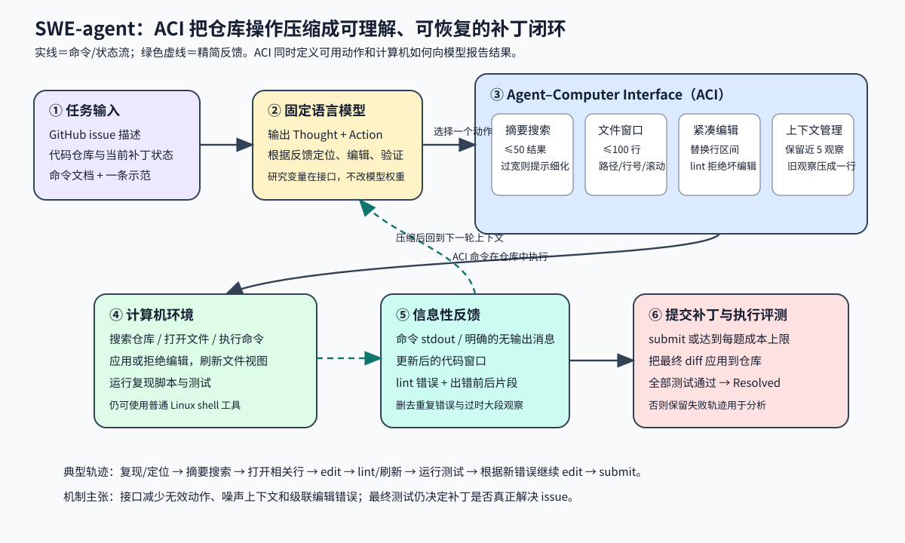

> **公开入口：** [arXiv](https://arxiv.org/abs/2405.15793) · [PDF](https://arxiv.org/pdf/2405.15793v3) · [TeX 源码包](https://export.arxiv.org/e-print/2405.15793) · [代码](https://github.com/princeton-nlp/SWE-agent) · [项目页](https://swe-agent.com/)
>
> 文中的 `source/...:Lx–Ly` 对应解压后的 arXiv TeX 源码坐标；博客不镜像原论文文件。

> 论文信息：John Yang、Carlos E. Jimenez、Alexander Wettig、Kilian Lieret、Shunyu Yao、Karthik Narasimhan、Ofir Press；首次公开于 2024-05-06；NeurIPS 2024；[arXiv:2405.15793](https://arxiv.org/abs/2405.15793)；[代码](https://github.com/princeton-nlp/SWE-agent)。 
> 证据版本：上述 PDF 共 118 页，SHA-256 `d171e0693060b910ceb2cddd0fd4bc7cae302005d42d0d8059bfdbe056c3adba`；TeX 源码可解析。 
> 阅读提示：下文明确标注 **[论文事实]**、**[跨论文解释]** 与 **[我们的判断]**；PDF 页码按本地文件计数。

## 一句话结论

**[论文事实]** SWE-agent 把“模型怎样操作计算机”本身设为可控研究变量。作者保持语言模型权重固定，为它设计一层 Agent–Computer Interface（ACI）：少量专用搜索/查看/编辑命令、紧凑反馈、语法错误护栏和历史压缩。GPT-4 Turbo 版本在完整 SWE-bench 的 2294 个真实 GitHub issue 上解决 286 个，即 12.47%；在 300 题 Lite 子集上，SWE-agent 为 18.0%，仅用 Linux shell 的同模型 agent 为 11.0%（PDF pp.2, 5–6；`source/sections/05_analysis.tex:5–13`；`source/tables/results_main.tex:10–28`）。这说明接口能显著改变固定模型的可用能力，但 12.47% 也表明接口没有消除代码理解和实现错误。

三遍阅读会逐步改变关注点。第一遍容易把它看成又一个自动修复系统；第二遍从消融表看到真正的研究变量是接口；第三遍按轨迹重新执行，才会发现搜索结果长度、文件窗口大小、坏编辑是否落盘、旧观察是否保留都在改变模型下一轮看到的状态。论文的科学命题因此可以被清楚反驳：如果固定模型与任务后，这些接口改变既不改变相应行为，也不改变成功率，那么“ACI 缓解模型特有交互弱点”的解释便缺少支持。

还要把“接口使固定模型更会完成任务”与“模型学会了新的软件工程知识”分开：实验只改变推理期交互，不能证明权重内部新增了知识，也不能证明换仓库后保持同样增益。

## 1. 基本概念

**语言模型 agent**在循环中输出动作并接收环境反馈。**Agent–Computer Interface（ACI）**是模型与计算机之间的抽象层，同时规定模型能调用哪些命令、命令如何文档化、计算机状态如何反馈、历史怎样进入下一轮上下文（PDF pp.2–3；`source/sections/02_aci.tex:3–34`）。普通 Linux shell 面向熟练人类：命令选项多、输出可能很长，修改少数几行也常要组合重定向或 `sed`。ACI 面向模型的注意力和生成误差，因而可以与人类 UI 长得不同。

SWE-bench 的每个实例给出一个真实 Python 项目的 GitHub issue 和对应仓库版本。系统要生成补丁，补丁应用后必须通过用于验证该 issue 的测试，才算 **Resolved**。SWE-bench Lite 是其中 300 个较自包含的功能性 bug 修复；HumanEvalFix 则把范围缩到单文件短代码调试（PDF p.5；`source/sections/04_experiments.tex:3–7,24–28`）。

**ReAct 循环**要求模型每轮生成一个 thought 与一个 action，ACI 执行动作后把结果送回模型。thought 是模型写出的当前推理；真正改变仓库的是 action。日常类比是给新同事配一套 IDE：搜索面板、带行号编辑器、语法检查和测试终端能减少机械错误。类比的边界是模型的上下文按 token 计费且容易被重复输出干扰，人类通常能用视觉注意主动忽略旧内容；因此 ACI 还主动删除、折叠历史（`source/sections/02_aci.tex:21–29`）。

## 2. 问题：旧接口在哪里失败

### 2.1 观察到的失败

**[论文事实]** 直接使用 Linux shell 的模型缺少“替换打开文件中一小段”的简单动作，非法编辑也不一定立刻得到明确反馈。搜索时，连续 `cd`、`ls`、`cat` 很低效；`grep` 或 `find` 又可能返回大量无关行。用类似 Vim/VSCode 的“逐条看搜索结果”界面时，agent 倾向机械调用 `next` 直到遍历完，耗尽成本或上下文（PDF pp.2, 7；`source/sections/01_intro.tex:57–69`；`source/sections/05_analysis.tex:20–45`）。

最小失败例子：issue 指向函数 `parse_date`。模型用 `grep` 得到几百条匹配，逐条读取；找到目标后用重定向重写整文件，错了一个缩进；shell 没展示修改后的邻近代码，模型继续运行并在后续轮次反复修改同一区域。最终失败并不一定来自“不会写正确修复”，也可能来自定位、编辑与反馈三个接口摩擦逐步放大。

### 2.2 机制解释

**[论文事实]** 作者提出四条机制原则：动作应简单易懂；高阶操作应尽量少步完成；反馈应有信息但简洁；护栏应阻止错误传播并帮助恢复（PDF p.3；`source/sections/02_aci.tex:36–60`）。**[我们的判断]** 它们分别减少动作选择熵、交互长度、观察噪声和状态损坏。若一次小编辑需要五条 shell 命令，每条都有出错概率 (p)，整段无错概率会随步数乘法下降；将它压成一次 `edit` 并立即刷新代码，既少了一串决策，也让新状态可见。

### 2.3 既有解法

**[跨论文解释]** 非交互 RAG 用 issue 检索相关文件，然后一次性生成 patch；它避免长轨迹，却不能根据运行错误迭代。InterCode 类 shell agent 能执行命令，但把人类命令行直接交给模型。ReAct 和 Reflexion 类工作强调执行反馈与迭代推理；IDE、静态分析和测试工具则长期为人类提供定位与错误检查。SWE-agent 将工具、提示、代码执行和历史管理统一解释为 ACI 设计，而没有宣称发明搜索、lint 或 ReAct 本身（相关工作定位见 `source/sections/06_related_work.tex:3–28`；基线定义见 `source/sections/04_experiments.tex:15–23`）。

## 3. 核心机制：输入、决策、动作与反馈

**图 1｜原创机制图。** 紫色输入把 issue、仓库和命令说明交给固定 LM；蓝色 ACI 提供摘要搜索、100 行文件窗口、带 lint 的区间编辑和历史压缩；绿色虚线把命令输出、刷新后的代码或错误片段送回下一轮；红色块用最终测试判断补丁。实线表示动作/状态流，虚线表示压缩反馈。图支持的结论是“接口可改变行为与成功率”，不表示通过 lint 的补丁一定语义正确。依据 PDF pp.3–5 与 `source/sections/03_sweagent.tex:19–94` 重画。

四个组件形成闭环。搜索命令 `find_file`、`search_file`、`search_dir` 返回摘要；结果最多 50 条，过宽就不给长列表，而是要求缩小查询。`open` 每次展示最多 100 行，附完整路径、总行数、省略量和行号，可滚动或跳转。`edit(start,end,text)` 一次替换打开文件的行区间，成功后自动展示新内容；lint 若发现主要语法错误，就丢弃该编辑并返回出错前后片段。上下文管理保留最近 5 个完整观察，把更旧观察各压成一行，删除大多数重复格式错误；没有 stdout 时也明确告诉模型“命令成功但无输出”（PDF pp.4, 6；`source/sections/03_sweagent.tex:35–94`）。普通 shell 命令仍然可用，所以这是专用动作加在 shell 之上，而非封闭 DSL。

### 3.1 最小贯穿例子

任务是“日期解析器不接受末尾 `Z`”。第 1 轮，agent 用 issue 中的符号搜索仓库；ACI 返回文件与匹配行摘要。第 2 轮，agent 打开相关文件，看到带行号的 100 行窗口。第 3 轮，它写复现脚本并运行，得到异常反馈。第 4 轮，调用 `edit` 修改条件分支；若少写括号，lint 拒绝修改并显示片段，仓库保持上个合法状态。第 5 轮，agent 修正编辑，窗口立即刷新。随后运行目标测试；新失败可能促使它搜索另一个调用点。所有测试通过或 agent 决定提交时，最终 diff 进入执行评测。

自解释问题：为什么 lint 只检查“主要错误”，不能替代测试？语法合法只说明程序能解析，错误的边界条件仍可能通过 lint。为什么旧观察要折叠？旧文件内容在编辑后已经过时，继续完整保留会与当前状态冲突；但完全删除又会丢掉计划和已尝试动作，所以系统保留一行摘要。

### 3.2 可证伪预测

**[我们的判断]** 若性能增益主要来自“紧凑动作 + 即时反馈 + 护栏”，在固定 GPT-4 Turbo、相同 300 个 Lite 实例、相同提示和成本上限时，逐项移除编辑器、lint 或合理窗口应降低 Resolved；失败轨迹中格式错误和重复编辑应增加。论文观察到：完整配置 18.0%；去掉 `edit` 降至 10.3%；保留 `edit` 但去掉 lint 为 15.0%；窗口从 100 行改为 30 行是 14.3%，显示全文是 12.7%（PDF pp.6–7；`source/tables/results_main.tex:61–109`）。

若这些消融只改变成功率、不改变相应行为指标，机制解释就不充分，增益可能来自提示措辞或配置选择。若在新模型上普通 shell 与 ACI 的差距消失，则结论应收缩为“该代模型需要此接口”，不能宣称 ACI 原则永久普适。

## 4. 关键公式与指标

论文没有单独给出训练损失或推导公式，因为它固定模型、研究推理期接口。这里把正文指标做等价展开，不冒充作者新公式。

### 4.1 Resolved / pass@1

大白话：每题只看一次 agent 运行留下的最终补丁，应用后所有验证测试通过就记 1，否则记 0。对 (N) 题可写为

$$
\mathrm{pass@1}=\mathrm{Resolved\%}=100\%\times\frac{1}{N}\sum_{i=1}^{N}\mathbf 1[\mathrm{Tests}(P_i)=\mathrm{pass}].
$$

符号账本：(N) 是实例数；(P_i) 是第 (i) 题的一次最终补丁；`Tests` 是应用补丁后的执行式测试；指示函数在全部要求满足时为 1。完整集玩具式核算：(286/2294\times100\%=12.47\%)（PDF pp.5–6；`source/sections/05_analysis.tex:5–9`）。边界检查：空补丁、补丁不能应用或有任一必需测试失败都记 0；pass@1 不测多次采样的上限，也不说明补丁是否简洁、安全或通过了未写出的需求。

### 4.2 相对提升与百分点

Lite 上 ACI 为 18%，shell-only 为 11%。绝对提升是 (18-11=7) 个百分点；相对提升是 $(18-11)/11\approx63.6\%$，论文四舍五入为 64%（PDF p.5；`source/sections/05_analysis.tex:7–10`）。两者不能混写。引言中的“多解决 10.7 个百分点”对应的是作者所称 baseline agent 的另一配置关系（PDF p.2；`source/sections/01_intro.tex:71–74`），不应拿来替换主表的 7 个百分点。若基线接近 0，相对提升会异常大，因此报告原始分母更可靠。

API 成本指标是成功实例的平均推理成本。每题上限 4 美元，超限时自动提交已有编辑（PDF p.5；`source/sections/04_experiments.tex:24–28`）。由于平均成本只在成功题上计算，不能直接把它解释为部署中每个 issue 的预期花费。

## 5. 实验：每组证据回答什么

| 问题 | 受控比较与范围 | 指标与精确结果 | 审计结论 |
|---|---|---|---|
| ACI 能否提升真实仓库修复？ | GPT-4 Turbo；300 个 SWE-bench Lite 题；SWE-agent 对 shell-only | Resolved 18.0% 对 11.0%；平均成功成本 1.67 对 1.46 美元 | 同模型支持接口有效；配置不只改一个微组件（PDF pp.5–6；`source/tables/results_main.tex:20–27`） |
| 完整系统在全测试集如何？ | 2294 题、12 个 Python 仓库 | GPT-4 Turbo 286/2294=12.47%，成功题平均 1.59 美元；Claude 3 Opus 10.46% | 建立当时结果，不证明跨语言/跨年代泛化（`source/sections/04_experiments.tex:3–13`） |
| 哪些接口组件重要？ | Lite 上逐项替换 editor/search/viewer/context | 摘要搜索 18.0%，逐条搜索 12.0%，无搜索 15.7%；最近 5 观察 18.0%，全历史 15.0% | 支持“信息量要适中”；多个消融可能仍受随机性影响（PDF pp.6–7；`source/tables/results_main.tex:61–109`） |
| 短代码调试是否也受益？ | HumanEvalFix，每种语言 164 题 | Python 87.7%、JS 89.7%、Java 87.9%；三者宏平均约 88.4%，正文写 88.3% | 表格与摘要的 87.7%是 Python 项，不应当作三语言共同分数（PDF p.6；`source/tables/results_main.tex:35–49`；`source/appx/analyses/additional_benchmarks.tex:7–13`） |

行为证据补充了成功率。全 SWE-bench 的 2294 条 GPT-4 Turbo 轨迹中，1185 条（51.7%）至少有一次失败编辑；任一编辑最终成功的概率为 90.5%，一次失败后降到 57.2%（PDF p.8；`source/sections/05_analysis.tex:85–91`）。Lite 的 248 个未解决实例由 GPT-4o 自动分类，仅用 15 个人工标注样本验证，一致率 87%；52.0% 被归为实现错误/过度特化，23.4% 为编辑失败恢复（PDF pp.8, 35；`source/appx/analyses/failure_modes.tex:3–13`）。这些比例依赖自动标签，适合生成假设，不能当成人工审计真值。

## 6. 优点

**思想上**，论文把接口从工程细节提升为可实验变量，并提出动作、反馈、护栏、历史四条可检验原则。**实验上**，主结果、组件消融和轨迹统计形成“结果—行为”证据链。**工程上**，命令小而可扩展，轨迹、提示、评测和分析工件公开；最终补丁仍由测试判定。最值得迁移的不是某个命令名，而是先观察固定模型的重复失败，再对失败环节做最小接口干预。

## 7. 局限与失效边界

**[论文明确承认]** 工具集仍小，ACI 和案例分析主要靠人工设计，研究范围只覆盖软件工程与代码生成，能否迁移到其他数字任务未验证（`source/appx/0x_statements.tex:38–58`）。**[我们的判断]** 配置由少量手选开发实例和超参数搜索形成，可能对 GPT-4 Turbo/SWE-bench 适配；主消融在 300 题 Lite 上，未报告置信区间；测试通过受测试覆盖率限制；4 美元截断把性能与预算绑定；所有主要仓库是 Python 生态。更长预算未必救回失败：成功轨迹中位成本 1.21 美元、12 步，失败轨迹平均 2.52 美元、21 步，但“成功中位数”和“失败均值”并非同一种统计量，不能直接当作严格配对比较（PDF p.8；`source/sections/05_analysis.tex:113–120`）。

## 8. 复现路线

最小复现选 SWE-bench Lite 中同一批 20–30 题，固定仓库提交、测试镜像、GPT-4 Turbo 具体版本、温度、示范、4 美元上限和随机种子。只比较两组：shell-only 与完整 ACI；再做一次仅关闭 lint 的诊断。保存每轮 thought/action/observation、diff、lint 拒绝次数、token、成本和最终测试日志。先核对 Resolved 分母，再看重复编辑与无效搜索是否按机制预测变化。闭源模型版本漂移、旧 Docker 镜像、测试依赖和 API 计价会影响精确复现；若模型不可得，应把实验标作“接口迁移复现”，不要声称重现原数值。

## 9. 思考题

1. 为什么“显示全文”比 100 行窗口差？如何区分注意力噪声与 token/轮数预算两种解释？
2. 若 lint 拒绝语法错误，却也拒绝需要中间破损状态的多步重构，护栏应如何设计才可证伪？
3. 逐条搜索比无搜索还差，说明工具数量与性能是什么关系？
4. 怎样在不改变提示的前提下测出增益究竟来自专用命令还是反馈格式？
5. 若换成更强模型后 shell-only 达到 ACI 水平，哪些 ACI 原则仍可能通过成本和稳定性指标成立？

## 10. 证据定位

- ACI 定义与设计原则：PDF pp.2–3；`source/sections/01_intro.tex:57–85`；`source/sections/02_aci.tex:3–60`。
- 搜索、文件查看、编辑和上下文管理：PDF pp.4, 6；`source/sections/03_sweagent.tex:19–94`。
- 数据、模型、基线、指标和预算：PDF p.5；`source/sections/04_experiments.tex:3–32`。
- 主表、消融与行为分析：PDF pp.5–8；`source/tables/results_main.tex:1–109`；`source/sections/05_analysis.tex:5–127`。
- 局限与复现声明：PDF pp.116–117；`source/appx/0x_statements.tex:28–58`。
- 正式页面：[NeurIPS 2024](https://proceedings.neurips.cc/paper_files/paper/2024/hash/5a7c947568c1b35ad7dba170018829e5-Abstract-Conference.html)。
