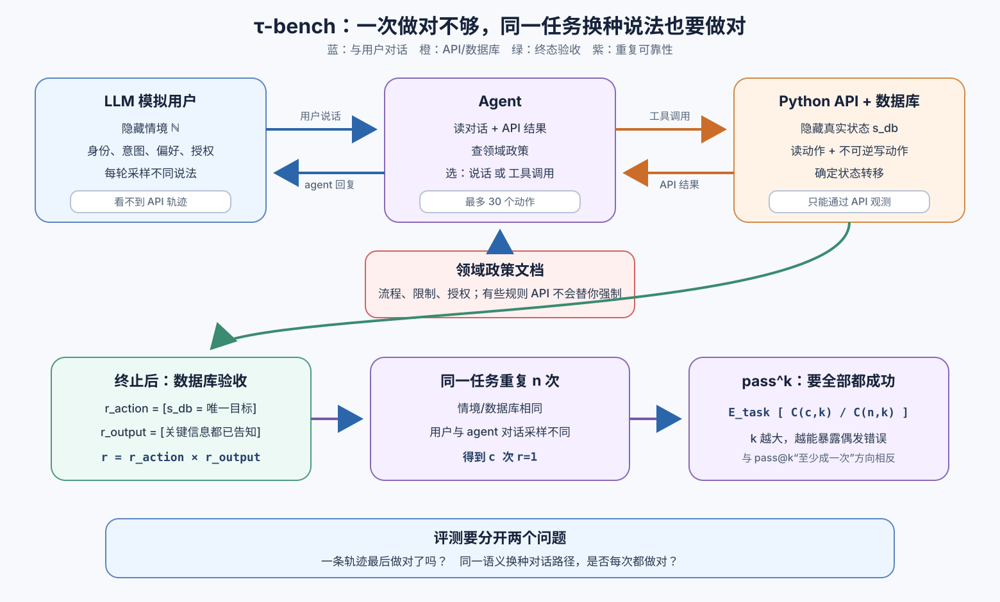

> **公开入口：** [arXiv](https://arxiv.org/abs/2406.12045) · [PDF](https://arxiv.org/pdf/2406.12045v1) · [TeX 源码包](https://export.arxiv.org/e-print/2406.12045) · [代码](https://github.com/sierra-research/tau-bench) · [项目页](https://sierra.ai/blog/benchmarking-ai-agents)
>
> 文中的 `source/...:Lx–Ly` 对应解压后的 arXiv TeX 源码坐标；博客不镜像原论文文件。

> 论文：*τ-bench: A Benchmark for Tool-Agent-User Interaction in Real-World Domains* (首次公开 2024，ICLR 2025)
>
> 阅读标记：**论文事实**来自原文机制或实验；**脉络解释**是对前人设定的归纳；**我们的解释/判断**用来建立直觉与审计证据，不等于论文已证明。

## 一句话结论

**τ-bench 让 agent 一边与 LLM 模拟的用户多轮沟通，一边按领域规则读写真实数据库；它不限制对话路径，而是比较最终数据库与唯一目标状态，并用 pass^k 衡量同一语义任务重复 (k) 次是否次次都成功。**（论文事实；`source/main.tex:L91–111`）

## 1. 先建立基本概念

- **工具—agent—用户交互**：agent 每一轮既可说话，也可调 API。用户不会一开始就把身份、偏好、授权和所有子请求放在一句里，agent 必须逐步收集信息。
- **部分可观测**：数据库隐藏在 API 后，agent 只看到查询结果；用户只看对话，看不到 agent 的工具调用历史（论文事实；`source/main.tex:L134–154`）。
- **领域政策（policy document）**：不是 RL 的行为策略，而是客服须遵守的文字规章，如“同一订单的换货 API 只能调一次，必须先收集完所有换货项”。有的规则由 API 强制，有的只能靠 agent 遵守（`source/main.tex:L139–146`）。
- **终态验证**：对话措辞可以多种多样，读 API 的顺序也可不同；只要最终数据库写入与唯一标注状态相同，且用户需要的关键输出都说了，就计为成功（`source/main.tex:L229–235`）。
- **pass^k（读作 pass-hat-k）**：不是“多试几次，有一次成就行”，而是“随机选 (k) 次，所有次都成”。它把平均分数里隐藏的不稳定性显出来。

**大白话类比。** 一个客服在十位顾客中服务对六位，平均成功率是 60%。但如果同一件事换个说法就可能办错，企业不能靠“总的看还行”上线。pass^k 问的是：任选 (k) 次都不出错的机会有多大。

## 2. 观察到的失败、机制解释与前人方法

**论文事实。** WebShop、WebArena、SWE-bench 等早期 agent 评测通常把完整任务一次性交给 agent，没有一位动态用户在途中补充信息或改变对话表达，也往往不要求逐条查阅领域规则（论文归纳；`source/main.tex:L91–95`）。函数调用榜单多测一次性参数选择，而静态任务对话数据又不能检验 agent 的动作真正改变数据库（`source/main.tex:L122–131`）。

**我们的机制解释。** 真实客服失败常不是“不会调函数”，而是三种状态没对齐：对话状态里还缺授权/偏好，数据库状态里的 ID/库存很复杂，政策状态又限制哪些操作可以做。单步函数参数正确，并不保证长轨迹的时序、授权和终态都正确。

**最小评测介入。** τ-bench 没提出一个“更强 agent”来挽救分数；它先改变测量什么：用户 LLM 为同一隐藏语义生成不同对话，数据库终态提供可重复的客观验收，pass^k 将试次间的方差转成研究对象。

**图 1｜τ-bench 的双通道交互与评估。** agent 同时看到用户说话和 API 返回，再选择说话或工具调用；领域政策是决策约束，但不是每条规则都由 API 强制。终止后用唯一目标数据库和关键输出验收；重复这个过程估计 pass^k。图为我们依原文重画，不是论文原图。

## 3. 基准怎样构建：为什么“唯一终态”很关键

1. 人工设计数据库 schema、Python API 和领域政策，刻意保留数十个 schema/API/规则所需的最小真实性。
2. 用 GPT-4 生成系统化采样代码，人工修正，再用代码批量生成用户、商品、订单、航班等数据。
3. 人工写隐藏给用户模拟器的情境，用 `gpt-4-turbo` FC agent 跑轨迹，反复修正歧义，直到任务在政策下只有一个数据库结果（论文事实；`source/main.tex:L244–258`）。

零售域含 500 用户、50 商品、1000 订单、15 个 API、115 任务；航空域含 500 用户、300 航班、2000 预订、13 个 API、50 任务（`source/main.tex:L260–284`）。设计唯一终态的代价是大量人工标注；好处是对话可以自由变化，却不用 LLM judge 猜是否完成任务。

## 4. 公式一：POMDP 告诉我们 agent 究竟看到什么

论文将任务形式化为

$$
(\mathcal S,\mathcal A,\mathcal O,\mathcal T,\mathcal R,\mathcal U),\quad
\mathcal S=\mathcal S_{db}\otimes\mathcal S_{user},\quad
\mathcal A=\mathcal A_{db}\cup\mathcal A_{user},\quad
\mathcal O=\mathcal O_{db}\cup\mathcal O_{user}.
$$

**符号账本。** (\mathcal S) 把真实数据库和用户对话状态联合起来；(\mathcal A_{db}) 是 API 动作，(\mathcal A_{user}) 是对用户说的自然语言；(\mathcal O) 是两条通道的反馈；(\mathcal T_{db}) 由 Python 实现、确定转移，(\mathcal T_{user}) 从 LLM 采样、是随机转移；(\mathcal U) 是隐藏的用户情境指令（`source/main.tex:L134–154`）。

**大白话用途。** agent 不能直接看“正确答案”，它只能通过问用户与调 API 主动消除不确定性。如果在尚未问清所有换货商品时就调一次性换货 API，后面再知道更多也已无法恢复；这是信息收集与不可逆动作的顺序问题。

## 5. 公式二：终态奖励与 pass^k

单轨迹奖励是

$$
r=r_{\text{action}}\,r_{\text{output}}\in\{0,1\}.
$$

(r_{\text{action}}=1) 要求最终数据库完全等于目标；(r_{\text{output}}=1) 要求 agent 告诉用户所有必要信息。乘法是“两者都对”的硬与门（`source/main.tex:L229–235`）。边界是：agent 可能未获用户确认就擅自退货，终态仍然正确；原文明说 (r=1) 可能是成功的必要但不充分条件。

对每任务运行 (n) 次，成功 (c) 次：

$$
\text{pass}^{k}=\mathbb E_{task}\!\left[\frac{\binom ck}{\binom nk}\right],\qquad
\text{pass@}k=1-\mathbb E_{task}\!\left[\frac{\binom{n-c}{k}}{\binom nk}\right].
$$

**逐层解释。** (\binom nk) 是从 (n) 次中选 (k) 次的所有组合；(\binom ck) 是这些组合中“全部都成功”的数量。反过来，pass@k 用“全失败”的组合数从 1 中扣掉，所以只要有一次成功就算发现解。最后对任务取平均（论文事实；`source/main.tex:L237–241`）。

**玩具计算。** 同一任务跑 8 次成功 6 次，对 (k=2)：(pass^2=\binom62/\binom82=15/28\approx0.536)，而 (pass@2=1-\binom22/\binom82=27/28\approx0.964)。同一组试验，“两次都成”只约 54%，“两次至少成一次”却约 96%。两个指标没有谁算错，它们回答的问题相反：发现与可靠服务。

**边界检查。** (k=1) 时两者都是平均成功率；(k>c) 时 pass^k 为 0；当每个任务的真成功概率为 (p_i) 且试次独立时，理想 pass^k 是任务上的 (\mathbb E[p_i^k])，不是简单的 ((\mathbb E[p_i])^k)。公式要求试次独立同分布；若 API 有未重置状态或模型请求相关，估计的“稳定性”会混入环境泄漏。

### 再往深一层：pass^k 惩罚的不只是低平均分

假设两个 agent 的平均成功率都是 50%。A 对每个任务都有 50% 几率成功；B 总是完美解决一半任务，另一半永远失败。理想情况下，A 的 (pass^2=0.25)，B 的 (pass^2=0.5)。这表明 pass^k 不是单纯“平均分提到 (k) 次方”，它还受任务难度分布影响：对一部分任务绝对稳定、对另一部分完全不会，可能比所有任务都丢硬币得到更高 pass^k。

这不是指标缺陷，而是读数时必须加上任务级视图。若要评估“同一任务的对话摇摆”，应同时报每任务 (c/n) 的分布、方差与失败类型。若只报一个 pass^8，读者无法知道它低是因为普遍不稳定，还是少数任务完全不可解。

### 一条复合请求怎样在“每步看似合理”中失败

用户说要换两件商品，但先只提到椅子，几轮后才说还有宠物床。agent 查到椅子候选并获得授权后，立即调换货 API；这一步的函数名、订单 ID、商品 ID 可全都正确。但政策只允许同一订单换货一次，后来再得到宠物床信息也无法追加。失败的根因不是 API 格式，而是 agent 没把“已知有多个子请求、仍有信息未收集”作为不可逆写入的前置条件。附录的错决策案例正展示了这种过早交换（`source/appendix.tex:L590–787`）。

这个例子说明为何么多轮人机交互不是把一步 function calling 重复几次：agent 需要维护一份“待确认子目标”账本，并在每个不可逆动作前证明账本已闭合。这是可以被新 agent 方法明确检验的机制假设，不应只用“让模型多想一会”来描述。

## 6. 可证伪预测

1. **若用户语言随机性暴露 agent 不稳定，**在隐藏情境和数据库相同时多跑几次，pass^k 应随 (k) 快速下降；若不下降，则该 agent 对对话表达变化稳定。
2. **若复杂政策真的参与决策，**移除政策文档应在航空域比常识性较强的零售域造成更大下降。
3. **若长程失败来自未系统跟踪复合请求，**随目标数据库写入数增加，成功率应衰减，且错误会集中在遗漏早期明示或隐含子任务。

## 7. 实验：结果与失败结构

**设置。** 论文测多家封闭与开放权重模型，主方法是原生 function calling，并比较文本 ReAct 与 Act-only。每任务最多 30 个 agent 动作；主结果至少 3 次/任务；agent 温度 0，用户温度 1（`source/main.tex:L305–328`）。

| 主张 | 关键结果 | 证据审计 |
|---|---|---|
| 当时强模型仍未解决动态客服 | GPT-4o FC：零售 61.2%，航空 35.2%，加权平均 48.2%；GPT-3.5 FC 平均 15.4%（`source/main.tex:L336–391`） | 这是 2024 版本模型的历史横截面，不是今日模型排行；航空更难，平均会隐藏域差异 |
| 平均成功遮住了不稳定 | GPT-4o 零售 pass^1 超过 60%，pass^8 却低于 25%（`source/main.tex:L393–395`） | 直接支持重复可靠性是独立研究对象；曲线也受用户模拟器自身方差影响 |
| agent 会在多大程度上用政策文档 | 去政策后 GPT-4o：零售 61.2(\rightarrow)56.8，航空 33.2(\rightarrow)10.8（`source/main.tex:L430–447`） | 符合“非常识规则更依赖文档”；零售小幅下降说明很多成功可由常识/工具 schema 完成 |
| 失败主要在哪里 | 审查 115 条 GPT-4o 零售轨迹；40 失败中 4 条为标注歧义并修正，余下 36 中错参数/错信息约占 55%，错决策 25%，复合请求部分完成 19%（`source/main.tex:L407–461`） | 给出可定位的机制分类；只是零售、单一模型、36 个 agent 失败，百分比不应外推到所有域 |
| 调用开销 | GPT-4o agent / GPT-4 用户模拟每任务约 \$0.38/\$0.23，零售全集单试次约 \$200；agent 价格 95.9% 来自长系统提示输入（`source/main.tex:L397`） | 表明 pass^k 是昂贵的可靠性实验；历史 API 价格不应当成当前成本 |

## 8. 优点、缺点与失效边界

**思想优点。** 它将“能否找到一次解”与“能否重复交付”分开，让可靠性不再只是一个事后形容词。终态比较允许轨迹自由，又比 LLM judge 更快、更可重现。工具、政策、用户和数据库的模块边界清楚，便于增加新域。

**奖励缺点。** 正确终态不保证过程合规，例如未经确认就执行退货仍可得 1。关键文字子串检查也可能不理解否定、误导性解释或额外有害内容。论文建议后续增加某些规则检查/模型评估，但那会引入新的评估误差（`source/main.tex:L467–476`）。

**模拟器缺点。** 用户不是真人，而是 `gpt-4-0613`；它会计算错、忘记长上下文、过度相信 agent 推荐，隐藏指令也可有拼写/歧义。用 `gpt-4-turbo` agent 调整用户提示还会使任务适配特定类模型（论文事实；`source/main.tex:L472–476`）。

**人工构建的双面性。** 作者为每个零售任务跑超过 40 次 `gpt-4-turbo` 轨迹来排查低分任务，这能清理歧义，也可能在无意中把该类 agent 不擅长的表述修成它容易处理的格式（`source/main.tex:L253–255`）。因此基准的高质量和与特定开发模型的耦合同时存在。更稳妥的做法是在新模型族上分别报告原始任务、被修正任务和不同模拟用户的结果。

**适用边界。** 零售与航空是简化的客服域，奖励依赖唯一数据库结果。医疗、法律、协商或创意任务常没有唯一终态；直接移植这套验收会迫使标注者把多个合理结果错压成一个。

### 从部署角度读数：风险不只取决于 pass^1

一个平均成功率 95% 的 agent，每天处理一万件任务时，期望仍有五百件失败。更重要的是，错误成本并不相同：少告知一个快递单号与未授权就扣款不能简单计为两个同权的 0。τ-bench 有意用二值奖励保持客观和快速，它不是一个完整的生产风险模型。

因此一个后续实验应在不改变核心 pass^k 的前提下，外加两张报表：按不可逆写入、金额、隐私和可补救性对错误分级；另一张报告人工升级或回滚能否阻止坏结果。如果一个方法只是拒答更多，它可能提高严格成功的安全性，却也会降低有效服务率。所以“可靠”至少要与覆盖率、严重错误率和人工介入率一起读，而不能由单一数值代替。

还要防止一种错误优化：为了让数据库不被改错，agent 可以对复杂请求一律拒绝。严格终态奖励应会将本可完成的拒绝计为失败，但研究者仍应单独报拒绝模式，检查分数增益是真正遵规服务，还是逃避行动。

一个好的故障报告还应追踪“本可通过再问一句解决，却过早拒绝”的轨迹，因为这与擅自执行一样是对不确定性的错误处理，也会造成可以避免的真实服务失败。

## 9. 复现建议与自解释问题

1. 锁定模型快照、用户/agent 温度、最大动作数和数据库重置；每次试验保存完整对话、工具调用和终态 diff。
2. 先复现原生 FC、ReAct、Act-only 和无政策消融；不添加记忆或自反思去挽救基线，否则就是新假设。
3. 同时报 pass^1 曲线、pass^k、任务级方差、成本，以及过程政策违规；不要用单一平均分取代稳定性。
4. 请自答：一个任务 8 次成功 6 次，为什么 pass@2 接近 1，pass^2 却只稍超 0.5？客服上线更应关心哪个？
5. 请设计一个“数据库终态正确、但过程严重违规”的轨迹，再提出一个不依赖主观 LLM judge 的最小附加检查。
