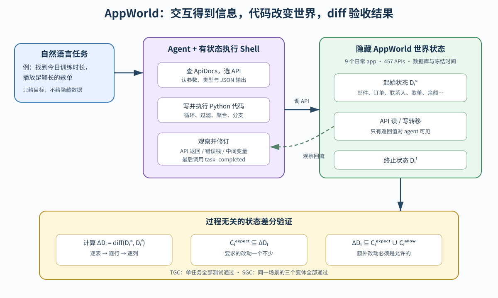

> **公开入口：** [arXiv](https://arxiv.org/abs/2407.18901) · [PDF](https://arxiv.org/pdf/2407.18901v1) · [TeX 源码包](https://export.arxiv.org/e-print/2407.18901) · [代码](https://github.com/stonybrooknlp/appworld) · [项目页](https://appworld.dev/)
>
> 文中的 `source/...:Lx–Ly` 对应解压后的 arXiv TeX 源码坐标；博客不镜像原论文文件。

> 论文：*AppWorld: A Controllable World of Apps and People for Benchmarking Interactive Coding Agents*，ACL 2024，arXiv:2407.18901。上述 PDF 共 55 页，SHA-256 见 `metadata.json`。
>
> 阅读标记：**[论文事实]** 是原文实现或测得的内容；**[跨论文解释]** 是对方法谱系的定位；**[我们的判断]** 是机制分析与可检验推论。PDF 页码按本地文件计。

## 一句话结论

**[论文事实] AppWorld 用 9 个模拟日常 app、457 个 API、隐藏数据库和可重置时间搭成一个可执行数字世界；750 个自然语言任务要求 agent 根据 API 返回逐步写代码，最后不比对“标准轨迹”，而是检查隐藏世界从起始到结束的状态差分，既允许多条正确路径，又能抓住额外破坏。** 最佳 ReAct+GPT-4o 的任务完成分数在 Test-N/Test-C 仅 48.8/30.2，说明“找到 API”与“在未知状态中把长任务完成”之间有很大差距（PDF pp.1, 3, 6, 8；`source/introduction.tex:28–37`；`source/AppWorld.tex:147–169`）。

## 1. 理解前必须知道的概念

**AppWorld Engine** 是环境：Gmail、Amazon、Spotify、Venmo 等 9 个 app 由 FastAPI、SQLite 和 SQLModel 模拟，API 读写底层数据库；ApiDocs 允许 agent 逐步查文档，Supervisor 提供委托人的地址、卡和账户等信息（PDF pp.3–4；`source/engine.tex:4–15`）。**AppWorld Benchmark** 是任务与验收器：250 个场景，每场景 3 个状态变体，合计 750 任务；划分为 Train 105、Dev 60、Test-N 168 与 Test-C 417（PDF p.6；`source/AppWorld.tex:147–156`；`source/benchmark.tex:45–50`）。

**强交互需求**指任务不可能在完全不看环境返回的情况下一次写完。例如“播放能覆盖今日锻炼时长的歌单”：agent 要先找训练笔记，看到自由文本怎样组织才知道如何解析，然后查歌单与歌曲时长。**弱交互需求**则是理论上可一次写完，但 agent 实际不完全知道 API schema，仍需查文档和根据错误修改（PDF pp.2, 11；`source/introduction.tex:13–17`；`source/appendix.tex:2–7`）。

**类比。** 这像让新助理处理搬家采购：需先看备忘录，再问室友需求，查库存，遇到卡过期时换卡，最后下单。类比的边界是 AppWorld 的人、应用和时间都是可控模拟；真实 app 还有 UI 变化、网络故障、异步事件和真实人的反馈。

## 2. 旧评测的具体失败与机制

**[论文事实]** 当时工具使用基准通常只需 1–4 次线性 API 调用，不需要根据环境返回写含循环、聚合和分支的代码。评测若比对标准工具序列，会把“从 Amazon 下载收据”与“从确认邮件取收据”中一条错判；若只看最终回答，又看不见误删收藏夹或多发了一笔款（PDF pp.2,5；`source/introduction.tex:13–17`；`source/benchmark.tex:29–36`）。

**[我们的机制解释]** 长任务失败是“信息获取—隐藏状态估计—代码控制流—副作用管理”共同失配。API 找对了只解决动作词典；返回 schema 理解错、少过滤一个条件、忘记之前已下单，都可以把环境带到错误终态。只测 API 检索会错把一个局部前提当成完整能力。

**[跨论文解释]** HumanEval 测短程序，SWE-bench 测修改仓库，InterCode/MINT 引入执行反馈，ToolBench 类数据强调 API 选择与调用。AppWorld 把可执行日常 API、交互式代码和状态验收绑在一起，其新测量对象是多 app 中的长控制流任务（`source/related_work.tex:1–8`）。

## 3. 核心闭环：输入、状态、决策、动作、反馈

**图 1｜原创机制图。** 蓝色输入只给自然语言目标；紫色 agent 可查 ApiDocs，在 IPython 式有状态 shell 中编写与执行代码；绿色世界的数据库与时间对 agent 隐藏，只有 API 返回和错误栈回流。任务结束后，黄色评估器比较起始/终止数据库，检查期望变化全部发生且没有未允许变化。它允许不同 API 路径达到合法终态，不证明隐藏的全部过程属性都已检查。依据 PDF pp.3–6, 13–14 及 `source/engine.tex:8–25`、`source/benchmark.tex:25–39`、`source/appendix.tex:41–87` 重画。

以“根据室友在消息中的建议更新公路旅行歌单”为贯穿例。agent 先查联系人识别室友，查手机消息找 Spotify 链接与增删歌曲建议，再查歌单和曲库 ID，用循环执行去重的添加/删除。如果 agent 把普通朋友也当室友，或忘记过滤其他旅行歌单，API 调用可全部合法，终态却错。Setup 特意放入这些干扰项与障碍，并让同一场景的三个任务变化家庭关系、歌单和建议，检查 agent 是否真的根据状态推理（PDF pp.5–6；`source/benchmark.tex:12–25`）。

### 3.1 第三遍重建：从场景蓝图到可审计任务

每个场景不是三句手写指令的简单集合，而是一个由 **Setup、Evaluation 和 Validation Solution** 组成的任务生成器。Setup 读场景蓝图、Base DB 和基准时间，选委托人、占位值与任务日期，再复制并修改数据库。它必须保证指令有解、数据里有会诱导快捷猜测的干扰项、正常路径上有可恢复障碍，并且同场景变体覆盖不同条件。例如过期默认卡迫使 agent 根据错误改用其他卡，而不是让任务变成无解（PDF pp.5–6；`source/benchmark.tex:12–25`）。

Evaluation 使用 Setup 产生的期望值写一组状态断言。Validation Solution 是作者写的可执行解，从该任务起点运行后必须通过全部断言。这个端到端测试可以发现“任务可读但起始数据不支持”、“解能执行但评估器拒绝”和“应用升级破坏原任务”三类错位（`source/benchmark.tex:41–43`）。它证明至少存在一条被验证的路径，不证明所有 evaluator 允许的终态都符合人的意图。

### 3.2 六类基线在闭环中改了什么

ReAct 每轮产生思考和代码，立即看执行结果；PlanExec 先生成全局计划，再以 ReAct 方式执行每个子任务。FullCodeRefl 一次生成整段代码，只在执行失败时根据错误栈反思重试。IPFunCall 每轮输出一批互相独立的并行函数调用，可用批次近似简单循环。ToolLLaMA 和 CodeAct 使用各自专用微调模型。前两类可自己查 ApiDocs；后四类因全量文档约 142K tokens，先用 API predictor 选文档（PDF pp.7,15–16；`source/experiments.tex:4–17`；`source/appendix.tex:102–144`）。

因此主表的方法差异同时包含规划粒度、交互频率、文档获得方式、历史截断和最大轮数。它能回答“当时这些完整基线谁更强”，不能单独归因为“先规划”或“多交互”。要检验交互机制，应在同一模型、同一文档和同一 token/调用限额下只改反馈频率。

## 4. 状态差分公式：为什么能同时容纳多解与拒绝副作用

对任务 $i$，论文的验收条件可写为：

$$
\Delta D_i=\operatorname{diff}(D_i^s,D_i^f),\qquad
C_i^{\mathrm{expect}}\subseteq\Delta D_i
\subseteq C_i^{\mathrm{expect}}\cup C_i^{\mathrm{allow}}.
$$

**大白话目的。** 左半边要求该发生的变化一个不少；右半边要求实际变化除必需项外，只能出现明确允许的项。**符号账本。** $D_i^s$ 是隐藏任务数据库的起始状态；$D_i^f$ 是 agent 停止时的终止状态；$\Delta D_i$ 列出哪些表、行、列发生添加、修改或删除；$C_i^{\mathrm{expect}}$ 是根据期望值写成的必需改动；$C_i^{\mathrm{allow}}$ 是允许但不强制的改动（PDF pp.5–6；`source/benchmark.tex:29–37`）。

**玩具例子。** 任务是“购买 1 件蓝色 T 恤”。必需集为 $C^{expect}=\{\text{新增一笔蓝色 T 恤订单}\}$；允许集为 $C^{allow}=\{\text{购物车清空}\}$。A 路径直接下单，diff 只有订单，通过；B 路径先加购物车再下单，diff 有订单与购物车清空，也通过；C 路径还删了收藏夹，右侧包含关系失败；D 路径没下单，左侧包含关系失败。

**边界检查。** 若 $C^{allow}$ 过大，真实副作用会被放行；若过小，等价正解会被错拒。数据库终态还不能证明所有过程规则，例如 agent 曾将秘密打印到日志后删掉，若日志不在被比较状态中，最终 diff 看不见。

实现上，每行维护不含 ID 的 `record_hash`，每表维护变化计数器；评估先略过计数器没变的表，再逐行比 hash，最后逐列比值。101 表、360K 行下平均每任务评估低于 0.6 秒（PDF p.14；`source/appendix.tex:70–87`）。表计数增加不保证终态真变了，因为更改可能被撤销；所以它只是快速候选筛选，仍要比较 hash。

## 5. TGC 与 SGC：从单题正确到场景一致性

论文定义的两个指标可等价表示为：

$$
\mathrm{TGC}=\frac{100}{N}\sum_{i=1}^{N}p_i,qquad
\mathrm{SGC}=\frac{100}{M}\sum_{m=1}^{M}\prod_{i\in\mathcal T_m}p_i.
$$

$p_i=1$ 当且仅当任务 $i$ 的全部评估测试通过；$N$ 是任务数；$M$ 是场景数；$\mathcal T_m$ 是场景 $m$ 的三个变体。乘积是硬与门：三个都对才记该场景成功（PDF p.6；`source/benchmark.tex:39`）。

**玩具例子。** 2 个场景，各 3 任务，成功向量为 $(1,1,0)$ 与 $(1,1,1)$。TGC $=5/6=83.3\%$，SGC $=1/2=50\%$。前者说总体做对多少，后者惩罚同一逻辑换初始状态就失灵。**边界：**场景变体数更多时，全通过的机率机械下降；AppWorld 固定每场景 3 任务，所以内部可比，不应与变体数不同的基准直接比 SGC。

## 6. 可证伪预测

1. **[我们的判断] 若主要瓶颈是交互中的 API 理解和长控制流，不是检索，**给 agent 黄金 API 集后 TGC 应只有有限提升，仍远未饱和；若接近 100，这个机制解释就错了。
2. **若状态差分真能抓副作用，**对同一个正确结果人为增加一个不在 $C^{allow}$ 的无关数据库改动，评分必须从通过变失败；不变则说明 evaluator 漏了状态。
3. **若 SGC 在测场景稳定性，**只改变占位值和初始数据而保留高层目标时，靠记忆固定 ID/路径的 agent 应出现 TGC 高于 SGC 的明显差距。

## 7. 实验：数字、对照与能够说明的问题

| 主张 | 受控比较与结果 | 证据边界 |
|---|---|---|
| 当时最强方法仍难以完成任务 | ReAct+GPT-4o：Test-N TGC/SGC=48.8/32.1，Test-C=30.2/13.0；PlanExec+GPT-4o 为 44.6/23.2 与 19.7/7.9（PDF p.8；`source/tables/bench-is-hard.tex:5–13`） | 是单次、温度 0 的 2024 模型快照；无置信区间，小差值不宜过度解释。 |
| 挑战集测未见 app 转移 | Test-C 的任务至少需 Amazon 或 Gmail 之一，二者不出现在 Train/Dev/Test-N；Test-C 共 417 任务（PDF pp.6–7；`source/benchmark.tex:45–50`） | 测的是 app/API 组合转移，不是真实公司 API 或 UI 转移。 |
| API 检索不是全部瓶颈 | 给黄金 API 后，最佳 TGC 从 48.8/30.2 到 54.8/35.2；API predictor F1 为 Test-N 87、Test-C 71（PDF p.8；`source/experiments.tex:42–50`） | 有所提升但远未解决，支持代码与交互还是瓶颈；“黄金 API”来自验证解，可能不包含其他合法路径。 |
| 难度随控制流增长 | GPT-4o+ReAct 从主观难度 1 到 3，TGC 58.3→21.0；验证解需 60+ 行时 TGC<20（PDF p.8；`source/experiments.tex:39–40`） | 是分组相关，难度、行数、API 数同时变，不能单独证明因果。 |
| 失败结构不止于选错 API | 手工分析归纳出：不交互而幻觉信息、误读 schema/用错 API、只完成部分指令、常识错误，以及忘记状态而重复操作（PDF p.9；`source/experiments.tex:56–58`） | 原文没报每类计数和标注一致性，适合产生假设，不应当频率结论。 |

数据规模也要核对口径。论文引言概括每任务平均 1.8 apps、9.5 APIs、约 50 行代码和 8 个测试（`source/introduction.tex:30–34`）；表 2 则分组报告：Train+Dev+Test-N 的验证解平均 41.3 行、8.2 个唯一 API、5.9 个测试，Test-C 为 56.9、10.5、8.0（PDF p.7；`source/tables/data-statistics.tex:5–20`）。两组不矛盾，但写结论时不能把总体均值说成 Test-C 均值。

## 8. 优点、缺点与失效边界

**思想优点。** AppWorld 把“交互是否真的必要”嵌进任务构造，而不是给一个本可一次解决的问题多套几轮对话。状态差分将“目标完成”与“无额外破坏”写成可执行断言，并容纳多条等价轨迹。对比集与 SGC 让换一个初始状态就失灵的方法暴露出来。

**工程优点。** 数据库、时间和任务起点可重置；API 有 1780 个单元测试、代码覆盖率 98%，文档的 schema 与参数类型从 API 代码自动生成（`source/AppWorld.tex:161–169`；`source/engine.tex:21–25`）。有状态 shell 返回 Python/API 错误栈，便于测自我修正。

**实验局限。** 主表每格是一次贪心解码，没报种子方差/置信区间；方法的轮数、示例数、文档呈现与截断策略不完全相同，ReAct 与 FullCodeRefl 不是只改一个因素的消融（`source/experiments.tex:6–17`；`source/appendix.tex:102–147`）。CodeAct/ToolLLaMA 得 0 表明当时官方配置未转移，不能推出微调工具模型普遍无用。

**任务边界。** 只有 API，没有浏览器/手机 UI；只测单个人委托单 agent，不测多人和多 agent 协作；750 任务足以评测但不足以训练（PDF p.10；`source/limitations.tex:1–7`）。模拟 API 与数据虽经单测和人工复核，仍不等于真实应用的延迟、权限演化和异常分布。

**状态验收的隐含假设。** 它假设用户真正关心的结果都能映射到被监测的数据库列或固定答案字段，且任务结束时的 diff 足以代表风险。这对订单、余额、歌单和邮件记录很合适，对暂时泄露、调用时序、用户是否先同意以及外部系统已观测到的中间操作就不充分。一个 agent 可以先错发邮件再删除数据库记录；如果模拟世界没有将“收件人已看见”建模为不可逆状态，终态就可能显得无害。因此，状态验收的可靠性上限取决于世界模型和断言覆盖率，不由 diff 算法本身保证。

**方法研究的最小下一步。** 针对原文“agent 忘记当前状态并重复操作”的观察，先不增加复杂记忆模块，只在每次写 API 前要求 agent 输出“已确认的当前状态、本次预期 diff、写后验证查询”三项账本。可证伪预测是：固定模型、任务、文档与调用上限后，重复写操作和额外 diff 应减少，TGC/SGC 应提升；如果账本更准确却分数不变，则失败主因更可能是 API 理解或任务逻辑，而不是状态遗忘。

## 9. 最小复现与思考题

最小复现先选同一场景的 3 个任务，固定任务 DB、冻结时间、模型快照、温度 0、最大调用数、提示与文档策略。保存每次代码、API 返回、错误栈、最终数据库 diff 和每条断言。先复现 ReAct，再只把预测 API 换为黄金 API，用这一个变量检验“检索不是主瓶颈”；不加记忆、自反思或外部规划器来挽救结果。

还要分开三道复现门。环境门先运行官方 Validation Solution，确认任务仍可解且 evaluator 全通过；方法门核对提示、示例数、截断阈值、停止 API 与最大轮数；评分门人工选取通过与失败轨迹，检查 diff 中的每个表/行/列改动能否追回断言。三道门都通过后，模型分数的差异才不容易被数据版本、方法配置或评估漂移混淆。

1. 为什么比对标准 API 序列会错罚合法的替代路径？
2. 请为“下单成功但误删收藏夹”写出 $C^{expect}$、$C^{allow}$ 和 $\Delta D$，指出哪个包含关系失败。
3. 若某方法 TGC=80、SGC=20，最可能的任务级失败结构是什么？
4. 怎样设计一个状态终态正确、却在过程中泄露信息的轨迹？最小附加验收应检查什么？

## 10. 证据定位索引

- 问题、贯穿例子与贡献：PDF pp.1–3；`source/introduction.tex:1–39`。
- Engine、API、数据库和可重置时间：PDF pp.3–4；`source/engine.tex:1–41`。
- 任务 Setup、状态差分与 TGC/SGC：PDF pp.5–6；`source/benchmark.tex:12–46`。
- 数据划分、难度与主结果：PDF pp.7–8；`source/tables/data-statistics.tex:1–23`；`source/tables/bench-is-hard.tex:1–47`。
- API 检索消融、错误分析：PDF pp.8–9；`source/experiments.tex:39–58`。
- 强交互、shell 和 hash-based diff：PDF pp.11,13–14；`source/appendix.tex:2–87`。
- 适用边界：PDF p.10；`source/limitations.tex:1–7`。
