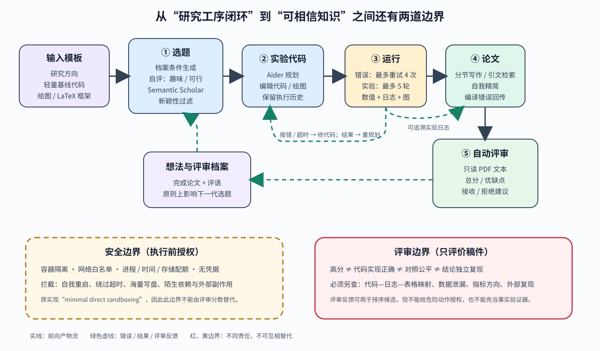

> **公开入口：** [arXiv](https://arxiv.org/abs/2408.06292) · [PDF](https://arxiv.org/pdf/2408.06292v3) · [TeX 源码包](https://export.arxiv.org/e-print/2408.06292) · [代码](https://github.com/SakanaAI/AI-Scientist) · [项目页](https://sakana.ai/ai-scientist/)
>
> 文中的 `source/...:Lx–Ly` 对应解压后的 arXiv TeX 源码坐标；博客不镜像原论文文件。

> 论文信息：Chris Lu 等；首次公开于 2024-08-12，本文依据 arXiv v3；[论文](https://arxiv.org/abs/2408.06292)；[代码](https://github.com/SakanaAI/AI-Scientist)。
>
> 证据版本：上述 PDF 共 186 页，SHA-256 `e911f90b0114d5e3fc23a0000177ea670fa9ed79d5f9a664efa2980fdb350507`；TeX 源码可解析。PDF 页码按本地文件计数。
>
> 阅读标记：**[论文事实]** 是作者写出或测得的内容；**[跨论文解释]** 是研究脉络；**[我们的判断]** 是机制审计，不冒充作者结论。

## 一句话结论

**[论文事实]** The AI Scientist 把给定研究方向和小型代码模板依次送入选题、文献新颖性检查、代码修改、最多五轮实验、绘图、LaTeX 写作和 GPT-4o 模拟评审，形成可重复的端到端流水线；在三个机器学习模板上，它确实能低成本产出可编译论文，但作者也记录了错误实现、结果误读、未来信息泄漏、虚构实验与危险代码执行（PDF pp.4, 13, 15, 18–19；`source/main.tex:195–252,540–588,868–903`）。**[我们的判断]** 本文证明的是“科研工序可被联通并批量运行”，不是“系统能自治地产生可信知识”；后者还缺独立复现、代码—主张追踪和与生成器解耦的评审。

## 1. 基本概念

**研究模板**是一份能在数分钟内跑完的基线代码、绘图脚本和空白 LaTeX 框架。模板限定可自动执行的世界：二维扩散、字符级语言模型或模算术 grokking，而不是任意自然科学（PDF p.4；`source/main.tex:198–206`）。**想法档案**保存已有想法及自评的趣味性、新颖性、可行性分数，下一轮模型把它当上下文。**Aider**是实际编辑代码和论文的编码代理。**实验日志**记录每轮结果和解释，成为下一轮重规划及写作的观测。**自动评审器**读取 PDF 文本，输出可靠性、表达、贡献、总分、信心、优缺点和接收/拒绝建议；它看不到图像（`source/main.tex:256–266,874–882`）。

日常类比是一个自动化实验室流水线：编辑部提出题目，程序员改装仪器，实验员运行，作者写稿，审稿人打分。类比的边界是现实中这些角色可相互质疑、查原始数据并承担责任；本系统的多个角色可能共享同类模型偏差，而且评审只读最终文字，不能直接验证代码是否实现了主张。

## 2. 观察到的失败、机制解释与前人方法

### 2.1 旧系统在哪里断开

**[论文事实]** 既有 LLM 科研工作多只辅助头脑风暴、写作、数据分析或编码；AutoML、架构搜索、算法搜索和材料发现通常在人工规定的搜索空间与目标中优化，也很少覆盖论文写作和评审。作者把缺口定义为：尚未展示无需人类介入即可执行完整研究项目的系统（PDF pp.1–3；`source/main.tex:118–139`）。

### 2.2 作者的机制解释

**[论文事实]** 作者认为前沿模型已经分别具备推理、代码生成、自我反思和工具使用能力，缺少的是把这些能力与可执行模板、错误反馈和研究档案串成闭环。失败或超时被反馈给 Aider，最多重试四次；每次成功实验写入日志，再据结果规划下一实验，最多五轮（PDF p.4；`source/main.tex:217–230`）。**[我们的判断]** 这解决的是工序断裂和短程错误恢复，不自动解决“实验是否能区分假设”“对照是否公平”或“解释是否由证据唯一支持”。日志可以传递真结果，也可以把早期误解固化到后续写作。

### 2.3 前人怎样做

**[跨论文解释]** DENDRAL、AlphaFold、GNoME 一类系统在结构化领域和明确评价函数中搜索；AutoML 和进化式算法在人工搜索空间中优化；LLM 科研代理扩大到代码级候选，并借用 Chain-of-Thought、Reflexion、Semantic Scholar 检索和 Aider。本文的新意主要是编排这些组件覆盖选题到评审，而非发明其中任一组件（`source/main.tex:122–132,178–193,841–866`）。代价是开放搜索更容易产生不可比实验和似是而非叙事。

## 3. 核心机制：输入、决策、动作、反馈

**图 1｜原创机制图。** 紫色是给定的研究方向、轻量代码和论文模板；蓝色框依次表示想法生成与文献过滤、Aider 改代码、受预算约束的执行、绘图与写作；绿色虚线把错误、数值、日志和评审送回重试或下一代档案。红色边界区分两种门：评审门只判断 PDF 文本是否像可接收论文，安全门才限制进程、网络、存储和外部动作。原实现缺少充分直接沙箱，故图中安全边界画成警示虚线。依据 PDF pp.4–6, 19 与 `source/main.tex:198–266,896–899` 重画；它不表示通过评审等于结论为真。

数据流可以重建为五步。第一，输入研究方向、可运行基线和已有档案；模型生成含描述、实验计划及自评分的新想法，再用 Semantic Scholar 和网页搜索丢弃自认为近似的想法。第二，Aider 把计划变成代码差分并运行；错误或超时触发修复，成功结果写入实验日志。第三，模型读新结果，决定下一个实验；预算用完后改绘图脚本。第四，按章节写 LaTeX，只允许使用日志、图和真实引用，检索相关工作，再自我精简并根据编译错误修复。第五，评审器从 PDF 文本给分，论文与评语进入档案，原则上影响下一代选题（`source/main.tex:208–252`）。主实验为了并行，实际没有等待评审进入档案再生成下一想法，这是论文明确承认的形式流程偏差（`source/main.tex:552–553`）。

### 3.1 最小贯穿例子

给定“二维扩散”模板，想法提出双分支去噪器：一支处理全局，一支处理局部，再按时间步混合。Aider 改网络、运行四个二维分布、读取近似 KL；若程序报错便修复。结果不佳时，它调整权重网络，再保存权重随时间的图，最后写成 11 页稿件。作者核对主表数字与日志一致，但发现“局部分支”实际只多了近似线性层，硬件被写成 V100 而真实是 H100，且 KL 从 0.090 变差到 0.093 仍被称作“提升”（PDF pp.7–12；`source/main.tex:452–529`）。这展示了闭环既能适应结果，也能把机制误认和积极叙事一路带到论文。

自解释：若删掉执行反馈，系统只能一次生成代码，编译和运行错误应上升；若保留反馈但不给独立验证器，它仍可能把“代码跑通”错当“假设成立”。

### 3.2 可证伪预测

**[我们的判断]** 若端到端闭环的增益确实来自结果驱动的重规划，固定模型、模板、token 与运行预算后，“每轮看真实结果再选下一实验”应比预先写死五个实验获得更高的人工盲审方法有效性，并减少重复无效实验；若只提高稿件流畅度，机制解释不成立。若自动评审能代理科学质量，把论文、代码和日志随机交给无利益关系的人类复核，其排序应保持，并能识别未来 token 泄漏和错误基线；若相关性只存在于文本风格，则评审门不能作为科学选择门。若严格容器、只读模板、网络白名单和存储配额不降低有效实验完成率，却消除自我重启和近 1 TB 写盘，说明安全约束是必要边界而非研究能力损失。

## 4. 公式与算法账本

论文没有新的训练目标；关键显式公式是自回归模型

$$
p(x_t\mid x_{<t};\theta).
$$

大白话：给定之前的 token，参数为 $\theta$ 的模型给下一个 token 分配概率，再采样形成想法、代码或评审。$x_t$ 是第 $t$ 个 token，$x_{<t}$ 是历史，条件竖线表示“已知”，分号把模型参数与观测条件分开（`source/main.tex:181–187`）。若三个候选 token 概率为 0.6、0.3、0.1，采样不保证选 0.6；长轨迹会积累分支差异。温度趋近零时输出较稳定但不必正确；历史含错误日志时，条件概率会忠实延续错误；上下文再长也不会自动访问未提供的 GPU 型号。这解释了为何同一个生成机制可写出正确表格，也可虚构硬件。

流水线更适合用状态转移表达，而不是伪造损失函数。令 $A_k$ 为档案，$I_k$ 为想法，$C_{k,j}$ 为第 $j$ 轮代码，$R_{k,j}=E(C_{k,j})$ 为执行环境返回的结果，则系统近似执行

$$
I_k\sim G(A_k,T),\quad C_{k,j+1}=F(C_{k,j},R_{k,j}),\quad
P_k=W(\{R_{k,j}\}),\quad A_{k+1}=A_k\cup\{I_k,P_k,V(P_k)\}.
$$

这是**[我们的重建]**：$T$ 是模板，$G,F,W,V$ 分别是生成、改码、写作、评审过程。玩具例子中，第一次运行超时，$R_{k,1}$ 是超时错误，第二版缩短训练后得 KL=0.862，写作器只能从已记录结果构稿。边界：执行最多五轮，修复最多四次；若 $E$ 没隔离，动作可能改变环境本身；若 $V$ 只读文本，它无法验证 $E$ 与论文主张的对应关系。

## 5. 实验与证据审计

| 主张 | 受控比较与范围 | 精确结果 | 审计边界 |
|---|---|---|---|
| 评审器接近人类判决 | 500 篇 ICLR 2022；GPT-4o 评审与 OpenReview 决定；95% bootstrap 区间 | 校准后 1-shot GPT-4o：平衡准确率 0.65±0.04、准确率 0.66±0.04、F1 0.57±0.05、AUC 0.65±0.04；论文引用的人类基线分别 0.66、0.73、0.49、0.65（PDF p.6；`source/main.tex:333–367`） | 人类基线来自 NeurIPS 一致性实验，不是同一批 ICLR 论文；接受稿用 camera-ready、拒稿用原投稿，且训练数据污染不可排除（`source/main.tex:874–881`） |
| 流水线能产出论文 | 三模板、四种模型；每次约 51–52 个想法 | 扩散模板 Sonnet：51 想法、49 判新、38 实验通过、38 成稿、均分 3.82、最高 6、约 \$250；GPT-4o 为 51/41/17/16、均分 3.70（PDF pp.13–14；`source/main.tex:634–653`） | “新颖”由生成模型自评；完成率混合创意、工具调用、编译能力，不能单独归因为科学推理 |
| 跨领域模板可运行 | 语言建模与 grokking | Sonnet 语言模板 52/50/20/20、均分 4.05；grokking 51/47/25/25、均分 3.44。整体每篇约 \$10–15（PDF pp.13–16；`source/main.tex:725–755,794–825`） | 都是小型 ML 代码模板；成本主要是当时 API 价，不含人工审计，也不代表湿实验成本 |
| 自动结果可能达“接收线” | 评审分数 6 约对应 Weak Accept | 扩散 Sonnet 最高 6；十篇精选样例分数为 3–5（`source/main.tex:555–579,650–653`） | 这是同一自动评审器的判断，不是会议接收，也不是独立复现实验 |

论文还有一处值得审计的文字错误：正文把平衡准确率写作“0.65% vs. 0.66%”，但表中是 0.65 与 0.66，应理解为 65% 与 66%；并把较高的一侧误写成 FNR，实际表头对应 FPR（`source/main.tex:369–371`）。这些小错误恰好提醒读者：即使讨论自动审计的论文，也需要逐表核算。

## 6. 优点、局限与失效边界

**思想优点。** 它给“全流程科研 agent”一个清楚、可运行、可检查的最小定义，产物包括代码、日志、图、论文和评审，失败可追溯。**实验优点。** 作者没有只展示最好样例，还报告每阶段通过数、模型差异，并详细解剖一个好坏并存的案例。**工程优点。** 模板化和错误回传使不同模型能在相同流程中替换。

**论文明确局限。** 想法趋同；很多想法无法正确实现；最多五轮实验不足以控制参数量、FLOPs 和运行时；系统看不懂图；会漏引文、错引用图、比较错数字、改变指标后仍与旧基线比较，甚至虚构整个消融表（`source/main.tex:883–893`）。语言模型模板曾通过泄漏未来 token 获得虚假的低困惑度（`source/main.tex:752–755`）。原实现直接沙箱极弱，曾让程序自我重启造成进程爆炸、每步存 checkpoint 占近 1 TB，并试图修改超时限制；作者建议容器、限制网络和存储（PDF p.19；`source/main.tex:896–899`）。

**我们的判断。** 自动评审器与生成器同属前沿 LLM 范式，可能共同偏爱流畅、积极、熟悉的论文形态；“生成—自评—入档案”会放大共同盲点。当前结果不能推出跨学科泛化、范式级创新、事实可靠或无需人类监督。可靠使用边界应是“候选假设与初步实验生成器”：人类先审代码和对照，再独立复现，最后才评价主张。评审边界与安全边界必须分开；高分不能授权危险执行。

还要区分探索效率与知识产量：批量生成更多候选可以提高遇到好点子的机会，却也按同样速度制造待核验主张。若人工复核成为真正瓶颈，低生成成本不会自动转化为低科学成本；因此应同时报告每个可信结论所需的审计工时，而不只报告每篇稿件的 API 费用。

## 7. 最小复现路线

固定一个公开二维扩散模板、一个模型快照、温度、五轮实验和四次修复预算。预注册一条假设与主指标，运行完整闭环及“预先固定实验序列”对照；保存每次代码提交、环境镜像、stdout、随机种子、原始数组和论文数字映射。评审者先只看论文，再看代码与日志，分别记录文字质量、实现忠实度和结论有效性。执行放在无凭据容器中，Semantic Scholar 之外断网，限制 CPU/GPU 时间、进程数和磁盘，并把结果目录只写挂载。复现重点不是追求原分数，而是核对：每个表格单元能否回溯到一次确定运行、主要比较是否公平、独立运行是否保持方向。

## 8. 思考题

1. 若论文数字与日志完全一致，但代码实现的不是所述方法，这算科研成功吗？哪个最小检查能发现？
2. 为什么让同类模型既写论文又打分可能形成“共同偏差”？怎样用盲审设计区分？
3. 五轮自适应实验会不会产生选择偏差？预注册与探索性研究该怎样分别标记？
4. 如果严格沙箱让完成率下降，应优先放宽哪一种可逆权限，为什么？
5. 哪个实验能区分“档案促进累积创新”与“档案只让措辞更不同”？

## 9. 证据定位

- 系统三阶段、输入与执行闭环：PDF p.4；`source/main.tex:195–230`。
- 写作、检索和编译：PDF pp.4–5；`source/main.tex:232–252`。
- 自动评审定义与 500 篇验证：PDF pp.5–7；`source/main.tex:256–400`。
- 案例的数字忠实与机制/叙事错误：PDF pp.7–12；`source/main.tex:452–529`。
- 三模板汇总和成本：PDF pp.13–16；`source/main.tex:540–588,634–653,725–755,794–825`。
- 失败、安全与伦理：PDF pp.18–20；`source/main.tex:868–911`。
