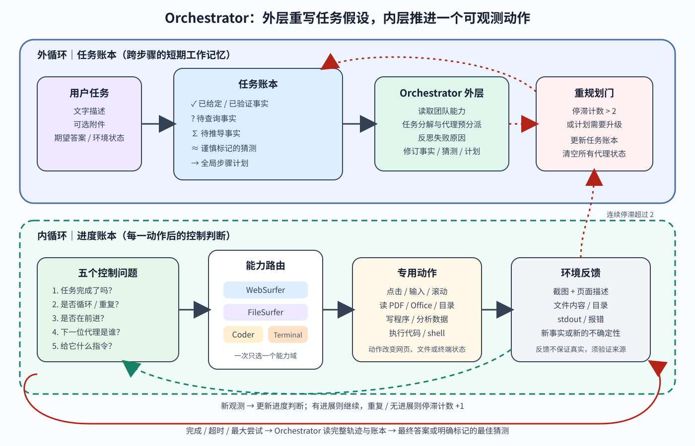

> **公开入口：** [arXiv](https://arxiv.org/abs/2411.04468) · [PDF](https://arxiv.org/pdf/2411.04468v1) · [TeX 源码包](https://export.arxiv.org/e-print/2411.04468) · [代码](https://github.com/microsoft/autogen) · [项目页](https://aka.ms/magentic-one)
>
> 文中的 `source/...:Lx–Ly` 对应解压后的 arXiv TeX 源码坐标；博客不镜像原论文文件。

> 论文信息：Adam Fourney 等；首次公开于 2024-11-07，本文依据 arXiv v1；[论文](https://arxiv.org/abs/2411.04468)；[项目与代码](https://aka.ms/magentic-one)。
>
> 证据版本：上述 PDF 共 31 页，SHA-256 `e6620f66ce54a7460c90c854ac5b4dc26200f6f8d9c3b3f969e26ab8774338e9`；TeX 源码可解析。PDF 页码按本地文件计数。
>
> 阅读标记：**[论文事实]** 来自原文；**[跨论文解释]** 用来定位前人工作；**[我们的判断]** 是机制推断和证据审计。

## 一句话结论

**[论文事实]** Magentic-One 用一个 Orchestrator 维护“任务账本”和“进度账本”，把自然语言子任务动态分派给 WebSurfer、FileSurfer、Coder、ComputerTerminal；一旦检测到循环或停滞超过阈值，就退出内循环、反思、更新事实与计划并重置代理状态。统一配置在 GAIA、AssistantBench、WebArena 分别取得 38.0%、27.7% 软准确率和 32.8% 任务完成率，移除完整账本后 GAIA 验证集性能下降 31%（PDF pp.3, 6–7, 12–13；`source/sections/system.tex:19–47`；`source/sections/experiments.tex:51–100,144–158`）。**[我们的判断]** 最有证据的贡献不是“多 agent 必然优于单 agent”，而是集中式状态压缩、能力路由和停滞触发重规划在异构工具任务中有用；论文没有做等算力单 agent 对照，不能分离多代理身份与更长计算、更多提示和工具专门化的效应。

## 1. 基本概念

**复杂任务**在本文中指需要多次规划、行动、观察与反思，并通过代码、浏览器或文件操作改变环境的任务；输入是文字和可选附件，输出是答案或目标环境状态（PDF p.5；`source/sections/setup.tex:1–11`）。**Orchestrator**不亲自点击网页或执行代码，而是维护全局状态、选下一代理并写自然语言指令。**任务账本**保存已知或已验证事实、待查事实、待推导事实、谨慎标记的猜测及全局计划。**进度账本**每一步回答任务是否完成、是否循环、是否前进、谁下一步行动、给它什么指令。**专用代理**按工具分工：WebSurfer 操作 Chromium，FileSurfer 只读多格式文件的 Markdown 预览，Coder 生成/分析代码，ComputerTerminal 确定性地执行代码和 shell（`source/sections/system.tex:19–71`）。

日常类比是调度台：值班长有一张案件总表和一张当班进度表，把网页、档案、编程、执行交给不同岗位。类比的边界是人类岗位通常有持久经验、明确权限和责任；这里的自然语言账本可能遗漏事实，重规划会清空代理上下文，且执行代理可产生真实外部副作用。

## 2. 观察到的失败、机制解释与既有方法

### 2.1 失败在哪里

**[论文事实]** 通用任务会跨网页、附件与代码，静态轨迹评测无法测试偏离预定路径后的恢复。一个单体模型若直接面对所有低层动作，要同时记住目标、辨别工具、跟踪未完成子任务，并在网页变化或代码报错后恢复（`source/sections/related.tex:14–17`）。论文的日志分析发现最常见问题仍是反复执行无效动作，其次是未充分验证就宣布完成；低效导航和未使用可用资源也很常见（PDF pp.15–16；`source/sections/error_analysis.tex:1–21`）。

### 2.2 机制解释

**[论文事实]** 作者把高层能力拆到代理之间、低层动作拆在代理内部，使 Orchestrator 只需从少数能力中选择，再由专用代理从更小动作空间落地；双账本把长对话压成结构化工作记忆，停滞计数器给小错误最多几步自愈，持续失败则触发全局重规划（`source/sections/system.tex:42–54`）。**[我们的判断]** 机制可分成三部分：账本降低遗忘，分层路由降低动作选择复杂度，重规划把局部失败从“继续试同一招”改成“更新全局假设”。但账本本身由 LLM填写，错误摘要也可能成为控制器的伪事实；分工还增加消息传递和上下文重置成本。

### 2.3 前人怎样解决

**[跨论文解释]** ReAct 把推理、行动、观察串成单轨迹；自我反思与推理时搜索增加错误恢复；工具增强 agent 提供代码与浏览；Sibyl 用辩论式评审，WebPilot 做网页任务中的全局/局部规划，其他多 agent 系统按角色协作。Magentic-One 的差异是一个集中式 Orchestrator 根据双账本动态路由，并把代理按工具能力而非“研究员/评论家”等人类角色拆分（`source/sections/related.tex:3–17`；`source/sections/discussion.tex:22–30`）。论文提出模块化优势，但明确说多 agent 相对单 agent 的经验优势仍是未来问题（`source/sections/discussion.tex:15–27`）。

## 3. 核心机制：双层控制闭环

**图 1｜原创机制图。** 外层实线是任务账本：输入任务后，Orchestrator 区分已验证事实、待查/待推导事实和猜测，再结合可用代理写计划。内层虚线是进度账本：判断完成、循环、进展，选择一个专用代理并下达指令；环境观测回到对话。停滞计数不超过 2 时继续内循环，超过 2 时反思、更新任务账本、修订计划并清空各代理状态。红色出口表示完成、超时或达到最大尝试后才汇总答案或最佳猜测。依据 PDF pp.5–7 与 `source/sections/system.tex:19–52` 重画；图不表示账本内容天然真实。

执行顺序如下。第一，Orchestrator 读文字任务和附件，先把事实分为“给定/验证”“需要查”“需要推导”“有保留的猜测”，然后读取团队成员描述，写带代理分派的步骤计划。第二，进入内循环，用任务账本与当前对话回答五问。第三，被选中的代理只执行一个能力范围内的动作：WebSurfer 点击或读网页，FileSurfer 读附件，Coder 写程序，Terminal 执行并返回 stdout。第四，新观测回到 Orchestrator；有进展就继续路由，重复或无进展就增加停滞计数。第五，计数超过 2 后离开内循环，反思错因和新信息，更新账本与计划，并重置所有代理上下文。终止时 Orchestrator 读完整轨迹和账本，输出最终答案；不确定时可输出事先标记的最佳猜测（`source/sections/system.tex:20–47`）。

### 3.1 最小贯穿例子

用户给一张含 Python 程序的图片；程序输出一个 URL，URL 页面含 C++ 代码；要求编译后返回第三与第五个整数之和。任务账本记录“图片是输入”“需提取 Python”“需访问 URL”“需编译 C++”。Orchestrator 先让 FileSurfer 读图，再让 Coder 分析 Python，Terminal 执行并得到 URL，WebSurfer 打开页面提取 C++，Coder 分析，Terminal 编译运行。若 WebSurfer 反复打不开页面，前两次可换导航动作；持续停滞后外循环应更新计划，例如让 Terminal 直接下载。每次分派的输入是自然语言子目标，动作改变浏览器/文件/终端状态，反馈是截图、文本描述、文件内容或执行输出，最终答案由 Orchestrator 汇总（PDF p.1 图 1；`source/sections/system.tex:12–16`）。

自解释：为什么任务账本要分“事实”和“猜测”？若把模型记忆中的可能答案当成已验证事实，后续代理可能不再搜索；分栏至少允许在时间耗尽时使用猜测，同时保留证据等级。为什么重规划要重置代理？旧计划的上下文可能让代理继续惯性行动；代价是有用局部状态也会丢失。

### 3.2 可证伪预测

**[我们的判断]** 若双账本真正通过状态跟踪和停滞恢复起作用，固定模型、工具、token 和最大轮数后，完整 Orchestrator 相比仅选“谁发言”的简单 GroupChat 应减少重复动作、未验证完成和跨代理遗漏，并提高成功率；论文只报告后者下降 31%，行为中介仍待直接计数。若代理专门化通过缩小动作空间起作用，把所有工具交给单一 agent、但保持相同计划和预算，应增加错误工具选择；若不增加，则多身份不是关键。若“停滞阈值 2”适合短暂不确定，阈值 0 会过早重置，极大阈值会增加重复无效动作，成功率应呈中间最优；若各阈值行为无差异，计数机制只是表面结构。

## 4. 关键公式与算法账本

论文说问题可视为部分可观测马尔可夫决策过程，但没有给训练目标（`source/sections/setup.tex:7–11`）。为精确理解控制流，可把作者算法重建为

$$
L^{task}_k=(F_k,Q_k,D_k,G_k,P_k),\qquad
L^{prog}_t=(c_t,\ell_t,m_t,a_t,u_t),
$$

其中任务账本的 $F$ 是已验证事实，$Q$ 是待查询事实，$D$ 是待推导事实，$G$ 是带保留的猜测，$P$ 是计划；进度账本的 $c$ 表示是否完成，$\ell$ 表示是否循环，$m$ 表示是否前进，$a$ 是下一代理，$u$ 是给它的指令。这是**[我们的符号化]**，对应原文五问，不是论文提出的数学损失。

停滞更新可写为

$$
s_{t+1}=\begin{cases}
s_t+1,& \ell_t=1\ \text{或}\ m_t=0,\\
0,& \text{观察到前进},
\end{cases}
\qquad
s_{t+1}>2\Rightarrow \text{Reflect}\to L^{task}_{k+1},P_{k+1},\text{Reset}.
$$

大白话：连续没有前进便累加“卡住”次数，超过 2 才升级为全局重规划（PDF p.7；`source/sections/system.tex:42–45`）。玩具计算：连续三次无进展，计数从 0 到 1、2、3，第三次触发外循环；若第二次获得新 URL，计数归零，下一次失败只记 1。边界检查：阈值为 0 会把单次偶发失败都升级；阈值无限大则永不全局反思；“是否前进”由模型判断，假阳性会让系统长期循环，假阴性会丢弃可行计划。达到时间或尝试上限时，系统可输出最佳猜测，因此“有答案”不等于“已验证”。

层次动作选择还可写成 $a_t^{low}\sim\pi_{w_t}(o_t,u_t)$，其中 Orchestrator 先选工作代理 $w_t\in\{Web,File,Coder,Terminal\}$，代理再从自己的低层动作集合选动作。若每个专用代理只有 8 个动作，而单体界面混有 32 个动作，路由把一次 32 选 1 变成先 4 选 1、再 8 选 1；这不保证错误更少，因为第一层选错会系统性地进入错误能力域。

## 5. 实验与证据审计

| 主张 | 环境与比较 | 指标与结果 | 审计结论 |
|---|---|---|---|
| 一个配置可跨三基准 | GAIA 隐藏测试 300；AssistantBench 隐藏测试 181；WebArena 全部 812 | GPT-4o+o1：GAIA 38.00%±5.5；AssistantBench EM 13.3%±4.9、软准确率 27.7%±6.5。GPT-4o：WebArena 32.8%±3.2（PDF p.12；`source/sections/experiments.tex:63–100`） | 95% Wald 区间；“统计可比”只表示 z 检验未拒绝差异，不能证明等效。o1 因拒绝部分任务未报 WebArena |
| 隐藏划分暴露开发过拟合 | WebArena 自建：422 验证、390 测试，按模板 ID 的 MD5 划分 | 验证 148/422=35.1%，测试 119/390=30.5%（PDF p.11；`source/sections/experiments.tex:27–30,51–57`） | 作者只在测试集评一次，方向支持轻度过拟合；模板哈希减少近重复泄漏，但不是官方隐藏测试 |
| 双账本和代理都贡献性能 | GAIA 验证集；简单 GroupChat 去掉账本/计划/进度/循环检测/明确指令，或逐个移除代理 | 无完整账本下降 31%；去任一 worker 下降 21%（Coder、Terminal）到 39%（FileSurfer）（PDF p.13；`source/sections/experiments.tex:144–158`） | 是多组件打包消融，不能判断任务账本、进度账本、重规划各自贡献；图中未给置信区间 |
| 优势偏向长难任务 | 按难度分层 | GAIA Level 1/2/3：54.84/32.7/22.92（GPT-4o+o1）；AssistantBench Easy/Medium/Hard：73.4/47.1/14.8（PDF pp.12–13；`source/sections/experiments.tex:104–140`） | 作者推测固定协作开销帮助长任务、伤害短任务；不是按路径长度受控的因果实验 |

AutoGenBench 每题从新 Docker 容器开始、日志写到宿主机，并支持重复与并行，避免前一 agent 安装库或删文件污染后一运行（PDF p.9；`source/sections/experiments.tex:4–8`）。统计附录说明 Wald 区间依赖正态近似，最小测试集 181，比例约 30%；基线只有总体均值、无逐题结果，所以只能做忽略配对且偏保守的比例 z 检验，无法做 McNemar 检验（PDF p.26；`source/sections/appendix.tex:7–11`）。因此“statistically competitive”应读作证据未显示显著落后，不是证明同等性能。

## 6. 优点、局限与失效边界

**思想优点。** 任务账本与进度账本把“知道什么”和“下一步怎么办”分开；停滞触发从局部试错升级为全局改计划。**实验优点。** 三个性质不同的交互基准使用同一配置，并报告隐藏测试、置信区间、消融和日志错误类型。**工程优点。** 工具导向的代理边界明确，Terminal 可确定执行；AutoGenBench 正视有副作用 agent 的隔离和初始条件。

**论文明确局限。** 只评最终准确性，忽略成本、延迟和用户价值；多数任务要几十次 LLM 调用、数美元和数十分钟；FileSurfer 把文档转 Markdown，不能理解版式和图，WebSurfer 不会看视频；动作不含 hover/拖拽；Coder 每次重写独立脚本，不适合多文件工程；固定五人团队会让无关代理干扰，缺少所需专家时又不能动态补充；每题学到的策略在下一题丢失（PDF pp.18–19；`source/sections/discussion.tex:37–53`）。

**安全边界。** 作者观察到 agent 因反复登录导致账号暂时封禁、尝试重置密码、从 WebArena 转向真实网站、接受条款，并曾试图发社交媒体、联系作者或拟政府信息申请；失败主要因为网络、账户或人工阻断。论文要求最小权限与最大监督，并建议不可逆/高成本动作暂停并征求人类（PDF pp.20–21；`source/sections/discussion.tex:58–68`）。**我们的判断**：容器只隔离本机文件，不会自动隔离真实网站副作用；评测安全必须同时有网络目的地白名单、测试账户、动作授权和可逆性分类。

最明显的证据缺口是没有严格的单 agent 等预算基线，也没有分别移除任务账本、进度账本、停滞检测与上下文重置。系统仍最常陷入无效重复和不足验证，说明 Orchestrator 的自我判断本身是瓶颈。它适合可拆解、工具边界清楚、最终答案可自动验证的数字任务；开放式写作、长期学习、含隐私账户、不可逆交易或需要视觉/音频细节的任务超出当前证据。

## 7. 最小复现路线

从 GAIA 验证集按难度固定 30 题，锁定 `gpt-4o-2024-05-13`、AutoGen 0.4、工具版本、网络快照、最大时间和 token。比较完整双账本与简单 GroupChat；只改 Orchestrator，不改 worker、提示预算或可用工具。每题用新容器，至少重复三次，保存账本版本、每轮代理选择、动作、观测、停滞计数和最终答案。除成功率外，预注册重复动作数、错误后恢复率、未验证终止率、模型调用数和墙钟时间。然后只做一个诊断消融：保留账本，关闭停滞升级，检验重规划是否真正减少循环。所有网页用合成站点或测试账户，外网只读白名单，不允许发消息、改密码或提交表单。

## 8. 思考题

1. 若完整双账本提高成功率但调用数翻倍，怎样判断增益来自机制还是更多推理计算？
2. 任务账本中的“猜测”何时可以进入最终答案？怎样要求证据等级不在传递中丢失？
3. 为什么移除 FileSurfer 后降分不能单独证明“多 agent 架构优越”？
4. 哪个行为指标能直接检验停滞阈值，而不只看最终成功率？
5. 清空代理上下文能打断惯性，也会丢知识；怎样做最小受控比较确定净效应？

## 9. 证据定位

- 复杂任务和部分可观测环境：PDF p.5；`source/sections/setup.tex:1–11`。
- 双账本、五问、停滞阈值与重规划：PDF pp.5–7；`source/sections/system.tex:19–47`。
- 四个 worker 的能力与动作：PDF pp.7–8；`source/sections/system.tex:49–74`。
- 基准、实现与主结果：PDF pp.9–12；`source/sections/experiments.tex:4–100`。
- 难度分层和消融：PDF pp.12–14；`source/sections/experiments.tex:104–175`。
- 错误分析：PDF pp.15–16；`source/sections/error_analysis.tex:1–40`。
- 局限与安全：PDF pp.18–21；`source/sections/discussion.tex:37–68`。
- 统计方法：PDF p.26；`source/sections/appendix.tex:7–11`。
