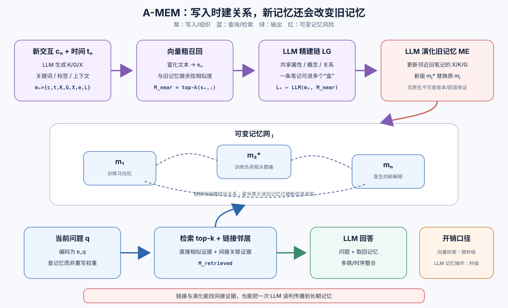

> **公开入口：** [arXiv](https://arxiv.org/abs/2502.12110) · [PDF](https://arxiv.org/pdf/2502.12110v11) · [TeX 源码包](https://export.arxiv.org/e-print/2502.12110) · [代码](https://github.com/agiresearch/A-mem)
>
> 文中的 `source/...:Lx–Ly` 对应解压后的 arXiv TeX 源码坐标；博客不镜像原论文文件。

> 论文：*A-MEM: Agentic Memory for LLM Agents* (NeurIPS 2025)
>
> 阅读标记：**论文事实**是原文明示的机制或结果；**脉络解释**是对既有记忆/RAG 方法的归纳；**我们的解释/判断**用来建立直觉和审计证据，不代表论文已证明。

## 一句话结论

**A-MEM 把每次新交互先写成带关键词、标签、上下文描述和向量的原子笔记，再用向量找候选旧记忆、让 LLM 建立语义链接，并允许新信息改写邻近旧笔记的描述；查询时因而能沿显式关联带回多段历史。**（论文事实；`source/neurips_2025.tex:L243–253, L268–339`）

## 1. 基本概念：“记住”不只是把原文存下来

- **外部长期记忆**：LLM 权重和有限上下文之外的持久存储。它需要解决何时写、写什么、如何组织和何时取回。
- **原子笔记**：受 Zettelkasten 卡片盒笔记启发，每条笔记尽量表示一个自足知识单元，而不是整段会话的未加工副本（论文事实；`source/neurips_2025.tex:L268–297`）。
- **链接生成（LG）**：向量相似度只负责缩小候选；LLM 再判断是否真有共享属性、因果或概念关系。一条记忆可同时属于多个“盒子”（`source/neurips_2025.tex:L299–317`）。
- **记忆演化（ME）**：新笔记到来后，不只添边，还可更新邻近旧记忆的上下文描述、关键词和标签（`source/neurips_2025.tex:L319–324`）。
- **语义检索**：将当前问题编码成向量，取余弦相似度前 (k) 的笔记。论文框架还允许取回与其相链的同盒记忆（`source/neurips_2025.tex:L326–339`；框架图注 `L278`）。

**大白话心智模型。** 普通向量库像一堆按字面相似度找书的卡片；A-MEM 像一位会整理笔记的管理员。他会给新卡写摘要、标签，找到相关旧卡后连线，还可回头在旧卡上补写“后来才知道这与某事有关”。好处是跨时间线索会汇合；危险是管理员如果理解错了，会连错线甚至改坏旧记录。

## 2. 观察到的失败、机制解释与既有方法

**论文事实。** 很多 agent 记忆系统要求开发者预先固定存储结构、工作流中的写入点和取回时机。即使用图数据库，schema 和关系类型也常预先定义，新知识只能塞进旧分类（`source/neurips_2025.tex:L218–224`）。标准 RAG 一般切 chunk、做静态索引、按查询取相似文段；agentic RAG 可决定何时/查什么，但底层知识库仍多是静态的（论文归纳；`source/neurips_2025.tex:L262–266`）。

**我们的机制解释。** 长对话问题常不是找不到“某一句”，而是需要把相隔数月的两三个事实连起来。只按当前问题与原文余弦相似度排序，一条语义间接但因果关键的旧记忆可能排不进 top-k。A-MEM 的机制假设是：在写入时先建关系和补上下文，查询时就能沿关联找到间接证据。

### 把四种记忆方法摆在同一张逻辑表上

**完整历史上下文**不做检索，将所有旧对话塞给 LLM。信息损失小，但 token 与延迟随历史增长，长上下文里的关键证据也可被淹没。

**静态向量记忆**把每段历史原样编码，查询时取前 (k) 段。它的假设是“与问题直接语义相似”足以找到答案；对间接因果和跨时间联系较弱。

**预定义图记忆**可沿人物、时间、事件等边走多跳，但只能生成 schema 允许的关系。新型关联如果没有字段，要修 schema 和工作流。

**A-MEM**在写入时让 LLM 生成自由文本描述与链接，不要求固定关系类型，还允许旧条目随新证据变化。因此它用更高的写入计算和更大的语义风险，换取了不需预定义关系的灵活性。这个交换是论文真正的方法边界，不是简单的“多几个标签”。

**图 1｜A-MEM 有两条不同数据流。** 紫色写入路径将新交互富化为结构化笔记，先向量召回候选，再由 LLM 建链并可改写邻近旧记忆；蓝色查询路径将问题编码后取 top-k 及关联笔记作为 LLM 回答上下文。红色边界说明链接和演化都可传播 LLM 误判。图为我们依原文重画。

## 3. 核心机制：一条新记忆如何改变整张网

1. **构造笔记。** 保留原始内容和时间，让 LLM 生成关键词、标签和上下文描述，再将文字合并编码。
2. **粗召回。** 新笔记向量与所有旧向量做余弦相似度，取前 (k) 个，避免让 LLM 比较整个库。
3. **精建链。** LLM 看新笔记和候选集，判断有哪些值得建立共享属性链接。
4. **演化旧记忆。** 对每个邻近旧条目，LLM 判断是否应用新经验更新其描述、关键词和标签，然后以新版替换旧版（`source/neurips_2025.tex:L319–324`）。
5. **问题检索。** 问题向量与当前笔记向量比较，取 top-k 填入回答提示。

**玩具例子。** 旧记忆 A：“小王在五月开始训练马拉松”；B：“八月他因膝痛暂停跑步”。新记忆 C：“医生说膝痛与训练量增长太快有关”。普通检索问“他为什么停训”可能只取 B/C；A-MEM 可把三者链起来，并把 B 的描述演化为“训练负荷相关的膝痛”。这些是教学例子，不是论文数据。

## 4. 公式：从一张笔记到可变图

每条记忆是

$$
m_i=\{c_i,t_i,K_i,G_i,X_i,e_i,L_i\}.
$$

**符号账本。** (c_i) 原始内容；(t_i) 时间；(K_i) 关键词；(G_i) 分类标签；(X_i) 上下文描述；(e_i) 向量；(L_i) 所链记忆集。前两者来自交互，中间三者由 LLM 生成，向量由编码器生成，边由链接流程生成（`source/neurips_2025.tex:L283–297`）。

粗召回用余弦相似度：

$$
s_{n,j}=\frac{e_n\cdot e_j}{\lVert e_n\rVert\lVert e_j\rVert},\qquad
\mathcal M_{near}^{n}=\{m_j\mid rank(s_{n,j})\le k\}.
$$

**大白话。** 向量方向越相近，分数越高；只把前 (k) 名交给贵的 LLM 关系判断。若两向量同向，分数 1；正交时 0；反向时 -1。注意论文将候选新记忆记为 (m_n)，链接更新式却写 (L_i)，实现时应明确这里是新记忆的边集而不是任意 (i)（`source/neurips_2025.tex:L299–315`）。

最关键的非对称更新是

$$
m_j^*\leftarrow LLM(m_n\Vert(\mathcal M_{near}^{n}\setminus m_j)\Vert m_j\Vert P_{s3}),
\qquad m_j\leftarrow m_j^*.
$$

新记忆不仅被写入，它还可改变旧记忆。这是 A-MEM 比静态图/RAG 更强的地方，也是最大风险：若新记忆错、候选召回错或 LLM 误解，原本正确的旧表述会被覆盖。论文没有在这个式子里给出不可变原始记录、冲突版本或回滚约束。

## 5. 可证伪预测

1. **若链接的作用是补足间接证据，**去掉 LG 后多跳问答应比单跳问答下降更多；若各类别同比下降，则链接可能只是增加上下文量。
2. **若记忆演化真能整合后来证据，**在信息持续更正/补充的时序数据上，完整法应优于只建链不改旧记忆；在信息完全静态时差距应变小。
3. **若动态改写会传播错误，**注入一定比例的错误新记忆时，允许 ME 的系统应比只追加、保留不可变原文的系统更易产生级联错答。

## 6. 实验：主张支持到哪里

**数据。** LoCoMo 对话平均约 9000 token、最多 35 个 session，含 7512 个单跳、多跳、时序、开放域和对抗问答对。DialSim 源自三部电视剧的多人对话，覆盖 1300 session、五年和约 35 万 token（论文事实；`source/neurips_2025.tex:L341–346`）。指标主要是 F1/BLEU-1，附加 ROUGE、METEOR 和 SBERT 相似度；这些都在对答案文本，不直接评估 agent 在环境中的决策成功。

| 主张 | 结果 | 审计边界 |
|---|---|---|
| 整体记忆系统能改进长对话 QA | DialSim：F1 3.45，LoCoMo 基线 2.55，MemGPT 1.18；BLEU-1 3.37，ROUGE-L 3.54，SBERT 19.51（`source/neurips_2025.tex:L441–464`） | 相对提升大，但绝对 F1 很低；应查清评估尺度和实际可用性，不能只读“192%” |
| LG 和 ME 是否分别有用 | GPT-4o-mini，多跳 F1：无 LG/ME 9.65，仅 LG 21.35，完整 27.02；时序 F1：24.55 (\rightarrow) 31.24 (\rightarrow) 45.85（`source/neurips_2025.tex:L499–527`） | 方向支持链接与演化的增量作用；没有“仅 ME 无 LG”组，因为 ME 依赖邻近集，不是全因子实验 |
| top-k 越大是否越好 | 比较 (k\in\{10,20,30,40,50\})，多数类别先提高后平台，高 (k) 时偶有下降（`source/neurips_2025.tex:L529–575`） | 支持“更多证据与更多噪声”的权衡；也说明性能不能简化为多取文本 |
| 向量检索能否扩展 | 1000 (\rightarrow) 100 万条时，报告内存 1.46 (\rightarrow) 1464.84 MB，检索 0.31 (\rightarrow) 3.70 μs（`source/neurips_2025.tex:L577–612`） | 只证明向量检索内核扩展；不包含每次写入的多次 LLM 笔记、建链、演化开销，也不测百万条下的链接质量 |

**成本数字怎么读。** 论文报告每次记忆操作约 1200 token，比约 16900 token 基线低 85–93%，GPT-4o-mini 平均 5.4 秒，本地 Llama 3.2 1B 约 1.1 秒（`source/neurips_2025.tex:L466–467`）。这与表里微秒级检索是不同口径：前者是含 LLM 处理的操作，后者是纯检索。把 3.70 μs 当成 A-MEM 完整写入/回答延迟会差数个数量级。

### 实验审计：结果支持“记忆组织有用”，但还没支持“普适 agent 已解决”

**多跳消融是最接近机制的证据。** 无链接/无演化、只链接、完整法的多跳 F1 逐级 9.65、21.35、27.02，说明简单增加两模块后每步都有增益。然而“无 LG/ME”也同时去掉了由这两模块带入的额外 LLM 结果和上下文；若要证明增益专属于“关系结构”，还需要 token 匹配的乱链、随机邻居或不结构摘要对照。

**问答指标不等于记忆真实性。** F1、BLEU、ROUGE 主要测与参考答案的词/序列重叠，SBERT 测向量语义接近。一个系统可能给出更像标准答案的文字，同时把原始历史的时间、来源或否定关系改错。论文没有单独报链接精度、记忆改写正确率或原事实保真率，因此对“自演化知识网”的安全性仍是空白。

**基准与真 agent 行为之间还差一步。** 记忆问答测的是读取历史后生成答案；工具 agent 还需用记忆选动作，错的动作可不可逆地改变环境。一个对 QA 有益的富化摘要可能在执行场景里漏掉 ID、数值或时序前置条件。因此本文强力支持一个新记忆组织假设，却还需要在带终态验收的交互任务中检验它是否提高 agent 成功率。

### 从机制图反推四种具体失效

1. **粗召回漏掉。** 真关联记忆若没进 top-k，后面再强的 LLM 建链也永远看不见它。
2. **链接幻觉。** 两条笔记语义相似不等于事实上是同一人/同一事，LLM 可把巧合写成因果。
3. **演化覆盖。** 旧记忆被新摘要替换后，若没有版本史，后来无法分辨哪些字来自原始交互，哪些是模型推断。
4. **检索噪声。** 链接邻居扩大了召回，同时也扩大了错边的影响；(k) 越大时的平台/下降与这个权衡一致。

这四种失败可以用一个小型合成数据集分开测。先建一条明确的 A (\rightarrow) B (\rightarrow) C 事件链，再加入字面很像 B 却属于另一人的 B'。第一组只看 A 是否进候选；第二组看系统是否误连 B'；第三组在后来加入“C 被证伪”，看是否能恢复被改写的 B；第四组逐步扩大 (k)，看错边是否让答案退化。如果 A-MEM 只在简单 F1 上更高，却无法通过这些定向测试，那么“自组织”的机制说明就不足，增益可能只来自额外摘要和 token。

反过来，如果它在固定回答模型、固定 token 预算下仍能更好地恢复间接证据，且错边/错改写率可控，才会同时支持效果与机制两层主张。

## 7. 优点、缺点与失效边界

**思想优点。** 它把 agency 从“何时检索”推到“如何写入和改组知识”；原文与富化属性并存，向量粗召回 + LLM 精判兼顾效率和关系表达。链接与演化分开消融，多跳/时序增益与机制预测一致。

**实验缺点。** 论文标题说 LLM agents，核心评测却是长对话问答，没测在动态工具/环境任务中是否少做错事。F1/BLEU/ROUGE 强依赖词面；SBERT 又强依赖语义编码器。t-SNE 上更聚簇是可视化，不是“记忆更真”的因果证明（`source/neurips_2025.tex:L614–635`）。

**机制缺点。** 历史记忆可被覆写却没有原始版本、来源可信度、冲突保留或回滚的形式约束。多条新记忆可以反复改同一旧条目，产生“语义漂移”。底层 LLM 影响描述和链接质量，原文也把这列为限制（`source/neurips_2025.tex:L644–645`）。

**来源与删除边界。** 自演化还会让一条事实从“某次原始对话”变成散布在若干摘要和链接中的派生信息。若用户随后要求更正或删除原记录，仅删最初节点未必能清除它在旧记忆改写中留下的痕迹；反过来，批量删除相似节点又可能误伤独立证据。这不是论文已经证明的缺陷，却是由覆盖式更新直接导出的可检验风险：给每条派生陈述标记祖先，再删除一个祖先，测残留率、误删率与答案变化，便能判断自组织是否仍保有可追溯性。

**工程边界。** 每条新记忆需要笔记生成、链接判断与若干旧记忆演化调用；候选 (k) 越大，维护开销和污染面同时上升。系统仅处理文本，图像和音频扩展仍是未验证方向。

## 8. 复现建议与自解释问题

1. 保留不可变原始内容、每次 LLM 生成属性和所有版本 diff；复现论文时不要先加置信度/回滚规则，那是另一假设。
2. 先做三组：无 LG/ME、只 LG、完整法；固定编码器、基座 LLM、(k) 和答题提示，以避免把更多 token 当成结构增益。
3. 补一个错误记忆注入实验：记录错边、被改写旧记忆和后续错答的级联路径。
4. 请自答：若一条新记忆在向量空间与真正因果记忆不相似，LLM 建链步骤还有机会看到它吗？
5. 请设计一个反例：新消息后来被证伪，但它已使三条旧记忆演化。不改核心假设的最小实验如何测量损害？
