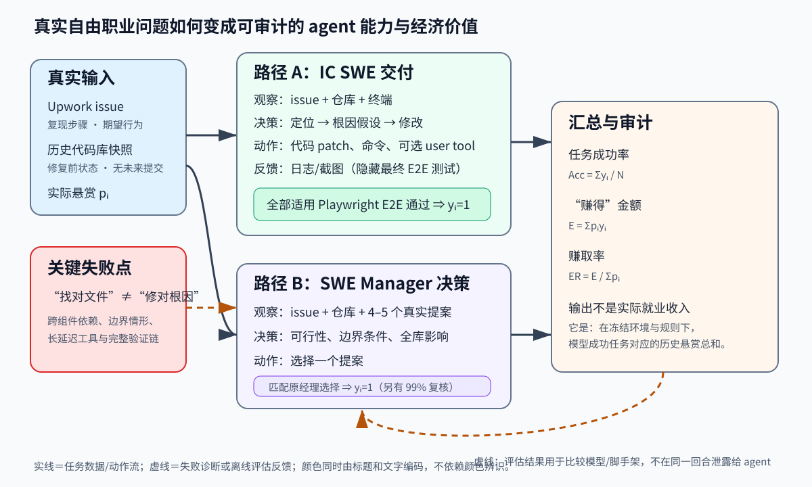

> **公开入口：** [arXiv](https://arxiv.org/abs/2502.12115) · [PDF](https://arxiv.org/pdf/2502.12115v4) · [TeX 源码包](https://export.arxiv.org/e-print/2502.12115) · [代码](https://github.com/openai/SWELancer-Benchmark) · [项目页](https://openai.com/index/swe-lancer/)
>
> 文中的 `source/...:Lx–Ly` 对应解压后的 arXiv TeX 源码坐标；博客不镜像原论文文件。

> 论文信息：Samuel Miserendino、Michele Wang、Tejal Patwardhan、Johannes Heidecke；首次公开于 2025-02-17；arXiv:2502.12115；[代码与公开 Diamond 集](https://github.com/openai/SWELancer-Benchmark)。
>
> 证据版本：上述 PDF 共 39 页，SHA-256 `5592089e626e52af27222a144f65ef8e2748e4f8a2ab3cba29df82366a48a5c8`；本文按 v4 PDF 与 source/main.tex 复核。
>
> 阅读约定：以下用 **论文事实**、**跨论文解释**、**我们的判断** 区分证据层级；“赚得”始终加引号，因为没有模型真的接单、签约或收款。

## 一句话结论

**论文事实。** SWE-Lancer 把 1,488 个来自同一真实商业代码库的 Upwork 任务、修复前仓库、历史提案和实际支付的 100 万美元悬赏，变成两条可执行评估：agent 要么提交代码并通过隐藏的端到端测试，要么像经理一样选中原来获胜的提案。最强的 Claude 3.5 Sonnet 在公开 Diamond 集上只解决 26.2% 的独立开发任务、经理题为 44.9%，对应“赚得”208,050/500,800 美元；因此论文支持“这一冻结环境中的现实全栈工作仍未饱和”，不支持“模型可替代某比例的软件工程师”（PDF pp.2–3；`source/main.tex:128-149,147`）。

## 1. 基本概念

**论文事实。** Individual Contributor Software Engineering（IC SWE）题给出原始 issue、修复前代码库和修复目标；agent 可浏览/修改仓库、运行命令，交付 patch，所有适用的隐藏 Playwright 端到端测试都通过才算成功。SWE Manager 题给出同一 issue、修复前代码库与真实候选提案，模型只能选一个，选择是否等于原工程经理的决定构成标签；额外工程师复核与原选择的一致率为 99%（PDF pp.3–4；`source/main.tex:165-173`）。

“端到端测试”不是只测某个函数，而是模拟用户路径，例如登录、上传头像、让第二个账户参与，再检查最终页面。**跨论文解释。** 与 HumanEval 的独立函数合成、SWE-bench 的开源 issue/既有测试相比，这里改变了三个测量环节：覆盖商业全栈路径、专业工程师另写测试、用历史市场付款给任务加权；它测的不是纯编码速度，而是“在一个特定脚手架里把自然语言目标闭环成可验收交付”的能力（`source/main.tex:136-144,162-163`）。

贯穿全文的五元组是：输入 (x_i)（issue、仓库，经理题再加提案）；内部状态 (s_t)（已读文件、根因假设、命令结果）；决策 (d_t)（下一步查看、修改或选择）；动作 (a_t)（terminal、patch、user tool 或最终提案）；反馈 (o_{t+1})（日志、截图以及离线 grader 结果）。任务价格 (p_i) 是历史实际悬赏，不是作者根据难度拟合出的分数（`source/main.tex:166-186`）。

## 2. 问题：旧评估和现有 agent 在哪里失败

### 2.1 观察到的失败

**论文事实。** 既有编码评测偏向自包含程序或孤立 issue；真实工程却要求跨前后端、移动端、API、浏览器和外部应用推理。Diamond 的平均任务在 GitHub 上用 26 天解决、含 47 条评论；IC 题平均改 2 个文件、69 行，经理题平均在 4–5 个方案中选择（PDF pp.2–3；`source/main.tex:112-145`）。在实际 rollout 中，agent 往往很快用关键词定位正确文件，却没理解问题怎样跨组件传播，因而修补症状而非根因；失败通常不是“找不到编辑位置”（PDF p.8；`source/main.tex:370-377`）。

最小例子：issue 说“分享码页头像与个人资料页不一致”。只给头像组件补一个局部刷新，单元测试可能全绿；真正用户流包含登录、上传图片、切换到第二账户、打开分享页，缓存键或跨账户同步没有修好便会失败。这里的失败后果是整题 (y_i=0)，不是得到部分分。

### 2.2 机制解释

**论文事实。** 作者的定性解释是“定位强、根因弱”，强模型还更会等待 90–120 秒的 user tool、读取截图和轨迹并迭代调试；较弱模型会过早放弃长延迟工具（`source/main.tex:375-377`）。

**我们的判断。** 机制瓶颈是闭环深度：搜索给出“哪段代码相关”，但交付要求把“用户现象→状态来源→跨组件依赖→修改→真实行为验证”全部连通。局部线索密度高，容易产生过早确定；隐藏 E2E 又使 agent 不能对 grader 过拟合，只能建立可迁移的因果模型。该解释仍是轨迹归纳，不是论文随机操纵“根因推理能力”得到的因果结论。

### 2.3 别人怎样解决

**跨论文解释。** HumanEval、MBPP、APPS 等通过短、可独立执行的问题降低环境噪声；SWE-bench/Verified 用真实开源仓库和 issue 提高真实性；SWE-bench Multimodal 扩到前端。它们分别改变题目真实性或验证质量，但通常没有实际悬赏、商业全栈任务和经理提案选择。SWE-Lancer 的干预不是新 agent 算法，而是重新设计测量仪器：代表性抽样任务、冻结历史仓库、专业工程师创建并三轮核验 E2E、统一 Docker、公开集与私有 holdout（`source/main.tex:162-190`）。

## 3. 核心机制：从真实 issue 到价值评估

*图 1（原创、可编辑 SVG）。实线表示 agent 在一次任务中真实可见的数据和动作；橙色虚线表示离线诊断/评估，最终 E2E 结果不在该回合泄露。上路是 IC：patch 只有通过全部适用测试才获得该题悬赏；下路是经理：选择匹配历史获胜方案才成功。右侧金额是成功题历史悬赏之和，不是现实工资预测。*

流程有五个关键决策。第一，100 名专业工程师先筛任务的清晰度、可执行性与代表性，高于 5,000 美元的 IC 题由十人验证；每个 IC/经理题分别至少经三人/两人审查。第二，从 issue 标题、描述和当时仓库生成任务，有至少两个提案才生成经理题。第三，为每个 IC 题编写并三重验证 Playwright 测试。第四，agent 在无互联网、无 GitHub remote/未来提交的容器中行动；可选 user tool 只留下用户操作轨迹和截图，不直接说成功与否。第五，离线计算等权成功率与按 (p_i) 加权的赚取率（PDF pp.3–4；`source/main.tex:179-192`）。

### 3.1 最小贯穿例子

假设一个 1,000 美元头像同步题。第 0 轮，agent 看到 issue 和旧仓库；它应先预测“两个页面是否读取不同状态源”。第 1 轮，搜索头像字段和缓存更新路径，形成状态 (s_1)。第 2 轮，运行现有测试并调用 user tool 重现跨账户流程；截图只是观察，不是答案。第 3 轮，修改共享状态失效逻辑并复跑用户路径。最终 patch 被独立 E2E 接管；全部测试过则计 1,000 美元，否则为 0。经理版本则比较“局部重渲染”和“统一缓存失效”提案，并结合全库上下文选一个。

类比是房屋维修验收：报价能反映某次真实交易，住户从进门到用水的全流程比只测水龙头零件更接近交付。类比的边界是软件 patch 可低成本复制、历史悬赏受谈判和时效影响，金额不等于稳定劳动时长。

### 3.2 可证伪预测

**我们的判断。** 若“跨组件根因闭环不足”成立，在同模型、同 token/时间预算、同题顺序下，只提供更快搜索不应大幅提高 E2E 成功；强制 agent 在改码前写出跨组件因果链、改码后执行同等时长的用户流验证，应主要提升多文件/高交互任务，而且减少“局部正确”patch。若只加搜索即同样改善，瓶颈更可能是检索；若结构化根因步骤提高叙述却不提高隐藏 E2E，应先检查实现是否真正改变动作，再判定机制不获支持。另一个受控预测：保留截图信息但人工固定工具延迟后，弱模型性能若恢复，说明等待策略而非视觉理解是主要中介。

## 4. 关键公式

### 4.1 成功率、收益与赚取率

大白话：成功率让每题一票，赚取率让历史高悬赏题权重更大。令 `N` 为题数，`y_i∈{0,1}` 表示第 `i` 题是否满足严格验收，`p_i>0` 为真实悬赏，则

$$
\mathrm{Acc}=\frac{1}{N}\sum_i y_i,\qquad E=\sum_i p_i y_i,\qquad \mathrm{EarnRate}=\frac{E}{\sum_i p_i}.
$$

论文给出指标定义但未写成这一组三式；这是为理解而补写的等价表达（`source/main.tex:175-177,204`）。玩具计算：两题价格 100、900，模型只解第一题，则成功率 1/2=50%，`E=100`，赚取率 10%；只解第二题，成功率仍 50%，赚取率变 90%。边界：所有 `p_i` 相等时二者相同；价格与难度、商业紧急度和谈判纠缠，因此赚取率不能单独解释为“技术能力加权准确率”；严格二值验收也忽略部分进展。

### 4.2 pass@k

论文用

$$
\mathrm{pass@}k=\mathbb E_{\text{task}}\left[1-\frac{\binom{n-c}{k}}{\binom nk}\right]
$$

估计从同题 `n` 个样本中不放回选 `k` 个时至少一个成功的概率（PDF p.6；`source/main.tex:283-286`）。`c` 是其中成功样本数；失败事件是 `k` 个全从 `n-c` 个失败样本抽到，其概率为组合数之比，故用 1 减去它。例：`n=5,c=2,k=2`，失败概率 `C(3,2)/C(5,2)=3/10`，pass@2=0.7。`c=0` 时恒为 0；`k=n,c>0` 时为 1；要求 `k≤n`。它估计“有多次独立候选可挑”而非自动告诉我们如何识别正确候选，样本相关性和验证成本也不会消失。

### 4.3 人机串联成本节省

论文定义

$$
S=1-\frac{C_m+C_{h,\mathrm{fail}}}{C_{h,\mathrm{all}}}.
$$

`C_m` 是在所有题上先跑模型的 API 成本，`C_h,fail` 是模型失败题交给 freelancer 的悬赏，分母是假定全由人完成的历史总悬赏。例：全人工 1,000，模型花 100、失败题再花 700，则 `S=20%`。若分子超过分母，`S<0`，表示更贵；无限尝试不保证节省，因为 `C_m` 增长且正确性确认也有成本。该式假设能快速、正确识别成功 patch，论文明确说现实验证可能超过 24 小时（PDF p.8；`source/main.tex:325-342`）。

## 5. 实验：每组证据回答什么

| 主张与受控比较 | 环境、指标 | 精确结果 | 审计与边界 |
|---|---|---|---|
| 前沿模型是否饱和 | Diamond 502 题/500,800 美元；Full 1,488 题/100 万；pass@1、金额、赚取率 | Diamond：GPT-4o 23.3%/139k，o1-high 29.7%/166k，Sonnet 36.1%/208k；Full 分别 23.3%/304k、32.9%/380k、33.7%/403k | 单次 pass@1 有方差；Sonnet Full 受速率限制只跑一次。PDF pp.5–6；`source/main.tex:204-281` |
| 编码与管理是否同难 | 同模型、同 Diamond；IC 隐藏 E2E vs 经理历史选择 | Sonnet：IC 26.2%、58k/236k；经理 44.9%、150k/265k；o1 为 16.5% 与 41.5% | 两类任务、标签与题数不同，差值不是纯“决策比编码容易”的因果效应。`source/main.tex:213-270` |
| 更多推理计算是否帮助 | o1 + user tool，Diamond IC；low/medium/high | pass@1 9.3%→15.6%→16.5%；金额 16k→24k→29k；赚取率 6.8%→9.9%→12.1% | 推理档位同时改变成本；没有多次随机重复的区间。PDF pp.5–6；`source/main.tex:229-233,290-300` |
| 多次尝试是否扩大覆盖 | GPT-4o/o1，Diamond IC，(k=1…7) | o1 多 6 次尝试时解决率近三倍；GPT-4o pass@6 约等于 o1 pass@1 的 16.5% | pass@k 假定有办法在候选中验真，非线上自动收益。`source/main.tex:283-286` |
| user tool 是否必要 | 同模型有/无 user tool | o1-high 16.5%→13.1%；GPT-4o 表中均 8.0%（金额因成功题不同为 14k 与 17k） | 单次样本的离散波动使“小幅下降”不等于稳健工具效应。`source/main.tex:227-241,317-318` |
| 先模型后人工是否省钱 | Diamond IC 237 题，五次运行均值 | pass@1：GPT-4o 省 8.84%，o1 省 13.26%；pass@5：18.6%、33.5%；API 成本 95% CI 分别 194.31±17.31、1,623.76±56.68 美元 | 依赖历史悬赏、API 定价、可快速验真和 freelancer fallback。PDF p.8；`source/main.tex:325-342` |

结果允许说“该评估的最强基线仍失败多数题，额外计算与交互有一定改善空间”。不能由此推出：任何公司都能按 40.3% 节省工资、任务价格是客观难度、经理标签唯一正确，或模型失败均源于推理而非脚手架与时间限制；40.3% 是 Sonnet 在 Full 集上的历史悬赏赚取率，不是节省率（`source/main.tex:273-277`）。

## 6. 优点

思想上，它把能力、可靠性和经济权重放进同一条可审计链，同时保留等权成功率避免金额遮蔽。实验上，公开/私有切分、无互联网和移除未来提交降低污染，E2E 的 broken/fixed 双态核验比复用单元测试更难被投机。工程上，统一 Docker、公开 Diamond、完整脚手架和专业测试让后续模型可在相同冻结环境比较。最重要的是，它公开了“金额”的操作性定义，没有把汇总悬赏直接包装成宏观自动化预测。

## 7. 局限与失效边界

**论文明确承认。** 所有任务来自 Upwork 与 Expensify，一个产品/组织不能代表基础设施等领域；历史悬赏会偏离当前价格；API 成本有运行方差，pass@5 的快速验证假设不现实；公开集会逐渐污染（`source/main.tex:379-390,325-342`）。经理题以历史获胜提案为标签，虽然 99% 复核很高，仍测“匹配选择”而非实际执行后的反事实最优。

**我们的判断。** 单仓库带来深度，却把仓库习惯、环境可运行性与通用 SWE 能力捆绑。严格 all-or-nothing E2E 适合交付，却不显示离成功多远。真实价格含紧急性、议价、供需和任务发布策略；以它加权能回答“复现这些历史交易的价值覆盖”，不能外推劳动生产率。模型不能与真实经理/客户澄清需求，故“自由职业”仅部分真实。对具外网、长期记忆、多人协作或人工审查的生产系统，基线结论需重新测。

## 8. 最小复现路线

从 Diamond IC 的一个低价和一个高价题开始：固定仓库镜像、模型版本、提示、token/墙钟预算与 user tool；确认 broken 状态失败、gold/fixed 状态通过；各跑至少五个独立样本，保存 terminal、patch、截图和测试结果。先报告逐题 (y_i,p_i)，再汇总 Acc/EarnRate/pass@k；另做唯一干预“有无结构化根因链”，不要同时换模型、搜索器和验证器。核对点是 237 个 IC 题总价 236,300 美元、Diamond 总价 500,800 美元，以及失败 patch 是否真的由隐藏 E2E 判定。成本复现还需锁定 API 价目时间并把人工验证时间单列。

## 9. 思考题

1. 若删除真实价格、只留成功率，关于工程可靠性的结论保留多少，关于经济影响的结论又失去什么？
2. 为什么 user tool 消融很小既可能表示工具无用，也可能表示当前 agent 不会等待和吸收反馈？哪个受控实验能区分？
3. 若把“全部测试通过”改成测试通过比例，会更利于研究还是更容易奖励局部补丁？
4. 经理题的 99% 一致率很高；它为什么仍不能证明历史提案在反事实执行中最优？
5. pass@k 上升后，若没有可靠 selector，部署成功率为什么不一定同幅上升？

## 10. 证据定位

- 任务定义、数据规模、输入/验收：PDF pp.2–4；`source/main.tex:128-149,165-186`。
- 主结果表、pass@k、计算量和工具消融：PDF pp.5–7；`source/main.tex:204-318`。
- 成本与轨迹机制观察：PDF p.8；`source/main.tex:325-377`。
- 局限：PDF pp.8–9；`source/main.tex:379-398`。
- 正式入口：[arXiv](https://arxiv.org/abs/2502.12115)；[评测代码](https://github.com/openai/SWELancer-Benchmark)。
