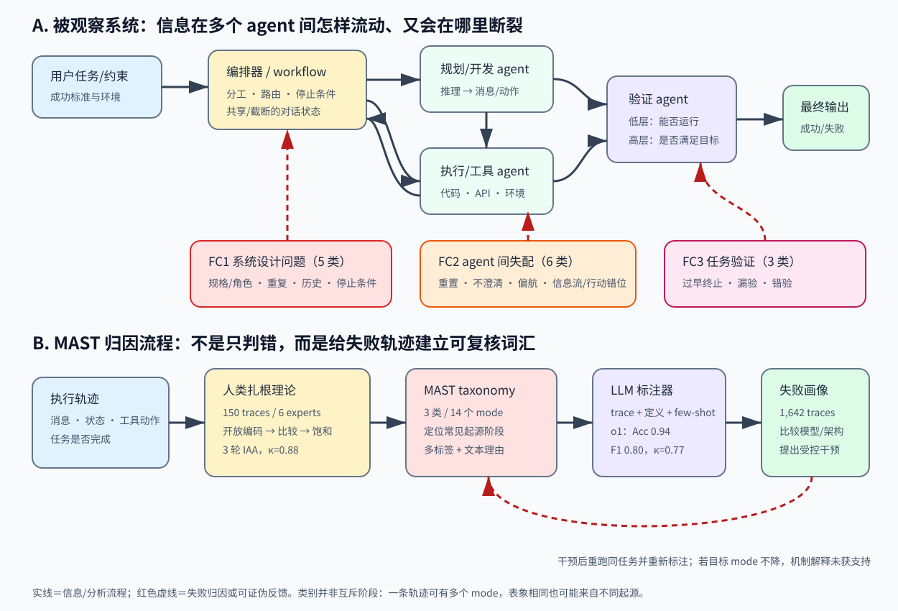

> **公开入口：** [arXiv](https://arxiv.org/abs/2503.13657) · [PDF](https://arxiv.org/pdf/2503.13657v3) · [TeX 源码包](https://export.arxiv.org/e-print/2503.13657) · [代码](https://github.com/multi-agent-systems-failure-taxonomy/MAST)
>
> 文中的 `source/...:Lx–Ly` 对应解压后的 arXiv TeX 源码坐标；博客不镜像原论文文件。

> 论文信息：Mert Cemri、Melissa Z. Pan、Shuyi Yang 等；首次公开于 2025-03-17；NeurIPS 2025 Datasets & Benchmarks；arXiv:2503.13657；[代码与数据](https://github.com/multi-agent-systems-failure-taxonomy/MAST)。
>
> 证据版本：本地 v3 PDF 共 47 页，SHA-256 `1b9e317a2a421e60ca2b2eda4a30844557a01e63286a790890c0ecef32d25460`；数字以 PDF 与拆分 TeX 源码交叉复核。
>
> 阅读约定：**论文事实**是作者实际定义、标注和测得的内容；**跨论文解释**用于放进既有 agent 研究脉络；**我们的判断**是可被后续实验推翻的机制解读。

## 一句话结论

**论文事实。** 论文没有提出一个万能多智能体架构，而是先把“为什么失败”变成可标注对象：六位专家用扎根理论检查 150 条长轨迹，得到 MAST 的 3 个失败类别、14 个细粒度 mode，再用人类一致性和 LLM-as-a-Judge 校准，将其扩展到 7 个框架的 1,642 条轨迹。关键发现是，失败不仅来自底座模型：预先设计的角色/工作流、执行中的信息流与最终验证都会断裂；保持同一 LLM 改提示或拓扑最高可带来 15.6 个百分点改善，但远未解决可靠性（PDF pp.1–2,5–9；`source/macros.tex:7-17`；`source/06_discussions.tex:34-41`）。

## 1. 基本概念

**论文事实。** agent 被定义为具有提示规范（初始状态）、对话轨迹（状态）和环境交互/工具使用能力（动作）的人工实体；多智能体系统（MAS）是由编排机制让多个 agent 互动的集合，动机包括任务分解、并行、上下文隔离、专长组合和多样推理（`source/02_introduction.tex:13-20`）。一条 trace 是系统为一个任务产生的消息、工具调用、状态变化和结果记录。论文把 failure 操作性定义为 MAS 未达到预定任务目标，而不是“某句话看起来差”（PDF p.2；`source/02_introduction.tex:26`）。

failure category（FC）是机制层的三个大类；failure mode（FM）是可落到轨迹片段的 14 个标签。一条轨迹可同时有多个 mode，mode 频率也不是任务失败率。MAST-Data 是规模化 LLM 标注数据；MAST-Data-human 含 IAA 过程中由三位专家各自标注的 21 条轨迹。Grounded Theory（扎根理论）意为先开放编码观察材料，再持续比较、写备忘和归纳概念，直到新材料不再产生新 mode；它不是先写完假设再找例子（`source/04_methodology.tex:18-28`）。

### 三类、十四种失败

**论文事实。** FC1“系统设计问题”含 5 类：不遵守任务规范、角色规范、步骤重复、丢失对话历史、不知停止条件。FC2“agent 间失配”含 6 类：对话重置、不请求澄清、任务偏航、信息扣留、忽略其他 agent 输入、推理—行动不一致。FC3“任务验证”含 3 类：过早终止、没有/不完整验证、错误验证（`source/99_appendix.tex:26-92`）。

这些标签描述常见失败起源，而不是三个严格互斥的时间桶。比如最终 chess 程序规则错误，既可能是开发 agent 忽略规格（FC1），也可能是测试 agent 只看能否编译（FC3）；归因需要回到最早证据。作者把 mode 映射到 pre-execution、execution、post-execution 常见起源阶段，但明确不声称 taxonomy 穷尽所有失败（`source/05_findings.tex:10-14`）。

## 2. 问题：为什么“多一个 agent”没有自动变可靠

### 2.1 观察到的失败

**论文事实。** 七个被测开源 MAS 的任务失败率为 41%–86.7%，多智能体相对单 agent 或 best-of-N 的增益经常很小（PDF p.2；`source/02_introduction.tex:21-24`）。论文记录的典型链条是 Phone Agent 知道 API 用户名格式，却没告诉 Supervisor；Supervisor 也没澄清，登录反复失败。另一例中 ChatDev 的 chess 程序能编译且经过 reviewer，却违反游戏规则，因为验证停在低层表面检查（PDF pp.6–7；`source/04_methodology.tex:56-60`；`source/05_findings.tex:47-56`）。

在 210 条、每系统前 30 条的展示性样本中，不同架构呈现不同画像：AppWorld 常过早终止，OpenManus 常重复步骤，HyperAgent 的突出问题是步骤重复和错误验证。作者明确警告各系统任务/benchmark 不同，图只可描述画像，不能横向排名（`source/06_discussions.tex:4-17`）。

### 2.2 机制解释

**论文事实。** FC1 指向工作流、提示、角色和状态管理；FC2 指向关键消息没有在正确对象、正确时刻成为行动条件；FC3 指向验证器存在但只做编译/TODO 等表面检查。各 mode 在汇总数据中的发生率包括：步骤重复 15.7%、不知停止 12.4%、不守任务规范 11.8%；推理—行动不一致 13.2%、任务偏航 7.4%、不澄清 6.8%；错误验证 9.1%、不完整验证 8.2%、过早终止 6.2%（PDF p.7；`source/05_findings.tex:18-56`）。这些百分比可重叠，不能相加成总失败率。

**我们的判断。** 多 agent 增加的不是单纯“智力样本数”，而是接口数和状态边界：每次分工都引入“谁知道什么、谁有权决定、何时停止、谁验证何种目标”的协议义务。底座能力提高能降低某些局部错误，却不会自动定义组织契约。失败的可检验机制是：信息在 agent A 的文本里出现，不代表它被路由到 B 的决策状态；存在 verifier 角色，也不代表其观测覆盖任务语义。

### 2.3 既有解法及其假设

**跨论文解释。** 既有方向包括用明确角色/标准作业流程约束职责、用反思或辩论让 agent 互评、用 verifier 和测试提供外部反馈、用 MCP/A2A 等通信协议统一消息格式。它们分别修改组织规范、讨论过程、反馈和传输层。论文的重要限定是：FC2 在同一框架、自然语言通畅时仍出现，故格式标准化只能保证“消息可传”，不能保证 agent 推断对方的信息需求；FC3 也说明“有 verifier”不等于验证高层目标（`source/03_related.tex:1-14`；`source/05_findings.tex:31-56`）。

论文列出战术型提示/工具增强和结构型拓扑、状态管理、多层验证策略，但把它们作为路线图与小型案例，而非完成的通用解法。根据本项目的科学原则，不能看到某 mode 后任意叠加记忆、重试、额外 loss 来“救分”；每个改变都应对应一个独立、可证伪机制。

## 3. 核心机制：从执行轨迹到失败归因

*图 1（原创、可编辑 SVG）。上半部实线是任务、状态、消息、工具结果和验证反馈的正常流；三条红色虚线把常见起源连到 FC1/FC2/FC3。下半部展示分析链：轨迹先由专家开放编码和 IAA 收敛为 3 类 14 mode，再由 few-shot o1 扩标，最后得到每个系统的失败画像并指导受控干预。红色回环强调：干预若没有降低目标 mode，原机制解释就未获支持。*

这条链的核心输入不是最终答案，而是完整 trace、任务目标、taxonomy 定义和少样本人类例子。人类阶段的决策是“哪段可观察行为算哪个 mode、mode 边界是否需要合并/拆分”；动作是独立标注和讨论修订；反馈是 annotator disagreement 与 Cohen’s `κ`。规模化阶段，o1 读取 trace+定义+few-shot，输出多标签及文字理由；反馈是 held-out 人类标签上的 accuracy、precision、recall、F1、`κ`。开发阶段再把 mode 分布转成一个明确的提示或拓扑假设，重跑相同任务并重新归因（`source/04_methodology.tex:18-67`）。

### 3.1 最小贯穿例子

任务是“登录服务并取回数据”。第 0 轮，Supervisor 把普通邮箱发给 Phone Agent。第 1 轮，Phone Agent 从 API 报错知道用户名必须是特定格式，却只重试、不上报：关键信息存在于局部状态但未成为共享消息，候选为 FM-2.4。第 2 轮，Supervisor 未询问失败原因而继续原假设，候选为 FM-2.2。第 3 轮，系统重复登录后提前给出失败结果，还可能叠加 FM-3.1。归因者应引用具体轮次，而不能只因“登录失败”猜标签。

类比是医院交班：检验科拿到异常结果、主治医生没收到、出院审核只查表格是否填完；每个人局部合理，组织仍失败。类比边界是 agent 的“角色”和消息边界由软件精确配置，且同一个底座模型常扮演多人；人类组织中的动机、权力与隐性知识不能直接套用。

### 3.2 可证伪预测

**我们的判断。** 若 FM-2.4 的机制真是“已知信息未进入接收者决策”，在同模型、同任务、同预算下，强制每个工具 agent 用固定槽位回报“新约束/失败原因/下一位所需信息”，应降低 FM-2.4 和由其引发的重复，但不必降低纯粹的错误验证。若消息里已经有该信息，接收者仍不行动，则机制更像 FM-2.5 或 FM-2.6，不能继续叫传输失败。

若 FC3 来自验证抽象层级不足，给 ChatDev 增加任务目标断言、保持开发提示和模型不变，应降低 FM-3.2/3.3 并提高 ProgramDev 成功；若只增加编译检查则不应修复游戏规则错误。未改善时先审计验证步骤是否真正读取了运行输出、是否可阻止终止；实现忠实仍无效，才说明“多层验证”假设在该任务不获支持。若换更强底座但保持架构，仅 FC1/FC2 普遍下降、FC3保持，则也符合作者观察；三类同步同幅下降则削弱“结构瓶颈独立存在”的强版本。

## 4. 指标公式：怎样知道标签可靠

论文没有训练目标；关键数学对象是标注一致性和多标签分类指标。

### 4.1 Cohen’s kappa

大白话：accuracy 里有一部分可能是因标签稀疏而“碰巧都说没有”，`κ` 扣掉这部分：

$$
\kappa=\frac{p_o-p_e}{1-p_e}.
$$

`p_o∈[0,1]` 是两位标注者实际一致率；`p_e` 是依据各自标签边际比例计算的随机期望一致率。`1-p_e` 是超越偶然的一致空间。玩具例：20 个二元判断实际同意 18 个，`p_o=.9`；A 标“有失败”60%，B 标 50%，则 `p_e=.6×.5+.4×.5=.5`，所以 `κ=(.9-.5)/.5=.8`。若 `p_o=p_e`，`κ=0`；完全一致且 `p_e<1` 时为 1；极端类别不平衡会出现高 accuracy、低 `κ`，`p_e=1` 时式子无定义。论文三位专家最终轮平均 `κ=0.88`，few-shot o1 对 held-out 人类标签为 0.77，未见新系统/benchmark 的额外人类轮为 0.79（PDF pp.5–6；`source/04_methodology.tex:24-34,63-67`）。

### 4.2 Precision、recall 与 F1

对某个 mode，把预测且人工也标记的数量记 `TP`，误报 `FP`，漏报 `FN`：

$$
P=\frac{TP}{TP+FP},\quad R=\frac{TP}{TP+FN},\quad F1=\frac{2PR}{P+R}.
$$

玩具例：人工有 4 个 FM-3.2，judge 报 3 个，其中 2 个正确，则 `P=2/3,R=2/4,F1≈.57`。没有预测正例时 precision 的分母为零，实践需约定为 0 或跳过；没有真实正例时 recall 同理。micro/macro 聚合对稀有 mode 权重不同，论文表格未在该处说明聚合细节，这是复现风险。表中 zero-shot o1 为 accuracy .89、recall .62、precision .68、F1 .64、`κ=.58`；few-shot 后分别 .94、.77、.833、.80、.77，说明示例主要改善了稀有正标签识别，而不只是多数负类准确率（`source/04_methodology.tex:34-53`）。

### 4.3 mode 发生率

为读图可写 `r_m=(1/N)Σ_i 1[m∈L_i]`，其中 `L_i` 是轨迹 `i` 的标签集合。三条轨迹标签分别为 {重复,错验}、{错验}、{}，则两者发生率为 1/3 和 2/3；总和为 1，因为第一条可多标。边界：`r_m` 不给出因果先后、严重度或任务成功率，也不能跨不同 benchmark 直接比较性能。这个等价式是我们的解释，不是论文展示的独立公式。

## 5. 实验审计：每组证据回答什么

| 主张与受控比较 | 数据与指标 | 精确结果 | 可得结论与边界 |
|---|---|---|---|
| taxonomy 能否由人稳定使用 | 初始 150+ traces；3 轮，每轮 3 位专家独立标 5 条；平均 Cohen’s `κ` | 最终轮平均 `κ=0.88`；六位专家各在开放编码阶段投入超过 20 小时，争议解决另约 10 小时 | 说明在小规模精炼样本中定义较一致；讨论后修订和样本量小会提高内部一致性，非“客观根因真值”。PDF p.5；`source/04_methodology.tex:18-28` |
| LLM 能否扩展多标签标注 | IAA held-out；o1 zero/few-shot；Acc/P/R/F1/`κ` | zero-shot .89/.62/.68/.64/.58；few-shot .94/.77/.833/.80/.77 | few-shot 明显更接近人类；仍会漏掉 23% 正标签量级，且 held-out 与 few-shot 来源接近。PDF p.6；`source/04_methodology.tex:31-53` |
| 能否外推到未参与建 taxonomy 的系统 | OpenManus、Magentic-One + MMLU、GAIA，额外人类 IAA | `κ=0.79`，无需修改 taxonomy | 支持有限的跨系统/领域可用性；只有两个新系统/benchmark，不等于穷尽。`source/04_methodology.tex:63-67` |
| 数据是否覆盖多样 MAS | 编码、数学、通用 agent；7 框架；人工/LLM 标注 | MAST-Data 共 1,642 traces；大表含每配置 30/100/165–206 条等 | 规模与配置多样，但许多 failure label 来自自动 judge；任务分布不均。`source/08-mad-tab.tex:1-50`；`source/macros.tex:17` |
| 底座模型与架构是否改变画像 | ProgramDev-v2：同 MetaGPT 比 GPT-4o/Claude；同 GPT-4o 比 MetaGPT/ChatDev | GPT-4o 在 MetaGPT 中 FC1 比 Claude 少 39%；MetaGPT 较 ChatDev 的 FC1/FC2 少 60%–68%，但 FC3 是 1.56 倍 | 固定一侧后的对比比跨系统总榜更接近受控；仍只有特定模型、框架和 100 题配置。`source/06_discussions.tex:14-17`；`source/10_mast_analysis.tex:26-32` |
| 针对 mode 的干预能否改善任务 | AG2 GSM-Plus 200 题、6 runs；ChatDev ProgramDev-v0 32 题与 HumanEval；同底座改 prompt 或 topology | AG2 GPT-4：84.75±1.94→89.75±1.44（prompt），topology 85.50±1.18；GPT-4o：84.25±1.86→89.00±1.38/88.83±1.51。ChatDev ProgramDev-v0：25.0→34.4→40.6；HumanEval：89.6→90.3→91.5 | ChatDev 最大 +15.6 点支持结构可改善；AG2 则 prompt 胜 topology，不能概括为拓扑总更优。ChatDev 未给方差，且 v0 是 32 题定制集。PDF pp.8–9；`source/09_solutions.tex:83-190` |

**实验审计判断。** 论文最好地支持“taxonomy 是一个有较高人类一致性、可由 judge 扩展的诊断词汇”，其次支持“同模型改系统能改善特定配置”。它不能证明 14 类是自然界唯一正确分解，也不能仅凭相关频率断言根因。尤其 `source/09_solutions.tex:197` 声称 topology 对两系统更有效，与同表 AG2 数值并不一致；应以表中逐条件数字为准并保留这一内部张力。

## 6. 优点

思想上，论文把聚合任务准确率拆成可行动的组织层故障，避免把一切归因于 hallucination。方法上，先人类扎根、再 IAA 修边界、最后校准自动 judge，比让 LLM 自己发明标签更可审计；还保留文字理由和人工子集。实验上，同 LLM 比架构、同架构比 LLM，以及干预前后重标 mode，使“为什么改善”有初步证据。工程上，数据、taxonomy、annotator 与 `agentdash` 接口公开，便于在新系统上生成失败画像。

## 7. 局限与失效边界

**论文明确承认。** taxonomy 不穷尽全部失败，重点是任务正确/完成，没有纳入效率、成本、延迟、鲁棒性、扩展性和安全；当前简单干预仍不能带来高可靠性（`source/05_findings.tex:10-14`；`source/06_discussions.tex:39-41`）。

**我们的判断。** 第一，自动 judge 与 taxonomy 使用同一类语言模型生态，可能把可言说、易识别的失败放大，并漏掉环境状态中的无声错误。第二，mode 边界存在因果歧义：信息未被使用，究竟是发送者扣留、接收者忽略，还是上下文丢失，单条文本轨迹未必可识别。第三，多标签频率受 trace 长度和架构暴露程度影响；更透明的系统可能“看起来失败更多”。第四，六位专家形成 taxonomy、最终 IAA 却只在每轮五条上测，0.88 不能当作全数据标签准确率。第五，case study 同时有任务集小、缺少方差和干预包内多个变化的问题，15.6 点是可重复检验的线索，不是普遍效应。

taxonomy 在这些情形会失效或需扩展：目标本身含糊且没有可判成功标准；agent 用不可见内部状态通信；主要风险是隐私/安全而非正确性；系统动态创建角色，使固定职责标签无意义；长时任务中失败来自成本耗尽而非提前终止。

## 8. 最小复现路线

先选一个公开、可完整导出 trace 的 MAS 和 30 个同质任务，锁定模型、温度、工作流和成功判据。人工由至少两人按附录定义独立多标签，要求每个标签引用轮次与证据句；报告各 mode prevalence、micro/macro P/R/F1、每 mode 的混淆和 `κ`，不要只报 accuracy。再运行公开 annotator，核对 few-shot 指标方向。最后只选择最高频且证据清楚的一个 mode，例如 FM-3.2：加入一项高层目标测试，保持其他配置不变，多随机种子复跑；主结果同时报告任务成功率、目标 mode 和新出现 mode。若目标 mode 未降，先检查实现忠实度，再决定假设是否不成立，不追加临时重试或辅助规则。

## 9. 思考题

1. 同一条失败轨迹同时被标 FM-2.4 与 FM-2.5 时，什么额外日志才能区分“没发送”和“发送了但没用”？
2. 为什么 verifier 角色存在却仍会 FC3？怎样设计低层运行检查和高层目标检查的最小对照？
3. accuracy 0.94 为什么不能说明稀有 failure mode 已被可靠识别？
4. 如果更透明的架构记录更多内部对话，它的 mode 发生率可能怎样偏移？如何按可观察机会归一化？
5. ChatDev 拓扑改造同时改变循环与停止权，哪个消融能判断 15.6 点来自哪一项？

## 10. 证据定位

- MAS 定义、失败率与研究问题：PDF p.2；`source/02_introduction.tex:13-30`。
- 扎根理论、IAA、LLM judge 与跨系统验证：PDF pp.5–6；`source/04_methodology.tex:18-67`。
- 3 类 14 mode、频率和机制例子：PDF p.7；`source/05_findings.tex:12-56`；定义见 `source/99_appendix.tex:26-92`。
- 系统画像与干预：PDF pp.8–9；`source/06_discussions.tex:14-41`；`source/09_solutions.tex:83-210`。
- 正式来源：[NeurIPS proceedings](https://proceedings.neurips.cc/paper_files/paper/2025/hash/b1041e52d3be19f0a9bc491657488e4a-Abstract-Datasets_and_Benchmarks_Track.html)；[arXiv](https://arxiv.org/abs/2503.13657)；[代码与数据](https://github.com/multi-agent-systems-failure-taxonomy/MAST)。
