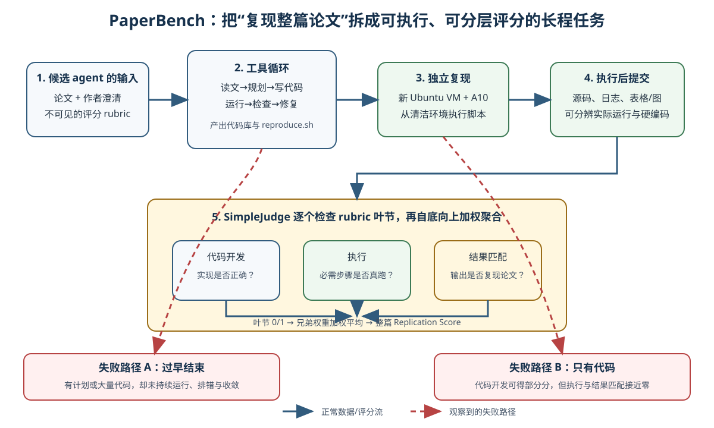

> **公开入口：** [arXiv](https://arxiv.org/abs/2504.01848) · [PDF](https://arxiv.org/pdf/2504.01848v3) · [TeX 源码包](https://export.arxiv.org/e-print/2504.01848) · [代码](https://github.com/openai/frontier-evals/tree/main/project/paperbench) · [项目页](https://openai.com/index/paperbench/)
>
> 文中的 `source/...:Lx–Ly` 对应解压后的 arXiv TeX 源码坐标；博客不镜像原论文文件。

> 论文信息：Giulio Starace 等，OpenAI；2025 年 arXiv 预印本 2504.01848（`paper.pdf:p.1`）。
>
> 证据版本：上述 PDF SHA-256 `2f58f1a6581af9d99432422dccf3cf61f5c263377c1e4550e7333c4a22d7184d`；有完整 TeX 源文。
>
> 阅读提示：下文用“**论文事实**”转述作者的设计和数据，用“**我们的判断**”标记机制解释。PaperBench 是评测基准，不是训练 agent 的新方法。

## 一句话结论

PaperBench 把“从零复现一篇当代机器学习论文”变成可分解、可重新执行、可自动评分的长程 agent 测试；其主要结果说明当时的最强受测系统能快速写出不少代码，却很难持续整合、运行、排错并复现实验结果：BasicAgent 下 Claude 3.5 Sonnet 的平均复现分为 (21.0\pm0.8\%)，而其结果匹配类子项只得 (0.7\pm0.3\%)（`source/example_paper.tex:L477–492`; `source/example_paper.tex:L897–916`）。

## 1. 基本概念

**论文事实—任务。** 每个样本给 agent 一篇论文和作者补充说明；agent 要产出一个代码仓库，根目录必须有 `reproduce.sh`。成功的含义是：从清洁环境运行该脚本后，真正生成论文报告的经验结果（`source/example_paper.tex:L185–190`）。因此“代码看起来对”只是中间态，不等于复现。

**论文事实—评分树。** 每篇论文都有一棵 rubric 树。叶节是可以判定通过/不通过的单一要求，兄弟节点有人工指定的相对权重，父节点是子节点的加权平均，根节点就是 Replication Score（`source/example_paper.tex:L209–217`）。叶节分三类：**Code Development** 查实现，**Execution** 查必需步骤是否真的运行，**Result Match** 查执行后输出是否复现特定结果（`source/example_paper.tex:L219–230`）。

**论文事实—重新执行与评审。** agent 结束后，提交会被复制到 Ubuntu 24.04、带 A10 GPU 的新虚拟机内运行；运行结果、日志和新生成文件组成“执行后提交”，用于排除任务期间硬编码的结果（`source/example_paper.tex:L192–197`）。SimpleJudge 对每个叶节独立判分；当代码库太长时，它先让模型按相关性排文件，再放入最相关的十个（`source/example_paper.tex:L408–416`）。

**为什么三类节点要看不同文件？** Code Development 节点可看源码、说明文档和 `reproduce.sh`，但不看运行日志与复现输出；Execution 节点额外看日志；Result Match 节点看日志和运行后输出，却不看源码（`source/example_paper.tex:L234–250`）。这种隔离让每个判断尽量依赖与其语义对齐的证据：“实现了”、“跑过了”和“跑出对的结果”不会被同一份表面上完整的代码混为一谈。但这也引入了上下文截断风险：若真正关键文件没被排进前十，裁判器可能把正确实现判成失败。

**数据单元是什么？** 主集从 ICML 2024 Spotlight 和 Oral 论文中挑出 20 篇，横跨 12 个 ICML 主题，20 棵 rubric 共有 8,316 个可单独判分的叶节（`source/example_paper.tex:L163–169`）。“20 篇论文”是任务数，“8,316 个叶节”是细粒度判断数，两个分母回答不同问题。一个模型可能在很多论文上完成少量代码叶节，却一篇也没有完整复现；平均分保留这种部分进展，不应被语言上等同为“复现了 21% 的论文”。

## 2. 问题：旧评测在哪里失败

### 2.1 观察到的失败

**论文事实。** 既有 CORE-Bench 给 agent 原作者仓库再要求复现；MLE-bench、MLAgentBench 和 DSBench 等主要用 Kaggle 竞赛任务；RE-Bench 有七个开放型机器学习研发工程任务，并在多数任务给出直接评分函数（`source/example_paper.tex:L581–587`）。这些设计很有用，但它们不直接回答另一个问题：只给论文，agent 能否读懂贡献、从零搭建完整代码库，并在数天级工作链中将所有实验真正跑通。作者把后一任务估为人类专家至少需要数天（`source/example_paper.tex:L163–167`）。

### 2.2 机制解释

**论文事实。** 日志审查显示，除 Claude 3.5 Sonnet 外的模型常常过早宣布完成或放弃；所有 agent 都没有在有限时间内有效制定“先复现哪些、如何核对”的策略，o3-mini 还常在工具使用上卡住（`source/example_paper.tex:L468–474`）。附录记录了更具体的前期失败：只描述计划不调工具、试图在单次回复写完一切、没读完论文、快速调用结束工具（`source/example_paper.tex:L790–807`）。

**我们的判断。** 机制性瓶颈是“长程闭环未闭合”：系统能在前几轮生成计划和代码，但代码→执行→观察错误→定位根因→修复→重跑的循环不能稳定维持。这个解释能同时预测“代码开发分数高于执行分数”和“强制继续工作可改善部分模型”，并且都可以在数据中直接检验。

还有两个可替代解释。其一，结果节点低可能主要因为训练和评估计算量在 12 小时内不可行，而非 agent 不会排错。其二，SimpleJudge 对代码的误判可能人为拉大类别差距。区分第一种解释需要将论文的原计算成本与 agent 的实际剩余时间配对；区分第二种需要对各模型的分项提交做盲法人工复评。论文当前的日志观察支持长程闭环说，但还没有排除这两种混杂。

### 2.3 既有解法和 PaperBench 的介入

**跨论文背景。** 给原仓库降低了实现起点的不确定性；给精确评分函数让 agent 每轮都能看到目标进度。PaperBench 有意不给这两项便利：原作者仓库和网上复现被加入黑名单，候选 agent 也看不到 rubric，必须从论文本身推断复现目标（`source/example_paper.tex:L185–190`; `source/example_paper.tex:L253–264`）。

## 3. 核心机制：基准如何工作

* 图中蓝色实线表示正常数据流，绿色框是新环境中真正执行后才有的证据，红色虚线是论文日志审查和分项分数暴露的失败路径。这是根据任务、重现和评分定义重绘的原创机制图（`source/example_paper.tex:L185–217`）。

**类比与其边界。** 可以把整个基准想成建筑验收：Code Development 检查图纸与施工是否存在，Execution 检查电梯是否真正通电运转，Result Match 检查载重和制动是否达到设计指标。新虚拟机相当于验收时由检查员自己合闸，不接受施工方预先摆好的指示灯。这个类比只说明三种证据层级；科研复现没有建筑规范那样唯一的程序性真值，同一论文可有多个合理实现，rubric 的权重也包含专家判断。

**控制流的阅读方法。** 看一条 agent 轨迹时，不要只数它写了多少文件。应记录每次执行前的可检验预期、运行后的错误证据、下一步修改针对的根因，以及同一失败是否无信息重复。只有这些转移才能区分“输出量大”和“复现在收敛”。真正的长程能力体现在证据如何改变下一步行动，而非单次回复的长度。

### 3.1 最小贯穿例子

假设论文的主张是“脚本数出 `strawberry` 中字母 r 有 3 个”。agent 首先读任务，创建计数程序和 `reproduce.sh`；新环境运行脚本生成 `output.csv`；评审分别检查代码是否实现计数、脚本是否真调用它、新生成结果是否为 3。这个玩具例子就来自任务指南（`source/example_paper.tex:L1550–1599`）。请在每轮问自己：当 agent 只写对 `count.py` 却忘了在 `reproduce.sh` 中调用它，三类叶节各应得多少？

### 3.2 可证伪预测

**我们的预测。** 若主要失败真是长程执行闭环中断，那么只阻止过早结束、并要求分步继续的 scaffold，应在同模型、同任务和同时间上提高总分，而提升应首先出现在代码开发或执行节点。IterativeAgent 移除主动结束能力并反复要求“只做下一步”（`source/example_paper.tex:L811–818`）；o1 由 (13.2\pm0.3\%) 升至 (24.4\pm0.7\%)，o3-mini 由 (2.6\pm0.2\%) 升至 (8.5\pm0.8\%)，方向符合预测（`source/example_paper.tex:L477–518`）。反例是 Claude 从 (21.0\pm0.8\%) 降至 (16.1\pm0.1\%)：这说明具体提示和模型有交互，“强制继续”不是通用解法（同上）。若在移除早停后执行分数仍不升，就应先检查 scaffold 是否真正维持了观察—修复循环；实现无误仍不升才是否定该机制假设。

## 4. 关键公式与指标

论文没有给出独立的显示公式；下式是对其评分文字的等价形式化，不是新算法（原定义见 `source/example_paper.tex:L209–217`）：

$$
S(v)=\frac{\sum_{c\in C(v)}w_{v,c}S(c)}{\sum_{c\in C(v)}w_{v,c}},\qquad
S(\ell)\in\{0,1\},\qquad
\bar S=\frac{1}{P}\sum_{p=1}^{P}S(r_p).
$$

**大白话目的。** 先对每个最小要求判对错，再按贡献重要性逐层汇总，最后对论文取平均。**符号账本。** $v$ 是任意内部节点；$C(v)$ 是它的子节点集；$c$ 是某个子节点；$w_{v,c}>0$ 是子节点相对于兄弟的权重；$\ell$ 是叶节，通过为 1、未通过为 0；$r_p$ 是第 $p$ 篇论文 rubric 的根；$P$ 是评测论文数，主集中 $P=20$（`source/example_paper.tex:L274–277`）；$\bar S$ 是平均 Replication Score。

**玩具计算。** 某根节点只有“方法”和“结果”两个子节点，权重分别为 2 和 3，得分分别为 1 和 0.25，则 $S=(2\times1+3\times0.25)/5=0.55$。这与论文图示的 55% 一致（`source/example_paper.tex:L202–206`）。**边界检查。** 全叶通过得 100%；全叶失败得 0%；若一个高权重父节点下有大量近义叶节，它们可能重复放大某种证据，这是 rubric 设计而非公式自身能消除的风险。

## 5. 实验：每组证据回答什么

| 问题 | 受控比较与环境 | 指标与结果 | 能说明什么 |
|---|---|---|---|
| 前沿 agent 能否从零复现？ | 6 种模型，20 篇论文，每篇 3 次，BasicAgent，单 A10，最多 12 小时（`source/example_paper.tex:L455–466`） | Claude 21.0±0.8；o1 13.2±0.3；其余均低于 10（`source/example_paper.tex:L468–492`） | 证明该设置下有部分能力，不证明模型上限。 |
| 过早结束是否是因果瓶颈？ | 同模型换 IterativeAgent，同时改了“不可早停”和“分步提示”（`source/example_paper.tex:L554–559`） | o1 24.4±0.7，o3-mini 8.5±0.8，Claude 16.1±0.1（`source/example_paper.tex:L501–518`） | 有干预证据，但两个改变绑在一起，不能唯一归因。 |
| 代码输出能否转成实验结果？ | 将总分按三类叶节分解 | Claude Basic 为 35.4±0.8 / 1.8±0.7 / 0.7±0.3；o1 Iterative 为 43.3±1.1 / 4.5±1.5 / 0.0±0.0（代码/执行/结果）（`source/example_paper.tex:L897–916`） | 直接支持“写代码强于整合运行”，但类别的节点数和权重不必相同。 |
| agent 是否超过人类？ | 8 名 ML 博士，4 篇子集，每篇 3 次取 best@3，工作条件尽量对齐（`source/example_paper.tex:L561–572`） | 3 篇可比子集中，人类 48 小时 best@3 为 41.4%，o1 为 26.6%（`source/example_paper.tex:L169–171`） | 只支持这个小子集和 best@3 协议下的比较，不是一般人类水平。 |
| 自动裁判能代替人吗？ | 5 个部分复现，人类叶节标签作真值，对多种裁判模型做宏平均（`source/example_paper.tex:L418–427`） | o3-mini F1=0.83，约 66 美元/篇；o1 F1=0.84，约 830 美元/篇（`source/example_paper.tex:L429–445`） | o3-mini 是当时的成本折中，但 0.83 远非无误差。 |

### 消融与证据强弱审计

IterativeAgent 是最接近机制消融的实验，但它同时移除结束工具和更换提示，因而只能说“整体 scaffold 会改变表现”。分项结果是更直接的诊断证据，但 rubric 中三类叶节的构成不均匀；20 棵树从 94 到 2551 个总节点不等（`source/example_paper.tex:L719–747`）。JudgeEval 使“裁判器可信”成为可测主张，这是优点；但真值只来自五个部分复现，而且简单裁判的 Code Development F1 只有 0.72，Result Match 却有 0.94（`source/example_paper.tex:L839–864`）。主结果还有高方差，作者明确建议多个种子（`source/example_paper.tex:L887–890`）。

时间证据也值得单独看。o1 的 36 小时运行在 1、3、6、12 和 36 小时保存快照；它初期超过人类，分数却大致在第一小时后进入平台，人类在 24 小时后反超（`source/example_paper.tex:L572–574`）。这比只看最终分更贴近“长程”机制：差距来自进展曲线的形状，而不只是起点速度。但人类为每篇三次中的 best@3，agent 曲线报三次重复的平均，聚合方式并不对称，因此它是能力趋势比较，不是严格的个体速度赛。

## 6. 优点

**思想。** 将复杂、非结构化的整篇复现拆成上千个可检查结果，同时保留“候选人看不到考点”的现实性。**实验。** 总分、三类子项、时间曲线、scaffold 干预和人类基线互相补充，不只报一个榜单数。**工程工件。** 新环境重跑、三种文件可见范围和 JudgeEval 把可复现性与裁判误差放到评测内部。rubric 与补充说明平均要花数十小时，并经原作者反复核对（`source/example_paper.tex:L711–717`）。

## 7. 局限与适用边界

**论文明确承认。** 数据只有 20 篇论文；原仓库可能污染未来模型预训练；rubric 创建极其耗人；LLM 裁判不如专家且非确定性；一次 o1 IterativeAgent 全集评测的模型 API 费用估计为 8000 美元，评分另加每篇 66 美元（`source/example_paper.tex:L592–604`）。

**我们的判断。** 该分数同时测量基础模型、scaffold、工具可用性、服务稳定性和时间/算力，所以不应被解读为单一模型的纯能力常数。论文筛掉了多机分布式训练、依赖闭源模型、需人工采集数据等论文（`source/example_paper.tex:L693–709`），因而结果不能外推到所有 AI 研究。Code-Dev 只评代码节点，对完整 PaperBench 的相关只有 Pearson (r=0.48)，它是廉价噪声信号，不是可互换代用（`source/example_paper.tex:L266–272`）。

## 8. 复现路线

1. 先只选一篇开发集论文，锁定 agent 模型版本、scaffold 提示、最大步数、墙钟时间和网络权限。主实验的基准环境是 Ubuntu 24.04、单 A10、PDF+Markdown+补充说明，并提供 bash、Python、浏览器和分页文件阅读工具（`source/example_paper.tex:L455–462`）。
2. 保存完整轨迹，确认黑名单监控没有误杀。主论文的简单监控在 646 次运行中找到 10 次黑名单使用并将其置零（`source/example_paper.tex:L253–264`）。
3. 将提交复制到新虚拟机，从清洁状态执行 `reproduce.sh`；分开保存源码、日志和新生成输出。
4. 先用人工标注一小批叶节校验 SimpleJudge，报告总 F1 和三类 F1；再评整棵树。
5. 至少跑三个随机种子，同时报平均值、标准误和三类叶节得分。成本风险主要来自 agent 推理、GPU 时间和裁判上下文。

## 9. 自解释问题

1. 如果去掉新虚拟机重跑，Result Match 分数中哪种投机行为会变得无法识别？
2. 如果 rubric 只剩 Code Development 节点，为什么一个高分 agent 仍可能不会复现论文？
3. IterativeAgent 同时改了两个因素。你会怎样设计 (2\times2) 实验，分开早停权限与分步提示的效果？
4. SimpleJudge 在代码节点的 F1 更低。这种测量误差会如何改变不同 agent 的排名？
5. 若未来模型预训练见过原仓库，什么受控比较能区分“记忆代码”和“从论文推导实现”？

## 10. 证据定位

- 任务、独立重现、rubric 与要求类型：`source/example_paper.tex:L181–272`。
- 数据选择、rubric 构造和补充说明：`source/example_paper.tex:L274–396`; `source/example_paper.tex:L693–747`。
- SimpleJudge、JudgeEval 与按类型 F1：`source/example_paper.tex:L399–450`; `source/example_paper.tex:L766–779`; `source/example_paper.tex:L839–864`。
- agent 环境、主结果、IterativeAgent 与人类基线：`source/example_paper.tex:L452–574`。
- 分项结果、限制与成本：`source/example_paper.tex:L592–604`; `source/example_paper.tex:L887–927`。
