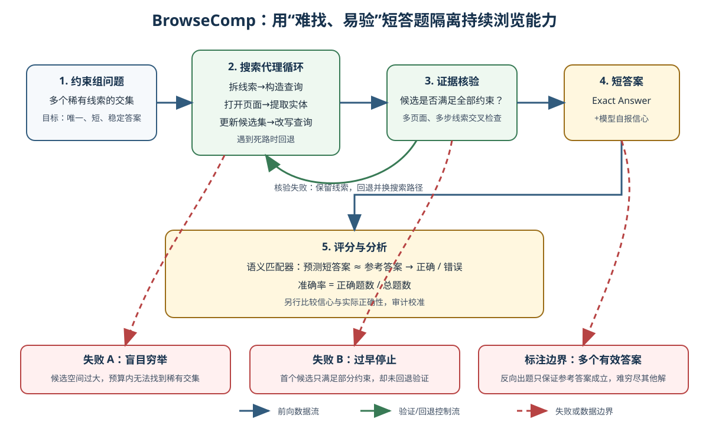

> **公开入口：** [arXiv](https://arxiv.org/abs/2504.12516) · [PDF](https://arxiv.org/pdf/2504.12516v1) · [TeX 源码包](https://export.arxiv.org/e-print/2504.12516) · [代码](https://github.com/openai/simple-evals) · [项目页](https://openai.com/index/browsecomp/)
>
> 文中的 `source/...:Lx–Ly` 对应解压后的 arXiv TeX 源码坐标；博客不镜像原论文文件。

> 论文信息：Jason Wei 等，OpenAI；2025 年 arXiv 预印本 2504.12516（`paper.pdf:p.1`）。
>
> 证据版本：上述 PDF SHA-256 `8de2e7a024b43ff7fbab29e0bb6dbdc131ad07206e6c186c2122502d69477760`；有完整 TeX 源文。
>
> 阅读提示：下文用“**论文事实**”转述作者设计和数据，用“**我们的判断**”标明机制解释。BrowseComp 是浏览 agent 基准，不是新训练方法。为避免数据泄漏，本文不转录论文表 1 的真实题目与答案；原文也明确请求不在线公开它们（`source/browsecomp.tex:L186–200`）。

## 一句话结论

BrowseComp 用 1,266 道“答案短且易核对、搜索路径却很长”的事实问题，把持续浏览、改写查询、回退和跨页面约束核验隔离出来；当时无浏览的 GPT-4o 准确率为 0.6%，GPT-4o 加浏览为 1.9%，专为持续浏览训练的 Deep Research 为 51.5%，说明“能打开网页”与“能在巨大候选空间中有策略地找到满足全部条件的信息”是两个不同能力（`source/browsecomp.tex:L410–436`）。

## 1. 基本概念

**论文事实—浏览 agent。** 目标系统能接收一个事实问题，向搜索引擎或网页发出多轮操作，读取返回内容，根据新线索调整搜索路径，最后给出简短答案。BrowseComp 主要测量的三项能力是：判断网上内容的事实性，长时间深入浏览，以及避免不可行穷举的创造性搜索（`source/browsecomp.tex:L283–296`）。

**论文事实—“反向出题”。** 标注者先找到一个人物、事件或作品作为种子，再挑选几个各自候选空间很大的特征，把它们合成问题。已知种子时，几次搜索就能验证；只看问题时，却可能需要检查上千个候选和它们的属性（`source/browsecomp.tex:L232–240`）。这就是“难找、易验”。

**论文事实—简短评分。** 每个参考答案是一个短字符串；一个 AI 评分器只判断预测的最终答案与参考答案是否语义等价（`source/browsecomp.tex:L283–286`）。回答格式还要求解释、精确答案和 0–100% 信心（`source/additional_instruction.txt:L1`）。评分 prompt 要求提取最终答案，只比较它与参考答案的实质差异，数值题允许小误差（`source/grader_template.txt:L1–18`）。

**题目难度不等于主题偏科。** 数据题材不只来自学术检索：后验主题分类中，电视与电影占 16.2%（205 题），科学技术占 13.7%（173 题），历史占 9.9%（125 题），还包含艺术、体育、音乐、游戏、地理和政治（`source/browsecomp.tex:L250–273`）。主题是一个 prompted ChatGPT 在数据完成后所分，它能描述题材覆盖，不能当作经人工验证的难度分层（同上）。

## 2. 问题：旧任务哪里不够难

### 2.1 观察到的失败

**论文事实。** TriviaQA、HotpotQA、FEVER 等许多早期信息检索基准聚焦人类在十分钟左右能找到的信息，近期模型已逐渐饱和这类任务（`source/browsecomp.tex:L181–183`; `source/browsecomp.tex:L606–614`）。只测头几次搜索是否找到显眼页面，会漏掉 agent 面对稀有、纠缠线索时的持续性和回退能力。

数据制作程序刻意制造这种失败：当时的 GPT-4o（有或无浏览）、o1 和早期 Deep Research 都不应能解题；标注者要做五次普通 Google 搜索并确认首页无现成答案；另一人原则上应无法在十分钟内解出（`source/browsecomp.tex:L223–230`）。

### 2.2 机制解释

**我们的判断。** 每个线索单独看都对应巨大候选集，真实答案是多个集合的稀有交集。有效 agent 需要把问题拆成约束，选择最能缩小空间的线索，沿搜索结果发现新实体，及时丢弃死路，并在结束前交叉验证所有条件。简单的“问题→一次查询→首个候选→答案”流程会在候选空间过大、查询形式与网页措辞不同，或首个候选只满足部分条件时失败。

这个解释还预测两种可观察轨迹。第一，成功轨迹中的查询不应只是原问题的近义复述，而应随新实体出现而转向更小的局部问题。第二，高难题上的进展常表现为候选集逐步缩小，而不是每打开一页就单调接近答案。若轨迹显示模型已有高质量改写和回退，却总在最后核验时选错，主瓶颈就更可能是证据信任与约束逻辑，而非持续性。

### 2.3 既有解法与本文的介入

**跨论文背景。** 封闭书问答依靠模型内部知识；普通检索增强生成在一两次检索后组织答案；早期工具 agent 可以多次调用搜索，但工具步数有限、不善回退。BrowseComp 不修改这些系统，它通过问题构造和短答案评分专门放大后一失败。作者将其类比为编程竞赛：对一项核心技能有用，却不代表全部真实用户需求（`source/browsecomp.tex:L203–213`; `source/browsecomp.tex:L288–296`）。

## 3. 核心机制：基准如何变成 agent 闭环

* 蓝色实线是问题到答案的前向数据流，绿色箭头是候选未通过全约束时的回退控制流，红色虚线是盲目穷举、过早停止和数据多解边界。该图是根据“反向出题”和浏览能力定义重建的原创图（`source/browsecomp.tex:L232–248`; `source/browsecomp.tex:L288–296`）。

这个闭环的“状态”不是单一段对话摘要，而应至少区分已确认约束、待核验候选、已排除候选及其反证、失败查询和未探索分支。若删掉失败查询记录，agent 会在同一措辞上反复消耗预算；若删掉反证，早期被排除的候选又可能回到最终答案。这是对机制图的可实现化解读，不是论文规定的 agent 架构。

### 3.1 最小贯穿例子

考虑一道虚构题：“找一本 2018–2020 年出版、作者曾在某岛屿大学就读、书名包含一种蓝色植物的小说。”agent 不应完整穷举三年间的所有小说。它可先判断“蓝色植物”最能缩小书名候选，搜到五本书；再查作者教育背景，剩两本；最后核对出版年。若某作者页面无教育经历，应保留候选并换查询，而不是把“未找到证据”当作“条件不成立”。日常类比是侦探从一组线索逐步排除嫌疑人；类比的边界在于网页会消失、搜索排名有偏，而且“没有搜到”不能证明“不存在”。

### 3.2 可证伪预测

**我们的预测。** 如果 BrowseComp 的主要瓶颈真是持续搜索与策略改写，那么在模型和数据不变时，增加单次 agent 的浏览工作量应平滑提升准确率，且改善应更集中在需要多轮回退的题上。论文的早期 Deep Research 数据随浏览 effort 增加，准确率从 9.1% 逐步到 52.5%，方向符合预测（`source/browsecomp.tex:L115–164`）。但 effort 的确切单位和每次搜索操作未公开，因而这是剂量—反应证据，不是对“回退”的单因素消融。若在实际浏览页面数、查询数和时间均大幅上升时准确率仍不变，先核对工具是否真访问了网页；实现无误仍无提升，才说明“搜索持续性是主瓶颈”的假设不足。

## 4. 关键公式与指标

论文没有独立的显示公式。下式是对其评分与聚合文字的形式化，用于解释，不是论文提出的新算法（原始定义见 `source/browsecomp.tex:L283–286`; `source/browsecomp.tex:L522–529`）。

$$
\mathrm{Acc}=\frac{1}{N}\sum_{i=1}^{N}\mathbf 1[\hat a_i\equiv a_i],
\qquad
\hat a^{\text{best}}=\hat a_{\arg\max_j c_j},
\qquad
\hat a^{\text{weighted}}=\arg\max_a\sum_{j=1}^{K}c_j\mathbf 1[\hat a_j\equiv a].
$$

**大白话目的。** 第一式统计题目做对的比例；第二式在多次尝试中挑自报信心最高的答案；第三式将语义相同的答案合组，再把其信心相加。**符号账本。** $N$ 是题数，全集 $N=1266$（`source/browsecomp.tex:L105–112`）；$i$ 是题目索引；$\hat a_i$ 是预测短答案；$a_i$ 是参考答案；$\equiv$ 表示语义等价；$\mathbf 1[\cdot]$ 在条件成立时为 1，否则为 0；$K$ 是并行采样数；$j$ 是采样索引；$c_j\in[0,1]$ 是第 $j$ 次自报信心。多数投票则把上式的 $c_j$ 全部设为 1。

**玩具计算。** 三次尝试输出甲（0.45）、乙（0.80）、甲（0.40）。多数投票选甲；加权投票也选甲，因为 $0.45+0.40=0.85>0.80$；best-of-N 选乙。若真值是乙，这道题上只有 best-of-N 得 1 分。论文用每题 64 个输出比较三种聚合（`source/browsecomp.tex:L522–529`）；随 $K$ 从 1 增至 64，best-of-N 曲线从 0.52 升至 0.78，加权投票到 0.70，多数投票到 0.67（`source/browsecomp.tex:L448–518`）。**边界检查。** $K=1$ 时三种方法相同；若信心与正确性完全无关，best-of-N 不会稳定受益；若所有错误采样都高信心且相同，三种聚合都会放大错误。

论文报告“Calibration Error”，并用“信心是否反映正确概率”解释校准（`source/browsecomp.tex:L438–441`），但源文未给出具体分箱、距离函数或公式。因而不应自行把表中的 91% 解释为某一标准 ECE 实现。

**排序信号与概率校准是两件事。** best-of-N 只要求同一题内正确答案常比错误答案的信心高；校准则要求所有标为 80% 信心的答案约有 80% 正确。一个模型可以把真实 30% 和 10% 的候选错报为 95% 和 90%；绝对概率很差，排序仍然正确。因此 best-of-N 提升与表中高校准误差可以同时成立，两者并不矛盾。

## 5. 实验：每组证据回答什么

| 问题 | 受控比较与范围 | 精确结果 | 证据审计 |
|---|---|---|---|
| 数据真的对人很难吗？ | 同一批标注员但不做自己出的题，不用 AI，至少尝试两小时才可放弃（`source/browsecomp.tex:L300–320`） | 1,255 道被尝试的题中，888 道放弃（70.8%），367 道解出（29.2%）；已解题中 317/367 与参考答案一致（86.4%）（`source/browsecomp.tex:L303–320`） | 有实际人类时间证据，但标注员不是调查记者等专业搜索者（`source/browsecomp.tex:L401`）。 |
| 浏览按钮本身够吗？ | GPT-4o 有/无浏览，并与推理模型和 Deep Research 比较（`source/browsecomp.tex:L406–410`） | GPT-4o 0.6%；GPT-4o+browsing 1.9%；GPT-4.5 0.9%；o1 9.9%；Deep Research 51.5%（`source/browsecomp.tex:L413–432`） | GPT-4o 的受控对照支持“只加工具不够”；跨模型差异不能全归因于浏览策略。 |
| 额外浏览计算有用吗？ | 早期 Deep Research，每个点是不同 browsing effort 的整套评测（`source/browsecomp.tex:L444–446`） | 图中从 effort 1.0 时 9.1% 到 21.8 时 52.5%，中间点整体平滑上升（`source/browsecomp.tex:L143–163`） | 强剤量—反应关系；effort 尺度未定义，难以复制精确成本。 |
| 多次采样怎样合并？ | 每题 64 次 Deep Research，多数/信心加权/best-of-N（`source/browsecomp.tex:L522–529`） | (K=64) 时约 0.67 / 0.70 / 0.78（`source/browsecomp.tex:L476–518`） | best-of-N 优势说明信心有排序信号；它不意味绝对概率校准。 |
| 错题是否真无解？ | 每题 64 次；对 Deep Research 从未答对的题，给真值再请其找证据（`source/browsecomp.tex:L597–603`） | Deep Research 对 16% 题每次都对，对 14% 每次都错；给真值后多数可找到证据（`source/browsecomp.tex:L597–601`） | 支持“发现路径比验证答案更难”，但“给真值”大幅缩小了搜索空间。 |

### 消融与证据强弱审计

论文没有对“无回退”、“无查询改写”、“固定页面数”做组件级消融；因此它证明了长程浏览系统整体更强，却没有唯一定位哪个控制流组件造成改善。并行采样比较在相同 64 个输出上只改聚合规则，是更干净的受控实验。可是 Deep Research 的 51.5% 不是纯零样本能力：论文特别说明它在专门教浏览竞赛类任务的数据上训练过（`source/browsecomp.tex:L410–432`），因而与其他模型的差距同时包含训练分布差异。

## 6. 优点

**思想。** “反向出题”利用人类已知答案的不对称，以低评分成本构造高搜索成本。**实验。** 人类用时、浏览工具对照、试时计算曲线、并行采样和题目通过率分布共同描述难度。**工程工件。** 只需问题、短参考答案和语义匹配器，比开放式长报告评分更容易批量运行。数据还从原始 1,287 题中移除了 21 道格式不匹配、措辞歧义或真值错误的题（`source/browsecomp.tex:L597–604`）。

## 7. 局限与适用边界

**论文明确承认。** 反向出题只能确保参考答案正确，不能穷尽全网以保证没有第二个合法答案；作者靠出题人领域熟悉度、增加条件和另一标注者的十分钟检查来降低风险（`source/browsecomp.tex:L242–248`）。该基准也刻意绕过真实用户问题中的长答案写作和歧义澄清（`source/browsecomp.tex:L288–296`）。它当时主要测文本网页，作者把图像、视频、音频和交互页面留给后续基准（`source/browsecomp.tex:L606–614`）。

**我们的判断。** 搜索引擎索引、网页可用性和排名会随时间改变，所以同一 agent 的分数不完全是固定模型属性。“给出正确短字符串”不检查搜索证据链是否可追溯，也不惩罚侥幸命中。校准误差未给公式是一个重要复现缺口；表中 GPT-4o 为 69%、带浏览为 82%、Deep Research 为 91%（`source/browsecomp.tex:L413–427`），但不知道实现时不能对这些值做精确重现或跨论文比较。

## 8. 复现路线

1. 从公开工件读取 1,266 道加密样本，记录数据版本哈希；不将解密的题目或答案写入日志、报告或 prompt 缓存。
2. 锁定模型版本、搜索 API、地理位置、日期、每题时间上限、最大查询数、最大打开页面数和并发数。缺少这些条件时，“更多试时计算”无法被别人精确重现。
3. 按附录格式输出 Explanation、Exact Answer 和 Confidence，再使用本地 `grader_template.txt` 做语义匹配。人工抽查一批判分，尤其检查别名、数值误差和多解。
4. 主结果报准确率，并另报平均查询数、页面数、墙钟时间、放弃率和错误类型。若报校准误差，必须先明确写出分箱和公式，不要猜测论文未披露的实现。
5. 做最小机制实验：在相同总页面预算下，对照“允许回退+查询改写”和“固定一次查询后顺序打开”。这个比较才能直接检验本文提出的机制性解释。

## 9. 自解释问题

1. 如果你已知参考答案，为什么这道题会从“难搜索”变成“易验证”？候选空间改变了什么？
2. 在总页面数相同时，哪个实验能区分“看得多”和“查询改写更好”？
3. 为什么绝对信心校准很差的模型，best-of-N 仍可能有效？这要求信心保留哪种顺序信息？
4. 删掉答案证据链只评短字符串，会让哪些侥幸策略得利？
5. 如果一题有两个真正合法答案，语义匹配器和数据标注各应如何改造？

## 10. 证据定位

- 任务动机、数据规模与设计目标：`source/browsecomp.tex:L174–213`。
- 数据制作、反向出题、多解风险和主题分布：`source/browsecomp.tex:L217–280`。
- 评分与所测能力：`source/browsecomp.tex:L283–296`; `source/grader_template.txt:L1–18`。
- 人类实验：`source/browsecomp.tex:L300–401`。
- 模型准确率、校准和试时计算：`source/browsecomp.tex:L406–518`。
- 并行聚合、通过率与数据清理：`source/browsecomp.tex:L522–604`。
