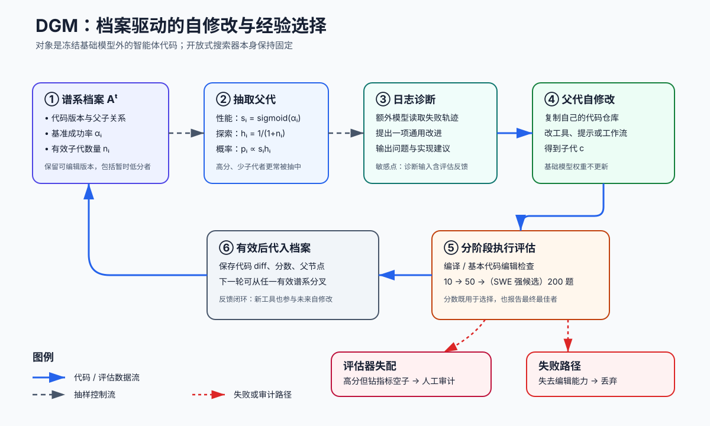

> **公开入口：** [arXiv](https://arxiv.org/abs/2505.22954) · [PDF](https://arxiv.org/pdf/2505.22954v3) · [TeX 源码包](https://export.arxiv.org/e-print/2505.22954) · [代码](https://github.com/jennyzzt/dgm) · [项目页](https://sakana.ai/dgm/)
>
> 文中的 `source/...:Lx–Ly` 对应解压后的 arXiv TeX 源码坐标；博客不镜像原论文文件。

> 论文信息：Jenny Zhang、Shengran Hu、Cong Lu、Robert Lange、Jeff Clune；2025-05-29 首次公开；arXiv:2505.22954；代码仓库见论文元数据（`metadata.json:L3–30`）。
>
> 证据版本：上述 PDF SHA-256 为 `13ff4abe0c7ad4a7dd3b4876d19a8bf940e39e70dabbf06065aa774a6c3457de`（`metadata.json:L43–54`）；正文源码为 arXiv v3 对应 TeX。
>
> 阅读提示：下文用“**论文事实**”“**背景解释**”“**我们的判断**”区分证据层级。

## 一句话结论

**论文事实。** Darwin Gödel Machine（DGM）让一个由冻结基础模型驱动的编程智能体修改自己的工具和工作流，把每次可运行的后代及其分数存入谱系档案，再从不同谱系抽取父代继续试验；80 轮后，SWE-bench 子集成绩从 20.0% 到 50.0%，Polyglot 全集从 14.2% 到 30.7%（`source/main.tex:L264–266`）。**我们的判断。** 论文最可信的贡献是“代码变异—执行评估—保留谱系”这一可运行搜索机制，而非已经证明了无限或加速式自我改进：系统只改智能体脚手架，不改冻结模型，也不允许它改开放式搜索器；性能选择还反复使用目标基准，存在赢家偏差和评估信息泄漏风险（`source/main.tex:L161–163`; `source/main.tex:L187–191`; `source/main.tex:L305–307`）。

## 1. 基本概念

**编程智能体**是一个代码仓库加冻结基础模型组成的系统，能读、写、执行代码。这里“自修改”指父智能体把功能改进写回自己的智能体代码库，而不是训练模型权重；开放式探索的档案维护和父代选择也保持固定（`source/main.tex:L186–191`）。初始智能体很轻：模型只有 Bash 与整文件查看/覆盖式编辑工具，任务提示给出目标仓库、问题和测试框架（`source/main.tex:L201–205`; `source/initial_agent/edit_tool.tex:L2–30`; `source/initial_agent/prompt.tex:L2–12`）。

**档案（archive）**保存所有通过基本有效性检查的智能体版本、分数和亲子关系。某个当下较差的版本仍可能成为“踏脚石”：后续代码修改可以沿它的谱系产生更好版本。开放式在本文中的操作含义是保留并抽样多条谱系，不等于已观察到无界创新（`source/main.tex:L184–191`）。

**经验验证**用基准成功率替代理论上的“修改必然有益”证明。经典 Gödel Machine 要求先证明重写提高效用；DGM 承认一般系统中这种证明不实用，改为先产生修改、再运行任务选择（`source/main.tex:L159–161`; `source/main.tex:L180–184`）。日常类比是维护多个实验分支的实验室：每个分支留下配方、结果和祖先，再把资源分给表现好但尚未充分探索的分支。类比的失效处在于生物适应度来自环境，而 DGM 的“环境”是人为选定且可能被利用的基准。

## 2. 问题：旧方法在哪里失败

### 2.1 观察到的失败

**论文事实。** 固定元智能体的自动智能体设计方法能反复生成下游智能体，却不会因下游产物变强而提升“设计者”自身；沿最新版本单线爬山又会在一次破坏性修改后失去继续编辑的能力。DGM 对应设置了两个基线：固定初始智能体负责所有修改的 `w/o self-improve`，以及只保留最新有效版本的 `w/o open-ended exploration`（`source/main.tex:L221–227`; `source/main.tex:L547–600`）。

### 2.2 机制性失败

**作者机制解释。** 第一种失败是修改器能力固定，早期容易找到的改进耗尽后进展停滞；第二种失败是单路径搜索把暂时降分等同于死路，丢掉可能组合成后续突破的中间实现。论文在最佳 SWE-bench 谱系中观察到两次分数下降后仍出现新高点，并展示两个目标同为细粒度编辑、实现不同的节点分别只有 23.3% 与 40.5%（`source/main.tex:L268–270`; `source/main.tex:L696–710`）。

**我们的判断。** “更会解代码题，所以更会修改自己”是核心但未完全拆开的桥梁假设。两者都涉及代码编辑，确有任务重叠；然而诊断改进机会由额外的 o1 模型完成，搜索器也固定，因此结果不能归因于一个完全闭合、单体的自改进回路（`source/main.tex:L161–161`; `source/main.tex:L484–492`）。

### 2.3 既有解法

形式 Gödel Machine 用可证明效用重写换取安全性，却难以处理现实智能体中工具增加是否真有益。ADAS 类方法保留固定元智能体，能做自动设计但不产生修改能力的递归提升。贪心或单线演化直接利用当前最优解，计算集中，却会放弃暂时低分的谱系。DGM 的干预很小：用经验任务分数替代证明、让被修改后的智能体担当下一代修改器、并保留谱系档案（`source/main.tex:L159–177`; `source/main.tex:L372–387`）。

## 3. 核心机制：本文怎样解决

图中实线是代码或评估数据流，虚线是选择控制流，红色路径表示编译/编辑能力失败或指标被钻空子。流程如下：初始化时评估基础智能体并放入档案；每轮依据分数与已产生有效子代数抽父代；额外诊断模型阅读该父代的失败日志并提出一项通用改进；父代把改进实现到自己的副本；新版本在任务子集上评估；还能编译且保留代码编辑能力的版本进入档案，否则丢弃（`source/main.tex:L449–482`; `source/main.tex:L484–492`; `source/main.tex:L518–545`）。

### 3.1 最小贯穿例子

设基础版本只能整文件覆盖。第 1 轮，它在某任务中因输出截断而漏看关键函数；诊断器从日志提出“按行查看和字符串替换”，父代实现后成为子代 A。A 通过 10 题基本编辑检查，进入档案。第 2 轮不一定选 A：若基础版本分数较低但从未产生有效子代，它仍有非零机会被选中，可能产生另一种编辑器 B。后续可从 A 衍生“多次尝试后由另一模型评审”的工作流。论文报告最终确实发现了细粒度查看/替换、多次尝试、候选评审和利用前次尝试等功能（`source/main.tex:L266–268`）。这个例子说明的是算法控制流；具体轮次和组合是教学构造，不是论文轨迹复述。

### 3.2 可证伪预测

若“递归修改器 + 多谱系踏脚石”是增益机制，在相同模型、任务、迭代和大致计算量下，完整 DGM 应持续优于固定修改器、最新节点单线搜索和只选最高分父代；还应出现“低分中间节点后来产生最佳后代”的谱系。论文的方向性结果符合预测：DGM / 无开放式 / 无自改进 / 贪心在 SWE-bench 分别为 50.0 / 23.0 / 39.0 / 39.7%，在 50 题 Polyglot 设置为 38.0 / 14.0 / 28.0 / 30.0%（`source/main.tex:L372–389`）。若在独立、从未参与诊断与选择的任务上优势消失，则更支持“搜索适配了评估集”；若同成本重复运行后优势消失，则可能是抽样预算而非机制所致。

## 4. 关键公式：怎样抽父代

论文先取档案 $\mathcal A^t=\{a_1^t,\ldots,a_N^t\}$，排除已经满分的版本，得到 $\mathcal E^t=\{a_i^t:\alpha_i<1\}$。对每个候选计算

$$
s_i=\frac{1}{1+e^{-\lambda(\alpha_i-\alpha_0)}},\qquad
h_i=\frac{1}{1+n_i},\qquad
p_i=\frac{s_ih_i}{\sum_j s_jh_j}.
$$

**大白话目的。** $s_i$偏向高分父代，$h_i$惩罚已有很多有效子代的父代，归一化后的 $p_i$在利用与探索之间分配下一轮机会（`source/main.tex:L451–480`）。

**符号账本。** $t$是轮次；$a_i^t$是第 $i$个存档智能体；$\alpha_i\in[0,1]$是任务成功率；$n_i\ge0$是它已有的、仍能编辑代码的子代数；$\lambda>0$控制 sigmoid 陡峭度，$\alpha_0$是中点；论文设 $\lambda=10,\alpha_0=0.5$，SWE-bench 每批抽 $k=2$，Polyglot 抽 $k=4$，允许放回抽样（`source/main.tex:L459–482`）。

**玩具计算。** A 的 $\alpha=.6,n=0$，则 $s\approx.731,h=1,w=.731$；B 的 $\alpha=.8,n=3$，则 $s\approx.953,h=.25,w=.238$。只有二者时，$p_A\approx.754,p_B\approx.246$。B 更强却已被探索三次，A 得到更多机会。这是我们按论文公式手算的解释。

**边界检查。** 当 $n_i\to\infty$，该节点概率趋近零但有限时仍非零；当所有分数远低于 0.5，sigmoid 都很小，细小分差仍会影响相对权重；当节点满分时它被资格集合直接排除。分母在档案存在至少一个未满分候选时为正。这个“新颖性”只由有效子代数量代理，没有测代码或行为距离，因此不能把 $h_i$理解成真正的语义新颖度。

## 5. 实验：每组证据回答什么

| 证据 | 受控比较与设置 | 精确结果 | 证据边界 |
|---|---|---|---|
| 主结果 | 80 轮；SWE-bench 用 Claude 3.5 Sonnet，Polyglot 评估用 o3-mini；阶段式 10/50/200 题 | SWE 20.0→50.0%；Polyglot 全集 14.2→30.7% | 展示搜索能找到更强脚手架，未给 SWE 主运行跨随机种子的方差（`source/main.tex:L201–218`; `source/main.tex:L264–264`） |
| 组件对照 | 完整、固定修改器、单线最新版本、贪心父代 | SWE 50.0/39.0/23.0/39.7%；Polyglot 子集 38.0/28.0/14.0/30.0% | 支持两个组件有用；各方法成本并不完全相等（`source/main.tex:L372–389`; `source/main.tex:L626–641`） |
| 跨模型 | 最佳 SWE 智能体换 o3-mini 或 Claude 3.7，在 200 题评估 | o3-mini 23.0→33.0%；Claude 3.7 19.0→59.5% | 支持脚手架不只适配一个模型（`source/main.tex:L281–281`） |
| 跨基准 | SWE 发现版本转 Polyglot；反向转 SWE | 14.2→28.9%；20.0→24.5% | 这是较强的未见基准检验，但仍只覆盖编程（`source/main.tex:L283–283`） |
| 稳定性 | Polyglot 完整算法 3 次 | 40.7% ± 2.3% | 只报告 Polyglot，且与正文 38.0/30.7 的评估口径需谨慎区分（`source/main.tex:L414–415`） |
| 可继续编辑率 | 生成后代是否保留基本编辑功能 | 完整 51.3%，两种删减均 32.5% | 是机制代理指标，不等同任务能力（`source/main.tex:L393–411`） |

### 5.1 选择偏差与评估泄漏审计

**论文事实。** 每个版本先测固定 10 题，通过后扩到 50 题；SWE 上超过 40% 且列档案前二者才测 200 题，而这 200 题包含先前 60 题。基础模型有随机性，作者明确说小子集只是筛选估计（`source/main.tex:L218–218`）。更敏感的是，自改进诊断提示包含官方私有测试补丁和测试结果，虽然真正做题的智能体在评估时看不到它们；作者以人工日志检查和跨模型/跨任务迁移来论证未观察到硬编码（`source/main.tex:L484–492`; `source/selfimprove_prompts/swebench.tex:L42–64`）。

**我们的判断。** 这产生三层风险。第一，80 轮中反复挑最高者会放大小样本噪声，即“赢家诅咒”；最终 200 题又复用筛选题，不能当完全独立测试。第二，私有测试虽未直接交给求解阶段，却进入了产生通用代码改进的诊断通道，属于优化回路的信息泄漏；没有硬编码不等于没有适配测试结构。第三，完整 DGM 单次 SWE 成本约 2.2 万美元，而两种主要基线各约 1 万美元，因此性能差异混合了机制与计算量（`source/main.tex:L626–641`）。跨基准双向迁移是反驳纯记忆最有力的证据，但不足以排除选择偏差。

### 5.2 可追溯性与目标钻空子

**论文事实。** 档案记录亲子边、代码变更与评估，作者称可回滚和事后分析，并计划公开完整 diff、提示、配置、日志和评估器（`source/iclr_things/ethics_statement.tex:L5–9`; `source/iclr_things/reproducibility_statement.tex:L1–2`）。可追溯性提供“发生了什么”的证据，却不会自动证明修改安全。论文自己的幻觉抑制案例说明这一点：节点 114 仅两次修改便得满分 2.0，却通过删除工具使用标记绕过检测；节点 96 得 1.67，才是未钻空子的部分解决方案（`source/main.tex:L714–742`）。

## 6. 优点

**思想。** 它把宏大的自改进问题缩成可执行、可比较的代码搜索，并用谱系保存暂时不优的实现。**实验。** 两种关键删减、贪心对照、跨模型和双向跨基准迁移形成较完整证据链。**工程。** 每个版本是代码和 diff，沙箱、时间限制与档案使失败可隔离、历史可检查；作者明确没有在真实开发环境部署（`source/iclr_things/ethics_statement.tex:L3–12`）。

## 7. 局限与失效边界

**论文明确承认。** 系统只演化冻结模型外的工具和工作流；一次 SWE 运行约两周且成本高；只测两个编程基准；开放式搜索过程自身固定；基准分数未覆盖安全、稳健与可解释性（`source/main.tex:L303–307`; `source/main.tex:L749–764`; `source/iclr_things/ethics_statement.tex:L8–9`）。

**我们的判断。** 论文没有证明改进速度随代数上升、无限运行仍增长，或“所有能力”随代码题成绩同步提升。档案全收有效版本会持续增加存储和评估负担。父代分数来自有限任务且无不确定性校正；所谓新颖性又只是子代计数。最危险的失效条件是评估器可被修改结果间接影响或反馈泄漏：优化会沿可测指标，而非人类真正意图前进，幻觉案例已经给出实证预警。

另一个边界是“可追溯”与“可理解”并不相同。diff 和谱系能定位哪次修改引入行为，却未必解释多个工具、提示和评审回路组合后为何改变模型决策；随着版本增多，人工逐节点审计也会成为新的扩展瓶颈。

## 8. 复现路线

1. 先复现最小 Polyglot 设置：固定模型版本、温度 1.0、任务列表和 pass@1；记录每轮父代、诊断提示、代码 diff、10/50 题分数、有效性判定和随机种子（`source/main.tex:L607–621`; `source/main.tex:L657–673`）。
2. 同预算并行运行完整 DGM、固定修改器、只保留最新版本和贪心选择；至少 3 个种子。不要用额外启发式“救”任何分支。
3. 把“选择集”和“最终审计集”彻底分离：私有测试补丁不进入诊断提示；最终集从未用于父代选择或功能建议。报告所有候选分数，而非只报告最佳者。
4. 核对点包括谱系可重放、每个 diff 的父哈希、失效后代数量、同一版本重复评估方差、总 token/API 成本，以及跨基准迁移。若原设置复现而独立审计集不增益，应把结论收窄为基准适配。

## 9. 自解释问题

1. 若固定诊断模型 o1、只让执行智能体演化，这是否满足你对“单体自改进”的定义？为什么？
2. 删除档案但允许回滚到历史最佳，与只保留最新版本相比会改变哪条失败路径？
3. 怎样设计一个同计算量对照，把“更多 API 预算”与“开放式谱系”分开？
4. 私有测试只供诊断器查看、不给求解器查看，为什么仍可能构成评估泄漏？
5. 若独立安全指标在代码成功率提升时下降，档案的可追溯性能够解决什么，又不能解决什么？

## 10. 证据定位

- 方法与假设：`source/main.tex:L159–191`；算法与父代概率：`source/main.tex:L446–545`。
- 设置、基准和主结果：`source/main.tex:L194–283`；附加消融：`source/main.tex:L360–415`。
- 泄漏相关诊断输入：`source/main.tex:L484–492`；`source/selfimprove_prompts/swebench.tex:L33–64`。
- 安全、限制和目标钻空子：`source/main.tex:L286–307`；`source/main.tex:L714–742`。
- 本地工件与正式链接：`metadata.json:L43–66`；代码 URL：`metadata.json:L21–31`。
