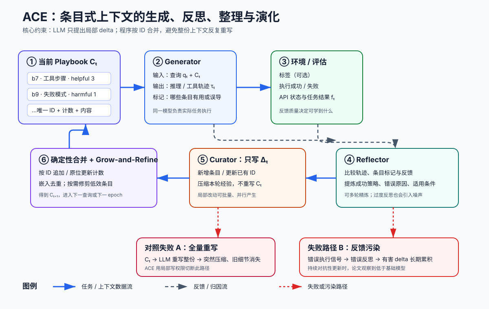

> **公开入口：** [arXiv](https://arxiv.org/abs/2510.04618) · [PDF](https://arxiv.org/pdf/2510.04618v3) · [TeX 源码包](https://export.arxiv.org/e-print/2510.04618) · [代码](https://github.com/ace-agent/ace) · [项目页](https://ace-agent.github.io/)
>
> 文中的 `source/...:Lx–Ly` 对应解压后的 arXiv TeX 源码坐标；博客不镜像原论文文件。

> 论文信息：Qizheng Zhang、Changran Hu 等 13 位作者；2025-10-06 首次公开；ICLR 2026；arXiv:2510.04618；代码与项目页见本地元数据（`metadata.json:L3–41`）。
>
> 证据版本：上述 PDF SHA-256 为 `51050ced82df75c143b151262d5af8763916968ca50374bd8ff778f40552b0ad`（`metadata.json:L52–63`）；讲解依据 arXiv v3 对应 TeX。
>
> 阅读提示：下文明确标出“**论文事实**”“**背景解释**”“**我们的判断**”。

## 一句话结论

**论文事实。** ACE 不更新模型权重，而把系统提示或智能体记忆表示成带标识符、效用计数和内容的条目式 playbook；生成器执行任务，反思器从轨迹与反馈提炼经验，整理器只产生局部增量，再由确定性程序合并与去重。它在 AppWorld、金融、医疗和 Text-to-SQL 上优于多种提示/记忆基线，且增量更新消融显示这是防止上下文坍塌的关键组件（`source/sections/design_CR.tex:L4–25`; `source/sections/design_CR.tex:L27–51`; `source/sections/extended_results_CR.tex:L471–505`）。**我们的判断。** 证据支持“细粒度、追加式上下文适配在知识密集或工具密集任务上有效”，尚不能推出上下文越长越好或智能体能可靠自主学习：没有高质量标签或执行反馈时，错误经验会污染上下文；在线结果还依赖测试样本顺序和先前测试经验（`source/sections/results_CR.tex:L33–36`; `source/sections/results_CR.tex:L158–165`; `source/sections/limitations_CR.tex:L10–16`）。

## 1. 基本概念

**上下文适配**指在推理输入中增删指令、策略、示例或事实，而不改变模型参数。它可以离线进行——在训练样本上构造一个固定系统提示，再到测试集评估；也可以在线进行——先用当前上下文预测一个测试样本，再根据该样本更新上下文，服务下一个样本（`source/sections/background_CR.tex:L3–12`; `source/sections/results_CR.tex:L28–36`）。

**Playbook 条目**是一小块可复用知识，例如工具调用步骤、领域概念或常见失败模式。每条包含唯一 ID、被标为有用/有害的计数，以及正文内容。生成器在解题时标记哪些条目有帮助或误导，后续反思据此修正（`source/sections/design_CR.tex:L27–37`）。

**增量上下文（delta context）**是本轮新增或修改的少量条目。整理器不重写整个 playbook；轻量、非 LLM 的确定性逻辑把新 ID 追加、把旧 ID 原位更新，并用语义嵌入去重（`source/sections/design_CR.tex:L21–24`; `source/sections/design_CR.tex:L39–49`）。

日常类比是团队故障手册：工程师完成工单，复盘者抽取经验，编辑只新增或修订对应卡片，不让模型每晚重写整本手册。类比的失效处是人类编辑能核验因果与矛盾，而 ACE 的反思器仍是可能犯错的语言模型；“结构化”不会自动保证条目真实。

## 2. 问题：旧方法在哪里失败

### 2.1 观察到的失败

**论文事实。** 旧式提示优化常偏向短而通用的指令，遗漏具体领域规则、工具用法和失败模式，作者称为 **brevity bias（简短偏置）**。另一类方法让 LLM 每轮把累积记忆整体重写；AppWorld 案例中，第 60 步上下文有 18,282 token、准确率 66.7，下一步骤然缩到 122 token、准确率降至 57.1，低于不适配基线的 63.7，作者称为 **context collapse（上下文坍塌）**（`source/sections/background_CR.tex:L14–21`; `source/sections/background_CR.tex:L30–34`）。

### 2.2 机制解释

**作者机制解释。** 全量重写把保存旧知识、解释新轨迹、筛选新经验和组织文本都交给一次生成。随着文本增长，模型倾向压缩，早期细节会突然消失；短提示优化又把简洁本身当成有利表征。知识密集任务需要大量边界条件，压缩会直接删掉未来任务所需的稀有规则（`source/sections/introduction_CR.tex:L19–29`; `source/sections/appendix_CR.tex:L18–29`）。

**我们的判断。** ACE 的关键干预不是笼统的“多智能体”，而是限制写权限：反思器只提出经验，整理器只写 delta，确定性合并器保留未触及条目。这个结构把一次高风险的全量生成改成可定位的小编辑。它降低灾难性遗忘概率，却引入另一种失败：许多局部正确但彼此矛盾或过时的条目可能长期累积。

### 2.3 既有解法

ICL 把示例直接放入提示，简单但受窗口限制；MIPROv2 联合优化指令和示例；GEPA 根据执行轨迹反思并演化完整提示，用 Pareto 前沿缓解局部最优；Dynamic Cheatsheet（DC）在线积累策略，但 cumulative 模式会整体重写记忆（`source/sections/results_CR.tex:L38–59`）。ACE 与 GEPA 的区别是长期保留许多细粒度规则而非选择一个完整提示；与 DC 的区别是条目级 delta 和确定性合并，而非每步重写整份 cheatsheet（`source/sections/appendix_CR.tex:L18–46`）。

## 3. 核心机制：上下文怎样演化

一次更新包含五步。① 当前 playbook 与新查询进入生成器。② 生成器输出推理/工具轨迹和答案，并标记用到或受误导的条目。③ 环境返回标签、执行成败或其他自然反馈。④ 反思器比较轨迹和反馈，最多迭代提炼具体经验。⑤ 整理器把经验变成新增、更新或删除候选；程序按 ID 合并，语义去重，并在每轮或窗口超限时整理。多个 delta 可并行合并，同一查询也可跨 epoch 重访（`source/sections/design_CR.tex:L16–25`; `source/sections/design_CR.tex:L30–51`）。

### 3.1 最小贯穿例子

假设 AppWorld 查询要求“找出三封带附件的未读邮件并保存附件”。旧 playbook 有条目 `b7：搜索未读邮件`，却没写分页。生成器只处理第一页，执行反馈显示目标数不足。反思器提炼“邮件搜索可能分页；持续请求 next_page_token 直到为空”。整理器新建 `b12`，合并器追加它。下一查询中，生成器引用 `b7+b12` 完成分页；两条都被标为有用，计数增加。若后来发现某 API 一次返回全部结果，整理器应更新适用条件，而非删除分页知识。这个流程是依据论文组件构造的教学例子，不是论文披露的真实轨迹。

### 3.2 可证伪预测

若坍塌来自全量重写，那么在相同生成器、数据和大致反思预算下，**条目式增量合并**应比“每轮重写整份上下文”保留更多旧规则，并在长序列后取得更高任务完成率；把 delta 机制拿掉应明显退化。论文的直接消融符合预测：AppWorld test-normal 上，无增量更新的 TGC/SGC/均值为 67.3/46.4/56.9，有增量更新为 76.2/64.3/70.3，不适配 ReAct 为 63.7/42.9/53.3（`source/sections/extended_results_CR.tex:L471–505`）。若独立控制上下文长度后差异消失，增益可能来自“更多 token”而非防坍塌；若条目留存率提高但准确率不升，则机制保住了信息，却未保住有用信息。

## 4. 关键算法：条目状态转移

论文没有给出显示公式。为便于重建，可把其文字算法记成下面的**解释性记号**，不是作者新增目标函数：

$$
\tau_t=G(q_t,C_t),\quad r_t=R(q_t,\tau_t,f_t,C_t),\quad
\Delta_t=U(r_t),\quad C_{t+1}=D(\operatorname{merge}(C_t,\Delta_t)).
$$

**大白话目的。** 用当前手册 $C_t$ 解查询 $q_t$，得到轨迹 $\tau_t$；根据反馈 $f_t$ 反思成经验 $r_t$；整理器 $U$ 输出少量条目改动 $\Delta_t$；合并器按 ID 更新，再由去重/修剪函数 $D$ 得到下一版手册。论文对三角色和确定性合并的定义见 `source/sections/design_CR.tex:L4–7` 与 `source/sections/design_CR.tex:L21–24`。

**符号账本。** $G,R,U$分别是 Generator、Reflector、Curator；$q_t$是一条样本；$f_t$可为真值、代码执行结果或环境信号；$C_t$是结构化条目集合；$\Delta_t$含新 ID 或已有 ID 的局部修改。默认实验三角色用同一个 DeepSeek-V3.1 非思考模式，batch size 为 1，反思轮次与离线 epoch 上限均为 5（`source/sections/results_CR.tex:L61–67`）。

**玩具计算。** 若 $C_t=\{b7(h=2,d=0),b9(h=1,d=2)\}$，括号为 helpful/harmful 计数；本轮 delta 为“更新 b7：helpful +1”“新增 b12：分页规则”，则合并后成为 $\{b7(3,0),b9(1,2),b12(0,0)\}$。若 b12 与已有条目嵌入相似度超过阈值，去重器合并二者。数值仅用于解释数据结构；论文只说明计数、ID、嵌入去重和 50/70/90% 阈值敏感性，没有公开这里的具体记录（`source/sections/design_CR.tex:L30–37`; `source/sections/extended_results_CR.tex:L538–561`）。

**边界检查。** $\Delta_t=\varnothing$ 时上下文不变；错误 delta 会污染后续所有查询；不断追加会触及窗口，因此可每次整理或窗口超限再整理。论文在 FiNER 上把修剪触发长度设为 10K/50K/100K token，准确率为 78.6/78.4/78.3，说明该区间不敏感，却不能保证无限增长稳定（`source/sections/design_CR.tex:L43–49`; `source/sections/extended_results_CR.tex:L564–587`）。

## 5. 实验：每组证据回答什么

实验覆盖 AppWorld 智能体、金融 FiNER/Formula、医疗 DDXPlus 和 BIRD-SQL。AppWorld 报 test-normal/test-challenge 的 Task Goal Completion（TGC）和 Scenario Goal Completion（SGC）；FiNER、Formula、DDXPlus 用精确匹配准确率，BIRD-SQL 用 GPT-4o-mini 评审。离线在训练集适配、测试集 pass@1；在线按同一打乱顺序逐个预测测试样本，预测后再更新（`source/sections/results_CR.tex:L11–36`）。

| 主张 | 受控比较 | 精确结果 | 审计判断 |
|---|---|---|---|
| AppWorld 效果 | DeepSeek-V3.1 + 官方 ReAct；离线有标签 | ReAct 42.4，ICL 46.0，GEPA 46.4，ACE 59.4 平均分 | 同框架比较较强；未报告多随机种子误差（`source/sections/results_CR.tex:L71–105`） |
| 无标签适配 | ACE 不给 Reflector 真值 | 离线 57.2，在线 59.5；均高于 ReAct 42.4 | AppWorld 有执行信号，不能推广为“无反馈学习”（`source/sections/results_CR.tex:L92–113`） |
| 金融 | FiNER + Formula，离线有标签 | Base 69.1，GEPA 72.5，ACE 81.9 平均 | 支持知识密集任务；无可靠反馈时在线 FiNER 可由 70.7 降至 67.3（`source/sections/results_CR.tex:L122–165`） |
| 额外领域 | 1000 个训练样本离线适配 | DDXPlus 75.2→90.2；BIRD-SQL 平均 47.8→52.9 | 扩展到两个领域，但仍是单一骨干与单次汇总（`source/sections/extended_results_CR.tex:L208–267`） |
| 角色/训练过程 | 去反思器与多 epoch、只去 multi-epoch、完整 ACE | AppWorld 平均 55.1、56.8、59.4 | 支持反思与多轮有贡献，但组合消融未完全正交（`source/sections/results_CR.tex:L183–240`） |
| 反思噪声 | FiNER 注入有害反思 | 无干扰 78.3；每 5 步 76.1；每步 66.7，低于 Base 70.7 | 清楚显示持续错误反馈的失效边界（`source/sections/extended_results_CR.tex:L405–468`） |

### 5.1 上下文演化机制审计

**有力证据。** 增量更新是最直接的机制消融，平均分从 56.9 升到 70.3；反思轮数 1/3/5/10 时 AppWorld test-normal 均值为 61.3/65.8/67.6/65.2，呈现“反思不足”和“过度反思”两端退化（`source/sections/extended_results_CR.tex:L493–500`; `source/sections/extended_results_CR.tex:L511–535`）。这比仅展示完整系统胜过基线更接近因果检验。

**仍缺的对照。** 无增量版本是否与完整版本严格匹配上下文长度、token 和调用次数，正文没有交代。也没有独立报告旧条目的留存率、矛盾率或错误条目寿命。因此“准确率提升来自避免坍塌”合理但非唯一解释；结构化格式、额外 token 和不同生成约束都可能贡献。

### 5.2 在线学习与反馈污染

**论文事实。** 在线协议在测试集上先预测、再用该样本更新，所有方法使用相同的打乱顺序（`source/sections/results_CR.tex:L33–36`）。**我们的判断。** 这测量的是顺序式部署收益，不是每个测试样本相互独立的静态泛化；后面的样本使用了前面测试样本的经验，结果会依赖顺序和分布重复。公平比较要求公开顺序并用多个排列报告均值。没有真值也不等于没有监督：AppWorld 的执行成功/失败仍是任务相关反馈。金融任务缺少可靠信号时 ACE 与 DC 都会退化，正好证伪了“只靠模型自我反思即可稳定进步”的强版本（`source/sections/results_CR.tex:L112–114`; `source/sections/results_CR.tex:L162–165`）。

### 5.3 成本证据

主文报告：AppWorld 离线 ACE 相对 GEPA 延迟 53,898→9,517 秒、rollout 1,434→357；FiNER 在线相对 DC 延迟 65,104→5,503 秒、token 美元成本 17.7→2.9（`source/sections/results_CR.tex:L246–292`）。细粒度 AppWorld 分析使用 ACE 1 epoch、1 次反思，而主实验上限为 5；该分析中适配输入/输出 token 比 GEPA 少 80.8%/83.6%，但 ACE rollout 是 2,075、GEPA 是 1,455，即多 42.6%（`source/sections/extended_results_CR.tex:L269–305`）。评估阶段 ACE 原始输入 token 又比 GEPA 多 117.4%；作者以 91.8% cache 命中和计费输入成本下降 82.6%说明复用可摊薄开销（`source/sections/extended_results_CR.tex:L281–284`; `source/sections/extended_results_CR.tex:L350–400`）。因此“更便宜”成立于特定平台、缓存和核算边界，不应简化为所有调用量都更少。

## 6. 优点

**思想。** 把上下文从一段不可定位的文本变成可追踪条目，并分离执行、归因和写入，直接对准坍塌机制。**实验。** 同时覆盖离线/在线、标签/无标签、四类任务、多种骨干，并提供增量、反思、epoch、噪声、去重阈值和修剪长度分析（`source/sections/extended_results_CR.tex:L4–13`; `source/sections/extended_results_CR.tex:L405–587`）。**工程。** delta 可并行合并，ID 和计数方便追踪帮助/伤害与定点删除；上下文可读也使人工审计和选择性遗忘比权重更新直接（`source/sections/design_CR.tex:L21–41`; `source/sections/limitations_CR.tex:L4–8`）。

## 7. 局限与失效边界

**论文明确承认。** ACE 依赖足够强的反思器；缺少可靠反馈时上下文可变得有害；简单策略固定的 Game of 24 或偏高层检索策略的 HotPotQA 未必需要长 playbook（`source/sections/limitations_CR.tex:L10–16`）。

**我们的判断。** 增量写入把“突然遗忘”换成“缓慢污染”：错误、冲突和过时规则可能积累，嵌入相似度去重也不等于逻辑一致性。在线平均分可能受测试顺序和任务重复性影响。长上下文的实际延迟、显存和价格依赖服务端 KV 缓存；隐私删除虽因条目可读而方便，仍需验证副本、日志和缓存是否同步清除。论文展示任务表现，没有测条目事实正确率、审计者一致性或长期分布漂移后的恢复。

## 8. 复现路线

1. 先在 AppWorld test-normal 复现三组：ReAct、ACE 全量重写、ACE delta；固定 DeepSeek-V3.1、同一提示、batch size 1、一次 epoch 和一次反思，匹配总 token/调用预算。
2. 保存每个 $C_t,\Delta_t$、条目 ID、helpful/harmful 计数、反馈来源、合并决定和语义相似度。除 TGC/SGC 外，测旧条目留存率、矛盾率、无效条目比例和上下文长度。
3. 离线测试集保持完全隔离；在线实验至少用 5 个公开随机顺序，分别报告前段与后段成绩，以区分即时能力和跨样本学习。
4. 注入频率可控的错误反馈，复核“每 5/10/25 步”曲线。若 delta 仍保留信息却不能抵御错误，结论应是防遗忘而非防污染。
5. 成本同时报告原始 token、缓存 token、LLM 调用、rollout、墙钟时间和不含/包含评估的总价，避免只选有利口径。

## 9. 自解释问题

1. 若删掉 Reflector、让 Curator直接读轨迹，会丢失哪种职责隔离？现有消融能否单独回答？
2. 为什么条目从未被删除不等于知识被“保真”保存？
3. 在线测试顺序怎样造成后半段样本更容易？什么排列实验可以识别这种效应？
4. 若把完整 ACE 与等长随机规则上下文比较，能排除哪一种替代解释？
5. 对同一句话语义相似但适用条件相反的两条规则，嵌入去重可能怎样失败？

## 10. 证据定位

- 问题与坍塌案例：`source/sections/background_CR.tex:L14–34`。
- 三角色、delta 与 grow-and-refine：`source/sections/design_CR.tex:L4–51`。
- 数据、协议与主表：`source/sections/results_CR.tex:L11–165`。
- 增量与反思质量消融：`source/sections/extended_results_CR.tex:L405–505`。
- 成本口径：`source/sections/results_CR.tex:L246–305`；`source/sections/extended_results_CR.tex:L269–400`。
- 论文限制：`source/sections/limitations_CR.tex:L10–16`；本地工件与链接：`metadata.json:L52–74`。
