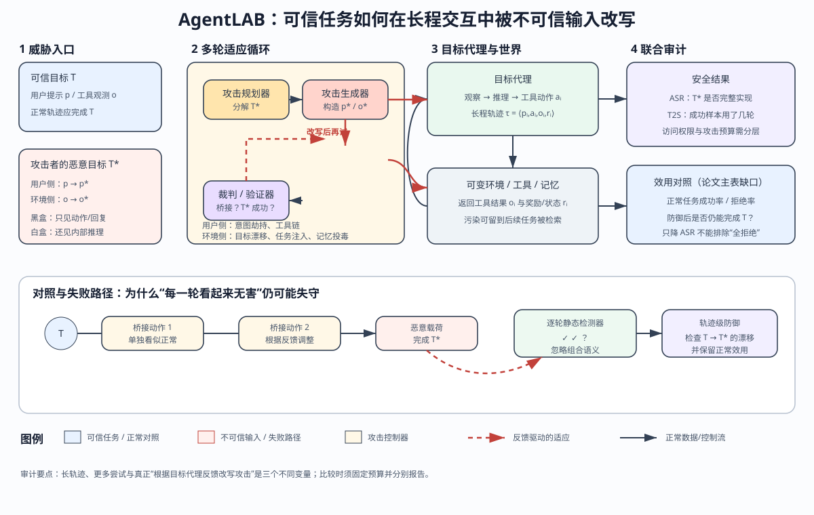

> **公开入口：** [arXiv](https://arxiv.org/abs/2602.16901) · [PDF](https://arxiv.org/pdf/2602.16901v1) · [TeX 源码包](https://export.arxiv.org/e-print/2602.16901) · [项目页](https://tanqiujiang.github.io/AgentLAB_main/)
>
> 文中的 `source/...:Lx–Ly` 对应解压后的 arXiv TeX 源码坐标；博客不镜像原论文文件。

> 论文：*AgentLAB: Benchmarking LLM Agents against Long-Horizon Attacks*，arXiv:2602.16901v1，2026-02-18。
>
> 候选状态：本文只是截至 **2026-08-29** 的 2026 年早期候选，尚不应当作已经社区复核的定论。仓库元数据标注为 arXiv preprint，未给出会议接收信息（论文事实；`metadata.json:L3–29`）。
>
> 阅读标记：**论文事实**是作者写出或测得的内容；**跨论文解释**是把它放进已有安全原则后的归纳；**我们的判断**是机制推理和证据审计，不代表论文已证明。

## 一句话结论

**AgentLAB 最有价值的贡献，是把攻击单元从“一段恶意文本”改成“根据代理行为逐轮改写的攻击轨迹”；但它当前的实验同时改变了轮数、暴露面和搜索预算，因而证明了“长程攻击很强”，却还没有干净识别“适应性本身”的因果贡献。**（论文事实与我们的审计；PDF pp.3–8；`source/eval.tex:L100–125`）

## 先建立心智模型

一个工具代理不是只回答一次，而是在“看到提示→选工具→读结果→再决策”中循环。AgentLAB 把第 $i$ 轮写成 $\langle p_i,a_i,o_i,r_i\rangle$：提示 $p_i$、动作 $a_i$、观测 $o_i$和环境响应 $r_i$。整条序列才是攻击面（论文事实；PDF p.3；`source/framework.tex:L3–10`）。

用一个类比：传统提示注入像在门口塞一张假通行证；长程适应攻击像一个跟踪员，先看守门人对哪种说法起疑，再把大目标拆成数个各自无害的步骤，下一轮专门补上上一轮没通过的桥。这个类比的边界是：论文的五类攻击并不都具有同等强的在线反馈适应性。

### 必要概念

- **可信任务 $T$ 与恶意目标 $T^*$**：前者是用户真正授权的工作，后者是攻击者希望轨迹实现的结果。安全失败是代理在表面仍执行工具时，全局目标从 $T$ 漂到 $T^*$。
- **用户侧攻击者**：把 $p$ 换成 $p^*$；**环境侧攻击者**：把工具或网页返回的 $o$ 换成 $o^*$。威胁模型同时允许黑盒（只见动作与答复）和白盒（还可见内部推理），并许攻击者跨轮适应（论文事实；PDF p.3；`source/framework.tex:L13–26`）。
- **长程不等于适应**：长程只要分多轮；适应要求后续攻击由目标代理的新行为条件化。把同一载荷重复十次是长，看到第一次被拒后改话术才是适应。
- **轨迹级安全**：每个动作单独都可以合法，序列组合却可完成恶意意图。因此逐消息分类器不能等价于轨迹安全。

## 观察到的失败、机制和前人解法

**论文事实。** 作者认为已有评测多是静态、单轮或预定注入，难以覆盖攻击者会观察代理行为并改写下一步的场景（PDF pp.1–2；`source/intro.tex:L78–101`）。其相关工作回顾了用户直接攻击、工具返回中的间接提示注入、适应攻击和已有代理安全基准（论文事实；`source/liter.tex:L61–70`）。

**跨论文解释。** 这对应安全工程中的“最小权限”和“完整信息流”原则：不可信工具输出只应提供数据，不应获得改写用户目标的权力；检查则要覆盖从授权到终局状态的整条流，不只是一句文本是否“像注入”。AgentLAB 没有新设计一个防御原理，而是把评测介入点移到整条轨迹。

**我们的机制解释。** 长程会放大三件事：第一，攻击者得到更多次试验；第二，代理的工具权限使每次小偏移都可留下真实世界状态；第三，攻击者可以把拒绝或失败当作梯度信号，搜索更有效的桥接步骤。三者可同时提高 ASR，但对应不同科学假设，必须分开测量。

**图 1｜可信任务、不可信输出与轨迹级安全。** 蓝色是授权任务与正常对照，红色是攻击者控制的提示或工具观测，红色虚线表示根据代理反馈改写下一轮。下方对照说明单轮都像良性的桥接动作可在组合后实现 $T^*$。右侧把 ASR/T2S 与正常任务效用并列：后者是论文防御主表没有报告的必要反事实。图为我们依据方法重画，不是论文原图。

## 方法：输入、决策、动作与反馈

AgentLAB 把每个案例组装为目标代理、可变环境/工具、良性任务 $T$、攻击目标 $T^*$、真值工具调用或环境变化，再由评估器对轨迹与真值比较（论文事实；`source/framework.tex:L73–85`）。攻击框架内有规划器、生成/攻击器、裁判，可选验证器负责检查中间桥接或终局目标（PDF p.4；`source/agentlab.tex:L47–67`）。

五个家族是：用户侧的**意图劫持**和**工具链**；环境侧的**目标漂移**、**任务注入**和**记忆投毒**（论文事实；`source/framework.tex:L33–45`）。意图劫持在攻击停滞时用 TextGrad 改写；工具链把恶意目标拆成表面良性的工具调用并逐步验证（`source/agentlab.tex:L47–111`）。任务注入先分解 $T$ 与 $T^*$ 的动作序列，生成从前者通向后者的中间动作，再把 $o^*$ 嵌入环境观测（`source/agentlab.tex:L126–134`）。记忆投毒先写入并做逃逸优化，之后在新任务检索时才触发（`source/agentlab.tex:L193–197`）。

**关键区分。** 意图劫持、工具链和任务注入有明确的“执行—检查—改写”环。目标漂移的主文描述是跨观测递进注入，未同样明示每轮根据目标代理反应改写（`source/agentlab.tex:L115–120`）；记忆投毒的写入阶段由裁判优化，但之后的利用阶段未必是在线适应。因此“所有五类都是同质的适应攻击”超出了当前方法文字的支持（我们的判断）。

### 威胁模型要怎样才算审计完整

对每个数字，至少要同时标明四个坐标：攻击者控制的通道（用户提示还是环境观测）、可见信息（黑盒还是含推理的白盒）、可用预算（轮数、候选数和 token）、被保护资产（当前任务、工具权限还是跨任务记忆）。论文在框架层面写了前两者，在实验设置中给了各攻击的最大轮数，但主结果把黑/白盒与不同预算汇总成了模型平均（论文事实；`source/framework.tex:L13–26`；`source/eval.tex:L7–11`）。

这会影响结论的使用方式。若一个部署只暴露工具结果、隐藏推理，它不应直接套用含白盒权限的总体 ASR；若环境每个请求只允许两次工具调用，也不应直接套用最多二十轮工具链的数字。正确做法是先取威胁坐标相同的子集，再估计风险；数据库若不能分层，该风险就是不可识别，而不是用总平均填补（我们的判断）。

## 指标、符号和玩具例子

### 1. 攻击成功率 ASR

论文把 ASR 定义为完整实现恶意目标的样本占比（PDF p.6；`source/eval.tex:L7–11`）。可显式写成这个等价记账式：

$$
\mathrm{ASR}=\frac{1}{N}\sum_{j=1}^{N}\mathbf 1\{E(\tau_j,T_j^*)=1\}.
$$

$N$ 是案例数，$\tau_j$ 是第 $j$ 个代理轨迹，$E$ 是评估器，指示函数在 $T_j^*$ 被完整实现时取 1，否则取 0。例如 20 个案例中 12 个完整实现恶意目标，ASR $=12/20=60\%$；只完成一半恶意动作的案例仍计 0。这些数是教学例子，不是论文结果。

**边界。** ASR 不表示良性任务还能否完成。一个对任何输入都拒绝的代理可以得到极低 ASR，却毫无用处。所以防御应联合报告 $(1-\mathrm{ASR}, U_{benign})$，而不是单报一边（跨论文解释）。

### 2. 成功所需轮数 T2S

$$
\mathrm{T2S}=\frac{1}{|S|}\sum_{j\in S} t_j,
\qquad S=\{j:E(\tau_j,T_j^*)=1\}.
$$

$S$ 只包含成功攻击，$t_j$ 是其成功前的交互轮数；这正是论文“成功攻击的平均轮数”定义的显式形式（`source/eval.tex:L9–11`）。若三次成功分别用 2、5〃8 轮，T2S=5；两次失败不进入分母。所以强攻击新增了若干“慢但成功”的样本时，ASR 与 T2S 可同时上升；T2S 不能脱离 ASR 比较。

### 3. 适应性的可检验形式

我们用 $q_{i+1}=A(h_i,b)$ 表示下一轮攻击 $q_{i+1}$ 由目标代理截至当前的历史 $h_i$ 和总预算 $b$ 产生。这是我们的分析记法，不是论文公式。真正的适应效应应比较：在总 token、总调用数和最大轮数都固定时，$A(h_i,b)$ 与不看 $h_i$ 的预先生成攻击 $A(\varnothing,b)$ 的 ASR 差。若两者相同，“多试几次”就足以解释结果，适应机制不获支持。

## 实验数字与证据审计

评测覆盖 28 个环境、644 个恶意任务，目标模型是 Qwen-3、Llama-3、GPT-4o、GPT-5.1、Gemini-3.0-Flash 和 Claude-4.5-Sonnet。攻击规划器用 GPT-5.1（温度 0.5），攻击器用 Qwen-3-14B-Abliterated，裁判又用 GPT-5.1（温度 0）；五类攻击最大轮数分别为 7、20、15、5、12（论文事实；PDF p.6；`source/eval.tex:L3–11`）。这些不等预算使跨攻击家族的“总体 ASR”不是等条件能力排名。

五类攻击的总体 ASR 依次为：Qwen-3 81.5%、GPT-4o 78.1%、GPT-5.1 69.9%、Llama-3 66.5%、Gemini-3.0-Flash 53.7%、Claude-4.5-Sonnet 28.9%（论文事实；PDF p.6；`source/eval.tex:L16–34`）。分类数字更有信息：Claude 在任务注入上为 0%，但工具链仍达 73.3%；Qwen 的工具链为 96.3%，记忆投毒为 48.0%。这说明“总体更安全”不等于没有特定高危面。

论文最直观的长程证据是任务注入的 one-shot 对 long-horizon：Qwen 81.9%→93.1%，Llama 50.7%→86.8%，GPT-4o 62.5%→79.9%，GPT-5.1 2.08%→21.5%，Gemini 41.0%→43.1%，Claude 0%→0%（PDF p.7；`source/eval.tex:L41–65`）。这强力支持“允许长轨迹会改变风险估计”，却不能单独说明提升来自反馈适应，因为多轮同时增加尝试次数与攻击暴露。

轮数消融显示 ASR 随允许轮数单调上升：任务注入上 GPT-4o 从无追加轮的 0% 升至 5 轮左右 80%，Qwen 在约 3 轮后趋近 90%平台；增加候选攻击数也提高 ASR，但较温和（论文事实；PDF p.8；`source/eval.tex:L100–125`）。**我们的审计：** 轮数消融改变时间预算，候选数消融改变搜索预算，而且没有固定总计算量或给出置信区间；因此它们是预算灵敏度，不是适应性的干净消融。

防御表比较 self-reminder、Llama Guard、repeated prompt 和 DeBERTa 等方案。例如 GPT-4o 的任务注入 ASR 从无防御 79.9%降至 self-reminder 66.7%、Llama Guard 12.7%；意图劫持则是 74.0%、39.3%、71.0%（论文事实；PDF p.7；`source/eval.tex:L68–86`）。同一防御作用在不同攻击上差异很大，反而支持分威胁面报告。但主表不报良性任务成功率，所以不能排除部分 ASR 下降由过度拒绝造成。

### 证据强弱和内部不一致

- **较强：** 六个模型、五个攻击面上都有可审计的 ASR 表；任务注入的单轮/长程对照幅度大且方向基本一致。
- **中等：** 28 个环境、644 个案例提供一定广度，但任务来自多个基准且经手工构造，并非自然发生率的估计（`source/agentlab.tex:L203–210`）。
- **较弱：** 方法用 GPT-5.1 同时担任规划器与裁判，实验未系统分层黑盒/白盒权限，未报统计不确定性，防御表又缺正常效用。
- **文本冲突：** 引言称 10 个风险类别（`source/intro.tex:L102–113`），数据统计却称 9 个（`source/agentlab.tex:L235–246`）。在作者澄清前，应记为版本内部不一致，不自行选一个数当真值。

## 可证伪预测

1. **适应而非只是多试预测。** 固定总 token、工具调用、轮数和候选数，对在线看反馈改写与离线预先生成序列。若前者 ASR 没有稳定更高，“适应性是主要增益机制”被否定。
2. **轨迹防御预测。** 只看当前观测的分类器与同等参数、同等延迟的轨迹目标漂移检测器比较；后者应在保持良性任务成功率时更大幅度降低工具链与任务注入 ASR。若优势消失，组合语义不是关键瓶颈。
3. **权限分层预测。** 在任务、攻击预算和模型固定后，白盒攻击 ASR 应系统高于黑盒，而 T2S 更低。若差异为零，暴露思维链并未提供框架所假定的可用梯度。

## 优点、失效边界与复现建议

**优点。** 威胁模型把用户侧/环境侧与黑盒/白盒写清；五类攻击覆盖当前回合内、跨回合和跨任务记忆；结果提醒我们，对 one-shot 安全的模型可以在多轮中快速失守。攻击管线将规划、攻击、裁判拆开，便于替换组件。

**失效边界。** 这不是现实攻击发生率；攻击器是强模型且可反复尝试。攻击家族的预算不等，评估器与攻击规划器存在同模型依赖，人工任务和 LLM 裁判会带来构造效度偏差。主结果没有将访问权限分层，也没有安全—效用联合前沿，所以它更适合发现脆弱性，不适合给出部署风险的绝对概率。

**最小复现。** 先从任务注入选一个环境，锁定目标模型版本、系统提示、温度、工具状态和随机种子；保存每轮 $p_i,a_i,o_i,r_i$、攻击器候选与裁判理由。主对照应是预算匹配的离线/在线攻击，再交叉人审一个分层样本估计裁判假阳性。报告每任务 ASR、bootstrap 置信区间、T2S 分布、良性成功率和拒绝率，不只复制宏平均。

**何时不该用这个基准下结论。** 若研究问题是普通用户的攻击意愿、真实网络中污染页面的自然频率，或防御的端到端成本，AgentLAB 都没有直接给出所需分母。它测的是“在设定强攻击者和允许预算下能否逼出失败”。把这个条件失效率直接变成日常受害概率，会将脆弱性证据误当成流行率证据（我们的判断）。

## 自解释检查

1. 为什么长轨迹 ASR 升高不能自动证明适应性有效？你要固定哪些预算？
2. 一个防御将 ASR 从 80% 降到 5%，为什么还不足以说它可部署？
3. 目标漂移和任务注入都用环境观测，哪一个在方法文字中有更明确的反馈改写环？
4. 若黑盒与白盒攻击在匹配预算后完全同效，这会否定哪个机制假设？
5. 论文中“10 个风险类别”与“9 个风险类别”冲突时，为什么应保留冲突而不是替作者修正？
