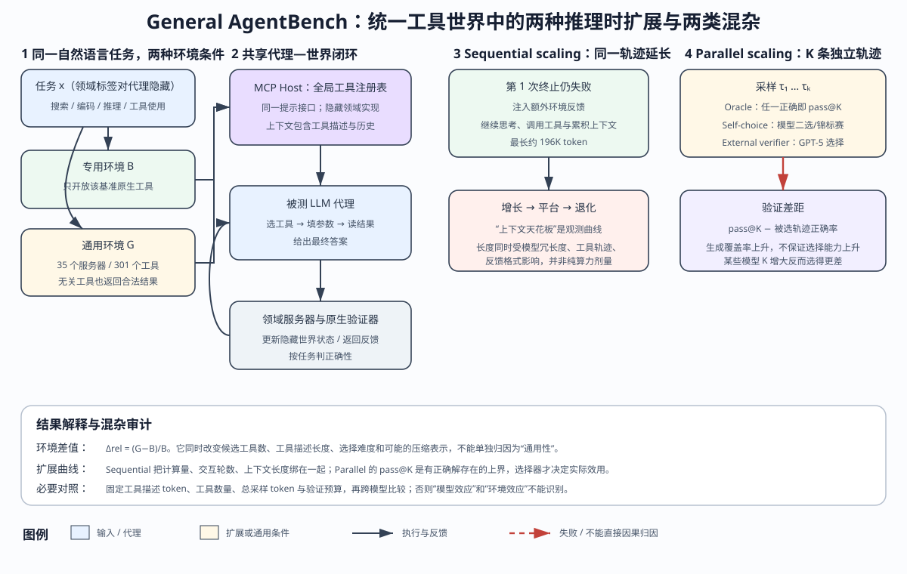

> **公开入口：** [arXiv](https://arxiv.org/abs/2602.18998) · [PDF](https://arxiv.org/pdf/2602.18998v1) · [TeX 源码包](https://export.arxiv.org/e-print/2602.18998) · [代码](https://github.com/cxcscmu/General-AgentBench)
>
> 文中的 `source/...:Lx–Ly` 对应解压后的 arXiv TeX 源码坐标；博客不镜像原论文文件。

> 论文：*Benchmark Test-Time Scaling of General LLM Agents*，arXiv:2602.18998v1，2026-02-22。
>
> 候选状态：这是截至 **2026-08-29** 的 2026 年早期候选，仓库证据只能确认 arXiv 预印本，不应把它写成已经经过正式同行评审的结论（论文事实；`metadata.json:L3–35`）。
>
> 阅读标记：**论文事实**是作者明言或表图数字；**跨论文解释**是借用评测和统计原则的归纳；**我们的判断**是对可识别性、混杂和证据边界的审计。

## 一句话结论

**General AgentBench 把原本分开的搜索、编码、推理和工具任务放入同一工具池，并显示延长单条轨迹会碰到上下文天花板，并行生成则有“能生成正确解却选不出来”的验证差距；但专用/通用差值同时改变工具数、工具描述长度与选择难度，scaling 曲线又把计算、交互和上下文长度捆绑，所以结果是很好的现象地图，还不是对“通用性或计算量导致失败”的干净因果分解。**（论文事实与我们的审计；PDF pp.3–8；`source/src/4tts_analysis.tex:L10–74`）

## 基本概念：这个基准究竟改了什么

专用基准像把考生带进一间只放数学工具的房间：工具名已经泄露了领域，无关选项很少。General AgentBench 则把搜索、终端、旅行、商务等工具一起放到大厅，只给自然语言任务，由代理判断在哪个世界、调哪个工具。作者用统一 MCP Host 暴露全局工具注册表，各领域实现对代理隐藏，即使调错无关工具也会收到合法返回，最后仍用每个原生基准的验证器打分（论文事实；PDF p.3；`source/src/2benchmark.tex:L41–61`）。

### 必要概念

- **专用环境 $B$**：一项任务只接入其原基准工具和上下文。**通用环境 $G$**：同一任务要在共享工具池中识别领域并操作。差值包含了“选哪组工具”的额外困难。
- **隐藏世界状态**：代理只通过 API 返回观察它，原生验证器按最终答案或完成状态打分。“工具调用格式正确”不等于“世界已到达目标状态”。
- **Sequential scaling**：一条轨迹终止后若未成功，注入额外环境反馈，让同一上下文继续反思、调工具。计算增加的同时，历史也变长。
- **Parallel scaling**：独立生成 $K$ 条候选轨迹。Oracle 只问“至少一条正确吗”；真实系统还须用自选或外部验证器选中它。
- **混杂（confounding）**：当实验一次改变多个因素，结果差不能唯一归因。例如 $B\to G$ 同时增加工具数、描述 token、路由分支和误调用后的观测，不只是抽象的“更通用”。

## 具体失败、机制解释和前人方法

**论文事实。** 当领域环境合并后，多数模型的宏平均下降约 10%–30%，Gemini-3-Pro 的推理领域降幅超过 60%，而 Claude-4.5-Sonnet 的总体变化只有 -0.2%（PDF pp.4–5；`source/src/3mainresults.tex:L23–28`）。延长单条轨迹时，表现先改善，之后平台甚至下降；并行增加候选时 oracle pass@K 单调增长，但自选性能落后、偶尔随 $K$ 下降（PDF pp.6–8；`source/src/4tts_analysis.tex:L32–74`）。

**跨论文解释。** 第一类失败是**行动空间干扰**：候选 API 变多后，代理必须先做路由，再做参数化决策，一次误选还会把合法但无关的返回写入历史。第二类是**记忆带宽竞争**：更长思考增加有用搜索，也增加无关观测、早期错误和注意力负担。第三类是**生成—验证能力不对称**：多采样可以让正确解出现，但选择器必须识别最终世界状态与任务条件是否一致，这不是更流畅地生成即可解决。

**前人如何解。** 作者将先前工作分为专项代理基准、通用工具代理方法和测试时扩展（TTS）：前者给特定领域与原生工具，中者用规划/反思/工具学习改善执行，后者通过更长轨迹或多样本投票增加测试计算（论文事实；`source/src/related_work.tex:L1–7`）。General AgentBench 的新意不是再提一个解题模块，而是在统一环境里同时测环境迁移与两条 TTS 路径。

**图 1｜统一工具世界中的执行、扩展与混杂。** 左侧是同一任务在专用环境 $B$ 与通用环境 $G$ 的对照；中部表示代理通过 MCP Host 调用隐藏领域服务器，原生验证器核对终局；右侧分开 sequential 与 parallel scaling。红色路径不表示必然失败，而表示不能从观测曲线直接归因的环节。图为我们依据系统设计重画，不是论文原图。

## 基准的输入、决策、动作和反馈

数据由搜索的 BrowseComp 124 题、WebVoyager 65 题，编码的 SWE-bench Verified 50 题、Terminal-Bench 80 题，推理的 MathHay 75 题，工具使用的 TAU2 50 题、MCP-Bench 52 题组成，合计 496 题（论文事实；`source/tables/dataset.tex:L9–24`）。统一环境共含 35 个 MCP 服务器、301 个工具（PDF p.3；`source/src/appendix_details_our_benchmark.tex:L5–13`）。评测 10 个 LLM，温度 0.7，作者称各模型原生上下文窗口超过基准所需最大值（`source/src/2benchmark.tex:L77–79`）。

每轮的数据流是：自然语言任务 $x$ 进入 MCP Host，代理从全局注册表选 API 并给参数，环境服务器读写隐藏状态、返回观测，代理再决策；终止后由原生验证器对答案或状态打分。搜索任务使用 LLM 评估，其他多为二元判定，MCP 任务保留连续分（`source/src/appendix_details_our_benchmark.tex:L65–78`）。

Sequential 路径在一次终止时额外注入反馈，并保留轨迹继续；Parallel 路径独立采样 $K\le4$ 条轨迹，用点式二元自评或成对锦标赛选一条（论文事实；`source/src/4tts_analysis.tex:L10–30`）。点式方法评估每条是否正确，锦标赛需 $K-1$ 次两两比较。

### 把“通用环境效应”拆成可测部件

要知道降幅由什么造成，可把 $B\to G$ 拆成四个递进处理：先只增加无关工具名以测候选数；再增加等 token 的 schema 以测描述负担；然后让错工具返回合法观测以测轨迹污染；最后才开启可真正帮助任务的跨域工具。每一步保持题目、模型、采样预算与验证器不变，相邻差才分别对应路由、表示、反馈和跨域助益。论文的统一 MCP Host 与隐藏领域实现为这种因子化实验提供了接口（论文事实与我们的实验建议；`source/src/2benchmark.tex:L41–61`）。

模型混杂也要单独处理。工具调用数、回答冗长度与自我终止倾向是模型的产物，它们又决定实际消耗的上下文和 sequential 可用轮数。所以“在 100K 时 A 比 B 好”不能只按 token 横轴比：至少还要报调用次数、有效观测 token 比例、失败反馈数和每题的自然轨迹长度。否则横轴把“模型如何行动”也当成了外生计算预算（我们的判断）。

## 三个关键量：逐符号、玩具例子与边界

### 1. 专用到通用的相对变化

$$
\Delta_{rel}=\frac{G-B}{B}\times 100\%.
$$

$B$ 是一个模型在专用环境的分数，$G$ 是它在统一通用环境的分数。若 $B=50$, $G=35$，则 $\Delta_{rel}=(35-50)/50=-30\%$。这是论文表格降幅的显式记账法；玩具数字非论文数据。

**边界。** $\Delta_{rel}$ 是处理条件包的差，不是“通用性”这一个抽象变量的效应。$G$ 可能同时用更长的工具表示。附录说常规压缩只去掉 18.6% 内容，自选最小表示去掉 90.1%、约省 70K token（论文事实；`source/src/appendix_details_our_benchmark.tex:L58–61`）。若自选和生成阶段看到不同表示，选择性能还混入了压缩效应。

### 2. Oracle pass@K

$$
\mathrm{pass@}K=\frac1N\sum_{i=1}^N
\mathbf 1\!\left\{\max_{1\le k\le K} y_{ik}=1\right\}.
$$

$N$ 是任务数，$K$ 是独立轨迹数，$y_{ik}\in\{0,1\}$ 表示第 $i$ 题的第 $k$ 条轨迹是否通过原生验证。对某题若四条为 $[0,1,0,0]$，pass@4=1；它只说正确解存在，没有说系统知道第二条正确。论文正文数处写成 `past@K`，但指标含义与图题指向 pass@K（论文文本事实；`source/src/4tts_analysis.tex:L10–30`）；本文按标准记法使用 pass@K，并保留这个版本编辑问题。

### 3. 验证差距

设选择器对第 $i$ 题选中索引 $s(i)$，实际选择成功率为

$$
A_{select}=\frac1N\sum_{i=1}^N y_{i,s(i)},\qquad
V_K=\mathrm{pass@}K-A_{select}.
$$

$V_K$ 是我们为说明结果定义的“验证差距”，不是论文新公式。还用 $[0,1,0,0]$：Oracle 为 1；若自选器选第一条，$A_{select}=0$, $V_4=1$。当 $K$ 增大时，pass@K 按定义不会下降，但 $A_{select}$ 可以下降，因为更多高流畅错误解增加了选择难度。

### 4. 上下文天花板的可识别性

可用解释性记法 $S_m(L)$ 表示模型 $m$ 在累积上下文 $L$ 处的得分，$L_m^*=\arg\max_L S_m(L)$ 表示曲线峰值。这不是论文定义的新指标，只是把“上升后平台/衰减”说清。关键是 $L$ 不是随机分配的剂量：它由模型回答冗长度、工具调用数、环境返回长度和任务难度共同生成。所以两模型的 $L_m^*$ 不能直接解读为两个固有记忆容量。

## 实验数字和审计

专用 $B$ 到通用 $G$ 的四领域宏平均为：Qwen3-235B 41.5→30.9（-25.5%），Qwen3-Next 36.4→32.6（-10.4%），DeepSeek-V3.2 40.9→37.0（-9.5%），DeepSeek-R1 32.9→29.7（-9.8%），Gemini-3-Flash 44.3→30.5（-31.2%），Gemini-3-Pro 44.4→32.4（-27.2%），Claude-4.5-Haiku 46.1→39.1（-15.2%），Claude-4.5-Sonnet 45.1→45.0（-0.2%），GPT-5 60.9→47.1（-22.7%）（论文事实；PDF pp.4–5；`source/tables/main_results.tex:L1–38`）。注意另一张总表的 Avg 是对所有可用**基准**取平均，例如 Claude-Sonnet 为 48.0、GPT-5 为 45.9（`source/tables/omni_only_main_results.tex:L1–28`）；这与四领域宏平均的 45.0和 47.1 分母不同，不应混用。

环境效应还具有明显的领域交互：Qwen3-Next 的搜索分数相对上升 18.6%，DeepSeek-R1 搜索上升 27.7%；Claude-Sonnet 搜索上升 33.0%、推理上升 12.5%，但工具使用下降 16.8%；GPT-5 搜索下降 29.9%、工具使用下降 41.5%（`source/tables/main_results.tex:L1–38`）。因此“大工具池统一伤害模型”过于粗糙。作者还报告 Claude-Sonnet 的 189 条搜索轨迹中有 50 条（26%）使用了额外领域工具，包括 Maps 78 次、论文搜索 60 次、HuggingFace 36 次（论文事实；`source/src/3mainresults.tex:L25–28`）。这是“跨领域工具有时有用”的轨迹证据，不能单独证明这些调用导致任务成功。

Sequential 实验把轨迹延长到约 196K token；作者着重分析较小上下文窗口的 Qwen3-235B 与 Gemini-3-Flash，报告搜索任务约在 112K 和 96K 附近到达阈值（论文事实；PDF pp.6–7；`source/src/4tts_analysis.tex:L32–64`）。论文附录同时说工具定义可接近 64K，加历史可近 128K，静态上下文长度与得分相关较弱（`source/src/appendix_details_benchmark.tex:L44–73`）。**我们的审计：** 112K/96K 是特定模型—任务—轨迹组合上的观察拐点，不是可迁移的模型固有容量；未做等 token 摘要、固定工具返回长度或对照外加反馈格式。

Parallel 实验中，$K=1\to4$ 的 oracle pass@K 在全体上平均约有 50% 相对增益，DeepSeek-V3.2 的编码与推理近乎翻倍；自选明显落后 oracle，GPT-5 作外部验证器也常常不如自选（论文事实；PDF p.8；`source/src/4tts_analysis.tex:L66–74`）。作者推测这可能与生成模型对自己解答更熟悉有关；这是假设，不是已被消融证实的机制。外部验证器还可能受轨迹格式、可见世界状态不足或自选压缩差异影响。

### 证据强弱

- **较强：** 同一原生验证器对同一任务在 $B/G$ 两种环境打分；模型和领域分项表暴露了异质性，没有只留一个总分。
- **中等：** pass@K 与实际选择率的差能直接定位生成/验证断点；但 $K\le4$，是小规模外推，外部验证器又不能读取所有隐藏环境真值。
- **较弱：** 上下文“天花板”只深入分析两个模型，长度是轨迹内生变量；通用环境差值没有固定工具数或描述 token，因果成分未被拆开。

## 可证伪预测

1. **工具干扰而非抽象通用性。** 保持工具描述总 token 与工具数固定，用真实无关 API、乱序空 API 和领域有用 API 三组替换。若只要分支数一样，降幅就一样，主机制是选择负载；若真实跨域工具显著更好，则跨域组合能抵消部分干扰。
2. **上下文而非总计算预测。** 在总采样 token 固定时，对完整历史、无损状态摘要和等长无关填充。若摘要延后退化而填充提前退化，记忆带宽竞争获支持；若只由总 token 决定，内容机制不获支持。
3. **验证可见性预测。** 让验证器分别只看文本轨迹、看标准化工具状态差分、看原生验证器的最小反例信号。若状态差分显著缩小 $V_K$，瓶颈是可验证信息不足；若仍无改善，瓶颈更像候选比较能力。

## 优点、失效边界和复现建议

**优点。** 七个原生数据集、四个领域和 301 个工具形成比单基准更接近通用代理的决策压力；它保留原生验证器，避免把所有任务简化为同一个 LLM 裁判。分开 sequential 和 parallel 让“继续一条思路”与“并行找多个解”的瓶颈可见；pass@K/选择差为后续验证研究提供明确终点。

**失效边界。** 496 题在分到七个基准、十个模型和扩展条件后，局部差值可能对任务抽样敏感，文中主表没有为所有差值给置信区间。搜索任务的 LLM 裁判与其他二元/连续验证混合，四领域宏平均遮蔽了分母与方差。统一工具池是一种特定工程实现；用层级路由、动态工具检索或更紧凑 schema 的系统，不一定重现同样降幅。

**最小复现。** 先选每领域 20 题和两个模型，锁定 API/schema 版本、模型快照、温度 0.7、随机种子、终止条件与服务器初态。同时记录任务提示 token、工具定义 token、每轮返回 token、调用序列、隐藏状态差分与原生验证结果。先复现 $B/G$，再作等工具数、等 schema-token 对照；Parallel 同时报 pass@K、选择率和 $V_K$，Sequential 以等宽 token bin 与任务固定效应估计曲线，使用 bootstrap 置信区间。

**何时不应引用总分。** 若系统会先用确定性路由器缩小工具池，或生产环境的 API 描述远短于该基准，通用环境总降幅不能直接外推。同样，若应用有可程序化状态检查器，它的并行扩展不必复制纯文本自选的验证差距。宏平均适合用于发现值得深挖的互动，不适合替代具体部署的工具集、验证器和成本模型（我们的判断）。

## 自解释检查

1. $B\to G$ 降 30% 时，哪些变量除了“通用性”也变了？怎样做匹配对照？
2. 为什么 pass@K 必然非降，而自选正确率可以随 $K$ 下降？
3. 112K token 的拐点为什么不能直接叫作 Qwen 的固有上下文容量？
4. 若模型的 pass@4 很高而 $A_{select}$ 不变，下一个最小干预应改生成器还是验证器？
5. 为什么 Claude-Sonnet 总体只变 -0.2% 仍不能说它在所有领域都对通用环境鲁棒？
