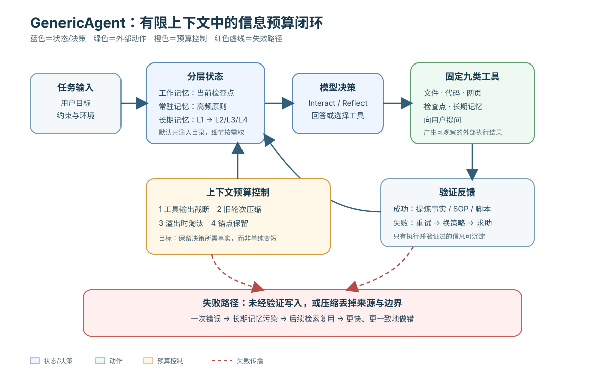

> **公开入口：** [arXiv](https://arxiv.org/abs/2604.17091) · [PDF](https://arxiv.org/pdf/2604.17091v1) · [TeX 源码包](https://export.arxiv.org/e-print/2604.17091) · [代码](https://github.com/lsdefine/GenericAgent)
>
> 文中的 `source/...:Lx–Ly` 对应解压后的 arXiv TeX 源码坐标；博客不镜像原论文文件。

> **候选状态。** 本文在仓库中记录为 arXiv 预印本，首次公开于 2026-04-18，证据置信度为 medium（`metadata.json:L3–54`）。以下解读截至 2026-08-29；它适合用来形成机制假设，不应被当作已经过正式同行评审的定论。

## 一句话结论

GenericAgent 的核心不是“再加一个记忆模块”，而是让通用代理持续做信息预算：用少而稳定的工具执行任务，把已验证轨迹沉淀成分层记忆、SOP 与代码，并在上下文接近预算时截断、压缩和淘汰低价值历史（`source/section/0abstract.tex:L1–5`）。论文报告了很强的准确率与 token 节省，但最有说服力的证据仍是少量受控子实验；“信息密度导致提升”尚未被跨任务、等内容的严格消融单独识别。

## 1. 先把几个概念说清楚

**有限上下文**是模型一次决策能看到的 token 窗口。窗口再大也不是免费仓库：无关、过期、重复内容会挤走真正决定下一步的信息。作者观察到两类长程失败：上下文膨胀使有效注意力被低价值内容占用；过去已经解决的问题没有进入可复用记忆，于是代理反复探索和犯错（`source/section/1intro.tex:L8–20`）。

**信息密度**在本文中是一个设计原则，而非被直接测量的标量。作者把它拆成“完整性”和“简洁性”：前者要求保留完成任务所需事实，后者要求减少冗余；“自然性”只是避免压缩后难以阅读的次级约束（`source/section/2method.tex:L1–47`）。因此，不能把“token 少”自动等同于“密度高”：删掉关键约束也会更短，却更差。

**工作记忆、常驻记忆、长期记忆**分别对应当前任务状态、每轮都注入的高频原则，以及按需检索的历史知识。长期记忆又分为 L1 索引、L2 事实、L3 SOP 和 L4 原始档案；默认只给模型元记忆和 L1，模型再沿索引取出细节（`source/section/2method.tex:L138–166`）。这更像一张目录，而不是把整座图书馆塞进提示词。

**自演化**指策略资产随任务积累，而不是模型权重在线训练。工具集合保持固定，代理把被执行并验证过的轨迹整理为规则、SOP 或脚本；“No Execution, No Memory”要求未实际运行的设想不得写进长期记忆（`source/section/2method.tex:L169–198`）。这条约束提高可追溯性，但不能自动排除只对已见任务有效的过拟合。

## 2. 具体问题、既有解法与机制性失败

常见解法有三种。第一是扩大上下文，失败机制是容量增加并不保证注意力落在正确位置。第二是不断添加专用工具，失败机制是工具描述、参数模式和插件状态本身也会占上下文，并扩大选择空间。第三是把全部历史做成向量库，失败机制是检索结果可能缺少顺序、成功条件和失败教训，且未验证的输出会污染未来决策。

GenericAgent 的对应干预很小：只保留九个工具类别，包括文件读写、代码执行、网页扫描、工作检查点、长期记忆更新和向用户提问（`source/section/2method.tex:L102–136`）；先用分层索引缩小“现在该看什么”，再只沉淀经执行验证的信息。论文还规定失败升级顺序为局部重试、换策略、再向人求助（`source/section/2method.tex:L169–198`）。

**可证伪的机制假设：**如果收益确实来自高信息密度而非恰好更好的提示词，那么在保留相同事实、相同模型、相同工具权限和相同任务顺序时，结构化精简版应比随机删减版和等长冗余版有更高成功率；若三者只随 token 数变化，或精简版丢失约束后更差，这个机制解释就被削弱。

## 3. 输入—状态—决策—动作—反馈

1. **输入：**用户任务、全局记忆与当前工作状态进入模型。
2. **状态：**工作记忆保存当前目标和检查点；常驻记忆保存高频规则；L1 索引指向按需读取的 L2/L3/L4。
3. **决策：**模型选择直接回答、调用工具，或进入反思；论文把这概括为 Interact 与 Reflect 两种模式（`source/section/2method.tex:L87–93`）。
4. **动作：**九类工具在文件、代码、网页和记忆上产生外部效果。
5. **反馈：**结构化工具结果回到下一轮；成功轨迹可压成 SOP/代码，失败则按升级路径处理。任务后轨迹被压缩，而不是原样永久累积（`source/section/2method.tex:L87–93`）。

图中的红色支路很重要：未验证输出若提前写入记忆，错误就会从一次失败变成跨任务污染；压缩若删掉边界条件，未来任务会“高效地做错”。所以真正的对照不是“有无记忆”，而是“验证后、可追溯的精炼记忆”对“未经验证或丢失来源的记忆”。

## 4. 关键公式逐符号解释与玩具例子

论文用字符数近似上下文负载：

$$
C_H=\sum_{m\in H}\operatorname{len}(m),\qquad B=\alpha W_{\text{tokens}}.
$$

这里，$H$ 是当前消息历史；$m$ 是其中一条消息；$\operatorname{len}(m)$ 是字符数；$C_H$ 是历史总字符数；$W_{\text{tokens}}$ 是模型上下文 token 上限；$\alpha$ 是字符/token 的近似换算，论文取约三个字符（`source/section/2method.tex:L200–223`）。当 $C_H$ 接近预算 $B$ 时，系统依次截断工具输出、压缩旧轮次，必要时更激进淘汰历史。

**玩具例子。** 假设窗口为一百 token、$\alpha=3$，预算约三百字符。五条消息长度分别为四十、八十、九十、七十和六十字符，则 $C_H=340>B=300$。系统不能只删除最老的四十字符，因为可能仍超预算；它可以保留最近决策，把前几轮压成“已试 A，因权限失败；改用 B”这样的可追溯摘要。这个例子展示的是计算逻辑，不是论文报告的实验。

该近似有语言边界：作者明确说 ASCII 估计偏保守、会较早驱逐；CJK 可能低估 token 使用，导致压缩太晚甚至溢出（`source/section/2method.tex:L212–223`）。因此中文环境复现时应直接调用 tokenizer，而不应照搬字符系数。

系统还有三级预算动作：普通工具结果先截断；大约每五轮压缩一次、豁免最近十条消息，并给长内容保留约八百字符的首尾；溢出时只豁免最近四条，并将历史压到预算的六成以下（`source/section/2method.tex:L230–270`）。锚点最多保存二十条、每条约百字符的摘要和关键信息（`source/section/2method.tex:L273–280`）。这些阈值是实现选择，不是理论最优值。

## 5. 实验设置与精确结果

主表横跨 SOP-Bench、Lifelong AgentBench 和 RealFin，并定义效率为准确率除以百万总 token（`source/section/4evaluation.tex:L22–40`）。在 Claude Sonnet 配置下，GenericAgent 在 SOP-Bench 为 100%、总计 2.08M token，OpenClaw 为 100%、2.64M，Claude Code 为 85%、1.25M；在 Lifelong AgentBench 上三者分别为 100%/241k、70%/1.45M、75%/814k（`source/tables/main_result.tex:L1–37`）。RealFin 中 GenericAgent+Sonnet 为 65%/114k，OpenClaw+Sonnet 为 35%/251k；但表内也混有 Opus、GPT-5.4 等模型配置，不能把整张表当作严格同模型排名（`source/tables/main_result.tex:L20–37`）。

较干净的工具子实验统一使用 Claude Sonnet 4.6，但只有五个长程任务：GenericAgent 与 Claude Code 都成功五个，OpenClaw 成功四个；三者平均 token 分别为 188,829、537,413、633,101，时间分别为 220.8、320.8、183.1 秒（`source/section/4evaluation.tex:L73–113`）。小样本且没有置信区间，适合说明可能性，不足以估计稳定优势。

最贴近信息密度的消融来自 dangerous_goods 子集，同一 GenericAgent/GPT-5.4 配置下：无记忆成功数为零、TSR 13.87；完整记忆为 575 token、TSR 52.44；冗余记忆为 288 token、TSR 66.48；精炼记忆为 165 token、TSR 同为 66.48（`source/section/4evaluation.tex:L177–220`）。它支持“同样表现可以更短”，却没有证明“更短使表现更好”：冗余版和精炼版 TSR 相同，而且四版的事实正确性、组织方式可能同时变化。

自演化实验报告九轮 LangChain 任务的 token 从 222,203 降到 23,010，即下降 89.6%，调用次数从三十二次降到五次，时间从七分三十秒降到一分三十八秒（`source/section/4evaluation.tex:L302–340`）。跨任务实验汇总节省 79.3% token（`source/section/4evaluation.tex:L342–374`）。但论文没有在同一处给出每轮质量、任务难度等价性和盲测说明；因此这既可能是技能迁移，也可能包含任务顺序、模板复用或缓存口径效应。

上下文压力测试在安装并密集使用同一批二十个技能后，仅问“Hello”：Claude Code、Codex、OpenClaw 与 GenericAgent 的输入 token 分别为 22,821、23,932、43,321 和 2,298（`source/section/4evaluation.tex:L259–285`）。这是醒目的系统级差异，但运行时默认提示、插件描述和可见工具是否完全等价并未被充分拆分。

## 6. 证据强弱与比较公平性审计

**较强：**同模型的五任务工具实验控制了基础模型；记忆消融固定了代理和模型；作者也坦承不少原则来自实践总结而非受控消融（`source/section/6discussion.tex:L94–98`）。这份自我限定提高了解读透明度。

**中等：**跨基准主表覆盖范围广，但效率比值会同时受准确率、token 计费口径和模型差异影响。同一模型的横向格子可比性较高，混模型格子只能说明端到端配置结果。工具数量表按源码入口统计，Claude Code 为五十三、OpenClaw 为十八、GenericAgent 为九，但运行时可见工具还受配置和插件影响（`source/tables/tool_inventory_overview.tex:L1–55`）。“工具少所以更好”不能仅凭入口数量成立。

**较弱：**质性案例从五百多个任务中选出五个以覆盖能力，而不是随机抽样，因此只能展示存在性（`source/section/appendix.tex:L494–500`）。重复任务的自演化结果容易受到选择偏差：系统保留成功经验，失败轨迹是否同样进入统计、何时停止尝试、任务是否按有利顺序出现，都可能改变曲线。评估泄漏也未被彻底排除：SOP、脚本或长期记忆若包含与后续测试实例过近的答案，性能是检索复用而非可迁移推理。

**可追溯性审计：**“执行后才能记忆”是好门槛，但还需要记录来源消息、工具版本、执行环境、验证器、写入时间和适用边界。论文的 L1–L4 结构说明了存什么，却未给出完整的外部审计日志协议。若压缩摘要不可逆，后来很难判断错误是模型推理、工具变化还是摘要遗失造成的。

### 三个能把故事变成实验的预测

以下都是基于机制的**推断**，不是论文已经证实的事实。第一，若优势来自“按需展开的目录”，任务需要的信息越集中在少数记忆节点，L1→细节的收益应越大；若关键信息均匀散落在大量节点中，多次检索的成本可能抵消压缩收益。可用相同事实总量、不同分布集中度的数据集检验。

第二，若固定小工具集主要通过缩小决策空间起作用，那么给九类工具换成语义等价、名称不同的重复工具，即使执行能力不变，也应增加选择错误和提示 token；若表现不变，“工具过多造成认知负担”的解释就变弱。对照必须保证权限、返回格式与底层实现一致，不能把工具质量差异冒充数量效应。

第三，若验证门槛能阻断记忆污染，那么注入一次可检测的错误工具结果后，“执行验证再写入”组在后续任务中的错误传播率应低于“直接摘要写入”组；同时，两组都要保留完整来源日志，才能区分模型没有检索到错误与检索到后成功纠正。这个试验比只看最终准确率更接近论文声称的因果链。

## 7. 优点、缺点与失效边界

优点是机制简单、工程干预集中：固定工具降低选择负担，分层目录把检索控制交给模型，验证后沉淀降低重复劳动，预算动作把上下文成本显式化。它还把失败升级和向人求助纳入主流程，而非把代理假装成永不失败的自治系统。

缺点是“信息密度”尚无任务无关测量；字符预算对多语言不稳；压缩器本身可能幻觉；长期记忆会把旧环境的成功策略固化。作者也承认自探索只有三十轮、权重适应尚未验证、自改进日志经人工整理，复杂技能树维护仍需人工（`source/section/2method.tex:L448–454`）。论文讨论中的权限控制与架构演化也还缺少验证（`source/section/6discussion.tex:L172–187`）。

典型失效边界包括：法规或 API 快速变化导致旧 SOP 失效；不可重复的外部执行无法验证；多语言字符/token 映射漂移；任务需要完整原始证据而摘要丢失细节；测试与记忆来源重叠；恶意网页把提示注入长期记忆。任何一个边界都可能让“越用越强”变成“越用越确信旧错误”。

## 8. 最小复现建议

1. 固定一个模型版本、采样参数、九个工具定义、系统提示、权限、硬件和 tokenizer；逐次保存原始请求、响应、工具 I/O 与 token 账单。
2. 建立三组等事实记忆：结构化精炼、等长随机重排、等事实冗余；另设无记忆组。任务顺序随机化，测试实例与记忆生成实例按模板和实体去重。
3. 预注册主要指标：任务成功率、输入/输出 token、工具调用、墙钟时间、摘要事实召回、错误记忆写入率；不要只报告准确率/token 的比值。
4. 对每条长期记忆附来源、哈希、执行环境、验证结果和过期时间；盲审摘要是否保留约束。
5. 在英文与中文各跑一遍字符预算和真实 tokenizer 预算；若中文更易溢出，就直接证伪固定 $\alpha$ 的普适性。

## 9. 读完后应能自解释的问题

1. 为什么 token 变少不等于信息密度变高？你会怎样构造“等事实、不同冗余”的对照？
2. L1–L4 各自解决什么问题？为什么默认只注入 L1 可能降低上下文成本？
3. 用上面的玩具数字重新算一次 $C_H$ 和 $B$，并说明 CJK 为什么会破坏近似。
4. 自演化曲线下降时，如何区分技能迁移、记住测试答案、任务顺序和缓存口径？
5. 如果一条 SOP 三个月后失效，审计日志至少要保留哪些字段，才能追到错误来源？
