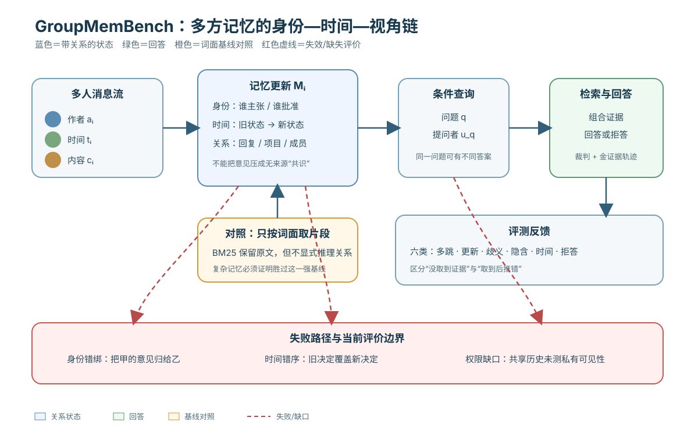

> **公开入口：** [arXiv](https://arxiv.org/abs/2605.14498) · [PDF](https://arxiv.org/pdf/2605.14498v2) · [TeX 源码包](https://export.arxiv.org/e-print/2605.14498) · [代码](https://github.com/UCSB-NLP-Chang/GroupMemBench)
>
> 文中的 `source/...:Lx–Ly` 对应解压后的 arXiv TeX 源码坐标；博客不镜像原论文文件。

> **候选状态。** 本文在仓库中记录为 arXiv 预印本，首次公开于 2026-05-14，证据置信度为 medium（`metadata.json:L3–42`）。以下解读截至 2026-08-29；它是早期候选基准的审计，不代表数据构造和排名已经过正式同行评审确认。

## 一句话结论

GroupMemBench 把长期记忆从单人聊天升级为多方工作群聊：正确答案不仅取决于内容，还取决于发言者身份、时间顺序、立场更新和提问者视角；现有最强系统平均准确率只有 46.0%，而词法 BM25 达到 43.2%，说明复杂记忆架构尚未稳定解决身份—时间—权限绑定（`source/neurips_2026.tex:L160–168`; `source/tables/main.tex:L8–34`）。但“权限”中的访问控制并未被基准真正覆盖：所有消息都进入共享历史，这是我们必须显式标出的评价边界。

## 1. 基本概念

**多方记忆**不是把更多消息存起来，而是保存关系。相同句子由不同人说、在决策前后说、对不同群体可见，含义可能完全不同。论文把挑战归为群体动态、说话者绑定的信念，以及面向提问者的视角推理（`source/neurips_2026.tex:L176–237`）。

**身份绑定**要求每条事实带上“谁主张”。例如“周五上线”可能是工程师的估计，不是经理的批准。**时间更新**要求区分旧状态与新状态，例如先同意周五、后改到周一，回答当前计划时不能平均两者。**提问者条件化**要求同一个问题由不同人提出时可能有不同正确答案，因为他们参与的项目、职责或已知背景不同（`source/neurips_2026.tex:L271–282`）。

**权限**至少有两个层次。语义权限是“谁有资格作决定”，数据权限是“谁能看见哪条消息”。GroupMemBench 的人物和项目图包含 membership 关系，但其形式化规定每条消息进入共享历史并影响后续所有轮次（`source/neurips_2026.tex:L271–282`）。因此它能测部分角色/成员语义，却不能证明系统会遵守私有频道、撤回、最小披露或基于角色的访问控制。这是本文结构推导出的审计判断，不是作者声称已解决权限。

## 2. 具体失败、既有解法与机制性解释

传统 RAG 的做法是把查询嵌入后取相似片段。它会在词面相近时找到“周五上线”，却可能丢掉作者、回复对象和后来更新。图记忆试图显式连接实体和事件，但若抽取阶段合并同名人物、把意见写成共识，图只会更稳定地传播错误。摘要记忆能省空间，却最容易删掉说话者和否定词。完整日志保留证据，却让检索器面对大量相似、冲突和过期片段。

基准报告的主要失败正符合这条机制链：多跳题没有系统超过五成；更新题没有系统超过 28%；歧义题低于 38%；即便金证据已被检索，词义歧义的条件准确率仍几乎都低于 40（`source/neurips_2026.tex:L455–521`）。错误分析把非拒答题的失败拆成检索失败 41%–79% 与推理失败 7%–24%（`source/neurips_2026.tex:L493–506`）。也就是说，瓶颈不只在“有没有取到”，还在“取到后是否按身份、时间和视角组合”。

**可证伪预测：**若身份—时间绑定是核心机制，那么在文本内容完全相同、只交换作者或时间戳的反事实对照上，正确系统的答案应随交换而变；去掉元数据的系统应显著下降。若加入身份和时间字段并不改善这类对照，或普通词法匹配仍同样好，机制解释就不足。

## 3. 输入—状态—决策—动作—反馈

1. **输入：**多人消息流和由特定用户提出的问题。
2. **状态：**记忆系统接收每条消息，保存正文、作者、时间及其与项目、回复链的关系。
3. **决策：**查询时先检索候选证据，再判断哪些人的话、哪个时间版本和哪个项目适用于提问者。
4. **动作：**给出答案或在证据不足时拒答；答案随后也可进入共享历史。
5. **反馈：**基准用标准答案、证据轨迹和 GPT-5 裁判判断正确性，并分别统计检索与推理失败（`source/neurips_2026.tex:L407–451`; `source/neurips_2026.tex:L493–506`）。

红色失败路径包括三种：把旧决定当当前状态；把甲的意见归给乙；向本不该看到信息的人泄露内容。前两种在当前题型中被部分测到，第三种基本没有被测到，因为全量共享历史已经在数据模型中预设。真正的权限对照应提供相同对话、不同可见消息集合，并把“拒绝泄露”作为正确行为。

## 4. 形式化定义逐符号解释与玩具例子

论文把用户集合写作 $\mathcal U=\{u_1,\ldots,u_K\}$，其中 $K$ 是参与者数，$u_a$ 是代理。对话为 $\mathcal C=(m_1,\ldots,m_N)$，$N$ 是消息数；每条消息 $m_i=(a_i,t_i,c_i)$，$a_i$ 是作者，$t_i$ 是时间戳，$c_i$ 是内容。记忆递推为

$$
M_i=f_{\text{update}}(M_{i-1},m_i),
$$

其中 $M_{i-1}$ 是旧记忆，$f_{\text{update}}$ 是写入或更新规则，$M_i$ 是接收第 $i$ 条消息后的状态。由用户 $u_q$ 提问 $q$ 时，答案为

$$
y=f_{\text{ans}}(q,u_q,M_T),
$$

$T$ 是查询时刻，$f_{\text{ans}}$ 是检索与推理过程；显式放入 $u_q$ 表示答案受提问者身份条件化（`source/neurips_2026.tex:L271–282`）。

**玩具例子。** 甲在周一说“预算十万元”，乙在周二说“我的草案改成八万元”，经理丙在周三批准“最终九万元”。问“乙最新提出多少”应答八万元；问“最终批准多少”应答九万元。若交换乙和丙的作者标签，两个答案应交换角色归属；若删掉时间戳，系统可能把十万元误当最新值。这个例子不是数据集样本，只用来展示三个符号字段各自不可替代。

数据生成还使用条件采样 $\hat m\sim p(\cdot\mid\operatorname{prompt}(S_u,C_u,\text{stage},\text{path}))$：$S_u$ 是人物设定，$C_u$ 是局部上下文，stage 是项目阶段，path 是图上的对话路径，$\hat m$ 是生成消息（`source/neurips_2026.tex:L352–378`）。合成器以约 5% 加噪、25% 争议回复、20% 风格不完美和约 5% 决策变化增加冲突与更新（`source/neurips_2026.tex:L383–392`）。这些比例提高挑战性，却不等于真实组织中的自然频率。

## 5. 数据与评测是怎样构造的

基准覆盖科技、金融、医疗和制造四个领域，每个领域三万条消息；参与人数依次为十八、十二、六和九（`source/tables/conversation.tex:L1–25`）。总体比较表给出一百二十三个主题、十二万轮、平均约二百七十万 token（`source/tables/bench_compare.tex:L22–32`）。生成图包含用户、项目、主题、阶段和消息，并以发言、回复、成员和相关关系连接；路径混合比例为 0.2 发帖、0.6 回复、0.2 跨项目（`source/neurips_2026.tex:L292–351`）。

六类问题分别是多跳、更新、歧义、隐含、时间和拒答。管线先选证据锚点、组合问题，再让求解器尝试检索到的上下文：若求解器答对就继续改难，答错才接受候选，最终保留问题、金答案、提问者和证据轨迹（`source/neurips_2026.tex:L407–436`）。这产生有意的硬负样本选择偏差：它衡量“强检索器容易失败的尾部”，不能直接估计日常群聊问题的自然错误率。作者在引言也明确说，只有一个有竞争力的检索基线失败时查询才被接受（`source/neurips_2026.tex:L228–237`）。

基线包括稀疏/稠密 RAG、GraphRAG 和多种代理记忆。写入统一使用 gpt-4o-mini、查询统一用 GPT-5，稠密检索使用 text-embedding-3-large；准确率由 GPT-5 裁判，成本只统计摄入阶段（`source/neurips_2026.tex:L440–451`）。统一基础模型减少了一类混杂，但各系统官方实现、默认切块、预训练索引和内部表示仍不同。

## 6. 精确结果与消融式证据

主表中 BM25 六类准确率依次为 40.11、25.23、14.15、40.82、54.94、77.98，平均 43.22；稠密 RAG 平均 38.04，GraphRAG 为 20.56（`source/tables/main.tex:L8–18`）。代理记忆里 Hindsight 最好，平均 46.01；HippoRAG 为 39.72，A-MEM 为 35.10，Mem0 为 25.73（`source/tables/main.tex:L19–34`）。领先 BM25 只有 2.79 个百分点，且不同题型互有胜负，不能概括为代理记忆全面占优。

更新题中 HippoRAG 达到 27.10，为表中最高；Hindsight 为 17.76，Mem0 只有 4.67。歧义题最好是 Hindsight 的 37.74；时间题 BM25 与 Hindsight 都是 54.94（`source/tables/main.tex:L8–34`）。这显示总平均会掩盖能力形状：一个系统可能会拒答，却不会正确覆盖更新；另一个能找时间词，却不能绑定说话者。

成本表按领域平均写入成本显示，系统从 0.31 美元到 51.04 美元、存储从 0.69GB 到 8.63GB 不等；BM25 近似零写入成本并以 43.2 平均准确率位于帕累托前沿，压过五个代理记忆中的四个（`source/neurips_2026.tex:L468–488`; `source/tables/efficiency_full.tex:L6–30`）。不过查询 token、查询延迟和外部服务固定开销未纳入，所以这是摄入效率，不是完整生命周期成本。

裁判使用 GPT-5、温度为一、每题只判一次而不投票；“Unclear”从分母排除。人工抽查一百个样本与裁判一致九十九个，其中一个为假阴性（`source/neurips_2026.tex:L948–981`）。这支持总体裁判可靠，却不足以保证六个题型、所有系统上的误差完全均匀；单次高温判断也会引入方差。

严格说，论文没有一个把身份字段、时间字段或提问者字段逐项去掉的受控消融。现有证据是按题型的性能裂缝与错误分类，属于机制一致性证据，不是因果识别。后续最关键的消融应是同一句话交换作者、交换时间、改变可见集合，并检查答案是否按预注册规则改变。

## 7. 证据强弱与评价边界审计

**较强证据：**各系统面对相同合成语料和统一查询模型；表格完整报告分题型结果，而不是只给总分；错误分析区分检索与推理；人工抽查给出裁判误差。BM25 的竞争力是稳定可复核的警报：更复杂的记忆表示并不自动保留更多有效关系。

**中等证据：**四领域与大规模消息流覆盖了多方冲突，但对话由 GPT-5 合成，人物也是虚构角色。生成器还用固定比例主动注入争议、噪声和决策变化，这能控制难度，却可能让某些词面线索异常规律。论文以自身一个月真实群聊作为质量上界，并用十个种子评估，但这不是公开、独立的人类真实性标注（`source/neurips_2026.tex:L395–405`; `source/neurips_2026.tex:L830–904`）。

**较弱或缺失：**硬负样本筛选使测试分布依赖一个检索器的失败模式；可能低估与该检索器不同的系统，也不能外推普通查询频率。成本漏掉查询。没有私信/私有频道可见性、删除请求、保密等级、角色访问控制或“不得泄露”题，因此平均准确率不代表安全多方记忆。所有消息进入共享历史的设定还可能产生一种隐性评价泄漏：生成后续消息时，人物获得现实中未必有权看到的前文。

论文自己承认英文、纯文本、四个工作领域和合成人物的限制，并提醒长期群聊归档的监控风险（`source/neurips_2026.tex:L1325–1331`）。这意味着基准目前测的是“共享工作群中的身份—时间检索与推理”，不是通用组织记忆，更不是隐私合规认证。

## 8. 优点、缺点与失效边界

优点是把单用户基准忽略的提问者身份显式写进任务定义；把更新、歧义和拒答分开；同时报告准确率、写入成本与存储；证据轨迹使错误分析可操作。尤其是“BM25 接近最优”的结果，迫使研究者证明复杂系统真的改善关系推理，而不是只展示架构新颖。

缺点是合成分布和硬例筛选双重塑形；裁判与数据生成都依赖同一模型家族可能共享偏好；没有关键字段消融；权限只停留在成员关系语义；不同记忆系统的默认参数和表示容量并非严格等价。失效边界包括同名或更名用户、跨时区、转发引用、撤回消息、秘密频道、角色变更、讽刺、附件与语音、法规要求删除，以及“知道答案但无权回答”。这些边界大多不在当前英文纯文本共享历史中。

## 9. 最小复现建议

1. 固定四领域原始消息、六类查询、官方版本、模型快照、提示、采样种子和费用单价；分别记录摄入与查询 token、延迟、存储。
2. 对每题生成三组反事实：交换作者、交换时间、改变提问者；再加一组只改变可见消息集合。答案该变时必须变，不该变时必须稳定。
3. 将测试拆成自然随机查询与硬负样本查询，分别报告结果，避免把尾部难度误当真实发生率。
4. 同时报告检索召回、给定金证据后的推理准确率、拒答精确率/召回率、隐私泄露率，并给每类置信区间。
5. 人工盲审每个题型和系统的分层样本；裁判至少多次采样或采用确定性温度，并保留“Unclear”占比。
6. 建立权限矩阵：消息附频道、成员、保密级别和有效期；查询时只能从提问者可见子集检索，删除后验证索引、摘要和缓存均不可恢复。

## 10. 读完后应能自解释的问题

1. 为什么“找到包含答案的句子”仍可能答错？请分别用身份、时间和提问者举例。
2. 从 $m_i=(a_i,t_i,c_i)$ 中删掉任一字段，会破坏哪类题？
3. 为什么只接受检索基线答错的问题会造成选择偏差？它改变的是难度还是自然发生率？
4. BM25 接近 Hindsight 说明了什么，又不能说明什么？
5. 如果经理能看私有频道而实习生不能，怎样把权限加入 $f_{\text{ans}}$ 并设计泄露率指标？
6. 要证明一个系统真的会处理“更新”，最小的作者/时间反事实消融应怎样构造？
