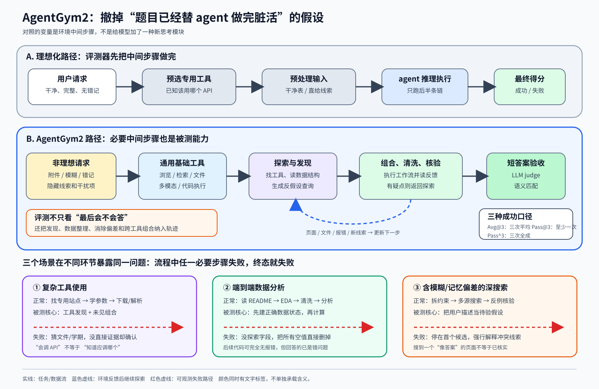

> **公开入口：** [arXiv](https://arxiv.org/abs/2607.05174) · [PDF](https://arxiv.org/pdf/2607.05174v1) · [TeX 源码包](https://export.arxiv.org/e-print/2607.05174) · [代码](https://github.com/hotdog-zz/Agentgym2)
>
> 文中的 `source/...:Lx–Ly` 对应解压后的 arXiv TeX 源码坐标；博客不镜像原论文文件。

> 论文：*AgentGym2: Benchmarking Large Language Model Agents in De-Idealized Real-World Environments*
>
> 首次公开：2026-07-06；ACL 2026。本文是截至 2026-08-29 的早期重要候选，不等于已经过多年复现的经典。

## 一句话结论

**AgentGym2 不是教 agent 一个新算法，而是撤掉旧基准常替 agent 准备好的脚手架：它不预选专用工具，不保证数据干净，也不假定用户说得完全正确，因而测到的是“发现—清洗—核验—交付”整条链能否走通。** [论文事实] 其 437 个任务上，GPT-5 的总体 Avg@3 为 46.15；[我们的判断] 这说明特定测试条件下的端到端成功仍低，不能单凭这一数字推出“生产环境可靠性为 46.15%”（`source/main.tex:L318–375`；`source/tables/main_performance.tex:L28–38`）。

## 1. 先建立基本概念

- **理想化基准**：已经告诉 agent 该用哪些 API，输入干净且需求完整，数据预处理和中间查找由基准作者做完。这不是“假数据”，而是把实际工作的一部分难度移到了评测器外。
- **去理想化（de-idealized）**：必须自己找新工具、组合基础工具、读附件、清理缺失值或无关文件，并对用户记忆偏差和模糊语句做核验。这些是环境条件，不是一个新的模型模块。
- **工具发现与工具组合**：前者是从浏览/搜索中找到原先没有列在专用 API 表里的服务；后者是把浏览、下载、解析、代码执行等基础动作串成新工作流。论文给 agent 27 类基础工具，而非每题的标准答案工具（`source/main.tex:L282–300, L613–617`）。
- **端到端数据分析**：不只在干净表上算一个统计量，而要先查 README、探索字段、处理缺失和模态文件，再分析。前一步错了，后面可能计算完全正确却回答了错问题。
- **多次运行指标**：Avg@3 看三次的平均成功，Pass@3 看三次里至少一次成功，Pass^3 则看三次是否全成功。“有机会做对”与“每次都可靠”是两件事（`source/main.tex:L403–434`）。

## 2. 观察到的失败、机制解释与别人怎么解决

**[论文事实]** 作者指出，旧基准常提供预打包工具、预先解决必要中间步骤，并忽略模糊、噪声和工具未知。这会系统性地低估实际难度（`source/main.tex:L199–209`）。**[机制解释]** 一个长任务是串联链：任何一个必要环节失败，终态就失败。若基准直接把专用工具和干净数据交给 agent，它实际测的只是后半条链；模型在这个切片上得分高，不保证能自己到达该切片。

过去的 WebShop、AgentBench 等把不同交互环境标准化，BrowseComp 聚焦深搜索，τ-bench 强调工具调用与政策约束。这些基准解决了“无法比较”的一部分问题，但 AgentGym2 认为它们仍将工具发现、端到端清洗或明示干扰置于闭世界之外（论文对相关基准的归纳；`source/main.tex:L236–266`）。其最小干预不是给 agent 加反思模块，而是把原先被隐藏的必要步骤放回任务。

**图 1｜原创机制图。** 上半部对照两种评测：理想化路径把工具、干净数据和正确线索先放到 agent 面前；AgentGym2 路径要求 agent 从基础动作出发，自己发现、清洗和核验。下半部显示三类任务的典型断点；红色代表风险路径，不代表论文证明了所有错误都由单一因素导致。

## 3. 本文怎样解决：数据流与控制流

1. **配置层**给出用户请求、初始环境状态和验证机制；输入可含文本、图像和多个环境。
2. **Agent** 读取轨迹，以 ReAct 形式推理并发出动作；一轮可并行调用多个工具。
3. **工具层**只保证有通用浏览、检索、文件、多模态和代码执行能力；任务需要的专用网站或组合路径要在交互中找。
4. **环境层**隔离文件、浏览器历史与代码执行，返回真实网页、文件或程序结果。这是工程可重复性的设计，不是提升 agent 智能的训练方法（`source/main.tex:L282–300`）。

数据集分三条路：182 个复杂工具任务（57 个发现、125 个组合）；57 个含 EDA/清洗的数据分析任务；198 个深搜索任务（114 个仅模糊、84 个模糊加记忆偏差）。合计 437 题、652 个附件，覆盖 27 个领域（`source/main.tex:L318–356`）。

一个贯穿例子是“下载某大学某学期的作业”。理想化基准可直接提供课程 API；这里 agent 先用排名工具确定学校，再探索课程网页和文件。论文案例中，agent 看到作业 1/2 的日期后猜作业 5，又没发现选错学期，最终下载错文件（`source/main.tex:L689–716`）。大白话说：它不是不会点“下载”，而是在没验明目标时就把一条顺畅路径当成正确路径。

### 三个场景其实在切同一条因果链

**复杂工具使用**把断点放在动作空间之前：要先发现专用服务，再学它的页面/参数，最后与下载、文件解析组合。**数据分析**把断点放在状态建模：若没先查缺失、字段含义和附件依赖，后面的统计推理就建在错样本上。**深搜索**把断点放在观测解读：用户提供的年代、地点或属性可能是带弱化语气的错记，agent 需要同时搜索原假设和反假设。三者分别问“动作从哪来”、“我对什么数据动作”和“起始观测可不可信”；这也是为什么不能用单一“更强推理”标签解释所有失败。

## 4. 公式与指标：把“会一次”和“次次可信”分开

论文用文字定义 Pass@k 与 Pass^k，未在 TeX 正文写展开式。下式是为讲解补写的等价定义，不是作者新推导。令 $y_{i,r}\in\{0,1\}$ 表示任务 $i$ 第 $r$ 次轨迹是否成功，$N$ 是任务数：

$$
\operatorname{Avg@}k=\frac{1}{Nk}\sum_{i=1}^{N}\sum_{r=1}^{k}y_{i,r},\qquad
\operatorname{Pass@}k=\frac1N\sum_{i=1}^{N}\mathbf 1\!\left[\sum_{r=1}^{k}y_{i,r}>0\right],
$$

$$
\operatorname{Pass}^{k}=\frac1N\sum_{i=1}^{N}\prod_{r=1}^{k}y_{i,r}.
$$

**符号账本。** $\sum_r y_{i,r}$ 数这题成功几次；指示函数 $\mathbf1[\cdot]$ 只问是否至少一次；二值乘积只有在所有次都为 1 时才为 1。论文的文字定义与趋势见 `source/main.tex:L403–434`。

**玩具计算。** 两题各跑三次，结果是 $(1,0,1)$ 和 $(0,0,0)$。Avg@3 $=2/6=33.3\%$；Pass@3 $=1/2=50\%$，因为第一题至少成一次；Pass^3 $=0$，因为没有一题三次全成。增加采样预算会让 Pass@k 上升，却往往让 Pass^k 下降：“买更多彩票更易中一次”不等于每张都中。该类比在独立同分布假设、任务可安全重试时才合适；不可逆的金钱、权限或发送动作不能靠“多跑几次”抵消。

**边界检查。** 任务对任务的成功率可不同，不需要为上面三式假定同一个 $p$。若为了心算再临时假定每次独立且成功率都是 $p$，则单题的 Pass@k 期望是 $1-(1-p)^k$，Pass^k 是 $p^k$。当 $p=0.5,k=3$ 时二者为 87.5% 和 12.5%，差距不是计算错误，而是回答了相反的风险问题。真实 agent 的三次运行还可能共用同一个错网页或服务故障，因而独立假设只是玩具计算，不是论文的保证。

**总体分数的权重。** 从各场景题数和主表可复核，总体 Avg@3 是按任务数加权，而非三场景等权。例如 GPT-5 为 $(182\times48.72+57\times39.18+198\times45.80)/437=46.15$。因此深搜索 198 题对总分影响远大于数据分析 57 题；模型“总分更高”不必然在每种现实环节都更强（数值重建；`source/main.tex:L321–343`；`source/tables/main_performance.tex:L28–38`）。

## 5. 可证伪预测

1. **若“隐藏的中间步骤”是主要难度来源，**在同一题中直接给出隐藏信息或必要工具，应显著提高成功率；若几乎不变，那么难点更可能在后续推理或执行。
2. **若用户偏差触发确认偏误，**只去掉错属性、保持答案和其他措辞不变，应提高多源核验率并降低“早停在首个候选”的比例。
3. **若发现对成功是必要但不充分的，**已找到正确工具的轨迹仍会因参数、组合和结果核验而失败。若“找到”之后几乎总是成功，则下游能力缺口的论断过强。

## 6. 实验：哪些数字支持哪个主张

**设置。** 论文比较 15 个模型配置，统一用 ReAct 风格和 OpenAI tool schema；每题最多 100 轮，温度 0.6，每轮最多 8192 token，主结果跑三次。参考答案为短字符串或数字，Qwen3-235B 做场景化 LLM judge（`source/main.tex:L355–366, L620–642`）。

| 要检验的主张 | 主要结果 | 能推出什么，不能推出什么 |
|---|---|---|
| 当前强模型仍难以端到端完成 | GPT-5 总体 Avg@3/Pass@3 为 46.15/65.68；Claude-4.5-Sonnet 为 37.17/47.82；Gemini-2.5-Pro 为 20.67/35.24（`source/tables/main_performance.tex:L28–38`） | 支持这一基准对所测配置很难；不能说所有现实工作同样失败，也没有置信区间 |
| agentic post-training 与得分相关 | Nex-N1-32B 15.71，其 Qwen3-32B 非 thinking 底座 6.55，差 9.16；Nex-N1-671B 32.19，DeepSeek-V3.1 21.66，差 10.53（`source/tables/main_performance.tex:L11–26`） | 是相关比较；训练数据、配方和模型版本不只改变“agent 能力”一个因素，因果归因要谨慎 |
| 去理想因素本身造成下降 | GPT-5：隐藏信息直给 61.67 对保留 49.60；工具直给 53.57 对发现 46.78；无偏差 48.15 对有偏差 40.74（`source/main.tex:L544–567`） | 这是最接近机制检验的证据；仅两个模型、子集和单因素操作，尚不能给出所有场景的因果份额 |
| LLM 判分与人工判断大体一致 | 人工查四个代表模型的全部输出，报告总体一致率 98.9%（`source/main.tex:L415–417`） | 支持短答案语义匹配在该样本上可用；一致不表示两者都不会共同漏掉过程中的危险副作用 |

**失败分析。** GPT-5 根据人工总结的类别标错轨迹：平均“分析错误”24.0%、“探索不足”22.8%；复杂工具任务的确认偏误 24.7%，数据分析的指令误解 27.0%，深搜索的探索不足 35.2%（`source/main.tex:L492–518`）。这帮助定位断点，却不是严格的人工因果编码：同一个 GPT-5 家族既是受测者又做错误标注，类别也可沿轨迹级联。附录给了各类定义（`source/tables/failure_type.tex:L5–29`），但没报分类的人工一致性。

**一个值得保留的反常点。** Qwen3-235B 的 thinking 配置总体 Avg@3 为 9.76，非 thinking 配置为 14.04；Qwen3-32B 的 thinking 只从 6.55 到 7.40（`source/tables/main_performance.tex:L14–26`）。论文将较少外部交互解释为更多内部思考，并指出 235B thinking 比 instruct 低 5.31 分（`source/main.tex:L387–396`）。这阻止了一个过度简化的结论：长思维链不会自动替代对环境的查询。不过两配置还可在对齐、解码和工具格式上不同，故它是机制线索，不是“思考必然有害”的消融。

## 7. 优点、缺点与失效边界

**思想优点。** 论文把“agent 已拿到正确工具和干净输入后会不会做”改成“它能否自己找到可做的状态”，并用同题理想化/去理想化对照部分验证了机制。Pass@k/Pass^k 并列也阻止读者把偶然成功当稳定性。

**实验缺点。** 主表只跑三次，没有题目级方差或置信区间；不同模型的工具兼容、上下文长度和 API 版本也会混入“模型更大”的趋势。工具发现率与成功相关不证明前者单独导致后者：更强的 agent 可能同时更会找、也更会用。

**构造效度。** 复杂工具任务混合 10 名志愿者案例与作者改写；数据分析由 4 名作者搜索 GitHub/Kaggle，再与 4 名统计背景志愿者写清洗 README；部分深搜索来自社交媒体并经标准化（`source/main.tex:L589–605`）。这比纯自动合成更贴近人的需求，但“真实”仍经过作者筛选、改写、唯一答案化和可解性核验。真正的工作请求可能没有唯一短答案，甚至需要中途向用户要求权限或定义“完成”。所以这项工作是对现有基准的重要去理想化，不是对开放世界的无损复制。

**评测边界。** 短答案 judge 检查结果语义，不直接检查中途是否泄露数据、改坏文件、超支或访问不应访问的页面。“真实网络”还会随页面、排名、登录和服务版本变动；隔离浏览历史能避免一类泄题，却不能使外部世界冻结。作者为避免污染禁用了与在线来源相关的网站（`source/main.tex:L620–636`），但具体禁用列表与时间快照仍是复现所需的关键状态。

**适用边界。** 它主要覆盖公开数字环境、网站和通用工具，不等于企业 CRM、医疗系统、物理机器人或长期多人协作。结论是“一类被忽略的环节很难”，而不是“真实世界已被完整模拟”。

**时间边界。** 这是 2026 年刚公开的基准，网站可用性、模型 API 和工具生态都会快速变。后续得分上升可能来自模型变强，也可能来自工具修复、页面变简或训练数据看过测试。只有保留环境快照、工具版本和完整轨迹，才能把“时代变了”与“agent 机制改进了”分开。

## 8. 最小复现建议与自解释问题

1. 先复现一个场景的小子集，固定模型版本、系统提示、温度、100 轮上限、工具 schema 和网页快照，保留每次工具输入/输出。
2. 严格做三组成对操作：隐藏信息直给/放入文件，专用工具直给/要求发现，准确描述/注入偏差。不先加反思、多 agent 或自适应预算，否则无法知道是否真在检验环境机制。
3. 除最终答案外，逐步标出“已找对工具—已验证实体—已清洗数据—已核对结果”的存活率，才能区分断在哪一环。
4. 请自答：一个 agent 三次中仅一次安全完成转账，Pass@3 很好看吗？它与 Pass^3 分别告诉你什么？
5. 请设计反例：直接提供专用工具后得分仍不上升。你要检查下游的哪三个环节，才能判断“工具发现是瓶颈”这一假设是否被否定？

## 9. 证据定位索引

- 问题定义与贡献：`source/main.tex:L199–233`。
- 分层架构、基础工具与隔离：`source/main.tex:L269–300`。
- 437 题的三场景构造：`source/main.tex:L318–356`。
- 模型、重复运行和主结果：`source/main.tex:L358–401`；`source/tables/main_performance.tex:L1–41`。
- 重试稳定性、人机判分一致与失败分析：`source/main.tex:L403–518`。
- 去理想化因素消融：`source/main.tex:L544–567`。
