> **证据边界先于结论**：内部实现主证据是官方 npm `2.1.88` 的 `cli.js.map` 所含 `sourcesContent`，并已用本地恢复树完成逐字节校验。最新版 `2.1.251` 已改为轻量 npm wrapper + 平台原生二进制，只能校准分发方式与 `.d.ts` 契约，不能静态还原内部实现。第三方重建仓库不作为事实主证据。

> 出于版权边界，文中的 2.1.88 源码坐标保留为非点击式 `path:Lx-Ly`；博客只链接官方 npm 发布页与 2.1.251 官方工件，不托管恢复源码。

## 关键源码

- 证据说明与版本：`README.md:L1`、`package.json:L1`、[`2.1.251/package.json`](https://unpkg.com/@anthropic-ai/claude-code@2.1.251/package.json)
- CLI 与核心 loop：`src/entrypoints/cli.tsx:L28`、`src/query.ts:L219`、`src/QueryEngine.ts:L175`
- 模型/API：`src/services/api/client.ts:L153`、`src/services/api/claude.ts:L1776`
- Tools/permissions/sandbox：`src/tools.ts:L193`、`src/services/tools/toolExecution.ts:L599`、`src/utils/sandbox/sandbox-adapter.ts:L459`
- Prompt/context/session：`src/constants/prompts.ts:L444`、`src/context.ts:L36`、`src/utils/sessionStorage.ts:L1400`
- Compaction/subagent：`src/services/compact/compact.ts:L325`、`src/tools/AgentTool/runAgent.ts:L648`
- Skills/plugins/MCP：`src/skills/loadSkillsDir.ts:L180`、`src/utils/plugins/pluginLoader.ts:L2995`、`src/services/mcp/client.ts:L595`
- 最新类型契约：[`2.1.251/sdk-tools.d.ts`](https://unpkg.com/@anthropic-ai/claude-code@2.1.251/sdk-tools.d.ts)

## 结论先行

在可审计的 2.1.88 中，Claude Code 以一个事件驱动 async-generator `query()` 为核心：模型流、工具执行、压缩、异步附件和下一轮状态转移都在同一个 `while(true)` 状态机内；`QueryEngine` 为 headless/SDK 保留跨 `submitMessage()` 的 session state。`query.ts:L219-L321` 它围绕这个相对集中的 loop 堆叠了成熟生产机制：分层权限、可选 OS sandbox、hooks、JSONL message chain、完整 compaction、多种 subagent mode、Skills/Plugins/MCP 和 React/Ink UI。与 Codex 的强协议/多 crate 分层、DSH 的全插件 composition 相比，它更像“一个共享核心循环 + 多层能力和产品入口”。

## 证据与新鲜度

恢复仓库声明来源为 npm bundle/source map，并说明发布构建经 dead-code elimination 后缺少未进入 artifact 的内部模块。`README.md:L1-L6` `README.md:L70-L78` 本地对 `cli.js.map` 的 `sourcesContent` 做了逐文件字节比对：以 `../src/` 开头的 1,902 个应用源文件全部存在且内容一致；这证明恢复树忠实于 **2.1.88 发布 artifact**，但不能证明被 DCE 的源码或后续版本。

2.1.251 的 npm 包声明八个平台原生 optional packages 和 Node 22+；postinstall 把匹配平台的原生二进制硬链接或复制为 CLI 入口，不让 JS wrapper 常驻。[`2.1.251/package.json:L1-L38`](https://unpkg.com/@anthropic-ai/claude-code@2.1.251/package.json) [`2.1.251/install.cjs:L1-L10`](https://unpkg.com/@anthropic-ai/claude-code@2.1.251/install.cjs) [`install.cjs:L99-L139`](https://unpkg.com/@anthropic-ai/claude-code@2.1.251/install.cjs) 因而后文内部行为一律标为 2.1.88 源码事实；2.1.251 只用于“目前存在何种包装/类型 surface”。

## 架构总览

## 核心概念

| 概念 | 代码含义 | 架构作用 |
|---|---|---|
| `query()` | 产出消息/状态事件的 async generator | REPL、headless、subagent 共享真实 agent loop |
| `QueryEngine` | 一会话一实例的 headless facade | 跨 submit 保存 messages、file cache、usage |
| Tool pipeline | validate → pre-hook → permission → call → post-hook | 工具调用的统一控制面 |
| Permission mode | default/plan/acceptEdits/bypass/dontAsk | 决定请求如何批准，与 sandbox 分离 |
| Sandbox adapter | 对 shell/runtime 的可选 OS 限制 | 获准命令仍可在受限环境执行 |
| JSONL parent chain | `uuid/parentUuid` 消息链与 sidechains | resume、fork、subagent、compact boundary |
| Compact boundary | 摘要与保留段替换旧 model context | 保持 transcript 可追踪而控制上下文 |
| AgentTool | 子代理调度工具 | 前台/后台、team、worktree、fork |
| Skills/Plugins/MCP/Hooks | 四类不同扩展表面 | 提示模块、资源包、外部能力、生命周期拦截 |

## 1. CLI bootstrap 与入口分类

CLI 对 `--version` 走零额外导入快路径，其余功能动态加载；Chrome、MCP、daemon 等也有专用入口。`entrypoints/cli.tsx:L28-L47` `entrypoints/cli.tsx:L72-L105` 主入口再分类 MCP、GitHub Action、SDK CLI 或交互 CLI，并提前设置 Windows PATH 劫持防护和 signal handling。`main.tsx:L517-L540` `main.tsx:L585-L607`

交互路径进入 React/Ink REPL；headless/SDK 路径由 print/`QueryEngine` 消费同一 query event stream。这使 UI 状态很多，但 agent 语义仍能沿 `query.ts` 追踪。

## 2. Async-generator Agent loop

`query()` 是 async generator，内部 `queryLoop()` 保存可变 State，并用 `while(true)` 推进。`query.ts:L219-L279` `query.ts:L293-L321` 每次模型请求前按顺序进行 microcompact、context collapse 和 autocompact，再把 messages、system prompt、thinking、tools、model/fallback、MCP、agent definitions 与 task budget 交给 API 层。`query.ts:L412-L468` `query.ts:L650-L705`

模型产生工具调用后，可由 streaming executor 或普通 `runTools` 执行；结果被转换为消息流加入 context。`query.ts:L1360-L1409` 工具结果、memory/skill 等异步附件进入消息后，loop 刷新 MCP tools、检查最大轮数，再构造下一轮 State。`query.ts:L1659-L1728`

`QueryEngine` 明确是一会话一个实例；`submitMessage()` 之间保留 messages、file cache 与 usage。最终输出汇总 wall/API time、turns、cost、usage、modelUsage 和 permission denials，并可写 transcript。`QueryEngine.ts:L175-L209` `QueryEngine.ts:L608-L637`

## 3. 模型/provider 与流式 API

模型选择优先级是 session override、启动参数、环境变量、settings、内置默认。`utils/model/model.ts:L49-L98` Provider 支持 Anthropic first-party、AWS Bedrock、Google Vertex 和 Azure Foundry，各分支建立相应 client 与认证。`utils/model/providers.ts:L4-L14` `services/api/client.ts:L153-L315`

API 层关闭 SDK 自动 retry，采用自己的 `withRetry`，并直接消费 raw streaming API，以避免增量 JSON 在高频更新中出现 O(n²) 解析。`services/api/claude.ts:L1776-L1846` 流式失败可降级为非流式请求；源码同时记录 streaming tool execution 下潜在重复执行工具的风险，所以提供禁用条件。`services/api/claude.ts:L2464-L2511` `services/api/claude.ts:L2534-L2562`

## 4. 工具注册与执行流水线

基础工具池包含 Agent、Bash、文件/搜索、plan、Web、Todo、Skills、MCP resources 和 worktree 等，但实际集合受 feature/env gates 控制。`tools.ts:L193-L250` Deny rules 在工具展示给模型前过滤；内置与 MCP 工具分别排序以保持 prompt cache 稳定，同名冲突时内置工具优先。`tools.ts:L253-L269` `tools.ts:L329-L366`

实际调用严格按阶段执行：

1. Zod schema 和工具自定义校验输入。`toolExecution.ts:L599-L687`
2. `PreToolUse` hooks 可产生消息、修改输入、给权限结论、阻止 continuation 或追加 context。`toolExecution.ts:L795-L862`
3. Hook 后解析 permission；非 allow 结果转换为 `is_error` tool result，不调用工具。`toolExecution.ts:L916-L995` `toolExecution.ts:L1023-L1046`
4. 允许后执行 `tool.call()`，再运行 `PostToolUse`；MCP output 有专门路径。`toolExecution.ts:L1171-L1223` `toolExecution.ts:L1476-L1515`

## 5. Permission 与 sandbox 是两层

Permission context 携带 mode、additional directories、allow/deny/ask rules、bypass availability 与后台避免弹窗标记。`Tool.ts:L116-L148` 外部模式包括 default、plan、acceptEdits、bypassPermissions、dontAsk；auto 是 feature-gated 内部模式。组织 policy/settings 可禁用 bypass，CLI/settings/危险跳过参数按优先级决定初始模式。`PermissionMode.ts:L42-L90` `permissionSetup.ts:L689-L800`

Sandbox 默认未启用；启用后默认自动允许已 sandbox 的 Bash，并默认允许请求 unsandboxed 命令，这两项都可配置。`sandbox-adapter.ts:L459-L484` 初始化覆盖 REPL 和 print/SDK，支持动态 settings refresh，并通过 `SandboxManager` 暴露 filesystem、network、socket 和 violation 接口。`sandbox-adapter.ts:L702-L780` `sandbox-adapter.ts:L924-L967` 具体 OS policy 位于外部 `@anthropic-ai/sandbox-runtime`，adapter 证据不能独立证明 Seatbelt/Linux rule 强度。

## 6. System prompt、Git 与 CLAUDE.md

System prompt 是按 tools、skills、output style、environment、MCP 与 model 动态组合的 sections。`constants/prompts.ts:L444-L525` System context 缓存启动时 Git branch/status/recent commits，status 超过 2K 字符截断。`context.ts:L36-L103` `context.ts:L113-L150`

User context 自动发现 CLAUDE.md/记忆；`--bare` 只跳过未显式请求的发现，显式 add-dir 仍保留。`context.ts:L152-L176` CLAUDE.md 注入时区分 project、private local、team、auto memory 和 global user memory，并携带来源描述。`utils/claudemd.ts:L1153-L1195`

## 7. JSONL transcript 与恢复

Transcript 位于项目会话目录的 `<session-id>.jsonl`；subagent transcript 在 session/subagents 下独立存储，并配 metadata sidecar。`sessionStorage.ts:L198-L303` 写入只 append 未记录消息，并维护 parent UUID；compact boundary 主动切断旧 continue chain。`sessionStorage.ts:L1400-L1439` 恢复时从最新 leaf 沿 parent chain 反向重建，同时恢复 summary、file history、collapse 和 replacements。`sessionStorage.ts:L2288-L2345`

所以它不是单纯线性 JSONL：物理文件 append-only，逻辑 conversation 由 `parentUuid` chain 与 compact boundaries 定义；sidechain 使 subagent 的模型上下文不污染主线。

## 8. 分层压缩与上下文重建

完整 compact 后消息顺序固定为 boundary、summary、preserved messages、attachments、hook results，并记录保留段的 relink 信息。`compact.ts:L325-L366` 它运行 PreCompact hook、调用总结模型、重新注入 tools/agent/MCP state，再运行 SessionStart 与 PostCompact hooks。`compact.ts:L383-L443` `compact.ts:L563-L624` `compact.ts:L719-L748`

文件恢复不是无限重读：按最近访问顺序选择有限文件，并受总 token budget 约束。`compact.ts:L1400-L1463` 在 full compact 之前还有 history snip、microcompact 与 context collapse，所以“Claude Code 自动压缩”实际是一组分层干预，而不是一个阈值摘要函数。

## 9. AgentTool 与子代理生命周期

Agent tool 输入公开 description、prompt、subagent type/model/background，并可携带 name、team、permission mode、worktree/cwd。`AgentTool.tsx:L82-L138` Team roster 是扁平的：teammate 不能再生成 teammate，in-process teammate 不能生成 background agent。`AgentTool.tsx:L261-L280`

子代理可以被强制异步，按自身 permission 重建 tool pool；worktree 模式会保留有改动的 worktree、清理无改动 worktree。`AgentTool.tsx:L555-L592` `AgentTool.tsx:L638-L684` `runAgent` 复用核心 `query()`，但写独立 sidechain；finally 关闭专属 MCP/hooks、释放缓存和注册项。`runAgent.ts:L648-L714` `runAgent.ts:L732-L834`

## 10. Skills、Plugins、MCP 与 Hooks

Skill frontmatter 可声明 tools、model、hooks、fork execution context、agent、effort 与 paths。`loadSkillsDir.ts:L180-L264` Skills 从 managed/user/project/add-dir/legacy commands 并行加载；dynamic discovery 深目录优先，conditional skills 按 path 激活。`loadSkillsDir.ts:L650-L723` `loadSkillsDir.ts:L917-L1057`

Plugin 是资源包，可贡献 commands、agents 与 hooks，来源包括 marketplace 和 session plugin-dir。`pluginLoader.ts:L1-L32` 合并时 managed policy 优先，普通 session plugin 可覆盖 marketplace 同名插件；启动采用 cache-only loader，避免网络阻塞交互启动。`pluginLoader.ts:L2995-L3063` `pluginLoader.ts:L3110-L3145`

MCP 支持 stdio、SSE 与 Streamable HTTP；HTTP/SSE 带 OAuth/auth provider，stdio 启动子进程。连接后并行发现 tools、commands、skill resources 与普通 resources。`mcp/client.ts:L595-L676` `mcp/client.ts:L784-L865` `mcp/client.ts:L2226-L2356`

## 11. UI、stream-json 与可观测性

交互 UI 是 React/Ink REPL，集中订阅 permission、MCP、plugins、agents、tasks、sandbox 等 AppState。`REPL.tsx:L572-L640` Headless/SDK 的 stream-json control protocol 支持 initialize、permission mode、model、thinking、MCP status/server set 和 plugin reload。`cli/print.ts:L2863-L2957` `cli/print.ts:L3055-L3079`

可观测性包括内部 analytics queue、OpenTelemetry events 与 query/startup profiler；用户 prompt 默认 redaction。`analytics/index.ts:L125-L164` `telemetry/events.ts:L13-L24` `queryProfiler.ts:L1-L28` 恢复包没有公开 test/spec 文件，package scripts 只有 prepare/build/check/start，因此不能据此评价 Anthropic 内部测试覆盖率。`package.json:L7-L18`

## 12. 2.1.251 可以确认什么

最新版 `sdk-tools.d.ts` 的 type union 列出 Agent、基础文件工具、MCP、REPL、Workflow、Cron、RemoteTrigger、Artifact、worktree 等类型；Agent output 契约包含 completed、async_launched、remote_launched。[`sdk-tools.d.ts:L8-L102`](https://unpkg.com/@anthropic-ai/claude-code@2.1.251/sdk-tools.d.ts) [`sdk-tools.d.ts:L103-L207`](https://unpkg.com/@anthropic-ai/claude-code@2.1.251/sdk-tools.d.ts) 这只证明类型 surface 存在，不能证明普通 CLI build 启用每个工具，也不能证明其 2.1.251 内部仍按 2.1.88 的同一调用链实现。

## 系列导航

- [源码清单、新鲜度与校验](/blog/coding-agent-source-guide/)
- [四个 Agent 功能总矩阵](/blog/coding-agent-feature-matrix/)
- [Agent loop 与工具执行对比](/blog/coding-agent-loop-tools/)
- [权限、沙箱与扩展对比](/blog/coding-agent-security-extensions/)
- [上下文、会话、压缩与子代理对比](/blog/coding-agent-context-session-subagents/)
- [接口、UI、协议与可观测性对比](/blog/coding-agent-interfaces-observability/)
- [Claude Code 2.1.88 交互式代码地图](/maps/coding-agent-source/claude-code/)

## 活跃开发方向

- 原生二进制分发与 SDK/tool type surface 的扩展。
- Workflow/Cron/RemoteTrigger/Artifact 等 feature-gated 产品能力。
- Streaming tool execution、context collapse 与 reactive compaction。
- Permission auto mode、sandbox runtime 与组织 managed policy。
- Team/subagent/worktree/remote execution。
- Plugins/marketplaces、MCP OAuth 与 Chrome/IDE transports。

## 待调查问题

- **[待调查]** 2.1.89–2.1.251 的 loop、permission、compact 实现差异需要官方 source map、符号化构建或动态 trace。
- **[待调查]** 2.1.251 类型中的 Workflow、Cron、Artifact、RemoteTrigger 分别在哪些外部/内部产品面启用。
- **[待调查]** 2.1.88 artifact 缺失的 feature-gated modules，包括 context collapse、reactive compact、daemon、proactive/coordinator 的完整机制。
- **[待调查]** `auto` permission mode 当前是否公开，以及 classifier 的特征、误拒绝率与可审计性。
- **[待调查]** `@anthropic-ai/sandbox-runtime` 的实际 macOS/Linux policy 规则和跨平台等价性。
- **[待调查]** `StreamingToolExecutor` 的依赖冲突、取消传播和重复执行防护。
- **[待调查]** 官方内部 tests、VCR fixtures、安全回归与 fuzzing 未随 source map 发布。
- **[待调查]** 原生 2.1.251 是否仍由 TypeScript/Bun 链编译，不能从 Mach-O 格式或 wrapper 推断。
