## 关键源码

- Pi：[`resource-loader.ts`](https://github.com/earendil-works/pi/blob/853a80d26c90a14c1886f0ebb8ffaae133ca2185/packages/coding-agent/src/core/resource-loader.ts#L71)、[`session-manager.ts`](https://github.com/earendil-works/pi/blob/853a80d26c90a14c1886f0ebb8ffaae133ca2185/packages/coding-agent/src/core/session-manager.ts#L30)、[`compaction.ts`](https://github.com/earendil-works/pi/blob/853a80d26c90a14c1886f0ebb8ffaae133ca2185/packages/coding-agent/src/core/compaction/compaction.ts#L126)
- Codex：[`agents_md.rs`](https://github.com/openai/codex/blob/6478a751fde8884b2fdc76486fe23175a8e795d4/codex-rs/core/src/agents_md.rs#L53)、[`world_state/mod.rs`](https://github.com/openai/codex/blob/6478a751fde8884b2fdc76486fe23175a8e795d4/codex-rs/core/src/context/world_state/mod.rs#L219)、[`thread_manager.rs`](https://github.com/openai/codex/blob/6478a751fde8884b2fdc76486fe23175a8e795d4/codex-rs/core/src/thread_manager.rs#L1294)
- DeepSeek Harness：[`session/src/index.ts`](https://github.com/deepseek-ai/deepseek-harness/blob/cd5ef8148158c3a752a658978873241fdf8e2bbc/packages/core/session/src/index.ts#L699)、[`compaction-basic/src/index.ts`](https://github.com/deepseek-ai/deepseek-harness/blob/cd5ef8148158c3a752a658978873241fdf8e2bbc/packages/compaction/compaction-basic/src/index.ts#L126)、[`subagent/src/index.ts`](https://github.com/deepseek-ai/deepseek-harness/blob/cd5ef8148158c3a752a658978873241fdf8e2bbc/packages/subagent/subagent/src/index.ts#L195)
- Claude Code：`context.ts:L36`、`sessionStorage.ts:L1400`、`compact.ts:L325`、`runAgent.ts:L648`

## 结论先行

上下文管理有四种中心抽象：Pi 是可重载资源 + JSONL 会话树；Codex 是分角色 instructions + typed WorldState + ThreadStore；DSH 是所有 model-visible 内容都从 durable event surface 派生；Claude Code 是动态 prompt/user context + `parentUuid` transcript chain。压缩也对应各自状态模型：Pi 写 compaction entry，Codex 做 turn-state transition，DSH 提交 surface replacement，Claude Code 写 boundary/summary/preserved attachments。多代理方面，Pi 仍是外置示例，Codex 有共享 root control plane，DSH 有可替换 provider forest，Claude Code 有共享 query core 但独立 sidechain/资源生命周期。

## 核心概念

| 概念 | 区分点 |
|---|---|
| Prompt assembly | 当前请求如何构造 system/developer/user context？ |
| Instruction discovery | 从哪些目录、按什么优先级、何时刷新？ |
| Model surface | 模型真正看到的 message 序列由什么事实源生成？ |
| Transcript/store | 物理持久化、查询投影与内存 session 是否解耦？ |
| Branch/fork | 复制历史、父引用或消息链分叉？ |
| Compaction boundary | 摘要怎样替换旧 context 且保持审计？ |
| Subagent authority | 子代理继承什么，谁限制深度/并发/权限？ |

## 1. Context assembly

### Pi

默认 prompt 按工具和运行状态生成；自定义 system prompt 替换默认主体，但项目 context、skills、cwd 和 append prompt 仍加入。[`system-prompt.ts:L27-L168`](https://github.com/earendil-works/pi/blob/853a80d26c90a14c1886f0ebb8ffaae133ca2185/packages/coding-agent/src/core/system-prompt.ts#L27-L168) 资源按 `AGENTS.override.md → AGENTS.md → CLAUDE.md` 文件优先级，从 global 与 cwd 祖先目录发现；项目先按 untrusted bootstrap，再在 trust 决定后统一重载 skills/extensions/prompts/themes/context。[`resource-loader.ts:L71-L157`](https://github.com/earendil-works/pi/blob/853a80d26c90a14c1886f0ebb8ffaae133ca2185/packages/coding-agent/src/core/resource-loader.ts#L71-L157) [`resource-loader.ts:L380-L546`](https://github.com/earendil-works/pi/blob/853a80d26c90a14c1886f0ebb8ffaae133ca2185/packages/coding-agent/src/core/resource-loader.ts#L380-L546)

### Codex

AGENTS.md 从 project root 到 cwd 分层发现，不可信项目跳过 project instructions。[`agents_md.rs:L53-L113`](https://github.com/openai/codex/blob/6478a751fde8884b2fdc76486fe23175a8e795d4/codex-rs/core/src/agents_md.rs#L53-L113) [`agents_md.rs:L185-L225`](https://github.com/openai/codex/blob/6478a751fde8884b2fdc76486fe23175a8e795d4/codex-rs/core/src/agents_md.rs#L185-L225) Session 把 base/developer/contextual-user instructions 放在不同角色桶；动态能力通过有稳定 section ID 的 WorldState snapshot/diff 注入，patch 使用 RFC 7386。[`session/mod.rs:L3748-L3893`](https://github.com/openai/codex/blob/6478a751fde8884b2fdc76486fe23175a8e795d4/codex-rs/core/src/session/mod.rs#L3748-L3893) [`world_state/mod.rs:L219-L446`](https://github.com/openai/codex/blob/6478a751fde8884b2fdc76486fe23175a8e795d4/codex-rs/core/src/context/world_state/mod.rs#L219-L446)

### DeepSeek Harness

System prompt 是有序 sections，complete section 不能被后续 listener 替换。[`system-prompt/index.ts:L13-L161`](https://github.com/deepseek-ai/deepseek-harness/blob/cd5ef8148158c3a752a658978873241fdf8e2bbc/packages/core/system-prompt/src/index.ts#L13-L161) Instructions 根据 cwd/project/touched paths 选择祖先和子目录规则，成功 read/write/edit 后在下一 step 刷新；PTC 嵌套工具也上报 touch。[`agent-instructions/files.ts:L168-L227`](https://github.com/deepseek-ai/deepseek-harness/blob/cd5ef8148158c3a752a658978873241fdf8e2bbc/packages/context/agent-instructions/src/files.ts#L168-L227) [`agent-instructions/index.ts:L80-L221`](https://github.com/deepseek-ai/deepseek-harness/blob/cd5ef8148158c3a752a658978873241fdf8e2bbc/packages/context/agent-instructions/src/index.ts#L80-L221) Skill catalog 只有完整稳定 snapshot 才以 digest 去重后写 durable pre-step context。[`tool-skill/index.ts:L206-L251`](https://github.com/deepseek-ai/deepseek-harness/blob/cd5ef8148158c3a752a658978873241fdf8e2bbc/packages/skill/tool-skill/src/index.ts#L206-L251)

### Claude Code

System prompt 随 tools、skills、output style、environment、MCP 和 model 组合；启动 Git branch/status/recent commits 缓存为 system context，用户 context 加载 CLAUDE.md 与多级 memories。`prompts.ts:L444-L525` `context.ts:L36-L176` Project/private/team/auto/global memories 保留来源描述，帮助模型区分权威层级。`claudemd.ts:L1153-L1195`

## 2. 四种会话数据模型

| Agent | 事实源 | 活动上下文如何重建 | 查询/投影 |
|---|---|---|---|
| Pi | Append-only v3 JSONL entries，`id/parentId` 树。[`session-manager.ts:L30-L153`](https://github.com/earendil-works/pi/blob/853a80d26c90a14c1886f0ebb8ffaae133ca2185/packages/coding-agent/src/core/session-manager.ts#L30-L153) | 从 leaf 沿 root，最新 compaction 替换此前历史。[`session-manager.ts:L334-L469`](https://github.com/earendil-works/pi/blob/853a80d26c90a14c1886f0ebb8ffaae133ca2185/packages/coding-agent/src/core/session-manager.ts#L334-L469) | 主要由 SessionManager 直接读 tree；新 durable line 另行建设。 |
| Codex | `ThreadStore` async trait 下的 rollout；local store 再物化 SQLite。[`store.rs:L55-L169`](https://github.com/openai/codex/blob/6478a751fde8884b2fdc76486fe23175a8e795d4/codex-rs/thread-store/src/store.rs#L55-L169) | Store 可返回 full/latest model context；Session 与 persistence 解耦。 | Rollout 保 durability，SQLite 是可重建 projection。[`live_writer.rs:L124-L177`](https://github.com/openai/codex/blob/6478a751fde8884b2fdc76486fe23175a8e795d4/codex-rs/thread-store/src/local/live_writer.rs#L124-L177) |
| DSH | Lossless append-only `SessionEventMap`。[`types.ts:L205-L301`](https://github.com/deepseek-ai/deepseek-harness/blob/cd5ef8148158c3a752a658978873241fdf8e2bbc/packages/core/session/src/types.ts#L205-L301) | 只从 `surfaceOp` events 派生；replacement 触发 full rebuild。[`session/index.ts:L699-L744`](https://github.com/deepseek-ai/deepseek-harness/blob/cd5ef8148158c3a752a658978873241fdf8e2bbc/packages/core/session/src/index.ts#L699-L744) | JSONL persistence + SQLite FTS/reconcile/generation cursor。[`session-query-sqlite:L195-L313`](https://github.com/deepseek-ai/deepseek-harness/blob/cd5ef8148158c3a752a658978873241fdf8e2bbc/packages/session-query/session-query-sqlite/src/index.ts#L195-L313) |
| Claude Code | Project session JSONL，messages 以 `uuid/parentUuid` 形成 chain；subagents 有 sidechain。`sessionStorage.ts:L198-L303` | 从 latest leaf 反向沿 parent chain，恢复 summary/file history/collapse/replacements。`sessionStorage.ts:L2288-L2345` | Transcript/metadata/file history 由 sessionStorage 管理；无公开独立 query-store trait。 |

Pi 与 Claude Code 的物理文件都 append-only 且逻辑上可分叉，但 entry schema 与 compact semantics 不同。Codex 强调 storage backend 和 live session 解耦。DSH 的特殊点是 raw chunks、request header/context 与 tool events 都进入同一扩展事件事实源，model surface 只是 projection。

## 3. Branch、resume 与 fork

Pi 的当前 leaf 原生定义活动分支；resume/continue/fork 由 SessionManager 实现，fork 新文件记录 `parentSession`。[`session-manager.ts:L1521-L1632`](https://github.com/earendil-works/pi/blob/853a80d26c90a14c1886f0ebb8ffaae133ca2185/packages/coding-agent/src/core/session-manager.ts#L1521-L1632) 这是最直观的“一个 JSONL 文件内是一棵树”。

Codex fork 可截断到指定 user turn并写 synthetic aborted marker；既有复制历史的 copied fork，也有引用父 context 的 reference-backed fork。[`thread_manager.rs:L156-L205`](https://github.com/openai/codex/blob/6478a751fde8884b2fdc76486fe23175a8e795d4/codex-rs/core/src/thread_manager.rs#L156-L205) [`thread_manager.rs:L1294-L1358`](https://github.com/openai/codex/blob/6478a751fde8884b2fdc76486fe23175a8e795d4/codex-rs/core/src/thread_manager.rs#L1294-L1358) Reference fork 更省空间，但依赖 store backend 正确实现 parent context。

DSH subagent/session continuation 建在 provider registry 和 event session 上，核心 provider 能 cold resume；普通用户会话的分支 UX 不是本轮追踪重点。[`subagent/index.ts:L195-L349`](https://github.com/deepseek-ai/deepseek-harness/blob/cd5ef8148158c3a752a658978873241fdf8e2bbc/packages/subagent/subagent/src/index.ts#L195-L349)

Claude Code append 时维护 parent UUID，compact boundary 切断旧 continue chain；恢复从 leaf 反向重建。`sessionStorage.ts:L1400-L1439` Agent fork 可以继承 context，但独立 transcript sidechain 与 metadata 保持执行隔离。

## 4. Compaction 机制

| Agent | 触发与算法 | 写入状态 | 特殊语义 |
|---|---|---|---|
| Pi | 阈值 `contextWindow - 16384`，保留近期约 20k；threshold/overflow/manual。[`compaction.ts:L126-L238`](https://github.com/earendil-works/pi/blob/853a80d26c90a14c1886f0ebb8ffaae133ca2185/packages/coding-agent/src/core/compaction/compaction.ts#L126-L238) | Compaction entry 后按树重建 agent state。 | Extension 可取消/替换摘要；overflow 只 retry 一次。[`agent-session.ts:L2152-L2354`](https://github.com/earendil-works/pi/blob/853a80d26c90a14c1886f0ebb8ffaae133ca2185/packages/coding-agent/src/core/agent-session.ts#L2152-L2354) |
| Codex | Pre-turn/mid-turn/manual；按 capability 选 remote V2/legacy/local summarizer。[`tasks/compact.rs:L28-L84`](https://github.com/openai/codex/blob/6478a751fde8884b2fdc76486fe23175a8e795d4/codex-rs/core/src/tasks/compact.rs#L28-L84) | Thread/session 内一等 transition，经 hooks。 | 本地复用 turn client session；remote 算法仓库不可见。[`compact.rs:L116-L294`](https://github.com/openai/codex/blob/6478a751fde8884b2fdc76486fe23175a8e795d4/codex-rs/core/src/compact.rs#L116-L294) |
| DSH | Pre-step pressure 或 overflow；可先 model-free prune tool results，再 balanced summarize。[`compaction-basic:L126-L331`](https://github.com/deepseek-ai/deepseek-harness/blob/cd5ef8148158c3a752a658978873241fdf8e2bbc/packages/compaction/compaction-basic/src/index.ts#L126-L331) | Durable surface replacement + flush。 | Surface 不前进就不重试；manual 要求 idle。[`compaction-basic:L343-L419`](https://github.com/deepseek-ai/deepseek-harness/blob/cd5ef8148158c3a752a658978873241fdf8e2bbc/packages/compaction/compaction-basic/src/index.ts#L343-L419) |
| Claude Code | Microcompact、history snip、context collapse、full compact 分层。`query.ts:L412-L468` | Boundary → summary → preserved msgs → attachments → hook results。`compact.ts:L325-L366` | Pre/PostCompact hooks，重注入 files/tools/MCP/agent state。`compact.ts:L383-L748` |

四者都不是“直接删除最旧消息”，但可审计性焦点不同：Pi 是树 entry，Codex 是 store/turn transition，DSH 是 surface event，Claude Code 是 message boundary 与附件重建。

## 5. Subagent 架构

### Pi：示例扩展，不是核心 scheduler

核心文档明确不内置 subagent。示例扩展通过子进程启动独立 Pi，支持 single/parallel/chain、并发 4，并继承 model/thinking。[`coding-agent/README.md:L495-L509`](https://github.com/earendil-works/pi/blob/853a80d26c90a14c1886f0ebb8ffaae133ca2185/packages/coding-agent/README.md#L495-L509) [`subagent/index.ts:L1-L34`](https://github.com/earendil-works/pi/blob/853a80d26c90a14c1886f0ebb8ffaae133ca2185/packages/coding-agent/examples/extensions/subagent/index.ts#L1-L34) [`subagent/index.ts:L459-L500`](https://github.com/earendil-works/pi/blob/853a80d26c90a14c1886f0ebb8ffaae133ca2185/packages/coding-agent/examples/extensions/subagent/index.ts#L459-L500) 它展示可扩展性，但没有核心共享预算、lineage 或 mailbox 保证。

### Codex：共享 root-tree control plane

`AgentControl` 在整个 root tree 共享 registry、lineage、mailbox、residency/execution limits。[`agent/control.rs:L111-L174`](https://github.com/openai/codex/blob/6478a751fde8884b2fdc76486fe23175a8e795d4/codex-rs/core/src/agent/control.rs#L111-L174) V2 spawn 继承 base instructions，再受控覆盖 role/model/runtime；`wait` 等 mailbox 更新，不直接返回子代理全文。[`multi_agents_v2/spawn.rs:L93-L225`](https://github.com/openai/codex/blob/6478a751fde8884b2fdc76486fe23175a8e795d4/codex-rs/core/src/tools/handlers/multi_agents_v2/spawn.rs#L93-L225) [`multi_agents_spec.rs:L264-L289`](https://github.com/openai/codex/blob/6478a751fde8884b2fdc76486fe23175a8e795d4/codex-rs/core/src/tools/handlers/multi_agents_spec.rs#L264-L289)

### DSH：Provider registry 与 forest lifecycle

Subagent 是命名 provider seam，支持 one-shot/continuable、cold resume、interrupt/report 和 forest drain。[`subagent/index.ts:L1-L27`](https://github.com/deepseek-ai/deepseek-harness/blob/cd5ef8148158c3a752a658978873241fdf8e2bbc/packages/subagent/subagent/src/index.ts#L1-L27) [`subagent/index.ts:L195-L349`](https://github.com/deepseek-ai/deepseek-harness/blob/cd5ef8148158c3a752a658978873241fdf8e2bbc/packages/subagent/subagent/src/index.ts#L195-L349) 内进程 provider 创建 fresh Context/Session、persona/tool filter/structured output，不继承 parent conversation；外部 Codex/Claude providers 是 fresh-context bridges，能力 payload 受限。[`subagent-in-process-driver:L91-L204`](https://github.com/deepseek-ai/deepseek-harness/blob/cd5ef8148158c3a752a658978873241fdf8e2bbc/packages/subagent/subagent-in-process-driver/src/index.ts#L91-L204) [`subagent-codex:L63-L139`](https://github.com/deepseek-ai/deepseek-harness/blob/cd5ef8148158c3a752a658978873241fdf8e2bbc/packages/subagent/subagent-codex/src/index.ts#L63-L139)

### Claude Code：共享 query，隔离执行资源

AgentTool 支持 foreground/background、team、permission mode、worktree/cwd；team roster 是扁平的。`AgentTool.tsx:L82-L138` `AgentTool.tsx:L261-L280` 子代理复用 `query()`，但有独立 sidechain、agent ID、tool pool、MCP/hooks 与 cleanup；worktree 根据是否有修改决定保留或清理。`runAgent.ts:L648-L834` `AgentTool.tsx:L638-L684`

## 6. 选择与设计启示

- **可编辑会话树/轻量 fork**：Pi 的 leaf/parent entry 模型最直接。
- **多 backend、引用式 fork、daemon/remote**：Codex 的 ThreadStore + app-server 更匹配。
- **可重放研究与 composition audit**：DSH 的 durable surface 最强，但 event/plugin mental model 最重。
- **丰富产品上下文恢复与 subagent sidechains**：Claude Code 机制完整，但最新版实现证据不足。
- **多代理控制**：核心保证从弱到强不能只按“有 subagent”排序；示例子进程、provider seam、shared control plane、product AgentTool 的语义完全不同。

## 系列导航

- [功能总矩阵](/blog/coding-agent-feature-matrix/)
- [Agent loop 与工具执行](/blog/coding-agent-loop-tools/)
- [权限、沙箱与扩展](/blog/coding-agent-security-extensions/)
- [接口、UI、协议与可观测性](/blog/coding-agent-interfaces-observability/)

## 活跃开发方向

- Pi durable Session lanes、server leases 与旧 JSONL tree 的迁移。
- Codex remote compaction/reference fork/store backends。
- DSH session query scalability 与 subagent provider continuation。
- Claude Code context collapse、team/remote agents 与原生版本 transcript。

## 待调查问题

- **[待调查]** 同一长会话在四者压缩后保留文件事实、未完成任务和权限上下文的差异。
- **[待调查]** Crash 恰发生在摘要生成后、boundary commit 前/后时的恢复语义。
- **[待调查]** Reference/parent-chain fork 在父会话再次 compact 或归档后的稳定性。
- **[待调查]** 多代理共享 token/turn/cost 预算与公平调度，尤其 Pi 示例和 Claude background agents。
- **[待调查]** DSH external provider bridge 与内进程 provider 的 authority/continuation 等价性。
- **[待调查]** Claude Code 2.1.251 是否改变 transcript 和 subagent sidechain schema。
