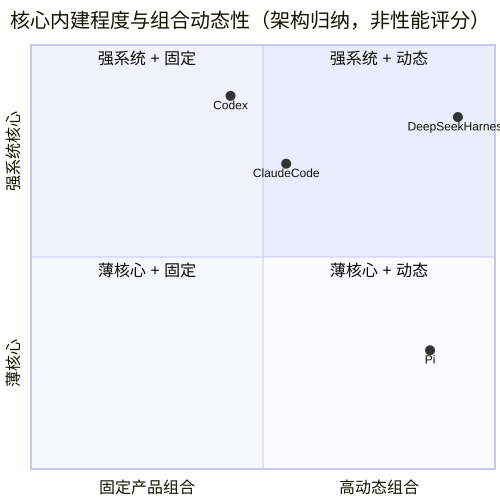

> 比较基线：Pi/Codex/DSH 为 2026-08-29 官方 Git HEAD；Claude Code 内部实现为 2.1.88 source-map 恢复源码，2.1.251 只校准分发与类型契约。`核心`、`插件/扩展`、`实验性`、`契约可见`不是同一成熟度。

## 关键源码

- Pi：[`agent-loop.ts`](https://github.com/earendil-works/pi/blob/853a80d26c90a14c1886f0ebb8ffaae133ca2185/packages/agent/src/agent-loop.ts#L156)、[`agent-session.ts`](https://github.com/earendil-works/pi/blob/853a80d26c90a14c1886f0ebb8ffaae133ca2185/packages/coding-agent/src/core/agent-session.ts#L2152)
- Codex：[`session/turn.rs`](https://github.com/openai/codex/blob/6478a751fde8884b2fdc76486fe23175a8e795d4/codex-rs/core/src/session/turn.rs#L296)、[`tools/orchestrator.rs`](https://github.com/openai/codex/blob/6478a751fde8884b2fdc76486fe23175a8e795d4/codex-rs/core/src/tools/orchestrator.rs#L125)
- DeepSeek Harness：[`agent-loop/src/agent.ts`](https://github.com/deepseek-ai/deepseek-harness/blob/cd5ef8148158c3a752a658978873241fdf8e2bbc/packages/core/agent-loop/src/agent.ts#L232)、[`session/src/index.ts`](https://github.com/deepseek-ai/deepseek-harness/blob/cd5ef8148158c3a752a658978873241fdf8e2bbc/packages/core/session/src/index.ts#L699)
- Claude Code：`query.ts:L219`、`toolExecution.ts:L599`

## 结论先行

四者不是同一架构的不同功能表：Pi 追求最小核心和用户扩展；Codex 把 app-server、typed context、安全状态机和 multi-agent control plane 做成系统层；DSH 把 Cordis composition、durable event surface 与 effect lifecycle 放在 loop 之上；Claude Code 以共享 async-generator loop 为中心，向外叠加成熟权限、压缩、subagent 与产品集成。选择时应先确定需要哪一种“控制面”，再比较具体工具数量。

上图是对代码组织的解释性归纳，不是 benchmark 结果：DSH 的动态性来自 Cordis profile/effect；Pi 来自宿主扩展；Codex 的系统性来自协议、store、安全与 control plane；Claude Code 的产品层围绕集中 loop 组装。

## 核心概念

| 标记 | 含义 |
|---|---|
| 核心内置 | 生产主路径直接拥有该状态机或服务 |
| 插件/扩展 | 官方 seam 可实现，但不由核心统一保证 |
| 实验性 | 仓库已有基础实现，生产入口或关键 operation 尚未完整 |
| 契约可见 | 类型/schema 中存在，不能由此证明运行时启用或内部算法 |
| 代码事实 | 能由当前快照的明确调用链与行号直接支持 |
| 架构推断 | 基于多个代码事实解释适配度，不等于 benchmark 结论 |

## 一览矩阵

| 功能轴 | Pi | OpenAI Codex | DeepSeek Harness | Claude Code |
|---|---|---|---|---|
| 核心组织 | `coding-agent → AgentSession → agent-loop` 的小核心；durable harness 仍部分未实现。[`agent-harness.ts:L347-L420`](https://github.com/earendil-works/pi/blob/853a80d26c90a14c1886f0ebb8ffaae133ca2185/packages/agent/src/harness/agent-harness.ts#L347-L420) | `app-server → Session submission → Task → turn` 的协议化系统。[`handlers.rs:L530-L715`](https://github.com/openai/codex/blob/6478a751fde8884b2fdc76486fe23175a8e795d4/codex-rs/core/src/session/handlers.rs#L530-L715) | Cordis Loader/Fiber 全插件宿主，profile 决定产品。[`registry.ts:L293-L336`](https://github.com/deepseek-ai/deepseek-harness/blob/cd5ef8148158c3a752a658978873241fdf8e2bbc/vendor/cordis/src/registry.ts#L293-L336) | 单一 `query()` async-generator loop，REPL/headless/subagent 共用。`query.ts:L219-L321` |
| 模型/provider | 核心多 provider，模型目录+鉴权+stream，约 40 个 factory。[`all.ts:L88-L140`](https://github.com/earendil-works/pi/blob/853a80d26c90a14c1886f0ebb8ffaae133ca2185/packages/ai/src/providers/all.ts#L88-L140) | Responses wire API；provider 可配 auth/retry/WS/search，WS 失败会 session 级降级。[`model-provider-info:L61-L151`](https://github.com/openai/codex/blob/6478a751fde8884b2fdc76486fe23175a8e795d4/codex-rs/model-provider-info/src/lib.rs#L61-L151) | Effect-scoped adapter gateway，generation/config 固定到 prepared call。[`llm/index.ts:L372-L454`](https://github.com/deepseek-ai/deepseek-harness/blob/cd5ef8148158c3a752a658978873241fdf8e2bbc/packages/llm/llm/src/index.ts#L372-L454) | Anthropic 1P、Bedrock、Vertex、Foundry；自管 streaming retry/fallback。`client.ts:L153-L315` |
| Agent loop | 双层：内层 tool/steering，外层 follow-up。[`agent-loop.ts:L156-L272`](https://github.com/earendil-works/pi/blob/853a80d26c90a14c1886f0ebb8ffaae133ca2185/packages/agent/src/agent-loop.ts#L156-L272) | 三层：submission loop、`RegularTask`、`run_turn` sampling。[`turn.rs:L145-L162`](https://github.com/openai/codex/blob/6478a751fde8884b2fdc76486fe23175a8e795d4/codex-rs/core/src/session/turn.rs#L145-L162) | 薄 loop，pre-step waterfall 与 durable events 承担扩展。[`agent.ts:L232-L435`](https://github.com/deepseek-ai/deepseek-harness/blob/cd5ef8148158c3a752a658978873241fdf8e2bbc/packages/core/agent-loop/src/agent.ts#L232-L435) | `while(true)` 中集成 streaming、tools、attachments、compaction。`query.ts:L1360-L1728` |
| 工具管线 | Schema + preflight hook；batch 默认并行，sequential 工具令整批串行。[`agent-loop.ts:L406-L424`](https://github.com/earendil-works/pi/blob/853a80d26c90a14c1886f0ebb8ffaae133ca2185/packages/agent/src/agent-loop.ts#L406-L424) | Router → parallel RW gate → Registry pre/post hooks → handler。[`registry.rs:L582-L755`](https://github.com/openai/codex/blob/6478a751fde8884b2fdc76486fe23175a8e795d4/codex-rs/core/src/tools/registry.rs#L582-L755) | ToolRuntime pre/execute/post；native 与 PTC 共用调度、timeout、events。[`tools/index.ts:L137-L287`](https://github.com/deepseek-ai/deepseek-harness/blob/cd5ef8148158c3a752a658978873241fdf8e2bbc/packages/core/tools/src/index.ts#L137-L287) | Zod/custom validation → PreToolUse → permission → `tool.call` → PostToolUse。`toolExecution.ts:L599-L687` |
| Code mode / PTC | 无核心 code-mode；可由扩展构造。 | 模型使用工具协议；本矩阵未确认通用 PTC SDK。 | 核心支持 native/PTC/both 与 `run_code`，正式 TS runtime 是 worker thread。[`tools/index.ts:L981-L1060`](https://github.com/deepseek-ai/deepseek-harness/blob/cd5ef8148158c3a752a658978873241fdf8e2bbc/packages/core/tools/src/index.ts#L981-L1060) | 工具与 Bash/Agent 为主；2.1.251 类型 surface 有更多 workflow 类工具，但不是 PTC 证据。[`sdk-tools.d.ts:L8-L102`](https://unpkg.com/@anthropic-ai/claude-code@2.1.251/sdk-tools.d.ts) |
| 逐调用审批 | **无核心 permission popup**；扩展可 preflight block。[`README.md:L38-L46`](https://github.com/earendil-works/pi/blob/853a80d26c90a14c1886f0ebb8ffaae133ca2185/README.md#L38-L46) | 核心 policy/guardian/approval cache 状态机。[`orchestrator.rs:L125-L230`](https://github.com/openai/codex/blob/6478a751fde8884b2fdc76486fe23175a8e795d4/codex-rs/core/src/tools/orchestrator.rs#L125-L230) | Permission preset + approval waterfall，缺 answerer fail closed。[`user-approval:L269-L308`](https://github.com/deepseek-ai/deepseek-harness/blob/cd5ef8148158c3a752a658978873241fdf8e2bbc/packages/interaction/user-approval/src/index.ts#L269-L308) | 核心 allow/deny/ask + modes，hook 可影响决定。`Tool.ts:L116-L148` |
| OS/FS sandbox | **无核心沙箱**；官方建议 Gondolin/Docker/OpenShell。[`README.md:L38-L46`](https://github.com/earendil-works/pi/blob/853a80d26c90a14c1886f0ebb8ffaae133ca2185/README.md#L38-L46) | 核心两阶段 sandbox attempt；仅 sandbox denial 可申请升级重试。[`orchestrator.rs:L305-L512`](https://github.com/openai/codex/blob/6478a751fde8884b2fdc76486fe23175a8e795d4/codex-rs/core/src/tools/orchestrator.rs#L305-L512) | Sandbox provider 必须 enforce 或 fail closed；mode 只承诺文件效果。[`sandbox/index.ts:L23-L175`](https://github.com/deepseek-ai/deepseek-harness/blob/cd5ef8148158c3a752a658978873241fdf8e2bbc/packages/sandbox/sandbox/src/index.ts#L23-L175) | 可选 sandbox adapter；默认未开启，底层规则在外部 runtime。`sandbox-adapter.ts:L459-L484` |
| 项目信任/指令 | Trust 只控制项目资源加载/写入，不限制基础工具。[`trust-manager.ts:L178-L207`](https://github.com/earendil-works/pi/blob/853a80d26c90a14c1886f0ebb8ffaae133ca2185/packages/coding-agent/src/core/trust-manager.ts#L178-L207) | 不可信项目跳过 project instructions；配置/managed policy 分层。[`agents_md.rs:L185-L225`](https://github.com/openai/codex/blob/6478a751fde8884b2fdc76486fe23175a8e795d4/codex-rs/core/src/agents_md.rs#L185-L225) | Instructions 根据 cwd/project/touched path 动态刷新并 durable 注入。[`agent-instructions:L80-L221`](https://github.com/deepseek-ai/deepseek-harness/blob/cd5ef8148158c3a752a658978873241fdf8e2bbc/packages/context/agent-instructions/src/index.ts#L80-L221) | CLAUDE.md/多级 memory 注入并标明来源。`claudemd.ts:L1153-L1195` |
| 动态上下文 | System prompt + AGENTS/CLAUDE + skills；extension 可替换/追加。[`system-prompt.ts:L27-L168`](https://github.com/earendil-works/pi/blob/853a80d26c90a14c1886f0ebb8ffaae133ca2185/packages/coding-agent/src/core/system-prompt.ts#L27-L168) | 分角色 instructions + typed WorldState snapshot/RFC7386 diff。[`world_state:L219-L446`](https://github.com/openai/codex/blob/6478a751fde8884b2fdc76486fe23175a8e795d4/codex-rs/core/src/context/world_state/mod.rs#L219-L446) | Ordered prompt sections + durable request header/context events。[`system-prompt:L13-L161`](https://github.com/deepseek-ai/deepseek-harness/blob/cd5ef8148158c3a752a658978873241fdf8e2bbc/packages/core/system-prompt/src/index.ts#L13-L161) | 动态 prompt sections + 缓存 Git system context + user CLAUDE.md context。`context.ts:L36-L176` |
| Session 模型 | v3 append-only JSONL `id/parentId` tree。[`session-manager.ts:L30-L153`](https://github.com/earendil-works/pi/blob/853a80d26c90a14c1886f0ebb8ffaae133ca2185/packages/coding-agent/src/core/session-manager.ts#L30-L153) | `ThreadStore` trait；durable rollout + SQLite projection，可 copied/reference fork。[`store.rs:L55-L169`](https://github.com/openai/codex/blob/6478a751fde8884b2fdc76486fe23175a8e795d4/codex-rs/thread-store/src/store.rs#L55-L169) | Append-only event log，model surface 由 `surfaceOp` 派生。[`session/index.ts:L699-L744`](https://github.com/deepseek-ai/deepseek-harness/blob/cd5ef8148158c3a752a658978873241fdf8e2bbc/packages/core/session/src/index.ts#L699-L744) | JSONL append + `parentUuid` chain；subagent sidechain 独立。`sessionStorage.ts:L198-L303` |
| Compaction | threshold/overflow/manual；扩展可取消或替换；overflow 最多 retry 一次。[`agent-session.ts:L2152-L2354`](https://github.com/earendil-works/pi/blob/853a80d26c90a14c1886f0ebb8ffaae133ca2185/packages/coding-agent/src/core/agent-session.ts#L2152-L2354) | Pre/mid/manual；remote/local capability 分派，loop 内一等状态转换。[`tasks/compact.rs:L28-L84`](https://github.com/openai/codex/blob/6478a751fde8884b2fdc76486fe23175a8e795d4/codex-rs/core/src/tasks/compact.rs#L28-L84) | Pressure/overflow → durable surface replacement；可先无模型 prune。[`compaction-basic:L126-L331`](https://github.com/deepseek-ai/deepseek-harness/blob/cd5ef8148158c3a752a658978873241fdf8e2bbc/packages/compaction/compaction-basic/src/index.ts#L126-L331) | microcompact/collapse/full compact；重注入文件、MCP、agent、hooks。`compact.ts:L325-L748` |
| Subagent | 核心不内置；示例扩展以子进程启动 Pi，并发 4。[`subagent/index.ts:L1-L34`](https://github.com/earendil-works/pi/blob/853a80d26c90a14c1886f0ebb8ffaae133ca2185/packages/coding-agent/examples/extensions/subagent/index.ts#L1-L34) | 原生 V2 root-tree `AgentControl`、lineage、mailbox、limits。[`control.rs:L111-L174`](https://github.com/openai/codex/blob/6478a751fde8884b2fdc76486fe23175a8e795d4/codex-rs/core/src/agent/control.rs#L111-L174) | Provider registry；in-process continuable 与 Codex/Claude fresh-context bridge。[`subagent/index.ts:L195-L349`](https://github.com/deepseek-ai/deepseek-harness/blob/cd5ef8148158c3a752a658978873241fdf8e2bbc/packages/subagent/subagent/src/index.ts#L195-L349) | 原生 AgentTool，共用 query；独立 sidechain/MCP/hooks，支持 background/worktree/team。`runAgent.ts:L648-L834` |
| MCP | 核心明确不内置；扩展/package 实现。[`coding-agent/README.md:L495-L509`](https://github.com/earendil-works/pi/blob/853a80d26c90a14c1886f0ebb8ffaae133ca2185/packages/coding-agent/README.md#L495-L509) | 核心 runtime projection，环境/auth 改变时原子发布。[`session/mcp.rs:L90-L255`](https://github.com/openai/codex/blob/6478a751fde8884b2fdc76486fe23175a8e795d4/codex-rs/core/src/session/mcp.rs#L90-L255) | 普通 Tool Provider；stdio/Streamable HTTP、热同步与原子 replacement。[`mcp-client/tools.ts:L119-L193`](https://github.com/deepseek-ai/deepseek-harness/blob/cd5ef8148158c3a752a658978873241fdf8e2bbc/packages/mcp/mcp-client/src/tools.ts#L119-L193) | 核心产品层支持 stdio/SSE/Streamable HTTP、OAuth 与多类 resources。`mcp/client.ts:L595-L865` |
| Skills | 核心 resource loader 原生支持 `SKILL.md`。[`skills.ts:L67-L220`](https://github.com/earendil-works/pi/blob/853a80d26c90a14c1886f0ebb8ffaae133ca2185/packages/coding-agent/src/core/skills.ts#L67-L220) | Skills host service，按 config/cwd/plugin roots 缓存隔离视图。[`host_service.rs:L112-L365`](https://github.com/openai/codex/blob/6478a751fde8884b2fdc76486fe23175a8e795d4/codex-rs/ext/skills/src/host_service.rs#L112-L365) | Ranked scoped registry，stable snapshot 才 durable 注入。[`tool-skill:L206-L251`](https://github.com/deepseek-ai/deepseek-harness/blob/cd5ef8148158c3a752a658978873241fdf8e2bbc/packages/skill/tool-skill/src/index.ts#L206-L251) | Rich frontmatter、dynamic/path conditional discovery。`loadSkillsDir.ts:L180-L264` |
| 插件/Hooks | TS/JS 宿主扩展；可注册工具/provider/UI/事件，继承全权限。[`loader.ts:L500-L518`](https://github.com/earendil-works/pi/blob/853a80d26c90a14c1886f0ebb8ffaae133ca2185/packages/coding-agent/src/core/extensions/loader.ts#L500-L518) | Plugins/skills/MCP + session/prompt/tool/compact/stop hooks。[`hooks/registry.rs:L91-L280`](https://github.com/openai/codex/blob/6478a751fde8884b2fdc76486fe23175a8e795d4/codex-rs/hooks/src/registry.rs#L91-L280) | 所有行为都是 effect-scoped plugin；bundle dependency 进入 patch stack。[`apps/cli/plugin.ts:L47-L162`](https://github.com/deepseek-ai/deepseek-harness/blob/cd5ef8148158c3a752a658978873241fdf8e2bbc/apps/cli/src/plugin.ts#L47-L162) | Plugins 聚合 commands/agents/hooks；managed policy 优先，启动 cache-only。`pluginLoader.ts:L2995-L3145` |
| UI/远程接口 | 差分 TUI、TS SDK、stdio JSONL RPC；新 CBOR client/server 实验线。[`protocol/README.md:L1-L16`](https://github.com/earendil-works/pi/blob/853a80d26c90a14c1886f0ebb8ffaae133ca2185/packages/protocol/README.md#L1-L16) | TUI/exec/Python SDK 共 app-server；TS SDK 仍 exec JSONL wrapper。[`sdk/typescript/exec.ts:L91-L119`](https://github.com/openai/codex/blob/6478a751fde8884b2fdc76486fe23175a8e795d4/sdk/typescript/src/exec.ts#L91-L119) | Web Typert HTTP/WS、headless、ACP 共用 profile/session core。[`gateway/index.ts:L594-L645`](https://github.com/deepseek-ai/deepseek-harness/blob/cd5ef8148158c3a752a658978873241fdf8e2bbc/packages/api/gateway/src/index.ts#L594-L645) | React/Ink REPL + print/stream-json control plane。`print.ts:L2863-L3079` |
| 测试/可复现 | 隔离 HOME/TMP/git/API env 的 workspace tests。[`test.sh:L1-L79`](https://github.com/earendil-works/pi/blob/853a80d26c90a14c1886f0ebb8ffaae133ca2185/test.sh#L1-L79) | Rust nextest + Python pytest + TS Jest；feature/config 层集中验证。[`justfile:L81-L92`](https://github.com/openai/codex/blob/6478a751fde8884b2fdc76486fe23175a8e795d4/justfile#L81-L92) | Profile-level snapshot/replay 固定 composition、prompt、tools、permissions。[`suite.ts:L1-L64`](https://github.com/deepseek-ai/deepseek-harness/blob/cd5ef8148158c3a752a658978873241fdf8e2bbc/packages/test-support/session-snapshot/src/suite.ts#L1-L64) | 恢复 artifact 没有公开 tests；仅能看到 analytics/OTel/profiler。`package.json:L7-L18` |

## 选择建议（由机制推导，不是绝对排名）

| 目标 | 更匹配的架构 | 原因 |
|---|---|---|
| 快速接不同 LLM/provider、自己定义 agent 体验 | Pi | Provider 与宿主 extension 是第一等能力，核心约束少；需要自行承担安全/调度集成。 |
| 构建可靠本地/远程 coding-agent 客户端或强安全执行链 | Codex | app-server、typed world state、approval+sandbox orchestrator、ThreadStore 的系统边界清晰。 |
| 研究可重放组合、动态插件生命周期、Web/headless/ACP 同核 | DeepSeek Harness | Cordis effect、durable Session surface 与 profile composition 直接服务这一目标。 |
| 需要成熟交互产品、复杂权限、subagent/worktree、广泛集成 | Claude Code | 2.1.88 可见的产品层最完整；最新版内部实现不可静态审计是重要限制。 |

这些建议来自架构适配度，不代表模型质量、完成率、延迟或成本。四个仓库未在同一模型、任务、权限和硬件条件下跑 benchmark，不能从源码功能推出性能排序。

## 系列导航

- [Agent loop 与工具执行](/blog/coding-agent-loop-tools/)
- [权限、沙箱与扩展](/blog/coding-agent-security-extensions/)
- [上下文、会话、压缩与子代理](/blog/coding-agent-context-session-subagents/)
- [接口、UI、协议与可观测性](/blog/coding-agent-interfaces-observability/)
- [Pi](/blog/pi-agent-source-analysis/) · [Codex](/blog/openai-codex-source-analysis/) · [DSH](/blog/deepseek-harness-source-analysis/) · [Claude Code](/blog/claude-code-source-analysis/)

## 活跃开发方向

- Pi durable harness/server 与生产 CLI 的汇合。
- Codex app-server/multi-agent V2/remote stores。
- DSH scoped composition、PTC runtime 与 Web reconnect。
- Claude Code 原生分发后的公开契约与可审计实现差距。

## 待调查问题

- **[待调查]** 统一模型、任务、温度、工具 schema 和 sandbox 条件下的端到端行为/性能对比。
- **[待调查]** 四者在进程崩溃、断网、半完成工具调用和中途审批时的可恢复性测试。
- **[待调查]** Skills/plugins/MCP 的供应链威胁模型与默认安全基线。
- **[待调查]** 多代理预算、公平调度、取消传播与孤儿清理的同场故障注入。
- **[待调查]** Claude Code 2.1.251 的真实内部实现可能已改变矩阵中的 2.1.88 行为。
