## 关键源码

- Pi：[`main.ts`](https://github.com/earendil-works/pi/blob/853a80d26c90a14c1886f0ebb8ffaae133ca2185/packages/coding-agent/src/main.ts#L927)、[`rpc-types.ts`](https://github.com/earendil-works/pi/blob/853a80d26c90a14c1886f0ebb8ffaae133ca2185/packages/coding-agent/src/modes/rpc/rpc-types.ts#L1)、[`protocol/README.md`](https://github.com/earendil-works/pi/blob/853a80d26c90a14c1886f0ebb8ffaae133ca2185/packages/protocol/README.md#L1)
- Codex：[`app-server/src/lib.rs`](https://github.com/openai/codex/blob/6478a751fde8884b2fdc76486fe23175a8e795d4/codex-rs/app-server/src/lib.rs#L161)、[`tui/src/lib.rs`](https://github.com/openai/codex/blob/6478a751fde8884b2fdc76486fe23175a8e795d4/codex-rs/tui/src/lib.rs#L282)、[`sdk/python/client.py`](https://github.com/openai/codex/blob/6478a751fde8884b2fdc76486fe23175a8e795d4/sdk/python/src/openai_codex/client.py#L238)
- DeepSeek Harness：[`api/gateway/src/index.ts`](https://github.com/deepseek-ai/deepseek-harness/blob/cd5ef8148158c3a752a658978873241fdf8e2bbc/packages/api/gateway/src/index.ts#L168)、[`acp/src/index.ts`](https://github.com/deepseek-ai/deepseek-harness/blob/cd5ef8148158c3a752a658978873241fdf8e2bbc/packages/acp/acp/src/index.ts#L151)、[`bundle/headless/src/index.ts`](https://github.com/deepseek-ai/deepseek-harness/blob/cd5ef8148158c3a752a658978873241fdf8e2bbc/packages/bundle/headless/src/index.ts#L162)
- Claude Code：`screens/REPL.tsx:L572`、`cli/print.ts:L2863`、`analytics/index.ts:L125`

## 结论先行

Codex 的前端协议统一度最高：TUI、exec 和 Python SDK 都通过 app-server，只有 TS SDK 仍是 exec JSONL wrapper。DSH 的统一不是单一 wire protocol，而是 profile/session core：Web 用 Typert HTTP+WS，自动化用 ACP stdio，headless 直接消费同一 durable log。Pi 当前稳定面是 TUI/TS SDK/JSONL RPC，同时建设 CBOR client/server；新旧线并存。Claude Code 2.1.88 有 React/Ink REPL 和功能很丰富的 stream-json control plane，但没有从恢复 artifact 得到一个可与 app-server 等价承诺的外部协议。测试上，DSH 最强调 profile-level replay，Codex 覆盖多语言层，Pi 强调环境隔离，Claude 恢复包无法展示官方 tests。

## 核心概念

| 概念 | 判断问题 |
|---|---|
| Protocol spine | 多个前端是否通过同一有版本协议访问 core？ |
| In-process client | 是否仍经过协议对象，还是直接调内部方法？ |
| Control plane | Headless 输入能否动态改 model/permission/MCP/session？ |
| Snapshot/replay | 测试是否固定模型请求、工具 schema、权限与持久化输出？ |
| Config precedence | 组织、用户、项目、session 哪层能覆盖哪层？ |
| Telemetry boundary | 事件、prompt、cost、tool、startup 如何采集与脱敏？ |

## 1. 前端与核心的连接拓扑

## 2. Pi：稳定 JSONL RPC 与新 CBOR 线

CLI 把 RPC、JSON、print、interactive 分派到同一 runtime；稳定 RPC 是 LF-delimited JSONL，覆盖 prompt、queue、model、compaction、session/tree 等命令。[`main.ts:L927-L976`](https://github.com/earendil-works/pi/blob/853a80d26c90a14c1886f0ebb8ffaae133ca2185/packages/coding-agent/src/main.ts#L927-L976) [`rpc-types.ts:L1-L74`](https://github.com/earendil-works/pi/blob/853a80d26c90a14c1886f0ebb8ffaae133ca2185/packages/coding-agent/src/modes/rpc/rpc-types.ts#L1-L74) Extension UI 在 RPC 中只映射一部分，若干 TUI-only 能力明确不支持。[`rpc-mode.ts:L133-L230`](https://github.com/earendil-works/pi/blob/853a80d26c90a14c1886f0ebb8ffaae133ca2185/packages/coding-agent/src/modes/rpc/rpc-mode.ts#L133-L230)

TUI 自身是可复用差分渲染包，支持 main/alternate screen 与 synchronized output。[`tui/README.md:L1-L16`](https://github.com/earendil-works/pi/blob/853a80d26c90a14c1886f0ebb8ffaae133ca2185/packages/tui/README.md#L1-L16) [`tui/README.md:L55-L83`](https://github.com/earendil-works/pi/blob/853a80d26c90a14c1886f0ebb8ffaae133ca2185/packages/tui/README.md#L55-L83) 新协议使用 `uint32-be length + CBOR`，首消息必须 hello/version；server 限制帧大小与握手超时，client 用 authoritative snapshot 和 shared/exclusive session leases，且不自动 reconnect。[`protocol/README.md:L1-L16`](https://github.com/earendil-works/pi/blob/853a80d26c90a14c1886f0ebb8ffaae133ca2185/packages/protocol/README.md#L1-L16) [`server.rs:L112-L240`](https://github.com/earendil-works/pi/blob/853a80d26c90a14c1886f0ebb8ffaae133ca2185/packages/server/src/server.ts#L112-L240) [`client/README.md:L26-L34`](https://github.com/earendil-works/pi/blob/853a80d26c90a14c1886f0ebb8ffaae133ca2185/packages/client/README.md#L26-L34)

当前文档和实现不足以证明 CBOR server 已取代 JSONL RPC；产品集成应把二者视为稳定/实验两条线。

## 3. Codex：App-server 协议脊柱

App-server 支持 stdio、Unix socket 与 WebSocket，内部把 processor 和 outbound writer 分成两个 loop。[`app-server/main.rs:L20-L63`](https://github.com/openai/codex/blob/6478a751fde8884b2fdc76486fe23175a8e795d4/codex-rs/app-server/src/main.rs#L20-L63) [`app-server/lib.rs:L161-L184`](https://github.com/openai/codex/blob/6478a751fde8884b2fdc76486fe23175a8e795d4/codex-rs/app-server/src/lib.rs#L161-L184) TUI 可选择 Embedded、LocalDaemon、Remote target；`exec` 构造 in-process app-server client，所以即使同进程也保持协议边界。[`tui/lib.rs:L282-L326`](https://github.com/openai/codex/blob/6478a751fde8884b2fdc76486fe23175a8e795d4/codex-rs/tui/src/lib.rs#L282-L326) [`exec/lib.rs:L541-L570`](https://github.com/openai/codex/blob/6478a751fde8884b2fdc76486fe23175a8e795d4/codex-rs/exec/src/lib.rs#L541-L570)

Python SDK 启动 `codex app-server --listen stdio://`，reader thread 路由 request/notification；wire messages 省略标准 JSON-RPC 的 `jsonrpc` 字段。[`sdk/python/client.py:L238-L347`](https://github.com/openai/codex/blob/6478a751fde8884b2fdc76486fe23175a8e795d4/sdk/python/src/openai_codex/client.py#L238-L347) [`app-server-protocol/rpc.rs:L1-L88`](https://github.com/openai/codex/blob/6478a751fde8884b2fdc76486fe23175a8e795d4/codex-rs/app-server-protocol/src/rpc.rs#L1-L88) TypeScript SDK 仍启动 `codex exec --experimental-json`，逐行读 JSONL 由 `Thread` 聚合事件。[`sdk/typescript/exec.ts:L91-L119`](https://github.com/openai/codex/blob/6478a751fde8884b2fdc76486fe23175a8e795d4/sdk/typescript/src/exec.ts#L91-L119) [`sdk/typescript/exec.ts:L223-L258`](https://github.com/openai/codex/blob/6478a751fde8884b2fdc76486fe23175a8e795d4/sdk/typescript/src/exec.ts#L223-L258) 因此“所有 SDK 已统一”是不正确的；Python 和 TS 当前走不同架构。

## 4. DeepSeek Harness：同核、多协议、动态 Gateway

DSH Web `/api` 先过 Host/Origin trust fence 和浏览器认证；unary Remote 是 endpoint 与 envelope method 必须一致的 HTTP JSON POST。[`connection/index.ts:L69-L127`](https://github.com/deepseek-ai/deepseek-harness/blob/cd5ef8148158c3a752a658978873241fdf8e2bbc/packages/client/connection/src/index.ts#L69-L127) [`rpc-host.ts:L203-L246`](https://github.com/deepseek-ai/deepseek-harness/blob/cd5ef8148158c3a752a658978873241fdf8e2bbc/packages/client/connection/src/rpc-host.ts#L203-L246) Typert Gateway 从当前 Cordis Service/Remote definitions 动态建立路由，stream 则走认证 WebSocket upgrade；一条物理 WS multiplex 多个逻辑 streams，包含 cancel/heartbeat/iterator teardown。[`gateway/index.ts:L168-L233`](https://github.com/deepseek-ai/deepseek-harness/blob/cd5ef8148158c3a752a658978873241fdf8e2bbc/packages/api/gateway/src/index.ts#L168-L233) [`gateway/index.ts:L594-L645`](https://github.com/deepseek-ai/deepseek-harness/blob/cd5ef8148158c3a752a658978873241fdf8e2bbc/packages/api/gateway/src/index.ts#L594-L645) [`stream-server.ts:L22-L181`](https://github.com/deepseek-ai/deepseek-harness/blob/cd5ef8148158c3a752a658978873241fdf8e2bbc/packages/api/gateway/src/stream-server.ts#L22-L181)

ACP 是 trusted automation-only JSON-RPC stdio server，支持 session create/list/resume/close、MCP、prompt、cancel 和一次性审批；输出从 committed assistant/tool events 转换。[`acp/index.ts:L1-L8`](https://github.com/deepseek-ai/deepseek-harness/blob/cd5ef8148158c3a752a658978873241fdf8e2bbc/packages/acp/acp/src/index.ts#L1-L8) [`acp/index.ts:L151-L188`](https://github.com/deepseek-ai/deepseek-harness/blob/cd5ef8148158c3a752a658978873241fdf8e2bbc/packages/acp/acp/src/index.ts#L151-L188) [`acp/updates.ts:L16-L84`](https://github.com/deepseek-ai/deepseek-harness/blob/cd5ef8148158c3a752a658978873241fdf8e2bbc/packages/acp/acp/src/updates.ts#L16-L84) Headless 没有 Host/Web，直接创建 Agent、等 idle、flush Session，再从 durable log 取最终文本。[`headless/index.ts:L162-L205`](https://github.com/deepseek-ai/deepseek-harness/blob/cd5ef8148158c3a752a658978873241fdf8e2bbc/packages/bundle/headless/src/index.ts#L162-L205)

DSH 的统一点是 Agent/Session/plugin composition，而不是强制每个 carrier 使用同一 frame format。

## 5. Claude Code：REPL 与 stream-json control plane

交互 UI 是 React/Ink REPL，集中订阅 permission、MCP、plugins、agents、tasks、sandbox 等 AppState。`REPL.tsx:L572-L640` Headless/SDK 的 stream-json control protocol 能 initialize、切 permission/model/thinking、查询/设置 MCP servers、reload plugins。`print.ts:L2863-L2957` `print.ts:L3055-L3079` `QueryEngine` 又为一会话一实例的 programmatic consumer 提供 wall/API time、turn/cost/usage/modelUsage/permission denial 聚合。`QueryEngine.ts:L175-L209` `QueryEngine.ts:L608-L637`

2.1.251 wrapper 已转原生 binary，公开 `sdk-tools.d.ts` 说明工具输入输出契约；它不能证明内部 control protocol 与 2.1.88 完全一致。[`2.1.251/package.json:L1-L38`](https://unpkg.com/@anthropic-ai/claude-code@2.1.251/package.json) [`sdk-tools.d.ts:L8-L207`](https://unpkg.com/@anthropic-ai/claude-code@2.1.251/sdk-tools.d.ts)

## 6. 配置与动态更新

| Agent | 配置合并 | 运行时更新特征 |
|---|---|---|
| Pi | Global + project deep merge，project 优先；untrusted project 不可写 project settings。[`settings-manager.ts:L94-L174`](https://github.com/earendil-works/pi/blob/853a80d26c90a14c1886f0ebb8ffaae133ca2185/packages/coding-agent/src/core/settings-manager.ts#L94-L174) | Resource reload 统一刷新 extensions/skills/prompts/themes/context；写入串行加锁。[`settings-manager.ts:L577-L689`](https://github.com/earendil-works/pi/blob/853a80d26c90a14c1886f0ebb8ffaae133ca2185/packages/coding-agent/src/core/settings-manager.ts#L577-L689) |
| Codex | Packaged→MDM→system→enterprise→user/profile→project→session→legacy managed。[`config_layer_source.rs:L4-L58`](https://github.com/openai/codex/blob/6478a751fde8884b2fdc76486fe23175a8e795d4/codex-rs/config/src/config_layer_source.rs#L4-L58) | Feature registry 有 stage/default；project layers 强制 root→cwd 顺序。[`features/lib.rs:L395-L469`](https://github.com/openai/codex/blob/6478a751fde8884b2fdc76486fe23175a8e795d4/codex-rs/features/src/lib.rs#L395-L469) |
| DSH | Bundle→profile user→home user→CLI overlays→telemetry patch。[`profile-boot.ts:L124-L172`](https://github.com/deepseek-ai/deepseek-harness/blob/cd5ef8148158c3a752a658978873241fdf8e2bbc/apps/cli/src/profile-boot.ts#L124-L172) | Web profile watch patches；Fiber effect 提供原子 teardown/reload，headless/ACP frozen。 |
| Claude Code | CLI/env/settings/managed policy 在各子系统分层解析。 | Plugin startup cache-only；sandbox settings 可动态 refresh。`pluginLoader.ts:L3110-L3145` `sandbox-adapter.ts:L702-L780` |

## 7. 可观测性

Pi 仓库有 vendor-neutral telemetry contracts/reference adapter/conformance package，agent loop 也发出明确 lifecycle events；当前追踪没有把全部 backend exporter 跑通。[`README.md:L28-L34`](https://github.com/earendil-works/pi/blob/853a80d26c90a14c1886f0ebb8ffaae133ca2185/README.md#L28-L34) [`agent-loop.ts:L96-L143`](https://github.com/earendil-works/pi/blob/853a80d26c90a14c1886f0ebb8ffaae133ca2185/packages/agent/src/agent-loop.ts#L96-L143)

Codex 把 pre/post hooks、tool registry telemetry、app-server events 和 rollout/thread store 串联；exact `StepContext` 使事件能归因到实际 step。[`registry.rs:L582-L755`](https://github.com/openai/codex/blob/6478a751fde8884b2fdc76486fe23175a8e795d4/codex-rs/core/src/tools/registry.rs#L582-L755) [`turn.rs:L296-L395`](https://github.com/openai/codex/blob/6478a751fde8884b2fdc76486fe23175a8e795d4/codex-rs/core/src/session/turn.rs#L296-L395)

DSH 的 observability 首先是 session event log：raw chunks、assembled message、tool call/result、request headers/context 都 durable；post-commit observer 失败不回滚事实。[`session/types.ts:L221-L301`](https://github.com/deepseek-ai/deepseek-harness/blob/cd5ef8148158c3a752a658978873241fdf8e2bbc/packages/core/session/src/types.ts#L221-L301) [`session/index.ts:L567-L646`](https://github.com/deepseek-ai/deepseek-harness/blob/cd5ef8148158c3a752a658978873241fdf8e2bbc/packages/core/session/src/index.ts#L567-L646)

Claude Code 2.1.88 包含 analytics queue、OpenTelemetry events 与 query/startup profiler，默认对用户 prompt redaction。`analytics/index.ts:L125-L164` `telemetry/events.ts:L13-L24` `queryProfiler.ts:L1-L28`

## 8. 测试策略

- **Pi**：根脚本清空/隔离 HOME、TMP、npm、git 和 API key 环境后运行 workspace tests；无 key 时跳过 LLM-dependent tests。[`test.sh:L1-L79`](https://github.com/earendil-works/pi/blob/853a80d26c90a14c1886f0ebb8ffaae133ca2185/test.sh#L1-L79)
- **Codex**：Rust 常规入口用 nextest/no-fail-fast，Python SDK 用 pytest，TS SDK 用 Jest。[`justfile:L81-L92`](https://github.com/openai/codex/blob/6478a751fde8884b2fdc76486fe23175a8e795d4/justfile#L81-L92) [`sdk/python/pyproject.toml:L27-L41`](https://github.com/openai/codex/blob/6478a751fde8884b2fdc76486fe23175a8e795d4/sdk/python/pyproject.toml#L27-L41) [`sdk/typescript/package.json:L34-L45`](https://github.com/openai/codex/blob/6478a751fde8884b2fdc76486fe23175a8e795d4/sdk/typescript/package.json#L34-L45)
- **DSH**：Snapshot 通过 shipped profile 入口启动，JSONL 同时作 replay input 与 expected output；manifest pin composition/header/prompt/tool schema/permission/workspace oracle，并区分 keyless replay、live record、keyless refresh。[`snapshots/AGENTS.md:L3-L15`](https://github.com/deepseek-ai/deepseek-harness/blob/cd5ef8148158c3a752a658978873241fdf8e2bbc/snapshots/AGENTS.md#L3-L15) [`manifest.ts:L6-L104`](https://github.com/deepseek-ai/deepseek-harness/blob/cd5ef8148158c3a752a658978873241fdf8e2bbc/packages/test-support/session-snapshot/src/manifest.ts#L6-L104) [`suite.ts:L1-L64`](https://github.com/deepseek-ai/deepseek-harness/blob/cd5ef8148158c3a752a658978873241fdf8e2bbc/packages/test-support/session-snapshot/src/suite.ts#L1-L64)
- **Claude Code**：恢复 source artifact 没有 test/spec files，package scripts 只有 prepare/build/check/start；不能据此推断 Anthropic 内部 coverage。`package.json:L7-L18`

DSH 的公开 replay discipline 最强；Codex 的多层语言/协议覆盖最广；Pi 的环境隔离脚本最直观；Claude 的测试结论受发布证据限制。仍没有任何一方在本任务中完成四者统一 fault suite。

## 9. 集成选择

| 集成目标 | 优先考察 |
|---|---|
| 写长期维护的远程/GUI 客户端 | Codex app-server 版本与 transport；DSH Typert/ACP 的 carrier 选择 |
| 只需简单本地自动化 | Pi JSONL RPC；Claude stream-json；Codex exec/SDK；DSH headless |
| 嵌入同进程 | Pi TS SDK；Codex in-process app-server client；DSH Cordis profile；Claude `QueryEngine`（2.1.88 事实） |
| 需要 replay/audit | DSH Session surface；Codex rollout/ThreadStore；Pi/Claude JSONL chain 需自行构建投影 |
| 需要动态配置/HMR | DSH Web profile最系统；Pi resource reload 与 Claude plugin/sandbox refresh 次之 |

## 系列导航

- [功能总矩阵](/blog/coding-agent-feature-matrix/)
- [Agent loop 与工具执行](/blog/coding-agent-loop-tools/)
- [权限、沙箱与扩展](/blog/coding-agent-security-extensions/)
- [上下文、会话、压缩与子代理](/blog/coding-agent-context-session-subagents/)

## 活跃开发方向

- Pi CBOR server/client 与 JSONL RPC 关系。
- Codex app-server v1/v2、daemon/remote 与 TS SDK migration。
- DSH Web reconnect、Typert schema evolution 与 ACP version negotiation。
- Claude Code 原生 binary 的公开 SDK/control protocol 稳定面。

## 待调查问题

- **[待调查]** 四个 headless 接口对同一 cancel/approval/MCP-reload 序列的协议兼容测试。
- **[待调查]** App-server v1/v2、Pi CBOR、ACP 与 Claude stream-json 的版本协商/弃用承诺。
- **[待调查]** DSH Web 重连后的 baseline/incremental ordering 与流丢失恢复。
- **[待调查]** 统一 OTel trace schema，跨模型请求、工具、subagent、compaction 关联 span。
- **[待调查]** Claude Code 2.1.251 是否仍接受 2.1.88 stream-json control messages。
- **[待调查]** 在无真实 API key 条件下建立统一 deterministic replay/fault harness。
