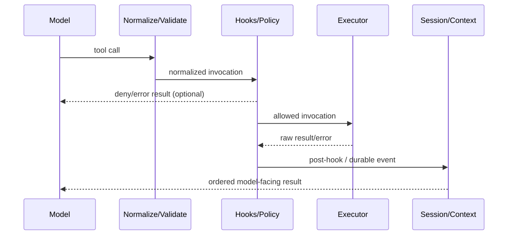

## 关键源码

- Pi：[`agent-loop.ts`](https://github.com/earendil-works/pi/blob/853a80d26c90a14c1886f0ebb8ffaae133ca2185/packages/agent/src/agent-loop.ts#L96)、[`agent.ts`](https://github.com/earendil-works/pi/blob/853a80d26c90a14c1886f0ebb8ffaae133ca2185/packages/agent/src/agent.ts#L125)
- Codex：[`session/turn.rs`](https://github.com/openai/codex/blob/6478a751fde8884b2fdc76486fe23175a8e795d4/codex-rs/core/src/session/turn.rs#L296)、[`tools/router.rs`](https://github.com/openai/codex/blob/6478a751fde8884b2fdc76486fe23175a8e795d4/codex-rs/core/src/tools/router.rs#L245)、[`tools/registry.rs`](https://github.com/openai/codex/blob/6478a751fde8884b2fdc76486fe23175a8e795d4/codex-rs/core/src/tools/registry.rs#L582)
- DeepSeek Harness：[`agent-loop/src/agent.ts`](https://github.com/deepseek-ai/deepseek-harness/blob/cd5ef8148158c3a752a658978873241fdf8e2bbc/packages/core/agent-loop/src/agent.ts#L232)、[`core/tools/src/index.ts`](https://github.com/deepseek-ai/deepseek-harness/blob/cd5ef8148158c3a752a658978873241fdf8e2bbc/packages/core/tools/src/index.ts#L137)
- Claude Code：`query.ts:L219`、`toolExecution.ts:L599`

## 结论先行

四者循环都实现“采样 → 工具 → 把结果交还模型”，但控制权落点不同。Pi 把最小双层循环暴露给扩展；Codex 用 submission/task/step 三层把外部操作与当前 turn 解耦；DSH 把 loop 缩到事件提交和 waterfall，把行为移至 plugins；Claude Code 在单一 async-generator 状态机中整合产品能力。工具侧对应四种风格：Pi 的简洁 batch executor、Codex 的 router/registry/orchestrator 分层、DSH 的 native/PTC 统一 runtime、Claude Code 的验证/hooks/permissions 管线。

## 核心概念

| 概念 | 问题 |
|---|---|
| Turn vs step | 一次用户输入中，模型因工具结果继续采样几次？ |
| Steering | 工具执行中或两次采样间的新输入如何进入？ |
| Exact context | 并发期间一次 tool/sample 读取的是启动时还是最新状态？ |
| Tool normalization | 不同 wire-format call 在哪一层转为统一 invocation？ |
| Ordering | 并发完成顺序与写回模型的顺序是否相同？ |
| Lifecycle hooks | 参数修改、阻断、输出重写与遥测在哪一层发生？ |
| Failure encoding | 异常抛出、tool-result error、durable event 各自如何影响 loop？ |

## 1. 四种控制流

### Pi：外层 follow-up，内层 steering/tool

Pi 在注入 prompt 后发出 agent/turn/message events，内层消费 tool calls 和 steering，外层在一次自然 turn 结束后消费 follow-up。[`agent-loop.ts:L96-L143`](https://github.com/earendil-works/pi/blob/853a80d26c90a14c1886f0ebb8ffaae133ca2185/packages/agent/src/agent-loop.ts#L96-L143) [`agent-loop.ts:L156-L272`](https://github.com/earendil-works/pi/blob/853a80d26c90a14c1886f0ebb8ffaae133ca2185/packages/agent/src/agent-loop.ts#L156-L272) `Agent` 明确维护两个队列，所以“打断当前工作”和“本轮后追加任务”是不同语义。[`agent.ts:L125-L159`](https://github.com/earendil-works/pi/blob/853a80d26c90a14c1886f0ebb8ffaae133ca2185/packages/agent/src/agent.ts#L125-L159) [`agent.ts:L282-L305`](https://github.com/earendil-works/pi/blob/853a80d26c90a14c1886f0ebb8ffaae133ca2185/packages/agent/src/agent.ts#L282-L305)

### Codex：Submission → Task → sampling step

Codex 的 submission loop 先路由 turn、approval、compact、rollback、MCP reload 等操作；普通 turn 才创建 `RegularTask`，后者再进入 `run_turn`。[`handlers.rs:L530-L715`](https://github.com/openai/codex/blob/6478a751fde8884b2fdc76486fe23175a8e795d4/codex-rs/core/src/session/handlers.rs#L530-L715) [`regular.rs:L30-L95`](https://github.com/openai/codex/blob/6478a751fde8884b2fdc76486fe23175a8e795d4/codex-rs/core/src/tasks/regular.rs#L30-L95) 每个 sampling step 捕获 exact `StepContext`，采样后综合 tool follow-up、pending input 和 token 状态决定下一步。[`turn.rs:L296-L500`](https://github.com/openai/codex/blob/6478a751fde8884b2fdc76486fe23175a8e795d4/codex-rs/core/src/session/turn.rs#L296-L500) 这是四者中最明确区分“外部 session 操作”和“当前采样状态”的实现。

### DSH：Durable events 包围薄 loop

DSH 每步 claim inbox、组装上下文并运行 pre-step waterfall；turn/step/user/stop 先落 event log，LLM raw chunks 与 assembled message 也持久化，然后才执行工具。[`agent.ts:L232-L336`](https://github.com/deepseek-ai/deepseek-harness/blob/cd5ef8148158c3a752a658978873241fdf8e2bbc/packages/core/agent-loop/src/agent.ts#L232-L336) [`agent.ts:L339-L435`](https://github.com/deepseek-ai/deepseek-harness/blob/cd5ef8148158c3a752a658978873241fdf8e2bbc/packages/core/agent-loop/src/agent.ts#L339-L435) Loop 算法本身简单，关键不变量是任何 model-visible surface 都可由 durable events 重建。

### Claude Code：产品能力进入一个 async-generator 状态机

`queryLoop` 用可变 State 和 `while(true)` 推进，每次调用前先执行 microcompact/context collapse/autocompact。`query.ts:L219-L321` `query.ts:L412-L468` 工具后再吸收 memory/skill/notification attachments、刷新 MCP 和构造下一轮 State。`query.ts:L1659-L1728` 集中 loop 易于共享给 REPL/SDK/subagent，但 feature-gated 路径也更密集。

## 2. 模型调用边界

| Agent | 请求对象的生命周期 | Provider/transport 关键语义 |
|---|---|---|
| Pi | 每次调用在 `transformContext → convertToLlm → streamFn` 边界动态取 model/auth。[`agent-loop.ts:L275-L310`](https://github.com/earendil-works/pi/blob/853a80d26c90a14c1886f0ebb8ffaae133ca2185/packages/agent/src/agent-loop.ts#L275-L310) | Provider 同时承载 model catalog、auth、stream；API 模块懒加载，错误进入流。[`models.ts:L151-L223`](https://github.com/earendil-works/pi/blob/853a80d26c90a14c1886f0ebb8ffaae133ca2185/packages/ai/src/models.ts#L151-L223) |
| Codex | `ModelClient` 属于 session，`ModelClientSession` 属于 turn；step 使用 exact context。[`client.rs:L281-L329`](https://github.com/openai/codex/blob/6478a751fde8884b2fdc76486fe23175a8e795d4/codex-rs/core/src/client.rs#L281-L329) | Responses-only；WS 失败使当前 session 永久降级 HTTP，auth 可刷新重试。[`client.rs:L1652-L1703`](https://github.com/openai/codex/blob/6478a751fde8884b2fdc76486fe23175a8e795d4/codex-rs/core/src/client.rs#L1652-L1703) |
| DSH | Prepared call 捕获 adapter generation/config，只 dispatch 一次。[`llm/index.ts:L157-L191`](https://github.com/deepseek-ai/deepseek-harness/blob/cd5ef8148158c3a752a658978873241fdf8e2bbc/packages/llm/llm/src/index.ts#L157-L191) | Adapter 注册 effect-scoped 且 atomic replace；credential 在请求时解析。[`llm/index.ts:L372-L454`](https://github.com/deepseek-ai/deepseek-harness/blob/cd5ef8148158c3a752a658978873241fdf8e2bbc/packages/llm/llm/src/index.ts#L372-L454) |
| Claude Code | `query` 每轮把完整 messages/system/tools/model/fallback/task budget 交 API。`query.ts:L650-L705` | 自管 retry/raw stream，可转非流式，但特别防范 streaming tool 重复执行。`claude.ts:L2464-L2562` |

Pi 的优势是 provider 切换和认证刷新自然；Codex 对 turn state 与 transport 降级定义最细；DSH 对热替换 generation 一致性最强；Claude Code 为 Anthropic API 的流式、prompt caching 和 fallback 做最多产品化特化。这里的“优势”指代码边界匹配度，不代表模型效果。

## 3. 工具调用的阶段对照

- **Pi**：先拒绝 truncated call，再做 schema + `beforeToolCall`；工具返回事件可按完成顺序出现，但 model messages 按原调用顺序。[`agent-loop.ts:L372-L404`](https://github.com/earendil-works/pi/blob/853a80d26c90a14c1886f0ebb8ffaae133ca2185/packages/agent/src/agent-loop.ts#L372-L404) [`agent-loop.ts:L487-L551`](https://github.com/earendil-works/pi/blob/853a80d26c90a14c1886f0ebb8ffaae133ca2185/packages/agent/src/agent-loop.ts#L487-L551)
- **Codex**：Router 先归一化 Responses function/custom/tool-search call，Registry 再运行 Pre/PostToolUse，可改参数与 model-facing output。[`router.rs:L245-L382`](https://github.com/openai/codex/blob/6478a751fde8884b2fdc76486fe23175a8e795d4/codex-rs/core/src/tools/router.rs#L245-L382) [`registry.rs:L582-L755`](https://github.com/openai/codex/blob/6478a751fde8884b2fdc76486fe23175a8e795d4/codex-rs/core/src/tools/registry.rs#L582-L755)
- **DSH**：`ToolRuntime` 把 pre/execute/post、schema、render、timeout 与 presentation 统一；native 与 PTC 子调用共享此路径。[`tools/index.ts:L137-L287`](https://github.com/deepseek-ai/deepseek-harness/blob/cd5ef8148158c3a752a658978873241fdf8e2bbc/packages/core/tools/src/index.ts#L137-L287) [`ptc.ts:L286-L360`](https://github.com/deepseek-ai/deepseek-harness/blob/cd5ef8148158c3a752a658978873241fdf8e2bbc/packages/core/tools/src/ptc.ts#L286-L360)
- **Claude Code**：Zod + custom validation 后运行 hook，权限决定在 hook 之后；允许才 `tool.call()`，再跑 post hook 和 MCP 专用 output 处理。`toolExecution.ts:L599-L687` `toolExecution.ts:L795-L1046` `toolExecution.ts:L1171-L1515`

## 4. 并发与结果顺序

| Agent | 并发单位 | 冲突/顺序策略 |
|---|---|---|
| Pi | 同一模型消息中的 tool-call batch | 默认并行；任一 sequential 工具令整批串行；结果写回按 call order。[`agent-loop.ts:L406-L551`](https://github.com/earendil-works/pi/blob/853a80d26c90a14c1886f0ebb8ffaae133ca2185/packages/agent/src/agent-loop.ts#L406-L551) |
| Codex | In-flight tool futures | Parallel-safe 工具拿共享读锁，非并行工具拿独占写锁；取消 abort future。[`parallel.rs:L147-L209`](https://github.com/openai/codex/blob/6478a751fde8884b2fdc76486fe23175a8e795d4/codex-rs/core/src/tools/parallel.rs#L147-L209) |
| DSH | ToolRuntime scheduler / PTC 子调用 | Native 与 PTC 使用同一顺序和并发语义；具体工具通过 runtime 注册约束。[`ptc.ts:L286-L360`](https://github.com/deepseek-ai/deepseek-harness/blob/cd5ef8148158c3a752a658978873241fdf8e2bbc/packages/core/tools/src/ptc.ts#L286-L360) |
| Claude Code | 普通 `runTools` 或 StreamingToolExecutor | 2.1.88 可确认分流与结果归并，完整 streaming 冲突算法仍待追踪。`query.ts:L1360-L1409` |

Pi 的 batch-level `sequential` 最容易预测，但一个 sequential 工具会保守串行整个批次。Codex 的 RW gate 能让多个 read-like invocation 并行又阻止 write-like 重叠。DSH 把并发抽象跨 native/PTC 保持一致。Claude Code 的 streaming executor 有更早启动工具的空间，也带来 partial argument、重复执行和取消复杂度。

## 5. 错误、取消与下一步

Pi 把 provider import 失败编码为流事件，并把不允许的 tool call 作为可给模型解释的结果；overflow compact-and-retry 最多一次，边界简单。[`lazy.ts:L41-L98`](https://github.com/earendil-works/pi/blob/853a80d26c90a14c1886f0ebb8ffaae133ca2185/packages/ai/src/api/lazy.ts#L41-L98) [`agent-session.ts:L2152-L2195`](https://github.com/earendil-works/pi/blob/853a80d26c90a14c1886f0ebb8ffaae133ca2185/packages/coding-agent/src/core/agent-session.ts#L2152-L2195)

Codex 把 approval response、取消、compact 和 shutdown 都作为 submission；tool failure 与 sandbox denial 有不同状态转换，只有后者进入 escalation path。[`handlers.rs:L530-L715`](https://github.com/openai/codex/blob/6478a751fde8884b2fdc76486fe23175a8e795d4/codex-rs/core/src/session/handlers.rs#L530-L715) [`orchestrator.rs:L305-L438`](https://github.com/openai/codex/blob/6478a751fde8884b2fdc76486fe23175a8e795d4/codex-rs/core/src/tools/orchestrator.rs#L305-L438)

DSH 在 append 前验证事件不变量，commit 后 observer 失败不回滚事实；overflow 后只有 surface 实际前进才重试。[`session/index.ts:L567-L646`](https://github.com/deepseek-ai/deepseek-harness/blob/cd5ef8148158c3a752a658978873241fdf8e2bbc/packages/core/session/src/index.ts#L567-L646) [`compaction-basic:L126-L223`](https://github.com/deepseek-ai/deepseek-harness/blob/cd5ef8148158c3a752a658978873241fdf8e2bbc/packages/compaction/compaction-basic/src/index.ts#L126-L223) 这是最强的 replay-oriented failure model，但调试时必须理解 projection 与 effect teardown。

Claude Code 把拒绝编码为 `is_error` tool-result，让模型看到并调整；subagent/REPL/SDK 又都在 `finally`/control layer 清理专属资源。`toolExecution.ts:L916-L1046` `runAgent.ts:L819-L834`

## 6. 机制选择的实际含义

- 如果要**嵌入自己的模型/provider 与工具体验**，Pi 最少约束，但宿主需自行补安全和调度。
- 如果要**证明一次命令从模型到 OS 的完整状态转换**，Codex 的 router/registry/orchestrator 层最直接。
- 如果要**重放同一请求和组合、热替换 provider/tool**，DSH 的 generation + event surface 最贴题。
- 如果要**在一个成熟交互 loop 中复用 REPL/headless/subagent**，Claude Code 的 query generator 边界清晰，但最新版实现不可见。

这些是由源码边界推导的工程适配，不是完成率比较。

## 系列导航

- [功能总矩阵](/blog/coding-agent-feature-matrix/)
- [权限、沙箱与扩展](/blog/coding-agent-security-extensions/)
- [上下文、会话、压缩与子代理](/blog/coding-agent-context-session-subagents/)
- [接口、UI、协议与可观测性](/blog/coding-agent-interfaces-observability/)

## 活跃开发方向

- Pi durable operations 与新 session lanes。
- Codex exact-step context、tool-search 与 multi-agent futures。
- DSH PTC runtimes、adapter generation replacement。
- Claude Code streaming tool execution 与非流式 fallback 去重。

## 待调查问题

- **[待调查]** 用同一 mock LLM stream 对四者注入 malformed/truncated/duplicate tool calls，验证实际顺序和重试。
- **[待调查]** 并发读写同一文件时，各 runtime 的声明、检测与真实冲突行为。
- **[待调查]** 用户 steering 恰在 tool approval、compaction 或 provider reconnect 时到达的线性化点。
- **[待调查]** Claude Code `StreamingToolExecutor` 的完整依赖图、取消和幂等协议。
- **[待调查]** DSH committed event observer 失败后的 UI/ACP projection 恢复时延。
