## 关键源码

- Pi：[`README.md`](https://github.com/earendil-works/pi/blob/853a80d26c90a14c1886f0ebb8ffaae133ca2185/README.md#L38)、[`trust-manager.ts`](https://github.com/earendil-works/pi/blob/853a80d26c90a14c1886f0ebb8ffaae133ca2185/packages/coding-agent/src/core/trust-manager.ts#L30)、[`extensions/loader.ts`](https://github.com/earendil-works/pi/blob/853a80d26c90a14c1886f0ebb8ffaae133ca2185/packages/coding-agent/src/core/extensions/loader.ts#L500)
- Codex：[`tools/orchestrator.rs`](https://github.com/openai/codex/blob/6478a751fde8884b2fdc76486fe23175a8e795d4/codex-rs/core/src/tools/orchestrator.rs#L1)、[`exec_policy.rs`](https://github.com/openai/codex/blob/6478a751fde8884b2fdc76486fe23175a8e795d4/codex-rs/core/src/exec_policy.rs#L645)、[`hooks/registry.rs`](https://github.com/openai/codex/blob/6478a751fde8884b2fdc76486fe23175a8e795d4/codex-rs/hooks/src/registry.rs#L91)
- DeepSeek Harness：[`sandbox/src/index.ts`](https://github.com/deepseek-ai/deepseek-harness/blob/cd5ef8148158c3a752a658978873241fdf8e2bbc/packages/sandbox/sandbox/src/index.ts#L23)、[`permission-presets/src/index.ts`](https://github.com/deepseek-ai/deepseek-harness/blob/cd5ef8148158c3a752a658978873241fdf8e2bbc/packages/interaction/permission-presets/src/index.ts#L180)、[`mcp-client/src/transport.ts`](https://github.com/deepseek-ai/deepseek-harness/blob/cd5ef8148158c3a752a658978873241fdf8e2bbc/packages/mcp/mcp-client/src/transport.ts#L15)
- Claude Code：`Tool.ts:L116`、`permissionSetup.ts:L689`、`sandbox-adapter.ts:L459`

## 结论先行

“权限”和“沙箱”必须分成两问：模型是否获准做某事，以及获准代码在 OS 中实际能做什么。Codex 对这两层的状态转换定义最显式；DSH 用 permission preset 固定 approval+sandbox 组合，并要求 sandbox provider fail closed；Claude Code 也明确分层，但 2.1.88 的 sandbox 默认关闭且底层规则在外部依赖；Pi 刻意不内置权限/沙箱，以 project trust 防自动加载仓库资源、以扩展或容器补边界。扩展性越强，不受信任代码进入宿主进程的供应链风险越需要单独处理。

## 核心概念

| 概念 | 保护对象 | 不能替代什么 |
|---|---|---|
| Approval/permission | 用户意图与模型提出的具体动作 | 不能阻止被允许进程利用 OS 权限 |
| Sandbox | 文件、进程、网络等实际系统能力 | 不能判断用户是否想执行该动作 |
| Project trust | 是否加载仓库自带配置/代码/提示 | 通常不限制显式工具本身 |
| Managed policy | 组织强制的不可被用户放宽约束 | 不等于底层隔离实现 |
| Hook/preflight | 在调用生命周期插入决策/变换 | 宿主内 hook 本身可能是高权限代码 |
| MCP transport hygiene | 外部 server 的进程/env/credential 边界 | 不保证 server 供应链可信 |

## 1. 安全状态模型

这张完整图最接近 Codex；DSH 通过 preset/provider/waterfall 分布实现相同问题域；Claude Code 由 tool pipeline、permission context 和 sandbox adapter 组合；Pi 默认只有 validation/preflight/post-result，OS 边界交给启动环境。

## 2. Pi：明确的“宿主权限模型”

Pi 官方直接说明不内置 filesystem/process/network/credential permission system，默认拥有启动用户和进程权限；需要更强边界时使用 Gondolin、Docker 或 OpenShell。[`README.md:L38-L46`](https://github.com/earendil-works/pi/blob/853a80d26c90a14c1886f0ebb8ffaae133ca2185/README.md#L38-L46) 内置 Bash 直接 spawn 本地 shell 并继承环境，路径工具接受 absolute 与 `~`，所以 cwd 不是 sandbox。[`bash.ts:L83-L149`](https://github.com/earendil-works/pi/blob/853a80d26c90a14c1886f0ebb8ffaae133ca2185/packages/coding-agent/src/core/tools/bash.ts#L83-L149) [`path-utils.ts:L40-L50`](https://github.com/earendil-works/pi/blob/853a80d26c90a14c1886f0ebb8ffaae133ca2185/packages/coding-agent/src/core/tools/path-utils.ts#L40-L50)

Project trust 的作用域更窄：控制 `.pi` settings、extensions、skills、prompts、themes 与 system prompt 等项目资源是否加载/写入；非交互未知项目默认拒绝这些资源。[`trust-manager.ts:L30-L38`](https://github.com/earendil-works/pi/blob/853a80d26c90a14c1886f0ebb8ffaae133ca2185/packages/coding-agent/src/core/trust-manager.ts#L30-L38) [`trust-manager.ts:L178-L207`](https://github.com/earendil-works/pi/blob/853a80d26c90a14c1886f0ebb8ffaae133ca2185/packages/coding-agent/src/core/trust-manager.ts#L178-L207) [`project-trust.ts:L46-L95`](https://github.com/earendil-works/pi/blob/853a80d26c90a14c1886f0ebb8ffaae133ca2185/packages/coding-agent/src/core/project-trust.ts#L46-L95) 它防的是“打开恶意仓库即加载代码/提示”，不防模型调用基础 `bash` 访问 cwd 外。

Extension 可以在 `beforeToolCall` 阻断，hook 异常也阻断；但扩展经 `jiti` import 后在宿主进程执行，拥有完整系统权限。[`agent-session.ts:L479-L507`](https://github.com/earendil-works/pi/blob/853a80d26c90a14c1886f0ebb8ffaae133ca2185/packages/coding-agent/src/core/agent-session.ts#L479-L507) [`extensions/loader.ts:L500-L518`](https://github.com/earendil-works/pi/blob/853a80d26c90a14c1886f0ebb8ffaae133ca2185/packages/coding-agent/src/core/extensions/loader.ts#L500-L518) 因此 Pi 的安全推荐应写成“可信扩展 + 外部 sandbox/container”，不能写成“project trust 等于沙箱”。

## 3. Codex：可证明的两阶段 orchestrator

Codex orchestrator 声明 `approval → sandbox → attempt → escalation retry`；Skip/Forbidden/NeedsApproval 还受 strict auto-review/guardian 影响。[`orchestrator.rs:L1-L7`](https://github.com/openai/codex/blob/6478a751fde8884b2fdc76486fe23175a8e795d4/codex-rs/core/src/tools/orchestrator.rs#L1-L7) [`orchestrator.rs:L125-L230`](https://github.com/openai/codex/blob/6478a751fde8884b2fdc76486fe23175a8e795d4/codex-rs/core/src/tools/orchestrator.rs#L125-L230) Session approval 可按序列化 key 缓存，规则文件按配置层加载，managed requirements 最后覆盖。[`sandboxing.rs:L64-L116`](https://github.com/openai/codex/blob/6478a751fde8884b2fdc76486fe23175a8e795d4/codex-rs/core/src/tools/sandboxing.rs#L64-L116) [`exec_policy.rs:L645-L699`](https://github.com/openai/codex/blob/6478a751fde8884b2fdc76486fe23175a8e795d4/codex-rs/core/src/exec_policy.rs#L645-L699)

第一次 attempt 使用已选 sandbox。只有错误被分类为 sandbox denial 才能进入升级；升级可触发第二次批准，第二次 attempt 才可能 unsandboxed。[`orchestrator.rs:L305-L438`](https://github.com/openai/codex/blob/6478a751fde8884b2fdc76486fe23175a8e795d4/codex-rs/core/src/tools/orchestrator.rs#L305-L438) [`orchestrator.rs:L440-L512`](https://github.com/openai/codex/blob/6478a751fde8884b2fdc76486fe23175a8e795d4/codex-rs/core/src/tools/orchestrator.rs#L440-L512) 这避免普通命令失败被误判为“需要更多权限”，也使审计日志能区分原始授权与升级授权。

Pre/PostToolUse hooks 位于 registry，能改参数、阻断和改 model-facing output；它们在 orchestrator 外形成统一生命周期，但 hook/plugin admission 本身仍需供应链约束。[`registry.rs:L582-L755`](https://github.com/openai/codex/blob/6478a751fde8884b2fdc76486fe23175a8e795d4/codex-rs/core/src/tools/registry.rs#L582-L755) [`hooks/registry.rs:L91-L280`](https://github.com/openai/codex/blob/6478a751fde8884b2fdc76486fe23175a8e795d4/codex-rs/hooks/src/registry.rs#L91-L280)

## 4. DSH：Preset、Provider、Waterfall 三层组合

DSH 的 `SandboxMode` 只描述文件效果，明确排除网络与进程可见性；任何 Sandbox Provider 必须实际 enforce 或 fail closed，不能悄悄 passthrough。[`sandbox/index.ts:L23-L72`](https://github.com/deepseek-ai/deepseek-harness/blob/cd5ef8148158c3a752a658978873241fdf8e2bbc/packages/sandbox/sandbox/src/index.ts#L23-L72) [`sandbox/index.ts:L118-L175`](https://github.com/deepseek-ai/deepseek-harness/blob/cd5ef8148158c3a752a658978873241fdf8e2bbc/packages/sandbox/sandbox/src/index.ts#L118-L175) 默认 preset 是 `workspace-write + ask`，`danger-full-access + never` 才绕开 sandbox；初始 permission context 写入 session，成为可重放事实。[`permission-presets/index.ts:L180-L217`](https://github.com/deepseek-ai/deepseek-harness/blob/cd5ef8148158c3a752a658978873241fdf8e2bbc/packages/interaction/permission-presets/src/index.ts#L180-L217) [`permission-presets/index.ts:L236-L293`](https://github.com/deepseek-ai/deepseek-harness/blob/cd5ef8148158c3a752a658978873241fdf8e2bbc/packages/interaction/permission-presets/src/index.ts#L236-L293)

Approval 没有 answerer 时 fail closed，`never` policy 对需要批准的动作直接拒绝。[`user-approval/index.ts:L49-L67`](https://github.com/deepseek-ai/deepseek-harness/blob/cd5ef8148158c3a752a658978873241fdf8e2bbc/packages/interaction/user-approval/src/index.ts#L49-L67) [`user-approval/index.ts:L269-L308`](https://github.com/deepseek-ai/deepseek-harness/blob/cd5ef8148158c3a752a658978873241fdf8e2bbc/packages/interaction/user-approval/src/index.ts#L269-L308) Persistent PTY 与普通 Bash 每次使用当前 sandbox policy；活动 PTY 阻止切换 sandbox mode，避免长寿命进程继续持有旧权限。[`terminal-bash/index.ts:L35-L53`](https://github.com/deepseek-ai/deepseek-harness/blob/cd5ef8148158c3a752a658978873241fdf8e2bbc/packages/terminal/terminal-bash/src/index.ts#L35-L53) [`terminal-bash/index.ts:L166-L218`](https://github.com/deepseek-ai/deepseek-harness/blob/cd5ef8148158c3a752a658978873241fdf8e2bbc/packages/terminal/terminal-bash/src/index.ts#L166-L218)

Worker-thread PTC runtime 自己声明“不是安全边界”；所有 code-mode 子工具仍必须经过 ToolRuntime、permission 与 sandbox。[`code-runtime-worker-thread/index.ts:L1-L6`](https://github.com/deepseek-ai/deepseek-harness/blob/cd5ef8148158c3a752a658978873241fdf8e2bbc/packages/code-runtime/code-runtime-worker-thread/src/index.ts#L1-L6) 这是避免“进程/线程隔离”概念混淆的关键代码事实。

## 5. Claude Code：Permission context + 可选 sandbox adapter

Claude Code permission context 包含 mode、extra directories、allow/deny/ask rules、bypass availability 与后台 prompt avoidance。`Tool.ts:L116-L148` 外部 mode 有 default、plan、acceptEdits、bypassPermissions、dontAsk；组织 policy/settings 可关闭 bypass，CLI/settings/危险跳过参数决定初始 mode。`PermissionMode.ts:L42-L90` `permissionSetup.ts:L689-L800`

Tool pipeline 先执行 PreToolUse hooks，再解析 permission；拒绝被编码为 `is_error` tool result，允许后才执行 `tool.call()`。`toolExecution.ts:L795-L862` `toolExecution.ts:L916-L1046` Hooks 因此既能约束输入，也能把组织逻辑加入授权决策。

2.1.88 sandbox 默认关闭；启用后默认自动允许 sandboxed Bash，并允许请求 unsandboxed command，这两项可配置。`sandbox-adapter.ts:L459-L484` Adapter 覆盖 REPL 与 print/SDK，暴露 filesystem/network/socket/violation 管理，但底层 `@anthropic-ai/sandbox-runtime` 规则未包含在恢复树中。`sandbox-adapter.ts:L702-L780` `sandbox-adapter.ts:L924-L967`

## 6. 扩展面与供应链

| Agent | 扩展代码如何进入 | 默认权限与隔离 | 主要供应链审计点 |
|---|---|---|---|
| Pi | Local/npm/git package 中 TS/JS 经 `jiti` 进入宿主。[`loader.ts:L500-L518`](https://github.com/earendil-works/pi/blob/853a80d26c90a14c1886f0ebb8ffaae133ca2185/packages/coding-agent/src/core/extensions/loader.ts#L500-L518) | 与 Pi 进程同权限；project auto-load 受 trust。 | Lifecycle scripts、版本固定、显式 CLI extension、全局资源。 |
| Codex | Skills/plugins/MCP 与 hooks 进入统一 host/runtime；managed config 可覆盖。[`host_service.rs:L112-L365`](https://github.com/openai/codex/blob/6478a751fde8884b2fdc76486fe23175a8e795d4/codex-rs/ext/skills/src/host_service.rs#L112-L365) | Tool 仍过 registry/orchestrator；plugin admission 另层负责。 | Marketplace trusted root、签名、bundle admission、安装依赖。 |
| DSH | `dsh.bundle` package 成为 profile patch，所有 plugin 由 Fiber effect 持有。[`apps/cli/plugin.ts:L47-L162`](https://github.com/deepseek-ai/deepseek-harness/blob/cd5ef8148158c3a752a658978873241fdf8e2bbc/apps/cli/src/plugin.ts#L47-L162) | Cordis scope 隔离 service view，但 plugin 仍是宿主代码。 | pnpm dependency、patch precedence、HMR teardown、singleton 冲突。 |
| Claude Code | Plugin 聚合 commands/agents/hooks，来自 marketplace/session dir；startup cache-only。`pluginLoader.ts:L2995-L3145` | Managed policy 优先；普通 session plugin 可覆盖同名 marketplace plugin。 | Marketplace/cache provenance、session override、缺失内部 admission modules。 |

“作用域隔离”不自动等于“安全隔离”：Cordis Context、Codex plugin view、Claude plugin resource merge 和 Pi project trust 都主要控制可见性/生命周期；如果插件本身在宿主进程执行，仍需信任其代码。

## 7. MCP 外部进程/网络边界

Pi 核心明确不内置 MCP，风险模型取决于用户扩展。[`coding-agent/README.md:L495-L509`](https://github.com/earendil-works/pi/blob/853a80d26c90a14c1886f0ebb8ffaae133ca2185/packages/coding-agent/README.md#L495-L509) Codex 在 environment/auth 改变时重算 MCP projection 并原子发布，避免半更新工具面。[`session/mcp.rs:L90-L255`](https://github.com/openai/codex/blob/6478a751fde8884b2fdc76486fe23175a8e795d4/codex-rs/core/src/session/mcp.rs#L90-L255)

DSH MCP stdio 使用 scrubbed ambient environment，HTTP 只接受显式 headers；工具列表采用完整 fetch 后 replacement swap，冲突时全量回滚。[`mcp-client/transport.ts:L15-L48`](https://github.com/deepseek-ai/deepseek-harness/blob/cd5ef8148158c3a752a658978873241fdf8e2bbc/packages/mcp/mcp-client/src/transport.ts#L15-L48) [`mcp-client/tools.ts:L119-L193`](https://github.com/deepseek-ai/deepseek-harness/blob/cd5ef8148158c3a752a658978873241fdf8e2bbc/packages/mcp/mcp-client/src/tools.ts#L119-L193) Claude Code 支持 stdio、SSE、Streamable HTTP 和 OAuth/auth provider，并并行发现 tools/commands/resources。`mcp/client.ts:L595-L865` `mcp/client.ts:L2226-L2356`

共同风险仍包括恶意 server 的 tool descriptions、credential forwarding、HTTP redirect、子进程环境与 server update；连接能力本身不证明安全默认值。

## 8. 建议的威胁模型检查表

1. **恶意仓库**：是否自动加载项目 instructions、skills、plugins、hooks？
2. **模型误调用**：是否有 deny/ask/allow，是否能缓存审批，规则谁优先？
3. **恶意/有 bug 的工具**：获准后是否受文件、进程、网络 sandbox？
4. **权限升级**：失败的分类能否区分普通 error 与 sandbox denial？
5. **长寿命进程**：PTY/background/subagent 是否跨 permission mode 变化？
6. **外部服务**：MCP/OAuth/HTTP 的 env、headers、redirect、origin 如何约束？
7. **扩展供应链**：依赖是否固定、是否执行 install scripts、是否有 trusted root/签名？
8. **审计与恢复**：授权、实际执行环境、输出、post-hook 是否落 durable log？

## 系列导航

- [功能总矩阵](/blog/coding-agent-feature-matrix/)
- [Agent loop 与工具执行](/blog/coding-agent-loop-tools/)
- [上下文、会话、压缩与子代理](/blog/coding-agent-context-session-subagents/)
- [接口、UI、协议与可观测性](/blog/coding-agent-interfaces-observability/)

## 活跃开发方向

- Codex guardian/AutoReview 与 managed policy。
- DSH 跨平台 sandbox parity 与 persistent PTY policy。
- Claude Code external sandbox runtime、auto permission 与 remote agents。
- Pi Gondolin/sandbox extensions 和 package trust。
- 四者的 MCP OAuth、marketplace admission 与插件签名。

## 待调查问题

- **[待调查]** 同一恶意仓库 fixture 在四者默认模式下能加载哪些指令/扩展、访问哪些路径。
- **[待调查]** Seatbelt/Landlock/bwrap/Windows 实际规则对 symlink、socket、child process 和 network 的差异。
- **[待调查]** Codex guardian 与 Claude auto permission classifier 的模型侧误判率和可解释性。
- **[待调查]** MCP HTTP redirect、OAuth refresh 与跨 origin credential policy。
- **[待调查]** Plugin/package 安装、更新、回滚、签名和 lifecycle scripts 的端到端供应链审计。
- **[待调查]** Pi 在外部 container 中运行时 extension host/provider auth 与 tool sandbox 的实际分界。
