> 本系列的 Pi、Codex 与 DeepSeek Harness 引用固定到审阅 commit；Claude Code 2.1.88 只保留 source-map 恢复快照中的非点击式源码坐标，博客不托管其恢复源码或原生二进制。

> 覆盖 Pi Agent Harness、OpenAI Codex、DeepSeek Harness、Anthropic Claude Code。分析快照：2026-08-29。

## 最重要的结论

这四个 Agent 的真实差别是**控制权放在哪里**，不是内置工具数量：

- **Pi**：把控制权交给用户扩展和多 provider 抽象。当前生产主链小而清晰，但没有内置 permission popup、OS sandbox、MCP 或核心 subagent scheduler；仓库里的 durable harness/server 尚未完整接替生产 CLI。
- **Codex**：把控制权放在 app-server、Session submission、exact step context、tool registry、安全 orchestrator、ThreadStore 与 multi-agent control plane，系统边界最显式。
- **DeepSeek Harness**：把控制权放在 Cordis profile/effect composition 与 durable event surface；loop 很薄，Web/headless/ACP 主要是不同插件装配。
- **Claude Code**：在可审计的 2.1.88 中，把控制权集中在共享 async-generator `query()`，再叠加成熟权限、压缩、AgentTool、Skills/Plugins/MCP 与 UI；最新版 2.1.251 已原生二进制化，内部实现不能从 npm wrapper 静态验证。

## 阅读顺序

1. 先读本文后半部分的“源码清单、新鲜度与证据等级”，理解每个结论能证明到哪个版本。
2. [四个 Agent 功能总矩阵](/blog/coding-agent-feature-matrix/)——快速建立全局差异。
3. 按仓库深入：
   - [Pi Agent Harness 源码详解](/blog/pi-agent-source-analysis/)
   - [OpenAI Codex 源码详解](/blog/openai-codex-source-analysis/)
   - [DeepSeek Harness 源码详解](/blog/deepseek-harness-source-analysis/)
   - [Anthropic Claude Code 源码详解](/blog/claude-code-source-analysis/)
4. 按功能横切：
   - [Agent Loop、模型调用与工具执行](/blog/coding-agent-loop-tools/)
   - [权限、沙箱、信任与扩展](/blog/coding-agent-security-extensions/)
   - [上下文、会话、压缩与子代理](/blog/coding-agent-context-session-subagents/)
   - [UI、SDK、协议、配置与可观测性](/blog/coding-agent-interfaces-observability/)

## 交互式代码地图

每份 HTML 都是 self-contained，可在浏览器中独立打开；发布前已逐一验证主要功能页、文件浏览和 light/dark 主题。地图只包含结构统计、模块关系和符号名称，不包含恢复源码正文。

| Agent | 地图 | 结构焦点 | 功能页 |
|---|---|---|---|
| Pi | [打开地图](/maps/coding-agent-source/pi/) | 生产 CLI 与 durable/server 双线 | Runtime surfaces、Integration、Providers |
| Codex | [打开地图](/maps/coding-agent-source/codex/) | app-server/core/store/security crates | Execution spine、Security、Interfaces |
| DeepSeek Harness | [打开地图](/maps/coding-agent-source/deepseek-harness/) | Cordis 与 package families | Composition、Session surface、Package families |
| Claude Code 2.1.88 | [打开地图](/maps/coding-agent-source/claude-code/) | query 支撑目录与产品子系统 | Query loop、Tools & safety、Extensions |

## 如何解释比较结果

- `核心内置`、`扩展实现`、`实验性`、`类型契约存在`是四种不同成熟度。
- Permission 决定“是否允许”，sandbox 决定“允许后实际能触达什么”。
- Transcript 文件存在不等于 model context 可重放；要看 surface 重建与 compaction boundary。
- “支持 subagent”不等于有共享控制面；子进程示例、provider seam、AgentTool 与 root-tree scheduler 不能互换。
- 源码能解释机制，不能直接推出模型完成率、延迟、成本或 benchmark 排名。

## 证据质量

每份单仓与功能文档都包含：关键源码、结论先行、架构/时序图、核心概念、逐段 `path:Lx-Ly` 证据、系列导航、活跃开发方向和 `[待调查]`。自动 analyzer 用于生成文件、语言和 AST 统计；关键结论均经人工调用链与固定源码坐标复核。

## 尚未做的事情

- 没有用同一模型与同一 benchmark 比较效果。
- 没有用真实 provider key 跑端到端任务。
- 没有对所有平台 sandbox 做动态逃逸测试。
- 没有把 Claude Code 2.1.88 的实现外推为 2.1.251。

这些限制是刻意保留的证据边界，而不是用推测补齐。

---

## 源码清单、新鲜度与证据等级

> 快照日期：2026-08-29（Asia/Shanghai）。本页回答“分析的是哪个仓库、哪个 commit/package、能证明什么”。

### 结论先行

Pi、Codex、DeepSeek Harness 的官方 Git 仓库已经 fast-forward 到各自远端最新分支且保持 clean。Claude Code 的最新版已下载为官方 npm wrapper 与 macOS arm64 原生二进制，但最新版不再携带可读实现源码；详细静态分析采用经 source map 字节级验证的官方 npm 2.1.88 发布源码。第三方 Claude Code 重建只保留作交叉参考，不进入事实证据链。

### 版本表

| Agent | 官方来源 | 审阅工件 | 分支/版本 | 分析 commit/工件 | 新鲜度结论 |
|---|---|---|---|---|---|
| Pi | [earendil-works/pi](https://github.com/earendil-works/pi) | `earendil-works/pi@853a80d` | `main`, npm package `0.84.4` | `853a80d26c90a14c1886f0ebb8ffaae133ca2185` | 已 fast-forward 到 `origin/main`；manifest 版本与 registry latest 一致 |
| OpenAI Codex | [openai/codex](https://github.com/openai/codex) | `openai/codex@6478a751` | `main`; npm latest `0.150.1` | `6478a751fde8884b2fdc76486fe23175a8e795d4` | 已 fast-forward 到 `origin/main`；源码 manifest 使用 `0.0.0-dev` |
| DeepSeek Harness | [deepseek-ai/deepseek-harness](https://github.com/deepseek-ai/deepseek-harness) | `deepseek-ai/deepseek-harness@cd5ef814` | `master`, repo `0.1.2-alpha.1` | `cd5ef8148158c3a752a658978873241fdf8e2bbc` | 已 fast-forward 到 `origin/master`；仓库 HEAD 新于 registry latest RC `0.1.1-rc.2` |
| Claude Code（详细实现） | official npm artifact | `Claude Code 2.1.88 官方 npm 工件` + `Claude Code 2.1.88 source-map 恢复快照` | `2.1.88` | `cli.js` + `cli.js.map`; recovery repo `2ca5ddab…` | source-map 精确恢复发布 artifact，非最新版 |
| Claude Code（最新版校准） | `@anthropic-ai/claude-code` | `Claude Code 2.1.251 官方 npm 工件` | `2.1.251` | wrapper + `sdk-tools.d.ts` | 最新 package，可验证包装/类型契约，不能验证内部实现 |
| Claude Code native | `@anthropic-ai/claude-code-darwin-arm64` | `Claude Code 2.1.251 官方原生发布物` | `2.1.251` | 197,171,680-byte Mach-O arm64 | 最新可执行发布物，只适合黑盒/符号分析 |

Pi CLI manifest 明确给出 `@earendil-works/pi-coding-agent@0.84.4` 以及 binary/export surface。[`packages/coding-agent/package.json:L1-L25`](https://github.com/earendil-works/pi/blob/853a80d26c90a14c1886f0ebb8ffaae133ca2185/packages/coding-agent/package.json#L1-L25) Codex 的源码 npm wrapper 刻意使用 `0.0.0-dev`，因此不能用 repository manifest 推断公开 registry version。[`codex-cli/package.json:L1-L20`](https://github.com/openai/codex/blob/6478a751fde8884b2fdc76486fe23175a8e795d4/codex-cli/package.json#L1-L20) DSH root manifest 为 `0.1.2-alpha.1` 并列出 workspace 与 Node/pnpm 要求。[`package.json:L1-L18`](https://github.com/deepseek-ai/deepseek-harness/blob/cd5ef8148158c3a752a658978873241fdf8e2bbc/package.json#L1-L18)

### Claude Code 的特殊证据链

#### 1. 为什么没有“更新泄露仓库后直接分析”

本地 `Claude Code 2.1.88 source-map 恢复快照` 的 origin 曾指向 `sanbuphy/claude-code-source-code`，但远端现在已重命名/改造成不同项目。直接 `git pull` 会把一份仍有研究价值的 2.1.88 恢复快照混入无关历史，所以保留原工作树，只更新了另一份第三方重建 `Claude Code 第三方重建快照`。后者不是 Anthropic 官方源码，本文不把其实现当证据。

#### 2. 2.1.88 source map 校验

恢复包自己声明版本 `2.1.88`。`package.json:L1-L6` 校验脚本 `verify_claude_sourcemap.mjs` 读取官方 `cli.js.map`，只选择 `../src/` application sources，把 `sourcesContent` 与恢复树逐字节比较。结果：

| 项目 | 值 |
|---|---:|
| source map 总 entries | 4,756 |
| `../src/` application entries | 1,902 |
| 精确一致 | 1,902 |
| 缺失 | 0 |
| 内容不一致 | 0 |
| `cli.js.map` SHA-256 | `7965012b7a5fc9e09d8d747a04c5c32b94696924536e217f686bb1e7ee70a657` |
| `cli.js` SHA-256 | `75c9611929d9a770fe2e3a393219d8b98f5de17fde539b2a7355c6db3fd2795f` |

该结果证明恢复树与 2.1.88 **发布 bundle 中保留的应用源码**一致。它不覆盖 dead-code-eliminated feature modules，也不允许外推到 2.1.251。

校验脚本在本地研究工作区执行；本系列公布校验方法、统计与哈希，但不托管 Claude Code 恢复源码或原生二进制。

#### 3. 2.1.251 最新发布物

最新版 wrapper 声明 `2.1.251`、Node 22+ 与八个平台 optional packages。[`2.1.251/package.json:L1-L38`](https://unpkg.com/@anthropic-ai/claude-code@2.1.251/package.json) 安装脚本选择平台包并用硬链接/复制放置原生 CLI。[`2.1.251/install.cjs:L99-L139`](https://unpkg.com/@anthropic-ai/claude-code@2.1.251/install.cjs)

| 发布工件 | SHA-256 |
|---|---|
| `anthropic-ai-claude-code-2.1.251.tgz` | `44d28caf1711767c14a0388db56b13f49dbd8d3e1db635dd98aa3115c760cf27` |
| `anthropic-ai-claude-code-darwin-arm64-2.1.251.tgz` | `cb3ecffa649ea20b78f3b7fe4a7395d7a225a510ae18521f6b65c669ecf4d9fd` |
| unpacked native `claude` | `625869b01e0050f260b2980fac248fd9cef9e462612bded4ec9d3d49ff8969a5` |

`sdk-tools.d.ts` 可用于确认公开 type union 和字段，但类型存在不代表普通 CLI profile 启用对应工具。[`sdk-tools.d.ts:L8-L102`](https://unpkg.com/@anthropic-ai/claude-code@2.1.251/sdk-tools.d.ts)

### 静态分析报告

`codebase-onboarding-skill` 的 analyzer 生成了本地机器可读报告；博客只发布复核后的结论与汇总统计，避免把含本机路径的中间工件公开。

Analyzer 使用 workspace-local tree-sitter grammar cache。LOC 是文件换行数近似值，因为环境中缺少 `tokei/scc`；AST symbol count 可用，但如果 JSON 的 warnings 中出现 PageRank 错误，就不能把 `key_entities` 当成成功排序结果。最终架构结论均由人工调用链与行号复核，不由目录名或 PageRank 单独推断。

本次最终报告主动用 `--skip-ranking` 禁用了上游 reference-graph PageRank：该实现逐个文件扫描全部唯一符号，复杂度近似 `files × symbols`，在这些大仓库上没有合理上界。它不是分析缺失；文件、语言、manifest、framework、tree-sitter AST symbols 与 Git insights 都成功完成，且 warnings 为空。

| 报告 | 发现文件 | AST symbols | PageRank |
|---|---:|---:|---|
| Pi | 1,062 | 3,941 | 主动跳过 |
| Codex | 4,240 | 47,999 | 主动跳过 |
| DeepSeek Harness | 5,111 | 11,795 | 主动跳过 |
| Claude Code source-map 2.1.88 | 1,932 | 11,580 | 主动跳过 |
| Claude Code 第三方重建 | 2,846 | 13,150 | 主动跳过 |

### 系列导航

- [Pi 详解](/blog/pi-agent-source-analysis/)
- [Codex 详解](/blog/openai-codex-source-analysis/)
- [DeepSeek Harness 详解](/blog/deepseek-harness-source-analysis/)
- [Claude Code 详解](/blog/claude-code-source-analysis/)
- [功能总矩阵](/blog/coding-agent-feature-matrix/)

### 活跃开发方向

- 为 Claude Code 2.1.251 获取官方 source map/符号化工件，缩小版本证据差距。
- 将每次 registry/package/version 查询固化为机器可读快照。
- 在不需要凭据的路径上做 `--help`、initialize/schema 和 transcript 黑盒差分。
- 为 analyzer 增加可靠的 Rust/TS 大仓库增量缓存与 LOC backend。

### 待调查问题

- **[待调查]** Claude Code 2.1.251 内部调用链与 2.1.88 的差异。
- **[待调查]** 被 2.1.88 DCE 的内部模块是否存在可公开验证的 source artifact。
- **[待调查]** npm registry version 与 Git main 的发布映射在 Pi/DSH 上是否有明确 tag/commit provenance。
- **[待调查]** 静态恢复与公开 license/redistribution 边界需要使用者自行按原项目条款审查；原恢复快照仅用于研究分析，本博客不分发相关源码或发布物。
- **[待调查]** 如确需 symbol importance，应以 import/call AST 建边或倒排索引替代当前 `files × symbols` 正则扫描，再单独验证排名质量。
