> 分析基线：`deepseek-ai/deepseek-harness`，`master@cd5ef8148158c3a752a658978873241fdf8e2bbc`；仓库 manifest 为 `0.1.2-alpha.1`。本文把 profile 组装、插件能力与核心语义分开描述。

## 关键源码

- CLI/Profile/Loader：[`apps/cli/src/bin.ts`](https://github.com/deepseek-ai/deepseek-harness/blob/cd5ef8148158c3a752a658978873241fdf8e2bbc/apps/cli/src/bin.ts#L24)、[`apps/cli/src/profile-boot.ts`](https://github.com/deepseek-ai/deepseek-harness/blob/cd5ef8148158c3a752a658978873241fdf8e2bbc/apps/cli/src/profile-boot.ts#L124)、[`vendor/cordis/src/fiber.ts`](https://github.com/deepseek-ai/deepseek-harness/blob/cd5ef8148158c3a752a658978873241fdf8e2bbc/vendor/cordis/src/fiber.ts#L402)
- Session 与 agent loop：[`packages/core/session/src/types.ts`](https://github.com/deepseek-ai/deepseek-harness/blob/cd5ef8148158c3a752a658978873241fdf8e2bbc/packages/core/session/src/types.ts#L205)、[`packages/core/session/src/index.ts`](https://github.com/deepseek-ai/deepseek-harness/blob/cd5ef8148158c3a752a658978873241fdf8e2bbc/packages/core/session/src/index.ts#L567)、[`packages/core/agent-loop/src/agent.ts`](https://github.com/deepseek-ai/deepseek-harness/blob/cd5ef8148158c3a752a658978873241fdf8e2bbc/packages/core/agent-loop/src/agent.ts#L232)
- Tools/PTC：[`packages/core/tools/src/index.ts`](https://github.com/deepseek-ai/deepseek-harness/blob/cd5ef8148158c3a752a658978873241fdf8e2bbc/packages/core/tools/src/index.ts#L137)、[`packages/core/tools/src/ptc.ts`](https://github.com/deepseek-ai/deepseek-harness/blob/cd5ef8148158c3a752a658978873241fdf8e2bbc/packages/core/tools/src/ptc.ts#L286)
- Permission/Sandbox：[`packages/interaction/permission-presets/src/index.ts`](https://github.com/deepseek-ai/deepseek-harness/blob/cd5ef8148158c3a752a658978873241fdf8e2bbc/packages/interaction/permission-presets/src/index.ts#L180)、[`packages/sandbox/sandbox/src/index.ts`](https://github.com/deepseek-ai/deepseek-harness/blob/cd5ef8148158c3a752a658978873241fdf8e2bbc/packages/sandbox/sandbox/src/index.ts#L23)
- Prompt/Instructions/Skills：[`packages/core/system-prompt/src/index.ts`](https://github.com/deepseek-ai/deepseek-harness/blob/cd5ef8148158c3a752a658978873241fdf8e2bbc/packages/core/system-prompt/src/index.ts#L13)、[`packages/context/agent-instructions/src/index.ts`](https://github.com/deepseek-ai/deepseek-harness/blob/cd5ef8148158c3a752a658978873241fdf8e2bbc/packages/context/agent-instructions/src/index.ts#L80)、[`packages/skill/tool-skill/src/index.ts`](https://github.com/deepseek-ai/deepseek-harness/blob/cd5ef8148158c3a752a658978873241fdf8e2bbc/packages/skill/tool-skill/src/index.ts#L77)
- Compaction/Subagent：[`packages/compaction/compaction-basic/src/index.ts`](https://github.com/deepseek-ai/deepseek-harness/blob/cd5ef8148158c3a752a658978873241fdf8e2bbc/packages/compaction/compaction-basic/src/index.ts#L126)、[`packages/subagent/subagent/src/index.ts`](https://github.com/deepseek-ai/deepseek-harness/blob/cd5ef8148158c3a752a658978873241fdf8e2bbc/packages/subagent/subagent/src/index.ts#L195)
- MCP/ACP/Web：[`packages/mcp/mcp-client/src/index.ts`](https://github.com/deepseek-ai/deepseek-harness/blob/cd5ef8148158c3a752a658978873241fdf8e2bbc/packages/mcp/mcp-client/src/index.ts#L49)、[`packages/acp/acp/src/index.ts`](https://github.com/deepseek-ai/deepseek-harness/blob/cd5ef8148158c3a752a658978873241fdf8e2bbc/packages/acp/acp/src/index.ts#L151)、[`packages/api/gateway/src/index.ts`](https://github.com/deepseek-ai/deepseek-harness/blob/cd5ef8148158c3a752a658978873241fdf8e2bbc/packages/api/gateway/src/index.ts#L168)

## 结论先行

DeepSeek Harness（DSH）把“组合本身”当作产品架构：CLI 选择 profile 并叠加 patches，Cordis Loader 用可回收 Fiber tree 挂载插件，LLM、Session、loop、tools、sandbox、Web、ACP、MCP 和 subagent 都是作用域化插件。Agent loop 因而很薄，复杂度主要存在于 lifecycle、event log、scope 和 profile composition。[`AGENTS.md:L3-L9`](https://github.com/deepseek-ai/deepseek-harness/blob/cd5ef8148158c3a752a658978873241fdf8e2bbc/AGENTS.md#L3-L9) [`AGENTS.md:L106-L113`](https://github.com/deepseek-ai/deepseek-harness/blob/cd5ef8148158c3a752a658978873241fdf8e2bbc/AGENTS.md#L106-L113) 核心状态是 append-only event-sourced Session；模型可见消息由 durable surface 派生，request header/context 也入日志。它是四者中最强调“model-visible ⇔ logged”和热替换一致性的实现。

## 架构总览

## 核心概念

| 概念 | 代码含义 | 架构作用 |
|---|---|---|
| Cordis `Context` | 原型继承、可隔离 service 的作用域 | 同一插件在 host、preset、agent 层获得不同视图 |
| `Fiber` / effect | 插件挂载与清理所有权树 | setup 立即、teardown 逆序且等待异步清理 |
| Profile patch | 声明式插件/bundle 组合 | Web、headless、ACP 共享核心而改变装配 |
| Session surface | 由 append-only events 派生的模型消息面 | replay、compaction replacement 与 UI 投影有共同事实源 |
| Waterfall | 可串联修改/阻断的扩展点 | prompt、pre-step、tool、approval 等机制解耦 |
| ToolRuntime | native/PTC 共用的执行语义 | schema、调度、timeout、durable events 一致 |
| Permission preset | sandbox mode + approval policy 的固定组合 | 避免 UI 任意拼出不一致安全状态 |
| Provider registry | LLM/MCP/subagent 等命名 seam | 支持 effect-scoped 原子替换与多实现 |
| Host/preset plane | Web 服务平面与 agent 能力平面分离 | 多 agent/preset 共享 host 而隔离 agent 资源 |

## 1. All-plugin 启动与生命周期

CLI 只解析 invocation，再动态分派 profile/plugin/dump-config；shipped profile 主要是 bundle 组合，Web 允许 live reload，而 headless/ACP startup frozen。[`apps/cli/src/bin.ts:L24-L49`](https://github.com/deepseek-ai/deepseek-harness/blob/cd5ef8148158c3a752a658978873241fdf8e2bbc/apps/cli/src/bin.ts#L24-L49) [`boot/app-boot/src/profile.ts:L136-L158`](https://github.com/deepseek-ai/deepseek-harness/blob/cd5ef8148158c3a752a658978873241fdf8e2bbc/packages/boot/app-boot/src/profile.ts#L136-L158) Patch 优先级是 bundle → profile user → home user → CLI overlays → telemetry switch；boot 前还提供不可变 launch environment、cmdline、bounded exit，Web profile 额外挂 patch watcher。[`profile-boot.ts:L124-L172`](https://github.com/deepseek-ai/deepseek-harness/blob/cd5ef8148158c3a752a658978873241fdf8e2bbc/apps/cli/src/profile-boot.ts#L124-L172) [`profile-boot.ts:L209-L306`](https://github.com/deepseek-ai/deepseek-harness/blob/cd5ef8148158c3a752a658978873241fdf8e2bbc/apps/cli/src/profile-boot.ts#L209-L306)

Cordis root 内建 Fiber、Reflect、Registry、Events 和 Logger；child context 通过原型继承父服务，也能声明 service isolation。[`vendor/cordis/src/context.ts:L70-L124`](https://github.com/deepseek-ai/deepseek-harness/blob/cd5ef8148158c3a752a658978873241fdf8e2bbc/vendor/cordis/src/context.ts#L70-L124) 每次 `ctx.plugin()` 创建一个 Fiber，由 parent effect 持有 child disposer；effect setup 立即执行，清理逆序、幂等，并等待异步 teardown 完成。[`registry.ts:L293-L336`](https://github.com/deepseek-ai/deepseek-harness/blob/cd5ef8148158c3a752a658978873241fdf8e2bbc/vendor/cordis/src/registry.ts#L293-L336) [`fiber.ts:L222-L319`](https://github.com/deepseek-ai/deepseek-harness/blob/cd5ef8148158c3a752a658978873241fdf8e2bbc/vendor/cordis/src/fiber.ts#L222-L319) [`fiber.ts:L402-L560`](https://github.com/deepseek-ai/deepseek-harness/blob/cd5ef8148158c3a752a658978873241fdf8e2bbc/vendor/cordis/src/fiber.ts#L402-L560) 这套所有权模型是 HMR、agent teardown 与 provider replacement 不留下 stale handler 的基础。

## 2. Event-sourced Session

`SessionEventMap` 是 merge-extensible、append-only、lossless-JSON 的事实源；turn/step、raw chunk、assistant message、tool call/result、request header/context 都有 durable event 类型。[`session/types.ts:L205-L221`](https://github.com/deepseek-ai/deepseek-harness/blob/cd5ef8148158c3a752a658978873241fdf8e2bbc/packages/core/session/src/types.ts#L205-L221) [`session/types.ts:L221-L301`](https://github.com/deepseek-ai/deepseek-harness/blob/cd5ef8148158c3a752a658978873241fdf8e2bbc/packages/core/session/src/types.ts#L221-L301) Append 在写日志前验证 lossless JSON 和 surface invariants；commit 后 observer 失败不会回滚已提交事实。[`session/index.ts:L567-L646`](https://github.com/deepseek-ai/deepseek-harness/blob/cd5ef8148158c3a752a658978873241fdf8e2bbc/packages/core/session/src/index.ts#L567-L646)

模型历史只从带 `surfaceOp` 的事件派生，compaction replacement 会触发完整 surface 重建。[`session/index.ts:L699-L744`](https://github.com/deepseek-ai/deepseek-harness/blob/cd5ef8148158c3a752a658978873241fdf8e2bbc/packages/core/session/src/index.ts#L699-L744) 这比“内存 message array，结束时顺手保存”更严格：模型看到的请求上下文、工具声明和输出都能从日志审计，Web/ACP 也从 committed events 投影，而不是从临时 UI 状态反推。

Persistence coordinator 用 per-session promise chain 保证 contiguous append 与 transaction 次序；SQLite query 投影提供 FTS、reconcile 和 generation-bound cursor，而暴露给模型的搜索/trace/read 仍限定 workspace scope。[`session-persistence/src/coordinator.ts:L578-L733`](https://github.com/deepseek-ai/deepseek-harness/blob/cd5ef8148158c3a752a658978873241fdf8e2bbc/packages/session/session-persistence/src/coordinator.ts#L578-L733) [`session-query-sqlite/src/index.ts:L195-L313`](https://github.com/deepseek-ai/deepseek-harness/blob/cd5ef8148158c3a752a658978873241fdf8e2bbc/packages/session-query/session-query-sqlite/src/index.ts#L195-L313) [`tool-session-query/src/index.ts:L16-L123`](https://github.com/deepseek-ai/deepseek-harness/blob/cd5ef8148158c3a752a658978873241fdf8e2bbc/packages/session-query/tool-session-query/src/index.ts#L16-L123)

## 3. 薄 Agent loop 与 waterfall 扩展

Loop 每个 step 先 claim inbox，组装 system/workspace/runtime context，再开放 `agent/pre-step` waterfall；随后依次持久化 turn/step、用户消息与结束原因。[`agent-loop/src/agent.ts:L232-L249`](https://github.com/deepseek-ai/deepseek-harness/blob/cd5ef8148158c3a752a658978873241fdf8e2bbc/packages/core/agent-loop/src/agent.ts#L232-L249) [`agent-loop/src/agent.ts:L252-L336`](https://github.com/deepseek-ai/deepseek-harness/blob/cd5ef8148158c3a752a658978873241fdf8e2bbc/packages/core/agent-loop/src/agent.ts#L252-L336) LLM raw chunks 与组装后的 assistant message 都先持久化，之后才执行工具。[`agent-loop/src/agent.ts:L339-L435`](https://github.com/deepseek-ai/deepseek-harness/blob/cd5ef8148158c3a752a658978873241fdf8e2bbc/packages/core/agent-loop/src/agent.ts#L339-L435)

Base profile 把 LLM、session、agent、retry、credentials、persistence 等作为独立 rows 组合。[`bundle/base/cordis.patch.yml:L27-L113`](https://github.com/deepseek-ai/deepseek-harness/blob/cd5ef8148158c3a752a658978873241fdf8e2bbc/packages/bundle/base/cordis.patch.yml#L27-L113) 因此 compaction、instructions、skills、permission context 不需要侵入 loop；它们在 pre-step 或 service seams 上注册。优点是可替换与 replay 清晰，代价是理解某个运行实例必须同时查看 profile patch、Loader scope 与所有 active effects。

## 4. LLM adapter gateway

Prepared call 固定 adapter generation/config，且只能 dispatch 一次，防止热替换期间一个请求前后落到不同 provider generation。[`llm/llm/src/index.ts:L157-L191`](https://github.com/deepseek-ai/deepseek-harness/blob/cd5ef8148158c3a752a658978873241fdf8e2bbc/packages/llm/llm/src/index.ts#L157-L191) [`llm/llm/src/index.ts:L882-L934`](https://github.com/deepseek-ai/deepseek-harness/blob/cd5ef8148158c3a752a658978873241fdf8e2bbc/packages/llm/llm/src/index.ts#L882-L934) Adapter 注册由 effect 持有、全有或全无，并支持 atomic replacement；DeepSeek adapter 每次请求解析 credential，并捕获 connection generation。[`llm/llm/src/index.ts:L372-L454`](https://github.com/deepseek-ai/deepseek-harness/blob/cd5ef8148158c3a752a658978873241fdf8e2bbc/packages/llm/llm/src/index.ts#L372-L454) [`llm-deepseek/src/adapter.ts:L432-L495`](https://github.com/deepseek-ai/deepseek-harness/blob/cd5ef8148158c3a752a658978873241fdf8e2bbc/packages/llm/llm-deepseek/src/adapter.ts#L432-L495) [`llm-deepseek/src/index.ts:L429-L475`](https://github.com/deepseek-ai/deepseek-harness/blob/cd5ef8148158c3a752a658978873241fdf8e2bbc/packages/llm/llm-deepseek/src/index.ts#L429-L475)

这一 generation discipline 与 Session request/header 日志结合，使一次 replay 能知道“哪一代 adapter/config 被实际使用”，而不是只看到逻辑 provider 名称。

## 5. Native tools 与 PTC/code mode

`ToolRuntime` 通过 pre/execute/post waterfall 执行工具，统一 output schema、render、timeout 与 presentation。[`core/tools/src/index.ts:L137-L207`](https://github.com/deepseek-ai/deepseek-harness/blob/cd5ef8148158c3a752a658978873241fdf8e2bbc/packages/core/tools/src/index.ts#L137-L207) [`core/tools/src/index.ts:L221-L287`](https://github.com/deepseek-ai/deepseek-harness/blob/cd5ef8148158c3a752a658978873241fdf8e2bbc/packages/core/tools/src/index.ts#L221-L287) 工具可声明 native、PTC 或 both；PTC 生成 SDK，把 `run_code` 作为保留工具。代码内部调用子工具时复用 native 工具的顺序/并发语义和 durable tool events。[`core/tools/src/index.ts:L651-L675`](https://github.com/deepseek-ai/deepseek-harness/blob/cd5ef8148158c3a752a658978873241fdf8e2bbc/packages/core/tools/src/index.ts#L651-L675) [`core/tools/src/index.ts:L981-L1060`](https://github.com/deepseek-ai/deepseek-harness/blob/cd5ef8148158c3a752a658978873241fdf8e2bbc/packages/core/tools/src/index.ts#L981-L1060) [`core/tools/src/ptc.ts:L286-L360`](https://github.com/deepseek-ai/deepseek-harness/blob/cd5ef8148158c3a752a658978873241fdf8e2bbc/packages/core/tools/src/ptc.ts#L286-L360)

正式 profile 当前装配的 TypeScript code runtime 每次 program 新建 worker thread；源文件明确强调 worker 是隔离容器而非安全边界。[`code-runtime-worker-thread/src/index.ts:L1-L6`](https://github.com/deepseek-ai/deepseek-harness/blob/cd5ef8148158c3a752a658978873241fdf8e2bbc/packages/code-runtime/code-runtime-worker-thread/src/index.ts#L1-L6) [`code-runtime-worker-thread/src/index.ts:L238-L311`](https://github.com/deepseek-ai/deepseek-harness/blob/cd5ef8148158c3a752a658978873241fdf8e2bbc/packages/code-runtime/code-runtime-worker-thread/src/index.ts#L238-L311) 安全性必须来自每个底层工具的 permission/sandbox，而不能由“代码在 worker 里”推断。

## 6. Permission preset、approval 与 sandbox

`SandboxMode` 只描述文件效果，明确不覆盖网络或进程可见性；provider 必须真正实施限制或 fail closed，禁止静默 passthrough。[`sandbox/sandbox/src/index.ts:L23-L72`](https://github.com/deepseek-ai/deepseek-harness/blob/cd5ef8148158c3a752a658978873241fdf8e2bbc/packages/sandbox/sandbox/src/index.ts#L23-L72) [`sandbox/sandbox/src/index.ts:L118-L175`](https://github.com/deepseek-ai/deepseek-harness/blob/cd5ef8148158c3a752a658978873241fdf8e2bbc/packages/sandbox/sandbox/src/index.ts#L118-L175) 默认 preset 是 `workspace-write + ask`，`danger-full-access + never` 才绕开 sandbox；初始 permission 也写入 Session。[`permission-presets/src/index.ts:L180-L217`](https://github.com/deepseek-ai/deepseek-harness/blob/cd5ef8148158c3a752a658978873241fdf8e2bbc/packages/interaction/permission-presets/src/index.ts#L180-L217) [`permission-presets/src/index.ts:L236-L293`](https://github.com/deepseek-ai/deepseek-harness/blob/cd5ef8148158c3a752a658978873241fdf8e2bbc/packages/interaction/permission-presets/src/index.ts#L236-L293)

Approval 缺少 answerer 时 fail closed，`never` policy 直接拒绝需要审批的请求。[`user-approval/src/index.ts:L49-L67`](https://github.com/deepseek-ai/deepseek-harness/blob/cd5ef8148158c3a752a658978873241fdf8e2bbc/packages/interaction/user-approval/src/index.ts#L49-L67) [`user-approval/src/index.ts:L269-L308`](https://github.com/deepseek-ai/deepseek-harness/blob/cd5ef8148158c3a752a658978873241fdf8e2bbc/packages/interaction/user-approval/src/index.ts#L269-L308) Persistent PTY 和普通 bash 在每次执行时取得同一当前 sandbox policy；活动 PTY 会阻止切换 sandbox mode，避免长寿命 shell 留在旧权限环境。[`terminal-bash/src/index.ts:L35-L53`](https://github.com/deepseek-ai/deepseek-harness/blob/cd5ef8148158c3a752a658978873241fdf8e2bbc/packages/terminal/terminal-bash/src/index.ts#L35-L53) [`terminal-bash/src/index.ts:L166-L218`](https://github.com/deepseek-ai/deepseek-harness/blob/cd5ef8148158c3a752a658978873241fdf8e2bbc/packages/terminal/terminal-bash/src/index.ts#L166-L218)

## 7. System prompt、instructions 与 Skills

System prompt 是有序 section assembly，标记 complete 的 section 不允许后续 listener 替换。[`system-prompt/src/index.ts:L13-L38`](https://github.com/deepseek-ai/deepseek-harness/blob/cd5ef8148158c3a752a658978873241fdf8e2bbc/packages/core/system-prompt/src/index.ts#L13-L38) [`system-prompt/src/index.ts:L130-L161`](https://github.com/deepseek-ai/deepseek-harness/blob/cd5ef8148158c3a752a658978873241fdf8e2bbc/packages/core/system-prompt/src/index.ts#L130-L161) Workspace instructions 默认查找 AGENTS/CLAUDE 与 local overlays，并按 cwd/project/touched path 选择祖先和子目录规则。[`agent-instructions/src/config.ts:L11-L46`](https://github.com/deepseek-ai/deepseek-harness/blob/cd5ef8148158c3a752a658978873241fdf8e2bbc/packages/context/agent-instructions/src/config.ts#L11-L46) [`agent-instructions/src/files.ts:L168-L227`](https://github.com/deepseek-ai/deepseek-harness/blob/cd5ef8148158c3a752a658978873241fdf8e2bbc/packages/context/agent-instructions/src/files.ts#L168-L227) 它们以 durable user-context 注入；read/write/edit 成功后在下一 step 刷新，PTC 嵌套调用也会上报 touched path。[`agent-instructions/src/index.ts:L80-L221`](https://github.com/deepseek-ai/deepseek-harness/blob/cd5ef8148158c3a752a658978873241fdf8e2bbc/packages/context/agent-instructions/src/index.ts#L80-L221) [`agent-instructions/src/index.ts:L305-L366`](https://github.com/deepseek-ai/deepseek-harness/blob/cd5ef8148158c3a752a658978873241fdf8e2bbc/packages/context/agent-instructions/src/index.ts#L305-L366)

Skill provider 优先级是 `project .dsh → project .agents → custom → user .dsh → user .agents → bundled`；`skill` tool 会二次验证 model-invocable，显式 `/<skill>` 只接受真实 user source 和 user-invocable skill。[`skill-filesystem/src/index.ts:L36-L40`](https://github.com/deepseek-ai/deepseek-harness/blob/cd5ef8148158c3a752a658978873241fdf8e2bbc/packages/skill/skill-filesystem/src/index.ts#L36-L40) [`skill-filesystem/src/index.ts:L241-L260`](https://github.com/deepseek-ai/deepseek-harness/blob/cd5ef8148158c3a752a658978873241fdf8e2bbc/packages/skill/skill-filesystem/src/index.ts#L241-L260) [`tool-skill/src/index.ts:L77-L204`](https://github.com/deepseek-ai/deepseek-harness/blob/cd5ef8148158c3a752a658978873241fdf8e2bbc/packages/skill/tool-skill/src/index.ts#L77-L204) Catalog 只有在完整稳定 snapshot 时才进入 durable pre-step context，并用 digest 避免重复。[`tool-skill/src/index.ts:L206-L251`](https://github.com/deepseek-ai/deepseek-harness/blob/cd5ef8148158c3a752a658978873241fdf8e2bbc/packages/skill/tool-skill/src/index.ts#L206-L251)

## 8. Compaction

自动压缩有 pre-step pressure 和 context overflow 两条触发路径；overflow 后只有 durable surface 确实前进才重试，避免摘要失败导致循环。[`compaction-basic/src/index.ts:L126-L223`](https://github.com/deepseek-ai/deepseek-harness/blob/cd5ef8148158c3a752a658978873241fdf8e2bbc/packages/compaction/compaction-basic/src/index.ts#L126-L223) Pressure compaction 可先做 model-free tool-result pruning，再选择 balanced range 调总结模型。[`compaction-basic/src/index.ts:L226-L331`](https://github.com/deepseek-ai/deepseek-harness/blob/cd5ef8148158c3a752a658978873241fdf8e2bbc/packages/compaction/compaction-basic/src/index.ts#L226-L331) Manual compact 要求 agent idle，提交 surface replacement 后显式 flush session。[`compaction-basic/src/index.ts:L343-L419`](https://github.com/deepseek-ai/deepseek-harness/blob/cd5ef8148158c3a752a658978873241fdf8e2bbc/packages/compaction/compaction-basic/src/index.ts#L343-L419)

关键不变量仍是 event log：压缩不是偷偷改内存 messages，而是写入能重建新 surface 的 durable replacement。

## 9. Subagent provider seam

Subagent core 是命名 provider registry，支持 one-shot/continuable、cold resume、interrupt/report 和整片 forest drain。[`subagent/src/index.ts:L1-L27`](https://github.com/deepseek-ai/deepseek-harness/blob/cd5ef8148158c3a752a658978873241fdf8e2bbc/packages/subagent/subagent/src/index.ts#L1-L27) [`subagent/src/index.ts:L195-L349`](https://github.com/deepseek-ai/deepseek-harness/blob/cd5ef8148158c3a752a658978873241fdf8e2bbc/packages/subagent/subagent/src/index.ts#L195-L349) 内进程 provider 创建 fresh Context/Session，可挂 persona、tool filter、structured output；它不继承父 conversation，只由父子 authority/depth/continuation 关系控制。[`subagent-spawn-in-process/src/index.ts:L34-L69`](https://github.com/deepseek-ai/deepseek-harness/blob/cd5ef8148158c3a752a658978873241fdf8e2bbc/packages/subagent/subagent-spawn-in-process/src/index.ts#L34-L69) [`subagent-in-process-driver/src/index.ts:L91-L204`](https://github.com/deepseek-ai/deepseek-harness/blob/cd5ef8148158c3a752a658978873241fdf8e2bbc/packages/subagent/subagent-in-process-driver/src/index.ts#L91-L204)

Codex 与 Claude Code providers 是 fresh-context 外部桥接，且不支持核心 capability payload；所以“DSH 能调用 Codex/Claude Code”不等于这些代理被完整嵌入同一 state model。[`subagent-codex/src/index.ts:L1-L5`](https://github.com/deepseek-ai/deepseek-harness/blob/cd5ef8148158c3a752a658978873241fdf8e2bbc/packages/subagent/subagent-codex/src/index.ts#L1-L5) [`subagent-codex/src/index.ts:L63-L139`](https://github.com/deepseek-ai/deepseek-harness/blob/cd5ef8148158c3a752a658978873241fdf8e2bbc/packages/subagent/subagent-codex/src/index.ts#L63-L139) [`subagent-claude-code/src/index.ts:L73-L156`](https://github.com/deepseek-ai/deepseek-harness/blob/cd5ef8148158c3a752a658978873241fdf8e2bbc/packages/subagent/subagent-claude-code/src/index.ts#L73-L156)

## 10. MCP、Plugins 与 ACP

MCP 每个实例连接一个 server，支持 stdio 与 Streamable HTTP，工具用 server-qualified namespace 隔离。[`mcp-client/src/index.ts:L1-L13`](https://github.com/deepseek-ai/deepseek-harness/blob/cd5ef8148158c3a752a658978873241fdf8e2bbc/packages/mcp/mcp-client/src/index.ts#L1-L13) [`mcp-client/src/index.ts:L49-L98`](https://github.com/deepseek-ai/deepseek-harness/blob/cd5ef8148158c3a752a658978873241fdf8e2bbc/packages/mcp/mcp-client/src/index.ts#L49-L98) 初始连接与 tool discovery 是 activation barrier；disposal 停止重连、等待 in-flight 并注销工具。工具更新先完整 fetch，再 replacement swap，冲突则回滚为全有或全无。[`mcp-client/src/index.ts:L138-L187`](https://github.com/deepseek-ai/deepseek-harness/blob/cd5ef8148158c3a752a658978873241fdf8e2bbc/packages/mcp/mcp-client/src/index.ts#L138-L187) [`mcp-client/src/tools.ts:L119-L193`](https://github.com/deepseek-ai/deepseek-harness/blob/cd5ef8148158c3a752a658978873241fdf8e2bbc/packages/mcp/mcp-client/src/tools.ts#L119-L193) Stdio 子进程使用 scrubbed ambient env；HTTP 只接收显式 headers。[`mcp-client/src/transport.ts:L15-L48`](https://github.com/deepseek-ai/deepseek-harness/blob/cd5ef8148158c3a752a658978873241fdf8e2bbc/packages/mcp/mcp-client/src/transport.ts#L15-L48)

CLI plugin 管理本质上是 profile-dir 的 pnpm forwarder；只有声明 `dsh.bundle` 的依赖进入 patch layer stack。[`apps/cli/src/plugin.ts:L1-L10`](https://github.com/deepseek-ai/deepseek-harness/blob/cd5ef8148158c3a752a658978873241fdf8e2bbc/apps/cli/src/plugin.ts#L1-L10) [`apps/cli/src/plugin.ts:L47-L162`](https://github.com/deepseek-ai/deepseek-harness/blob/cd5ef8148158c3a752a658978873241fdf8e2bbc/apps/cli/src/plugin.ts#L47-L162) ACP 是 trusted-automation-only JSON-RPC stdio server，支持 session create/list/resume/close、MCP、prompt、cancel 与一次性审批；每会话 MCP server 被装配为 agent-scoped plugins，启动错误 fail loud。[`acp/src/index.ts:L1-L8`](https://github.com/deepseek-ai/deepseek-harness/blob/cd5ef8148158c3a752a658978873241fdf8e2bbc/packages/acp/acp/src/index.ts#L1-L8) [`acp/src/index.ts:L151-L188`](https://github.com/deepseek-ai/deepseek-harness/blob/cd5ef8148158c3a752a658978873241fdf8e2bbc/packages/acp/acp/src/index.ts#L151-L188) [`acp/src/mcp.ts:L20-L73`](https://github.com/deepseek-ai/deepseek-harness/blob/cd5ef8148158c3a752a658978873241fdf8e2bbc/packages/acp/acp/src/mcp.ts#L20-L73)

## 11. Web host/client 双面与 Typert

Web `/api` 统一执行 Host/Origin trust fence 和持久浏览器认证；普通 unary Remote 是 method 与 envelope 必须一致的 HTTP JSON POST。[`client/connection/src/index.ts:L69-L127`](https://github.com/deepseek-ai/deepseek-harness/blob/cd5ef8148158c3a752a658978873241fdf8e2bbc/packages/client/connection/src/index.ts#L69-L127) [`connection/src/rpc-host.ts:L203-L246`](https://github.com/deepseek-ai/deepseek-harness/blob/cd5ef8148158c3a752a658978873241fdf8e2bbc/packages/client/connection/src/rpc-host.ts#L203-L246) Typert Gateway 根据当前 Cordis Service/Remote definition 动态解析路由，并为 streams 注册认证后的 WebSocket upgrade，而不是维护集中式 BFF switch。[`api/gateway/src/index.ts:L168-L233`](https://github.com/deepseek-ai/deepseek-harness/blob/cd5ef8148158c3a752a658978873241fdf8e2bbc/packages/api/gateway/src/index.ts#L168-L233) [`api/gateway/src/index.ts:L594-L645`](https://github.com/deepseek-ai/deepseek-harness/blob/cd5ef8148158c3a752a658978873241fdf8e2bbc/packages/api/gateway/src/index.ts#L594-L645) 一条 WebSocket 可 multiplex 多个逻辑 stream，支持 cancel、heartbeat 与 iterator teardown。[`api/gateway/src/stream-server.ts:L22-L181`](https://github.com/deepseek-ai/deepseek-harness/blob/cd5ef8148158c3a752a658978873241fdf8e2bbc/packages/api/gateway/src/stream-server.ts#L22-L181)

Web profile 明确拆分 host-plane 与 per-Agent preset plane，tools/instructions/compaction 等装在 preset；headless 没有 Host/Web，直接创建 Agent、等待 idle、flush Session，再从 durable log 提取最终文本。[`bundle/web-app/cordis.patch.yml:L296-L438`](https://github.com/deepseek-ai/deepseek-harness/blob/cd5ef8148158c3a752a658978873241fdf8e2bbc/packages/bundle/web-app/cordis.patch.yml#L296-L438) [`bundle/headless/src/index.ts:L162-L205`](https://github.com/deepseek-ai/deepseek-harness/blob/cd5ef8148158c3a752a658978873241fdf8e2bbc/packages/bundle/headless/src/index.ts#L162-L205)

## 12. 测试与可复现性

Snapshot tests 通过 shipped profile 公共入口启动；session JSONL 同时是 replay input 与 expected persisted output。[`snapshots/AGENTS.md:L3-L15`](https://github.com/deepseek-ai/deepseek-harness/blob/cd5ef8148158c3a752a658978873241fdf8e2bbc/snapshots/AGENTS.md#L3-L15) Manifest 固定 profile/composition/header class/prompt schema sidecar/permission/workspace oracle；suite 区分 keyless replay、live record、keyless refresh，并单独 pin system prompt 与 tool schemas。[`session-snapshot/src/manifest.ts:L6-L104`](https://github.com/deepseek-ai/deepseek-harness/blob/cd5ef8148158c3a752a658978873241fdf8e2bbc/packages/test-support/session-snapshot/src/manifest.ts#L6-L104) [`session-snapshot/src/suite.ts:L1-L17`](https://github.com/deepseek-ai/deepseek-harness/blob/cd5ef8148158c3a752a658978873241fdf8e2bbc/packages/test-support/session-snapshot/src/suite.ts#L1-L17) [`session-snapshot/src/suite.ts:L239-L254`](https://github.com/deepseek-ai/deepseek-harness/blob/cd5ef8148158c3a752a658978873241fdf8e2bbc/packages/test-support/session-snapshot/src/suite.ts#L239-L254) 这套测试重点不是单个函数，而是 composition、request surface 与 durable output 是否可重放。

## 系列导航

- [四个 Agent 功能总矩阵](/blog/coding-agent-feature-matrix/)
- [Agent loop 与工具执行对比](/blog/coding-agent-loop-tools/)
- [权限、沙箱与扩展对比](/blog/coding-agent-security-extensions/)
- [上下文、会话、压缩与子代理对比](/blog/coding-agent-context-session-subagents/)
- [接口、UI、协议与可观测性对比](/blog/coding-agent-interfaces-observability/)
- [DeepSeek Harness 交互式代码地图](/maps/coding-agent-source/deepseek-harness/)

## 活跃开发方向

- Cordis profile composition、hot replacement 与 scoped teardown。
- Native/PTC 双工具面及更多 code-runtime provider。
- 跨平台 sandbox provider 的语义对齐。
- Session query/SQLite projection 与大规模历史检索。
- Web host-plane / agent-preset-plane 并发隔离。
- Subagent providers、MCP generation replacement 与 ACP surface。

## 待调查问题

- **[待调查]** Shipped profiles 是否存在 Python PTC runtime；当前正式装配只确认 worker-thread TypeScript runtime。
- **[待调查]** Seatbelt、Landlock/bwrap、Windows ACL 对 symlink、hardlink、socket 与 child-process 的实际约束是否等价。
- **[待调查]** MCP HTTP redirect、OAuth/token refresh 与 credential-bearing cross-origin policy。
- **[待调查]** ACP `authenticate()` 为空操作是否始终由 trusted local stdio 部署边界保证。
- **[待调查]** Web 客户端重连时 approval、queue 和 subagent streams 的 baseline/incremental ordering。
- **[待调查]** 大规模 JSONL session、SQLite FTS 与 compaction reconcile 的性能上限。
- **[待调查]** 多 preset 并发创建、HMR replacement 和 teardown 是否会留下 stale scoped layer。
- **[待调查]** 本文为静态源码追踪，尚未运行跨平台 sandbox 与 Web reconnect 故障注入。
