> 分析基线：`openai/codex`，`main@6478a751fde8884b2fdc76486fe23175a8e795d4`。主实现为 Rust workspace；本文只把仓库可见行为记为代码事实。

## 关键源码

- CLI 与 app-server：[`codex-rs/cli/src/main.rs`](https://github.com/openai/codex/blob/6478a751fde8884b2fdc76486fe23175a8e795d4/codex-rs/cli/src/main.rs#L99)、[`codex-rs/app-server/src/lib.rs`](https://github.com/openai/codex/blob/6478a751fde8884b2fdc76486fe23175a8e795d4/codex-rs/app-server/src/lib.rs#L161)
- Session 与 turn：[`codex-rs/core/src/session/mod.rs`](https://github.com/openai/codex/blob/6478a751fde8884b2fdc76486fe23175a8e795d4/codex-rs/core/src/session/mod.rs#L546)、[`codex-rs/core/src/session/handlers.rs`](https://github.com/openai/codex/blob/6478a751fde8884b2fdc76486fe23175a8e795d4/codex-rs/core/src/session/handlers.rs#L530)、[`codex-rs/core/src/session/turn.rs`](https://github.com/openai/codex/blob/6478a751fde8884b2fdc76486fe23175a8e795d4/codex-rs/core/src/session/turn.rs#L296)
- Model transport：[`codex-rs/core/src/client.rs`](https://github.com/openai/codex/blob/6478a751fde8884b2fdc76486fe23175a8e795d4/codex-rs/core/src/client.rs#L281)、[`codex-rs/model-provider-info/src/lib.rs`](https://github.com/openai/codex/blob/6478a751fde8884b2fdc76486fe23175a8e795d4/codex-rs/model-provider-info/src/lib.rs#L61)
- Tools 与安全编排：[`codex-rs/core/src/tools/router.rs`](https://github.com/openai/codex/blob/6478a751fde8884b2fdc76486fe23175a8e795d4/codex-rs/core/src/tools/router.rs#L245)、[`codex-rs/core/src/tools/registry.rs`](https://github.com/openai/codex/blob/6478a751fde8884b2fdc76486fe23175a8e795d4/codex-rs/core/src/tools/registry.rs#L582)、[`codex-rs/core/src/tools/orchestrator.rs`](https://github.com/openai/codex/blob/6478a751fde8884b2fdc76486fe23175a8e795d4/codex-rs/core/src/tools/orchestrator.rs#L1)
- Context 与持久化：[`codex-rs/core/src/context/world_state/mod.rs`](https://github.com/openai/codex/blob/6478a751fde8884b2fdc76486fe23175a8e795d4/codex-rs/core/src/context/world_state/mod.rs#L219)、[`codex-rs/thread-store/src/store.rs`](https://github.com/openai/codex/blob/6478a751fde8884b2fdc76486fe23175a8e795d4/codex-rs/thread-store/src/store.rs#L55)
- Compaction 与 multi-agent：[`codex-rs/core/src/compact.rs`](https://github.com/openai/codex/blob/6478a751fde8884b2fdc76486fe23175a8e795d4/codex-rs/core/src/compact.rs#L116)、[`codex-rs/core/src/agent/control.rs`](https://github.com/openai/codex/blob/6478a751fde8884b2fdc76486fe23175a8e795d4/codex-rs/core/src/agent/control.rs#L111)
- Skills、MCP、hooks：[`codex-rs/ext/skills/src/host_service.rs`](https://github.com/openai/codex/blob/6478a751fde8884b2fdc76486fe23175a8e795d4/codex-rs/ext/skills/src/host_service.rs#L112)、[`codex-rs/core/src/session/mcp.rs`](https://github.com/openai/codex/blob/6478a751fde8884b2fdc76486fe23175a8e795d4/codex-rs/core/src/session/mcp.rs#L90)、[`codex-rs/hooks/src/registry.rs`](https://github.com/openai/codex/blob/6478a751fde8884b2fdc76486fe23175a8e795d4/codex-rs/hooks/src/registry.rs#L91)
- SDK：[`sdk/python/src/openai_codex/client.py`](https://github.com/openai/codex/blob/6478a751fde8884b2fdc76486fe23175a8e795d4/sdk/python/src/openai_codex/client.py#L238)、[`sdk/typescript/src/exec.ts`](https://github.com/openai/codex/blob/6478a751fde8884b2fdc76486fe23175a8e795d4/sdk/typescript/src/exec.ts#L91)

## 结论先行

Codex 当前最重要的架构事实不是“Rust 写的 CLI”，而是 **app-server 已成为多个前端共同的协议脊柱**：TUI 可连接嵌入式、local daemon 或 remote server，`codex exec` 也构造 in-process app-server client；Python SDK 直接讲 app-server RPC，只有 TypeScript SDK 仍包装 `codex exec --experimental-json`。[`tui/src/lib.rs:L282-L326`](https://github.com/openai/codex/blob/6478a751fde8884b2fdc76486fe23175a8e795d4/codex-rs/tui/src/lib.rs#L282-L326) [`exec/src/lib.rs:L541-L570`](https://github.com/openai/codex/blob/6478a751fde8884b2fdc76486fe23175a8e795d4/codex-rs/exec/src/lib.rs#L541-L570) 核心 loop、工具、安全、持久化和 multi-agent 都不是散落回调，而是明确的状态层：submission loop → task → turn sampling；tool router → registry → orchestrator；thread-store；root-tree shared `AgentControl`。这使其实现最像一个本地 agent operating system，而不是单一 REPL。

## 架构总览

## 核心概念

| 概念 | 代码含义 | 架构作用 |
|---|---|---|
| app-server | 省略 `jsonrpc` 字段的 RPC 协议与 server | 隔离前端与 core，支持本地/daemon/remote |
| Submission | 进入一个 Session 的操作 | 在单一 loop 中路由 turn、approval、compact 等状态变换 |
| `RegularTask` | 一次活跃 turn 的任务对象 | 管理取消、pending steering 与完成事件 |
| `StepContext` | 每个 sampling step 的不可变上下文快照 | 并发工具和动态配置不会读取漂移状态 |
| Tool registry | 工具定义、handler 与 lifecycle hooks | 统一 pre/post、遥测和 model-facing output |
| Security orchestrator | approval + sandbox + escalation 状态机 | 把“是否允许”和“在哪里执行”分离 |
| WorldState | 有稳定 section ID 的 typed snapshot/diff | 动态环境以 RFC 7386 patch 更新，而非反复堆文本 |
| ThreadStore | 与 Session 解耦的持久化 trait | 支持 rollout、投影、resume 与 fork backend |
| AgentControl | root agent tree 的共享控制面 | 统一 lineage、资源上限、mailbox 和 residency |

## 1. CLI、app-server 与前端统一

根 CLI 暴露 TUI、`exec`、`app-server`、MCP、plugin、resume/fork 等入口；无子命令时进入 TUI，`exec` 则分派至专门的 headless runner。[`cli/src/main.rs:L99-L229`](https://github.com/openai/codex/blob/6478a751fde8884b2fdc76486fe23175a8e795d4/codex-rs/cli/src/main.rs#L99-L229) [`cli/src/main.rs:L1090-L1159`](https://github.com/openai/codex/blob/6478a751fde8884b2fdc76486fe23175a8e795d4/codex-rs/cli/src/main.rs#L1090-L1159) app-server 支持 stdio、Unix socket 和 WebSocket transport，并将 inbound processor loop 与 outbound writer loop 分开，避免慢客户端阻塞状态处理。[`app-server/src/main.rs:L20-L63`](https://github.com/openai/codex/blob/6478a751fde8884b2fdc76486fe23175a8e795d4/codex-rs/app-server/src/main.rs#L20-L63) [`app-server/src/lib.rs:L161-L184`](https://github.com/openai/codex/blob/6478a751fde8884b2fdc76486fe23175a8e795d4/codex-rs/app-server/src/lib.rs#L161-L184)

TUI 可选择 Embedded、LocalDaemon、Remote 三种 target，启动时统一创建 app-server session；`exec` 则使用同进程 client，不绕开协议边界直连 core。[`tui/src/lib.rs:L282-L326`](https://github.com/openai/codex/blob/6478a751fde8884b2fdc76486fe23175a8e795d4/codex-rs/tui/src/lib.rs#L282-L326) [`tui/src/lib.rs:L1026-L1060`](https://github.com/openai/codex/blob/6478a751fde8884b2fdc76486fe23175a8e795d4/codex-rs/tui/src/lib.rs#L1026-L1060) [`exec/src/lib.rs:L541-L570`](https://github.com/openai/codex/blob/6478a751fde8884b2fdc76486fe23175a8e795d4/codex-rs/exec/src/lib.rs#L541-L570) app-server wire format刻意不是完整 JSON-RPC 2.0，因为消息省略 `jsonrpc` 字段；客户端不能直接套用假设严格 JSON-RPC 的通用实现。[`app-server-protocol/src/rpc.rs:L1-L2`](https://github.com/openai/codex/blob/6478a751fde8884b2fdc76486fe23175a8e795d4/codex-rs/app-server-protocol/src/rpc.rs#L1-L2) [`rpc.rs:L32-L88`](https://github.com/openai/codex/blob/6478a751fde8884b2fdc76486fe23175a8e795d4/codex-rs/app-server-protocol/src/rpc.rs#L32-L88)

## 2. 三层执行循环

`Session::spawn` 创建 submission/event channels 并启动 submission loop；后者集中路由普通 turn、approval response、MCP reload、compact、rollback、shutdown 等操作。[`session/mod.rs:L546-L570`](https://github.com/openai/codex/blob/6478a751fde8884b2fdc76486fe23175a8e795d4/codex-rs/core/src/session/mod.rs#L546-L570) [`session/mod.rs:L780-L819`](https://github.com/openai/codex/blob/6478a751fde8884b2fdc76486fe23175a8e795d4/codex-rs/core/src/session/mod.rs#L780-L819) [`session/handlers.rs:L530-L715`](https://github.com/openai/codex/blob/6478a751fde8884b2fdc76486fe23175a8e795d4/codex-rs/core/src/session/handlers.rs#L530-L715) 这种设计把“用户又发了一条消息”和“工具审批结果回来了”统一成可序列化提交，而不是让多个 UI callback 直接修改 session。

普通输入被包装为 `RegularTask`：先发出 `TurnStarted`，再调用 `run_turn`，并在结束前处理 pending steering input。[`tasks/regular.rs:L30-L95`](https://github.com/openai/codex/blob/6478a751fde8884b2fdc76486fe23175a8e795d4/codex-rs/core/src/tasks/regular.rs#L30-L95) `run_turn` 的明确终止语义是：有工具输出就继续 sampling，只有纯 assistant 输出才自然结束；每轮复用一个 `ModelClientSession`，但每一步捕获 exact `StepContext`。[`session/turn.rs:L145-L162`](https://github.com/openai/codex/blob/6478a751fde8884b2fdc76486fe23175a8e795d4/codex-rs/core/src/session/turn.rs#L145-L162) [`session/turn.rs:L296-L395`](https://github.com/openai/codex/blob/6478a751fde8884b2fdc76486fe23175a8e795d4/codex-rs/core/src/session/turn.rs#L296-L395) Sampling 后同时检查工具 follow-up、pending user input 和 token 状态，决定继续、结束或 compact。[`session/turn.rs:L398-L500`](https://github.com/openai/codex/blob/6478a751fde8884b2fdc76486fe23175a8e795d4/codex-rs/core/src/session/turn.rs#L398-L500)

模型输出中的工具调用会被转换为有序的 in-flight futures；这既允许并发，又保留向 transcript/model 回填时的稳定语义。[`session/turn.rs:L2207-L2252`](https://github.com/openai/codex/blob/6478a751fde8884b2fdc76486fe23175a8e795d4/codex-rs/core/src/session/turn.rs#L2207-L2252) [`session/turn.rs:L2324-L2435`](https://github.com/openai/codex/blob/6478a751fde8884b2fdc76486fe23175a8e795d4/codex-rs/core/src/session/turn.rs#L2324-L2435)

## 3. 模型 transport 与 turn 生命周期

`ModelClient` 保存 session 级配置和 WebSocket 降级状态，`ModelClientSession` 保存单 turn 的连接、粘性路由和 turn state；`x-codex-turn-state` 被明确禁止跨 turn 复用。[`client.rs:L281-L329`](https://github.com/openai/codex/blob/6478a751fde8884b2fdc76486fe23175a8e795d4/codex-rs/core/src/client.rs#L281-L329) Provider wire API 目前只允许 Responses，旧 chat 配置直接报错；provider 仍可声明认证方式、headers、query、重试、超时、WebSocket 和 search capabilities。[`model-provider-info/src/lib.rs:L61-L90`](https://github.com/openai/codex/blob/6478a751fde8884b2fdc76486fe23175a8e795d4/codex-rs/model-provider-info/src/lib.rs#L61-L90) [`model-provider-info/src/lib.rs:L93-L151`](https://github.com/openai/codex/blob/6478a751fde8884b2fdc76486fe23175a8e795d4/codex-rs/model-provider-info/src/lib.rs#L93-L151)

Responses Lite 与普通 Responses 的 instructions/tools 编码不同，因此不是简单替换 base URL。[`client.rs:L927-L1033`](https://github.com/openai/codex/blob/6478a751fde8884b2fdc76486fe23175a8e795d4/codex-rs/core/src/client.rs#L927-L1033) HTTP unauthorized 可刷新认证后重试；WebSocket 出错时，当前 session 会永久降级为 HTTP，避免每个 step 反复尝试失败 transport。[`client.rs:L1652-L1703`](https://github.com/openai/codex/blob/6478a751fde8884b2fdc76486fe23175a8e795d4/codex-rs/core/src/client.rs#L1652-L1703) [`client.rs:L2007-L2067`](https://github.com/openai/codex/blob/6478a751fde8884b2fdc76486fe23175a8e795d4/codex-rs/core/src/client.rs#L2007-L2067)

## 4. Tool router、registry 与并发门

`ToolRouter` 把 Responses function/custom/tool-search call 归一化成内部 invocation，再交给 registry；handler 不直接处理 wire-format 差异。[`tools/router.rs:L245-L382`](https://github.com/openai/codex/blob/6478a751fde8884b2fdc76486fe23175a8e795d4/codex-rs/core/src/tools/router.rs#L245-L382) 并行 runtime 使用读写锁：声明可并行的工具拿读锁，非并行工具拿写锁；取消会 abort 对应 future。[`tools/parallel.rs:L147-L209`](https://github.com/openai/codex/blob/6478a751fde8884b2fdc76486fe23175a8e795d4/codex-rs/core/src/tools/parallel.rs#L147-L209)

Registry 是生命周期边界。`PreToolUse` 可以阻断或改写参数，`PostToolUse` 可以追加 context、阻断后续执行或替换交给模型的输出；遥测也在这一层统一完成。[`tools/registry.rs:L582-L634`](https://github.com/openai/codex/blob/6478a751fde8884b2fdc76486fe23175a8e795d4/codex-rs/core/src/tools/registry.rs#L582-L634) [`tools/registry.rs:L636-L755`](https://github.com/openai/codex/blob/6478a751fde8884b2fdc76486fe23175a8e795d4/codex-rs/core/src/tools/registry.rs#L636-L755) 因此内置工具、MCP 工具和动态工具能共享可审计的前后置语义。

## 5. 两阶段审批与沙箱状态机

安全 orchestrator 文件头直接声明执行顺序：approval → sandbox selection → attempt → 必要时 escalation retry。[`tools/orchestrator.rs:L1-L7`](https://github.com/openai/codex/blob/6478a751fde8884b2fdc76486fe23175a8e795d4/codex-rs/core/src/tools/orchestrator.rs#L1-L7) Policy 先产生 Skip/Forbidden/NeedsApproval 等决策，strict auto-review/guardian 还能收紧结果；session approval 可按序列化 key 缓存，减少同类命令重复询问。[`tools/orchestrator.rs:L125-L230`](https://github.com/openai/codex/blob/6478a751fde8884b2fdc76486fe23175a8e795d4/codex-rs/core/src/tools/orchestrator.rs#L125-L230) [`tools/sandboxing.rs:L64-L116`](https://github.com/openai/codex/blob/6478a751fde8884b2fdc76486fe23175a8e795d4/codex-rs/core/src/tools/sandboxing.rs#L64-L116)

第一次执行在选定 sandbox 中发生。只有错误被分类为 sandbox denial 时才进入升级路径；升级可以再次请求批准，第二次 attempt 再根据约束选择 sandbox 或 unsandboxed。[`tools/orchestrator.rs:L305-L438`](https://github.com/openai/codex/blob/6478a751fde8884b2fdc76486fe23175a8e795d4/codex-rs/core/src/tools/orchestrator.rs#L305-L438) [`tools/orchestrator.rs:L440-L512`](https://github.com/openai/codex/blob/6478a751fde8884b2fdc76486fe23175a8e795d4/codex-rs/core/src/tools/orchestrator.rs#L440-L512) `.rules` 按配置层装载，managed requirements 最后覆盖，体现企业策略高于用户配置。[`exec_policy.rs:L645-L699`](https://github.com/openai/codex/blob/6478a751fde8884b2fdc76486fe23175a8e795d4/codex-rs/core/src/exec_policy.rs#L645-L699)

这套实现的重要性在于：审批回答“用户是否授权意图”，沙箱回答“执行环境实际允许什么”；一次失败不会自动等价为允许绕过沙箱。

## 6. Context：角色分桶与 typed WorldState

项目 instructions 从 project root 走到 cwd 分层发现，不可信项目跳过项目指令。[`agents_md.rs:L53-L113`](https://github.com/openai/codex/blob/6478a751fde8884b2fdc76486fe23175a8e795d4/codex-rs/core/src/agents_md.rs#L53-L113) [`agents_md.rs:L185-L225`](https://github.com/openai/codex/blob/6478a751fde8884b2fdc76486fe23175a8e795d4/codex-rs/core/src/agents_md.rs#L185-L225) Session 内部并非一个不断拼接的 system 字符串，而是把 base instructions、developer instructions 和 contextual user instructions 分角色保存。[`session/mod.rs:L3748-L3893`](https://github.com/openai/codex/blob/6478a751fde8884b2fdc76486fe23175a8e795d4/codex-rs/core/src/session/mod.rs#L3748-L3893)

动态能力通过 WorldState section 注入。每个 section 有稳定 ID、snapshot、diff/render 契约，更新使用 RFC 7386 merge patch；这允许模型上下文表达“环境从 A 变成 B”，而无需反复发送一份无法对齐的完整文本。[`context/world_state/mod.rs:L219-L261`](https://github.com/openai/codex/blob/6478a751fde8884b2fdc76486fe23175a8e795d4/codex-rs/core/src/context/world_state/mod.rs#L219-L261) [`context/world_state/mod.rs:L314-L446`](https://github.com/openai/codex/blob/6478a751fde8884b2fdc76486fe23175a8e795d4/codex-rs/core/src/context/world_state/mod.rs#L314-L446)

## 7. ThreadStore、rollout 与 fork

`ThreadStore` 是存储无关 async trait，覆盖 create/resume/append/flush、完整或最新 model context，以及 fork preparation。[`thread-store/src/store.rs:L55-L169`](https://github.com/openai/codex/blob/6478a751fde8884b2fdc76486fe23175a8e795d4/codex-rs/thread-store/src/store.rs#L55-L169) 本地实现先保证 rollout durable，再异步或随后物化 SQLite 投影；日志是事实源，查询投影可以重建。[`thread-store/src/local/live_writer.rs:L124-L177`](https://github.com/openai/codex/blob/6478a751fde8884b2fdc76486fe23175a8e795d4/codex-rs/thread-store/src/local/live_writer.rs#L124-L177)

Fork 可以截断到指定 user turn，并为中止的尾部写 synthetic aborted marker；实现同时存在 copied fork 与 reference-backed fork 两条路径。[`thread_manager.rs:L156-L205`](https://github.com/openai/codex/blob/6478a751fde8884b2fdc76486fe23175a8e795d4/codex-rs/core/src/thread_manager.rs#L156-L205) [`thread_manager.rs:L1294-L1358`](https://github.com/openai/codex/blob/6478a751fde8884b2fdc76486fe23175a8e795d4/codex-rs/core/src/thread_manager.rs#L1294-L1358) Reference fork 避免复制大段历史，但要求具体 backend 正确解析父 context，这也是需要跨 backend 验证的边界。

## 8. Compaction 是 loop 内状态转换

本地 compaction 构造专门 summarization input，并复用 turn client session生成替代历史。[`compact.rs:L116-L146`](https://github.com/openai/codex/blob/6478a751fde8884b2fdc76486fe23175a8e795d4/codex-rs/core/src/compact.rs#L116-L146) [`compact.rs:L245-L294`](https://github.com/openai/codex/blob/6478a751fde8884b2fdc76486fe23175a8e795d4/codex-rs/core/src/compact.rs#L245-L294) Manual compact 会根据 token budget、remote V2/legacy capability 或本地模式选择路径；这说明 server-side compaction 是可协商能力，不是所有部署都执行同一算法。[`tasks/compact.rs:L28-L84`](https://github.com/openai/codex/blob/6478a751fde8884b2fdc76486fe23175a8e795d4/codex-rs/core/src/tasks/compact.rs#L28-L84) Pre-turn、mid-turn 和 manual compact 都位于状态机内，并经过 hooks，而不是 UI 外围的一次字符串摘要。

## 9. Multi-agent V2

`AgentControl` 被整个 root agent tree 共享，管理 registry、lineage、mailbox、residency 与 execution limits。[`agent/control.rs:L111-L174`](https://github.com/openai/codex/blob/6478a751fde8884b2fdc76486fe23175a8e795d4/codex-rs/core/src/agent/control.rs#L111-L174) V2 spawn 继承父 agent 的 base instructions，再应用受控 role/model/runtime override；任务通过 task path 寻址，而不是把任意 session id 暴露给模型。[`multi_agents_v2/spawn.rs:L93-L225`](https://github.com/openai/codex/blob/6478a751fde8884b2fdc76486fe23175a8e795d4/codex-rs/core/src/tools/handlers/multi_agents_v2/spawn.rs#L93-L225) `wait` 只等待 mailbox 更新，不直接把子代理全文作为 tool result 返回，调用者需要读取消息或完成事件。[`multi_agents_spec.rs:L264-L289`](https://github.com/openai/codex/blob/6478a751fde8884b2fdc76486fe23175a8e795d4/codex-rs/core/src/tools/handlers/multi_agents_spec.rs#L264-L289)

这一设计把多代理当作共享资源控制平面：子代理不是任意子进程，它们有共同 lineage、上限、消息语义和取消边界。

## 10. Skills、MCP、plugins 与 hooks

Skills host service 按 config/cwd/extra/plugin roots 缓存，并为每次请求创建隔离视图；每个 step 会解析显式 skill/plugin/MCP mention、安装所需依赖，并把完整 skill prompt 注入当前上下文。[`ext/skills/src/host_service.rs:L112-L194`](https://github.com/openai/codex/blob/6478a751fde8884b2fdc76486fe23175a8e795d4/codex-rs/ext/skills/src/host_service.rs#L112-L194) [`host_service.rs:L236-L365`](https://github.com/openai/codex/blob/6478a751fde8884b2fdc76486fe23175a8e795d4/codex-rs/ext/skills/src/host_service.rs#L236-L365) [`session/turn.rs:L773-L910`](https://github.com/openai/codex/blob/6478a751fde8884b2fdc76486fe23175a8e795d4/codex-rs/core/src/session/turn.rs#L773-L910)

MCP runtime 会在 environment/auth 改变时重算 projection 并原子发布，避免一半旧工具、一半新工具的可见状态。[`session/mcp.rs:L90-L165`](https://github.com/openai/codex/blob/6478a751fde8884b2fdc76486fe23175a8e795d4/codex-rs/core/src/session/mcp.rs#L90-L165) [`session/mcp.rs:L174-L255`](https://github.com/openai/codex/blob/6478a751fde8884b2fdc76486fe23175a8e795d4/codex-rs/core/src/session/mcp.rs#L174-L255) Hooks 覆盖 session、prompt、tool、compact 与 stop 生命周期，是 cross-cutting 行为进入核心的统一接口。[`hooks/src/registry.rs:L91-L280`](https://github.com/openai/codex/blob/6478a751fde8884b2fdc76486fe23175a8e795d4/codex-rs/hooks/src/registry.rs#L91-L280)

## 11. SDK、配置、feature 与测试

Python SDK 启动 `codex app-server --listen stdio://`，用 reader thread 路由无 `jsonrpc` 字段的 request/notification。[`sdk/python/client.py:L238-L269`](https://github.com/openai/codex/blob/6478a751fde8884b2fdc76486fe23175a8e795d4/sdk/python/src/openai_codex/client.py#L238-L269) [`sdk/python/client.py:L293-L347`](https://github.com/openai/codex/blob/6478a751fde8884b2fdc76486fe23175a8e795d4/sdk/python/src/openai_codex/client.py#L293-L347) TypeScript SDK 仍启动 `codex exec --experimental-json`，逐行读取 JSONL，再由 `Thread` 聚合事件；两个 SDK 当前不是同一协议客户端。[`sdk/typescript/exec.ts:L91-L119`](https://github.com/openai/codex/blob/6478a751fde8884b2fdc76486fe23175a8e795d4/sdk/typescript/src/exec.ts#L91-L119) [`exec.ts:L223-L258`](https://github.com/openai/codex/blob/6478a751fde8884b2fdc76486fe23175a8e795d4/sdk/typescript/src/exec.ts#L223-L258) [`thread.ts:L65-L140`](https://github.com/openai/codex/blob/6478a751fde8884b2fdc76486fe23175a8e795d4/sdk/typescript/src/thread.ts#L65-L140)

Feature registry 集中记录 stage/default，再由配置应用覆盖；配置优先级从 packaged、MDM、system、enterprise、user/profile、project、session 到 legacy managed，且 project layers 必须按 root→cwd 排序。[`features/src/lib.rs:L395-L469`](https://github.com/openai/codex/blob/6478a751fde8884b2fdc76486fe23175a8e795d4/codex-rs/features/src/lib.rs#L395-L469) [`config_layer_source.rs:L4-L58`](https://github.com/openai/codex/blob/6478a751fde8884b2fdc76486fe23175a8e795d4/codex-rs/config/src/config_layer_source.rs#L4-L58) [`config/state.rs:L526-L568`](https://github.com/openai/codex/blob/6478a751fde8884b2fdc76486fe23175a8e795d4/codex-rs/config/src/state.rs#L526-L568) Rust 常规测试用 nextest/no-fail-fast，Python 用 pytest，TypeScript 用 Jest。[`justfile:L81-L92`](https://github.com/openai/codex/blob/6478a751fde8884b2fdc76486fe23175a8e795d4/justfile#L81-L92) [`sdk/python/pyproject.toml:L27-L41`](https://github.com/openai/codex/blob/6478a751fde8884b2fdc76486fe23175a8e795d4/sdk/python/pyproject.toml#L27-L41) [`sdk/typescript/package.json:L34-L45`](https://github.com/openai/codex/blob/6478a751fde8884b2fdc76486fe23175a8e795d4/sdk/typescript/package.json#L34-L45)

## 系列导航

- [四个 Agent 功能总矩阵](/blog/coding-agent-feature-matrix/)
- [Agent loop 与工具执行对比](/blog/coding-agent-loop-tools/)
- [权限、沙箱与扩展对比](/blog/coding-agent-security-extensions/)
- [上下文、会话、压缩与子代理对比](/blog/coding-agent-context-session-subagents/)
- [接口、UI、协议与可观测性对比](/blog/coding-agent-interfaces-observability/)
- [Codex 交互式代码地图](/maps/coding-agent-source/codex/)

## 活跃开发方向

- app-server v1/v2、daemon/remote transport 与外部 SDK 稳定性。
- WorldState/typed context sections 与动态 tool/plugin projection。
- Multi-agent V2 的 task-path、mailbox 与资源调度。
- Remote compaction、reference-backed fork 和 thread-store backend。
- Guardian/AutoReview 与 managed policy 集成。
- Skills/plugins/marketplace 的 admission 和供应链策略。

## 待调查问题

- **[待调查]** Remote compaction 服务端如何生成、验证和持久化摘要，客户端仓库不可见。
- **[待调查]** Guardian/AutoReview 的模型、prompt 与判断校准不在已追踪本地实现中。
- **[待调查]** app-server v1/v2 的兼容承诺、弃用周期和第三方 client 稳定边界。
- **[待调查]** TypeScript SDK 是否会从 exec JSONL 迁移到 app-server；源码只证明当前差异。
- **[待调查]** Reference fork 在远程、压缩和不同 store backend 上是否语义等价。
- **[待调查]** Plugin marketplace 的签名、可信根、安装失败恢复和更新回滚需要专项供应链审计。
- **[待调查]** 本文为静态源码追踪，未对需要服务端能力的 remote paths 做端到端故障注入。
