> 分析基线：`earendil-works/pi`，`main@853a80d26c90a14c1886f0ebb8ffaae133ca2185`；CLI 包版本 `0.84.4`。本文区分代码事实、推断和待验证项。

## 关键源码

- CLI 入口与运行模式：[`packages/coding-agent/src/main.ts`](https://github.com/earendil-works/pi/blob/853a80d26c90a14c1886f0ebb8ffaae133ca2185/packages/coding-agent/src/main.ts#L110)、[`packages/coding-agent/src/cli/args.ts`](https://github.com/earendil-works/pi/blob/853a80d26c90a14c1886f0ebb8ffaae133ca2185/packages/coding-agent/src/cli/args.ts#L13)
- 生产 agent 主链：[`packages/coding-agent/src/core/agent-session.ts`](https://github.com/earendil-works/pi/blob/853a80d26c90a14c1886f0ebb8ffaae133ca2185/packages/coding-agent/src/core/agent-session.ts#L479)、[`packages/agent/src/agent.ts`](https://github.com/earendil-works/pi/blob/853a80d26c90a14c1886f0ebb8ffaae133ca2185/packages/agent/src/agent.ts#L125)、[`packages/agent/src/agent-loop.ts`](https://github.com/earendil-works/pi/blob/853a80d26c90a14c1886f0ebb8ffaae133ca2185/packages/agent/src/agent-loop.ts#L96)
- 模型与 provider：[`packages/ai/src/models.ts`](https://github.com/earendil-works/pi/blob/853a80d26c90a14c1886f0ebb8ffaae133ca2185/packages/ai/src/models.ts#L88)、[`packages/ai/src/providers/all.ts`](https://github.com/earendil-works/pi/blob/853a80d26c90a14c1886f0ebb8ffaae133ca2185/packages/ai/src/providers/all.ts#L88)
- 工具与安全边界：[`packages/coding-agent/src/core/tools/index.ts`](https://github.com/earendil-works/pi/blob/853a80d26c90a14c1886f0ebb8ffaae133ca2185/packages/coding-agent/src/core/tools/index.ts#L93)、[`packages/coding-agent/src/core/trust-manager.ts`](https://github.com/earendil-works/pi/blob/853a80d26c90a14c1886f0ebb8ffaae133ca2185/packages/coding-agent/src/core/trust-manager.ts#L30)
- 上下文与扩展：[`packages/coding-agent/src/core/system-prompt.ts`](https://github.com/earendil-works/pi/blob/853a80d26c90a14c1886f0ebb8ffaae133ca2185/packages/coding-agent/src/core/system-prompt.ts#L27)、[`packages/coding-agent/src/core/resource-loader.ts`](https://github.com/earendil-works/pi/blob/853a80d26c90a14c1886f0ebb8ffaae133ca2185/packages/coding-agent/src/core/resource-loader.ts#L71)、[`packages/coding-agent/src/core/extensions/loader.ts`](https://github.com/earendil-works/pi/blob/853a80d26c90a14c1886f0ebb8ffaae133ca2185/packages/coding-agent/src/core/extensions/loader.ts#L500)
- 会话与压缩：[`packages/coding-agent/src/core/session-manager.ts`](https://github.com/earendil-works/pi/blob/853a80d26c90a14c1886f0ebb8ffaae133ca2185/packages/coding-agent/src/core/session-manager.ts#L30)、[`packages/coding-agent/src/core/compaction/compaction.ts`](https://github.com/earendil-works/pi/blob/853a80d26c90a14c1886f0ebb8ffaae133ca2185/packages/coding-agent/src/core/compaction/compaction.ts#L126)
- 集成接口：[`packages/coding-agent/src/core/sdk.ts`](https://github.com/earendil-works/pi/blob/853a80d26c90a14c1886f0ebb8ffaae133ca2185/packages/coding-agent/src/core/sdk.ts#L173)、[`packages/coding-agent/src/modes/rpc/rpc-types.ts`](https://github.com/earendil-works/pi/blob/853a80d26c90a14c1886f0ebb8ffaae133ca2185/packages/coding-agent/src/modes/rpc/rpc-types.ts#L1)
- 实验性 durable harness：[`packages/agent/src/harness/agent-harness.ts`](https://github.com/earendil-works/pi/blob/853a80d26c90a14c1886f0ebb8ffaae133ca2185/packages/agent/src/harness/agent-harness.ts#L347)、[`packages/agent/src/harness/session/session.ts`](https://github.com/earendil-works/pi/blob/853a80d26c90a14c1886f0ebb8ffaae133ca2185/packages/agent/src/harness/session/session.ts#L102)

## 结论先行

Pi 的生产架构是一条很薄、很清晰的链：`coding-agent CLI → AgentSession → Agent → agent-loop → pi-ai provider`。它的差异化不在内置功能数量，而在可替换性：多 provider、扩展加载、可插拔工具与事件、树形会话，以及 SDK/RPC/TUI 多入口。代价是核心几乎不提供逐命令审批、文件系统沙箱、MCP 或原生多代理调度；这些能力被明确留给扩展或外部容器。仓库同时在建设 durable session/lane/server 架构，但 `AgentHarness` 的多项核心操作仍直接抛出未实现错误，不能算当前 CLI 能力。[`README.md:L13-L46`](https://github.com/earendil-works/pi/blob/853a80d26c90a14c1886f0ebb8ffaae133ca2185/README.md#L13-L46) [`agent-harness.ts:L347-L420`](https://github.com/earendil-works/pi/blob/853a80d26c90a14c1886f0ebb8ffaae133ca2185/packages/agent/src/harness/agent-harness.ts#L347-L420)

## 架构总览

CLI 先根据 `--mode`、是否 TTY 和 `--print` 决定 RPC、JSON、print 或 interactive，再创建同一套 runtime 并分派；模式差异主要停留在输入输出层，而不是复制 agent 业务逻辑。[`main.ts:L110-L125`](https://github.com/earendil-works/pi/blob/853a80d26c90a14c1886f0ebb8ffaae133ca2185/packages/coding-agent/src/main.ts#L110-L125) [`main.ts:L927-L976`](https://github.com/earendil-works/pi/blob/853a80d26c90a14c1886f0ebb8ffaae133ca2185/packages/coding-agent/src/main.ts#L927-L976) 包边界也明确对应这一分层：`pi-ai` 是统一模型层，`pi-agent-core` 是状态与工具循环，`pi-coding-agent` 组装 CLI、会话和内置工具，`pi-tui` 提供差分渲染。[`README.md:L26-L35`](https://github.com/earendil-works/pi/blob/853a80d26c90a14c1886f0ebb8ffaae133ca2185/README.md#L26-L35)

## 核心概念

| 概念 | 代码含义 | 对行为的影响 |
|---|---|---|
| `AgentSession` | coding-agent 的生产编排层 | 连接资源、扩展、会话、压缩和 agent-core |
| `Agent` | 可观察状态与 steering/follow-up 队列 | 允许当前轮和下一轮插入用户控制消息 |
| `agent-loop` | 事件化的双层模型/工具循环 | 内层处理工具与 steering，外层处理 follow-up |
| Provider | 模型目录、鉴权和 `stream` 的组合 | 同一个循环可动态切换大量模型后端 |
| Project trust | 控制项目资源是否被加载/写入 | 不构成基础工具或进程权限沙箱 |
| v3 JSONL tree | append-only、`id/parentId` 的会话树 | 原生支持分支、回溯、fork 与压缩边界 |
| Extension | 宿主进程内执行的 TS/JS 模块 | 能力极强，同时继承宿主全部权限 |
| Durable harness | 新 session/lane/server 方向 | 部分基础数据结构已实现，编排 API 尚不完整 |

## 1. 启动、模式和生产调用链

参数层支持恢复/指定/分叉会话、工具 allow/deny、扩展与 skills 等开关；入口只负责把参数、资源和认证组装为 runtime，而 `AgentSession` 才拥有交互行为。[`args.ts:L13-L57`](https://github.com/earendil-works/pi/blob/853a80d26c90a14c1886f0ebb8ffaae133ca2185/packages/coding-agent/src/cli/args.ts#L13-L57) [`args.ts:L95-L195`](https://github.com/earendil-works/pi/blob/853a80d26c90a14c1886f0ebb8ffaae133ca2185/packages/coding-agent/src/cli/args.ts#L95-L195) 因而阅读 Pi 时，不能从 TUI 组件反推 agent 语义，生产主路径应从 `AgentSession` 下沉至 `Agent` 和 `agent-loop`。

SDK 恢复现有 session 时会一并恢复模型和 thinking level，并构造当前允许的默认工具集；provider 请求又能被扩展修改 payload/headers、观察 response，说明 CLI 和嵌入式使用共享同一扩展边界。[`sdk.ts:L173-L263`](https://github.com/earendil-works/pi/blob/853a80d26c90a14c1886f0ebb8ffaae133ca2185/packages/coding-agent/src/core/sdk.ts#L173-L263) [`sdk.ts:L304-L359`](https://github.com/earendil-works/pi/blob/853a80d26c90a14c1886f0ebb8ffaae133ca2185/packages/coding-agent/src/core/sdk.ts#L304-L359)

## 2. Agent loop：双层循环与工具批次

`agentLoop` 注入用户 prompt 后发出 agent/turn/message 生命周期事件。外层循环在一轮完成后消费 follow-up，内层循环在当前轮中反复执行 LLM、工具和 steering，直到模型不再要求工具或收到新的控制消息。[`agent-loop.ts:L96-L143`](https://github.com/earendil-works/pi/blob/853a80d26c90a14c1886f0ebb8ffaae133ca2185/packages/agent/src/agent-loop.ts#L96-L143) [`agent-loop.ts:L156-L272`](https://github.com/earendil-works/pi/blob/853a80d26c90a14c1886f0ebb8ffaae133ca2185/packages/agent/src/agent-loop.ts#L156-L272) 每次模型调用边界依次执行 `transformContext`、`convertToLlm` 和 `streamFn`，这三个插槽分别处理历史变换、协议归一化和 provider 流式调用。[`agent-loop.ts:L275-L310`](https://github.com/earendil-works/pi/blob/853a80d26c90a14c1886f0ebb8ffaae133ca2185/packages/agent/src/agent-loop.ts#L275-L310)

工具阶段有三个值得单独理解的语义：

1. 被模型截断的 tool call 即使 JSON 恰好通过 schema，也不会执行，避免执行不完整参数。[`agent-loop.ts:L372-L404`](https://github.com/earendil-works/pi/blob/853a80d26c90a14c1886f0ebb8ffaae133ca2185/packages/agent/src/agent-loop.ts#L372-L404)
2. 工具默认可并行；如果批次内存在任何声明为 sequential 的工具，整个批次串行执行。[`agent-loop.ts:L406-L424`](https://github.com/earendil-works/pi/blob/853a80d26c90a14c1886f0ebb8ffaae133ca2185/packages/agent/src/agent-loop.ts#L406-L424)
3. 并行完成事件按真实完成顺序发出，但写回给模型的 tool-result message 按原 tool-call 顺序排列，保证上下文确定性。[`agent-loop.ts:L487-L551`](https://github.com/earendil-works/pi/blob/853a80d26c90a14c1886f0ebb8ffaae133ca2185/packages/agent/src/agent-loop.ts#L487-L551)

实际执行前先做 schema 校验，再调用 `beforeToolCall` preflight；扩展可在此阻断调用，hook 自身异常也按 fail-closed 方式阻断。[`agent-loop.ts:L598-L665`](https://github.com/earendil-works/pi/blob/853a80d26c90a14c1886f0ebb8ffaae133ca2185/packages/agent/src/agent-loop.ts#L598-L665) [`agent-session.ts:L479-L507`](https://github.com/earendil-works/pi/blob/853a80d26c90a14c1886f0ebb8ffaae133ca2185/packages/coding-agent/src/core/agent-session.ts#L479-L507) `Agent` 另外维护 steering 与 follow-up 两个可配置队列：前者介入当前工具循环，后者等待本轮自然结束。[`agent.ts:L125-L159`](https://github.com/earendil-works/pi/blob/853a80d26c90a14c1886f0ebb8ffaae133ca2185/packages/agent/src/agent.ts#L125-L159) [`agent.ts:L282-L305`](https://github.com/earendil-works/pi/blob/853a80d26c90a14c1886f0ebb8ffaae133ca2185/packages/agent/src/agent.ts#L282-L305)

## 3. 模型与 provider 抽象

Pi 没把 provider 约化为一个 HTTP endpoint；provider 同时声明模型目录、认证解析和流式调用。`Models` 在每个请求发生时解析认证，再把调用交给模型所属 provider，因此 OAuth token 刷新无需重建整个 session。[`models.ts:L88-L149`](https://github.com/earendil-works/pi/blob/853a80d26c90a14c1886f0ebb8ffaae133ca2185/packages/ai/src/models.ts#L88-L149) [`models.ts:L151-L223`](https://github.com/earendil-works/pi/blob/853a80d26c90a14c1886f0ebb8ffaae133ca2185/packages/ai/src/models.ts#L151-L223) 内置 provider factory 在单一清单中注册，具体 API 模块首次使用时才懒加载；加载失败被编码为流内错误，而不是让动态 import 异常越过消息协议。[`all.ts:L88-L140`](https://github.com/earendil-works/pi/blob/853a80d26c90a14c1886f0ebb8ffaae133ca2185/packages/ai/src/providers/all.ts#L88-L140) [`lazy.ts:L41-L98`](https://github.com/earendil-works/pi/blob/853a80d26c90a14c1886f0ebb8ffaae133ca2185/packages/ai/src/api/lazy.ts#L41-L98)

这使 Pi 很适合比较模型和接入非标准端点，但也意味着“支持某 provider”不等于对每个模型都实现同等深度的提示缓存、思考块或工具协议优化。模型目录来自生成数据，应该以具体 release 的 catalog 为准，而不是把 factory 数量当作稳定 API。

## 4. 工具、安全与信任边界

默认最小工具集是 `read/bash/edit/write`，完整注册表还包括 `grep/find/ls/powershell` 等工具。[`tools/index.ts:L93-L105`](https://github.com/earendil-works/pi/blob/853a80d26c90a14c1886f0ebb8ffaae133ca2185/packages/coding-agent/src/core/tools/index.ts#L93-L105) [`tools/index.ts:L164-L223`](https://github.com/earendil-works/pi/blob/853a80d26c90a14c1886f0ebb8ffaae133ca2185/packages/coding-agent/src/core/tools/index.ts#L164-L223) `bash` 直接 spawn 本地 shell、继承环境，并只额外提供 abort/timeout；路径规范化接受相对、绝对和 `~`，因此 cwd 不是文件系统边界。[`bash.ts:L83-L149`](https://github.com/earendil-works/pi/blob/853a80d26c90a14c1886f0ebb8ffaae133ca2185/packages/coding-agent/src/core/tools/bash.ts#L83-L149) [`path-utils.ts:L40-L50`](https://github.com/earendil-works/pi/blob/853a80d26c90a14c1886f0ebb8ffaae133ca2185/packages/coding-agent/src/core/tools/path-utils.ts#L40-L50)

官方 README 明确声明：Pi 没有内置的 filesystem/process/network/credential permission system，默认继承启动用户与进程权限；需要边界时使用 Gondolin、Docker 或 OpenShell。[`README.md:L38-L46`](https://github.com/earendil-works/pi/blob/853a80d26c90a14c1886f0ebb8ffaae133ca2185/README.md#L38-L46) 这与 Codex/Claude Code 的逐调用审批模型是架构选择差异，不应误写成遗漏。

Project trust 保护的是项目级 settings、extensions、skills、prompts、themes、system prompt 等资源能否被自动加载或写入；非交互环境遇到未知项目默认不信任。它减少“进入陌生仓库即执行仓库扩展”的风险，却不限制基础 `bash/read/write` 的宿主权限。[`trust-manager.ts:L30-L38`](https://github.com/earendil-works/pi/blob/853a80d26c90a14c1886f0ebb8ffaae133ca2185/packages/coding-agent/src/core/trust-manager.ts#L30-L38) [`trust-manager.ts:L178-L207`](https://github.com/earendil-works/pi/blob/853a80d26c90a14c1886f0ebb8ffaae133ca2185/packages/coding-agent/src/core/trust-manager.ts#L178-L207) [`project-trust.ts:L46-L95`](https://github.com/earendil-works/pi/blob/853a80d26c90a14c1886f0ebb8ffaae133ca2185/packages/coding-agent/src/core/project-trust.ts#L46-L95)

扩展由 `jiti` 动态 import，并在 Pi 宿主进程内执行。因此它既能注册工具、provider、命令、事件和 UI，也天然拥有与 Pi 相同的系统权限；Pi package 文档对此给出明确警告。[`extensions/loader.ts:L1-L23`](https://github.com/earendil-works/pi/blob/853a80d26c90a14c1886f0ebb8ffaae133ca2185/packages/coding-agent/src/core/extensions/loader.ts#L1-L23) [`extensions/loader.ts:L500-L518`](https://github.com/earendil-works/pi/blob/853a80d26c90a14c1886f0ebb8ffaae133ca2185/packages/coding-agent/src/core/extensions/loader.ts#L500-L518) [`packages/coding-agent/README.md:L408-L455`](https://github.com/earendil-works/pi/blob/853a80d26c90a14c1886f0ebb8ffaae133ca2185/packages/coding-agent/README.md#L408-L455)

## 5. System prompt、项目上下文与资源优先级

默认 system prompt 按当前工具、规则和运行状态动态拼装；自定义 system prompt 会替换默认主体，但项目上下文、skills、cwd 和 append prompt 仍可追加。[`system-prompt.ts:L27-L71`](https://github.com/earendil-works/pi/blob/853a80d26c90a14c1886f0ebb8ffaae133ca2185/packages/coding-agent/src/core/system-prompt.ts#L27-L71) [`system-prompt.ts:L79-L168`](https://github.com/earendil-works/pi/blob/853a80d26c90a14c1886f0ebb8ffaae133ca2185/packages/coding-agent/src/core/system-prompt.ts#L79-L168) 上下文文件按 `AGENTS.override.md → AGENTS.md → CLAUDE.md` 的文件名优先级，从全局位置与 cwd 的祖先目录查找。[`resource-loader.ts:L71-L90`](https://github.com/earendil-works/pi/blob/853a80d26c90a14c1886f0ebb8ffaae133ca2185/packages/coding-agent/src/core/resource-loader.ts#L71-L90) [`resource-loader.ts:L119-L157`](https://github.com/earendil-works/pi/blob/853a80d26c90a14c1886f0ebb8ffaae133ca2185/packages/coding-agent/src/core/resource-loader.ts#L119-L157)

资源加载采用两阶段：先以 untrusted 状态 bootstrap，再根据项目 trust 结果重载；skills、extensions、prompts、themes、context/system prompt 在一次统一 reload 中解析。[`resource-loader.ts:L380-L404`](https://github.com/earendil-works/pi/blob/853a80d26c90a14c1886f0ebb8ffaae133ca2185/packages/coding-agent/src/core/resource-loader.ts#L380-L404) [`resource-loader.ts:L426-L546`](https://github.com/earendil-works/pi/blob/853a80d26c90a14c1886f0ebb8ffaae133ca2185/packages/coding-agent/src/core/resource-loader.ts#L426-L546) Skills 以 `SKILL.md` 和 frontmatter 发现并校验名称；包资源优先级是 project explicit、project auto、user explicit、user auto、package，项目自动发现受 trust 控制。[`skills.ts:L67-L126`](https://github.com/earendil-works/pi/blob/853a80d26c90a14c1886f0ebb8ffaae133ca2185/packages/coding-agent/src/core/skills.ts#L67-L126) [`skills.ts:L160-L220`](https://github.com/earendil-works/pi/blob/853a80d26c90a14c1886f0ebb8ffaae133ca2185/packages/coding-agent/src/core/skills.ts#L160-L220) [`package-manager.ts:L180-L211`](https://github.com/earendil-works/pi/blob/853a80d26c90a14c1886f0ebb8ffaae133ca2185/packages/coding-agent/src/core/package-manager.ts#L180-L211)

## 6. 会话树、恢复与压缩

当前 CLI 的 session 是 v3 append-only JSONL tree。每条 entry 有 `id/parentId`，类型覆盖消息、compaction、branch summary 与 custom state；活动上下文从当前 leaf 沿父链重建，最新 compaction 替换它之前的历史。[`session-manager.ts:L30-L153`](https://github.com/earendil-works/pi/blob/853a80d26c90a14c1886f0ebb8ffaae133ca2185/packages/coding-agent/src/core/session-manager.ts#L30-L153) [`session-manager.ts:L334-L469`](https://github.com/earendil-works/pi/blob/853a80d26c90a14c1886f0ebb8ffaae133ca2185/packages/coding-agent/src/core/session-manager.ts#L334-L469) 持久化是逐行 append，因而一个物理 transcript 同时表达多个逻辑分支；resume、continue recent、in-memory 与 fork 在同一个管理器中实现，fork 新会话会保留父会话引用。[`session-manager.ts:L846-L889`](https://github.com/earendil-works/pi/blob/853a80d26c90a14c1886f0ebb8ffaae133ca2185/packages/coding-agent/src/core/session-manager.ts#L846-L889) [`session-manager.ts:L1016-L1067`](https://github.com/earendil-works/pi/blob/853a80d26c90a14c1886f0ebb8ffaae133ca2185/packages/coding-agent/src/core/session-manager.ts#L1016-L1067) [`session-manager.ts:L1521-L1632`](https://github.com/earendil-works/pi/blob/853a80d26c90a14c1886f0ebb8ffaae133ca2185/packages/coding-agent/src/core/session-manager.ts#L1521-L1632)

压缩默认预留 16,384 token，并尽量保留最近约 20,000 token；触发阈值是 `contextWindow - reserveTokens`。[`compaction.ts:L126-L136`](https://github.com/earendil-works/pi/blob/853a80d26c90a14c1886f0ebb8ffaae133ca2185/packages/coding-agent/src/core/compaction/compaction.ts#L126-L136) [`compaction.ts:L232-L238`](https://github.com/earendil-works/pi/blob/853a80d26c90a14c1886f0ebb8ffaae133ca2185/packages/coding-agent/src/core/compaction/compaction.ts#L232-L238) 它支持 threshold、overflow、manual 三种触发。自动压缩发生在下一次 provider turn 之前，届时重新读取 context/system/tools/model；overflow 只允许一次 compact-and-retry，防止无界重试。[`agent-session.ts:L543-L583`](https://github.com/earendil-works/pi/blob/853a80d26c90a14c1886f0ebb8ffaae133ca2185/packages/coding-agent/src/core/agent-session.ts#L543-L583) [`agent-session.ts:L2152-L2195`](https://github.com/earendil-works/pi/blob/853a80d26c90a14c1886f0ebb8ffaae133ca2185/packages/coding-agent/src/core/agent-session.ts#L2152-L2195) 扩展可以取消自动压缩或完全替换摘要，结果持久化后再重建 agent state。[`agent-session.ts:L2242-L2354`](https://github.com/earendil-works/pi/blob/853a80d26c90a14c1886f0ebb8ffaae133ca2185/packages/coding-agent/src/core/agent-session.ts#L2242-L2354)

## 7. Subagent、MCP 与扩展哲学

当前核心文档明确列出“不内置”的功能：MCP、subagent、permission popup、plan、todo 和 background bash；推荐通过扩展、packages 或外部工具实现。[`packages/coding-agent/README.md:L495-L509`](https://github.com/earendil-works/pi/blob/853a80d26c90a14c1886f0ebb8ffaae133ca2185/packages/coding-agent/README.md#L495-L509) 仓库里的 subagent 是示例扩展，不是核心 scheduler：它通过子进程启动独立 Pi，支持 single/parallel/chain，最多接收 8 个任务、并发 4，并继承当前 model/thinking。[`examples/extensions/subagent/index.ts:L1-L34`](https://github.com/earendil-works/pi/blob/853a80d26c90a14c1886f0ebb8ffaae133ca2185/packages/coding-agent/examples/extensions/subagent/index.ts#L1-L34) [`examples/extensions/subagent/index.ts:L459-L500`](https://github.com/earendil-works/pi/blob/853a80d26c90a14c1886f0ebb8ffaae133ca2185/packages/coding-agent/examples/extensions/subagent/index.ts#L459-L500)

这种选择保持核心循环很小，也允许用户定义完全不同的代理拓扑；相应地，取消传播、共享预算、统一 transcript、跨代理权限和进程清理并没有一个生产核心实现来保证。对比时应写成“扩展示例能力”，不能与 Codex/Claude Code 的原生调度器画等号。

## 8. TUI、RPC、SDK 与新协议

稳定 stdio RPC 是 LF-delimited JSONL，命令覆盖 prompt/queue/model/compaction/session/tree 等操作；extension UI 只映射其中一部分，若干 TUI 专属能力在 RPC 模式不可用。[`rpc-types.ts:L1-L74`](https://github.com/earendil-works/pi/blob/853a80d26c90a14c1886f0ebb8ffaae133ca2185/packages/coding-agent/src/modes/rpc/rpc-types.ts#L1-L74) [`rpc-mode.ts:L133-L230`](https://github.com/earendil-works/pi/blob/853a80d26c90a14c1886f0ebb8ffaae133ca2185/packages/coding-agent/src/modes/rpc/rpc-mode.ts#L133-L230) TUI 支持 main/alternate screen、差分渲染与同步输出，是一个独立可复用包。[`packages/tui/README.md:L1-L16`](https://github.com/earendil-works/pi/blob/853a80d26c90a14c1886f0ebb8ffaae133ca2185/packages/tui/README.md#L1-L16) [`packages/tui/README.md:L55-L83`](https://github.com/earendil-works/pi/blob/853a80d26c90a14c1886f0ebb8ffaae133ca2185/packages/tui/README.md#L55-L83)

与此同时，新 `protocol/client/server` 使用 `uint32-be length + CBOR`，首帧必须是版本化 hello；输入 schema 是 strict 的，server 强制 hello-first、帧上限与握手超时。[`packages/protocol/README.md:L1-L16`](https://github.com/earendil-works/pi/blob/853a80d26c90a14c1886f0ebb8ffaae133ca2185/packages/protocol/README.md#L1-L16) [`schemas.ts:L1-L9`](https://github.com/earendil-works/pi/blob/853a80d26c90a14c1886f0ebb8ffaae133ca2185/packages/protocol/src/schemas.ts#L1-L9) [`server.ts:L112-L240`](https://github.com/earendil-works/pi/blob/853a80d26c90a14c1886f0ebb8ffaae133ca2185/packages/server/src/server.ts#L112-L240) Client 把 snapshot 视为权威状态，提供 shared/exclusive session lease 且不自动重连；server 包只给 server core，应用仍需实现 service 与 transport authentication。[`packages/client/README.md:L26-L34`](https://github.com/earendil-works/pi/blob/853a80d26c90a14c1886f0ebb8ffaae133ca2185/packages/client/README.md#L26-L34) [`packages/server/README.md:L7-L40`](https://github.com/earendil-works/pi/blob/853a80d26c90a14c1886f0ebb8ffaae133ca2185/packages/server/README.md#L7-L40)

## 9. 两代 session/runtime：不要混淆

新 durable `Session` 已实现 lane view、create/move lane 和 lane-specific append，表明设计目标是持久化、多分支和更强的远程并发语义。[`harness/session/session.ts:L102-L132`](https://github.com/earendil-works/pi/blob/853a80d26c90a14c1886f0ebb8ffaae133ca2185/packages/agent/src/harness/session/session.ts#L102-L132) [`harness/session/session.ts:L186-L220`](https://github.com/earendil-works/pi/blob/853a80d26c90a14c1886f0ebb8ffaae133ca2185/packages/agent/src/harness/session/session.ts#L186-L220) 但上层 `AgentHarness.prompt/compact/resume/lane` 等核心 operation 仍有明确未实现桩。[`agent-harness.ts:L347-L420`](https://github.com/earendil-works/pi/blob/853a80d26c90a14c1886f0ebb8ffaae133ca2185/packages/agent/src/harness/agent-harness.ts#L347-L420) [`agent-harness.ts:L440-L507`](https://github.com/earendil-works/pi/blob/853a80d26c90a14c1886f0ebb8ffaae133ca2185/packages/agent/src/harness/agent-harness.ts#L440-L507)

因此当前有效结论是：

- **生产能力**：`coding-agent + AgentSession + v3 JSONL SessionManager + JSONL RPC`。
- **部分已实现的基础设施**：durable Session/lane、strict CBOR protocol、client/server core。
- **尚不能主张的能力**：由 `AgentHarness` 完整驱动的崩溃恢复、并行 lane operations 或对生产 CLI 的替代。

## 10. 可观测性、配置与测试

配置由 global 与 project 层深合并，project 值优先；不可信项目拒绝写 project settings，写入通过串行化和文件锁做 read-modify-write 合并。[`settings-manager.ts:L94-L174`](https://github.com/earendil-works/pi/blob/853a80d26c90a14c1886f0ebb8ffaae133ca2185/packages/coding-agent/src/core/settings-manager.ts#L94-L174) [`settings-manager.ts:L577-L689`](https://github.com/earendil-works/pi/blob/853a80d26c90a14c1886f0ebb8ffaae133ca2185/packages/coding-agent/src/core/settings-manager.ts#L577-L689) 根测试脚本清理/隔离 HOME、TMP、npm、git 和 API-key 环境后运行 workspace tests，减少开发机状态造成的假阳性。[`test.sh:L1-L37`](https://github.com/earendil-works/pi/blob/853a80d26c90a14c1886f0ebb8ffaae133ca2185/test.sh#L1-L37) [`test.sh:L39-L79`](https://github.com/earendil-works/pi/blob/853a80d26c90a14c1886f0ebb8ffaae133ca2185/test.sh#L39-L79)

## 系列导航

- [四个 Agent 功能总矩阵](/blog/coding-agent-feature-matrix/)
- [Agent loop 与工具执行对比](/blog/coding-agent-loop-tools/)
- [权限、沙箱与扩展对比](/blog/coding-agent-security-extensions/)
- [上下文、会话、压缩与子代理对比](/blog/coding-agent-context-session-subagents/)
- [接口、UI、协议与可观测性对比](/blog/coding-agent-interfaces-observability/)
- [Pi 交互式代码地图](/maps/coding-agent-source/pi/)

## 活跃开发方向

- Durable session/lane 与 `AgentHarness` operation 的实现完整度。
- CBOR client/server 与旧 JSONL RPC 的迁移关系。
- Provider catalog 的生成、离线快照与 release 可复现性。
- Extension/package 的供应链固定、安装脚本和 trust 边界。
- 核心 telemetry 包与远程 session/server 的最终集成。

## 待调查问题

- **[待调查]** `packages/agent/docs/harness.md` 描述的 crash recovery 与 lane concurrency，何时会被生产 CLI 使用？当前代码没有迁移时间表。
- **[待调查]** JSONL RPC 是否计划废弃，还是会长期作为本地 stdio 兼容层？
- **[待调查]** 具体 release 的生成模型目录覆盖多少模型、哪些 provider 特性被降级，需对 catalog 产物做版本化审计。
- **[待调查]** 显式 `--extension` 与用户全局扩展绕过 project trust 是否完全符合预期威胁模型。
- **[待调查]** 示例 subagent 的取消、超时、孤儿进程清理和 transcript 继承需用故障注入测试验证。
- **[待调查]** 当前只完成静态调用链审计；尚未运行需要 provider 凭据的端到端 agent 测试。
