> - **公开入口：** [论文页](https://arxiv.org/abs/1602.01783) · [PDF](https://arxiv.org/pdf/1602.01783) · [正式页面](https://proceedings.mlr.press/v48/mniha16.html) · [TeX 源码入口](https://arxiv.org/e-print/1602.01783)
> - **归档：** 2016 · ICML 2016 · 严格策略 RL · 系列第 1/51 篇
> - **模块：** B. 扩展、探索与世界模型
> - 正文中的本地文件名、SHA-256 与版本记录用于说明核验过程；博客不镜像原论文 PDF 或 TeX。

> **一句话地图：** 输入是多个环境副本产生的在线轨迹；训练信号是多步回报、价值误差和策略熵；多个线程无锁地更新一组共享参数；最后得到能处理离散或连续动作的策略和价值函数。

## 0. 阅读导航

- 需要的前置概念：回报、动作价值、策略梯度、actor–critic、bootstrap（自举）、经验回放。
- 读完应能解释：并行为什么可能降低连续样本的相关性；A3C 如何从一小段轨迹算出策略和价值更新；论文的实验能证明“好用”，却没有直接证明哪一种稳定化机制起了多大作用。
- 原论文版本与定位口径：ICML 2016 正文 8 页加补充材料；下文页码按本地 19 页 PDF 的物理页计数。

## 1. 它遇到了什么具体问题？

设想一个玩家只玩同一局游戏。它刚在走廊里连续向右走了 20 步，于是接下来的训练样本几乎都长得一样。神经网络刚更新一次，策略和后续访问到的状态又变了。训练数据既强相关又不断漂移，在线 Q-learning 与深网络结合时容易震荡或发散。

DQN 的办法是把过去的交互存进经验回放池，再随机抽样。这样能打乱时间相关性，却带来三项约束：需要额外内存和重复计算；旧数据来自较早策略；算法必须能用这种旧策略数据学习，所以自然偏向 off-policy 方法。论文在第 1 页将“非平稳数据 + 强相关更新”列为旧方案要处理的核心问题，并在第 1–2 页说明经验回放的代价。

*图 1｜根据相邻正文中的问题、机制或算法流程重绘。*

**论文事实：** 作者把稳定训练归因于并行 actor-learner 产生的多样数据，并报告四种异步算法都能训练深度控制器。

**机制推断：** “线程之间较不相关”是合理解释，但论文没有直接测量梯度相关系数，也没有把数据多样性、无锁更新噪声、吞吐量和不同探索率逐一拆开。因此不能把“去相关”当作已被单独证实的因果结论。

## 2. 前人怎样解决，为什么仍然不够？

| 方法 | 改了哪一环 | 留下什么限制 |
|---|---|---|
| DQN 的经验回放 | 随机抽取历史转移，降低连续样本相关性 | 需要回放内存并重用旧策略数据，限制 on-policy 算法 |
| 目标网络 | 暂时冻结 bootstrap 目标，减慢目标漂移 | 仍没有解决在线轨迹的时间相关性 |
| Gorila | 100 个 actor-learner 加 30 个参数服务器，跨机器并行 | 论文第 2 页报告其总计使用 130 台机器，通信和系统成本很高 |
| 单步 TD | 每次只把奖励向前传一格 | 稀疏或延迟奖励需要许多轮更新才能传回早期状态 |

A3C 的科学问题很窄：**能否仅用一台多核 CPU 上的多个在线学习者，同时提供样本去相关和训练加速，从而摆脱经验回放？**

## 3. 核心想法：先说人话

可以把单个玩家换成 16 个玩家。每个玩家在自己的游戏副本里行动，初始随机性和探索率不同，因此同一时刻看到的画面往往不同。每个玩家先积累一小段经验，在本地计算梯度，然后直接把梯度写入同一组全局参数。写入时不加锁；某个玩家读到稍旧的参数也继续算。

这像一群人共同改一份白板答案：大家的问题样例不同，所以不会所有人同时被同一个局部模式带偏。类比的边界是，神经网络更新不是独立投票；两个线程仍可能覆盖或干扰彼此的更新，论文只用实验说明这种无锁异步在所测任务中可行。

论文实现了异步 one-step Q-learning、one-step Sarsa、n-step Q-learning 和 advantage actor–critic。四种算法共用两项最小改动：

1. 多个线程各自运行环境，用 Hogwild! 风格无锁更新共享参数；
2. 各线程采用不同探索策略，以多样在线轨迹承担经验回放原本的稳定化角色。

表现最好的 actor–critic 版本被称为 A3C，即 Asynchronous Advantage Actor-Critic。

## 4. 算法与信息流

*图 2｜根据相邻正文中的问题、机制或算法流程重绘。*

按补充算法 S3（PDF 第 14 页），每个线程执行：

1. 把全局策略参数 $\theta$ 和价值参数 $\theta_v$ 复制到本地 $\theta',\theta'_v$。
2. 用 $\pi(a\mid s;\theta')$ 连续采样，直到终止或走满 $t_{\max}$ 步。
3. 若轨迹没有终止，用最后状态的 $V(s_t;\theta'_v)$ 自举；若终止则从 0 开始。
4. 从轨迹末尾向前递推回报 $R$，同时累积策略梯度和价值平方误差梯度。
5. 不加锁地把累积梯度应用到共享参数，然后重新同步并采样。

采样是在线、on-policy 的近似：轨迹由本地复制的当前策略生成；因为全局参数在采样期间仍会被别的线程更新，本地策略相对全局会稍有滞后。论文没有回放旧数据。卷积或其他底层表示通常由策略头和价值头共享；更新的是策略、价值及共享表示参数。

## 5. 公式逐步推导

### 5.1 符号表

| 符号 | 普通含义 | 数学对象/形状 | 从哪里得到 |
|---|---|---|---|
| $s_t,a_t,r_t$ | 第 $t$ 步的状态、动作、奖励 | 状态/离散或连续动作/标量 | 环境交互 |
| $\gamma$ | 越远奖励打折越多 | $(0,1]$ 标量 | 超参数 |
| $\pi(a\mid s;\theta)$ | actor 给动作的概率或密度 | 条件分布 | 策略网络 |
| $V(s;\theta_v)$ | critic 对未来回报的预测 | 标量 | 价值网络 |
| $k$ | 当前样本向后看的步数 | $1\le k\le t_{\max}$ | 轨迹离末端的距离 |
| $R_t^{(k)}$ | $k$ 步回报 | 标量 | 奖励加末端自举值 |
| $A_t$ | 动作比该状态平均水平好多少 | 标量 | $R_t^{(k)}-V(s_t)$ |
| $H(\pi(s_t))$ | 动作分布的不确定度 | 标量 | 策略输出 |

### 5.2 从多步回报到 actor–critic 更新

一步 Q-learning 目标是

$$
y_t=r_t+\gamma\max_{a'}Q(s_{t+1},a'),
$$

只把新奖励直接传给前一个状态动作。把 bootstrap 推迟到 $k$ 步后，得到正文第 3 页的多步目标：

$$
R_t^{(k)}=
\sum_{i=0}^{k-1}\gamma^i r_{t+i}
+\gamma^k V(s_{t+k};\theta_v).
$$

前半部分是真实观察到的奖励，最后一项是尚未走完部分的估计。若第 $t+k$ 步终止，最后一项为 0。这是一个估计，不是恒等式；critic 不准会带来 bootstrap 偏差。

用 critic 作 baseline，优势估计为

$$
\hat A_t=R_t^{(k)}-V(s_t;\theta_v).
$$

策略梯度的得分函数恒等式给出 $\nabla_\theta\log\pi(a_t\mid s_t;\theta)$；用 $\hat A_t$ 指定增减方向：

$$
g_t^{\text{policy}}
=\nabla_\theta\log\pi(a_t\mid s_t;\theta)\,\hat A_t.
$$

当 $\hat A_t>0$ 时，提高该动作概率；为负时降低。critic 用同一个多步目标拟合：

$$
L_t^V=(R_t^{(k)}-V(s_t;\theta_v))^2.
$$

正文第 4 页还在策略目标中加入熵奖励，完整的上升方向写为

$$
g_t=
\nabla_\theta\log\pi(a_t\mid s_t;\theta)\hat A_t
+\beta\nabla_\theta H(\pi(s_t;\theta)).
$$

第二项惩罚过早变成近乎确定性的策略。$\beta$ 太大时，策略会为了保持随机而牺牲任务回报；论文没有声称熵项在所有任务都最优。

### 5.3 一组小数字走完更新

假设线程走了 3 步，得到 $r_t=1,r_{t+1}=0,r_{t+2}=2$，$\gamma=0.9$，末状态未终止且 critic 预测 $V(s_{t+3})=4$。

$$
R_t^{(3)}=1+0.9\times0+0.9^2\times2+0.9^3\times4
=5.536.
$$

若当前 critic 给 $V(s_t)=4.5$，则

$$
\hat A_t=5.536-4.5=1.036.
$$

再假设当前动作概率 $\pi(a_t\mid s_t)=0.25$，某一参数方向上
$\partial\log\pi/\partial\theta=0.6$，忽略熵项，则该方向的策略梯度贡献为

$$
0.6\times1.036=0.6216.
$$

梯度上升会提高该动作概率；critic 的平方误差是 $1.036^2\approx1.073$。同一小段轨迹里的后两个状态分别用更短的 2 步和 1 步回报，正是论文所说的“最长可用 $n$-step return”。

> **请先自己解释：** 多步回报解决的是奖励传播慢；多线程多样性处理的是样本相关。二者对应两个不同失败环节。

## 6. 实验到底检验了什么？

| 研究问题 | 对照与控制变量 | 指标/样本 | 原论文结果与定位 | 能说明什么 | 不能说明什么 |
|---|---|---|---|---|---|
| 异步方法能否比 DQN 更快学会 Atari？ | DQN：单块 K40 GPU；四种异步方法：16 个 CPU 核。异步曲线取 50 个学习率实验中最佳 5 个，DQN 为 5 个固定超参种子 | 5 个 Atari 游戏，分数随墙钟时间 | 四种方法都能学习，A3C 总体最好；Figure 1，PDF 第 5 页 | 在该调参和硬件协议下异步方法墙钟时间有竞争力 | 硬件不同且“最佳 5/50”与 DQN 的 5 个种子不完全对称，不能当作纯算法等成本比较 |
| A3C 的最终 Atari 水平如何？ | 与 DQN、Gorila、Double DQN、Dueling D-DQN、Prioritized DQN 的已报告结果比较；A3C 在 6 个游戏调参后固定超参 | 57 个游戏，Human Starts 的 human-normalized mean/median | A3C-LSTM 4 天 CPU：623.0%/112.6%；Prioritized DQN 8 天 GPU：463.6%/127.6%；Table 1，第 5 页 | A3C 的均值高，且仅用 16 核 CPU；不同聚合指标给出不同排序 | 均值受少数高分游戏影响；中位数并未超过 Prioritized DQN；跨论文训练协议仍有差异 |
| 并行线程是否带来扩展加速？ | 线程数 1、2、4、8、16；固定每个游戏的参考分数 | 7 个 Atari 游戏，到达参考分数的时间比 | 16 线程相对 1 线程：one-step Q 24.1×、Sarsa 22.1×、n-step Q 17.2×、A3C 12.5×；Table 2，第 6 页 | 多线程显著降低到达目标分数的时间；单步方法出现超线性加速 | 参考分数和七游戏平均掩盖单游戏差异；超线性原因只是作者解释，没有因果消融 |
| 对学习率和初始化是否稳定？ | 每种算法在 5 个游戏上做 50 个学习率与随机初始化实验 | 最终分数对学习率散点 | A3C 在多个游戏存在较宽的有效学习率区间，良好区间几乎无 0 分点；Figure 2，第 7 页 | 所测范围内不容易一开始学会后又整体崩溃 | 图中没有置信区间，也没有直接与同步版本或回放版本作机制对照 |
| 能否跨离散/连续控制和部分可观测任务？ | A3C 用于 TORCS、MuJoCo、Labyrinth | 人类分数比例、训练时间、迷宫平均分 | TORCS 约 12 小时达到人类的约 75%–90%；MuJoCo 所有问题少于 24 小时；Labyrinth 平均分约 50；第 6 页 | 同一框架可用于多种动作空间与 recurrent agent | 任务数有限；“good solutions”没有统一量化阈值；不能推出真实机器人或更大规模系统必然有效 |

## 7. 结果如何理解？

主结果不是“16 个线程必然得到 16 倍速度”。Table 2 显示 A3C 是 12.5 倍，n-step Q 是 17.2 倍，而单步 Q 达到 24.1 倍。后两者超过线性加速，说明除了并行吞吐量，数据分布或探索也改变了学习所需样本数。论文把它解释为多线程降低单步方法的偏差，但没有做直接测量，因此这是作者解释。

Atari 的均值和中位数也给出不同答案。A3C-LSTM 的均值 623.0% 为表中最高，中位数 112.6% 低于 Prioritized DQN 的 127.6%。这说明 A3C 在若干游戏上的巨大提升拉高了均值，但“典型游戏”上的相对优势没有均值看起来那么大。

Figure 1 还有选择偏差边界：异步方法从 50 个学习率实验取最佳 5 个平均，而 DQN 的 5 次运行使用固定超参数。论文对此写得很清楚，所以讲解墙钟速度时必须保留这一条件。

## 8. 优点、代价与失效条件

### 优点

- 用一台多核 CPU 和共享内存实现，系统结构比 130 台机器的 Gorila 轻。
- 不依赖经验回放，因此能稳定训练 on-policy 的 Sarsa 和 actor–critic，也能容纳 off-policy Q-learning。
- 多步回报加快延迟奖励传播；策略熵帮助保持探索。
- 同一框架覆盖 Atari、赛车、连续控制和视觉迷宫，并支持前馈或 LSTM 网络。

### 代价

- 无锁更新引入陈旧参数和梯度覆盖；论文用经验结果接受这种噪声，没有给出深网络情形的收敛保证。
- 没有回放就不能重复利用昂贵样本。作者在结论第 8 页明确说经验回放仍可能提高数据效率。
- 线程数量、学习率、$t_{\max}$、熵系数和共享 RMSProp 都会影响表现。
- 论文的跨硬件速度比较和挑选最佳学习率协议不完全对称。

### 已观察到的失败或边界

- A3C 的 Atari 中位数不是表中最高。
- 某些方法和游戏仍只在一段学习率区间有效；“鲁棒”不等于免调参。
- 论文只报告异步版本的成功，没有给出严格同步、同吞吐量、同数据分布的完整因果拆分。

### 尚未验证的外推与可证伪预测

**我们的机制预测：** 若稳定化主要来自跨线程轨迹去相关，而不是单纯吞吐量，那么在总环境步数、墙钟预算和优化器都匹配时，强制所有线程使用相同随机种子、相同起点和相同探索序列应提高梯度相关性并降低训练稳定性；只增加线程而不增加轨迹多样性不会复现原优势。记录线程间梯度余弦相似度和崩溃率即可证伪这条预测。

另一条边界预测是：当环境交互远比反向传播昂贵时，完全不用回放会浪费样本；加入有限回放应提高每个环境步的收益，但可能引入 off-policy 偏差。论文第 8 页提出了相同方向，未在本文实验验证。

## 9. 它怎样影响后来的大模型强化学习？

**可直接从本文得到的原则：** rollout 可以由多个 actor 并行生成，learner 汇总并更新共享策略；采样吞吐量和数据多样性是训练系统的一部分。这为后来“多个 rollout worker + 集中参数更新”的大规模 RL 系统提供了早期范式。

**我们的历史联系推断：** 大模型 RL 常把文本生成进程看作 actor，把奖励模型或可验证奖励看作环境反馈，再由 learner 做策略更新。这个系统形态与 A3C 相似，但现代 LLM 训练通常采用批量同步更新、旧策略约束和更复杂的分布式架构，不能把它们称为 A3C 的直接实现。本文没有语言模型实验，也没有证明无锁更新适合超大模型。

## 10. 三个自检问题

1. 为什么“多线程更快收集数据”不足以解释 one-step Q 的 24.1 倍超线性加速？还需要验证什么？
2. 一段没有终止的 4 步轨迹和一段在第 3 步终止的轨迹，各自怎样设置 bootstrap 项？
3. 如果所有 actor 使用完全相同的探索轨迹，多线程仍可能带来哪些好处，又会失去哪项核心机制？

## 11. 原文定位与核验记录

- 原论文：Mnih et al., *Asynchronous Methods for Deep Reinforcement Learning*, ICML 2016，arXiv:1602.01783。
- PDF 校验和：`f56a70559364254c4d60d9b697e7345add402ae1de081075aaddc060c5cbe964`。
- 使用的 TeX：`papers/2016/a3c/source/`；文本镜像缺少二进制插图，但公式和表格与本地 PDF 逐项交叉核对。
- 关键公式：正文第 3–4 页的 n-step advantage 与熵正则策略梯度；补充算法 S3，第 14 页。
- 关键图表：Figure 1 与 Table 1（第 5 页）、Table 2（第 6 页）、Figure 2–4（第 7–8 页）。
- 二手资料仅用于：未使用；历史影响段落明确标为推断。
- 尚未核验：论文视频链接当前是否仍可访问；不同硬件的精确能耗与成本；线程间梯度相关性的直接测量。

---

本文属于[《强化学习论文精读：2016–2026》](/series/reinforcement-learning-paper-reading/)。
实验数字以文首链接的最终 PDF 为准；图为教学重绘，不是论文原图。
