> - **公开入口：** [论文页](https://arxiv.org/abs/1511.06581) · [PDF](https://arxiv.org/pdf/1511.06581) · [正式页面](https://proceedings.mlr.press/v48/wangf16.html) · [TeX 源码入口](https://arxiv.org/e-print/1511.06581)
> - **归档：** 2016 · ICML 2016 · 严格策略 RL · 系列第 2/51 篇
> - **模块：** A. 策略梯度与价值学习
> - 正文中的本地文件名、SHA-256 与版本记录用于说明核验过程；博客不镜像原论文 PDF 或 TeX。

> **一句话地图：** 输入是状态图像；训练目标仍是普通 DDQN 的 TD 目标；网络内部把共享特征分成状态价值流 $V$ 和动作优势流 $A$，再合成为每个动作的 $Q$ 值；输出接口不变，因此无需新的监督信号或 RL 更新规则。

## 0. 阅读导航

- 需要的前置概念：$V(s)$、$Q(s,a)$、优势 $A(s,a)=Q(s,a)-V(s)$、DQN、Double DQN、经验回放。
- 读完应能解释：为什么相似动作很多时，逐动作学习 $Q$ 会浪费样本；直接写 $Q=V+A$ 为什么不可辨识；减去优势均值怎样修复参数冗余而不改变动作排序。
- 原论文版本与定位口径：ICML 2016 正文 10 页、附录 5 页；下文页码按本地 15 页 PDF 的物理页计数。

## 1. 它遇到了什么具体问题？

在赛车游戏 Enduro 中，前方没有车时，“左移”“右移”“保持不动”短时间内可能都差不多。普通 Q 网络仍要分别维护每个动作的绝对价值。一次 TD 样本只监督被执行动作的 $Q(s,a)$，同一状态中其他动作的输出没有直接得到这次监督。当动作数增多、许多动作效果相近时，网络反复学习同一项公共事实：**当前道路整体很安全，未来回报很高。**

*图 1｜根据相邻正文中的问题、机制或算法流程重绘。*

论文第 4 页的核心观察是：许多状态需要准确估计“身处这里的总体价值”，但此刻具体动作可能无关紧要。第 8–9 页进一步给出 Seaquest 的尺度例子：访问状态上，最优与次优动作的平均 $Q$ 差约为 0.04，而平均状态价值约为 15。小小的估计噪声就可能重排动作。

**论文事实：** corridor 控制实验中，动作从 5 增至 10、20 后，dueling 网络相对单流网络的平方误差优势增大（Figure 3，第 6 页）。

**机制推断：** 共享 $V$ 流让每次动作样本都能更新公共状态价值，因而对冗余动作更高效。实验与该解释一致，但没有直接记录“公共信息被复用多少次”或梯度样本复杂度，所以仍是机制解释，不是完整因果证明。

## 2. 前人怎样解决，为什么仍然不够？

| 方法 | 改了哪一环 | 与本文问题的关系 |
|---|---|---|
| DQN | 目标网络稳定 bootstrap；经验回放打散并重用样本 | 改善训练稳定与数据复用，但输出仍为每个动作一条 $Q$ 流 |
| Double DQN | 在线网络选动作、目标网络评价动作，降低 max 的过估计 | 修复目标偏差，不改变状态公共价值的表示方式 |
| Prioritized Replay | 更频繁重放绝对 TD 误差大的样本 | 改变“学哪些样本”，不改变“网络怎样表示 $Q$” |
| Advantage Updating | 用分开的价值和优势更新规则 | 表示与算法耦合；本文希望保持现成 Q-learning 接口 |

论文的最小研究问题是：**只改变 Q 网络架构、保持学习算法和输出接口不变，能否让状态价值在相似动作之间共享？**

## 3. 核心想法：先说人话

把一个分数拆成两部分：

- $V(s)$：不管接下来按哪个键，这个局面本身大约值多少；
- $A(s,a)$：动作 $a$ 相对这个局面的平均动作好或坏多少。

卷积层先提取公共视觉特征，然后分成两条全连接支路。一条输出一个标量 $V$，另一条输出与动作数相同的优势向量 $A$。聚合层把它们合成最终 $Q$ 向量。训练仍对最终 $Q$ 做 DDQN 损失，$V$ 和 $A$ 没有单独标签，梯度通过聚合层自动分配。

这像先给餐厅整体打 8 分，再说“招牌菜高于平均 1 分、甜点低于平均 2 分”。类比的边界是，网络内部的 $V$ 与 $A$ 只在规定了基准后才有明确数值；最终行动仍由 $Q$ 排序决定。

## 4. 算法与信息流

*图 2｜根据相邻正文中的问题、机制或算法流程重绘。*

Atari 实现沿用 DQN 的三层卷积：32 个 $8\times8$ stride-4 卷积核、64 个 $4\times4$ stride-2 卷积核、64 个 $3\times3$ stride-1 卷积核。之后分成两个各含 512 单元的全连接流；价值流最终输出 1 个数，优势流输出 3–18 个动作值（第 6 页）。

数据来自经验回放；DDQN 用在线网络选择下一个动作、目标网络评价它。更新参数是共享卷积参数 $\theta$、优势流参数 $\alpha$ 和价值流参数 $\beta$。目标网络按原 DDQN 规则周期复制。Dueling 是架构，不是额外损失，也不是独立的策略优化算法。

## 5. 公式逐步推导

### 5.1 符号表

| 符号 | 普通含义 | 数学对象/形状 | 从哪里得到 |
|---|---|---|---|
| $Q^\pi(s,a)$ | 在状态 $s$ 先做 $a$，随后按 $\pi$ 的期望回报 | 标量 | 价值定义 |
| $V^\pi(s)$ | 在 $s$ 按策略行动的平均回报 | 标量 | $\mathbb E_{a\sim\pi}Q^\pi(s,a)$ |
| $A^\pi(s,a)$ | 动作比该状态平均动作好多少 | 标量 | $Q^\pi-V^\pi$ |
| $\theta$ | 两条流共享的视觉参数 | 参数张量集合 | 卷积层 |
| $\alpha,\beta$ | 优势流、价值流参数 | 参数张量集合 | 两条全连接支路 |
| $\lvert \mathcal A\rvert $ | 当前游戏合法动作数 | 正整数 | 环境 |
| $\bar A(s)$ | 所有动作优势输出的算术平均 | 标量 | $\lvert \mathcal A\rvert ^{-1}\sum_{a'}A(s,a')$ |

### 5.2 为什么直接相加不够

优势定义给出

$$
A^\pi(s,a)=Q^\pi(s,a)-V^\pi(s),
\quad\text{所以}\quad Q^\pi=V^\pi+A^\pi.
$$

最直接的网络聚合是论文 Equation (7)，PDF 第 4 页：

$$
Q(s,a;\theta,\alpha,\beta)
=V(s;\theta,\beta)+A(s,a;\theta,\alpha).
$$

它存在不可辨识性。对任意常数 $c$，令

$$
V'(s)=V(s)+c,\qquad A'(s,a)=A(s,a)-c,
$$

则 $V'(s)+A'(s,a)=V(s)+A(s,a)=Q(s,a)$。TD 损失只能看见 $Q$，无法决定常数应该放在哪条流。论文报告直接使用这个式子实践表现差。

### 5.3 固定基准并保持动作排序

一种办法是强制最佳动作的优势为 0，即减去 $\max_{a'}A(s,a')$（Equation (8)）。论文最终采用更平滑的均值基准（Equation (9)，PDF 第 5 页）：

$$
Q(s,a)=V(s)+
\left(A(s,a)-\frac{1}{|\mathcal A|}\sum_{a'}A(s,a')\right).
$$

记 $\bar A(s)=|\mathcal A|^{-1}\sum_{a'}A(s,a')$。对任意两个动作 $a_i,a_j$，

$$
Q(s,a_i)-Q(s,a_j)
=A(s,a_i)-A(s,a_j).
$$

$V$ 和 $\bar A$ 都被抵消，因此优势的相对排序与 Q 的排序完全相同，贪心和 $\epsilon$-greedy 决策不变。均值约束还使中心化优势满足

$$
\frac{1}{|\mathcal A|}\sum_a(A(s,a)-\bar A(s))=0.
$$

这里的 $V$ 对应“按均匀动作平均的 Q 基准”，不一定等于当前行为策略下严格定义的 $V^\pi$。论文也明确说明均值聚合牺牲了原始 $V,A$ 的精确语义，换取更稳定的优化。

### 5.4 一组小数字走完聚合

假设某状态的价值流输出 $V=10$，优势流输出三个动作的原始值

$$
A=[2,1,-1],\qquad \bar A=\frac{2+1-1}{3}=\frac23.
$$

聚合后

$$
Q=10+[2-\tfrac23,\ 1-\tfrac23,\ -1-\tfrac23]
=[11.333,10.333,8.333].
$$

动作排序是 $a_1>a_2>a_3$，与原始优势排序一致。若内部把 $V$ 改成 15、每个 $A$ 都减 5，原始 $A$ 的均值也减 5，中心化后的优势不变，但三个最终 $Q$ 都会增加 5。TD 损失会直接惩罚这项变化，因此共同偏移不能再任意地从一条流搬到另一条流。

再看一次 TD 更新。若样本动作是 $a_2$，DDQN 目标 $y=12$，则误差 $y-Q(s,a_2)=1.667$。这个误差的梯度同时进入共享特征、价值流和优势流；价值流的更新会影响该状态的全部动作 Q 值，正是公共状态信息共享的来源。

> **请先自己解释：** 减均值没有创造新的奖励信息。它改变的是参数如何组织同一个 Q 监督信号。

## 6. 实验到底检验了什么？

| 研究问题 | 对照与控制变量 | 指标/样本 | 原论文结果与定位 | 能说明什么 | 不能说明什么 |
|---|---|---|---|---|---|
| 相似动作增多时架构是否更省样本？ | corridor 的状态与策略固定；单流与 dueling 都为三层 MLP；动作数 5、10、20，新增动作均为 no-op | 对精确 $Q^\pi$ 的总平方误差 | 5 动作时收敛速度相近；10、20 动作时 dueling 更快，差距随动作数增大；Figure 3，第 6 页 | 直接支持“冗余动作越多，分离公共 V 越有用” | 合成环境规模小；曲线没有给出置信区间或跨随机种子统计 |
| 在 Atari 上只换架构是否改善 DDQN？ | Duel Clip 对 Single Clip：相近参数量、相同 DDQN、梯度裁剪和训练流程 | 57 个游戏，30 no-op 与 Human Starts 的 human-normalized mean/median | 30 no-op：Duel Clip 373.1%/151.5%，Single Clip 341.2%/132.6%；Human Starts：343.8%/117.1% 对 302.8%/114.1%；Table 1，第 7 页 | 在匹配容量的主要对照下，dueling 架构提高总体聚合成绩 | 均值可被少数游戏拉高；没有种子误差条；优化细节仍可能与分支结构交互 |
| 动作数多时优势是否更明显？ | 按游戏合法动作数分组 | Duel Clip 胜过 Single 的游戏比例 | 全部游戏为 46/57（80.7%）；18 动作游戏为 26/30（86.6%）；第 7 页 | 与“多动作更受益”的机制一致 | 不是随机分配的动作数；不同游戏难度构成混杂，不能单独证明动作数因果 |
| 是否对不同起点仍有效？ | 100 个人类轨迹起点，每局最多 108,000 帧 | Human Starts 得分 | Duel Clip 胜过 Single：40/57（70.2%）；18 动作游戏 25/30（83.3%）；第 7 页 | 改善不只来自记住单一确定性开局 | 人类起点仍来自同一游戏分布，不代表跨游戏泛化 |
| 架构能否与 prioritized replay 叠加？ | Prior. Duel Clip 对 Prior. Single；重调 9 个游戏上的学习率与裁剪阈值 | 57 个游戏聚合分数 | 30 no-op：591.9%/172.1% 对 434.6%/123.7%；Human Starts：567.0%/115.3% 对 386.7%/112.9%；Table 1，第 7 页 | 两种改动可以共同工作 | 因重调了学习率与裁剪，不能把全部差异归于架构；“互补”不是严格加性证明 |
| 两条流关注的信息是否不同？ | 对已训练 Enduro 模型分别计算 $\lvert \nabla_s\hat V\rvert $ 与最佳动作 $\lvert \nabla_s\hat A\rvert $ | saliency map | 价值流关注道路地平线和分数；优势流在碰撞迫近时关注前车；Figure 2，第 2 页和第 8 页说明 | 提供可解释性线索，与角色分工一致 | 梯度显著图不是因果干预，不能证明模型决策只依赖高亮区域 |

## 7. 结果如何理解？

最干净的机制实验是 corridor，而不是 Atari 总分。它主动增加不改变环境的 no-op 动作，保持任务主体不变；动作越多，dueling 的优势越大。这直接触及论文提出的失败机制。

Atari Table 1 给出更现实的有效性证据。Duel Clip 与 Single Clip 的对照比“Duel Clip 对旧 Single”更可信，因为作者让两者参数量近似相同，并都使用梯度裁剪。即便如此，论文没有报告多种随机种子的标准差，不能把 373.1% 对 341.2% 的均值差直接解释为统计显著。

Prioritized Dueling 的 591.9% 均值是组合系统结果。作者在 9 个游戏上粗调了学习率至 $6.25\times10^{-5}$ 和梯度裁剪阈值 10（第 8 页）。因此这组结果说明组合可工作，不能作为纯架构消融。

## 8. 优点、代价与失效条件

### 优点

- 只换网络内部表示，最终仍输出 Q 向量，可直接接入 DDQN、Sarsa 或 prioritized replay。
- 不需要 $V$ 或 $A$ 的额外监督，普通 TD 损失即可端到端训练。
- 每个动作样本都会更新共享 $V$ 流，适合动作效果相近或动作数较多的状态。
- 均值聚合消除公共偏移自由度，并严格保持动作排序。

### 代价

- 两个全连接流增加结构复杂度；论文通过缩放网络使对照参数量接近，但计算路径仍不同。
- 均值中心化后的内部 $V$ 和 $A$ 不再严格等同于任意行为策略下的 $V^\pi,A^\pi$。
- 论文实现还使用 $1/\sqrt2$ 缩放汇入最后卷积层的合并梯度和范数 10 的梯度裁剪。这些是实验配置，不能误写成 dueling 定义的一部分。

### 已观察到的失败或边界

- Duel Clip 只在 43/57（75.4%）游戏上优于匹配容量的 Single Clip，说明它并非逐游戏必胜。
- Figure 4/5 中仍有大量负改进游戏；聚合均值掩盖这些失败。
- 当只有 5 个动作时，corridor 中两种架构收敛大致相同，符合“冗余动作少时收益有限”的边界。

### 尚未验证的外推与可证伪预测

**我们的机制预测：** 在同一环境中逐步复制一个真实动作，使多个动作拥有完全相同转移和奖励，同时固定参数量、优化器和数据，dueling 相对单流网络的样本效率优势应随重复动作数上升；若优势不随冗余度变化，论文的“共享状态价值”解释就受到反驳。

另一条预测是，当每个状态的动作后果差异都很大、公共状态价值远小于动作间差异时，dueling 的收益应缩小，甚至因额外分解而变差。可以用动作 gap 与相对性能的跨任务相关性作初筛，再用受控环境做干预。

## 9. 它怎样影响后来的大模型强化学习？

**本文直接支持的原则：** 表示结构可以与 RL 更新算法解耦；只要保持输出接口，就能让网络显式共享“所有动作共有的信息”和“动作相对差异”。

**我们的类比推断：** 在大模型中，状态可看作提示词加已生成 token，动作是下一个 token。词表极大且许多 token 在某些前缀下差异很小，因此“公共前缀价值 + token 相对优势”在概念上有吸引力。不过本文只测试离散 Atari 动作（3–18 个），没有测试上万 token、actor-only 语言模型或 RLHF。不能据此宣称 dueling head 会改善 LLM RL；这应被当作新的可证伪假设单独实验。

## 10. 三个自检问题

1. 为什么 $Q=V+A$ 即使能完美拟合 Q，也不能保证网络里的 V 真是状态价值？
2. 对 $A=[3,0,-3]$ 与 $V=7$，均值聚合后的 Q 是多少？动作排序为什么不变？
3. Table 1 中哪一组对照最能隔离架构作用？Prioritized Dueling 的结果为什么不能单独回答这个问题？

## 11. 原文定位与核验记录

- 原论文：Wang et al., *Dueling Network Architectures for Deep Reinforcement Learning*, ICML 2016，arXiv:1511.06581。
- PDF 校验和：`11239e342d42a03836fc9772b1a408bd8c2d483a86b5a18202dd1ef4d1f86a47`。
- 使用的 TeX：`papers/2016/dueling-dqn/source/intro.tex`、`background.tex`、`dueling.tex`、`experiments.tex` 与附录；自动 reading packet 误选了 ICML 示例主文件，因此本讲义没有依赖其错误章节索引，而是以论文 PDF 和实际分文件为准。
- 关键公式：Equations (7)–(9)，PDF 第 4–5 页；DDQN target，Equation (6)，第 4 页。
- 关键图表：Figure 2（第 2 页）、Figure 3（第 6 页）、Table 1 与 Figure 4（第 7 页）、Figure 5（第 8 页）。
- 二手资料仅用于：未使用；大模型联系明确标为类比推断。
- 尚未核验：各游戏多随机种子的方差；saliency 高亮区域的因果必要性；词表规模下的 dueling 表示假设。

---

本文属于[《强化学习论文精读：2016–2026》](/series/reinforcement-learning-paper-reading/)。
实验数字以文首链接的最终 PDF 为准；图为教学重绘，不是论文原图。
