> - **公开入口：** [论文页](https://arxiv.org/abs/1506.02438) · [PDF](https://arxiv.org/pdf/1506.02438) · [TeX 源码入口](https://arxiv.org/e-print/1506.02438)
> - **归档：** 2016 · ICLR 2016 · 严格策略 RL · 系列第 3/51 篇
> - **模块：** A. 策略梯度与价值学习
> - 正文中的本地文件名、SHA-256 与版本记录用于说明核验过程；博客不镜像原论文 PDF 或 TeX。

> **一句话地图：** 输入是当前策略采集的一批轨迹和旧价值函数；训练信号是按 $(\gamma\lambda)^l$ 加权的未来 TD 残差；它先生成每一步的优势估计，再交给 TRPO 更新策略并用 trust region 更新价值函数；输出是新的策略和 critic。

## 0. 阅读导航

- 需要的前置概念：策略梯度、baseline、$V/Q/A$、Monte Carlo return、TD residual、bootstrap、偏差—方差权衡。
- 读完应能解释：GAE 为什么等价于多种 $k$-step 优势的指数加权；$\gamma$ 和 $\lambda$ 都衰减远期信号却为何引入不同偏差；为什么必须用更新前的价值函数计算当前批次优势。
- 原论文版本与定位口径：ICLR 2016 会议论文 14 页；下文页码按本地 PDF 物理页计数。

## 1. 它遇到了什么具体问题？

一台双足机器人第 10 步稍微扭错了膝盖，到第 80 步才摔倒。若把整段失败回报都乘到第 10 步的策略梯度上，中间 70 步其他动作的随机影响也被混在一起，梯度方差很大。若只看第 10 步到第 11 步的价值差，噪声小了，但这个判断依赖 critic 是否准确；critic 稍有系统误差，策略就会沿错误方向稳定地更新。

*图 1｜根据相邻正文中的问题、机制或算法流程重绘。*

论文第 1 页把它称为 temporal credit assignment：动作与结果相隔很久。无偏策略梯度的方差随时间跨度恶化；actor–critic 用价值函数降低方差，却可能引入偏差。高方差可以靠更多样本缓解，系统偏差即使样本无限也不会消失。

**论文事实：** 作者提出由 $\gamma,\lambda\in[0,1]$ 控制的 generalized advantage estimator，并在 cart-pole 和三类 3D 控制任务中发现中间参数值通常最好。

**机制推断：** 指数衰减过滤远期 TD 噪声、保留一部分延迟信用，是公式直接揭示的机制；“这必然提高任何任务的样本效率”不是论文证明。任务的延迟长度与 critic 误差结构决定最佳参数。

## 2. 前人怎样解决，为什么仍然不够？

| 估计方式 | 改了哪一环 | 主要边界 |
|---|---|---|
| REINFORCE/完整回报 | 从动作后所有真实奖励估计 $Q$ | 不依赖 critic，近似无偏；时间跨度长时方差大 |
| 状态 baseline | 从回报减去 $V(s_t)$ | 在不改变期望梯度的同时降方差，但完整未来回报仍 noisy |
| 一步 actor–critic | 用 $r_t+\gamma V(s_{t+1})-V(s_t)$ | 方差低；critic 不准时偏差大 |
| $k$-step return / TD($\lambda$) | 在真实奖励长度和 bootstrap 之间折中 | 先前思想多用于值估计或在线 actor–critic；本文给出适合 batch policy gradient 的优势估计分析 |
| TRPO | 用 KL trust region 限制策略单次变化 | 稳定“怎样更新策略”，没有决定每个样本的优势信号怎样估 |

GAE 的最小干预不是新策略优化器。它只替换策略梯度里的 $\hat A_t$，让使用者连续选择“依赖 critic 多一些”还是“依赖真实长回报多一些”。

## 3. 核心想法：先说人话

先让 critic 对每一步做一次局部对账：

$$
\delta_t=r_t+\gamma V(s_{t+1})-V(s_t).
$$

如果“即时奖励 + 下一状态身价”高于“当前状态原估值”，这一步结果比 critic 预期好，$\delta_t>0$。GAE 不只看当前对账单，还向后看未来对账单；距离每远一步，就多乘一次 $\gamma\lambda$：

$$
\hat A_t^{\mathrm{GAE}}=delta_t+\gamma\lambda\delta_{t+1}
+(\gamma\lambda)^2\delta_{t+2}+\cdots.
$$

$\lambda=0$ 只信一步 critic，方差低但容易被 critic 误差带偏；$\lambda=1$ 把 TD 残差全部加起来，望远镜式消去中间价值项，变成 Monte Carlo 回报减当前 baseline，偏差小但方差大。

类比是把许多天的账单做指数加权审计。类比的边界是：TD 残差不是独立噪声；critic 误差会沿时间相关，$\lambda$ 不能保证单调改善。

## 4. 算法与信息流

*图 2｜根据相邻正文中的问题、机制或算法流程重绘。*

论文算法（PDF 第 8 页）每轮执行：

1. 用当前策略 $\pi_{\theta_i}$ 在线采样直到收集 $N$ 个时间步。
2. 用更新前的 $V_{\phi_i}$ 计算全部 $\delta_t$。
3. 计算 $\hat A_t=\sum_{l\ge0}(\gamma\lambda)^l\delta_{t+l}$。实现时从轨迹末尾反向递推即可：$\hat A_t=\delta_t+\gamma\lambda\hat A_{t+1}$。
4. 用 $\hat A_t$ 和 TRPO 的 KL 约束更新策略到 $\theta_{i+1}$。
5. 在单独的 trust region 下拟合价值函数，得到 $\phi_{i+1}$。

为什么第 2 步不能先更新 critic？论文第 8 页给出极端例子：如果新 critic 过拟合当前批次，使所有样本上的 $r_t+\gamma V(s_{t+1})-V(s_t)=0$，那么优势和策略梯度也全变成 0。用采样时存在的旧 critic 保持了信号定义与数据生成时点的一致性。

## 5. 公式逐步推导

### 5.1 符号表

| 符号 | 普通含义 | 数学对象/形状 | 从哪里得到 |
|---|---|---|---|
| $\pi_\theta(a\mid s)$ | 参数化随机策略 | 条件概率/密度 | actor |
| $V(s)$ | 近似折扣状态价值 | 标量 | critic |
| $Q^{\pi,\gamma}(s,a)$ | 先做 $a$ 后按 $\pi$ 的折扣回报 | 标量 | 理论定义 |
| $A^{\pi,\gamma}=Q^{\pi,\gamma}-V^{\pi,\gamma}$ | 动作相对状态平均水平的价值 | 标量 | 理论定义 |
| $\delta_t^V$ | critic 的一步 TD 残差 | 标量 | $r_t+\gamma V(s_{t+1})-V(s_t)$ |
| $\hat A_t^{(k)}$ | 使用 $k$ 个真实奖励后 bootstrap 的优势 | 标量 | $k$-step return 减 $V(s_t)$ |
| $\gamma$ | 远期奖励衰减；本文视为策略梯度偏差—方差参数 | $[0,1]$ | 超参数 |
| $\lambda$ | 不同步长估计的指数混合系数 | $[0,1]$ | 超参数 |
| $N$ | 一批轨迹的总时间步或样本数 | 正整数 | rollout 批次 |

### 5.2 从策略梯度到优势估计

策略梯度可写成论文 Equation (1) 的统一形式：

$$
g=\mathbb E\left[\sum_t \Psi_t
\nabla_\theta\log\pi_\theta(a_t\mid s_t)\right].
$$

$\Psi_t$ 可取未来回报、$Q$、$A$ 或 TD 残差。理想选择是优势 $A$：正优势提高动作概率，负优势降低动作概率，而且减去只依赖状态的 baseline 不改变策略梯度期望。

本文的目标原本是不折扣总回报。作者把 $\gamma<1$ 作为算法参数，用折扣优势 $A^{\pi,\gamma}$ 近似不折扣策略梯度。即使 critic 完全准确，这一步也已经对远期作用降权并引入偏差。论文第 3 页特别区分了“对折扣策略梯度无偏”和“对原始不折扣目标无偏”。

### 5.3 $k$-step 优势为何是 TD 残差的望远镜和

定义

$$
\delta_t^V=r_t+\gamma V(s_{t+1})-V(s_t).
$$

两步残差和为

$$
\begin{aligned}
\delta_t^V+\gamma\delta_{t+1}^V
&=r_t+\gamma V(s_{t+1})-V(s_t)\\
&\quad+\gamma[r_{t+1}+\gamma V(s_{t+2})-V(s_{t+1})]\\
&=r_t+\gamma r_{t+1}+\gamma^2V(s_{t+2})-V(s_t).
\end{aligned}
$$

中间的 $+\gamma V(s_{t+1})$ 与 $-\gamma V(s_{t+1})$ 精确抵消。推广到 $k$ 步（PDF 第 4 页）：

$$
\hat A_t^{(k)}
=\sum_{l=0}^{k-1}\gamma^l\delta_{t+l}^V
=-V(s_t)+\sum_{l=0}^{k-1}\gamma^l r_{t+l}
+\gamma^kV(s_{t+k}).
$$

这是恒等变换。偏差来自最后的近似 $V(s_{t+k})$；$k$ 越大，它被 $\gamma^k$ 压得越小，但真实随机奖励累积越多，方差通常上升。

### 5.4 指数混合怎样化成 GAE

论文把所有 $k$-step 估计按几何权重混合（Equation (16)，PDF 第 5 页）：

$$
\hat A_t^{\mathrm{GAE}}
=(1-\lambda)\left(
\hat A_t^{(1)}+\lambda\hat A_t^{(2)}
+\lambda^2\hat A_t^{(3)}+\cdots\right).
$$

将每个 $\hat A_t^{(k)}$ 展成残差：$\delta_t$ 出现在所有步长，$\gamma\delta_{t+1}$ 从两步开始出现。收集同类项：

$$
\begin{aligned}
\delta_t &: (1-\lambda)(1+\lambda+\lambda^2+\cdots)=1,\\
\gamma\delta_{t+1} &: (1-\lambda)(\lambda+\lambda^2+\cdots)=\gamma\lambda,\\
\gamma^2\delta_{t+2} &: (1-\lambda)(\lambda^2+\lambda^3+\cdots)=(\gamma\lambda)^2.
\end{aligned}
$$

于是

$$
\boxed{\hat A_t^{\mathrm{GAE}(\gamma,\lambda)}
=\sum_{l=0}^{\infty}(\gamma\lambda)^l\delta_{t+l}^V.}
$$

边界情况：

$$
\lambda=0:\quad \hat A_t=\delta_t^V,
$$

方差低，但仅在 $V=V^{\pi,\gamma}$ 时对折扣策略梯度是 γ-just；以及

$$
\lambda=1:\quad
\hat A_t=\sum_{l\ge0}\gamma^l r_{t+l}-V(s_t),
$$

中间价值项全部抵消，不论 $V$ 是否准确都只剩 baseline，因此对折扣策略梯度不增加额外偏差，但方差高。

$\gamma$ 与 $\lambda$ 不可完全互换。$\gamma<1$ 即使价值函数准确，也把远期真实影响降权；$\lambda<1$ 的额外偏差依赖价值函数误差。论文第 5 页据此解释最佳 $\lambda$ 往往可以低于最佳 $\gamma$。

### 5.5 一组小数字走完更新

假设一段 3 步轨迹在第三步后终止：

$$
r=[1,2,3],\quad V(s_t,s_{t+1},s_{t+2},s_{t+3})=[5,6,4,0],
$$

取 $\gamma=0.9,\lambda=0.8$。三个 TD 残差为

$$
\delta_t=1+0.9\times6-5=1.4,
$$
$$
\delta_{t+1}=2+0.9\times4-6=-0.4,
$$
$$
\delta_{t+2}=3+0.9\times0-4=-1.
$$

所以

$$
\hat A_t=1.4+(0.9\times0.8)(-0.4)
+(0.9\times0.8)^2(-1)=0.5936.
$$

用多步混合复算：

$$
\hat A_t^{(1)}=1.4,\quad
\hat A_t^{(2)}=1.4+0.9(-0.4)=1.04,
$$

$$
\hat A_t^{(3)}=1.4+0.9(-0.4)+0.9^2(-1)=0.23.
$$

有限终止轨迹的权重是

$$
(1-\lambda)\hat A^{(1)}
+(1-\lambda)\lambda\hat A^{(2)}
+\lambda^2\hat A^{(3)},
$$

代入得到 $0.2\times1.4+0.16\times1.04+0.64\times0.23=0.5936$。两条路径一致。

若某参数方向的 $\nabla_\theta\log\pi(a_t\mid s_t)=0.5$，该样本的策略梯度贡献就是 $0.5\times0.5936=0.2968$。

> **请先自己解释：** 为什么 $\lambda$ 越大，末尾真实奖励“3”对第一步动作的影响越强，同时估计也更容易受随机未来动作影响？

## 6. 实验到底检验了什么？

| 研究问题 | 对照与控制变量 | 指标/样本 | 原论文结果与定位 | 能说明什么 | 不能说明什么 |
|---|---|---|---|---|---|
| 中间 $\gamma,\lambda$ 是否优于边界值？ | 固定 TRPO 与网络，只改变 $\gamma,\lambda$ | cart-pole，21 个随机种子；20 次优化迭代网格与学习曲线 | 最佳区间 $\gamma\in[0.96,0.99]$、$\lambda\in[0.92,0.99]$；在 $\gamma=0.99$ 时最快区间 $\lambda\in[0.92,0.98]$；Figure 2，第 9–10 页 | 直接支持存在偏差—方差折中，而非只选 0 或 1 | 最佳区间依任务、critic 和批大小；不能当作通用默认值 |
| GAE 能否训练高维双足策略？ | 同一 TRPO/价值 trust region，改变参数组合或 No VF | 33 维状态、10 个执行器；每批 50,000 步；9 个随机种子 | 最佳 $\gamma\in[0.99,0.995]$、$\lambda\in[0.96,0.99]$；每次约 2 小时（16 核）；Figure 3，第 10 页 | 在所测高维连续控制上，中间参数可学出稳定步态 | “effectively completely stable”是定性描述；没有与所有同期算法同预算比较 |
| 对四足和起身是否需要价值函数及 $\lambda>0$？ | 固定 $\gamma=0.995$（图中站立标为 0.99），比较 $\lambda\in\{0,0.96,1\}$ 与 No VF；每条件 5 次 | 四足 29 维/8 执行器，每批 200,000 步；曲线 cost | 四足以价值函数加 $\lambda=0.96$ 最好；站立中价值函数总有帮助，$\lambda=0.96$ 与 1 大致相同；第 10–11 页 | 表明价值 baseline 与多步优势在多个任务有用 | 比较范围有限，计算资源使参数网格不完整；图注/正文的站立 $\gamma$ 标记存在版本细节需谨慎 |
| 所需模拟数据量是否可能映射到真实机器人时间？ | 论文按仿真时间换算，不是真实部署 | 双足：0.01 秒/步 × 50,000 步/批 × 1,000 批 | 换算为 5.8 天真实时间；第 10 页 | 给出样本量的直观尺度 | 不包括真实机器人复位、安全、并行采集和 sim-to-real 差异，不能证明可直接部署 |
| trust-region critic 是否是必要组件？ | 本文所有主要 3D 实验均使用该更新 | 训练曲线 | 组合系统能成功；第 7–10 页 | 说明 GAE 与该 critic 更新兼容 | 没有充分消融普通回归 critic，无法把收益分别归于 GAE、TRPO 和价值 trust region |

## 7. 结果如何理解？

最有机制信息的是 Figure 2 的二维参数网格：$\gamma$ 或 $\lambda$ 太小，远期信用被截断，偏差大；两者都接近 1，长轨迹噪声大量进入梯度，学习变慢。中间区域最好，符合论文的偏差—方差解释。

3D 任务说明组合系统有能力处理超过 $10^4$ 参数的策略和价值网络。它没有单独证明 GAE 是成功的唯一原因，因为策略使用 TRPO，critic 也使用作者提出的 trust region 更新。论文在第 8 页明确说不重复比较 TRPO 与其他优化算法，而把重点放在 $\gamma,\lambda$ 上。

“No VF”不是完全没有 baseline。第 9 页说明它使用只依赖时间、不依赖状态的批内平均回报 baseline。因此“有价值函数优于 No VF”更准确的含义是：**状态依赖 critic 优于仅时间依赖 baseline。**

## 8. 优点、代价与失效条件

### 优点

- 一个递推式连续覆盖一步 TD 到 Monte Carlo，不需要维护多个独立估计器。
- 可作为优势估计模块接入多种 policy-gradient 优化器；本文用 TRPO 只是一个实例。
- 公式把偏差来源分开：$\gamma$ 改变折扣目标，$\lambda$ 调节对近似 critic 的依赖。
- 反向递推计算为 $O(T)$，适合批量轨迹。

### 代价

- 需要额外训练 critic；critic 的系统误差会在 $\lambda<1$ 时传入策略梯度。
- $\gamma,\lambda$ 需要按奖励延迟、轨迹长度、批大小和 critic 质量调节。
- GAE 只处理优势估计；它不解决策略更新过大、探索不足、奖励错误或 off-policy 数据修正。
- 本文的强结果来自 GAE + TRPO + 价值 trust region 组合，工程复杂度高于单独公式。

### 已观察到的失败或边界

- 论文第 11 页报告 $\lambda=0$ 在这些高维任务中偏差过大、表现差，但同时承认同期较低维连续控制方法经调参可使用一步估计。
- 四足和站立因计算成本只做有限参数比较，最佳范围不如 cart-pole 网格可靠。
- 论文对优势估计给出“intuitive but informal analysis”，没有提供在非线性函数逼近下的普遍收敛保证。

### 尚未验证的外推与可证伪预测

**我们的机制预测：** 在保持策略、采样批次和优化器固定时，人工向 critic 注入可控系统误差，$\lambda=0$ 的策略梯度方向误差应上升最快；随着 $\lambda\to1$，对该 critic 偏差的敏感度应下降，但跨批方差应上升。若梯度方向误差不随 critic 误差和 $\lambda$ 呈此交互，论文的核心偏差—方差机制就被反驳。

另一条预测是：延迟奖励跨度为 $d$ 的任务若保持 critic 质量不变，过小的有效时间尺度 $1/(1-\gamma\lambda)\ll d$ 会系统性漏掉信用；把奖励提前但保持最优策略不变，应使更小的 $\lambda$ 变得可用。

## 9. 它怎样影响后来的大模型强化学习？

**可直接继承的数学角色：** 任何以 token 生成为序列动作、并训练状态价值 critic 的 on-policy policy-gradient 方法，都需要给每个 token 分配优势。GAE 提供了把逐 token TD 残差向前传播的线性时间算法。

**我们的历史联系推断：** 后来的 PPO 和许多 RLHF 系统常使用 GAE；这篇论文解释了这些实现中 $\gamma$ 与 $\lambda$ 的来源。语言生成有有限终止、稀疏序列奖励和很长动作空间，critic 误差可能与机器人任务不同。因此“沿用 $\gamma=0.99,\lambda=0.95$”只是工程惯例，不是本文为 LLM 验证的结论。本文没有语言模型、偏好奖励或 KL-to-reference 实验。

## 10. 三个自检问题

1. 为什么 $\lambda=1$ 时，即使 $V$ 很差，GAE 仍只把它当作 baseline；中间的价值误差去了哪里？
2. $\gamma<1$ 和 $\lambda<1$ 分别在什么条件下引入偏差？为什么两者不能只看乘积 $\gamma\lambda$？
3. 若先用当前批次把 critic 拟合到 TD 残差全为 0，再计算优势，会发生什么？这说明算法步骤顺序保护了哪一条证据链？

## 11. 原文定位与核验记录

- 原论文：Schulman et al., *High-Dimensional Continuous Control Using Generalized Advantage Estimation*, ICLR 2016，arXiv:1506.02438。
- PDF 校验和：`5aa736ccf3517a1f36d0ca8146982e69beaf9a2bdccac2ae324f780743bc045e`。
- 使用的 TeX：`papers/2016/gae/source/2016-ICLR-AdvantageEstimation-shiny.tex`，与本地 PDF 文本交叉核对。
- 关键公式：policy gradient 与 γ-just 定义（第 2–4 页）；$k$-step 展开、GAE Equation (16) 和边界情况（第 4–5 页）；reward-shaping 解释（第 6 页）；算法与 TRPO Equation (31)（第 8 页）。
- 关键图表：Figure 2（第 10 页）、Figure 3（第 10 页）、Figure 4（第 11 页）；实验设置数字在第 9 页。
- 二手资料仅用于：未使用；大模型影响明确标为历史联系推断。
- 尚未核验：视频链接当前可访问性；不同 critic 误差结构下的梯度方向误差；LLM 场景的最佳 $\gamma,\lambda$。

---

本文属于[《强化学习论文精读：2016–2026》](/series/reinforcement-learning-paper-reading/)。
实验数字以文首链接的最终 PDF 为准；图为教学重绘，不是论文原图。
