> - **公开入口：** [论文页](https://arxiv.org/abs/1707.06347) · [PDF](https://arxiv.org/pdf/1707.06347) · [TeX 源码入口](https://arxiv.org/e-print/1707.06347)
> - **归档：** 2017 · arXiv technical report · 严格策略 RL · 系列第 4/51 篇
> - **模块：** A. 策略梯度与价值学习
> - 正文中的本地文件名、SHA-256 与版本记录用于说明核验过程；博客不镜像原论文 PDF 或 TeX。

> **一句话地图：** 输入是旧策略采样的轨迹与优势估计；训练信号是裁剪后的策略概率比代理目标；更新的是策略和价值网络；最后得到一个可用同一批 rollout 做多轮小批量更新的策略。

## 0. 阅读导航

- 需要的前置概念：策略梯度、优势函数、重要性采样、KL 散度、GAE。
- 读完应能解释：为什么 `min` 和 `clip` 要同时出现；裁剪在正、负优势时分别挡住哪个方向；PPO 为什么不等于严格的 trust region。
- 原论文版本与定位口径：arXiv v2（2017-08-28），页码按 PDF 页脚；本地 TeX 只是包含 PDF 的外壳，公式和数字均由 PDF 文本复核。

## 1. 它遇到了什么具体问题？

普通策略梯度在旧策略采样后，通常只对这批数据做一次更新。如果为了节省交互成本，对同一批轨迹反复优化原始代理目标，新策略会越来越偏离产生数据的旧策略。此时样本再也不是“当前策略的典型经历”，更新可以大到一次破坏已学行为。论文第 2.1 节把这种现象称为 *destructively large policy updates*（PDF p.2）。

*图 1｜根据相邻正文中的问题、机制或算法流程重绘。*

机制链是：**数据可复用 → 局部目标被过度优化 → 新旧策略分布偏移 → 原有梯度估计的局部可信性丧失**。论文直接证据是表 1 中“无裁剪/无惩罚”的平均归一化分数为 -0.39；但这个表不能单独证明上述因果链的每一环。

## 2. 前人怎样解决，为什么仍然不够？

| 方法 | 改了哪一环 | 本文指出的剩余问题 |
|---|---|---|
| Vanilla policy gradient | 直接沿估计梯度上升 | 数据效率和鲁棒性差；同批数据多步更新会过大（pp.1–2） |
| TRPO | 在最大化概率比代理目标时，加平均 KL 约束 | 需要线性/二次近似与共轭梯度；难与 dropout、策略价值共享参数等架构结合（pp.1–2） |
| 固定 KL 惩罚 | 把约束改成一阶 SGD 可优化的软惩罚 | 一个固定系数 β 难以跨任务、甚至跨训练阶段通用（p.2） |
| 自适应 KL 惩罚 | 根据实际 KL 对 β 加倍/减半 | 论文实验中仍不如裁剪目标（p.4） |

## 3. 核心想法：先说人话

每个样本都会说：“这个动作比当时平均选择更好”（优势为正），或“更差”（优势为负）。PPO 允许新策略按照这个方向调整动作概率，但当改变已经超过约 20% 时，不再给“继续朝有利方向猛推”额外奖励。如果改变朝不利方向走，惩罚仍然保留。

类比是“给油门加一个软限位器”。边界在于：限位器作用于已采样动作的概率比，并不直接限制所有状态的 KL，也不保证环境真实回报每次上升。

## 4. 算法与信息流

*图 2｜根据相邻正文中的问题、机制或算法流程重绘。*

- **采样分布**：数据来自当轮固定的 $\pi_{\theta_{old}}$。
- **冻结对象**：当轮 $\theta_{old}$ 在 K 轮更新中不变，用来算分母。
- **更新对象**：策略参数、价值函数参数；若共享骨干，合成一个目标。
- **在线性**：每轮都重新与环境交互；旧批次只在本轮 K 个 epoch 内复用。原论文 Algorithm 1 见 PDF p.5。

## 5. 公式逐步推导

### 5.1 符号表

| 符号 | 普通含义 | 数学对象 | 从哪里得到 |
|---|---|---|---|
| $\pi_\theta(a\mid s)$ | 新策略选动作的概率/密度 | 条件分布 | 当前策略网络 |
| $r_t(\theta)$ | 新策略相对旧策略对已采样动作的放大倍数 | 标量、非负 | $\pi_\theta(a_t\mid s_t)/\pi_{old}(a_t\mid s_t)$ |
| $\hat A_t$ | 该动作比状态平均水平好多少 | 标量 | 截断 GAE 或其他优势估计 |
| $\epsilon$ | 概率比的软容许带半宽 | 标量 | 超参数，论文常用 0.2 |
| $V^{targ}_t$ | 价值网络回归目标 | 标量 | rollout 和 bootstrap |

### 5.2 从策略梯度到概率比

策略梯度的样本估计是（原文式 1，p.2）：

$$
\hat g=\hat{\mathbb E}_t\left[\nabla_\theta\log\pi_\theta(a_t\mid s_t)\hat A_t\right].
$$

为了用旧策略的数据表示新策略目标，定义

$$
r_t(\theta)=\frac{\pi_\theta(a_t\mid s_t)}{\pi_{\theta_{old}}(a_t\mid s_t)},\qquad
L^{CPI}(\theta)=\hat{\mathbb E}_t[r_t(\theta)\hat A_t].
$$

在 $\theta=\theta_{old}$ 时 $r_t=1$，且

$$
\nabla_\theta r_t
=r_t\nabla_\theta\log\pi_\theta(a_t\mid s_t),
$$

所以在旧参数处，$\nabla L^{CPI}$ 与策略梯度一致。这只是**局部一阶一致**，不代表可以无限次优化。

### 5.3 为什么是 `min(uncut, clipped)`

原文式 7（p.3）：

$$
L^{CLIP}(\theta)=\hat{\mathbb E}_t\left[
\min\left(r_t\hat A_t,
\operatorname{clip}(r_t,1-\epsilon,1+\epsilon)\hat A_t\right)
\right].
$$

分情况看最清楚：

- $\hat A_t>0$：提高该动作概率是好方向。当 $r_t>1+\epsilon$ 时，裁剪项更小，收益封顶；当 $r_t<1-\epsilon$ 时，未裁剪项更小，错误的概率下降仍被惩罚。
- $\hat A_t<0$：降低该动作概率是好方向。因为乘以负数会翻转大小关系，当 $r_t<1-\epsilon$ 时收益封顶；当 $r_t>1+\epsilon$ 时，错误的概率上升仍被惩罚。

因此它是对每个样本的未裁剪代理项取悲观值。**事实**：原文称它为 $L^{CPI}$ 的 lower bound。**边界**：这不是真实回报的全局下界，也不是 KL 硬约束。

### 5.4 价值误差与探索项

共享参数时，原文式 9（p.5）近似最大化：

$$
\hat{\mathbb E}_t\left[L_t^{CLIP}(\theta)-c_1(V_\theta(s_t)-V_t^{targ})^2+c_2\,\mathcal H(\pi_\theta(\cdot\mid s_t))\right].
$$

第一项改策略，第二项训练基线，第三项防止策略过早变得确定。论文没有给这个组合目标严格的单调改进证明。

### 5.5 一组小数字走完裁剪

取 $\epsilon=0.2$。

1. 好动作：$\hat A=2,r=1.35$。未裁剪项 $=2.70$，裁剪项 $=1.2\times2=2.40$，取最小得 2.40。继续把概率从 1.2 倍推到 1.35 倍不再获利。
2. 好动作被错降：$\hat A=2,r=0.70$。两项为 1.40 和 1.60，取 1.40。损失没有被裁掉。
3. 差动作：$\hat A=-2,r=0.65$。两项为 -1.30 和 -1.60，取 -1.60。把概率降到 0.8 倍以下也不再额外获利。

**请先自己解释：** 如果只写 $\operatorname{clip}(r)\hat A$ 而不取 `min`，为什么某些朝错误方向的超界更新也会被“原谅”？

## 6. 实验到底检验了什么？

| 研究问题 | 对照与控制变量 | 指标/样本 | 原论文结果与定位 | 能说明什么 | 不能说明什么 |
|---|---|---|---|---|---|
| 裁剪是否比无限制复用数据更稳？ | 7 个 MuJoCo 任务，同架构/训练步数，比较无限制、clip、固定/自适应 KL | 每设置 7 环境×3 seeds=21 次；100 个末期 episode 的归一化均值 | 无限制 -0.39；clip $\epsilon=.1/.2/.3$ 为 .76/.82/.70；最好 KL 设置 .74（Table 1, p.6） | 支持“裁剪 .2 在该搜索中最好” | 不证明 .2 跨任务最优；归一化方式会受极端运行影响 |
| PPO 是否胜过当时连续控制方法？ | A2C、A2C+trust region、CEM、vanilla PG adaptive、TRPO | 7 个 MuJoCo 任务，100 万 timesteps | 学习曲线中 PPO 在几乎所有环境高于对照（Fig. 3, p.7） | 支持广泛的实证性样本效率 | 图中没有给显著性检验；不是后来大规模 RLHF 设定 |
| Atari 上学得快还是终局高？ | 同策略网络，对照调参后 A2C/ACER | 49 游戏、3 trials；全程平均奖励与末 100 episodes | 全程胜局 A2C/ACER/PPO=1/18/30；末期=1/28/19，另 1 tie（Table 2, p.8） | PPO 相对 A2C 学得快，与 ACER 各有优势 | “胜局数”不告诉分数差距；PPO 末期并未胜过 ACER |

## 7. 结果如何理解？

**论文报告的事实**：在其设置中，裁剪版相对无限制版和 KL 版得分更高；连续控制上几乎全面占优；Atari 上全程学习速度强，末期胜局少于 ACER。

**作者的解释**：裁剪目标在太大更新处给代理收益加悲观惩罚，使同批数据能做多个 epoch。

**我们的机制推断**：性能不只来自“步子小”，也来自将高方差的环境交互转换为多次便宜的监督学习式更新。论文没有单独消融“多 epoch”与“clip”对 wall-time/样本效率的贡献，所以这是推断。

## 8. 优点、代价与失效条件

### 优点

- 只需一阶优化，容易与 minibatch、Adam、共享骨干结合。
- 每批数据可多轮使用，在论文的 MuJoCo/Atari 设置中显示较好样本效率。
- 正负优势的单边裁剪实现简洁，但保留朝错误方向走的惩罚。

### 代价

- $\epsilon$、epoch 数、batch size、学习率共同决定实际更新尺寸；clip 不能代替监控 KL。
- 依赖优势估计和价值基线质量；偏差优势会把稳定的更新推向错误方向。

### 已观察到的失败

- 无裁剪/无惩罚在 HalfCheetah 出现极负回报，导致综合得分 -0.39（p.6）。
- 裁剪宽度不是越大越好：$\epsilon=.3$ 的 .70 低于 $.2$ 的 .82（Table 1）。

### 尚未验证的外推

- 原文没有实验大语言模型、奖励模型误差或长文本轨迹。
- 裁剪并不保证真实回报单调增长，也不保证整个动作分布的 KL 小于某阈值。

**可证伪预测：** 在保持 rollout 数和总梯度步数一致时，若将 $\epsilon$ 从 0.2 缩小到 0.05，样本内 clip fraction 应上升、平均 KL 应下降，但优势可利用度和最终回报可能下降。若 KL 不降，说明概率比裁剪没有如预期限制整体分布移动。

## 9. 它怎样影响后来的大模型强化学习？

直接可验证的继承关系是：后来的 RLHF 工作常把文本生成策略视为 actor，用奖励模型产生的序列级奖励估计优势，再用 PPO 更新。PPO 论文本身没有提出 RLHF，所以“PPO 天然适合语言对齐”不是这篇论文的实验结论。其可迁移之处是工程接口：在序列采样昂贵时，用一个可微的局部目标复用 batch。

## 10. 三个自检问题

1. 对 $\hat A<0$ 的样本，为什么 PPO 在 $r<1-\epsilon$ 处封顶，而在 $r>1+\epsilon$ 时仍保留惩罚？
2. “$L^{CLIP}$ 是悲观代理目标”为什么不等于“环境回报必然上升”？
3. 在同一 batch 上训练更多 epoch 时，你会同时监测哪三个量来判断数据已经“用过头”？

## 11. 原文定位与核验记录

- 原论文：[arXiv:1707.06347](https://arxiv.org/abs/1707.06347)
- PDF 校验和：`e78feadadbdbb0b601b3c2bcc81404722cd431a489b307545f9b7bea1e8c4f5b`
- 使用的原文：`papers/2017/ppo/reading/paper.txt`；TeX 只含 `ppo-min.pdf` 引用，不作公式证据。
- 关键公式：Eq. 1, 3–4, 6–12（PDF pp.2–5）。
- 关键图表：Fig. 1–2（pp.3–4），Table 1（p.6），Fig. 3（p.7），Table 2（p.8）。
- 二手资料仅用于：未使用。
- 尚未核验：Fig. 3 曲线上未印刷为表格的逐点数值，本文不做像素估读。

---

本文属于[《强化学习论文精读：2016–2026》](/series/reinforcement-learning-paper-reading/)。
实验数字以文首链接的最终 PDF 为准；图为教学重绘，不是论文原图。
