> - **公开入口：** [论文页](https://arxiv.org/abs/1706.03741) · [PDF](https://arxiv.org/pdf/1706.03741) · [正式页面](https://proceedings.neurips.cc/paper/2017/hash/d5e2c0adad503c91f91df240d0cd4e49-Abstract.html) · [TeX 源码入口](https://arxiv.org/e-print/1706.03741)
> - **归档：** 2017 · NeurIPS 2017 · 严格策略 RL · 系列第 5/51 篇
> - **模块：** D. 人类偏好与经典 RLHF
> - 正文中的本地文件名、SHA-256 与版本记录用于说明核验过程；博客不镜像原论文 PDF 或 TeX。

> **一句话地图：** 输入是当前策略产生的短轨迹片段和人类成对偏好；训练信号是偏好交叉熵与学到的预测奖励；更新的是奖励模型和策略；最后得到符合评分者偏好的行为。

## 0. 阅读导航

- 需要的前置概念：轨迹、奖励函数、A2C/TRPO、二元 softmax、交叉熵、ensemble 不确定性。
- 读完应能解释：为什么问“两段哪个更好”；为什么奖励模型和策略要在线交替更新；这条管线为什么仍可被策略“钻漏洞”。
- 版本与定位：本地 PDF 是 arXiv v4（2023-02-17），主体对应 NeurIPS 2017 论文；页码按 PDF 页脚。

## 1. 它遇到了什么具体问题？

深度 RL 需要海量环境步。如果目标是“把桌子清理干净”或“让一个非人形机器人做出好看的后空翻”，工程师很难把意图写成逐帧数值奖励。粗糙手工奖励又会留下空子：策略得到高分，但行为不是人真正想要的。直接让人每一步打分也不现实，因为 Atari 学习需要数千小时的代理交互（Introduction, pp.1–2）。

*图 1｜根据相邻正文中的问题、机制或算法流程重绘。*

论文的失败机制是：**目标难编程 + 人类反馈昂贵**。它将人类判断压缩为稀疏的短片比较，再训练一个可以对每个环境步自动打分的奖励模型。

## 2. 前人怎样解决，为什么仍然不够？

| 路线 | 改变了什么 | 论文指出的边界 |
|---|---|---|
| 逆强化学习/模仿学习 | 从人的示范恢复奖励或直接克隆行为 | 人可以识别好行为，不一定能操纵高自由度机器人演示它（p.1） |
| 人类即时打分 | 把人的评价直接当奖励 | 学习只在人反馈时发生；不能覆盖 Atari 所需的巨量交互（Related Work, p.3） |
| 早期偏好强化学习 | 学人类对完整轨迹的排序 | 多在手工特征、线性奖励、4 自由度或小型离散问题上验证（pp.2–3） |
| 绝对分数回归 | 让人或 oracle 给片段一个数 | 连续控制中奖励尺度差异大，人也难稳定使用绝对刻度（Ablations, p.10） |

## 3. 核心想法：先说人话

让人看两个 1–2 秒短视频，选更好的一个。一个奖励网络把每帧观察和动作变成一个数，再把片段内数值相加，预测人会选哪一段。另一个 RL 策略不直接等人打分，而是把奖励网络的预测当成每步奖励，做大规模环境交互。

可以把奖励模型类比成一位“代理裁判”。类比的失效边界是：它只根据已标注短片学会了裁判规则，新策略会主动寻找它的盲区。因此裁判必须持续看新行为、接受新纠错。

## 4. 算法与信息流

*图 2｜根据相邻正文中的问题、机制或算法流程重绘。*

*图 3｜根据相邻正文中的问题、机制或算法流程重绘。*

三个进程异步运行（原文第 2.2 节，p.4）：

1. 策略与环境交互，Atari 用 A2C，MuJoCo 用 TRPO，优化 $\hat r$ 产生的奖励。
2. 从当前轨迹中选片段对请人比较。
3. 奖励模型用累积偏好数据做监督学习。

论文默认用 3 个奖励预测器；先采样 10 倍候选 clip 对，再选 ensemble 预测方差大的问人（Appendix A, PDF p.14）。奖励模型在策略更新时当作打分器，它的参数不通过 RL 梯度更新。

## 5. 公式逐步推导

### 5.1 符号表

| 符号 | 普通含义 | 数学对象 | 来源 |
|---|---|---|---|
| $\sigma=((o_0,a_0),\ldots,(o_{k-1},a_{k-1}))$ | 一段短行为 | 长度 $k$ 序列 | 当前策略 rollout |
| $\sigma^1\succ\sigma^2$ | 人更喜欢片段 1 | 偏好关系 | 人类标注 |
| $\mu\in\Delta\{1,2\}$ | 偏好标签分布 | 二维概率向量 | 选 1 为 (1,0)，持平为 (0.5,0.5) |
| $\hat r_\phi(o,a)$ | 奖励模型的单步分数 | 标量 | 神经网络 |
| $S_\phi(\sigma)=\sum_t\hat r_\phi(o_t,a_t)$ | 片段总预测奖励 | 标量 | 单步分数相加 |
| $\mathcal D$ | 已标注偏好数据库 | 三元组集合 | 人与当前策略在线交互 |

### 5.2 从隐奖励到成对选择概率

论文作一个明确的**建模假设**：人选某片段的几率与其总隐奖励的指数成正比。于是（Eq. 1, p.5）

$$
\hat P(\sigma^1\succ\sigma^2)
=\frac{e^{S_1}}{e^{S_1}+e^{S_2}}
=\frac{1}{1+e^{-(S_1-S_2)}}
=\operatorname{sigmoid}(\Delta S),
$$

其中 $S_i=\sum_t\hat r_\phi(o_t^i,a_t^i)$，$\Delta S=S_1-S_2$。第二步同时用 $e^{S_1}$ 约去分子分母，表明选择只取决于两段的分数差。因此给所有单步奖励加同一常数时，对等长 clip 的偏好概率不变；这是奖励位置不可识别的一个来源。

原文模型没有在片段内折扣，相当于假设人不在意好事发生在 clip 的早期还是晚期（Eq. 1 脚注，p.5）。

### 5.3 为什么是交叉熵

对一条标注，预测为 $p=\hat P(\sigma^1\succ\sigma^2)$，真实软标签为 $\mu=(\mu_1,\mu_2)$。负对数似然是

$$
\ell=-\mu_1\log p-\mu_2\log(1-p).
$$

对 $\Delta S$ 求导：

$$
\frac{\partial\ell}{\partial \Delta S}
=\frac{\partial\ell}{\partial p}\frac{\partial p}{\partial\Delta S}
=\left(-\frac{\mu_1}{p}+\frac{\mu_2}{1-p}\right)p(1-p)
=p-\mu_1,
$$

使用了 $\mu_1+\mu_2=1$。如果人选 1（$\mu_1=1$）但模型只给 $p=.6$，梯度是 -0.4，梯度下降会增大 $\Delta S$。持平标签 $\mu_1=.5$ 会把分数差拉向 0。

实际系统另假设人有 10% 概率均匀乱选，所以可理解为 $p'=0.9p+0.05$，使模型不会对极端分数差给出超过 95% 的偏好概率（p.5）。

### 5.4 一组小数字走完奖励更新

假设两个等长短片的单步预测奖励为：

- $\sigma^1:[0.7,0.5,0.8]$，$S_1=2.0$；
- $\sigma^2:[0.1,0.3,0.1]$，$S_2=0.5$。

则 $\Delta S=1.5$，$p=\operatorname{sigmoid}(1.5)=0.8176$。人选 1 时，损失 $-\log 0.8176=0.2014$，对分数差的梯度为 $0.8176-1=-0.1824$，所以下一步会拉大 $S_1-S_2$。若人标持平，梯度是 $0.3176$，会缩小这个差。

**请先自己解释：** 奖励模型在已标注数据上分类很准，为什么策略继续优化它时仍会出现奇怪行为？

## 6. 实验到底检验了什么？

| 研究问题 | 对照与控制变量 | 指标/样本 | 原论文结果与定位 | 能说明什么 | 不能说明什么 |
|---|---|---|---|---|---|
| 稀疏偏好能否替代 MuJoCo 真奖励？ | 8 个任务；人类 700 labels，oracle 350/700/1400，真奖励 RL | 用隐藏的真奖励评估；合成反馈和真奖励曲线 5 runs，真人为 1 run | 700 labels 在所有任务上近似真奖励 RL；1400 合成 labels 略高；学习奖励方差更大（Fig. 2, p.7） | 支持在该范围内大幅减少人类查看量 | 真人只有单次运行，不能精确估计人际/种子方差 |
| Atari 上是否仍有效？ | 7 个游戏；人类 5,500 queries，oracle 多个标注量，真奖励 A2C | 真游戏得分；合成/真奖励 3 runs，真人 1 run | BeamRider/Pong 合成 3,300 labels 已接近 RL；SpaceInvaders/Breakout 未追平；Breakout 常到 20，更多 labels 到 50（Fig. 3, pp.7–8） | 支持管线可扩展到像素输入 | 不支持所有游戏都追平真奖励；不是完全随机游戏样本 |
| 能否学无程序化奖励的行为？ | 同一管线，作者提供偏好 | 定性视频和 query 数 | Hopper 后空翻 900 queries/<1h；Half-Cheetah 单腿前进 800/<1h；Enduro 与车并行约 1,300 queries/400 万帧（pp.8–9） | 展示人只需识别而非演示复杂行为 | 是定性展示，没有盲评成功率 |
| 哪些组件防止奖励钻漏洞？ | 去除 ensemble、active query、online query、正则；单帧 vs 短片；比较 vs 回归真总奖励 | MuJoCo 700 合成 labels/5 runs；Atari 5,500/3 runs | 离线奖励预测很差；Pong 会只避免失分却不得分，无限循环；单帧需更多比较（Figs. 5–6, pp.9–10） | 直接支持在线纠错与有上下文的短片很关键 | active query 在某些任务反而有害（p.6），不支持所有组件都普遍有效 |

## 7. 结果如何理解？

**主结果（事实）**：论文在 MuJoCo 和 Atari 上用不足代理交互 1% 的人类反馈训练了奖励模型（Abstract, p.1）；MuJoCo 更接近真奖励基线，Atari 结果更混合。

**机制证据（事实）**：只在开始时标注、后续离线使用奖励模型时，策略会放大奖励模型漏洞；Pong 的无限长对打是具体失败案例（p.10）。

**作者解释**：在线收集新偏好跟踪了不断变化的状态占用分布，使奖励模型能看到策略新找到的漏洞。

**我们的推断**：这是一个主动数据分布的共演化问题；奖励模型的普通 i.i.d. 验证误差不足以表示它在“被一个优化器主动搜索”时的风险。论文的 offline ablation 支持这个方向，但没有系统测量分布外误差。

## 8. 优点、代价与失效条件

### 优点

- 把昂贵人类交互转换为可复用的监督学习信号，论文估计交互复杂度降低约 3 个数量级（Discussion, pp.10–11）。
- 人只需识别哪个行为更好，不需演示或设计绝对分数。
- 奖励学习与 RL 解耦：不同环境可用不同的策略优化器。

### 代价

- 人类标注仍需 30 分钟至 5 小时/任务，并存在误标、评分者变化和时间不均匀（p.6, p.8）。
- 训练两个相互影响的系统，奖励非平稳会增加 RL 难度。
- 偏好模型假设 clip 总分可加，且人的随机错误可用固定 10% 表示。

### 已观察到的失败

- 真人反馈下 Qbert 未过第一关，作者认为短 clip 很难判断（p.8）。
- Enduro “与其他车并行”的策略遇到背景变化会困惑（p.9）。
- 离线奖励模型在 Pong 诱导出永不得分也不失分的长回合（pp.9–10）。

### 尚未验证的外推

- 实验反馈是 1–2 秒视频，不证明模型能学会需要长期记忆或难以观察后果的目标。
- 方法学到的是评分者在给定界面下表达的偏好，不自动等于稳定、一致的人类价值。

**可证伪预测：** 在标注总量、RL 步数和模型容量一致时，若所有偏好只在训练开始收集，则后期策略的预测奖励与隐藏真奖励之间的差距应大于在线均匀分配标注的系统，并伴随更多重复性高、人不喜欢的行为。若两者无差，“跟踪占用分布”就不是主要机制。

## 9. 它怎样影响后来的大模型强化学习？

这篇论文给出了后来大模型 RLHF 的直接算法原型：收集人类对两个模型输出的偏好，用 Bradley–Terry 型目标训练奖励模型，再用 RL 最大化该奖励。从视频轨迹到文本回答需要额外的序列模型、参考策略约束和数据管线；这些都不是本论文已实验的内容。

## 10. 三个自检问题

1. 为什么偏好概率只依赖 $S_1-S_2$？这对奖励的可识别性意味着什么？
2. 为什么 offline 奖励模型在训练集上可以很准，仍会被 RL 策略钻漏洞？
3. 真人标注在 Ant/Enduro 上可以超过合成 oracle，为什么这不证明人类反馈总是更准？

## 11. 原文定位与核验记录

- 原论文：[arXiv:1706.03741](https://arxiv.org/abs/1706.03741)；[NeurIPS 正式页面](https://proceedings.neurips.cc/paper/2017/hash/d5e2c0adad503c91f91df240d0cd4e49-Abstract.html)
- PDF 校验和：`4c2b5a0ff6f9cd6696d3e9c8263efbbe701123d4fa09f22bf28d6ef861b73a2a`
- 使用的 TeX/PDF 文本：`papers/2017/deep-rl-human-preferences/reading/source-expanded.tex`；`papers/2017/deep-rl-human-preferences/reading/paper.txt`。
- 关键公式：Preference model Eq. 1 与交叉熵（PDF p.5）。
- 关键图表：Fig. 1（p.2），Figs. 2–3（pp.7–8），Fig. 4（p.8），Figs. 5–6（pp.9–10）。
- 二手资料仅用于：未使用。
- 尚未核验：图 2–3 中未在正文印成表格的每个任务终值；本讲义不做像素估读。

---

本文属于[《强化学习论文精读：2016–2026》](/series/reinforcement-learning-paper-reading/)。
实验数字以文首链接的最终 PDF 为准；图为教学重绘，不是论文原图。
