> - **公开入口：** [论文页](https://arxiv.org/abs/1707.06887) · [PDF](https://arxiv.org/pdf/1707.06887) · [正式页面](https://proceedings.mlr.press/v70/bellemare17a.html) · [TeX 源码入口](https://arxiv.org/e-print/1707.06887)
> - **归档：** 2017 · ICML 2017 · 严格策略 RL · 系列第 6/51 篇
> - **模块：** A. 策略梯度与价值学习
> - 正文中的本地文件名、SHA-256 与版本记录用于说明核验过程；博客不镜像原论文 PDF 或 TeX。

> **一句话地图：** 输入是一步转移与下一状态的回报分布；训练信号是经过分布 Bellman 变换和固定支撑集投影得到的分类目标；更新的是每个动作上 51 个回报原子的概率；最后仍按期望回报选动作。

## 0. 阅读导航

- 需要的前置概念：随机回报、Bellman 算子、收缩映射、CDF/分位函数、Wasserstein 距离、DQN 目标网络。
- 读完应能解释：同一个均值为何可对应不同学习信号；固定支撑集上为什么需要投影；固定策略的收缩性为何不能直接搬到控制问题。
- 版本与定位：arXiv v1（2017-07-21）/ICML 2017；本地 PDF 包含对 C51 平均人类归一化分数的勘误（PDF p.9）。

## 1. 它遇到了什么具体问题？

普通 DQN 把未来所有可能情形压成一个平均回报 $Q(s,a)$。假设动作 A 有一半概率得 0、一半得 10，动作 B 每次得 5，两者期望都是 5。风险中性的最优策略可以对它们无差别，但神经网络学习时收到的目标结构完全不同：A 是两个稳定模态，B 是一个单点。只回归均值会把“失败”与“生存”平均成环境中根本不会出现的中间结果（Introduction 和 Space Invaders 分析，PDF pp.1–2, 6–7）。

*图 1｜根据相邻正文中的问题、机制或算法流程重绘。*

论文进一步指出一个理论性失败源：固定策略时，分布 Bellman 算子在 Wasserstein 距离下是收缩的；但在控制中，每次贪心选动作会在期望很接近的分布之间切换，完整分布不保证收缩，可以发生抖动（Section 3.4, pp.4–5）。

## 2. 前人怎样解决，为什么仍然不够？

| 路线 | 改了什么 | 与本文问题的差距 |
|---|---|---|
| 普通 Q-learning/DQN | 学 $\mathbb E[Z]$ 并用 Bellman 均方误差训练 | 丢掉多峰、方差和稀有事件的结构 |
| 风险敏感 RL | 为了风险决策估计回报分布或高阶统计量 | 这里的目的不是改变效用函数；C51 仍按期望选动作（pp.1,6） |
| 参数不确定性/Bayesian Q | 表示“我们不知道环境参数” | $Z^\pi$ 表示已知策略与环境交互的内在随机性，不是知识不确定性（p.3） |
| Monte Carlo 回报预测 | 直接用完整未来回报作目标 | 需要等长轨迹完成；C51 保留一步 bootstrapping |

## 3. 核心想法：先说人话

把从 $V_{min}$ 到 $V_{max}$ 的回报轴切成 N 个固定格子，网络不再对每个动作输出一个 Q 值，而是输出“回报落在每个格子的概率”。下一状态的整个概率直方图经过“乘折扣 + 加当前奖励”后，通常落到格子之间。算法把每份概率按距离分给相邻两格，再做一次分类学习。

类比是：普通 DQN 只记一门课的平均分，C51 记整张分数直方图。边界是：这张直方图的横轴是人工固定的，超出 $[V_{min},V_{max}]$ 的回报会被压到边界；51 也不是理论特殊值。

## 4. 算法与信息流

*图 2｜根据相邻正文中的问题、机制或算法流程重绘。*

- **采样分布**：与 DQN 相同的 replay buffer 转移。
- **冻结对象**：构建目标时用固定目标网络 $\tilde\theta$。
- **更新对象**：当前网络为每个 $(x,a)$ 输出的 N 个 logits。
- **行动规则**：$a^*=\arg\max_a\sum_i z_i p_i(x',a)$，仍是风险中性期望最大化。
- **成本**：N=51 的 TensorFlow 实现训练速度约为 DQN 的 75%（原文脚注，PDF p.6）。

## 5. 公式逐步推导

### 5.1 符号表

| 符号 | 普通含义 | 数学对象 | 来源 |
|---|---|---|---|
| $Z^\pi(x,a)$ | 从 $(x,a)$ 出发后的随机折扣回报 | 随机变量/分布 | 环境与策略 |
| $Q^\pi=\mathbb E Z^\pi$ | 回报均值 | 标量 | $Z^\pi$ 的期望 |
| $\mathcal T^\pi$ | 固定策略的分布 Bellman 算子 | 分布到分布的映射 | $R+\gamma P^\pi Z$ |
| $d_p$ | 移动概率质量所需的 $L_p$ 距离 | Wasserstein 度量 | 分位函数 |
| $z_i$ | 第 i 个固定回报原子 | 标量 | $V_{min}+i\Delta z$ |
| $p_i(x,a)$ | 回报为 $z_i$ 的预测概率 | N 维 simplex 分量 | logits softmax |
| $\Phi$ | 投影回固定原子的操作 | 线性质量分摊 | 相邻原子插值 |

### 5.2 从回报到分布 Bellman 方程

随机回报定义为（Eq. 1, p.2）

$$
Z^\pi(x,a)=\sum_{t=0}^{\infty}\gamma^t R(x_t,a_t),
\qquad Q^\pi(x,a)=\mathbb E[Z^\pi(x,a)].
$$

拆出第 0 步：

$$
Z^\pi(x,a)
=R(x,a)+\gamma\sum_{t=1}^{\infty}\gamma^{t-1}R(x_t,a_t)
\overset D=R(x,a)+\gamma Z^\pi(X',A').
$$

$\overset D=$ 表示同分布，不是每次随机实现都数值相等。对两边取期望就回到普通 Bellman 方程，所以分布视角包含均值视角。

### 5.3 固定策略下为什么收缩

定义最大 Wasserstein 距离

$$
\bar d_p(Z_1,Z_2)=\sup_{x,a}d_p(Z_1(x,a),Z_2(x,a)).
$$

对同一个当前奖励 R 和同一个下一状态-动作采样进行耦合，Wasserstein 的平移不扩张性和缩放性给出

$$
\begin{aligned}
d_p(\mathcal T^\pi Z_1(x,a),\mathcal T^\pi Z_2(x,a))
&=d_p(R+\gamma Z_1(X',A'),R+\gamma Z_2(X',A'))\\
&\le \gamma\, d_p(Z_1(X',A'),Z_2(X',A'))\\
&\le \gamma\,\bar d_p(Z_1,Z_2).
\end{aligned}
$$

再对 $(x,a)$ 取 supremum：

$$
\bar d_p(\mathcal T^\pi Z_1,\mathcal T^\pi Z_2)
\le\gamma\bar d_p(Z_1,Z_2).
$$

这就是 Lemma 3（PDF pp.3–4）。它依赖**固定策略**。控制算子会根据当前期望改变贪心动作，上面的“同一下一动作”耦合断开。原文 Proposition 1 构造了两状态 MDP，使得输入分布仅差 $2\epsilon$，一次贪心更新后距离反而更大（pp.4–5）。

### 5.4 固定原子和分布投影

选择 N 个等距原子：

$$
z_i=V_{min}+i\Delta z,qquad
\Delta z=\frac{V_{max}-V_{min}}{N-1},
$$

$$
p_i(x,a)=\frac{e^{\theta_i(x,a)}}{\sum_j e^{\theta_j(x,a)}}.
$$

对样本 $(x,a,r,x')$ 和贪心动作 $a^*$，每个下一状态原子先变成

$$
\hat{\mathcal T}z_j=r+\gamma z_j.
$$

将它截断到 $[V_{min},V_{max}]$，再分配给左右相邻原子。原文 Eq. 7（PDF p.6）写成

$$
m_i=\sum_{j=0}^{N-1}
\left[1-\frac{|[r+\gamma z_j]_{V_{min}}^{V_{max}}-z_i|}{\Delta z}\right]_0^1
p_j(x',a^*).
$$

中括号是一个三角形插值核：只有距离不超过一个格宽的原子会得到质量，左右权重之和为 1。最后最小化 $D_{KL}(m\Vert p_\theta(x,a))$；因为 $m$ 对当前参数视为固定目标，这等价于交叉熵。

### 5.5 一组小数字走完投影

取支撑集 $\{0,1,2,3,4\}$，$\Delta z=1$。下一状态贪心动作的分布只在 $z=1$ 有 0.4 质量，在 $z=3$ 有 0.6 质量。取 $r=0.4,\gamma=0.8$。

1. $z=1\to0.4+0.8\times1=1.2$。0.4 质量按距离分为 $z_1$ 上 $0.4\times0.8=0.32$，$z_2$ 上 $0.4\times0.2=0.08$。
2. $z=3\to0.4+0.8\times3=2.8$。0.6 质量分为 $z_2$ 上 $0.6\times0.2=0.12$，$z_3$ 上 $0.6\times0.8=0.48$。
3. 目标分布 $m=[0,0.32,0.20,0.48,0]$，总质量为 1。
4. 投影后期望是 $1\times.32+2\times.20+3\times.48=2.16$，恰好等于 Bellman 变换前后的 $0.4+0.8(1\times.4+3\times.6)=2.16$。

这个期望保持性在目标落在支撑集内时成立；如果超出边界被截断，期望也会被改变。

**请先自己解释：** 策略最终仍只按分布的期望选动作，为什么训练整个分布还可能改变最后学到的网络？

## 6. 实验到底检验了什么？

| 研究问题 | 对照与控制变量 | 指标/样本 | 原论文结果与定位 | 能说明什么 | 不能说明什么 |
|---|---|---|---|---|---|
| 原子数量是否影响学习？ | 同 DQN 架构/训练规程，原子 5/11/21/51，另有 Bernoulli 与 DQN | 5 个调参游戏；500 万帧移动平均 | 原子太少时差；51 原子在 5 游戏全胜 DQN；Bernoulli 在 5 中胜 3（Fig. 3, p.7） | 支持“分布表示容量在这 5 游戏有益” | 这 5 个游戏用于选 $V_{min},V_{max}$，不是完全未见测试 |
| C51 是否超过当时 DQN 系基线？ | DQN、DDQN、Dueling、Prioritized Dueling；C51 只换分布输出/损失 | 57 Atari；人类归一化 mean/median；超人/超 DQN 游戏数 | C51 mean 701%、median 178%、超人 40 局、超 DQN 50 局；Prioritized Dueling 为 592%/172%/39/44（Fig. 6, p.8；勘误 p.9） | 支持分布目标在广泛 Atari 上显著提升该架构 | 对比使用“训练中最好评估分数”；UNREAL 设置不完全可比 |
| 学习是否更快？ | C51 训练曲线 vs 完整训练 DQN | 3 seeds，57 游戏 | 5,000 万帧时，C51 已在 57 中 45 局超过完整训练 DQN（Section 5.2, p.7；Fig. 12 appendix） | 支持样本效率改善 | 超过游戏数不表示平均效应大小 |
| 随机执行下仍有效吗？ | 环境以 0.25 概率拒绝所选动作；对照 DQN | 相对 random/DQN 归一化分数 | C51 平均和中位数改善 126% 和 21.5%（p.7） | 性能不只存在于确定性 ALE | 该协议不等于所有形式的环境随机性 |
| 预测分布是否捕获真结构？ | 定性检查 Space Invaders/Pong 的动作分布 | 预测概率图 | Space Invaders 把“开火过早后死亡”保留为低回报模态；Pong 显示不可观寄存器造成的双峰（Figs. 4–5, pp.7–8） | 为表示不只是无意义辅助头提供案例 | 定性图不是分布校准或因果消融 |

## 7. 结果如何理解？

**论文直接证明的理论结论**：固定策略的分布 Bellman 算子在 maximal Wasserstein 度量下是 $\gamma$-收缩；控制中的分布最优性算子不是任何分布度量下的一般收缩（Section 3）。

**论文直接报告的实证结论**：C51 在 57 个 Atari 游戏的汇总指标上超过当时多个 DQN 变体，且在定性和随机执行设置中都有改善。

**作者提出但没有单独证明的机制**（Discussion, p.8）：分布目标可减少贪心切换引起的 chattering，表示状态混叠引起的有效随机性，提供更丰富的辅助预测，并把优化变成较好处理的分类交叉熵。

**我们的推断**：在函数逼近下，“将两个相离模态变成一个均值回归目标”会制造高方差且可能不可实现的目标；分类目标允许网络先分开表示模态，再取期望。要证明这条机制，需要控制参数量和损失几何的额外消融，原文未完成。

## 8. 优点、代价与失效条件

### 优点

- 分布 Bellman 方程把均值 Q 学习扩展到完整回报分布，并给出了固定策略下的清晰收敛理论。
- C51 只替换 DQN 输出头、Bellman 目标与损失，在 57 个 Atari 上给出广泛实证。
- 学到的分布可视化稀有失败、多模态和状态混叠。

### 代价

- 每个动作输出 N 个 logits，N=51 时训练速度降至约 DQN 的 75%。
- $V_{min},V_{max},N$ 是额外偏置；支撑过窄会把不同极端回报压成同一边界。
- 投影 + KL 并非直接最小化理论分析中的 Wasserstein 距离。

### 已观察到的失败

- 原子太少会显著损害某些 Atari 性能（Fig. 3）。
- C51 并非每局最好；附录表中 Montezuma's Revenge/Pitfall 等仍为 0，多个游戏低于其他基线（Fig. 13, PDF p.18）。
- 相机版结果原报平均 1010%，因 Atlantis episode 时长不一致更正为 701%（Erratum, p.9）。

### 尚未验证的外推

- Atari 结果不证明同一固定原子支撑适用连续动作、不截断奖励或回报尺度快速变化的任务。
- 作者给出多个可能机制，但没有用因子实验分离“丰富预测”、“损失几何”和“减少 chattering”的贡献。

**可证伪预测：** 构造两组环境，保持所有 $(s,a)$ 的期望回报相同，但一组回报单峰、另一组强多峰。在网络参数量、replay 和优化步数一致时，C51 相对标量 DQN 的优势应在多峰组更大，且伴随更小的 Bellman 目标梯度方差。若优势在两组一样，“保留多模态”就不足以解释性能提升。

## 9. 它怎样影响后来的大模型强化学习？

这篇论文的直接主线是 value-based RL，不是大语言模型 RLHF。对大模型有启发但未被本文验证的外推是：当一个 prompt/动作可导致“大多数一般，少数极好或灾难”的多模态结果时，只估期望会隐去结构；分布 critic 可能提供更好的学习目标或风险诊断。这是新假设，需要在语言任务中另行检验。

## 10. 三个自检问题

1. $Q^\pi=\mathbb E Z^\pi$，为什么两个方法最后都按 Q 选动作，训练过程仍可完全不同？
2. 固定策略收缩性的推导中，哪一步在贪心控制时失效？
3. 如果 $r+\gamma z_j>V_{max}$，投影会怎样改变概率质量和期望？

## 11. 原文定位与核验记录

- 原论文：[PMLR 正式页面](https://proceedings.mlr.press/v70/bellemare17a.html)；[arXiv:1707.06887](https://arxiv.org/abs/1707.06887)
- PDF 校验和：`a176a82385802ed7c7073eb9634fe01741da5789bd58063f8274033524e48524`
- 使用的 TeX/PDF 文本：`papers/2017/distributional-rl/reading/source-expanded.tex`；`papers/2017/distributional-rl/reading/paper.txt`。
- 关键公式：Eq. 1–7，Lemma 3，Theorem 1，Propositions 1–3（PDF pp.2–6）。
- 关键图表：Fig. 1–2（pp.2,5），Fig. 3–5（pp.7–8），Fig. 6–7（p.8），Erratum（p.9），Fig. 13 全游戏表（p.18）。
- 二手资料仅用于：未使用。
- 尚未核验：Fig. 3 五个训练游戏的逐点曲线数值；本讲义不做像素估读。

---

本文属于[《强化学习论文精读：2016–2026》](/series/reinforcement-learning-paper-reading/)。
实验数字以文首链接的最终 PDF 为准；图为教学重绘，不是论文原图。
