> - **公开入口：** [论文页](https://arxiv.org/abs/1801.01290) · [PDF](https://arxiv.org/pdf/1801.01290) · [正式页面](https://proceedings.mlr.press/v80/haarnoja18b.html) · [TeX 源码入口](https://arxiv.org/e-print/1801.01290)
> - **归档：** 2018 · ICML 2018 · 严格策略 RL · 系列第 7/51 篇
> - **模块：** A. 策略梯度与价值学习
> - 正文中的本地文件名、SHA-256 与版本记录用于说明核验过程；博客不镜像原论文 PDF 或 TeX。

> **一句话地图：** 输入是 replay buffer 中的连续控制转移；训练信号是奖励、下一状态和策略熵；更新的是两个 critic、一个 soft value 网络及随机 actor；最后得到可复用旧数据、同时追求回报与随机性的策略。

## 0. 阅读导航

- 需要的前置概念：MDP、Bellman 方程、actor-critic、off-policy、KL 散度、重参数化技巧。
- 读完应能解释：为什么“奖励高就选它”会变成“按指数化的 Q 值分配概率”；熵怎样同时进入 actor 与 critic；原始 2018 SAC 与后来常见的无独立 value 网络版本有什么边界。
- 原论文版本与定位口径：本地 15 页 ICML 2018 PDF。页码均指 PDF 文件页码；公式号、图号和表号按论文排版。
- 证据标签：**[论文证据]** 表示原文直接报告；**[机制推断]** 表示根据公式与实验做出的解释；**[后续联系]** 不代表 2018 论文做过该实验。

## 1. 它遇到了什么具体问题？

想象训练一个 21 维关节控制的 Humanoid。PPO、TRPO 这类 on-policy 方法每做几次更新就要丢掉旧轨迹，真实机器人上的采样代价太高；DDPG 能重用旧数据，却让一个确定性 actor 沿着 critic 的局部斜坡一路爬。critic 只要在某个动作附近“虚高”一点，actor 就会扎进那个尖峰，随后采到的数据更偏，critic 又更难纠正。

*图 1｜根据相邻正文中的问题、机制或算法流程重绘。*

论文把失败限制在**连续动作、model-free、off-policy actor-critic**。它不声称解决稀疏奖励、长期规划或安全约束。

原文在 PDF 第 1–2 页给出两项可观察问题：model-free 方法常需数百万步，且收敛对学习率、探索常数等超参数很脆弱；DDPG 虽样本效率较高，但稳定性差。**[论文证据]**

## 2. 前人怎样解决，为什么仍然不够？

| 路线 | 改了哪一环 | 仍留下什么 |
|---|---|---|
| TRPO / PPO / A3C | 用 on-policy 更新换取相对稳定的策略优化 | 每个梯度阶段需要新数据，旧经验不能直接反复使用（PDF 第 1–2 页） |
| DDPG | replay buffer + deterministic policy gradient，让连续动作也能 off-policy | actor 与近似 Q 函数形成反馈环，结果对超参数和随机种子敏感（第 2 页） |
| soft Q-learning | 最大熵目标改善探索，并从 soft Q 推出策略 | 连续动作下要做复杂的近似推断；策略采样器逼近后验的质量会影响收敛（第 2–3 页） |
| 普通 actor-critic 的 entropy bonus | 把熵当正则项，防止过快坍缩 | 多数仍是 on-policy；论文强调 SAC 把熵纳入所优化的回报定义，而不只是训练小技巧（第 3 页） |

**作者的机制主张：** off-policy 解决旧数据不能复用的问题，随机 actor 与最大熵目标改善探索和稳定性，直接 actor-critic 更新避免 soft Q-learning 的额外采样器推断。

**我们的机制推断：** 熵项让相近 Q 值的动作都保留概率质量，因此 actor 不会在 critic 仍不准时过早押注一个动作。这与“随机性一定带来鲁棒性”不同；若温度过大，策略会接近均匀分布而忽略奖励，论文的 reward-scale 实验也观察到这一点（图 3(b)，PDF 第 8 页）。

## 3. 核心想法：先说人话

普通 RL 像考试只看总分：找到当前最高分动作就尽量重复。最大熵 RL 多加一项“保留选择权”的得分：两个动作回报差不多时，不必立刻只剩一个；明显差的动作仍会被淘汰。

这不是无条件“越随机越好”。温度参数 $\alpha$ 决定选择权值多少钱：

- $\alpha\to0$：退回只追求期望回报；
- $\alpha$ 太大：策略可能近似均匀，连明显更好的动作也不肯集中；
- 合适的 $\alpha$：保留近优动作，同时避开明显坏动作。

SAC 的最小组合是：用 replay buffer 重用数据；critic 学“奖励加未来 soft value”；actor 向 $\exp(Q/\alpha)$ 所定义的分布靠拢；用可微的随机动作采样把梯度穿过动作传给 actor。

*图 2｜根据相邻正文中的问题、机制或算法流程重绘。*

图中 $Q$ 是“把动作做下去的未来累计价值”，$\alpha\log\pi$ 是过度集中的代价。类比的边界是：策略熵只衡量动作分布的不确定性，不等于模型对环境认识的 epistemic uncertainty。

## 4. 算法与信息流

*图 3｜根据相邻正文中的问题、机制或算法流程重绘。*

- 采样分布：环境动作来自当前 $\pi_\phi$；梯度小批量中的状态、动作来自 replay buffer $\mathcal D$；value 目标中的动作重新从当前策略采样。
- 更新参数：$\theta_1,\theta_2$（两个 Q）、$\psi$（value）、$\phi$（actor）。
- 冻结/慢更新参数：目标 value 参数 $\bar\psi\leftarrow\tau\psi+(1-\tau)\bar\psi$。
- 在线还是离线：在线收集数据、off-policy 学习；不是纯离线 RL。
- 数据是否循环使用：是。论文实践中每个环境步后做一次或多次梯度步（算法 1，PDF 第 5–6 页）。
- 版本边界：这篇 2018 版本有独立 $V_\psi$ 网络；不要把后来的“双 Q 直接构造目标、自动调温”实现细节倒写进本文。

## 5. 公式逐步推导

### 5.1 符号表

| 符号 | 普通含义 | 数学对象/形状 | 从哪里得到 |
|---|---|---|---|
| $s_t,a_t,r_t$ | 时刻 $t$ 的状态、动作、奖励 | 向量、向量、标量 | 环境转移 |
| $\pi_\phi(a\mid s)$ | actor 给动作的概率密度 | 条件密度 | 神经网络参数 $\phi$ |
| $Q_\theta(s,a)$ | 做动作后未来的 soft return | 标量 | critic 网络 |
| $V_\psi(s)$ | 状态的 soft value | 标量 | value 网络 |
| $\alpha$ | 奖励与熵的相对权重，即温度 | 正标量 | 超参数；正文后续通过 reward scale 吸收 |
| $\gamma$ | 未来折扣 | $[0,1)$ 标量 | 超参数 |
| $\mathcal D$ | 旧转移集合 | 经验分布 | replay buffer |
| $\epsilon$ | 与参数无关的采样噪声 | 高斯向量 | 固定噪声分布 |

### 5.2 从最大熵回报到 soft Bellman 方程

论文公式 (1) 的有限时域目标是

$$
J(\pi)=\sum_t\mathbb E_{(s_t,a_t)\sim\rho_\pi}
\left[r(s_t,a_t)+\alpha\mathcal H(\pi(\cdot|s_t))\right].
$$

而

$$
\mathcal H(\pi(\cdot|s))=-\mathbb E_{a\sim\pi}\log\pi(a|s),
$$

所以给定 $Q$ 后，状态价值可写成论文公式 (3) 的带温度形式

$$
V^\pi(s)=\mathbb E_{a\sim\pi}
\left[Q^\pi(s,a)-\alpha\log\pi(a|s)\right].
$$

这里第一步是熵定义的恒等变换，不是近似。把它代入一次 Bellman 展开，得到论文公式 (2)：

$$
Q^\pi(s,a)=r(s,a)+\gamma\mathbb E_{s'\sim p}[V^\pi(s')].
$$

表格情形且动作有限时，反复应用这个 soft Bellman 算子收敛到当前策略的 soft Q（引理 1，PDF 第 4 页）。这是理论结论；深度网络上的随机梯度实现不继承这项完整收敛保证。

### 5.3 为什么策略目标变成 $\alpha\log\pi-Q$

soft policy improvement 把新策略投影到指数化 Q 分布：

$$
\pi_{\rm new}=\arg\min_{\pi'\in\Pi}
D_{\rm KL}\!\left(\pi'(\cdot|s)\middle\|
\frac{\exp(Q^{\pi_{\rm old}}(s,\cdot)/\alpha)}{Z(s)}\right).
$$

展开 KL：

$$
\begin{aligned}
D_{\rm KL}
&=\mathbb E_{a\sim\pi'}\left[
\log\pi'(a|s)-\log\frac{e^{Q(s,a)/\alpha}}{Z(s)}
\right]\\
&=\mathbb E_{a\sim\pi'}\left[
\log\pi'(a|s)-Q(s,a)/\alpha+\log Z(s)
\right].
\end{aligned}
$$

$Z(s)$ 不依赖新策略参数，乘上正数 $\alpha$ 也不改变最优解，因此 actor 等价于最小化

$$
J_\pi(\phi)=\mathbb E_{s\sim\mathcal D,a\sim\pi_\phi}
[\alpha\log\pi_\phi(a|s)-Q_\theta(s,a)].
$$

这一步解释了两股力：$-Q$ 把概率推向高价值动作；$\alpha\log\pi$ 惩罚过于集中的密度。论文正文把 $\alpha$ 吸收到 reward scale，因此公式 (10)–(13) 没显式写温度。

### 5.4 重参数化为何能更新随机 actor

直接写 $a\sim\pi_\phi$ 时，采样操作看起来挡住梯度。令

$$
a=f_\phi(\epsilon;s),\qquad \epsilon\sim\mathcal N(0,I),
$$

随机性被移到与 $\phi$ 无关的 $\epsilon$，于是论文公式 (12) 为

$$
J_\pi(\phi)=\mathbb E_{s\sim\mathcal D,\epsilon}
\left[\alpha\log\pi_\phi(f_\phi(\epsilon;s)|s)
-Q_\theta(s,f_\phi(\epsilon;s))\right].
$$

对 $\phi$ 用链式法则，就能通过 $a=f_\phi(\epsilon;s)$ 把 $\nabla_aQ$ 传回 actor（公式 (13)，PDF 第 5 页）。连续动作还要用 $a=\tanh u$ 限幅，并在 log-density 中减去 Jacobian 项 $\sum_i\log(1-\tanh^2u_i)$（公式 (20)–(21)，PDF 第 12 页）。

### 5.5 critic 与 value 的实际估计量

原始 SAC 的三个目标是：

$$
\begin{aligned}
y_Q &= r+\gamma V_{\bar\psi}(s'),\\
J_Q(\theta_i)&=\tfrac12\mathbb E_{(s,a)\sim\mathcal D}
[Q_{\theta_i}(s,a)-y_Q]^2,\\
y_V&=\min_iQ_{\theta_i}(s,a_\pi)-\alpha\log\pi_\phi(a_\pi|s),\\
J_V(\psi)&=\tfrac12\mathbb E_{s\sim\mathcal D}[V_\psi(s)-y_V]^2.
\end{aligned}
$$

双 Q 取最小值用于减轻正偏差；这是并行工作 TD3 的做法，论文第 5 页明确注明。目标网络是工程稳定化近似，不属于前面表格 soft policy iteration 的严格等价步骤。

### 5.6 一组小数字走完更新

设一个状态只有动作“稳走”与“快跑”，critic 给 $Q=[1,2]$，温度 $\alpha=0.5$。不受参数族限制时，KL 投影的最优策略为

$$
\pi(a|s)\propto e^{Q(a)/\alpha}= [e^2,e^4].
$$

归一化后

$$
\pi(\text{稳走})\approx0.119,\qquad
\pi(\text{快跑})\approx0.881.
$$

它没有把较差动作直接归零。此时

$$
\mathbb E[Q]\approx0.119\times1+0.881\times2=1.881,
$$

熵约为 $0.365$ nat，因此

$$
V(s)=\mathbb E[Q]+\alpha\mathcal H\approx1.881+0.5\times0.365=2.064.
$$

若前一步奖励 $r=0.5$、$\gamma=0.99$，critic 的一步目标为

$$
y_Q=0.5+0.99\times2.064\approx2.543.
$$

请先自己解释：若把 $\alpha$ 从 0.5 降到 0.05，哪个动作的概率会接近 1？这为什么既可能提升短期回报，也可能让 critic 的局部误差更难被新数据纠正？

## 6. 实验到底检验了什么？

| 研究问题 | 对照与控制变量 | 指标/样本 | 原论文结果与定位 | 能说明什么 | 不能说明什么 |
|---|---|---|---|---|---|
| SAC 是否兼顾样本效率与最终表现？ | DDPG、PPO、SQL、作者实现的 TD3；6 个连续控制任务 | 5 个随机种子；每 1000 环境步评估 1 个 rollout；曲线为均值，阴影为 5 次中的 min–max | SAC 在简单任务与基线相当，在 Ant、两种 Humanoid 等难任务明显更快/更高；DDPG 在 Ant-v1、Humanoid-v1、Humanoid-rllab 无明显进展（图 1，PDF 第 6–7 页） | 在这套训练预算和实现下，SAC 的样本效率与稳定性有竞争力 | 图 1 没有显著性检验；不同算法实现和调参预算未必完全等价 |
| 随机策略与熵是否改善 seed 稳定性？ | SAC 对比去掉熵的 deterministic variant；两者仍有若干结构差异 | Humanoid-rllab，双方各 5 个种子 | SAC 的 5 条轨迹更集中；确定性版本跨 seed 波动很大（图 2，PDF 第 7 页） | 与“熵/随机策略提高稳定性”一致 | 消融同时改变 value 网络、目标更新和探索噪声，不能把因果只归给熵 |
| 温度代理 reward scale 是否重要？ | Ant-v1 上 reward scale 1、3、10、30、100 | 3M 环境步的平均回报曲线 | 过小尺度近均匀、过大尺度较快确定化并陷入较差局部解；中间尺度更好（图 3(b)，PDF 第 8 页） | 支持探索—利用受温度控制的机制 | 只在 Ant-v1 上展示；不能推出所有任务的最优温度 |
| 慢目标网络是否稳定？ | Ant-v1 上 $\tau=10^{-4},10^{-3},10^{-2},10^{-1}$；正文统一采用 0.005 | 3M 步回报 | 大 $\tau$ 可不稳定，小 $\tau$ 学得慢；0.005 跨任务使用（图 3(c)，第 8 页；表 1，第 13 页） | 目标移动速度存在偏差—响应速度折中 | 没有隔离网络/优化器交互，不能视作普适最优值 |
| 复杂度和动作维度是否覆盖困难任务？ | 统一两层 256 单元网络与多数共享超参 | 6 个任务，动作维度 3–21 | Humanoid-rllab 为 21 维；replay buffer $10^6$，batch 256，$\gamma=0.99$（表 1–2，PDF 第 13 页） | 说明算法在当时较高维连续控制上可运行 | 不等于现实机器人、离散语言生成或超长时域 |

## 7. 结果如何理解？

### 主结果

**[论文证据]** 图 1 的难任务曲线支持“off-policy 重放不必以 DDPG 式脆弱性为代价”。SAC 在 Ant 与 Humanoid 系列上比所列基线更快达到高回报；论文没有给图 1 的终值表，因此不把目测曲线包装成精确数字。

### 机制消融

**[论文证据]** 图 2 的随机 SAC 更稳定，但消融不是单变量实验。附录图 4（PDF 第 14 页）说明 deterministic ablation 还去掉 value 网络和 entropy 项、采用固定高斯探索噪声与 hard target updates。严谨结论应写成“完整随机最大熵设计优于这个确定性组合”，而非“熵单独造成全部增益”。

### 超参数敏感性

**[论文证据]** 图 3 反而揭示 SAC 仍对 reward scale 敏感；表 2 为不同环境使用 5、10 或 20 的 reward scale。论文的贡献是让这一敏感性具有温度解释，不是消灭全部调参。

### 机制解释与可证伪预测

**[机制推断]** 若稳定性主要来自“保留多个近优动作，降低 actor 追逐 critic 尖峰”，那么在控制网络、目标更新、双 Q 与训练预算完全相同后，提高适度策略熵应降低跨 seed 的失败率；当 $\alpha$ 过大时，平均回报应重新下降。可证伪方式是做单因素温度扫描，同时报告策略熵、critic 误差和失败 seed 比例。若熵改变而失败率不变，或稳定性只随双 Q/目标网络变化，则这条机制解释不成立。

## 8. 优点、代价与失效条件

### 优点

- 把 off-policy 样本复用、随机 actor 和最大熵目标放进一个可微 actor-critic 框架。
- KL 投影给 actor objective 一个清楚的概率解释，不只是添加探索噪声。
- 在 6 个连续控制任务和 5 个 seed 上提供样本效率、稳定性及超参数消融证据。
- 明确展示 $\tanh$ 动作限幅的密度修正，算法能用于有界连续动作。

### 代价

- 原版每次维护两个 Q、一个 value、一个 target value 和一个 actor，计算与实现都比 DDPG 更重。
- reward scale 需要按环境调整；论文表 2 并未使用完全相同的尺度。
- 最大熵目标与部署时只看环境回报并不相同，所以评估常取均值动作（图 3(a)）。

### 已观察到的失败

- reward magnitude 太小，策略近均匀而无法利用奖励；太大，策略过快确定化并进入较差局部最优（图 3(b)）。
- target 更新太快可不稳定，太慢则学习变慢（图 3(c)）。
- Trust-PCL 在给定步数内未解决多数任务；这只是该预算和实现下的结果（附录图 4）。

### 尚未验证的外推

- 没有文本生成、偏好模型、RLHF 或大语言模型实验。
- 表格动作空间上的收敛证明不能直接保证神经网络、连续动作训练收敛。
- 没有离线数据分布外动作、真实机器人安全、奖励模型被利用等检验。

## 9. 它怎样影响后来的大模型强化学习？

**[后续联系，不是本文实验证据]** SAC 提供了三个对大模型 RL 仍有用的思考工具：

1. 策略更新不必只追求当前估计最高分，还可以显式给分布多样性定价；在语言策略里，token entropy 也能描述“过早坍缩”，但连续高斯策略的 $\tanh$ 技巧不能直接照搬。
2. off-policy 数据复用可以提高昂贵 rollout 的利用率，但语言模型面对的是超大离散动作空间与序列级奖励，SAC 的 critic 结构并未验证这种尺度。
3. 温度决定奖励与随机性的相对尺度；这提醒 RLHF/推理 RL 读者，改变 reward scaling 会改变实际优化问题，而不只是改变梯度大小。

因此，SAC 是最大熵 actor-critic 的基础文献，不应被写成“大模型 RL 算法已经在 2018 年得到验证”。

## 10. 三个自检问题

1. 从 KL 投影展开到 $\alpha\log\pi-Q$ 时，为什么归一化常数 $Z(s)$ 可以从 actor 梯度中消失？
2. replay buffer 中的动作来自旧策略，为什么 actor 更新仍会重新采样当前策略动作？这两种采样各服务哪个估计量？
3. 图 2 为什么不能单独证明“熵项导致稳定性”？你会怎样设计单变量实验？

## 11. 原文定位与核验记录

- 原论文：Haarnoja et al., ICML 2018；本地 `papers/2018/soft-actor-critic/paper.pdf`。
- PDF 校验和：`5c33fae017d02f7025730f05198d4a6b103402822c8bbf48cbc5d8a0474c336a`。
- 使用的 TeX：`papers/2018/soft-actor-critic/reading/source-expanded.tex`；来源状态注明为 Hugging Face `scholarweave/arxiv-latex` 文本镜像，二进制图像与精确 arXiv 包元数据可能缺失。
- 关键公式：公式 (1) 最大熵目标；(2)–(4) soft policy evaluation/improvement；(5)–(13) value、Q、actor 和重参数化更新；(20)–(21) `tanh` 密度修正。
- 关键图表：图 1（PDF 第 6–7 页）、图 2（第 7 页）、图 3（第 8 页）、表 1–2（第 13 页）、附录图 4（第 14 页）。
- 二手资料仅用于：未使用；解释与数字均回到本地 PDF/TeX 核验。
- 尚未核验：图 1、2 的原始绘图数据未随本地 TeX 镜像保存，因此本文不报告从曲线精确读取的终值。

---

本文属于[《强化学习论文精读：2016–2026》](/series/reinforcement-learning-paper-reading/)。
实验数字以文首链接的最终 PDF 为准；图为教学重绘，不是论文原图。
