> - **公开入口：** [论文页](https://arxiv.org/abs/1802.09477) · [PDF](https://arxiv.org/pdf/1802.09477) · [正式页面](https://proceedings.mlr.press/v80/fujimoto18a.html) · [TeX 源码入口](https://arxiv.org/e-print/1802.09477)
> - **归档：** 2018 · ICML 2018 · 严格策略 RL · 系列第 8/51 篇
> - **模块：** A. 策略梯度与价值学习
> - 正文中的本地文件名、SHA-256 与版本记录用于说明核验过程；博客不镜像原论文 PDF 或 TeX。

> **一句话地图：** 输入是 replay buffer 中的连续控制转移；训练信号是两个 critic 中较小的、经动作扰动后的 Bellman 目标；critic 每步更新，actor 与目标网络延迟更新；最后得到比 DDPG 更不容易追逐虚高 Q 值的确定性策略。

## 0. 阅读导航

- 需要的前置概念：DDPG、确定性策略梯度、Bellman bootstrap、target network、Double Q-learning。
- 读完应能解释：零均值估计误差为何在“选最大值”后产生正偏；TD3 的三项干预分别切断哪一段反馈；为什么三项组合比单项更重要。
- 原论文版本与定位口径：本地 16 页 ICML 2018 PDF；页码指 PDF 文件页码，公式/图/表号按原文。
- 证据标签：**[论文证据]** 是原文直接报告；**[作者解释]** 是作者提出但实验未完全隔离的机制；**[机制推断]** 是本讲义的可证伪解释。

## 1. 它遇到了什么具体问题？

DDPG 有一个 actor 专门寻找 critic 眼中的最高分动作。问题是 critic 是神经网络，不是真值表：某处只要因为采样少或优化噪声而高估一点，actor 就会精准找到并放大这个误差。被选中的虚高动作又进入下一轮 Bellman target，于是错误沿时间传播。

*图 1｜根据相邻正文中的问题、机制或算法流程重绘。*

一个直观例子：两个动作的真实价值都是 10，critic 的误差分别为 $+2$ 和 $-2$。误差均值是 0；但 actor 总选估计为 12 的动作，**选择之后**的误差均值不再是 0。论文要解决的不是“让 critic 完全无误差”，而是阻止 actor-critic 回路系统性放大不可避免的误差。

原文把问题限定在连续动作的确定性 actor-critic，核心基线是 DDPG。**[论文证据]** 图 1 在 Hopper-v1 与 Walker2d-v1 上比较 10,000 个状态的平均 Q 估计与用 1,000 条回报估计的“真值”，观察到 DDPG 明显过估计，而 clipped double Q 显著减轻（PDF 第 3–4 页）。

## 2. 前人怎样解决，为什么仍然不够？

| 方法 | 改了哪一环 | 仍留下什么 |
|---|---|---|
| Target network | 让 Bellman 目标缓慢移动，给 critic 多步拟合同一目标 | actor 仍可能追随带误差的 critic；更新过快时反馈仍会发散（图 3，PDF 第 5 页） |
| Double DQN 思路 | 当前网络选动作、target 网络评动作，分离选择和估值 | actor 与 target actor 都变化慢，两个估计太相似，独立性不足（第 4 页） |
| 原始 Double Q-learning | 两套 actor/critic 交叉评估 | 共享 replay 和交叉 target 后并不完全独立，仍有过估计（图 2，第 4 页） |
| 降低折扣或 multi-step return | 减少误差在长 bootstrap 链上的累计 | 改变时间偏好或绕开而非直接修复 actor 追错峰的问题（第 2 页） |

论文提出的 TD3 不是一个额外大模块，而是对 DDPG 做三处小改动：双 critic 取较小值、actor 延迟更新、target action 周围加截断噪声。

## 3. 核心想法：先说人话

把 critic 想成两位估价师，actor 是只买“估价最高”资产的交易员。

1. **Clipped Double Q：** 两位估价师都报高才相信；取较小值压住偶然虚高。
2. **Delayed Policy Update：** 估价师多看一批数据后，交易员才换一次持仓；避免每次小噪声都改策略。
3. **Target Policy Smoothing：** 不只问“精确到小数点的这个动作值多少”，还在附近轻微扰动；只有一个针尖位置很高的动作不会被当成可靠选择。

类比的边界：两个 critic 并非真正独立，因为它们共享数据和 target；取最小值也会带来低估。论文的选择是让低估替代更危险的、会被 actor 主动追逐的高估。

*图 2｜根据相邻正文中的问题、机制或算法流程重绘。*

三项干预对应三种时间尺度：动作邻域内平滑、两个估计器间保守、critic 与 actor 更新频率间解耦。

## 4. 算法与信息流

*图 3｜根据相邻正文中的问题、机制或算法流程重绘。*

- 行为动作：$a=\pi_\phi(s)+\epsilon_{\rm explore}$，论文使用独立高斯噪声 $\mathcal N(0,0.1)$。
- replay：每个环境步从完整历史 buffer 均匀采样 100 条转移，更新两个 critic。
- target action：$\tilde a=\pi_{\phi'}(s')+\epsilon$，其中 $\epsilon\sim\operatorname{clip}(\mathcal N(0,0.2),-0.5,0.5)$。
- critic：每个时间步更新；actor 和所有 target：每 $d=2$ 步更新一次。
- target 软更新：$\tau=0.005$。以上均见 PDF 第 7 页。
- 在线/off-policy：在线采集、off-policy replay；不是纯离线算法。

## 5. 公式逐步推导

### 5.1 符号表

| 符号 | 普通含义 | 数学对象/形状 | 从哪里得到 |
|---|---|---|---|
| $\pi_\phi(s)$ | 确定性 actor 给出的动作 | 连续动作向量 | actor 网络 |
| $Q_{\theta_i}(s,a)$ | 第 $i$ 个 critic 的价值估计 | 标量 | 两个独立初始化的网络 |
| $\theta_i',\phi'$ | 慢速目标参数 | 参数向量 | Polyak 平均 |
| $\delta(s,a)$ | Bellman 等式未拟合完的残差 | 标量 | 函数逼近误差 |
| $\epsilon$ | target action 扰动 | 截断高斯向量 | 固定噪声分布 |
| $d$ | 每多少次 critic 更新才更新 actor | 正整数 | 超参数，论文取 2 |
| $\gamma,\tau$ | 折扣与目标更新率 | 标量 | 论文分别使用任务设定与 0.005 |

### 5.2 零均值噪声为何经最大化后变成正偏

离散写法最清楚。设近似值为 $\hat Q(a)=Q(a)+\epsilon_a$，且每个动作误差满足 $\mathbb E\epsilon_a=0$。由于最大值是凸函数，Jensen 不等式给出

$$
\mathbb E\left[\max_a(Q(a)+\epsilon_a)\right]
\ge \max_a\mathbb E[Q(a)+\epsilon_a]
=\max_aQ(a).
$$

这是“先有噪声，再选最大”造成的选择偏差。连续动作中没有显式枚举 $\max$，但确定性 actor 的梯度

$$
\nabla_\phi J(\phi)=
\mathbb E_{s\sim p_\pi}
\left[\nabla_aQ^\pi(s,a)|_{a=\pi_\phi(s)}\nabla_\phi\pi_\phi(s)\right]
$$

也在近似 $Q_\theta$ 上寻找局部最大方向。论文公式 (4)–(7) 在小步长、归一化梯度及期望估计条件下说明：按近似 critic 更新的策略，在该 critic 看来至少不差于按真 critic 更新的策略；但在真 Q 看来顺序相反，因此被选策略的估计值会高于真值（PDF 第 3 页）。这不是无条件适用于任意深网训练的定理，附录才讨论较强条件下的非归一化情形。

### 5.3 双 critic 取最小值切断什么

DDPG 的 target 为

$$
y=r+\gamma Q_{\theta'}(s',\pi_{\phi'}(s')).
$$

TD3 改为

$$
y=r+\gamma\min_{i=1,2}Q_{\theta_i'}(s',\pi_{\phi'}(s')).
$$

若 $Q_1$ 在某处虚高、$Q_2$ 没有同时虚高，$\min$ 阻止这次高估进入两位 critic 的 target。它不保证无偏：

$$
\mathbb E[\min(Q+\epsilon_1,Q+\epsilon_2)]\le Q
$$

通常会低估。作者的理由是，actor 会主动传播高估动作，却会避开低估动作，因此低估的反馈危害较小（公式 (10)，PDF 第 4 页）。附录的收敛证明仅针对有限 MDP、表格 Q、充分访问及 Robbins–Monro 学习率等条件（PDF 第 11–12 页），不能直接证明深度 TD3 收敛。

### 5.4 为什么误差会沿时间累计

把 critic 未满足 Bellman 方程的残差写成论文公式 (11)：

$$
Q_\theta(s_t,a_t)=r_t+\gamma\mathbb E Q_\theta(s_{t+1},a_{t+1})-\delta_t.
$$

递归代入一次：

$$
Q_\theta=r_t-\delta_t+\gamma\mathbb E[r_{t+1}-\delta_{t+1}
+\gamma Q_\theta(s_{t+2},a_{t+2})].
$$

继续展开到终点：

$$
Q_\theta(s_t,a_t)=
\mathbb E\sum_{k=t}^{T}\gamma^{k-t}(r_k-\delta_k).
$$

因此每步很小的残差也会按折扣累计；$\gamma$ 越接近 1，累计越明显。target network 让目标在多次 critic 更新间较稳定；延迟 actor 则让 critic 先降低误差，再改变数据分布和优化方向。

### 5.5 Target Policy Smoothing 是什么近似

理想的邻域 target 是

$$
y=r+\gamma\mathbb E_\epsilon
Q_{\theta'}(s',\pi_{\phi'}(s')+\epsilon).
$$

实际每条样本抽一个截断高斯噪声，靠 minibatch 平均近似这个期望：

$$
\tilde a=\pi_{\phi'}(s')+
\operatorname{clip}(\epsilon,-c,c),\quad
\epsilon\sim\mathcal N(0,\sigma),
$$

$$
y=r+\gamma\min_iQ_{\theta_i'}(s',\tilde a).
$$

这是 Monte Carlo 估计，不是精确积分。它让只有极窄动作点才高的 Q 峰被邻域平均削弱；但真实最优策略若确实需要极精确动作，过强平滑也会损伤它。

### 5.6 一组小数字走完三项干预

设一条转移奖励 $r=1$、$\gamma=0.99$。目标 actor 给 $a'=0.30$，抽到噪声 $+0.08$，所以平滑动作 $\tilde a=0.38$。两个目标 critic 对它分别估计

$$
Q_1'(s',0.38)=8.0,\qquad Q_2'(s',0.38)=5.5.
$$

普通单 critic target 会是

$$
y_{\rm single}=1+0.99\times8.0=8.92.
$$

TD3 取较小值：

$$
y_{\rm TD3}=1+0.99\times5.5=6.445.
$$

若当前两个 critic 输出 6.0 与 7.0，它们都向 6.445 做平方误差更新。第 1 个时间步只改 critic；到第 2 个时间步（$d=2$）才让 actor 沿 $Q_1$ 的动作梯度更新，并以 $\tau=0.005$ 慢速更新 targets。这样一个虚高的 8.0 不会立即同时推动 target、critic 和 actor。

再看误差累计：若每步残差恒为 $\delta=-0.2$（符号意味着 Q 被抬高），无限时域 $\gamma=0.99$ 时累计高估为

$$
-\sum_{k=0}^{\infty}0.99^k\delta
=\frac{0.2}{1-0.99}=20.
$$

请先自己解释：为什么“每步只差 0.2”并不安全？延迟 actor 只能减少反馈频率，为什么不能保证消灭这个偏差？

## 6. 实验到底检验了什么？

| 研究问题 | 对照与控制变量 | 指标/样本 | 原论文结果与定位 | 能说明什么 | 不能说明什么 |
|---|---|---|---|---|---|
| actor-critic 是否真的过估计？ | DDPG 与 clipped double Q；Hopper、Walker2d | 10,000 个 replay 状态的平均 Q；“真值”由当前策略 1,000 个 episode 的折扣回报估计 | DDPG 曲线明显高于真值，CDQ 更贴近（图 1，PDF 第 3–4 页） | 过估计不只存在于离散 argmax | “真值”仍是 Monte Carlo 估计；只有 2 个环境 |
| 仅套 Double DQN/Double Q 是否足够？ | DDQN-AC、DQ-AC | 同样的平均估值比较 | DDQN-AC 仍类似 DDPG 过估计，DQ-AC 减轻但未消除（图 2，第 4 页） | 支持“当前/target 太相似，独立性不足” | 曲线不能分离共享数据与慢策略各自贡献 |
| target 速度与 actor 耦合是否导致发散？ | $\tau=1,0.1,0.01$；固定策略与学习策略 | Hopper 随机状态平均估值，$10^5$ 步 | 固定策略下最终行为相近但 $\tau=1$ 更波动；学习策略下快 target 明显发散（图 3，第 5 页） | 支持 actor-critic 反馈而非 critic 单独拟合是关键 | 这是一个环境和特定优化配置 |
| TD3 相对基线效果如何？ | DDPG、重调 DDPG、PPO、TRPO、ACKTR、SAC | 7 个 Gym/MuJoCo 任务；10 seeds；每任务 1M 步；每 5,000 步评估 10 episodes | TD3 最大平均回报：HalfCheetah 9636.95±859.065、Hopper 3564.07±114.74、Walker2d 4682.82±539.64、Ant 4372.44±1000.33（表 1，PDF 第 7 页） | 在作者协议下，TD3 在主要困难任务上明显优于所列基线 | 表中非 TD3 基线没有统一报告方差；外部实现/调参预算不完全一致 |
| 三项组件是否各自必要？ | 完整 TD3、去掉 DP/TPS/CDQ、从重调 DDPG 加单项 | 最后 10 次评估的平均回报，10 trials | 去 CDQ 后 Hopper 1837.32、Walker 2579.39、Ant 849.75，对比 TD3 的 3304.75、4565.24、4185.06；但 HalfCheetah 去 CDQ 为 9792.80，高于 TD3 9532.99（表 2，第 8 页） | 组件作用依任务而异，组合在多数任务最好；CDQ 对 Ant 尤其关键 | 不能声称每个组件在每个任务都单调提升 |

## 7. 结果如何理解？

### 主结果

**[论文证据]** 表 1 中 TD3 在 7 个任务全部达到或接近最好结果；但 InvertedDoublePendulum 上 DDPG 的 9355.52 略高于 TD3 的 $9337.47\pm14.96$，两者都接近任务上限。更准确的说法是：TD3 在 HalfCheetah、Hopper、Walker2d、Ant 等困难 locomotion 任务优势明显，在已饱和的简单任务差异小。

### 机制消融

**[论文证据]** 单独向重调 DDPG（AHE）加一项并不稳定提升所有任务；完整组合在多数任务最好。Ant 上 AHE 为 564.07，AHE+CDQ 为 3818.71，完整 TD3 为 4185.06；这与“过估计控制是 Ant 的主要瓶颈”一致。HalfCheetah 上去掉任一单项仍可能取得很高分，说明不能把 TD3 写成三条独立的必要定律。

### 公平性边界

**[论文证据]** TD3 对比作者自己重调的 DDPG，后者包含架构、超参数和探索修改（AHE）。这一步避免把所有改进都归给新机制。与此同时，PPO/TRPO/ACKTR 来自 OpenAI Baselines，SAC 来自作者代码；表 1 不提供所有基线相同的 seed 方差，因此跨实现排名证据弱于 TD3 内部消融。

### 机制解释与可证伪预测

**[机制推断]** 如果 TD3 的优势来自抑制 actor 对 critic 误差的选择性放大，那么优势应随以下量增大：critic 估计噪声、actor 更新频率、Q 曲面的窄尖峰程度。可证伪预测是：在固定采样预算下，人为提高 critic label noise 时，DDPG 的 $\hat Q-Q_{MC}$ 正偏和失败率应比 TD3 增长更快；若二者估值偏差相同但 TD3 仍更好，则“三项干预主要通过过估计”并不足以解释性能差异。

## 8. 优点、代价与失效条件

### 优点

- 从可观察的估值偏差出发，建立“critic 误差—actor 选择—bootstrap 传播”的机制链。
- 三项修改小、可单独消融，且保留 DDPG 的 replay 样本复用。
- 使用 10 个随机种子、统一 1M 步、固定评估协议，并额外提供重调 DDPG 基线。
- 论文保留负例：单项并非处处提升，HalfCheetah 也不是每次完整 TD3 最高。

### 代价

- 双 critic 大约增加一套 critic 的前向和反向计算。
- 取最小值引入系统性低估；target smoothing 也改变了所评估的策略。
- 延迟 actor 更新减少 actor 梯度次数，$d$ 过大时会“饿死”actor；论文只采用 $d=2$。

### 已观察到的失败

- 去掉 CDQ 后 Ant 和 Walker2d 大幅下降；但单加 CDQ 在 Hopper 上不够，说明仍有耦合失败。
- 快速 target 配合学习 actor 时估值可发散（图 3(b)）。
- Ant 的标准差 $1000.33$ 较大，TD3 仍存在明显 seed 变异（表 1）。

### 尚未验证的外推

- 没有离线 RL、离散 token、大语言模型、奖励模型或多智能体实验。
- 表格收敛证明不覆盖神经网络函数逼近、共享 replay 与固定步长 Adam。
- “低估比高估安全”依赖 actor 会避开低估动作；在需要乐观探索的稀疏奖励任务中可能反而有害。
- 邻域平滑假设相近动作应有相近价值；有接触切换或离散边界的控制问题可能违反它。

## 9. 它怎样影响后来的大模型强化学习？

**[后续联系，不是本文实验证据]** TD3 对大模型 RL 最有价值的是故障模型，而非直接可移植算法：策略会主动寻找价值/奖励估计器的漏洞。语言模型若以 learned reward 或 critic 更新，同样需要问“策略是否在优化估计误差”。双评估器取保守值、降低策略相对评估器的更新速度、对局部扰动保持稳健，都是可提出的研究假设。

但不能据此宣称给 LLM 加两个 reward model、取最小值就一定更好：token 动作离散、序列回报长、评估器误差高度相关，且保守最小值可能压制罕见的高质量答案。任何迁移都应重新测量评估器偏差、相关性与策略利用行为。

## 10. 三个自检问题

1. 每个 critic 的误差均值为零，为什么 actor 选择后仍会产生正偏？请指出“取最大”发生在哪里。
2. clipped double Q、延迟 actor、target smoothing 分别处理“估计器之间”“更新时间尺度”“动作邻域”中的哪种误差？
3. 表 2 哪个数字反驳“TD3 每个组件在每个任务都必不可少”？为什么保留这个负例很重要？

## 11. 原文定位与核验记录

- 原论文：Fujimoto, van Hoof & Meger, ICML 2018；本地 `papers/2018/td3/paper.pdf`。
- PDF 校验和：`429a584222ffc9c318fde085f6558fd0d3a94dcba8ffe368caab8cf5dc3b6ae5`。
- 使用的 TeX：`papers/2018/td3/reading/source-expanded.tex`；状态记录为 Hugging Face `scholarweave/arxiv-latex` 文本镜像，可能缺少二进制图像及精确 arXiv 包元数据。
- 关键公式：公式 (4)–(7) actor-critic 过估计条件；(10) clipped double Q；(11) 及随后展开的残差累计；(13)–(15) target smoothing；算法 1 完整 TD3。
- 关键图表：图 1（PDF 第 3–4 页）、图 2（第 4 页）、图 3（第 5 页）、图 5/表 1（第 7 页）、表 2（第 8 页）。
- 二手资料仅用于：未使用；实验数字来自本地 PDF，并与 TeX 表格交叉核对。
- 尚未核验：图 1–3 的原始曲线数据未在本地镜像中提供，因此不报告目测的逐点数值。

---

本文属于[《强化学习论文精读：2016–2026》](/series/reinforcement-learning-paper-reading/)。
实验数字以文首链接的最终 PDF 为准；图为教学重绘，不是论文原图。
