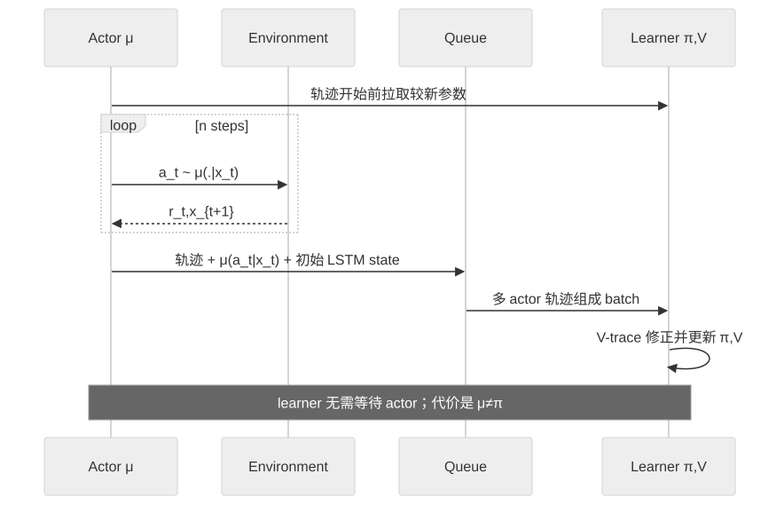

> - **公开入口：** [论文页](https://arxiv.org/abs/1802.01561) · [PDF](https://arxiv.org/pdf/1802.01561) · [正式页面](https://proceedings.mlr.press/v80/espeholt18a.html) · [TeX 源码入口](https://arxiv.org/e-print/1802.01561)
> - **归档：** 2018 · ICML 2018 · 严格策略 RL · 系列第 9/51 篇
> - **模块：** B. 扩展、探索与世界模型
> - 正文中的本地文件名、SHA-256 与版本记录用于说明核验过程；博客不镜像原论文 PDF 或 TeX。

> **一句话地图：** 输入是许多 actor 异步产生的轨迹及其行为策略概率；训练信号是经截断重要性权重修正的多步 TD 误差；集中 learner 更新共享策略与 value；最后得到可扩展到大量机器、多任务共享一套参数的 actor-learner 系统。

## 0. 阅读导航

- 需要的前置概念：A3C/A2C、on-policy 与 off-policy、重要性采样、n-step return、actor-critic、分布式训练。
- 读完应能解释：解耦 actor 与 learner 为什么既提高吞吐又制造 policy lag；V-trace 的 $\rho_t$ 与 $c_t$ 为什么分工不同；系统吞吐与算法数据效率为什么必须分开测。
- 原论文版本与定位口径：本地 23 页 ICML 2018 PDF；页码指 PDF 文件页码，图表/公式按原论文编号。
- 证据标签：**[论文证据]** 为原文数字或论述；**[作者假设]** 为作者明确标作 hypothesis 的解释；**[机制推断]** 为本讲义的可证伪推断。

## 1. 它遇到了什么具体问题？

训练一个 agent 同时玩 30 个 DMLab 任务或 57 个 Atari 游戏，最直觉的办法是增加并行环境。但传统同步 A2C 有“全班等最慢同学”问题：同一 batch 中最慢的环境没返回，GPU 就等着。A3C 让 workers 异步算梯度，却有大量小操作、通信和参数异步问题。

IMPALA 把采样和学习彻底解耦：actor 只跑环境、把整段轨迹塞进队列；learner 在 GPU 上把许多轨迹组成大 batch。这样吞吐提高，但 actor 生成轨迹时用的策略 $\mu$ 可能已落后于 learner 当前策略 $\pi$。旧策略数据若当作 on-policy 数据直接更新，会产生偏差甚至不稳定。

*图 1｜根据相邻正文中的问题、机制或算法流程重绘。*

论文的目标不是“无限并行一定更好”，而是同时处理两个相互冲突的目标：不让环境速度拖住 learner，同时不让异步造成的数据失配毁掉学习。

## 2. 前人怎样解决，为什么仍然不够？

| 路线 | 改了哪一环 | 仍留下什么 |
|---|---|---|
| Distributed A3C | workers 异步产生经验并向参数服务器发梯度 | 每个 worker 的小计算与梯度通信不利于 GPU 大 batch；异步参数更新影响数据效率 |
| Batched A2C | GPU 一次处理一批环境 | step 同步时由最慢环境决定 batch 时间；轨迹同步也要等慢 episode（图 2，PDF 第 2 页） |
| GA3C | 把 acting/forward 与 learning/backward 解耦并动态 batch | actor-learner 异步造成不稳定，原方法用概率加小常数仅部分缓解（PDF 第 2 页） |
| Retrace | 用截断重要性权重做 off-policy 多步修正 | 以 $Q(s,a)$ 为核心；A3C 类 actor-critic 通常只学 $V(s)$（第 2 页） |

IMPALA 的最小干预是：系统层面让 actors 发送轨迹而非梯度，learner 统一大 batch 更新；算法层面用基于 $V$ 的 V-trace 修正行为策略 $\mu$ 与目标策略 $\pi$ 的差异。

## 3. 核心想法：先说人话

可以把 actor 的轨迹看成“用旧版导航软件开出来的路线”，learner 要训练新版导航软件。路线仍有用，但每个路口的选择概率已经变了。

- 若新版和旧版都很可能选择这个动作，这条经验权重大；
- 若旧版常选而新版几乎不选，直接让它主导更新会偏离新版目标；
- 原始重要性比 $\pi(a|x)/\mu(a|x)$ 能校正分布，但多个时间步相乘会爆炸；
- V-trace 截断这些比率，用一点偏差换方差可控，并把远处 TD 误差沿“trace”传回前面状态。

类比边界：V-trace 不会把任意陈旧轨迹变成完全 on-policy 数据。截断 $\rho$ 后，它收敛到介于 $\mu$ 与 $\pi$ 之间的策略价值；policy lag 太大仍会带来偏差。

*图 2｜根据相邻正文中的问题、机制或算法流程重绘。*

## 4. 算法与信息流

*图 3｜根据相邻正文中的问题、机制或算法流程重绘。*

- 采样分布：动作来自 actor 本地行为策略 $\mu$；目标是 learner 当前策略 $\pi$。
- actor 发送：$x_1,a_1,r_1,\ldots,x_n,a_n,r_n$、每步 $\mu(a_t|x_t)$ 和初始 LSTM state（PDF 第 2–3 页）。
- learner 更新：value loss、经 $\rho_s$ 修正的 policy gradient、可选 entropy bonus；所有参数在 learner 集中更新。
- 冻结参数：没有 DQN 式 target network；行为策略概率作为轨迹元数据固定，learner 当前参数继续变化。
- 数据是否循环使用：主架构可以只消费队列；V-trace 消融另设 replay，使 batch 中 50% 项来自 replay，以人为增大 off-policy gap（表 2 附近，PDF 第 6 页）。
- 多 learner：参数分布在同步 learners 上，actors 并行拉取；论文强调同步参数更新对多机数据效率重要（PDF 第 3 页）。

## 5. 公式逐步推导

### 5.1 符号表

| 符号 | 普通含义 | 数学对象/形状 | 从哪里得到 |
|---|---|---|---|
| $\mu(a\mid x)$ | actor 采样时的旧/行为策略 | 动作概率 | 与轨迹一起保存 |
| $\pi(a\mid x)$ | learner 当前/目标策略 | 动作概率 | learner 网络 |
| $V(x)$ | 当前状态价值估计 | 标量 | value head |
| $\rho_t$ | 当前 TD 误差的重要性权重 | 截断非负标量 | $\min(\bar\rho,\pi/\mu)$ |
| $c_t$ | trace 传播权重 | 截断非负标量 | $\min(\bar c,\pi/\mu)$ |
| $v_s$ | 从轨迹计算的 V-trace target | 标量 | 多步加权 TD 误差 |
| $q_s$ | policy gradient 用的动作价值估计 | 标量 | $r_s+\gamma v_{s+1}$ |
| $\bar\rho,\bar c$ | 两种截断上限 | 正标量，要求 $\bar\rho\ge\bar c$ | 超参数 |

### 5.2 从 on-policy n-step return 到 V-trace

当前 value 的一步 TD 误差是

$$
r_t+\gamma V(x_{t+1})-V(x_t).
$$

轨迹来自 $\mu$ 而目标是 $\pi$，先乘截断重要性比：

$$
\delta_tV=\rho_t[r_t+\gamma V(x_{t+1})-V(x_t)],\qquad
\rho_t=\min\left(\bar\rho,\frac{\pi(a_t|x_t)}{\mu(a_t|x_t)}\right).
$$

从时刻 $s$ 向后，把第 $t$ 个 TD 误差按折扣和中间 trace 系数传回：

$$
v_s=V(x_s)+\sum_{t=s}^{s+n-1}
\gamma^{t-s}\left(\prod_{i=s}^{t-1}c_i\right)\delta_tV,
$$

$$
c_i=\min\left(\bar c,\frac{\pi(a_i|x_i)}{\mu(a_i|x_i)}\right).
$$

这是论文公式 (1)（PDF 第 3 页）。若 $\mu=\pi$ 且截断上限至少为 1，则 $\rho_t=c_t=1$。代入后 TD 项望远镜相消：

$$
\begin{aligned}
v_s
&=V(x_s)+\sum_{t=s}^{s+n-1}\gamma^{t-s}
[r_t+\gamma V(x_{t+1})-V(x_t)]\\
&=\sum_{t=s}^{s+n-1}\gamma^{t-s}r_t+\gamma^nV(x_{s+n}),
\end{aligned}
$$

正好退化为普通 on-policy n-step Bellman target（公式 (2)，PDF 第 3 页）。这项退化是代数恒等式，不是经验近似。

### 5.3 $\rho$ 与 $c$ 为什么不能混为一谈

$\rho_t$ 直接乘当前 TD 误差，决定更新的固定点。表格情形下，截断后对应的策略是论文公式 (3)：

$$
\pi_{\bar\rho}(a|x)=
\frac{\min(\bar\rho\mu(a|x),\pi(a|x))}
{\sum_b\min(\bar\rho\mu(b|x),\pi(b|x))}.
$$

- $\bar\rho=\infty$：固定点是目标策略 $V^\pi$，但方差可能很大；
- 有限 $\bar\rho$：固定点是介于 $\mu$ 与 $\pi$ 的 $V^{\pi_{\bar\rho}}$，以偏差换方差；
- $\bar\rho$ 很小时：更接近行为策略价值。

$c_i$ 出现在从远处误差回传的连乘中，控制 trace 长度与方差。附录定理说明，在 $\bar\rho\ge\bar c$、行为分布有充分覆盖等假设下，改变 $\bar c$ 不改变固定点，只改变收缩速度；改变 $\bar\rho$ 才改变固定点（PDF 第 11–13 页）。这是表格/算子层面的结论，不是任意深网的有限样本保证。

### 5.4 递归计算与 actor-critic 更新

V-trace 可从轨迹末端向前递归：

$$
v_s=V(x_s)+\delta_sV+gamma c_s[v_{s+1}-V(x_{s+1})].
$$

value 参数 $\theta$ 沿平方误差下降，等价更新方向为

$$
(v_s-V_\theta(x_s))\nabla_\theta V_\theta(x_s).
$$

policy 参数 $\omega$ 使用

$$
\rho_s\nabla_\omega\log\pi_\omega(a_s|x_s)
[r_s+\gamma v_{s+1}-V_\theta(x_s)].
$$

方括号是 advantage 估计。论文不用 $v_s$ 直接当 $Q(x_s,a_s)$，而用

$$
q_s=r_s+\gamma v_{s+1},
$$

因为在 $V=V^{\pi_{\bar\rho}}$ 完全正确时，$q_s$ 条件期望等于对应 $Q^{\pi_{\bar\rho}}(x_s,a_s)$，而 $v_s$ 不具备同一无偏性质（PDF 第 4 页及附录第 13 页）。

### 5.5 一组小数字走完 V-trace

设三步轨迹中

$$
\gamma=0.9,\quad V(x_0,x_1,x_2,x_3)=(5,6,4,3),
$$

$$
(r_0,r_1,r_2)=(1,0,2),\quad
\frac\pi\mu=(1.5,0.5,2.0).
$$

取论文消融常用的 $\bar\rho=\bar c=1$，所以

$$
\rho=c=(1,0.5,1).
$$

三个修正 TD 误差是

$$
\begin{aligned}
\delta_0&=1(1+0.9\times6-5)=1.4,\\
\delta_1&=0.5(0+0.9\times4-6)=-1.2,\\
\delta_2&=1(2+0.9\times3-4)=0.7.
\end{aligned}
$$

因此

$$
\begin{aligned}
v_0
&=5+1.4+0.9(1)(-1.2)
+0.9^2(1)(0.5)(0.7)\\
&=5.6035.
\end{aligned}
$$

第二步比率只有 0.5，所以最后一个误差向 $x_0$ 传播时也被削半。由递归式先算

$$
v_1=6-1.2+0.9\times0.5\times0.7=5.115,
$$

再得到 policy gradient 的

$$
q_0=r_0+\gamma v_1=1+0.9\times5.115=5.6035,
$$

advantage 为 $q_0-V(x_0)=0.6035$，并乘 $\rho_0=1$。请先自己解释：若不截断第 3 步的比率 2.0，最后一个误差对 $v_0$ 的影响怎样变化？若连续很多比率都大于 1，方差为何会迅速变坏？

## 6. 实验到底检验了什么？

| 研究问题 | 对照与控制变量 | 指标/样本 | 原论文结果与定位 | 能说明什么 | 不能说明什么 |
|---|---|---|---|---|---|
| 解耦是否真的提高吞吐？ | A3C、同步 step/trajectory A2C、动态 batch、不同 IMPALA 规模；浅层网络 | 两个 DMLab 任务，FPS；action repeat 使 FPS 为 agent steps 的 4 倍 | 单机动态 batch IMPALA 为 21K/24K FPS；分布式 A3C 46K/50K；优化 IMPALA batch 128 达 250K FPS，即约 21B frames/day（表 1，PDF 第 5 页） | 架构在该软硬件上显著提高环境帧吞吐 | 不是纯算法速度；CPU/GPU 数量不同，不能按 FPS 直接判断样本效率 |
| V-trace 在 policy gap 变大时是否有用？ | V-trace、1-step IS、$\epsilon$-correction、无修正；有/无 replay | 5 个 DMLab 单任务；24 组超参，报告最好 3 组平均终值；replay 时 batch 50% 为旧数据 | 无 replay 时 V-trace 在 3/5 任务最好；有 replay 时在 4/5 任务优于 1-step，且是唯一在 5 项均从 replay 获益的变体（表 2，PDF 第 6 页） | 多步 trace 在较大 off-policy gap 下比一步近似更稳健 | 选择“最好 3 个超参”不是平均调参鲁棒性；任务仅 5 个 |
| 多任务单模型能否胜过 A3C 与单任务 experts？ | DMLab-30：A3C deep、IMPALA shallow/deep、PBT、8 learners、30 个 experts | mean capped human-normalized score；每任务 500 test episodes | A3C deep 23.8%；IMPALA experts deep 44.5%；IMPALA deep PBT 49.4%；8 learners 49.1%（表 3，PDF 第 7 页） | 单一共享模型在该设置下优于 A3C，并与正迁移一致 | multi-task PBT 与 experts 的调参方式不同，不能单凭 49.4>44.5 证明任务共享是唯一原因 |
| 真实墙钟时间是否缩短？ | DMLab-30 A3C 与 deep IMPALA | 达到相近分数所需时间、FPS | 1 learner 约 10 小时达到 A3C 约 7.5 天接近的表现；8 GPU 从 30K 提至 210K FPS，约 7 倍（图 5–6，PDF 第 7–8 页） | 高吞吐转化成更短实验周转时间 | 使用计算资源不同；不是每单位算力效率比较 |
| 能否用一套参数覆盖 Atari-57？ | A3C/IMPALA experts、Reactor experts、IMPALA multi-task | 每游戏训练 200M frames；multi-task 总计 11.4B；每游戏 200 evaluation episodes | IMPALA deep experts median 191.8%，A3C deep experts 117.9%；单一 multi-task agent median 59.7%（表 4，PDF 第 8 页） | 首次展示单模型在 57 个游戏上与浅层 A3C experts 有竞争力 | multi-task 远低于 deep experts；不能说已消除负迁移 |

## 7. 结果如何理解？

### 系统吞吐与学习质量要分开

**[论文证据]** 表 1 的 250K FPS 是优化后的 500 CPU、1 个 P100 learner 配置；单机 A3C 行只有 CPU。它证明 IMPALA 能把更多资源喂给集中 learner，不是“算法本身比 A3C 快 30 倍”的硬件无关定律。论文随后用学习曲线和 V-trace 消融补上数据效率证据。

### V-trace 消融保留了关键负例

**[论文证据]** 有 replay 时，V-trace 在 task 1 为 47.1，1-step 为 54.7，后者仍更高；所以正确结论是 V-trace 在 4/5 项占优，而不是全面碾压。无 replay 时两者更接近，符合“policy gap 小时复杂修正收益有限”的预期。

### 多任务正迁移的证据强度

**[论文证据]** DMLab-30 的共享 IMPALA deep PBT 49.4% 高于 30 个独立 experts 的 44.5%，并且原文在逐任务附录中指出语言和 laser-tag 等任务出现正迁移。**[边界]** PBT、共享数据量和超参选择并未完全与 expert 条件匹配，因此更稳妥的结论是“观察到与正迁移一致的总体和部分逐任务结果”，不是已识别任务共享的因果效应。

### 作者假设与可证伪预测

**[作者假设]** 单任务中 IMPALA 稳定性可能来自 V-trace 类似 GAE 的作用，以及异步采样带来更丰富 batch（PDF 第 6 页）；论文没有隔离这两者。

**[机制推断]** 若 V-trace 的主要价值是校正 policy lag，则在保持模型、数据量和 batch 相同时，逐渐增加 actor 落后 learner 的更新步数，未修正与一步 IS 的性能应更快下降，V-trace 的优势应随 lag 增大而扩大；当 $\mu=\pi$ 时差异应缩小。附录图（PDF 第 19 页）报告了符合方向的 controlled-lag 结果。可证伪方式是直接测量 $\mathrm{KL}(\mu\|\pi)$、梯度方差和回报；若优势与 lag/KL 无关，则这条解释不足。

## 8. 优点、代价与失效条件

### 优点

- 把系统瓶颈和统计偏差放进同一设计：轨迹队列提高吞吐，V-trace处理由此产生的 off-policy gap。
- $\rho$ 与 $c$ 分工明确，一个控制固定点偏差，一个控制 trace 方差/收敛速度。
- 同时报告 FPS、数据量、墙钟时间、单任务修正消融和多任务结果，证据链较完整。
- 单一参数集覆盖 DMLab-30 与 Atari-57，验证了共享 learner 的多任务可行性。

### 代价

- 需要大量 actor、队列、策略概率元数据和集中 learner，系统实现与调试复杂。
- 截断重要性比引入偏差；$\bar\rho=\bar c=1$ 是论文实验选择，不是无条件最优。
- 高吞吐可能产生更大 policy lag；加机器并不自动提高数据效率。
- 多任务共享一套参数会产生任务干扰，Atari multi-task 59.7% 远低于 deep experts 191.8% median。

### 已观察到的失败

- V-trace 并非每个任务都优于 1-step IS；有 replay 时 task 1 仍落后。
- 8 learners 的 DMLab 最终分数 49.1% 略低于 1 learner PBT 的 49.4%，说明更多计算未提高同样步数下的终值。
- Atari 单一 multi-task agent 虽能竞争 shallow A3C experts，但明显不及 deep IMPALA experts。

### 尚未验证的外推

- 没有语言模型 token 生成、偏好奖励、RLHF 或工具调用实验。
- 理论固定点依赖行为策略覆盖；若 $\mu(a|x)=0$ 而 $\pi(a|x)>0$，旧数据无法提供该动作信息。
- 没有网络故障、队列拥塞、极端 straggler、异构 actor 或通信成本的完整成本模型。
- 没有把计算预算严格归一化，因此不能据此判断最节能配置。

## 9. 它怎样影响后来的大模型强化学习？

**[后续联系，不是本文实验证据]** IMPALA 对大模型 RL 最直接的概念遗产是“rollout workers 与 learner 解耦后，必须显式处理 policy version 差异”。今天若许多推理 worker 用旧 checkpoint 生成长文本，而 learner 持续更新，数据天然带有 policy lag；只追求 tokens/s 会把系统吞吐问题变成统计偏差问题。

可迁移的检查清单是：轨迹是否保存行为策略概率或可重建 log-prob；learner 更新时 target policy 已变化多少；截断权重带来多大有效样本量和偏差；任务混合是否产生正/负迁移。V-trace 公式本身不能无验证地搬到超大词表与长序列，因为 token 概率比连乘、截断偏差和序列级奖励都可能更严重。

## 10. 三个自检问题

1. actor-learner 解耦为何同时制造“吞吐收益”和“policy lag 代价”？如果 learner 停止更新，后者还存在吗？
2. $\bar\rho$ 与 $\bar c$ 分别影响固定点和 trace 传播的哪一部分？为什么不能只说它们都是“截断权重”？
3. DMLab 的 49.4% 对 44.5% 为什么与正迁移一致，却不足以单独证明正迁移的因果机制？

## 11. 原文定位与核验记录

- 原论文：Espeholt et al., ICML 2018；本地 `papers/2018/impala/paper.pdf`。
- PDF 校验和：`a6314455ae8d10055fcfd9848125807ed57449b97b25711eabfe4fa3e54dce0d`。
- 使用的 TeX：`papers/2018/impala/reading/source-expanded.tex`；状态记录为 Hugging Face `scholarweave/arxiv-latex` 文本镜像，可能缺少二进制图片及精确 arXiv 包元数据。
- 关键公式：公式 (1) V-trace target、(2) on-policy 退化、(3) 截断固定点策略、(4) off-policy policy gradient；附录 V-trace operator 与收缩定理。
- 关键图表：图 1–2（架构与时间线，PDF 第 2 页）、表 1（第 5 页）、表 2（第 6 页）、表 3/图 5–6（第 7–8 页）、表 4（第 8 页）、controlled policy lag 图（第 19 页）。
- 二手资料仅用于：未使用；数字来自本地 PDF，并与展开 TeX 交叉核对。
- 尚未核验：论文原始训练日志和绘图数据不在本地镜像中；吞吐未在当前硬件复现实测。

---

本文属于[《强化学习论文精读：2016–2026》](/series/reinforcement-learning-paper-reading/)。
实验数字以文首链接的最终 PDF 为准；图为教学重绘，不是论文原图。
